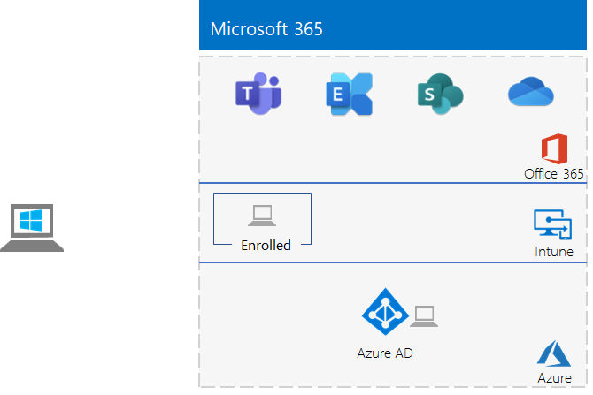

# <a name="identity-and-device-access-prerequisites-for-cloud-only-in-your-microsoft-365-test-environment"></a>Vereisten voor identiteits- en apparaattoegang voor de cloud alleen in uw Microsoft 365-testomgeving.

*Deze Test Lab Guide kan alleen worden gebruikt voor Microsoft 365 voor bedrijfstestomgevingen.*

[Configuraties voor identiteits-](../security/office-365-security/microsoft-365-policies-configurations.md) en apparaattoegang zijn een reeks aanbevolen configuraties en beleidsregels voor voorwaardelijke toegang ter bescherming van de toegang tot alle services die zijn geïntegreerd met Azure Active Directory (Azure AD).

In dit artikel wordt beschreven hoe een Microsoft 365-testomgeving kan worden geconfigureerd die voldoet aan de voorwaarden van de [vereiste configuratie alleen in de cloud](../security/office-365-security/identity-access-prerequisites.md#prerequisites) voor identiteits- en apparaattoegang.

Er zijn acht fasen om deze testomgeving in te stellen:

1. Uw lichte testomgeving uitbouwen
2. Benoemde locaties configureren
3. Self-service voor wachtwoordherstel configureren
4. Meervoudige verificatie configureren
5. Automatische apparaatregistratie inschakelen voor Windows-computers die lid zijn van een domein
6. Wachtwoordbeveiliging voor Azure AD configureren 
7. Azure AD Identity Protection inschakelen
8. Moderne verificatie inschakelen voor Exchange Online en Skype voor Bedrijven Online

## <a name="phase-1-build-out-your-lightweight-microsoft-365-test-environment"></a>Fase 1: uw lichte Microsoft 365-testomgeving uitbouwen

Volg de instructies in [Lichtgewicht basisconfiguratie](lightweight-base-configuration-microsoft-365-enterprise.md).
Dit is de resulterende configuratie.


 
## <a name="phase-2-configure-named-locations"></a>Fase 2: benoemde locaties configureren

Bepaal eerst de openbare IP-adressen of adresbereiken die worden gebruikt door uw organisatie.

Volg daarna de instructies in [Benoemde locaties configureren in Azure Active Directory](https://docs.microsoft.com/azure/active-directory/reports-monitoring/quickstart-configure-named-locations) om de adressen of adresbereiken als benoemde locaties toe te voegen. 

## <a name="phase-3-configure-self-service-password-reset"></a>Fase 3: Selfservice voor het opnieuw instellen van wachtwoorden configureren

Volg de instructies in [Fase 3 van testlabrichtlijn Wachtwoordherstel](password-reset-m365-ent-test-environment.md#phase-3-configure-and-test-password-reset). 

Wanneer u wachtwoordherstel inschakelt voor de accounts in een specifieke Azure AD-groep, voegt u deze accounts toe aan de groep **Wachtwoord opnieuw instellen**:

- Gebruiker 2
- Gebruiker 3
- Gebruiker 4
- Gebruiker 5

Test wachtwoordherstel alleen voor het Gebruiker 2-account.

## <a name="phase-4-configure-multi-factor-authentication"></a>Fase 4: Meervoudige verificatie configureren

Volg de instructies in [Fase 2 van testlabrichtlijn Meervoudige verificatie](multi-factor-authentication-microsoft-365-test-environment.md#phase-2-enable-and-test-multi-factor-authentication-for-the-user-2-account) voor de volgende gebruikersaccounts:

- Gebruiker 2
- Gebruiker 3
- Gebruiker 4
- Gebruiker 5

Test meervoudige verificatie alleen voor het Gebruiker 2-account.

## <a name="phase-5-enable-automatic-device-registration-of-domain-joined-windows-computers"></a>Fase 5: Automatische apparaatregistratie inschakelen voor Windows-computers die lid zijn van een domein 

Volg [deze instructies om](https://docs.microsoft.com/azure/active-directory/devices/hybrid-azuread-join-plan) automatische apparaatregistratie in teschakelen voor Windows-computers die lid zijn van een domein.

## <a name="phase-6-configure-azure-ad-password-protection"></a>Fase 6: Wachtwoordbeveiliging voor Azure AD configureren 

Volg [deze instructies om](https://docs.microsoft.com/azure/active-directory/authentication/concept-password-ban-bad) bekende zwakke wachtwoorden en hun varianten te blokkeren.

## <a name="phase-7-enable-azure-ad-identity-protection"></a>Fase 7: Azure AD Identity Protection inschakelen

Volg de instructies in [Fase 2 van testlabrichtlijn Azure AD Identity Protection](azure-ad-identity-protection-microsoft-365-test-environment.md#phase-2-use-azure-ad-identity-protection). 

## <a name="phase-8-enable-modern-authentication-for-exchange-online-and-skype-for-business-online"></a>Fase 8: Moderne verificatie inschakelen voor Exchange Online en Skype voor Bedrijven Online

Volg voor Exchange Online [deze instructies](https://docs.microsoft.com/Exchange/clients-and-mobile-in-exchange-online/enable-or-disable-modern-authentication-in-exchange-online#enable-or-disable-modern-authentication-in-exchange-online-for-client-connections-in-outlook-2013-or-later). 

Voor Skype voor Bedrijven Online:

1. Maak verbinding met [Skype voor Bedrijven Online](https://docs.microsoft.com/SkypeForBusiness/set-up-your-computer-for-windows-powershell/set-up-your-computer-for-windows-powershell).

2. Voer deze opdracht uit.

  ```powershell
  Set-CsOAuthConfiguration -ClientAdalAuthOverride Allowed
  ```

3. Controleer of het wijzigen met behulp van deze opdracht is gelukt.

  ```powershell
  Get-CsOAuthConfiguration
  ```

Het resultaat is een testomgeving die voldoet aan de vereisten van de configuratie die alleen in de [cloud](../security/office-365-security/identity-access-prerequisites.md#prerequisites) vereist is voor identiteits- en apparaattoegang. 

## <a name="next-step"></a>Volgende stap

Gebruik [algemeen beleid voor identiteits- en apparaattoegang](identity-access-policies.md) voor het configureren van het beleid dat is gebaseerd op de vereisten, en bescherm identiteiten en apparaten.

## <a name="see-also"></a>Zie ook

[Aanvullende testlabrichtlijnen voor identiteit](m365-enterprise-test-lab-guides.md#identity)

[Routekaart voor identiteit](identity-roadmap-microsoft-365.md)

[Microsoft 365 Enterprise-testlabrichtlijnen](m365-enterprise-test-lab-guides.md)

[Overzicht van Microsoft 365 voor ondernemingen](microsoft-365-overview.md)

[Microsoft 365 enterprise-documentatie](https://docs.microsoft.com/microsoft-365-enterprise/)
