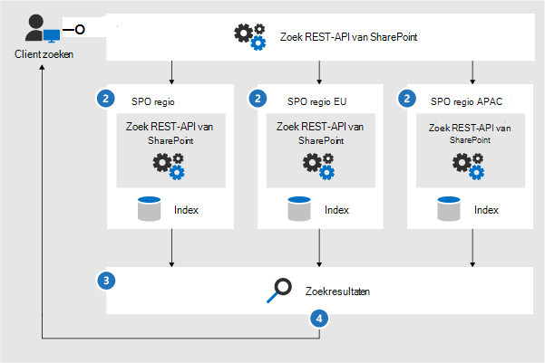
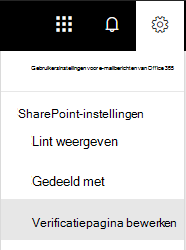
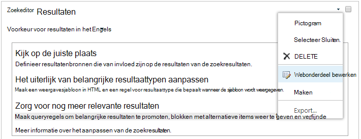

# Zoekfunctie configureren voor Microsoft 365 multi-geoConfigure Search for Microsoft 365 Multi-Geo

In een omgeving met meerdere geografische locaties heeft elke geografische locatie een eigen zoekindex en een zoekcentrum.In a multi-geo environment, each geo location has its own search index and Search Center. Wanneer een gebruiker zoekt, is de query fanned naar alle indexen en worden de geretourneerde resultaten samengevoegd.When a user searches, the query is fanned out to all the indexes, and the returned results are merged.

Een gebruiker in een geografische locatie kan bijvoorbeeld zoeken naar inhoud die is opgeslagen op een andere geografische locatie of voor inhoud op een SharePoint-site die is beperkt tot een andere geografische locatie.For example, a user in one geo location can search for content stored in another geo location, or for content on a SharePoint site that's restricted to a different geo location. Als de gebruiker toegang heeft tot deze inhoud, wordt het resultaat weergegeven in de zoekfunctie.If the user has access to this content, search will show the result.

## Welke Zoek clients werken in een omgeving met meerdere geografische omgevingen?Which search clients work in a multi-geo environment?

Deze clients kunnen resultaten van alle geografische locaties retourneren:These clients can return results from all geo locations:

-   OneDrive voor BedrijvenOneDrive for Business

-   DelveDelve

-   De SharePoint-StartpaginaThe SharePoint home page

-   Het zoekcentrumThe Search Center

-   Aangepaste zoektoepassingen die gebruikmaken van de zoek-API van SharePointCustom search applications that use the SharePoint Search API

### OneDrive voor BedrijvenOneDrive for Business

Zodra de multifunctionele omgeving is ingesteld, krijgen gebruikers die zoeken in OneDrive resultaten van alle geografische locaties.As soon as the multi-geo environment has been set up, users that search in OneDrive get results from all geo locations.

### DelveDelve

Zodra de multifunctionele omgeving is ingesteld, krijgen gebruikers die zoeken in Delve resultaten van alle geografische locaties.As soon as the multi-geo environment has been set up, users that search in Delve get results from all geo locations.

De feed voor Delve en de profielkaart geven alleen voorbeelden weer van bestanden die zijn opgeslagen op de centrale locatie.The Delve feed and the profile card only show previews of files that are stored in the central location. Voor bestanden die zijn opgeslagen op satelliet locaties, wordt in plaats hiervan het pictogram voor het bestandstype weergegeven.For files that are stored in satellite locations, the icon for the file type is shown instead.

### De SharePoint-StartpaginaThe SharePoint home page

Zodra de multi-geografische omgeving is ingesteld, zien gebruikers nieuws, recente en gevolgde sites van meerdere geo-locaties op de startpagina van SharePoint.As soon as the multi-geo environment has been set up, users will see news, recent and followed sites from multiple geo locations on their SharePoint home page. Als ze het zoekvak op de SharePoint-startpagina gebruiken, krijgen ze samenvoegresultaten van meerdere geografische locaties.If they use the search box on the SharePoint home page, they'll get merged results from multiple geo locations.

### Het zoekcentrumThe Search Center

Nadat de omgeving met meerdere geografische omgevingen is ingesteld, blijft elk zoekcentrum alleen resultaten van de eigen geografische locatie weergeven.After the multi-geo environment has been set up, each Search Center continues to only show results from their own geo location. Beheerders moeten [de instellingen van een zoekcentrum wijzigen](#_Set_up_a_1) om resultaten op te doen van alle geografische locaties.Admins must [change the settings of each Search Center](#_Set_up_a_1) to get results from all geo locations. Gebruikers die zoeken in het zoekcentrum krijgen vervolgens resultaten van alle geo-locaties.Afterwards, users that search in the Search Center get results from all geo locations.

### Aangepaste zoektoepassingenCustom search applications

Zoals gebruikelijk werken aangepaste zoektoepassingen interactie met de zoekindexen met behulp van de bestaande SharePoint Search REST-Api's.As usual, custom search applications interact with the search indexes by using the existing SharePoint Search REST APIs. Voor het ophalen van resultaten van alle of van een aantal geografische locaties moet de toepassing [de API aanroepen en de nieuwe parameters voor meervoudige geo-query's opnemen](#_Get_custom_search) in de aanvraag.To get results from all, or some geo locations, the application must [call the API and include the new Multi-Geo query parameters](#_Get_custom_search) in the request. Dit veroorzaakt een ventilator uit de query voor alle geografische locaties.This triggers a fan out of the query to all geo locations.

## Wat is er anders in een zoekopdracht in een multi-geografische omgeving?What's different about search in a multi-geo environment?

Sommige zoekfuncties die u mogelijk kent, werken anders in een omgeving met meerdere geografische gebieden.Some search features you might be familiar with, work differently in a multi-geo environment.

<table>
<thead>
<tr class="header">
<th align="left"><strong>Functie</strong><strong>Feature</strong></th>
<th align="left"><strong>Werking</strong><strong>How it works</strong></th>
<th align="left"><strong>Tijdelijke oplossing</strong><strong>Workaround</strong></th>
</tr>
</thead>
<tbody>
<tr class="odd">
<td align="left">Bevorderde resultatenPromoted results</td>
<td align="left">U kunt op verschillende niveaus queryregels met gepromoveerde resultaten maken: voor de volledige Tenant, voor een siteverzameling of voor een site.You can create query rules with promoted results at different levels: for the whole tenant, for a site collection, or for a site. In een omgeving met meerdere geografische niveaus definieert u gepromoveerde resultaten op tenantniveau, zodat de resultaten van de zoek centrums in alle geografische locaties worden bevorderd.In a multi-geo environment, define promoted results at the tenant level to promote the results to the Search Centers in all geo locations. Als u alleen de resultaten in het zoekcentrum op de geografische locatie van de siteverzameling of site wilt promoveren, definieert u de bevorderde resultaten op siteverzameling of siteniveau.If you only want to promote results in the Search Center that's in the geo location of the site collection or site, define the promoted results at the site collection or site level. Deze resultaten worden niet bevorderd in andere geografische locaties.These results are not promoted in other geo locations.</td>
<td align="left">Als u geen verschillende gepromoveerde resultaten per geografische locatie nodig hebt, zoals voor het reizen, raden we u aan om gepromoveerde resultaten op tenantniveau te definiëren.If you don't need different promoted results per geo location, for example different rules for traveling, we recommend defining promoted results at the tenant level.</td>
</tr>
<tr class="even">
<td align="left">Verfijningen zoekenSearch refiners</td>
<td align="left">De zoekfunctie levert verfijningen op van alle geo-locaties van een Tenant en voegt deze vervolgens samen.Search returns refiners from all the geo locations of a tenant and then aggregates them. De aggregatie is een beste manier, wat betekent dat het aantal verfijningen mogelijk niet 100% nauwkeurig is.The aggregation is a best effort, meaning that the refiner counts might not be 100% accurate. Voor de meeste met een zoekopdracht gebaseerde scenario's is deze nauwkeurigheid voldoende.For most search-driven scenarios, this accuracy is sufficient. 
</td>
<td align="left">Voor toepassingen met een zoekopdracht die afhankelijk zijn van de voltooiing van het verfijnen, voert u een query uit op elke geografische locatie.For search-driven applications that depend on refiner completeness, query each geo location independently.</td>
</tr>
<tr class="odd">
<td align="left"></td>
<td align="left">De zoekfunctie voor meervoudige geo biedt geen ondersteuning voor dynamische buckets voor numerieke verfijningen.Multi-geo search doesn't support dynamic bucketing for numerical refiners.</td>
<td align="left">Gebruik de <a href="https://docs.microsoft.com/sharepoint/dev/general-development/query-refinement-in-sharepoint">parameter ' Discretize '</a> voor numerieke verfijningen.Use the <a href="https://docs.microsoft.com/sharepoint/dev/general-development/query-refinement-in-sharepoint">"Discretize" parameter</a> for numerical refiners.</td>
</tr>
<tr class="even">
<td align="left">Document-Id'sDocument IDs</td>
<td align="left">Houd er rekening mee dat document-Id's in een omgeving met meerdere geografische locaties niet uniek zijn voor geografische locaties als u een zoekopdracht wilt ontwikkelen die afhankelijk is van document-Id's.If you're developing a search-driven application that depends on document IDs, note that document IDs in a multi-geo environment aren't unique across geo locations, they are unique per geo location.</td>
<td align="left">Er is een kolom toegevoegd waarin de geografische locatie wordt aangegeven.We've added a column that identifies the geo location. Gebruik deze kolom om unieke mogelijkheden te verkrijgen.Use this column to achieve uniqueness. Deze kolom heeft de naam GeoLocationSource.This column is named "GeoLocationSource".</td>
</tr>
<tr class="odd">
<td align="left">Aantal resultatenNumber of results</td>
<td align="left">Op de pagina met zoekresultaten worden gecombineerde resultaten van de geo-locaties weergegeven, maar het is niet mogelijk om meer 500 resultaten te bereiken.The search results page shows combined results from the geo locations, but it's not possible to page beyond 500 results.</td>
<td align="left"></td>
</tr>
<tr class="even">
<td align="left">Hybride zoekenHybrid search</td>
<td align="left">In een hybride SharePoint-omgeving met <a href="https://docs.microsoft.com/sharepoint/hybrid/learn-about-cloud-hybrid-search-for-sharepoint">hybride zoeken</a>voor de Cloud wordt on-premises inhoud toegevoegd aan de microsoft 365-index van de centrale locatie.In a hybrid SharePoint environment with <a href="https://docs.microsoft.com/sharepoint/hybrid/learn-about-cloud-hybrid-search-for-sharepoint">cloud hybrid search</a>,  on-premises content is added to the Microsoft 365 index of the central location.</td>
<td align="left"></td>
</tr>
</tbody>
</table>

## Wat wordt er niet ondersteund voor zoeken in een multi-geografische omgeving?What's not supported for search in a multi-geo environment?

Een aantal van de zoekfuncties die u mogelijk kent, wordt niet ondersteund in een omgeving met meerdere geografische omgevingen.Some of the search features you might be familiar with, aren't supported in a multi-geo environment.

<table>
<thead>
<tr class="header">
<th align="left"><strong>Zoekfunctie</strong><strong>Search feature</strong></th>
<th align="left"><strong>Ziet</strong><strong>Note</strong></th>
</tr>
</thead>
<tbody>
<tr class="odd">
<td align="left">Verificatie via appApp-only authentication</td>
<td align="left">Verificatie via een app (geprivilegieerde toegang van Services) wordt niet ondersteund in meerdere geo-zoekopdrachten.App-only authentication (privileged access from services) isn't supported in multi-geo search.</td>
</tr>
<tr class="even">
<td align="left">GastgebruikersGuest users</td>
<td align="left">Gastgebruikers krijgen alleen resultaten van de geografische locatie waarnaar ze zoeken.Guest users only get results from the geo location that they're searching from.</td>
</tr>
</tbody>
</table>

## Hoe werkt zoeken in een omgeving met meerdere geografische gebieden?How does search work in a multi-geo environment?

Alle zoek clients gebruiken de bestaande SharePoint Search REST-Api's om te werken met de zoekindexen.All the search clients use the existing SharePoint Search REST APIs to interact with the search indexes.

1. Een zoekopdracht roept het eindpunt van de zoek REST aan met de queryeigenschap EnableMultiGeoSearch = True.A search client calls the Search REST endpoint with the query property EnableMultiGeoSearch= true.
2. De query wordt verzonden naar alle geografische locaties in de Tenant.The query is sent to all geo locations in the tenant.
3. De zoekresultaten van de geografische locatie worden samengevoegd en geclassificeerd.Search results from each geo location are merged and ranked.
4. De client ontvangt Unified Search Results.The client gets unified search results.

De zoekresultaten worden niet samengevoegd totdat we resultaten van alle geografische locaties hebben ontvangen.Notice that we don't merge the search results until we've received results from all the geo locations. Dit betekent dat er in meerdere geo-zoekopdrachten een extra latentie heeft vergeleken met zoekopdrachten in een omgeving met maar één geografische locatie.This means that multi-geo searches have additional latency compared to searches in an environment with only one geo location.

## Een zoekcentrum weergeven om resultaten van alle geografische locaties weer te gevenGet a Search Center to show results from all geo locations

Elk zoekcentrum heeft diverse verticaal en u moet elke verticaal apart instellen.Each Search Center has several verticals and you have to set up each vertical individually.

1.  Zorg ervoor dat u deze stappen uitvoert met een account dat gemachtigd is om de pagina met zoekresultaten en het webonderdeel zoekresultaten te bewerken.Ensure that you perform these steps with an account that has permission to edit the search results page and the Search Result Web Part.

2.  Ga naar de pagina met zoekresultaten (Zie de [lijst](https://support.office.com/article/174d36e0-2f85-461a-ad9a-8b3f434a4213) met pagina's met zoekresultaten).Navigate to the search results page (see the [list](https://support.office.com/article/174d36e0-2f85-461a-ad9a-8b3f434a4213) of search results pages)

3.  Selecteer de verticaal die u wilt instellen, klik op het tandwiel pictogram **instellingen** in de rechterbovenhoek en klik vervolgens op **pagina bewerken**.Select the vertical to set up, click **Settings** gear icon in the upper, right corner, and then click **Edit Page**. De pagina met zoekresultaten wordt geopend in de bewerkingsmodus.The search results page opens in Edit mode.

     
1.  In het webonderdeel Zoekresultaten plaatst u de aanwijzer in de rechterbovenhoek van het webonderdeel, klikt u op de pijl en klikt u vervolgens op **webonderdeel bewerken** in het menu.In the Search Results Web Part, move the pointer to the upper, right corner of the web part, click the arrow, and then click **Edit Web Part** on the menu. Het taakvenster van het webonderdeel Zoekresultaten wordt geopend onder het lint in de rechterbovenhoek van de pagina.The Search Results Web Part tool pane opens under the ribbon in the top right of the page. 

1.  Selecteer in het taakvenster van het webonderdeel, in de sectie **instellingen** , onder **instellingen voor besturingselementen voor resultaten**de optie **Meervoudige geografische resultaten weergeven** om het webonderdeel zoekresultaten weer te geven voor resultaten van alle geo-locaties.In the Web Part tool pane, in the **Settings** section, under **Results control settings**, select **Show Multi-Geo results** to get the Search Results Web Part to show results from all geo locations.

2.  Klik op **OK** om uw wijzigingen op te slaan en het taakvenster van het webonderdeel te sluiten.Click **OK** to save your change and close the Web Part tool pane.

3.  Controleer de wijzigingen in het webonderdeel zoekresultaten door te klikken op **inchecken** op het tabblad pagina van het hoofdmenu.Check your changes to the Search Results Web Part by clicking **Check-In** on the Page tab of the main menu.

4.  Publiceer de wijzigingen via de koppeling die is opgenomen in de notitie boven aan de pagina.Publish the changes by using the link provided in the note at the top of the page.

## Aangepaste zoektoepassingen aanvragen voor het weergeven van resultaten van alle of een aantal geografische locatiesGet custom search applications to show results from all or some geo locations

Aangepaste zoektoepassingen resulteren in resultaten van alle of enkele geo-locaties door parameters op te geven, met de aanvraag voor de REST van de SharePoint Search REST-API.Custom search applications get results from all, or some, geo locations by specifying query parameters with the request to the SharePoint Search REST API.Afhankelijk van de parameters van de query is de query fanned naar alle geografische locaties of naar een aantal geografische locaties. Depending on the query parameters, the query is fanned out to all geo locations, or to some geo locations. Als u bijvoorbeeld alleen een subset van geografische locaties hoeft te doorzoeken om relevante informatie te vinden, kunt u de waaier slechts voor deze elementen regelen.For example, if you only need to query a subset of geo locations to find relevant information, you can control the fan out to only these. Als het verzoek slaagt, levert de REST van de SharePoint-Zoek REST-API antwoordgegevens op.If the request succeeds, the SharePoint Search REST API returns response data.

**Vereiste****Requirement**

Voor elke geografische locatie moet u ervoor zorgen dat alle gebruikers in de organisatie het machtigingsniveau **lezen** voor de hoofdwebsite hebben gekregen (bijvoorbeeld contoso**APAC**. SharePoint.com/en contoso**EU**. SharePoint.com/).For each geo location, you must ensure that all users in the organization have been granted the **Read** permission level for the root website (for example contoso**APAC**.sharepoint.com/ and contoso**EU**.sharepoint.com/). [Meer informatie over machtigingen](https://support.office.com/article/understanding-permission-levels-in-sharepoint-87ecbb0e-6550-491a-8826-c075e4859848).[Learn about permissions](https://support.office.com/article/understanding-permission-levels-in-sharepoint-87ecbb0e-6550-491a-8826-c075e4859848).

### Query parametersQuery parameters

EnableMultiGeoSearch: dit is een Booleaanse waarde die aangeeft of de query moet worden fanned naar de indexen van andere geografische locaties van de multigeo-Tenant.EnableMultiGeoSearch - This is a Boolean value that specifies whether the query shall be fanned out to the indexes of other geo locations of the multi-geo tenant. Stel deze in op **waar** om de query uit te waaieren. **Onwaar** om de query niet uit te waaieren.Set it to **true** to fan out the query; **false** to not fan out the query. Als u deze parameter niet opneemt, is de standaardwaarde **Onwaar**, behalve wanneer u een rest API-oproep maakt voor een site die gebruikmaakt van de sjabloon Enterprise Search Center, in dit geval de standaardwaarde **waar**is.If you don't include this parameter, the default value is **false**, except when making a REST API call against a site which uses the Enterprise Search Center template, in this case the default value is **true**. Als u de parameter in een omgeving gebruikt die geen deel uitmaakt van meerdere geografische regels, wordt de parameter genegeerd.If you use the parameter in an environment that isn't multi-geo, the parameter is ignored.

ClientType: dit is een tekenreeks.ClientType - This is a string. Voer voor elke zoektoepassing een unieke naam voor de client in.Enter a unique client name for each search application. Als u deze parameter niet opneemt, is de query niet fanned naar andere geo-locaties.If you don't include this parameter, the query is not fanned out to other geo locations.

MultiGeoSearchConfiguration: dit is een optionele lijst met de geografische locaties in de Tenant Tenant om de query uit te waaieren op als **EnableMultiGeoSearch** **waar**is.MultiGeoSearchConfiguration - This is an optional list of which geo locations in the multi-geo tenant to fan the query out to when **EnableMultiGeoSearch** is **true**. Als u deze parameter niet opneemt of leeg laat, is de query fanned naar alle geografische locaties.If you don't include this parameter, or leave it blank, the query is fanned out to all geo locations. Voor elke geografische locatie voert u de volgende items in, in JSON-indeling:For each geo location, enter the following items, in JSON format:

<table>
<thead>
<tr class="header">
<th align="left">ItemItem</th>
<th align="left">BeschrijvingDescription</th>
</tr>
</thead>
<tbody>
<tr class="odd">
<td align="left">DataLocationDataLocation</td>
<td align="left">De geografische locatie van bijvoorbeeld de vestiging.The geo location, for example NAM.</td>
</tr>
<tr class="even">
<td align="left">ConversatieEndPoint</td>
<td align="left">Het eindpunt waarmee u verbinding wilt maken, bijvoorbeeld https://contoso.sharepoint.comThe endpoint to connect to, for example https://contoso.sharepoint.com</td>
</tr>
<tr class="odd">
<td align="left">IdSourceId</td>
<td align="left">De GUID van de resultatenbron, bijvoorbeeld B81EAB55-3140-4312-B0F4-9459D1B4FFEE.The GUID of the result source, for example B81EAB55-3140-4312-B0F4-9459D1B4FFEE.</td>
</tr>
</tbody>
</table>

Als u DataLocation of eindpunt weglaat, of als een DataLocation wordt gedupliceerd, mislukt de aanvraag.If you omit DataLocation or EndPoint, or if a DataLocation is duplicated, the request fails. [U vindt informatie over het eindpunt van de geografische locaties van een Tenant met behulp van Microsoft Graph](https://docs.microsoft.com/sharepoint/dev/solution-guidance/multigeo-discovery).[You can get information about the endpoint of a tenant's geo locations by using Microsoft Graph](https://docs.microsoft.com/sharepoint/dev/solution-guidance/multigeo-discovery).

### AntwoordgegevensResponse data

MultiGeoSearchStatus: dit is een eigenschap die de SharePoint-zoek-API retourneert in antwoord op een aanvraag.MultiGeoSearchStatus – This is a property that the SharePoint Search API returns in response to a request. De waarde van de eigenschap is een tekenreeks die de volgende informatie oplevert over de resultaten die de SharePoint-zoek-API retourneert:The value of the property is a string and gives the following information about the results that the SharePoint Search API returns:

<table>
<thead>
<tr class="header">
<th align="left">ValueValue</th>
<th align="left">BeschrijvingDescription</th>
</tr>
</thead>
<tbody>
<tr class="odd">
<td align="left">VolFull</td>
<td align="left">Volledige resultaten van <strong>alle</strong> geografische locaties.Full results from <strong>all</strong> the geo locations.</td>
</tr>
<tr class="even">
<td align="left">PartijdigPartial</td>
<td align="left">Gedeeltelijke resultaten van een of meer geo-locaties.Partial results from one or more geo locations. De resultaten zijn onvolledig vanwege een tijdelijke fout.The results are incomplete due to a transient error.</td>
</tr>

</tbody>
</table>

### Query met behulp van de REST dienstQuery using the REST service

Met een aanvraag voor ophalen geeft u de queryparameters op in de URL.With a GET request, you specify the query parameters in the URL. Met een bericht na een bericht geeft u de queryparameters in de hoofdtekst in de JSON-indeling (Object Notation) door.With a POST request, you pass the query parameters in the body in JavaScript Object Notation (JSON) format.

#### Kopteksten aanvragenRequest headers

<table>
<thead>
<tr class="header">
<th align="left">NameName</th>
<th align="left">ValueValue</th>
</tr>
</thead>
<tbody>
<tr class="odd">
<td align="left">Inhouds typeContent-Type</td>
<td align="left">application/json; odata = uitgebreidapplication/json;odata=verbose</td>
</tr>
</tbody>
</table>

#### Voorbeeld van een aanvraag voor het aanvragen van fanned naar **alle** geo-locatiesSample GET request that's fanned out to **all** geo locations

https:// \<tenant\> / \_ API/search/query? QueryText = ' SharePoint ' &Properties = ' EnableMultiGeoSearch: True ' &ClientType = ' mijn \_ client \_ -id 'https:// \<tenant\>/\_api/search/query?querytext='sharepoint'&Properties='EnableMultiGeoSearch:true'&ClientType='my\_client\_id'

#### Voorbeeld van aanvraag voor het aanvragen van een uitwaaiering voor **een aantal** geografische locatiesSample GET request to fan out to **some** geo locations

https:// \<tenant\> / \_ API/search/query? QueryText = ' site ' &ClientType = ' my_client_id ' &eigenschappen = ' EnableMultiGeoSearch: True, MultiGeoSearchConfiguration: [{DataLocation \\ : "naam" \\ , eindpunt \\ : "https \\ ://contosoNAM.SharePoint.com" \\ , SourceId \\ : "B81EAB55-3140-4312-B0F4-9459D1B4FFEE"} \\ , {DataLocation: " \\ can" \\ , eindpunt \\ : "https \\ ://contosoCAN.SharePoint-DF.com"}] "https:// \<tenant\>/\_api/search/query?querytext='site'&ClientType='my_client_id'&Properties='EnableMultiGeoSearch:true, MultiGeoSearchConfiguration:[{DataLocation\\:"NAM"\\,Endpoint\\:"https\\://contosoNAM.sharepoint.com"\\,SourceId\\:"B81EAB55-3140-4312-B0F4-9459D1B4FFEE"}\\,{DataLocation\\:"CAN"\\,Endpoint\\:"https\\://contosoCAN.sharepoint-df.com"}]'

> [!NOTE]
> Komma's en dubbele punten in de lijst met geografische locaties voor de eigenschap MultiGeoSearchConfiguration worden voorafgegaan door het **backslash** teken.Commas and colons in the list of geo locations for the MultiGeoSearchConfiguration property are preceded by the **backslash** character. Dit komt doordat aanvragen voor aanvragen gebruikmaken van dubbele puntjes om eigenschappen en komma's te scheiden en de argumenten van eigenschappen te scheiden.This is because GET requests use colons to separate properties and commas to separate arguments of properties. Zonder backslash als een escape-teken, wordt de eigenschap MultiGeoSearchConfiguration niet op de juiste wijze geïnterpreteerd.Without the backslash as an escape character, the MultiGeoSearchConfiguration property is interpreted wrongly.

#### Voorbeeld van een bericht dat is fanned naar **alle** geografische locatiesSample POST request that's fanned out to **all** geo locations

    {
        "request": {
            "__metadata": {
            "type": "Microsoft.Office.Server.Search.REST.SearchRequest"
        },
        "Querytext": "sharepoint",
        "Properties": {
            "results": [
                {
                    "Name": "EnableMultiGeoSearch",
                    "Value": {
                        "QueryPropertyValueTypeIndex": 3,
                        "BoolVal": true
                    }
                }
            ]
        },
        "ClientType": "my_client_id"
        }
    }

#### Voorbeeld van een bericht dat is fanned naar **een aantal** geografische locatiesSample POST request that's fanned out to **some** geo locations

    {
        "request": {
            "Querytext": "SharePoint",
            "ClientType": "my_client_id",
            "Properties": {
                "results": [
                    {
                        "Name": "EnableMultiGeoSearch",
                        "Value": {
                            "QueryPropertyValueTypeIndex": 3,
                            "BoolVal": true
                        }
                    },
                    {
                        "Name": "MultiGeoSearchConfiguration",
                        "Value": {
                        "StrVal": "[{\"DataLocation\":\"NAM\",\"Endpoint\":\"https://contoso.sharepoint.com\",\"SourceId\":\"B81EAB55-3140-4312-B0F4-9459D1B4FFEE\"},{\"DataLocation\":\"CAN\",\"Endpoint\":\"https://contosoCAN.sharepoint.com\"}]",
                            "QueryPropertyValueTypeIndex": 1
                        }
                    }
                ]
            }
        }
    }

### Query met behulp van CSOMQuery using CSOM

Hier ziet u een voorbeeld van een CSOM-query die is fanned voor **alle** geo-locaties:Here's a sample CSOM query that's fanned out to **all** geo locations:

    var keywordQuery = new KeywordQuery(ctx);
    keywordQuery.QueryText = query.SearchQueryText;
    keywordQuery.ClientType = <enter a string here>;
    keywordQuery["EnableMultiGeoSearch"] = true;

