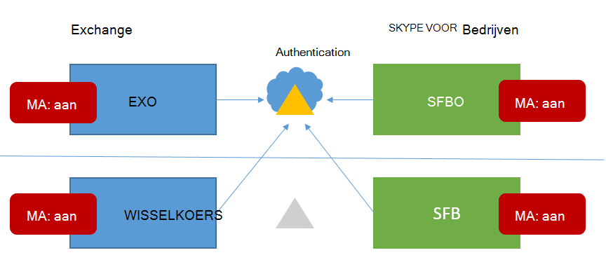

# <a name="how-to-configure-skype-for-business-on-premises-to-use-hybrid-modern-authentication"></a><span data-ttu-id="9a0fd-103">On-premises Skype voor Bedrijven configureren voor hybride moderne verificatie</span><span class="sxs-lookup"><span data-stu-id="9a0fd-103">How to configure Skype for Business on-premises to use Hybrid Modern Authentication</span></span>

<span data-ttu-id="9a0fd-104">*Dit artikel is van toepassing op Microsoft 365 Enterprise en Office 365 Enterprise.*</span><span class="sxs-lookup"><span data-stu-id="9a0fd-104">*This article applies to both Microsoft 365 Enterprise and Office 365 Enterprise.*</span></span>

<span data-ttu-id="9a0fd-105">Moderne verificatie is een methode voor identiteitsbeheer die veiligere gebruikersverificatie en autorisatie biedt, beschikbaar is voor on-premises Skype voor Bedrijven server on-premises en Exchange server on-premises en hybride Skype voor Bedrijven splitsdomeinen.</span><span class="sxs-lookup"><span data-stu-id="9a0fd-105">Modern Authentication, is a method of identity management that offers more secure user authentication and authorization, is available for Skype for Business server on-premises and Exchange server on-premises, and split-domain Skype for Business hybrids.</span></span>

 <span data-ttu-id="9a0fd-106">**Belangrijk** Wilt u meer weten over moderne verificatie (MA) en waarom u deze misschien liever gebruikt in uw bedrijf of organisatie?</span><span class="sxs-lookup"><span data-stu-id="9a0fd-106">**Important** Would you like to know more about Modern Authentication (MA) and why you might prefer to use it in your company or organization?</span></span> <span data-ttu-id="9a0fd-107">Controleer [dit document](hybrid-modern-auth-overview.md) voor een overzicht.</span><span class="sxs-lookup"><span data-stu-id="9a0fd-107">Check [this document](hybrid-modern-auth-overview.md) for an overview.</span></span> <span data-ttu-id="9a0fd-108">Als u wilt weten welke Skype voor Bedrijven worden ondersteund met MA, wordt dat hier beschreven.</span><span class="sxs-lookup"><span data-stu-id="9a0fd-108">If you need to know what Skype for Business topologies are supported with MA, that's documented here!</span></span>

 <span data-ttu-id="9a0fd-109">**Voordat we beginnen,** gebruik ik de volgende termen:</span><span class="sxs-lookup"><span data-stu-id="9a0fd-109">**Before we begin**, I use these terms:</span></span>

- <span data-ttu-id="9a0fd-110">Moderne verificatie (MA)</span><span class="sxs-lookup"><span data-stu-id="9a0fd-110">Modern Authentication (MA)</span></span>

- <span data-ttu-id="9a0fd-111">Hybride moderne verificatie (HMA)</span><span class="sxs-lookup"><span data-stu-id="9a0fd-111">Hybrid Modern Authentication (HMA)</span></span>

- <span data-ttu-id="9a0fd-112">Exchange on-premises (EXCH)</span><span class="sxs-lookup"><span data-stu-id="9a0fd-112">Exchange on-premises (EXCH)</span></span>

- <span data-ttu-id="9a0fd-113">Exchange Online (EXO)</span><span class="sxs-lookup"><span data-stu-id="9a0fd-113">Exchange Online (EXO)</span></span>

- <span data-ttu-id="9a0fd-114">Skype voor Bedrijven on-premises (SFB)</span><span class="sxs-lookup"><span data-stu-id="9a0fd-114">Skype for Business on-premises (SFB)</span></span>

- <span data-ttu-id="9a0fd-115">Skype voor Bedrijven Online (SFBO)</span><span class="sxs-lookup"><span data-stu-id="9a0fd-115">Skype for Business Online (SFBO)</span></span>

<span data-ttu-id="9a0fd-116">Als een afbeelding in dit artikel een object bevat dat grijs of grijs is,  betekent dit dat het element dat in grijs wordt weergegeven, niet is opgenomen in ma-specifieke configuratie.</span><span class="sxs-lookup"><span data-stu-id="9a0fd-116">Also, if a graphic in this article has an object that's grayed-out or dimmed that means the element shown in gray **isn't** included in MA-specific configuration.</span></span>

## <a name="read-the-summary"></a><span data-ttu-id="9a0fd-117">De samenvatting lezen</span><span class="sxs-lookup"><span data-stu-id="9a0fd-117">Read the summary</span></span>

<span data-ttu-id="9a0fd-118">In deze samenvatting wordt het proces in stappen op een gegeven moment in de loop van de uitvoering samengevat en is het goed voor een algemene controlelijst om bij te houden waar u zich in het proces kunt vinden.</span><span class="sxs-lookup"><span data-stu-id="9a0fd-118">This summary breaks down the process into steps that might otherwise get lost during the execution, and is good for an overall checklist to keep track of where you are in the process.</span></span>

1. <span data-ttu-id="9a0fd-119">Zorg er eerst voor dat u aan alle vereisten voldoet.</span><span class="sxs-lookup"><span data-stu-id="9a0fd-119">First, make sure you meet all the prerequisites.</span></span>

1. <span data-ttu-id="9a0fd-120">Aangezien veel vereisten gebruikelijk zijn voor zowel Skype voor Bedrijven als Exchange, bekijkt u het **overzichtsartikel** voor [uw controlelijst vooraf.](hybrid-modern-auth-overview.md)</span><span class="sxs-lookup"><span data-stu-id="9a0fd-120">Since many **prerequisites** are common for both Skype for Business and Exchange, [see the overview article for your pre-req checklist](hybrid-modern-auth-overview.md).</span></span> <span data-ttu-id="9a0fd-121">Doe dit  *voordat*  u een van de stappen in dit artikel start.</span><span class="sxs-lookup"><span data-stu-id="9a0fd-121">Do this  *before*  you begin any of the steps in this article.</span></span>

1. <span data-ttu-id="9a0fd-122">Verzamel de HMA-specifieke gegevens die u nodig hebt in een bestand of OneNote.</span><span class="sxs-lookup"><span data-stu-id="9a0fd-122">Collect the HMA-specific info you'll need in a file, or OneNote.</span></span>

1. <span data-ttu-id="9a0fd-123">Moderne verificatie voor EXO inschakelen (als deze nog niet is ingeschakeld).</span><span class="sxs-lookup"><span data-stu-id="9a0fd-123">Turn ON Modern Authentication for EXO (if it isn't already turned on).</span></span>

1. <span data-ttu-id="9a0fd-124">Moderne verificatie voor SFBO inschakelen (als deze nog niet is ingeschakeld).</span><span class="sxs-lookup"><span data-stu-id="9a0fd-124">Turn ON Modern Authentication for SFBO (if it isn't already turned on).</span></span>

1. <span data-ttu-id="9a0fd-125">Schakel Hybride moderne verificatie in voor Exchange on-premises.</span><span class="sxs-lookup"><span data-stu-id="9a0fd-125">Turn ON Hybrid Modern Authentication for Exchange on-premises.</span></span>

1. <span data-ttu-id="9a0fd-126">Schakel Hybride moderne verificatie in voor Skype voor Bedrijven on-premises.</span><span class="sxs-lookup"><span data-stu-id="9a0fd-126">Turn ON Hybrid Modern Authentication for Skype for Business on-premises.</span></span>

<span data-ttu-id="9a0fd-127">Met deze stappen worden MA voor SFB, SFBO, EXCH en EXO in gebruik genomen, dat wil zeggen alle producten die kunnen deelnemen aan een HMA-configuratie van SFB en SFBO (inclusief afhankelijkheden van EXCH/EXO).</span><span class="sxs-lookup"><span data-stu-id="9a0fd-127">These steps turn on MA for SFB, SFBO, EXCH, and EXO - that is, all the products that can participate in an HMA configuration of SFB and SFBO (including dependencies on EXCH/EXO).</span></span> <span data-ttu-id="9a0fd-128">Met andere woorden: als uw gebruikers zijn thuisgekomen in of postvakken hebben gemaakt in een deel van de Hybride (EXO + SFBO, EXO + SFB, EXCH + SFBO of EXCH + SFB), ziet uw eindproduct er als volgende uit:</span><span class="sxs-lookup"><span data-stu-id="9a0fd-128">In other words, if your users are homed in/have mailboxes created in any part of the Hybrid (EXO + SFBO, EXO + SFB, EXCH + SFBO, or EXCH + SFB), your finished product will look like this:</span></span>



<span data-ttu-id="9a0fd-130">Zoals u kunt zien zijn er vier verschillende locaties om MA in te zetten!</span><span class="sxs-lookup"><span data-stu-id="9a0fd-130">As you can see there are four different places to turn on MA!</span></span> <span data-ttu-id="9a0fd-131">Voor de beste gebruikerservaring raden we u aan ma in te zetten op alle vier deze locaties.</span><span class="sxs-lookup"><span data-stu-id="9a0fd-131">For the best user experience, we recommend you turn on MA in all four of these locations.</span></span> <span data-ttu-id="9a0fd-132">Als u ma niet op al deze locaties kunt in- of uitstellen, past u de stappen aan zodat u MA alleen in de locaties in kunt zetten die nodig zijn voor uw omgeving.</span><span class="sxs-lookup"><span data-stu-id="9a0fd-132">If you can't turn MA on in all these locations, adjust the steps so that you turn on MA only in the locations that are necessary for your environment.</span></span>

<span data-ttu-id="9a0fd-133">Zie het [onderwerp Ondersteuning voor Skype voor Bedrijven met MA](/skypeforbusiness/plan-your-deployment/modern-authentication/topologies-supported) voor ondersteunde excuses.</span><span class="sxs-lookup"><span data-stu-id="9a0fd-133">See the [Supportability topic for Skype for Business with MA](/skypeforbusiness/plan-your-deployment/modern-authentication/topologies-supported) for supported topologies.</span></span>

 <span data-ttu-id="9a0fd-134">**Belangrijk** Controleer of u aan alle vereisten hebt voldaan voordat u begint.</span><span class="sxs-lookup"><span data-stu-id="9a0fd-134">**Important** Double-check that you've met all the prerequisites before you begin.</span></span> <span data-ttu-id="9a0fd-135">U vindt deze informatie in hybride [moderne verificatieoverzicht en vereisten.](hybrid-modern-auth-overview.md)</span><span class="sxs-lookup"><span data-stu-id="9a0fd-135">You'll find that information in [Hybrid modern authentication overview and prerequisites](hybrid-modern-auth-overview.md).</span></span>

## <a name="collect-all-hma-specific-info-youll-need"></a><span data-ttu-id="9a0fd-136">Alle HMA-specifieke gegevens verzamelen die u nodig hebt</span><span class="sxs-lookup"><span data-stu-id="9a0fd-136">Collect all HMA-specific info you'll need</span></span>

<span data-ttu-id="9a0fd-137">Nadat u hebt gecontroleerd of u [](hybrid-modern-auth-overview.md) voldoet aan de vereisten voor het gebruik van moderne verificatie (zie de opmerking hierboven), moet u een bestand maken om de gegevens vast te houden die u nodig hebt voor het configureren van HMA in de volgende stappen.</span><span class="sxs-lookup"><span data-stu-id="9a0fd-137">After you've double-checked that you meet the [prerequisites](hybrid-modern-auth-overview.md) to use Modern Authentication (see the note above), you should create a file to hold the info you'll need for configuring HMA in the steps ahead.</span></span> <span data-ttu-id="9a0fd-138">Voorbeelden die in dit artikel worden gebruikt:</span><span class="sxs-lookup"><span data-stu-id="9a0fd-138">Examples used in this article:</span></span>

- <span data-ttu-id="9a0fd-139">**SIP/SMTP-domein**</span><span class="sxs-lookup"><span data-stu-id="9a0fd-139">**SIP/SMTP domain**</span></span>

  - <span data-ttu-id="9a0fd-140">Ex.</span><span class="sxs-lookup"><span data-stu-id="9a0fd-140">Ex.</span></span> <span data-ttu-id="9a0fd-141">contoso.com (wordt federatief met Office 365)</span><span class="sxs-lookup"><span data-stu-id="9a0fd-141">contoso.com (is federated with Office 365)</span></span>

- <span data-ttu-id="9a0fd-142">**Tenant-id**</span><span class="sxs-lookup"><span data-stu-id="9a0fd-142">**Tenant ID**</span></span>

  - <span data-ttu-id="9a0fd-143">De GUID die uw Office 365 tenant vertegenwoordigt (bij het aanmelden van contoso.onmicrosoft.com).</span><span class="sxs-lookup"><span data-stu-id="9a0fd-143">The GUID that represents your Office 365 tenant (at the login of contoso.onmicrosoft.com).</span></span>

- <span data-ttu-id="9a0fd-144">**URL's voor SFB 2015 CU5-webservice**</span><span class="sxs-lookup"><span data-stu-id="9a0fd-144">**SFB 2015 CU5 Web Service URLs**</span></span>

<span data-ttu-id="9a0fd-145">u hebt url's voor interne en externe webservice nodig voor alle SfB 2015-pools die zijn geïmplementeerd.</span><span class="sxs-lookup"><span data-stu-id="9a0fd-145">you'll need internal and external web service URLs for all SfB 2015 pools deployed.</span></span> <span data-ttu-id="9a0fd-146">Als u deze wilt verkrijgen, gaat u als volgt te werk Skype voor Bedrijven Management Shell:</span><span class="sxs-lookup"><span data-stu-id="9a0fd-146">To obtain these, run the following from Skype for Business Management Shell:</span></span>

```powershell
Get-CsService -WebServer | Select-Object PoolFqdn, InternalFqdn, ExternalFqdn | FL
```

- <span data-ttu-id="9a0fd-147">Ex.</span><span class="sxs-lookup"><span data-stu-id="9a0fd-147">Ex.</span></span> <span data-ttu-id="9a0fd-148">Intern: https://lyncwebint01.contoso.com</span><span class="sxs-lookup"><span data-stu-id="9a0fd-148">Internal: https://lyncwebint01.contoso.com</span></span>

- <span data-ttu-id="9a0fd-149">Ex.</span><span class="sxs-lookup"><span data-stu-id="9a0fd-149">Ex.</span></span> <span data-ttu-id="9a0fd-150">Extern: https://lyncwebext01.contoso.com</span><span class="sxs-lookup"><span data-stu-id="9a0fd-150">External: https://lyncwebext01.contoso.com</span></span>

<span data-ttu-id="9a0fd-151">Als u een server Standard Edition gebruikt, is de interne URL leeg.</span><span class="sxs-lookup"><span data-stu-id="9a0fd-151">If you're using a Standard Edition server, the internal URL will be blank.</span></span> <span data-ttu-id="9a0fd-152">Gebruik in dit geval de poolfqdn voor de interne URL.</span><span class="sxs-lookup"><span data-stu-id="9a0fd-152">In this case, use the pool fqdn for the internal URL.</span></span>

## <a name="turn-on-modern-authentication-for-exo"></a><span data-ttu-id="9a0fd-153">Moderne verificatie voor EXO inschakelen</span><span class="sxs-lookup"><span data-stu-id="9a0fd-153">Turn on Modern Authentication for EXO</span></span>

<span data-ttu-id="9a0fd-154">Volg de instructies hier: Exchange Online: Uw tenant inschakelen [voor moderne verificatie.](https://social.technet.microsoft.com/wiki/contents/articles/32711.exchange-online-how-to-enable-your-tenant-for-modern-authentication.aspx)</span><span class="sxs-lookup"><span data-stu-id="9a0fd-154">Follow the instructions here: [Exchange Online: How to enable your tenant for modern authentication.](https://social.technet.microsoft.com/wiki/contents/articles/32711.exchange-online-how-to-enable-your-tenant-for-modern-authentication.aspx)</span></span>

## <a name="turn-on-modern-authentication-for-sfbo"></a><span data-ttu-id="9a0fd-155">Moderne verificatie voor SFBO inschakelen</span><span class="sxs-lookup"><span data-stu-id="9a0fd-155">Turn on Modern Authentication for SFBO</span></span>

<span data-ttu-id="9a0fd-156">Volg de instructies hier: [Skype voor Bedrijven Online: Uw tenant inschakelen voor moderne verificatie.](https://social.technet.microsoft.com/wiki/contents/articles/34339.skype-for-business-online-enable-your-tenant-for-modern-authentication.aspx)</span><span class="sxs-lookup"><span data-stu-id="9a0fd-156">Follow the instructions here: [Skype for Business Online: Enable your tenant for modern authentication](https://social.technet.microsoft.com/wiki/contents/articles/34339.skype-for-business-online-enable-your-tenant-for-modern-authentication.aspx).</span></span>

## <a name="turn-on-hybrid-modern-authentication-for-exchange-on-premises"></a><span data-ttu-id="9a0fd-157">Hybride moderne verificatie inschakelen voor Exchange on-premises</span><span class="sxs-lookup"><span data-stu-id="9a0fd-157">Turn on Hybrid Modern Authentication for Exchange on-premises</span></span>

<span data-ttu-id="9a0fd-158">Volg de instructies hier: [Het configureren Exchange Server on-premises](configure-exchange-server-for-hybrid-modern-authentication.md)voor het gebruik van hybride moderne verificatie.</span><span class="sxs-lookup"><span data-stu-id="9a0fd-158">Follow the instructions here: [How to configure Exchange Server on-premises to use Hybrid Modern Authentication](configure-exchange-server-for-hybrid-modern-authentication.md).</span></span>

## <a name="turn-on-hybrid-modern-authentication-for-skype-for-business-on-premises"></a><span data-ttu-id="9a0fd-159">Hybride moderne verificatie inschakelen voor Skype voor Bedrijven on-premises</span><span class="sxs-lookup"><span data-stu-id="9a0fd-159">Turn on Hybrid Modern Authentication for Skype for Business on-premises</span></span>

### <a name="add-on-premises-web-service-urls-as-spns-in-azure-active-directory"></a><span data-ttu-id="9a0fd-160">On-premises webservice-URL's toevoegen als SPN's in Azure Active Directory</span><span class="sxs-lookup"><span data-stu-id="9a0fd-160">Add on-premises web service URLs as SPNs in Azure Active Directory</span></span>

<span data-ttu-id="9a0fd-161">Nu moet u opdrachten uitvoeren om de URL's (eerder verzameld) toe te voegen als Service principals in SFBO.</span><span class="sxs-lookup"><span data-stu-id="9a0fd-161">Now you'll need to run commands to add the URLs (collected earlier) as Service Principals in SFBO.</span></span>

 <span data-ttu-id="9a0fd-162">**Opmerking** Service principal names (SPN's) identificeren webservices en koppelen deze aan een beveiligingsprincipaal (zoals een accountnaam of groep), zodat de service kan optreden namens een geautoriseerde gebruiker.</span><span class="sxs-lookup"><span data-stu-id="9a0fd-162">**Note** Service principal names (SPNs) identify web services and associate them with a security principal (such as an account name or group) so that the service can act on the behalf of an authorized user.</span></span> <span data-ttu-id="9a0fd-163">Clients die worden authentiek gemaakt op een server, maken gebruik van informatie die is opgenomen in SPN's.</span><span class="sxs-lookup"><span data-stu-id="9a0fd-163">Clients authenticating to a server make use of information that's contained in SPNs.</span></span>

1. <span data-ttu-id="9a0fd-164">Maak eerst verbinding met Azure Active Directory (Azure AD) met [deze instructies.](/powershell/azure/active-directory/overview)</span><span class="sxs-lookup"><span data-stu-id="9a0fd-164">First, connect to Azure Active Directory (Azure AD) with [these instructions](/powershell/azure/active-directory/overview).</span></span>

2. <span data-ttu-id="9a0fd-165">Voer deze opdracht on-premises uit om een lijst met URL's voor SFB-webservice te krijgen.</span><span class="sxs-lookup"><span data-stu-id="9a0fd-165">Run this command, on-premises, to get a list of SFB web service URLs.</span></span>

   <span data-ttu-id="9a0fd-166">Houd er rekening mee dat de AppPrincipalId begint met `00000004` .</span><span class="sxs-lookup"><span data-stu-id="9a0fd-166">Note that the AppPrincipalId begins with `00000004`.</span></span> <span data-ttu-id="9a0fd-167">Dit komt overeen met Skype voor Bedrijven Online.</span><span class="sxs-lookup"><span data-stu-id="9a0fd-167">This corresponds to Skype for Business Online.</span></span>

   <span data-ttu-id="9a0fd-168">Noteer (en schermafbeelding voor latere vergelijking) de uitvoer van deze opdracht, die een SE- en WS-URL bevat, maar meestal bestaat uit SPN's die beginnen `00000004-0000-0ff1-ce00-000000000000/` met .</span><span class="sxs-lookup"><span data-stu-id="9a0fd-168">Take note of (and screenshot for later comparison) the output of this command, which will include an SE and WS URL, but mostly consist of SPNs that begin with `00000004-0000-0ff1-ce00-000000000000/`.</span></span>

```powershell
Get-MsolServicePrincipal -AppPrincipalId 00000004-0000-0ff1-ce00-000000000000 | Select -ExpandProperty ServicePrincipalNames
```

3. <span data-ttu-id="9a0fd-169">Als de interne of **externe** SFB-URL's van on-premises ontbreken (bijvoorbeeld, en we moeten deze specifieke https://lyncwebint01.contoso.com records toevoegen aan deze https://lyncwebext01.contoso.com) lijst.</span><span class="sxs-lookup"><span data-stu-id="9a0fd-169">If the internal **or** external SFB URLs from on-premises are missing (for example, https://lyncwebint01.contoso.com and https://lyncwebext01.contoso.com) we will need to add those specific records to this list.</span></span>

    <span data-ttu-id="9a0fd-170">Zorg ervoor dat u  *de onderstaande voorbeeld-URL's* vervangt door uw werkelijke URL's in de opdrachten Toevoegen!</span><span class="sxs-lookup"><span data-stu-id="9a0fd-170">Be sure to replace  *the example URLs* below with your actual URLs in the Add commands!</span></span>

```powershell
$x= Get-MsolServicePrincipal -AppPrincipalId 00000004-0000-0ff1-ce00-000000000000
$x.ServicePrincipalnames.Add("https://lyncwebint01.contoso.com/")
$x.ServicePrincipalnames.Add("https://lyncwebext01.contoso.com/")
Set-MSOLServicePrincipal -AppPrincipalId 00000004-0000-0ff1-ce00-000000000000 -ServicePrincipalNames $x.ServicePrincipalNames
```

4. <span data-ttu-id="9a0fd-171">Controleer of uw nieuwe records zijn toegevoegd door de **opdracht Get-MsolServicePrincipal** uit stap 2 opnieuw uit te voeren en door de uitvoer te kijken.</span><span class="sxs-lookup"><span data-stu-id="9a0fd-171">Verify your new records were added by running the **Get-MsolServicePrincipal** command from step 2 again, and looking through the output.</span></span> <span data-ttu-id="9a0fd-172">Vergelijk de lijst of schermafbeelding van vóór met de nieuwe lijst met SPN's.</span><span class="sxs-lookup"><span data-stu-id="9a0fd-172">Compare the list or screenshot from before to the new list of SPNs.</span></span> <span data-ttu-id="9a0fd-173">U kunt ook schermafbeeldingen maken van de nieuwe lijst voor uw records.</span><span class="sxs-lookup"><span data-stu-id="9a0fd-173">You might also screenshot the new list for your records.</span></span> <span data-ttu-id="9a0fd-174">Als u succes hebt gehad, ziet u de twee nieuwe URL's in de lijst.</span><span class="sxs-lookup"><span data-stu-id="9a0fd-174">If you were successful, you'll see the two new URLs in the list.</span></span> <span data-ttu-id="9a0fd-175">Als u naar ons voorbeeld gaat, bevat de lijst met SPN's nu de specifieke URL's https://lyncwebint01.contoso.com en https://lyncwebext01.contoso.com/ .</span><span class="sxs-lookup"><span data-stu-id="9a0fd-175">Going by our example, the list of SPNs will now include the specific URLs https://lyncwebint01.contoso.com and https://lyncwebext01.contoso.com/.</span></span>

### <a name="create-the-evosts-auth-server-object"></a><span data-ttu-id="9a0fd-176">Het Object Auth Server van EvoSTS maken</span><span class="sxs-lookup"><span data-stu-id="9a0fd-176">Create the EvoSTS Auth Server Object</span></span>

<span data-ttu-id="9a0fd-177">Voer de volgende opdracht uit in de Skype voor Bedrijven Management Shell.</span><span class="sxs-lookup"><span data-stu-id="9a0fd-177">Run the following command in the Skype for Business Management Shell.</span></span>

```powershell
New-CsOAuthServer -Identity evoSTS -MetadataURL https://login.windows.net/common/FederationMetadata/2007-06/FederationMetadata.xml -AcceptSecurityIdentifierInformation $true -Type AzureAD
```

### <a name="enable-hybrid-modern-authentication"></a><span data-ttu-id="9a0fd-178">Hybride moderne verificatie inschakelen</span><span class="sxs-lookup"><span data-stu-id="9a0fd-178">Enable Hybrid Modern Authentication</span></span>

<span data-ttu-id="9a0fd-179">Dit is de stap die ma daadwerkelijk in schakelt.</span><span class="sxs-lookup"><span data-stu-id="9a0fd-179">This is the step that actually turns on MA.</span></span> <span data-ttu-id="9a0fd-180">Alle vorige stappen kunnen van tevoren worden uitgevoerd zonder de clientverificatiestroom te wijzigen.</span><span class="sxs-lookup"><span data-stu-id="9a0fd-180">All the previous steps can be run ahead of time without changing the client authentication flow.</span></span> <span data-ttu-id="9a0fd-181">Wanneer u klaar bent om de verificatiestroom te wijzigen, kunt u deze opdracht uitvoeren in de Skype voor Bedrijven Management Shell.</span><span class="sxs-lookup"><span data-stu-id="9a0fd-181">When you're ready to change the authentication flow, run this command in the Skype for Business Management Shell.</span></span>

```powershell
Set-CsOAuthConfiguration -ClientAuthorizationOAuthServerIdentity evoSTS
```

## <a name="verify"></a><span data-ttu-id="9a0fd-182">Controleren</span><span class="sxs-lookup"><span data-stu-id="9a0fd-182">Verify</span></span>

<span data-ttu-id="9a0fd-183">Wanneer u HMA hebt ingeschakeld, wordt de nieuwe auth-stroom gebruikt voor de volgende aanmelding van een klant.</span><span class="sxs-lookup"><span data-stu-id="9a0fd-183">Once you enable HMA, a client's next login will use the new auth flow.</span></span> <span data-ttu-id="9a0fd-184">Houd er rekening mee dat u met het in-/uitschakelen van HMA geen herauthenticatie voor een client kunt activeren.</span><span class="sxs-lookup"><span data-stu-id="9a0fd-184">Note that just turning on HMA won't trigger a reauthentication for any client.</span></span> <span data-ttu-id="9a0fd-185">De clients reauthenticate op basis van de levensduur van de auth tokens en/of certs die ze hebben.</span><span class="sxs-lookup"><span data-stu-id="9a0fd-185">The clients reauthenticate based on the lifetime of the auth tokens and/or certs they have.</span></span>

<span data-ttu-id="9a0fd-186">Als u wilt testen of HMA werkt nadat u deze hebt ingeschakeld, meldt u zich af bij een SFB-Windows-client en klikt u op 'Mijn referenties verwijderen'.</span><span class="sxs-lookup"><span data-stu-id="9a0fd-186">To test that HMA is working after you've enabled it, sign out of a test SFB Windows client and be sure to click 'delete my credentials'.</span></span> <span data-ttu-id="9a0fd-187">Meld u opnieuw aan.</span><span class="sxs-lookup"><span data-stu-id="9a0fd-187">Sign in again.</span></span> <span data-ttu-id="9a0fd-188">De client moet nu de moderne auth-stroom gebruiken en uw aanmelding bevat nu een Office 365-prompt voor een **'Werk- of** schoolaccount', gezien vlak voordat de client contact op neemt met de server en u aanmeldt.</span><span class="sxs-lookup"><span data-stu-id="9a0fd-188">The client should now use the Modern Auth flow and your login will now include an **Office 365** prompt for a 'Work or school' account, seen right before the client contacts the server and logs you in.</span></span>

<span data-ttu-id="9a0fd-189">U moet ook de 'Configuratiegegevens' controleren voor Skype voor Bedrijven Clients voor een 'OAuth Authority'.</span><span class="sxs-lookup"><span data-stu-id="9a0fd-189">You should also check the 'Configuration Information' for Skype for Business Clients for an 'OAuth Authority'.</span></span> <span data-ttu-id="9a0fd-190">Als u dit wilt doen op uw clientcomputer, houdt u Ctrl ingedrukt terwijl u met de rechtermuisknop op het Skype voor Bedrijven pictogram in het Windows systeemvak klikt.</span><span class="sxs-lookup"><span data-stu-id="9a0fd-190">To do this on your client computer, hold down the CTRL key at the same time you right-click the Skype for Business Icon in the Windows Notification tray.</span></span> <span data-ttu-id="9a0fd-191">Klik **op Configuratiegegevens** in het menu dat wordt weergegeven.</span><span class="sxs-lookup"><span data-stu-id="9a0fd-191">Click **Configuration Information** in the menu that appears.</span></span> <span data-ttu-id="9a0fd-192">Zoek in het Skype voor Bedrijven configuratiegegevensvenster dat op het bureaublad wordt weergegeven naar het volgende:</span><span class="sxs-lookup"><span data-stu-id="9a0fd-192">In the 'Skype for Business Configuration Information' window that will appear on the desktop, look for the following:</span></span>


<span data-ttu-id="9a0fd-194">U moet ook de Ctrl-toets ingedrukt houden terwijl u met de rechtermuisknop op het pictogram voor de Outlook-client (ook in het Windows-systeemvak) klikt en klikt u op 'Verbindingsstatus'.</span><span class="sxs-lookup"><span data-stu-id="9a0fd-194">You should also hold down the CTRL key at the same time you right-click the icon for the Outlook client (also in the Windows Notifications tray) and click 'Connection Status'.</span></span> <span data-ttu-id="9a0fd-195">Zoek naar het SMTP-adres van de klant ten opzichte van een AuthN-type 'Bearer', dat het token van de token voor de toler vertegenwoordigt dat \* in OAuth wordt gebruikt.</span><span class="sxs-lookup"><span data-stu-id="9a0fd-195">Look for the client's SMTP address against an AuthN type of 'Bearer\*', which represents the bearer token used in OAuth.</span></span>

## <a name="related-articles"></a><span data-ttu-id="9a0fd-196">Verwante artikelen</span><span class="sxs-lookup"><span data-stu-id="9a0fd-196">Related articles</span></span>

<span data-ttu-id="9a0fd-197">[Terugkoppeling naar het overzicht moderne verificatie](hybrid-modern-auth-overview.md).</span><span class="sxs-lookup"><span data-stu-id="9a0fd-197">[Link back to the Modern Authentication overview](hybrid-modern-auth-overview.md).</span></span>

<span data-ttu-id="9a0fd-198">Wilt u weten hoe u moderne verificatie (ADAL) gebruikt voor uw Skype voor Bedrijven clients?</span><span class="sxs-lookup"><span data-stu-id="9a0fd-198">Do you need to know how to use Modern Authentication (ADAL) for your Skype for Business clients?</span></span> <span data-ttu-id="9a0fd-199">We hebben stappen [hier.](./hybrid-modern-auth-overview.md)</span><span class="sxs-lookup"><span data-stu-id="9a0fd-199">We've got steps [here](./hybrid-modern-auth-overview.md).</span></span>