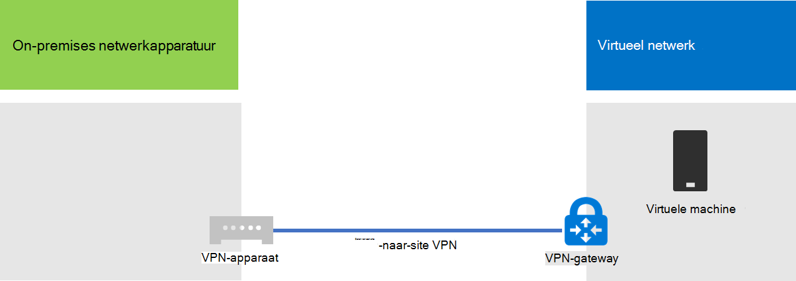
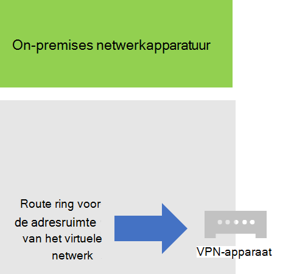
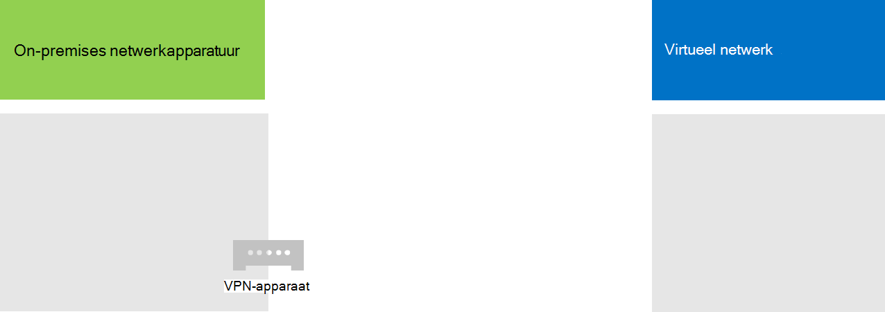
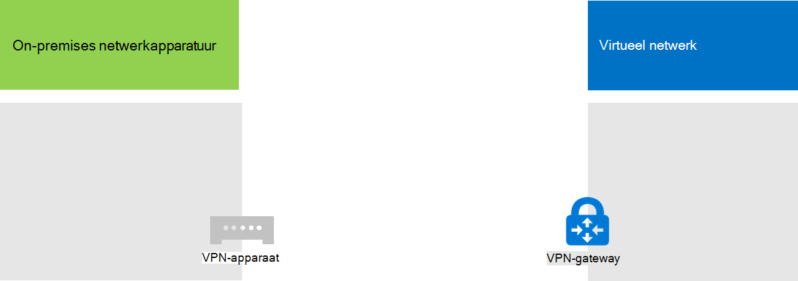
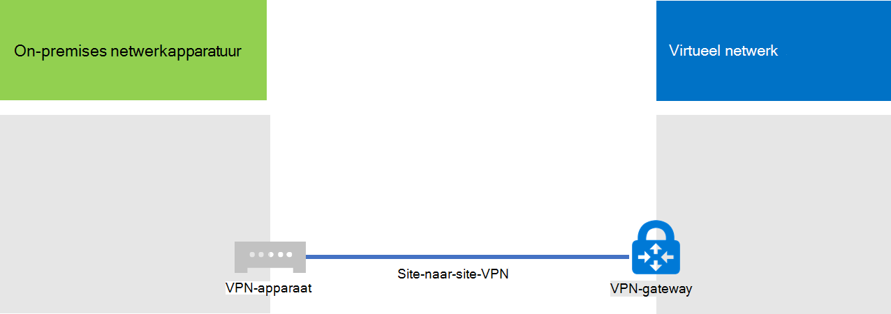

# <a name="connect-an-on-premises-network-to-a-microsoft-azure-virtual-network"></a>Een on-premises netwerk verbinden met een virtueel Microsoft Azure-netwerk

Er is een cross-premises Azure-virtueel netwerk verbonden met uw on-premises netwerk, dat uw netwerk uitbreidt tot subnetten en virtuele machines die worden gehost in Azure-infrastructuurservices. Met deze verbinding hebben computers op uw on-premises netwerk rechtstreeks toegang tot virtuele machines in Azure en vice versa. 

Een adreslijstsynchronisatieserver die op een virtuele Azure-computer wordt uitgevoerd, moet bijvoorbeeld uw on-premises domeincontrollers opvragen voor wijzigingen in accounts en deze wijzigingen synchroniseren met uw Microsoft 365-abonnement. In dit artikel wordt beschreven hoe u een lokaal virtueel Azure-netwerk kunt instellen met een VPN-verbinding (Virtual Private Network) van site naar site die klaar is om Azure-virtuele machines te hosten.

## <a name="configure-a-cross-premises-azure-virtual-network"></a>Een cross-premises Azure Virtual Network configureren

Uw virtuele machines in Azure hoeven niet te worden geïsoleerd van uw on-premises omgeving. Als u virtuele Azure-machines wilt verbinden met uw on-premises netwerkbronnen, moet u een lokaal virtueel Azure-netwerk configureren. In het volgende diagram ziet u de vereiste onderdelen voor het implementeren van een cross-premises Azure-virtueel netwerk met een virtuele computer in Azure.
  

 
In het diagram zijn er twee netwerken verbonden via een site-naar-site VPN-verbinding: het on-premises netwerk en het virtuele Azure-netwerk. De SITE-naar-site VPN-verbinding is:

- Tussen twee eindpunten die adresseerbaar zijn en zich bevinden op het openbare internet.
- Beëindigd door een VPN-apparaat op het on-premises netwerk en een Azure VPN-gateway op het virtuele Azure-netwerk.

Het virtuele Azure-netwerk host virtuele machines. Netwerkverkeer dat afkomstig is van virtuele machines op het virtuele Azure-netwerk, wordt doorgestuurd naar de VPN-gateway, die vervolgens het verkeer via de SITE-naar-site VPN-verbinding doorgestuurd naar het VPN-apparaat op het on-premises netwerk. De routeringsinfrastructuur van het on-premises netwerk wordt vervolgens doorgestuurd naar de bestemming.

>[!Note]
>U kunt ook [ExpressRoute](https://azure.microsoft.com/services/expressroute/)gebruiken, een directe verbinding tussen uw organisatie en het netwerk van Microsoft. Verkeer via ExpressRoute gaat niet via het openbare internet. In dit artikel wordt het gebruik van ExpressRoute niet beschreven.
>
  
Als u de VPN-verbinding wilt instellen tussen uw virtuele Azure-netwerk en uw on-premises netwerk, gaat u als volgt te werk: 
  
1. **On-premises:** Definieer en maak een on-premises netwerkroute voor de adresruimte van het virtuele Azure-netwerk die naar uw on-premises VPN-apparaat wijst.
    
2. **Microsoft Azure:** Maak een virtueel Azure-netwerk met een SITE-naar-site VPN-verbinding. 
    
3. **On-premises:** Configureer uw on-premises hardware- of software-VPN-apparaat om de VPN-verbinding te beëindigen, die gebruikmaakt van internetprotocolbeveiliging (IPsec).
    
Nadat u de SITE-to-site VPN-verbinding hebt gemaakt, voegt u Azure-virtuele machines toe aan de subnetten van het virtuele netwerk.
  
## <a name="plan-your-azure-virtual-network"></a>Uw Virtuele Azure-netwerk plannen
<a name="PlanningVirtual"></a>

### <a name="prerequisites"></a>Vereisten
<a name="Prerequisites"></a>

- Een Azure-abonnement. Ga naar de pagina Azure kopen voor informatie over [Azure-abonnementen.](https://azure.microsoft.com/pricing/purchase-options/)
    
- Een beschikbare privé-IPv4-adresruimte om toe te wijzen aan het virtuele netwerk en de subnetten, met voldoende ruimte voor groei om het aantal virtuele machines te kunnen gebruiken dat nu en in de toekomst nodig is.
    
- Een beschikbaar VPN-apparaat in uw on-premises netwerk om de SITE-to-site VPN-verbinding te beëindigen die de vereisten voor IPsec ondersteunt. Zie Over VPN-apparaten voor [virtuele netwerkverbindingen van site naar site voor meer informatie.](/azure/vpn-gateway/vpn-gateway-about-vpn-devices)
    
- Wijzigingen in uw routeringsinfrastructuur, zodat verkeer dat wordt doorgestuurd naar de adresruimte van het virtuele Azure-netwerk, wordt doorgestuurd naar het VPN-apparaat dat de SITE-to-site VPN-verbinding host.
    
- Een webproxy die computers biedt die zijn verbonden met het on-premises netwerk en de virtuele azure-netwerktoegang tot internet.
    
### <a name="solution-architecture-design-assumptions"></a>Ontwerp-aannames voor oplossingsarchitectuur

In de volgende lijst worden de ontwerpopties weergegeven die zijn gemaakt voor deze oplossingsarchitectuur. 
  
- Deze oplossing maakt gebruik van één virtueel Azure-netwerk met een SITE-naar-site VPN-verbinding. Het virtuele Azure-netwerk host één subnet dat meerdere virtuele machines kan bevatten. 
    
- U kunt de routerings- en externe toegangsservice (RRAS) in Windows Server 2016 of Windows Server 2012 gebruiken om een VPN-verbinding tussen het on-premises netwerk en het virtuele Azure-netwerk tot stand te brengen. U kunt ook andere opties gebruiken, zoals VPN-apparaten van Cisco of Juniper Networks.
    
- Het on-premises netwerk kan nog steeds netwerkservices hebben, zoals Ad DS (Active Directory Domain Services), Domain Name System (DNS) en proxyservers. Afhankelijk van uw vereisten kan het handig zijn om een aantal van deze netwerkbronnen in het virtuele Azure-netwerk te plaatsen.
    
Voor een bestaand virtueel Azure-netwerk met een of meer subnetten bepaalt u of er nog adresruimte is voor een extra subnet om uw benodigde virtuele machines te hosten, op basis van uw vereisten. Als u geen resterende adresruimte hebt voor een extra subnet, maakt u een extra virtueel netwerk met een eigen VPN-verbinding van site naar site.
  
### <a name="plan-the-routing-infrastructure-changes-for-the-azure-virtual-network"></a>Wijzigingen in de routeringsinfrastructuur plannen voor het virtuele Azure-netwerk

U moet uw on-premises routeringsinfrastructuur zo configureren dat verkeer dat bestemd is voor de adresruimte van het virtuele Azure-netwerk, wordt doorgestuurd naar het on-premises VPN-apparaat dat de VPN-verbinding van de site-naar-site host.
  
De exacte methode voor het bijwerken van uw routeringsinfrastructuur is afhankelijk van de manier waarop u routeringsgegevens beheert:
  
- Routeringstabelupdates op basis van handmatige configuratie.
    
- Routeringstabelupdates op basis van routeringsprotocollen, zoals Routing Information Protocol (RIP) of Open Shortest Path First (OSPF).
    
Neem contact op met uw routeringsspecialist om ervoor te zorgen dat verkeer dat bestemd is voor het virtuele Azure-netwerk, wordt doorgestuurd naar het on-premises VPN-apparaat.
  
### <a name="plan-for-firewall-rules-for-traffic-to-and-from-the-on-premises-vpn-device"></a>Firewallregels plannen voor verkeer van en naar het on-premises VPN-apparaat

Als uw VPN-apparaat zich op een perimeternetwerk met een firewall tussen het perimeternetwerk en internet heeft, moet u mogelijk de firewall configureren voor de volgende regels om de VPN-verbinding van site-naar-site toe te staan.
  
- Verkeer naar het VPN-apparaat (binnenkomend vanaf internet):
    
  - Doel-IP-adres van het VPN-apparaat en IP-protocol 50
    
  - Doel-IP-adres van het VPN-apparaat en UDP-doelpoort 500
    
  - Doel-IP-adres van het VPN-apparaat en UDP-doelpoort 4500
    
- Verkeer vanaf het VPN-apparaat (uitgaande naar internet):
    
  - Bron-IP-adres van het VPN-apparaat en IP-protocol 50
    
  - Bron-IP-adres van het VPN-apparaat en UDP-bronpoort 500
    
  - Bron-IP-adres van het VPN-apparaat en UDP-bronpoort 4500
    
### <a name="plan-for-the-private-ip-address-space-of-the-azure-virtual-network"></a>Plannen voor de privé-IP-adresruimte van het virtuele Azure-netwerk

De privé-IP-adresruimte van het virtuele Azure-netwerk moet geschikt zijn voor adressen die door Azure worden gebruikt om het virtuele netwerk te hosten en met ten minste één subnet dat voldoende adressen heeft voor uw Azure-virtuele machines.
  
Als u het aantal adressen wilt bepalen dat nodig is voor het subnet, telt u het aantal virtuele machines dat u nu nodig hebt, schat u de toekomstige groei in en gebruikt u vervolgens de volgende tabel om de grootte van het subnet te bepalen.
  
|**Aantal virtuele machines dat nodig is**|**Aantal hostbits nodig**|**Grootte van het subnet**|
|:-----|:-----|:-----|
|1-3  <br/> |3  <br/> |/29  <br/> |
|4-11  <br/> |4  <br/> |/28  <br/> |
|12-27  <br/> |5  <br/> |/27  <br/> |
|28-59  <br/> |6  <br/> |/26  <br/> |
|60-123  <br/> |7  <br/> |/25  <br/> |
   
### <a name="planning-worksheet-for-configuring-your-azure-virtual-network"></a>Werkblad plannen voor het configureren van uw Virtuele Azure-netwerk
<a name="worksheet"> </a>

Voordat u een virtueel Azure-netwerk maakt om virtuele machines te hosten, moet u de instellingen bepalen die nodig zijn in de volgende tabellen.
  
Vul tabel V in voor de instellingen van het virtuele netwerk.
  
 **Tabel V: Configuratie van een virtueel netwerk met een cross-premises locatie**
  
|**Item**|**Configuratie-element**|**Beschrijving**|**Value**|
|:-----|:-----|:-----|:-----|
|1.  <br/> |Naam van virtueel netwerk  <br/> |Een naam die u wilt toewijzen aan het virtuele Azure-netwerk (bijvoorbeeld DirSyncNet).  <br/> | |
|2.  <br/> |Virtuele netwerklocatie  <br/> |Het Azure-datacenter dat het virtuele netwerk (zoals West-VS) zal bevatten.  <br/> |  <br/> |
|3.  <br/> |IP-adres VPN-apparaat  <br/> |Het openbare IPv4-adres van de interface van uw VPN-apparaat op internet. Werk samen met uw IT-afdeling om dit adres te bepalen.  <br/> |  <br/> |
|4.  <br/> |Virtuele netwerkadresruimte  <br/> |De adresruimte (gedefinieerd in één privéadres voorvoegsel) voor het virtuele netwerk. Werk samen met uw IT-afdeling om deze adresruimte te bepalen. De adresruimte moet de indeling Classless Interdomain Routing (CIDR) hebben, ook wel netwerkprefix-indeling genoemd. Een voorbeeld is 10.24.64.0/20.  <br/> | <br/> |
|5.  <br/> |Gedeelde IPsec-sleutel  <br/> |Een willekeurige, alfanumerieke tekenreeks van 32 tekens die wordt gebruikt om beide zijden van de SITE-naar-site VPN-verbinding te verifiëren. Werk samen met uw IT- of beveiligingsafdeling om deze sleutelwaarde te bepalen en bewaar deze vervolgens op een veilige locatie. Zie Een willekeurige tekenreeks maken voor een vooraf gedeelde [IPsec-toets.](https://social.technet.microsoft.com/wiki/contents/articles/32330.create-a-random-string-for-an-ipsec-preshared-key.aspx)  <br/> | <br/> |
   
Vul tabel S in voor de subnetten van deze oplossing.
  
- Bepaal voor het eerste subnet een 28-bits adresruimte (met een lengte van /28) voor het Azure Gateway-subnet. Zie [De ruimte voor het gateway-subnet voor virtuele Azure-netwerken](/archive/blogs/solutions_advisory_board/calculating-the-gateway-subnet-address-space-for-azure-virtual-networks) berekenen voor informatie over het bepalen van deze adresruimte.
    
- Geef voor het tweede subnet een vriendelijke naam op, één IP-adresruimte op basis van de virtuele netwerkadresruimte en een beschrijvend doel.
    
Werk samen met uw IT-afdeling om deze adresruimten te bepalen vanuit de virtuele netwerkadresruimte. Beide adressaties moeten cidr-indeling hebben.
  
 **Tabel S: Subnetten in het virtuele netwerk**
  
|**Item**|**Subnetnaam**|**Subnetadresruimte**|**Doel**|
|:-----|:-----|:-----|:-----|
|1.  <br/> |GatewaySubnet  <br/> |  <br/> |Het subnet dat door de Azure-gateway wordt gebruikt.  <br/> |
|2.  <br/> |  <br/> |  <br/> |  <br/> |
   
Voor de on-premises DNS-servers die u wilt gebruiken voor de virtuele machines in het virtuele netwerk, vult u Tabel D in. Geef elke DNS-server een vriendelijke naam en één IP-adres. Deze vriendelijke naam hoeft niet overeen te komen met de hostnaam of computernaam van de DNS-server. Houd er rekening mee dat er twee lege items worden weergegeven, maar u kunt er meer toevoegen. Werk samen met uw IT-afdeling om deze lijst te bepalen.
  
 **Tabel D: On-premises DNS-servers**
  
|**Item**|**NAAM VAN DNS-servervriendelijke naam**|**IP-adres dns-server**|
|:-----|:-----|:-----|
|1.  <br/> |  <br/> |  <br/> |
|2.  <br/> |  <br/> |  <br/> |
   
Als u pakketten van het virtuele Azure-netwerk wilt doorverplaatsen naar uw organisatienetwerk via de SITE-naar-site VPN-verbinding, moet u het virtuele netwerk configureren met een lokaal netwerk. Dit lokale netwerk heeft een lijst met adressaties (in CIDR-indeling) voor alle locaties in het on-premises netwerk van uw organisatie dat de virtuele machines in het virtuele netwerk moeten bereiken. Dit kunnen alle locaties in het on-premises netwerk of een subset zijn. De lijst met adresruimten die uw lokale netwerk definiëren, moet uniek zijn en mag niet overlappen met de adresruimten die worden gebruikt voor dit virtuele netwerk of uw andere cross-premises virtuele netwerken.
  
Vul tabel L in voor de set lokale netwerkadressen. Houd er rekening mee dat er drie lege items worden weergegeven, maar dat u meestal meer nodig hebt. Werk samen met uw IT-afdeling om deze lijst te bepalen.
  
 **Tabel L: Adres voorvoegsels voor het lokale netwerk**
  
|**Item**|**Lokale netwerkadresruimte**|
|:-----|:-----|
|1.  <br/> |  <br/> |
|2.  <br/> |  <br/> |
|3.  <br/> |  <br/> |
   
## <a name="deployment-roadmap"></a>Routekaart voor implementatie
<a name="DeploymentRoadmap"> </a>

Het maken van het virtuele cross-premises netwerk en het toevoegen van virtuele machines in Azure bestaat uit drie fasen:
  
- Fase 1: Uw on-premises netwerk voorbereiden.
    
- Fase 2: Het cross-premises virtuele netwerk maken in Azure.
    
- Fase 3 (optioneel): Virtuele machines toevoegen.
    
### <a name="phase-1-prepare-your-on-premises-network"></a>Fase 1: uw on-premises netwerk voorbereiden
<a name="Phase1"></a>

U moet uw on-premises netwerk configureren met een route die naar het adres van het virtuele netwerk wijst en uiteindelijk verkeer levert dat bestemd is voor de router aan de rand van het on-premises netwerk. Neem contact op met de netwerkbeheerder om te bepalen hoe u de route toevoegt aan de routeringsinfrastructuur van uw on-premises netwerk.
  
Dit is de resulterende configuratie.
  

  
### <a name="phase-2-create-the-cross-premises-virtual-network-in-azure"></a>Fase 2: het cross-premises virtuele netwerk maken in Azure
<a name="Phase2"></a>

Open eerst een Azure PowerShell-prompt. Zie Aan de slag met [Azure PowerShell](/powershell/azure/get-started-azureps)als u Azure PowerShell niet hebt geïnstalleerd.

 
Meld u vervolgens aan bij uw Azure-account met deze opdracht.
  
```powershell
Connect-AzAccount
```

Haal de naam van uw abonnement op met de volgende opdracht.
  
```powershell
Get-AzSubscription | Sort SubscriptionName | Select SubscriptionName
```

Stel uw Azure-abonnement in met deze opdrachten. Vervang alles in de aanhalingstekens, inclusief de < en > tekens, door de juiste abonnementsnaam.
  
```powershell
$subscrName="<subscription name>"
Select-AzSubscription -SubscriptionName $subscrName
```

Maak vervolgens een nieuwe resourcegroep voor uw virtuele netwerk. Als u de naam van een unieke resourcegroep wilt bepalen, gebruikt u deze opdracht om uw bestaande resourcegroepen weer te geven.
  
```powershell
Get-AzResourceGroup | Sort ResourceGroupName | Select ResourceGroupName
```

Maak uw nieuwe resourcegroep aan met deze opdrachten.
  
```powershell
$rgName="<resource group name>"
$locName="<Table V - Item 2 - Value column>"
New-AzResourceGroup -Name $rgName -Location $locName
```

Vervolgens maakt u het virtuele Azure-netwerk.
  
```powershell
# Fill in the variables from previous values and from Tables V, S, and D
$rgName="<name of your new resource group>"
$locName="<Azure location of your new resource group>"
$vnetName="<Table V - Item 1 - Value column>"
$vnetAddrPrefix="<Table V - Item 4 - Value column>"
$gwSubnetPrefix="<Table S - Item 1 - Subnet address space column>"
$SubnetName="<Table S - Item 2 - Subnet name column>"
$SubnetPrefix="<Table S - Item 2 - Subnet address space column>"
$dnsServers=@( "<Table D - Item 1 - DNS server IP address column>", "<Table D - Item 2 - DNS server IP address column>" )
$locShortName=(Get-AzResourceGroup -Name $rgName).Location

# Create the Azure virtual network and a network security group that allows incoming remote desktop connections to the subnet that is hosting virtual machines
$gatewaySubnet=New-AzVirtualNetworkSubnetConfig -Name "GatewaySubnet" -AddressPrefix $gwSubnetPrefix
$vmSubnet=New-AzVirtualNetworkSubnetConfig -Name $SubnetName -AddressPrefix $SubnetPrefix
New-AzVirtualNetwork -Name $vnetName -ResourceGroupName $rgName -Location $locName -AddressPrefix $vnetAddrPrefix -Subnet $gatewaySubnet,$vmSubnet -DNSServer $dnsServers
$rule1=New-AzNetworkSecurityRuleConfig -Name "RDPTraffic" -Description "Allow RDP to all VMs on the subnet" -Access Allow -Protocol Tcp -Direction Inbound -Priority 100 -SourceAddressPrefix Internet -SourcePortRange * -DestinationAddressPrefix * -DestinationPortRange 3389
New-AzNetworkSecurityGroup -Name $SubnetName -ResourceGroupName $rgName -Location $locShortName -SecurityRules $rule1
$vnet=Get-AzVirtualNetwork -ResourceGroupName $rgName -Name $vnetName
$nsg=Get-AzNetworkSecurityGroup -Name $SubnetName -ResourceGroupName $rgName
Set-AzVirtualNetworkSubnetConfig -VirtualNetwork $vnet -Name $SubnetName -AddressPrefix $SubnetPrefix -NetworkSecurityGroup $nsg
$vnet | Set-AzVirtualNetwork
```

Dit is de resulterende configuratie.
  

  
Gebruik vervolgens deze opdrachten om de gateways te maken voor de SITE-naar-site VPN-verbinding.
  
```powershell
# Fill in the variables from previous values and from Tables V and L
$vnetName="<Table V - Item 1 - Value column>"
$localGatewayIP="<Table V - Item 3 - Value column>"
$localNetworkPrefix=@( <comma-separated, double-quote enclosed list of the local network address prefixes from Table L, example: "10.1.0.0/24", "10.2.0.0/24"> )
$vnetConnectionKey="<Table V - Item 5 - Value column>"
$vnet=Get-AzVirtualNetwork -Name $vnetName -ResourceGroupName $rgName
# Attach a virtual network gateway to a public IP address and the gateway subnet
$publicGatewayVipName="PublicIPAddress"
$vnetGatewayIpConfigName="PublicIPConfig"
New-AzPublicIpAddress -Name $vnetGatewayIpConfigName -ResourceGroupName $rgName -Location $locName -AllocationMethod Dynamic
$publicGatewayVip=Get-AzPublicIpAddress -Name $vnetGatewayIpConfigName -ResourceGroupName $rgName
$vnetGatewayIpConfig=New-AzVirtualNetworkGatewayIpConfig -Name $vnetGatewayIpConfigName -PublicIpAddressId $publicGatewayVip.Id -SubnetId $vnet.Subnets[0].Id
# Create the Azure gateway
$vnetGatewayName="AzureGateway"
$vnetGateway=New-AzVirtualNetworkGateway -Name $vnetGatewayName -ResourceGroupName $rgName -Location $locName -GatewayType Vpn -VpnType RouteBased -IpConfigurations $vnetGatewayIpConfig
# Create the gateway for the local network
$localGatewayName="LocalNetGateway"
$localGateway=New-AzLocalNetworkGateway -Name $localGatewayName -ResourceGroupName $rgName -Location $locName -GatewayIpAddress $localGatewayIP -AddressPrefix $localNetworkPrefix
# Create the Azure virtual network VPN connection
$vnetConnectionName="S2SConnection"
$vnetConnection=New-AzVirtualNetworkGatewayConnection -Name $vnetConnectionName -ResourceGroupName $rgName -Location $locName -ConnectionType IPsec -SharedKey $vnetConnectionKey -VirtualNetworkGateway1 $vnetGateway -LocalNetworkGateway2 $localGateway
```

Dit is de resulterende configuratie.
  

  
Configureer vervolgens uw on-premises VPN-apparaat om verbinding te maken met de Azure VPN-gateway. Zie Over VPN-apparaten voor [site-naar-site Azure Virtual Network-verbindingen voor meer informatie.](/azure/vpn-gateway/vpn-gateway-about-vpn-devices)
  
Als u uw VPN-apparaat wilt configureren, hebt u het volgende nodig:
  
- Het openbare IPv4-adres van de Azure VPN-gateway voor uw virtuele netwerk. Gebruik de **opdracht Get-AzPublicIpAddress -Name $vnetGatewayIpConfigName -ResourceGroupName $rgName** om dit adres weer te geven.
    
- De vooraf gedeelde IPsec-sleutel voor de VPN-verbinding van site naar site (tabel V- item 5 - kolom Waarde).
    
Dit is de resulterende configuratie.
  

  
### <a name="phase-3-optional-add-virtual-machines"></a>Fase 3 (optioneel): Virtuele machines toevoegen

Maak de virtuele machines die u nodig hebt in Azure. Zie Een virtuele Windows-computer maken met [de Azure-portal](https://go.microsoft.com/fwlink/p/?LinkId=393098)voor meer informatie.
  
Gebruik de volgende instellingen:
  
- Selecteer op **het** tabblad Basisbeginselen hetzelfde abonnement en dezelfde resourcegroep als uw virtuele netwerk. U hebt deze later nodig om u aan te melden bij de virtuele machine. Kies in **de sectie Exemplaardetails** de juiste virtuele machinegrootte. Neem de gebruikersnaam en het wachtwoord van het beheerdersaccount op op een veilige locatie. 
    
- Selecteer op **het** tabblad Netwerken de naam van uw virtuele netwerk en het subnet voor het hosten van virtuele machines (niet het GatewaySubnet). Laat alle andere instellingen op hun standaardwaarden staan.
    
Controleer of uw virtuele computer DNS correct gebruikt door uw interne DNS te controleren om ervoor te zorgen dat adresrecords (A) voor u nieuwe virtuele machine zijn toegevoegd. Als u toegang wilt tot internet, moeten uw Azure-virtuele machines zijn geconfigureerd om de proxyserver van uw on-premises netwerk te gebruiken. Neem contact op met de netwerkbeheerder voor aanvullende configuratiestappen om uit te voeren op de server.
  
Dit is de resulterende configuratie.
  

  
## <a name="next-step"></a>Volgende stap
  
[Microsoft 365 Directory-synchronisatie implementeren in Microsoft Azure](deploy-microsoft-365-directory-synchronization-dirsync-in-microsoft-azure.md)