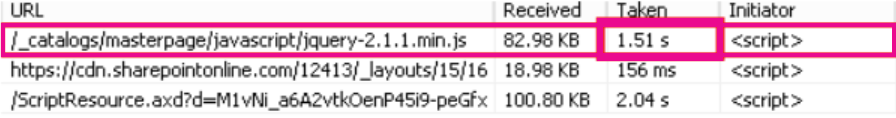

# <a name="content-delivery-networks-cdns"></a><span data-ttu-id="0c3b5-103">Netwerken voor content levering (Cdn's)</span><span class="sxs-lookup"><span data-stu-id="0c3b5-103">Content Delivery Networks (CDNs)</span></span>

<span data-ttu-id="0c3b5-104">*Dit artikel is van toepassing op Microsoft 365 Enterprise en Office 365 Enterprise.*</span><span class="sxs-lookup"><span data-stu-id="0c3b5-104">*This article applies to both Microsoft 365 Enterprise and Office 365 Enterprise.*</span></span>

<span data-ttu-id="0c3b5-105">Cdn's helpt Office 365 sneller en betrouwbaarder te houden voor eindgebruikers.</span><span class="sxs-lookup"><span data-stu-id="0c3b5-105">CDNs help keep Office 365 fast and reliable for end users.</span></span> <span data-ttu-id="0c3b5-106">Cloud Services zoals Office 365 Cdn's gebruiken voor het opslaan van statische activa dichter bij de browsers die hen vragen om de downloads te versnellen en de beschikbare latentie van de eindgebruikers te verminderen.</span><span class="sxs-lookup"><span data-stu-id="0c3b5-106">Cloud services like Office 365 use CDNs to cache static assets closer to the browsers requesting them to speed up downloads and reduce perceived end user latency.</span></span> <span data-ttu-id="0c3b5-107">In dit onderwerp vindt u meer informatie over netwerken voor content levering (Cdn's) en hoe deze worden gebruikt in Office 365.</span><span class="sxs-lookup"><span data-stu-id="0c3b5-107">The information in this topic will help you learn about Content Delivery Networks (CDNs) and how they are used by Office 365.</span></span>

## <a name="what-exactly-is-a-cdn"></a><span data-ttu-id="0c3b5-108">Wat is een CDN precies?</span><span class="sxs-lookup"><span data-stu-id="0c3b5-108">What exactly is a CDN?</span></span>

<span data-ttu-id="0c3b5-109">Een CDN is een zeer grafisch Distributed netwerk met proxy-en bestandsservers in de datacenters die verbonden zijn via hogesnelheids backbone netwerken.</span><span class="sxs-lookup"><span data-stu-id="0c3b5-109">A CDN is a geographically distributed network consisting of proxy and file servers in datacenters connected by high-speed backbone networks.</span></span> <span data-ttu-id="0c3b5-110">Cdn's wordt gebruikt om latentie en laadtijden te beperken voor een opgegeven set bestanden en objecten op een website of service.</span><span class="sxs-lookup"><span data-stu-id="0c3b5-110">CDNs are used to reduce latency and load times for a specified set of files and objects in a web site or service.</span></span> <span data-ttu-id="0c3b5-111">Een CDN mag veel duizenden eindpunten bevatten voor optimale service van inkomende aanvragen van inkomende aanvragen van een locatie.</span><span class="sxs-lookup"><span data-stu-id="0c3b5-111">A CDN may have many thousands of endpoints for optimal servicing of incoming requests from any location.</span></span>

<span data-ttu-id="0c3b5-112">Cdn's worden vaak gebruikt voor betere downloads van algemene inhoud voor een website of service, zoals JavaScript-bestanden, pictogrammen en afbeeldingen, en kunnen ook persoonlijke toegang bieden aan gebruikers inhoud, zoals bestanden in SharePoint Online-documentbibliotheken, streaming-mediabestanden en aangepaste code.</span><span class="sxs-lookup"><span data-stu-id="0c3b5-112">CDNs are commonly used to provide faster downloads of generic content for a web site or service such as javascript files, icons and images, and can also provide private access to user content such as files in SharePoint Online document libraries, streaming media files, and custom code.</span></span>

<span data-ttu-id="0c3b5-113">Cdn's worden gebruikt door de meeste Enterprise Cloud-Services.</span><span class="sxs-lookup"><span data-stu-id="0c3b5-113">CDNs are used by most enterprise cloud services.</span></span> <span data-ttu-id="0c3b5-114">Met beondersteuning van Cloud Services zoals Office 365 kunnen miljoenen klanten een mix van eigen inhoud (zoals e-mailberichten) en algemene inhoud (zoals pictogrammen) downloaden.</span><span class="sxs-lookup"><span data-stu-id="0c3b5-114">Cloud services like Office 365 have millions of customers downloading a mix of proprietary content (such as emails) and generic content (such as icons) at one time.</span></span> <span data-ttu-id="0c3b5-115">Het is efficiënter om afbeeldingen in te stellen, zoals pictogrammen, zo dicht mogelijk bij de computer van de gebruiker.</span><span class="sxs-lookup"><span data-stu-id="0c3b5-115">It's more efficient to put images everyone uses, like icons, as close to the user's computer as possible.</span></span> <span data-ttu-id="0c3b5-116">Het is niet praktisch voor elke cloudservice om CDN-datacenters te maken die deze algemene inhoud in elk terrein van de wereld opslaan, of zelfs in elke grote hub op internet, zodat sommige van deze Cdn's worden gedeeld.</span><span class="sxs-lookup"><span data-stu-id="0c3b5-116">It isn't practical for every cloud service to build CDN datacenters that store this generic content in every metropolitan area, or even in every major Internet hub around the world, so some of these CDNs are shared.</span></span>

## <a name="how-do-cdns-make-services-work-faster"></a><span data-ttu-id="0c3b5-117">Hoe kunnen Cdn's de services sneller werken?</span><span class="sxs-lookup"><span data-stu-id="0c3b5-117">How do CDNs make services work faster?</span></span>

<span data-ttu-id="0c3b5-118">Gemeenschappelijke objecten zoals site afbeeldingen en pictogrammen die opnieuw kunnen worden gedownload, kunnen de netwerkbandbreedte overnemen die beter kan worden gebruikt voor het downloaden van belangrijke persoonlijke inhoud, zoals e-mail of documenten.</span><span class="sxs-lookup"><span data-stu-id="0c3b5-118">Downloading common objects like site images and icons over and over again can take up network bandwidth that can be better used for downloading important personal content, like email or documents.</span></span> <span data-ttu-id="0c3b5-119">Aangezien Office 365 gebruikmaakt van een architectuur die Cdn's bevat, kunt u de pictogrammen, scripts en andere algemene inhoud downloaden van servers dichter bij clientcomputers, zodat u de downloads sneller kunt uitvoeren.</span><span class="sxs-lookup"><span data-stu-id="0c3b5-119">Because Office 365 uses an architecture that includes CDNs, the icons, scripts, and other generic content can be downloaded from servers closer to client computers, making the downloads faster.</span></span> <span data-ttu-id="0c3b5-120">Dit betekent dat u sneller toegang hebt tot uw persoonlijke inhoud, die veilig wordt opgeslagen in Office 365-datacenters.</span><span class="sxs-lookup"><span data-stu-id="0c3b5-120">This means faster access to your personal content, which is securely stored in Office 365 datacenters.</span></span>

<span data-ttu-id="0c3b5-121">Cdn's Help om de prestaties van de cloudservice op verschillende manieren te verbeteren:</span><span class="sxs-lookup"><span data-stu-id="0c3b5-121">CDNs help to improve cloud service performance in several ways:</span></span>

- <span data-ttu-id="0c3b5-122">Cdn's-verplaatsings onderdeel van het netwerk en het downloaden van bestanden van de cloudservice, het vrijmaken van cloudservice bronnen voor het uitvoeren van gebruikers inhoud en andere services, is minder nodig om aanvragen voor statische activa te dienen.</span><span class="sxs-lookup"><span data-stu-id="0c3b5-122">CDNs shift part of the network and file download burden away from the cloud service, freeing up cloud service resources for serving user content and other services by reducing the need to serve requests for static assets.</span></span>
- <span data-ttu-id="0c3b5-123">Cdn's zijn gebouwd om toegang te bieden tot een bestands latentie door krachtige netwerken en bestandsservers te implementeren, en door gebruik te maken van bijgewerkte netwerkprotocollen zoals [http/2](https://en.wikipedia.org/wiki/HTTP/2) met zeer efficiënte compressie en aanvragen van multiplexing.</span><span class="sxs-lookup"><span data-stu-id="0c3b5-123">CDNs are purpose built to provide low-latency file access by implementing high performance networks and file servers, and by leveraging updated network protocols such as [HTTP/2](https://en.wikipedia.org/wiki/HTTP/2) with highly efficient compression and request multiplexing.</span></span>
- <span data-ttu-id="0c3b5-124">CDN-netwerken gebruikmaken van een groot aantal globaal gedistribueerde eindpunten, zodat de inhoud zo dicht mogelijk toegankelijk is voor gebruikers.</span><span class="sxs-lookup"><span data-stu-id="0c3b5-124">CDN networks use many globally distributed endpoints to make content available as close as possible to users.</span></span>

## <a name="the-office-365-cdn"></a><span data-ttu-id="0c3b5-125">Het Office 365 CDN</span><span class="sxs-lookup"><span data-stu-id="0c3b5-125">The Office 365 CDN</span></span>

<span data-ttu-id="0c3b5-126">Het ingebouwde Office 365 Content Delivery Network (CDN) biedt beheerders van Office 365 de mogelijkheid om de prestaties van de SharePoint Online-pagina's van hun organisatie te verbeteren door de vaste activa dichter bij de door u gevraagde browsers te sparen, zodat downloads sneller en minder latentie kunnen worden.</span><span class="sxs-lookup"><span data-stu-id="0c3b5-126">The built-in Office 365 Content Delivery Network (CDN) allows Office 365 administrators to provide better performance for their organization's SharePoint Online pages by caching static assets closer to the browsers requesting them, which helps to speed up downloads and reduce latency.</span></span> <span data-ttu-id="0c3b5-127">In Office 365 CDN wordt het [protocol http/2](https://en.wikipedia.org/wiki/HTTP/2) gebruikt voor verbeterde compressie-en downloadsnelheid.</span><span class="sxs-lookup"><span data-stu-id="0c3b5-127">The Office 365 CDN uses the [HTTP/2 protocol](https://en.wikipedia.org/wiki/HTTP/2) for improved compression and download speeds.</span></span>

> [!NOTE]
> <span data-ttu-id="0c3b5-128">Het Office 365 CDN is alleen beschikbaar voor tenants in de **productie** -Cloud (wereldwijd).</span><span class="sxs-lookup"><span data-stu-id="0c3b5-128">The Office 365 CDN is only available to tenants in the **Production** (worldwide) cloud.</span></span> <span data-ttu-id="0c3b5-129">Tenants in de Verenigde Staten voor de overheid, China en Duitsland ondersteunen momenteel het Office 365 CDN.</span><span class="sxs-lookup"><span data-stu-id="0c3b5-129">Tenants in the US Government, China and Germany clouds do not currently support the Office 365 CDN.</span></span>

<span data-ttu-id="0c3b5-130">Het CDN van Office 365 is samengesteld uit meerdere Cdn's die u in staat stellen statische activa te hosten op meerdere locaties of _herkomst_en ze van wereldwijde hogesnelheids netwerken te bezorgen.</span><span class="sxs-lookup"><span data-stu-id="0c3b5-130">The Office 365 CDN is composed of multiple CDNs that allow you to host static assets in multiple locations, or _origins_, and serve them from global high-speed networks.</span></span> <span data-ttu-id="0c3b5-131">Afhankelijk van het type inhoud dat u in het Office 365 CDN wilt hosten, kunt u **openbare** oorsprong, **persoonlijke** Origins of beide toevoegen.</span><span class="sxs-lookup"><span data-stu-id="0c3b5-131">Depending on the kind of content you want to host in the Office 365 CDN, you can add **public** origins, **private** origins or both.</span></span>

<span data-ttu-id="0c3b5-132"></span><span class="sxs-lookup"><span data-stu-id="0c3b5-132"></span></span>

<span data-ttu-id="0c3b5-133">Inhoud in **openbare** Origins in Office 365 CDN is anoniem toegankelijk en kan worden geopend door iedereen die url's heeft voor gehoste assets.</span><span class="sxs-lookup"><span data-stu-id="0c3b5-133">Content in **public** origins within the Office 365 CDN is accessible anonymously, and can be accessed by anyone who has URLs to hosted assets.</span></span> <span data-ttu-id="0c3b5-134">Aangezien toegang tot inhoud in openbare Origin anoniem is, moet u deze alleen gebruiken voor het opslaan van niet-gevoelige algemene inhoud, zoals JavaScript-bestanden, scripts, pictogrammen en afbeeldingen.</span><span class="sxs-lookup"><span data-stu-id="0c3b5-134">Because access to content in public origins is anonymous, you should only use them to cache non-sensitive generic content such as javascript files, scripts, icons and images.</span></span> <span data-ttu-id="0c3b5-135">Het Office 365 CDN wordt standaard gebruikt voor het downloaden van algemene resource activa zoals de Office 365-clienttoepassingen van een openbare Origin.</span><span class="sxs-lookup"><span data-stu-id="0c3b5-135">The Office 365 CDN is used by default for downloading generic resource assets like the Office 365 client applications from a public origin.</span></span>

<span data-ttu-id="0c3b5-136">**Persoonlijke** Origins in Office 365 CDN bieden persoonlijke toegang tot gebruikers inhoud, zoals documentbibliotheken van SharePoint Online, sites en eigen afbeeldingen.</span><span class="sxs-lookup"><span data-stu-id="0c3b5-136">**Private** origins within the Office 365 CDN provide private access to user content such as SharePoint Online document libraries, sites and proprietary images.</span></span> <span data-ttu-id="0c3b5-137">Toegang tot inhoud in persoonlijke Origins is beveiligd met dynamisch gegenereerde tokens, zodat deze alleen kan worden geopend door gebruikers met machtigingen voor de oorspronkelijke documentbibliotheek of opslaglocatie.</span><span class="sxs-lookup"><span data-stu-id="0c3b5-137">Access to content in private origins is secured with dynamically generated tokens so it can only be accessed by users with permissions to the original document library or storage location.</span></span> <span data-ttu-id="0c3b5-138">Persoonlijke Origins in het Office 365-CDN kunnen alleen worden gebruikt voor SharePoint Online-inhoud en u kunt geen toegang krijgen tot activa via omleiding van de SharePoint Online-Tenant.</span><span class="sxs-lookup"><span data-stu-id="0c3b5-138">Private origins in the Office 365 CDN can only be used for SharePoint Online content, and you can only access assets through redirection from your SharePoint Online tenant.</span></span>

<span data-ttu-id="0c3b5-139">De Office 365 CDN-service maakt deel uit van uw SharePoint Online-abonnement.</span><span class="sxs-lookup"><span data-stu-id="0c3b5-139">The Office 365 CDN service is included as part of your SharePoint Online subscription.</span></span>

<span data-ttu-id="0c3b5-140">Ga voor meer informatie over het gebruik van Office 365 CDN naar [het inhouds leverings netwerk van office 365 met SharePoint Online](use-microsoft-365-cdn-with-spo.md).</span><span class="sxs-lookup"><span data-stu-id="0c3b5-140">For more information about how to use the Office 365 CDN, see [Use the Office 365 content delivery network with SharePoint Online](use-microsoft-365-cdn-with-spo.md).</span></span>

<span data-ttu-id="0c3b5-141">Als u een reeks korte Video's wilt bekijken over informatie over het gebruik van Office 365 CDN, gaat u naar het [YouTube-kanaal van de SharePoint-ontwikkel patronen en-procedures](https://aka.ms/sppnp-videos).</span><span class="sxs-lookup"><span data-stu-id="0c3b5-141">To watch a series of short videos that provide conceptual and HOWTO information about using the Office 365 CDN, visit the [SharePoint Developer Patterns and Practices YouTube channel](https://aka.ms/sppnp-videos).</span></span>

## <a name="other-microsoft-cdns"></a><span data-ttu-id="0c3b5-142">Andere Microsoft-Cdn's</span><span class="sxs-lookup"><span data-stu-id="0c3b5-142">Other Microsoft CDNs</span></span>

<span data-ttu-id="0c3b5-143">Hoewel u geen onderdeel van Office 365 CDN hebt, kunt u deze Cdn's in de Office 365-Tenant gebruiken voor toegang tot de ontwikkel bibliotheken van SharePoint, aangepaste code en andere functies die buiten het bereik van het Office 365-CDN vallen.</span><span class="sxs-lookup"><span data-stu-id="0c3b5-143">Although not a part of the Office 365 CDN, you can use these CDNs in your Office 365 tenant for access to SharePoint development libraries, custom code and other purposes that fall outside the scope of the Office 365 CDN.</span></span>

### <a name="azure-cdn"></a><span data-ttu-id="0c3b5-144">Azure CDN</span><span class="sxs-lookup"><span data-stu-id="0c3b5-144">Azure CDN</span></span>

>[!NOTE]
><span data-ttu-id="0c3b5-145">Vanaf Q3 2020 begint SharePoint Online om Video's in te zetten in het Azure CDN, zodat de video sneller en betrouwbaarder wordt.</span><span class="sxs-lookup"><span data-stu-id="0c3b5-145">Beginning in Q3 2020, SharePoint Online will begin caching videos on the Azure CDN to support improved video playback and reliability.</span></span> <span data-ttu-id="0c3b5-146">Populaire Video's worden vanaf het CDN-eindpunt naar de gebruiker gestreamd.</span><span class="sxs-lookup"><span data-stu-id="0c3b5-146">Popular videos will be streamed from the CDN endpoint closest to the user.</span></span> <span data-ttu-id="0c3b5-147">Deze gegevens blijven binnen de nalevings grenzen van Microsoft 365.</span><span class="sxs-lookup"><span data-stu-id="0c3b5-147">This data will remain within the Microsoft 365 compliance boundary.</span></span> <span data-ttu-id="0c3b5-148">Dit is een gratis service voor alle tenants waarvoor geen klant actie hoeft te worden geconfigureerd.</span><span class="sxs-lookup"><span data-stu-id="0c3b5-148">This is a free service for all tenants and it does not require any customer action to configure.</span></span>

<span data-ttu-id="0c3b5-149">U kunt met behulp van **Azure CDN** uw eigen CDN-exemplaar implementeren voor het hosten van aangepaste webonderdelen, Bibliotheken en andere bron activa, zodat u toegangstoetsen kunt toepassen op uw CDN-opslag en meer controle hebt over uw CDN-configuratie.</span><span class="sxs-lookup"><span data-stu-id="0c3b5-149">You can use the **Azure CDN** to deploy your own CDN instance for hosting custom web parts, libraries and other resource assets, which allows you to apply access keys to your CDN storage and exert greater control over your CDN configuration.</span></span> <span data-ttu-id="0c3b5-150">Het gebruik van het Azure CDN is niet gratis en vereist een Azure-abonnement.</span><span class="sxs-lookup"><span data-stu-id="0c3b5-150">Use of the Azure CDN is not free, and requires an Azure subscription.</span></span>

<span data-ttu-id="0c3b5-151">Zie voor meer informatie over het configureren van een Azure CDN-exemplaar [: een Azure-opslagaccount integreren met Azure CDN](https://docs.microsoft.com/azure/cdn/cdn-create-a-storage-account-with-cdn).</span><span class="sxs-lookup"><span data-stu-id="0c3b5-151">For more information on how to configure an Azure CDN instance, see [Quickstart: Integrate an Azure storage account with Azure CDN](https://docs.microsoft.com/azure/cdn/cdn-create-a-storage-account-with-cdn).</span></span>

<span data-ttu-id="0c3b5-152">Zie [het webonderdeel SharePoint-client toepassen op Azure CDN](https://docs.microsoft.com/sharepoint/dev/spfx/web-parts/get-started/deploy-web-part-to-cdn)voor een voorbeeld van hoe het Azure-CDN kan worden gebruikt om SharePoint-webonderdelen te hosten.</span><span class="sxs-lookup"><span data-stu-id="0c3b5-152">For an example of how the Azure CDN can be used to host SharePoint web parts, see [Deploy your SharePoint client-side web part to Azure CDN](https://docs.microsoft.com/sharepoint/dev/spfx/web-parts/get-started/deploy-web-part-to-cdn).</span></span>

<span data-ttu-id="0c3b5-153">Zie voor meer informatie over de Azure CDN PowerShell-module [Azure CDN beheren met PowerShell](https://docs.microsoft.com/azure/cdn/cdn-manage-powershell).</span><span class="sxs-lookup"><span data-stu-id="0c3b5-153">For information about the Azure CDN PowerShell module, see [Manage Azure CDN with PowerShell](https://docs.microsoft.com/azure/cdn/cdn-manage-powershell).</span></span>

### <a name="microsoft-ajax-cdn"></a><span data-ttu-id="0c3b5-154">Microsoft Ajax-CDN</span><span class="sxs-lookup"><span data-stu-id="0c3b5-154">Microsoft Ajax CDN</span></span>

<span data-ttu-id="0c3b5-155">De **Ajax-CDN** van Microsoft is een alleen-lezen CDN die tal van populaire ontwikkelaars bevat, waaronder jQuery (en alle andere bibliotheken), ASP.NET AJAX, bootstrap, Knockout.js en overige.</span><span class="sxs-lookup"><span data-stu-id="0c3b5-155">Microsoft's **Ajax CDN** is a read-only CDN that offers many popular development libraries including jQuery (and all of its other libraries), ASP.NET Ajax, Bootstrap, Knockout.js, and others.</span></span>
  
<span data-ttu-id="0c3b5-156">Als u deze scripts in uw project wilt opnemen, vervangt u verwijzingen naar de beschikbare bibliotheken met verwijzingen naar het CDN-adres in plaats van de scripts op te nemen in uw project zelf.</span><span class="sxs-lookup"><span data-stu-id="0c3b5-156">To include these scripts in your project, simply replace any references to these publicly available libraries with references to the CDN address instead of including it in your project itself.</span></span> <span data-ttu-id="0c3b5-157">Gebruik bijvoorbeeld de volgende code om een koppeling te maken naar jQuery:</span><span class="sxs-lookup"><span data-stu-id="0c3b5-157">For example, use the following code to link to jQuery:</span></span>

``` html
<script src=https://ajax.aspnetcdn.com/ajax/jquery-2.1.1.js> </script>
```

<span data-ttu-id="0c3b5-158">Zie voor meer informatie over het gebruik van Microsoft Ajax CDN [Microsoft Ajax CDN](https://docs.microsoft.com/aspnet/ajax/cdn/overview).</span><span class="sxs-lookup"><span data-stu-id="0c3b5-158">For more information about how to use the Microsoft Ajax CDN, see [Microsoft Ajax CDN](https://docs.microsoft.com/aspnet/ajax/cdn/overview).</span></span>

## <a name="how-does-office-365-use-content-from-a-cdn"></a><span data-ttu-id="0c3b5-159">Hoe gebruikt Office 365 inhoud van een CDN?</span><span class="sxs-lookup"><span data-stu-id="0c3b5-159">How does Office 365 use content from a CDN?</span></span>

<span data-ttu-id="0c3b5-160">Ongeacht de CDN die u voor uw Office 365-Tenant configureert, is het basisproces voor het ophalen van gegevens hetzelfde.</span><span class="sxs-lookup"><span data-stu-id="0c3b5-160">Regardless of what CDN you configure for your Office 365 tenant, the basic data retrieval process is the same.</span></span>

1. <span data-ttu-id="0c3b5-161">De client (een browser of Office-clienttoepassing) vraagt om gegevens uit Office 365.</span><span class="sxs-lookup"><span data-stu-id="0c3b5-161">Your client (a browser or Office client application) requests data from Office 365.</span></span>

2. <span data-ttu-id="0c3b5-162">In Office 365 worden de gegevens rechtstreeks naar de client geretourneerd of wordt de client omgeleid naar de CDN-URL als de gegevens deel uitmaken van een set met gehoste inhoud van de CDN.</span><span class="sxs-lookup"><span data-stu-id="0c3b5-162">Office 365 either returns the data directly to your client or, if the data is part of a set of content hosted by the CDN, redirects your client to the CDN URL.</span></span>

    <span data-ttu-id="0c3b5-163">a.</span><span class="sxs-lookup"><span data-stu-id="0c3b5-163">a.</span></span> <span data-ttu-id="0c3b5-164">Als de gegevens al _in de cache_ zijn opgeslagen, worden de gegevens in de client rechtstreeks vanaf de dichtstbijzijnde CDN-locatie naar uw client gedownload.</span><span class="sxs-lookup"><span data-stu-id="0c3b5-164">If the data is already cached in a _public_ origin, your client downloads the data directly from the nearest CDN location to your client.</span></span>

    <span data-ttu-id="0c3b5-165">b.</span><span class="sxs-lookup"><span data-stu-id="0c3b5-165">b.</span></span> <span data-ttu-id="0c3b5-166">Als de gegevens al in de cache zijn opgeslagen in een _persoonlijke_ Origin, controleert de CDN-service de machtigingen voor uw Office 365-gebruikersaccount voor de oorsprong.</span><span class="sxs-lookup"><span data-stu-id="0c3b5-166">If the data is already cached in a _private_ origin, the CDN service checks your Office 365 user account's permissions on the origin.</span></span> <span data-ttu-id="0c3b5-167">Als u over de juiste machtigingen beschikt, wordt in SharePoint Online een aangepaste URL met een aangepaste URL samengesteld die bestaat uit het pad naar het activum in de CDN en twee toegangstokens, en wordt de aangepaste URL van de client geretourneerd.</span><span class="sxs-lookup"><span data-stu-id="0c3b5-167">If you have permissions, SharePoint Online dynamically generates a custom URL composed of the path to the asset in the CDN and two access tokens, and returns the custom URL to your client.</span></span> <span data-ttu-id="0c3b5-168">De gegevens worden vervolgens via de aangepaste URL rechtstreeks vanaf de dichtstbijzijnde CDN-locatie naar de client gedownload.</span><span class="sxs-lookup"><span data-stu-id="0c3b5-168">Your client then downloads the data directly from the nearest CDN location to your client using the custom URL.</span></span>

3. <span data-ttu-id="0c3b5-169">Als de gegevens niet in de cache zijn opgeslagen, worden de gegevens uit Office 365 opgevraagd en worden de gegevens vervolgens in de cache opgeslagen wanneer de client de gegevens heeft gedownload.</span><span class="sxs-lookup"><span data-stu-id="0c3b5-169">If the data isn't cached at the CDN, the CDN node requests the data from Office 365 and then caches the data for a period of time after your client downloads the data.</span></span>

<span data-ttu-id="0c3b5-170">De CDN ontstaat op het dichtstbijzijnde datacenter in de browser van de gebruiker en via omleiding wordt de gevraagde gegevens gedownload.</span><span class="sxs-lookup"><span data-stu-id="0c3b5-170">The CDN figures out the closest datacenter to the user's browser and, using redirection, downloads the requested data from there.</span></span> <span data-ttu-id="0c3b5-171">CDN-omleiding is snel en bespaart gebruikers veel tijd om het bestand te downloaden.</span><span class="sxs-lookup"><span data-stu-id="0c3b5-171">CDN redirection is quick, and can save users a lot of download time.</span></span>

## <a name="how-should-i-set-up-my-network-so-that-cdns-work-best-with-office-365"></a><span data-ttu-id="0c3b5-172">Hoe kan ik mijn netwerk zo instellen dat Cdn's het beste werken met Office 365?</span><span class="sxs-lookup"><span data-stu-id="0c3b5-172">How should I set up my network so that CDNs work best with Office 365?</span></span>

<span data-ttu-id="0c3b5-173">Het minimaliseren van de latentie tussen clients in uw netwerk en CDN-eindpunten is de belangrijkste overweging om optimale prestaties te garanderen.</span><span class="sxs-lookup"><span data-stu-id="0c3b5-173">Minimizing latency between clients on your network and CDN endpoints is the key consideration for ensuring optimal performance.</span></span> <span data-ttu-id="0c3b5-174">U kunt de aanbevolen procedures gebruiken voor het beheren van [Office 365-eindpunten voor het beheren van Office-eindpunten](managing-office-365-endpoints.md) om ervoor te zorgen dat uw netwerkconfiguratie door de centrale proxy's direct wordt gebruikt in plaats van het routeren van het gegevensblad.</span><span class="sxs-lookup"><span data-stu-id="0c3b5-174">You can use the best practices outlined in [Managing Office 365 endpoints](managing-office-365-endpoints.md) to ensure that your network configuration permits client browsers to access the CDN directly rather than routing CDN traffic through central proxies to avoid introducing unnecessary latency.</span></span>

<span data-ttu-id="0c3b5-175">U kunt ook de basis [principes van office 365-netwerkverbindingen](https://aka.ms/o365networkingprinciples) raadplegen voor informatie over de concepten achter het optimaliseren van de prestaties van het netwerk van Office 365.</span><span class="sxs-lookup"><span data-stu-id="0c3b5-175">You can also read [Office 365 Network Connectivity Principles](https://aka.ms/o365networkingprinciples) to understand the concepts behind optimizing Office 365 network performance.</span></span>

## <a name="is-there-a-list-of-all-the-cdns-that-office-365-uses"></a><span data-ttu-id="0c3b5-176">Is er een lijst met alle Cdn's die door Office 365 worden gebruikt?</span><span class="sxs-lookup"><span data-stu-id="0c3b5-176">Is there a list of all the CDNs that Office 365 uses?</span></span>

<span data-ttu-id="0c3b5-177">Het Cdn's dat door Office 365 wordt gebruikt, is altijd te wijzigen en in veel gevallen zijn er meerdere CDN-partners geconfigureerd in het gebeurtenis account.</span><span class="sxs-lookup"><span data-stu-id="0c3b5-177">The CDNs in use by Office 365 are always subject to change and in many cases there are multiple CDN partners configured in the event one is unavailable.</span></span> <span data-ttu-id="0c3b5-178">De primaire Cdn's die wordt gebruikt door Office 365, zijn:</span><span class="sxs-lookup"><span data-stu-id="0c3b5-178">The primary CDNs used by Office 365 are:</span></span>

|<span data-ttu-id="0c3b5-179">CDN</span><span class="sxs-lookup"><span data-stu-id="0c3b5-179">CDN</span></span>  |<span data-ttu-id="0c3b5-180">Company</span><span class="sxs-lookup"><span data-stu-id="0c3b5-180">Company</span></span>  |<span data-ttu-id="0c3b5-181">Gebruikt</span><span class="sxs-lookup"><span data-stu-id="0c3b5-181">Usage</span></span>  |<span data-ttu-id="0c3b5-182">Verbindings</span><span class="sxs-lookup"><span data-stu-id="0c3b5-182">Link</span></span>  |
|---------|---------|---------|---------|
|<span data-ttu-id="0c3b5-183">Office 365 CDN</span><span class="sxs-lookup"><span data-stu-id="0c3b5-183">Office 365 CDN</span></span>     |<span data-ttu-id="0c3b5-184">Akamai</span><span class="sxs-lookup"><span data-stu-id="0c3b5-184">Akamai</span></span>         |<span data-ttu-id="0c3b5-185">Algemene activa in openbare Origin, SharePoint-gebruikers inhoud in persoonlijke oorsprong</span><span class="sxs-lookup"><span data-stu-id="0c3b5-185">Generic assets in public origins, SharePoint user content in private origins</span></span>         |[<span data-ttu-id="0c3b5-186">Het Office 365-inhouds leverings netwerk gebruiken met SharePoint Online</span><span class="sxs-lookup"><span data-stu-id="0c3b5-186">Use the Office 365 content delivery network with SharePoint Online</span></span>](use-microsoft-365-cdn-with-spo.md)         |
|<span data-ttu-id="0c3b5-187">Azure CDN</span><span class="sxs-lookup"><span data-stu-id="0c3b5-187">Azure CDN</span></span>     |<span data-ttu-id="0c3b5-188">Microsoft</span><span class="sxs-lookup"><span data-stu-id="0c3b5-188">Microsoft</span></span>         |<span data-ttu-id="0c3b5-189">Aangepaste code, SharePoint Framework-oplossingen</span><span class="sxs-lookup"><span data-stu-id="0c3b5-189">Custom code, SharePoint Framework solutions</span></span>         |[<span data-ttu-id="0c3b5-190">Microsoft Azure CDN</span><span class="sxs-lookup"><span data-stu-id="0c3b5-190">Microsoft Azure CDN</span></span>](https://azure.microsoft.com/documentation/services/cdn/)         |
|<span data-ttu-id="0c3b5-191">Microsoft Ajax CDN (alleen-lezen)</span><span class="sxs-lookup"><span data-stu-id="0c3b5-191">Microsoft Ajax CDN (read only)</span></span>     |<span data-ttu-id="0c3b5-192">Microsoft</span><span class="sxs-lookup"><span data-stu-id="0c3b5-192">Microsoft</span></span>         |<span data-ttu-id="0c3b5-193">Veelgebruikte bibliotheken voor Ajax, jQuery, ASP.NET, bootstrap, Knockout.js etc.</span><span class="sxs-lookup"><span data-stu-id="0c3b5-193">Common libraries for Ajax, jQuery, ASP.NET, Bootstrap, Knockout.js etc.</span></span>         |[<span data-ttu-id="0c3b5-194">Microsoft Ajax-CDN</span><span class="sxs-lookup"><span data-stu-id="0c3b5-194">Microsoft Ajax CDN</span></span>](https://docs.microsoft.com/aspnet/ajax/cdn/overview)         |

## <a name="what-performance-gains-does-a-cdn-provide"></a><span data-ttu-id="0c3b5-195">Welke prestatieverbeteringen levert een CDN op?</span><span class="sxs-lookup"><span data-stu-id="0c3b5-195">What performance gains does a CDN provide?</span></span>

<span data-ttu-id="0c3b5-196">Er bestaan diverse factoren waarmee de prestaties van bepaalde verschillen tussen de gegevens rechtstreeks vanuit Office 365 en gegevens uit een specifieke CDN, zoals uw locatie ten opzichte van de Tenant en het dichtstbijzijnde CDN-eindpunt, worden gemeten, het aantal assets op een pagina dat op een pagina wordt bediend, en overgangen in netwerklatentie en bandbreedte.</span><span class="sxs-lookup"><span data-stu-id="0c3b5-196">There are many factors involved in measuring specific differences in performance between data downloaded directly from Office 365 and data downloaded from a specific CDN, such as your location relative to your tenant and to the nearest CDN endpoint, the number of assets on a page that are served by the CDN, and transient changes in network latency and bandwidth.</span></span> <span data-ttu-id="0c3b5-197">Met een eenvoudige A/B-toets kunt u echter het verschil in de downloadtijd voor een specifiek bestand weergeven.</span><span class="sxs-lookup"><span data-stu-id="0c3b5-197">However, a simple A/B test can help to show the difference in download time for a specific file.</span></span>

<span data-ttu-id="0c3b5-198">In de volgende schermafbeeldingen wordt het verschil tussen de downloadsnelheid weergegeven tussen de bestandslocatie in Office 365 en het bestand dat wordt gehost op het [Microsoft Ajax Content Delivery Network](https://docs.microsoft.com/aspnet/ajax/cdn/overview).</span><span class="sxs-lookup"><span data-stu-id="0c3b5-198">The following screen shots illustrate the difference in download speed between the native file location in Office 365 and the same file hosted on the [Microsoft Ajax Content Delivery Network](https://docs.microsoft.com/aspnet/ajax/cdn/overview).</span></span> <span data-ttu-id="0c3b5-199">Deze schermafbeeldingen zijn afkomstig van het tabblad **netwerk** in de hulpmiddelen voor ontwikkelaars van Internet Explorer 11.</span><span class="sxs-lookup"><span data-stu-id="0c3b5-199">These screen shots are from the **Network** tab in the Internet Explorer 11 developer tools.</span></span> <span data-ttu-id="0c3b5-200">In deze schermafbeeldingen wordt de latentie weergegeven op de populaire bibliotheek jQuery.</span><span class="sxs-lookup"><span data-stu-id="0c3b5-200">These screen shots show the latency on the popular library jQuery.</span></span> <span data-ttu-id="0c3b5-201">Als u dit scherm wilt weergeven, drukt u in Internet Explorer op **F12** en selecteert u het tabblad **netwerk** op basis van een Wi-Fi-pictogram.</span><span class="sxs-lookup"><span data-stu-id="0c3b5-201">To bring up this screen, in Internet Explorer, press **F12** and select the **Network** tab which is symbolized with a Wi-Fi icon.</span></span>
  

  
<span data-ttu-id="0c3b5-203">In deze schermafbeelding ziet u de bibliotheek die is geüpload naar de galerie met basispagina's op de SharePoint Online-site zelf.</span><span class="sxs-lookup"><span data-stu-id="0c3b5-203">This screen shot shows the library uploaded to the master page gallery on the SharePoint Online site itself.</span></span> <span data-ttu-id="0c3b5-204">De tijd die het uploaden van de bibliotheek duurt 1,51 seconden.</span><span class="sxs-lookup"><span data-stu-id="0c3b5-204">The time it took to upload the library is 1.51 seconds.</span></span>
  

  
<span data-ttu-id="0c3b5-206">De tweede schermafbeelding toont het bestand dat wordt bezorgd in het Microsoft CDN.</span><span class="sxs-lookup"><span data-stu-id="0c3b5-206">The second screen shot shows the same file delivered by Microsoft's CDN.</span></span> <span data-ttu-id="0c3b5-207">Wanneer de latentie rondom 496 milliseconden valt.</span><span class="sxs-lookup"><span data-stu-id="0c3b5-207">This time the latency is around 496 milliseconds.</span></span> <span data-ttu-id="0c3b5-208">Dit is een grote verbetering en geeft aan dat een hele seconde de totale tijd voor het downloaden van het object verscheert.</span><span class="sxs-lookup"><span data-stu-id="0c3b5-208">This is a large improvement and shows that a whole second is shaved off the total time to download the object.</span></span>
  


## <a name="is-my-data-safe"></a><span data-ttu-id="0c3b5-210">Zijn mijn gegevens veilig?</span><span class="sxs-lookup"><span data-stu-id="0c3b5-210">Is my data safe?</span></span>

<span data-ttu-id="0c3b5-211">We nemen ons de bescherming van de gegevens die uw bedrijf uitvoert.</span><span class="sxs-lookup"><span data-stu-id="0c3b5-211">We take great care to protect the data that runs your business.</span></span> <span data-ttu-id="0c3b5-212">Gegevens die zijn opgeslagen in Office 365 CDN, worden versleuteld in transit en op rest, en toegang tot gegevens in het Office 365 SharePoint CDN wordt beveiligd door Office 365-gebruikersmachtigingen en Token autorisatie.</span><span class="sxs-lookup"><span data-stu-id="0c3b5-212">Data stored in the Office 365 CDN is encrypted both in transit and at rest, and access to data in the Office 365 SharePoint CDN is secured by Office 365 user permissions and token authorization.</span></span> <span data-ttu-id="0c3b5-213">Voor de gegevens in het Office 365 SharePoint-CDN moet een verwijzing worden gemaakt van de Office 365-Tenant of wordt er geen autorisatietoken gegenereerd.</span><span class="sxs-lookup"><span data-stu-id="0c3b5-213">Requests for data in the Office 365 SharePoint CDN must be referred (redirected) from your Office 365 tenant or an authorization token will not be generated.</span></span>

<span data-ttu-id="0c3b5-214">Om ervoor te zorgen dat uw gegevens veilig blijven, raden we u aan dat u geen gebruikers inhoud of andere gevoelige gegevens opslaat in een openbaar CDN.</span><span class="sxs-lookup"><span data-stu-id="0c3b5-214">To ensure that your data remains secure, we recommend that you never store user content or other sensitive data in a public CDN.</span></span> <span data-ttu-id="0c3b5-215">Aangezien de toegang tot gegevens in een openbaar CDN anoniem is, mag openbare Cdn's alleen worden gebruikt om algemene inhoud te hosten, zoals Webbe schrift bestanden, pictogrammen, afbeeldingen en andere niet-gevoelige assets.</span><span class="sxs-lookup"><span data-stu-id="0c3b5-215">Because access to data in a public CDN is anonymous, public CDNs should only be used to host generic content such as web script files, icons, images and other non-sensitive assets.</span></span>

> [!NOTE]
> <span data-ttu-id="0c3b5-216">derden kunnen CDN-en compliance-providers hebben die verschillen van de toezeggingen die worden beschreven in het Vertrouwenscentrum van Office 365.</span><span class="sxs-lookup"><span data-stu-id="0c3b5-216">3rd party CDN providers may have privacy and compliance standards that differ from the commitments outlined by the Office 365 Trust Center.</span></span> <span data-ttu-id="0c3b5-217">Gegevens die via de CDN-service zijn gecached, komen mogelijk niet overeen met de Microsoft Data processing term (DPT) en mogelijk buiten de nalevings grenzen van het Office 365 Vertrouwenscentrum.</span><span class="sxs-lookup"><span data-stu-id="0c3b5-217">Data cached through the CDN service may not conform to the Microsoft Data Processing Terms (DPT), and may be outside of the Office 365 Trust Center compliance boundaries.</span></span>

<span data-ttu-id="0c3b5-218">Voor uitgebreide informatie over privacy en gegevensbescherming voor Office 365 CDN-providers, gaat u naar het volgende:</span><span class="sxs-lookup"><span data-stu-id="0c3b5-218">For in-depth information about privacy and data protection for Office 365 CDN providers, visit the following:</span></span>  

- <span data-ttu-id="0c3b5-219">Meer informatie over privacy en gegevensbescherming van Office 365 vindt u in het [Microsoft Vertrouwenscentrum](https://www.microsoft.com/trustcenter)</span><span class="sxs-lookup"><span data-stu-id="0c3b5-219">Learn more about Office 365 privacy and data protection at the [Microsoft Trust Center](https://www.microsoft.com/trustcenter)</span></span>
- <span data-ttu-id="0c3b5-220">Meer informatie over privacy en gegevensbescherming van Akamai in het [Akamai privacy Vertrouwenscentrum](https://www.akamai.com/us/en/about/compliance/data-protection-at-akamai.jsp)</span><span class="sxs-lookup"><span data-stu-id="0c3b5-220">Learn more about Akamai’s privacy and data protection at the [Akamai Privacy Trust Center](https://www.akamai.com/us/en/about/compliance/data-protection-at-akamai.jsp)</span></span>
- <span data-ttu-id="0c3b5-221">Meer informatie over Azure privacy en gegevensbescherming in het [Azure Vertrouwenscentrum](https://azure.microsoft.com/overview/trusted-cloud/)</span><span class="sxs-lookup"><span data-stu-id="0c3b5-221">Learn more about Azure privacy and data protection at the [Azure Trust Center](https://azure.microsoft.com/overview/trusted-cloud/)</span></span>

## <a name="how-can-i-secure-my-network-with-all-these-3rd-party-services"></a><span data-ttu-id="0c3b5-222">Hoe kan ik mijn netwerk beveiligen met al deze services van derden?</span><span class="sxs-lookup"><span data-stu-id="0c3b5-222">How can I secure my network with all these 3rd party services?</span></span>

<span data-ttu-id="0c3b5-223">Met een uitgebreide set partnerservices kan Office 365 de beschikbaarheid van de beschikbaarheid en de beschikbaarheid voldoen en de gebruikerservaring verbeteren wanneer u Office 365 gebruikt.</span><span class="sxs-lookup"><span data-stu-id="0c3b5-223">Leveraging an extensive set of partner services allows Office 365 to scale and meet availability requirements as well as enhance the user experience when using Office 365.</span></span> <span data-ttu-id="0c3b5-224">De Office 365-producten van derden bestaan uit beide certificaat intrekkingslijsten. zoals crl.microsoft.com of sa.symcb.com, en Cdn's; zoals r3.res.outlook.com.</span><span class="sxs-lookup"><span data-stu-id="0c3b5-224">The 3rd party services Office 365 leverages include both certificate revocation lists; such as crl.microsoft.com or sa.symcb.com, and CDNs; such as r3.res.outlook.com.</span></span> <span data-ttu-id="0c3b5-225">Elke CDN-FQDN die wordt gegenereerd door Office 365 is een aangepaste FQDN voor Office 365.</span><span class="sxs-lookup"><span data-stu-id="0c3b5-225">Every CDN FQDN generated by Office 365 is a custom FQDN for Office 365.</span></span> <span data-ttu-id="0c3b5-226">Als u in het verzoek van Office 365 naar een FQDN verzendt, kunt u waarborgen dat de CDN-provider de FQDN en de onderliggende inhoud op die locatie beheert.</span><span class="sxs-lookup"><span data-stu-id="0c3b5-226">If you're sent to a FQDN at the request of Office 365 you can be assured that the CDN provider controls the FQDN and the underlying content at that location.</span></span>
  
<span data-ttu-id="0c3b5-227">Voor klanten die aanvragen voor een Microsoft-of Office 365-datacenter met behulp van aanvragen die zijn bestemd voor een Microsoft-of Office-datacenter, hebben we instructies over het [beheren van Office 365-eindpunten](https://support.office.com/article/99cab9d4-ef59-4207-9f2b-3728eb46bf9a)beschreven.</span><span class="sxs-lookup"><span data-stu-id="0c3b5-227">For customers that want to segregate requests destined for a Microsoft or Office 365 datacenter from requests that are destined for a 3rd party, we've written up guidance on [Managing Office 365 endpoints](https://support.office.com/article/99cab9d4-ef59-4207-9f2b-3728eb46bf9a).</span></span>

## <a name="is-there-a-list-of-all-the-fqdns-that-leverage-cdns"></a><span data-ttu-id="0c3b5-228">Is er een lijst met alle FQDN-namen die gebruikmaken van Cdn's?</span><span class="sxs-lookup"><span data-stu-id="0c3b5-228">Is there a list of all the FQDNs that leverage CDNs?</span></span>

<span data-ttu-id="0c3b5-229">De lijst met FQDN-namen en hoe deze in de loop van de tijd Cdn's wijzigen.</span><span class="sxs-lookup"><span data-stu-id="0c3b5-229">The list of FQDNs and how they leverage CDNs change over time.</span></span> <span data-ttu-id="0c3b5-230">Zie de gepubliceerde pagina met [url's en IP-](https://go.microsoft.com/fwlink/p/?LinkID=293744) adresbereiken voor Office 365 om up-to-date te blijven van de meest recente FQDN-gegevens die gebruikmaken van cdn's.</span><span class="sxs-lookup"><span data-stu-id="0c3b5-230">Refer to our published [Office 365 URLs and IP address ranges](https://go.microsoft.com/fwlink/p/?LinkID=293744) page to get up to date on the latest FQDNs that leverage CDNs.</span></span>

<span data-ttu-id="0c3b5-231">U kunt ook het [IP-adres en de URL van office 365](microsoft-365-ip-web-service.md) gebruiken om de huidige Office 365-url's en IP-adresbereiken die zijn OPGEMAAKT als CSV of JSON aan te vragen.</span><span class="sxs-lookup"><span data-stu-id="0c3b5-231">You can also use the [Office 365 IP Address and URL Web service](microsoft-365-ip-web-service.md) to request the current Office 365 URLs and IP address ranges formatted as CSV or JSON.</span></span>

## <a name="can-i-use-my-own-cdn-and-cache-content-on-my-local-network"></a><span data-ttu-id="0c3b5-232">Kan ik mijn eigen CDN en cache-inhoud gebruiken op mijn lokale netwerk?</span><span class="sxs-lookup"><span data-stu-id="0c3b5-232">Can I use my own CDN and cache content on my local network?</span></span>

<span data-ttu-id="0c3b5-233">We zullen voortdurend op de aandacht voorzien van nieuwe manieren om onze klanten te ondersteunen en momenteel het gebruik van proxy oplossingen met cache en andere on-premises CDN-oplossingen verkennen.</span><span class="sxs-lookup"><span data-stu-id="0c3b5-233">We're continually looking for new ways to support our customers needs and are currently exploring the use of caching proxy solutions and other on-premises CDN solutions.</span></span>

<span data-ttu-id="0c3b5-234">Hoewel dit geen onderdeel uitmaakt van Office 365 CDN, kunt u ook het Azure- **CDN** gebruiken voor het hosten van aangepaste webonderdelen, Bibliotheken en andere bron activa, zodat u toegangstoetsen kunt toepassen op uw CDN-opslag en meer controle hebt over uw CDN-configuratie.</span><span class="sxs-lookup"><span data-stu-id="0c3b5-234">Although it is not a part of the Office 365 CDN, you can also use the **Azure CDN** for hosting custom web parts, libraries and other resource assets, which allows you to apply access keys to your CDN storage and exert greater control over your CDN configuration.</span></span> <span data-ttu-id="0c3b5-235">Het gebruik van het Azure CDN is niet gratis en vereist een Azure-abonnement.</span><span class="sxs-lookup"><span data-stu-id="0c3b5-235">Use of the Azure CDN is not free, and requires an Azure subscription.</span></span> <span data-ttu-id="0c3b5-236">Zie voor meer informatie over het configureren van een Azure CDN-exemplaar [: een Azure-opslagaccount integreren met Azure CDN](https://docs.microsoft.com/azure/cdn/cdn-create-a-storage-account-with-cdn).</span><span class="sxs-lookup"><span data-stu-id="0c3b5-236">For more information on how to configure an Azure CDN instance, see [Quickstart: Integrate an Azure storage account with Azure CDN](https://docs.microsoft.com/azure/cdn/cdn-create-a-storage-account-with-cdn).</span></span>

## <a name="im-using-azure-expressroute-for-office-365-does-that-change-things"></a><span data-ttu-id="0c3b5-237">Ik gebruik Azure ExpressRoute voor Office 365 en wil deze wijzigen?</span><span class="sxs-lookup"><span data-stu-id="0c3b5-237">I'm using Azure ExpressRoute for Office 365, does that change things?</span></span>

<span data-ttu-id="0c3b5-238">[Azure ExpressRoute voor Office 365](azure-expressroute.md) biedt een speciale verbinding met de Office 365-infrastructuur die is gescheiden van het openbare Internet.</span><span class="sxs-lookup"><span data-stu-id="0c3b5-238">[Azure ExpressRoute for Office 365](azure-expressroute.md) provides a dedicated connection to Office 365 infrastructure that is segregated from the public internet.</span></span> <span data-ttu-id="0c3b5-239">Dit betekent dat clients nog steeds verbinding hoeven te maken via niet-ExpressRoute verbindingen, zodat ze verbinding kunnen maken met Cdn's en andere infrastructuur van Microsoft die niet expliciet is opgenomen in de lijst met services die worden ondersteund door ExpressRoute.</span><span class="sxs-lookup"><span data-stu-id="0c3b5-239">This means that clients will still need to connect over non-ExpressRoute connections to connect to CDNs and other Microsoft infrastructure that is not explicitly included in the list of services supported by ExpressRoute.</span></span> <span data-ttu-id="0c3b5-240">Raadpleeg voor meer informatie over het routeren van specifieke verkeer, zoals aanvragen die zijn bestemd voor Cdn's, naar [Office 365 Network Traffic Management](routing-with-expressroute.md).</span><span class="sxs-lookup"><span data-stu-id="0c3b5-240">For more information about how to route specific traffic such as requests destined for CDNs, refer to [Office 365 network traffic management](routing-with-expressroute.md).</span></span>

## <a name="can-i-use-cdns-with-sharepoint-server-on-premises"></a><span data-ttu-id="0c3b5-241">Kan ik Cdn's gebruiken met SharePoint Server on-premises?</span><span class="sxs-lookup"><span data-stu-id="0c3b5-241">Can I use CDNs with SharePoint Server on-premises?</span></span>

<span data-ttu-id="0c3b5-242">Het gebruik van Cdn's maakt alleen gebruik van een SharePoint Online-context en moet worden vermeden met de SharePoint-Server.</span><span class="sxs-lookup"><span data-stu-id="0c3b5-242">Using CDNs only makes sense in a SharePoint Online context and should be avoided with SharePoint Server.</span></span> <span data-ttu-id="0c3b5-243">Dit komt doordat alle voordelen van de geografische locatie niet waar zijn als de server on-premises of geografisch dicht bij de server staat.</span><span class="sxs-lookup"><span data-stu-id="0c3b5-243">This is because all of the advantages around geographic location do not hold true if the server is located on-premises or geographically close anyway.</span></span> <span data-ttu-id="0c3b5-244">Als er ook een netwerkverbinding is met de servers waarop deze is gehost, kan de site worden gebruikt zonder Internet verbinding en de CDN-bestanden daarom niet ophalen.</span><span class="sxs-lookup"><span data-stu-id="0c3b5-244">Additionally, if there is a network connection to the servers where it's hosted, then the site may be used without an Internet connection and therefore cannot retrieve the CDN files.</span></span> <span data-ttu-id="0c3b5-245">Anders moet u een CDN gebruiken als er een CDN beschikbaar en stabiel is voor de bibliotheek en bestanden die u nodig hebt voor uw site.</span><span class="sxs-lookup"><span data-stu-id="0c3b5-245">Otherwise, you should use a CDN if there is one available and stable for the library and files you need for your site.</span></span>
  
<span data-ttu-id="0c3b5-246">Met deze korte koppeling kunt u teruggaan: [https://aka.ms/o365cdns](https://aka.ms/o365cdns)</span><span class="sxs-lookup"><span data-stu-id="0c3b5-246">Here's a short link you can use to come back: [https://aka.ms/o365cdns](https://aka.ms/o365cdns)</span></span>
  
## <a name="see-also"></a><span data-ttu-id="0c3b5-247">Zie ook</span><span class="sxs-lookup"><span data-stu-id="0c3b5-247">See also</span></span>

[<span data-ttu-id="0c3b5-248">Methoden voor netwerkverbindingen in Office 365</span><span class="sxs-lookup"><span data-stu-id="0c3b5-248">Office 365 Network Connectivity Principles</span></span>](https://aka.ms/o365networkingprinciples)

[<span data-ttu-id="0c3b5-249">Een beoordeling van de netwerkverbinding van Office 365</span><span class="sxs-lookup"><span data-stu-id="0c3b5-249">Assessing Office 365 network connectivity</span></span>](assessing-network-connectivity.md)

[<span data-ttu-id="0c3b5-250">Office 365-eindpunten beheren</span><span class="sxs-lookup"><span data-stu-id="0c3b5-250">Managing Office 365 endpoints</span></span>](managing-office-365-endpoints.md)

[<span data-ttu-id="0c3b5-251">URL's en IP-adresbereiken voor Office 365</span><span class="sxs-lookup"><span data-stu-id="0c3b5-251">Office 365 URLs and IP address ranges</span></span>](https://go.microsoft.com/fwlink/p/?LinkID=293744)

[<span data-ttu-id="0c3b5-252">Het Office 365-inhouds leverings netwerk gebruiken met SharePoint Online</span><span class="sxs-lookup"><span data-stu-id="0c3b5-252">Use the Office 365 content delivery network with SharePoint Online</span></span>](use-microsoft-365-cdn-with-spo.md)

[<span data-ttu-id="0c3b5-253">Microsoft-vertrouwenscentrum</span><span class="sxs-lookup"><span data-stu-id="0c3b5-253">Microsoft Trust Center</span></span>](https://www.microsoft.com/trustcenter)

[<span data-ttu-id="0c3b5-254">Prestaties van Office 365 afstemmen</span><span class="sxs-lookup"><span data-stu-id="0c3b5-254">Tune Office 365 performance</span></span>](tune-microsoft-365-performance.md)
