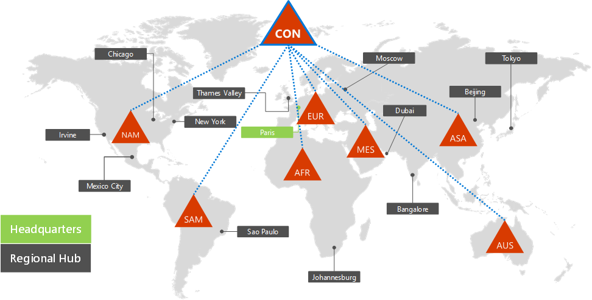
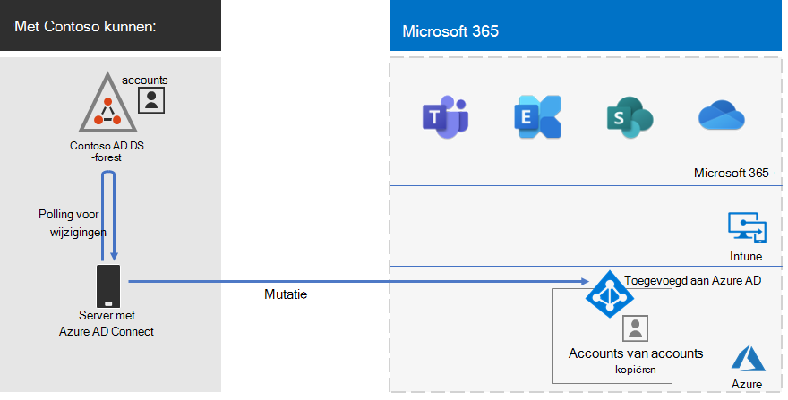
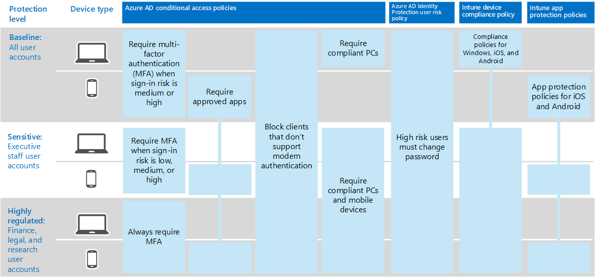

# Identiteit voor Contoso CorporationIdentity for the Contoso Corporation

Microsoft biedt Identity as a Service (IDaaS) via de cloudaanbiedingen via Azure Active Directory (Azure AD).Microsoft provides Identity as a Service (IDaaS) across its cloud offerings through Azure Active Directory (Azure AD). Als u Microsoft 365 voor ondernemingen wilt gebruiken, moest de Contoso IDaaS-oplossing hun on-premises identiteitsprovider gebruiken en federatief verificatie opnemen met hun bestaande vertrouwde, externe identiteitsproviders.To adopt Microsoft 365 for enterprise, the Contoso IDaaS solution had to use their on-premises identity provider and include federated authentication with their existing trusted, third-party identity providers.

## Het Contoso Active Directory Domain Services-forestThe Contoso Active Directory Domain Services forest

Contoso gebruikt één AD DS-forest (Active Directory Domain Services) voor contoso com met zeven subdomeinen, één voor elke regio \. ter wereld.Contoso uses a single Active Directory Domain Services (AD DS) forest for contoso\.com with seven subdomains, one for each region of the world. De hoofdkantoren, regionale regiokantoren en satellietkantoren bevatten domeincontrollers voor lokale verificatie en autorisatie.The headquarters, regional hub offices, and satellite offices contain domain controllers for local authentication and authorization.

Hier is het Contoso-bos met regionale domeinen voor de verschillende delen van de wereld die regionale hubs bevatten.Here's the Contoso forest with regional domains for the different parts of the world that contain regional hubs.

 
Contoso heeft besloten de accounts en groepen in het contoso-combos te gebruiken voor verificatie en autorisatie voor de Microsoft 365 \. werkbelasting en services.Contoso decided to use the accounts and groups in the contoso\.com forest for authentication and authorization for its Microsoft 365 workloads and services.

## De contoso-federatief verificatie-infrastructuurThe Contoso federated authentication infrastructure

Met Contoso kunnen:Contoso allows:

- Klanten kunnen hun Microsoft-, Facebook- of Google Mail-accounts gebruiken om zich aan te melden bij de openbare website van het bedrijf.Customers to use their Microsoft, Facebook, or Google Mail accounts to sign in to the company's public web site.
- Leveranciers en partners kunnen hun LinkedIn-, Salesforce- of Google Mail-accounts gebruiken om zich aan te melden bij het partner-extranet van het bedrijf.Vendors and partners to use their LinkedIn, Salesforce, or Google Mail accounts to sign in to the company's partner extranet.

Hier is de Contoso DMZ met een openbare website, een partner extranet en een set AD FS-servers (Active Directory Federation Services).Here's the Contoso DMZ containing a public web site, a partner extranet, and a set of Active Directory Federation Services (AD FS) servers. De DMZ is verbonden met internet dat klanten, partners en internetservices bevat.The DMZ is connected to the internet that contains customers, partners, and internet services.

 
AD FS-servers in de DMZ vergemakkelijken verificatie van klantreferenties door hun identiteitsproviders voor toegang tot de openbare website en partnerreferenties voor toegang tot het partner extranet.AD FS servers in the DMZ facilitate authentication of customer credentials by their identity providers for access to the public web site and partner credentials for access to the partner extranet.

Contoso heeft besloten deze infrastructuur te behouden en deze te wijden aan klant- en partnerverificatie.Contoso decided to keep this infrastructure and dedicate it to customer and partner authentication. De architecten van de identiteits-infrastructuur onderzoeken de conversie van deze infrastructuur naar Azure AD [B2B](/azure/active-directory/b2b/hybrid-organizations) en [B2C](/azure/active-directory-b2c/solution-articles)-oplossingen.Contoso identity architects are investigating the conversion of this infrastructure to Azure AD [B2B](/azure/active-directory/b2b/hybrid-organizations) and [B2C](/azure/active-directory-b2c/solution-articles) solutions.

## Hybride identiteit met wachtwoord-hash-synchronisatie voor cloud-based verificatieHybrid identity with password hash synchronization for cloud-based authentication

Contoso wilde de on-premises AD DS-forest gebruiken voor verificatie om Microsoft 365 cloudbronnen.Contoso wanted to use its on-premises AD DS forest for authentication to Microsoft 365 cloud resources. Er is besloten om wachtwoordhashsynchronisatie (PHS) te gebruiken.It decided to use password hash synchronization (PHS).

PHS synchroniseert het on-premises AD DS-forest met de Azure AD-tenant van hun Microsoft 365 voor ondernemingsabonnement, het kopiëren van gebruikers- en groepsaccounts en een gehashte versie van wachtwoorden voor gebruikersaccounts.PHS synchronizes the on-premises AD DS forest with the Azure AD tenant of their Microsoft 365 for enterprise subscription, copying user and group accounts and a hashed version of user account passwords.

Als u adreslijstsynchronisatie wilt uitvoeren, heeft Contoso het hulpprogramma Azure AD Verbinding maken geïmplementeerd op een server in het parijse datacenter.To do directory synchronization, Contoso deployed the Azure AD Connect tool on a server in its Paris datacenter.

Hier is de server met Azure AD Verbinding maken het Contoso AD DS-forest peilen naar wijzigingen en deze wijzigingen vervolgens synchroniseren met de Azure AD-tenant.Here's the server running Azure AD Connect polling the Contoso AD DS forest for changes and then synchronizing those changes with the Azure AD tenant.

 
## Voorwaardelijk toegangsbeleid voor identiteits- en apparaattoegangConditional Access policies for identity and device access

Contoso heeft een set van Azure AD-en Intune [Voorwaardelijk toegangsbeleidsregels gemaakt](../security/defender-365-security/identity-access-policies.md) voor drie beveiligingsniveaus:Contoso created a set of Azure AD and Intune [Conditional Access policies](../security/defender-365-security/identity-access-policies.md) for three protection levels:

- *Basislijnbeveiligingen* zijn van toepassing op alle gebruikersaccounts.*Baseline* protections apply to all user accounts.
- *Gevoelige* beveiligingen zijn van toepassing op leidinggevenden en leidinggevenden.*Sensitive* protections apply to senior leadership and executive staff.
- *Sterk gereguleerde* beveiligingen zijn van toepassing op specifieke gebruikers in de financiële, juridische en onderzoeksafdelingen die toegang hebben tot sterk gereguleerde gegevens.*Highly Regulated* protections apply to specific users in the finance, legal, and research departments who have access to highly regulated data.

Hier is de resulterende set beleidsregels voor Contoso-identiteit en apparaat Voorwaardelijke toegang.Here's the resulting set of Contoso identity and device Conditional Access policies.

 
## Volgende stapNext step

Lees hoe Contoso de Microsoft Endpoint Configuration Manager gebruikt  om de huidige Windows 10 Enterprise binnen de organisatie te implementeren en te behouden.Learn how Contoso uses its Microsoft Endpoint Configuration Manager infrastructure to [deploy and keep current Windows 10 Enterprise](contoso-win10.md) across its organization.

## Zie ookSee also

[Identiteits-roadmap voor Microsoft 365 herkennenIdentity roadmap for Microsoft 365](identity-roadmap-microsoft-365.md)

[Overzicht van Microsoft 365 voor ondernemingenMicrosoft 365 for enterprise overview](microsoft-365-overview.md)

[TestlabrichtlijnenTest lab guides](m365-enterprise-test-lab-guides.md)