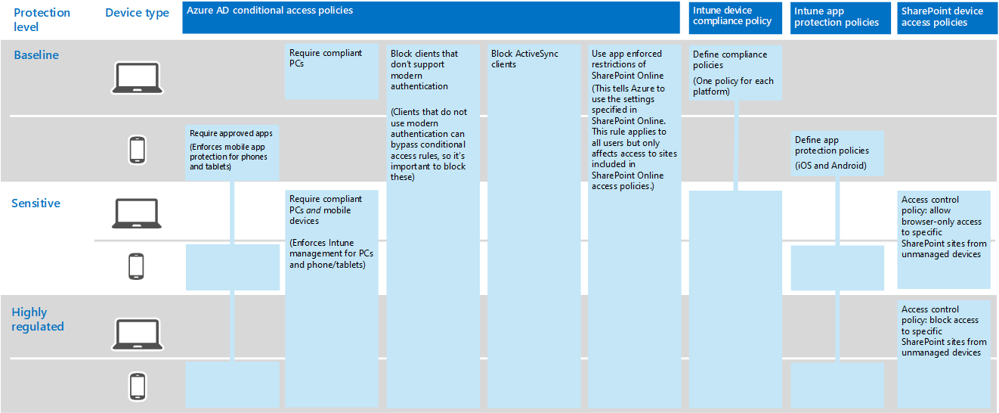
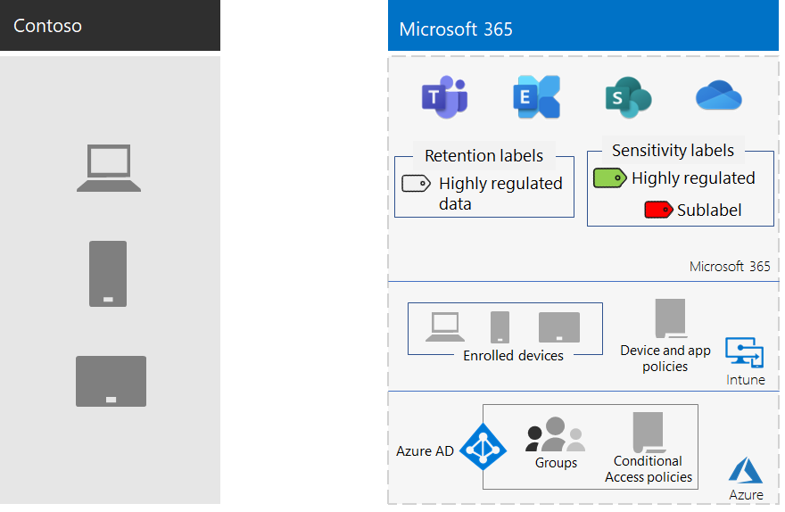

# Informatiebescherming voor Contoso CorporationInformation protection for the Contoso Corporation

Contoso is een belangrijke informatiebeveiliging.Contoso is serious about their information security. Een lekkage of vernietiging van de intellectuele-eigendom waarmee hun productmodellen en producten van eigen productie worden beschreven, hebben deze op een concurrentie nadeel.Leakage or destruction of intellectual property that describes their product designs and proprietary manufacturing techniques would place them at a competitive disadvantage.

Voordat Contoso de gevoelige digitale activa naar de Cloud verplaatst, controleert contoso of hun on-premises informatie classificatie en beschermings vereisten werden ondersteund door de cloudservices van Microsoft 365 for Enterprise.Before moving their sensitive digital assets to the cloud, Contoso made sure that their on-premises information classification and protection requirements were supported by the cloud-based services of Microsoft 365 for enterprise.

## Contoso gegevens beveiligings classificatieContoso data security classification

Contoso heeft een analyse van hun gegevens uitgevoerd en heeft de volgende classificatieniveaus vastgesteld.Contoso performed an analysis of their data and determined the following classification levels.

| Niveau 1: basislijnLevel 1: Baseline | Niveau 2: gevoeligLevel 2: Sensitive | Niveau 3: sterk gereglementeerdLevel 3: Highly regulated |
|:-------|:-----|:-----|
| Gegevens zijn versleuteld en alleen beschikbaar voor geverifieerde gebruikers.Data is encrypted and available only to authenticated users.    Verstrekt voor alle gegevens die lokaal zijn opgeslagen, en in opslagsystemen en werkbelasting in de Cloud.Provided for all data stored on-premises and in cloud-based storage and workloads. Gegevens worden versleuteld wanneer ze zich in de service bevinden en tijdens de overdracht tussen de service en de clientapparaten.Data is encrypted while it resides in the service and in transit between the service and client devices.   Voorbeelden van gegevens van niveau 1 zijn normale bedrijfscommunicatie (e-mail) en bestanden voor administratieve, verkoop- en ondersteuningsmedewerkers.Examples of Level 1 data are normal business communications (email) and files for administrative, sales, and support workers. | Niveau 1 plus krachtige verificatie en bescherming tegen gegevensverlies.Level 1 plus strong authentication and data loss protection.    Geavanceerde verificatie omvat Azure Meervoudige Verificatie (MFA) met SMS-validatie.Strong authentication includes Azure Multi-Factor Authentication (MFA) with SMS validation. Preventie van gegevensverlies zorgt ervoor dat gevoelige of kritieke informatie niet wordt verzonden buiten de Microsoft-Cloud.Data loss prevention ensures that sensitive or critical information doesn't travel outside the Microsoft cloud.  Voorbeelden van gegevens op niveau 2 zijn financiële en juridische informatie en onderzoeks- en ontwikkelingsgegevens voor nieuwe producten.Examples of Level 2 data are financial and legal information and research and development data for new products. | Niveau 2 plus de hoogste niveaus van versleuteling, verificatie en controle.Level 2 plus the highest levels of encryption, authentication, and auditing.  De hoogste niveaus van codering voor gegevens in de service en in de Cloud, conform de regionale voorschriften, gecombineerd met MFA met smartcards en granulaire controle en waarschuwingen.The highest levels of encryption for data at rest and in the cloud, compliant with regional regulations, combined with MFA with smart cards and granular auditing and alerting.   Voorbeelden van gegevens over de klant en de partners zijn persoonlijke gegevens over de klant en de partner, specificaties voor product engineering en eigen productietechnieken.Examples of Level 3 data are customer and partner personal information, product engineering specifications, and proprietary manufacturing techniques.  |
||||

## Contoso Information policiesContoso information policies
De volgende tabel bevat informatie over contoso Information policies.The following table lists the Contoso information policies.

| WaardeValue | AccessAccess | GegevensretentieData retention | InformatiebeschermingInformation protection |
|:-------|:-----|:-----|:-----|
| Lage bedrijfswaarde (niveau 1: basislijn)Low business value (Level 1: Baseline) | Toegang tot iedereen toestaan.Allow access to all.  | 6 maanden6 months | Gebruik versleuteling.Use encryption. |
| Gemiddelde bedrijfswaarde (niveau 2: gevoelig)Medium business value (Level 2: Sensitive) | Sta toegang tot Contoso medewerkers, onderaannemers en partners.Allow access to Contoso employees, subcontractors, and partners.    Gebruik MFA, TLS (Transport Layer Security) en Mobile Application Management (MAM).Use MFA, Transport Layer Security (TLS), and Mobile Application Management (MAM). | 2 jaar2 years  | Gebruik hash-waarden voor gegevensintegriteit.Use hash values for data integrity.  |
| Hoge bedrijfswaarde (niveau 3: sterk gereglementeerd)High business value (Level 3: Highly regulated) | Sta toegang toe aan leidinggevenden en leads in engineering en productie.Allow access to executives and leads in engineering and manufacturing.     Rights Management System (RMS) met alleen beheerde netwerkapparaten.Rights Management System (RMS) with managed network devices only.  | 7 jaar7 years  | Gebruik digitale handtekeningen voor niet-afwijzing.Use digital signatures for non-repudiation.  |
|||||

## Het contoso-pad naar informatiebescherming met Microsoft 365 for EnterpriseThe Contoso path to information protection with Microsoft 365 for enterprise

Contoso Volg deze stappen om Microsoft 365 for Enterprise te voorbereiden op de vereisten voor informatiebescherming:Contoso followed these steps to prepare Microsoft 365 for enterprise for their information-protection requirements:

1. Opgeven welke gegevens u wilt beschermenIdentify what information to protect

   Contoso deed een uitgebreide beoordeling van hun bestaande digitale activa op de on-premises SharePoint-sites en bestandsshares en heeft elk activum geclassificeerd.Contoso did an extensive review of their existing digital assets located on on-premises SharePoint sites and file shares and classified each asset.

2. Beleidsregels voor toegang, behoud en informatiebescherming bepalen voor gegevensniveausDetermine access, retention, and information protection policies for data levels

   Op basis van de gegevensniveaus heeft Contoso gedetailleerde beleidsvereisten opgesteld, die werden gebruikt om bestaande digitale activa te beveiligen zodra ze naar de Cloud werden verplaatst.Based on the data levels, Contoso determined detailed policy requirements, which were used to protect existing digital assets as they were moved to the cloud.

3. Maak gevoeligheids labels en hun instellingen voor de verschillende gegevensniveausCreate sensitivity labels and their settings for the different levels of information

   Contoso heeft gevoeligheidslabels gemaakt voor hun gegevensniveaus, met het label Sterk gereglementeerd dat codering, machtigingen en watermerken omvat.Contoso created sensitivity labels for their data levels, with their highly regulated label that includes encryption, permissions, and watermarks.

4.  Gegevens verplaatsen van on-premises SharePoint-sites en bestandsshares naar hun nieuwe SharePoint-sitesMove data from on-premises SharePoint sites and file shares to their new SharePoint sites

    De bestanden die naar de nieuwe SharePoint-sites zijn gemigreerd, hebben de standaardretentielabels overgenomen die aan de site zijn toegewezen.The files migrated to the new SharePoint sites inherited the default retention labels assigned to the site.

5.  Traint medewerkers voor het gebruik van codegeschiktings punten voor nieuwe documenten, hoe u kunt communiceren met Contoso wanneer u nieuwe SharePoint-sites maakt en hoe u op dit moment ook digitale assets opslaat op SharePoint-sites.Train employees how to use sensitivity labels for new documents, how to interact with Contoso IT when creating new SharePoint sites, and to always store digital assets on SharePoint sites

    Het wijzigen van de informatie over het opslaan van een werknemer wordt vaak beschouwd als het moeilijkste deel van de overgang van de gegevensbescherming voor de Cloud.Changing bad worker information-storage habits is often considered the hardest part of the information protection transition for the cloud. Contoso IT en management nodig om werknemers te laten weten dat ze hun digitale activa in de cloud al willen bijvoegen en bewaren, geen on-premises bestandsshares mogen gebruiken en geen Cloud-opslagservices van derden of USB-stations gebruiken.Contoso IT and management needed to get employees to always label and store their digital assets in the cloud, refrain from using on-premises file shares, and not use third-party cloud storage services or USB drives.

## Beleid voor voorwaardelijke toegang voor informatiebeschermingConditional Access policies for information protection

Als onderdeel van de implementatie van Exchange Online en SharePoint, heeft Contoso de volgende set regels voor voorwaardelijke toegang geconfigureerd en worden deze op de juiste groepen toegepast:As part of their rollout of Exchange Online and SharePoint, Contoso configured the following set of Conditional Access policies and applied them to the appropriate groups:

- [Beheerde en niet-beheerde toepassingstoegang op apparaatbeleidManaged and unmanaged application access on devices policies](../security/office-365-security/identity-access-policies.md)
- [Beleid voor toegang tot Exchange OnlineExchange Online access policies](../security/office-365-security/secure-email-recommended-policies.md)
- [SharePoint-beleidsregels voor toegangSharePoint access policies](../security/office-365-security/sharepoint-file-access-policies.md)

Dit is de nieuwe set contoso-beleidsregels voor informatiebescherming.Here's resulting set of Contoso policies for information protection.

>[!Note]
>Contoso heeft ook aanvullend beleid voor voorwaardelijke toegang geconfigureerd voor identiteit en inloggen.Contoso also configured additional Conditional Access policies for identity and sign-in. Zie [Identiteit voor Contoso Corporation](contoso-identity.md#conditional-access-policies-for-identity-and-device-access).See [Identity for the Contoso Corporation](contoso-identity.md#conditional-access-policies-for-identity-and-device-access).
>

Dit beleid zorgt ervoor dat:These policies ensure that:

- Apps die zijn toegestaan en de acties die ze kunnen uitvoeren met de gegevens van de organisatie worden gedefinieerd door het app-beveiligingsbeleid.Apps that are allowed and the actions they can take with the organization's data are defined by app protection policies.
- Pc's en mobiele apparaten moeten compatibel zijn.PCs and mobile devices must be compliant.
- Exchange Online maakt gebruik van Office 365-bericht versleuteling (OME) voor Exchange Online.Exchange Online uses Office 365 message encryption (OME) for Exchange Online.
- In SharePoint worden door apps afgedwongen beperkingen gebruikt.SharePoint uses app-enforced restrictions.
- SharePoint gebruikt toegangsbeleidsregels voor alleen-browser toegang en om toegang te blokkeren voor niet-beheerde apparaten.SharePoint uses access control policies for browser-only access and to block access for unmanaged devices.

## Microsoft 365 for Enterprise-functies toewijzen aan contoso gegevensniveausMapping Microsoft 365 for enterprise features to Contoso data levels

In de volgende tabel worden contoso gegevensniveaus toegewezen aan functies voor informatiebeveiliging in Microsoft 365 for Enterprise.The following table maps Contoso data levels to information protection features in Microsoft 365 for enterprise.

| ConcentratieLevel | Microsoft 365-cloudservicesMicrosoft 365 cloud services | Windows 10- en Microsoft 365-apps voor ondernemingenWindows 10 and Microsoft 365 Apps for enterprise | Beveiliging en complianceSecurity and compliance |
|:-------|:-----|:-----|:-----|
| Niveau 1: basislijnLevel 1: Baseline  | Voorwaardelijke toegangsbeleidsregels voor SharePoint en Exchange OnlineSharePoint and Exchange Online Conditional Access policies   Machtigingen op SharePoint-sitesPermissions on SharePoint sites | GevoeligheidslabelsSensitivity labels   BitLockerBitLocker   Windows-gegevensbeschermingWindows Information Protection | Beleid voor voorwaardelijke toegang van apparaten en beleid voor Mobile Application ManagementDevice Conditional Access policies and Mobile Application Management policies |
| Niveau 2: gevoeligLevel 2: Sensitive | Niveau 1 plus:Level 1 plus:     GevoeligheidslabelsSensitivity labels   Microsoft 365-bewaarlabels op SharePoint-sitesMicrosoft 365 retention labels on SharePoint sites   Preventie van gegevensverlies voor SharePoint en Exchange OnlineData Loss Prevention for SharePoint and Exchange Online   Geïsoleerde SharePoint-sitesIsolated SharePoint sites  | Niveau 1 plus:Level 1 plus:     Gevoeligheidslabels voor digitale activaSensitivity labels on digital assets  | Niveau 1Level 1 |
| Niveau 3: sterk gereglementeerdLevel 3: Highly regulated | Niveau 2 plus:Level 2 plus:    Uw eigen sleutel (BYOK) versleutelen en beschermen voor informatie over handelsgeheimenBring your own key (BYOK) encryption and protection for trade secret information   Azure-sleutel kluis voor line-of-business-toepassingen die werken met Microsoft 365-ServicesAzure Key Vault for line-of-business applications that interact with Microsoft 365 services | Niveau 2Level 2 | Niveau 1Level 1 |
|||||

Hier ziet u de informatie over de informatie-bescherming van contoso.Here's the resulting Contoso information-protection configuration.

## Volgende stapNext step

Meer informatie over hoe Contoso de [beveiligingsfuncties in Microsoft 365 voor ondernemingen](contoso-security-summary.md) gebruikt voor identiteits-en toegangsbeheer, bedreigingsbeveiliging, informatiebescherming en beveiligingsbeheer.Learn how Contoso uses the [security features across Microsoft 365 for enterprise](contoso-security-summary.md) for identity and access management, threat protection, information protection, and security management.

## Zie ookSee also

[Roadmap voor beveiligingSecurity roadmap](https://docs.microsoft.com/microsoft-365/security/office-365-security/security-roadmap)

[Overzicht van Microsoft 365 voor ondernemingenMicrosoft 365 for enterprise overview](microsoft-365-overview.md)

[TestlabrichtlijnenTest lab guides](m365-enterprise-test-lab-guides.md)
