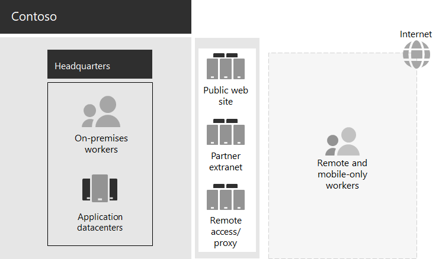

# De IT-infrastructuur en zakelijke behoeften van Contoso

Contoso is overgestapt van een on-premises gecentraliseerde IT-infrastructuur naar een cloud-inclusieve infrastructuur die persoonlijke productiviteitsworkloads en toepassingen in de cloud omvat.

## De bestaande IT-infrastructuur van Contoso

Contoso maakt gebruik van een grotendeels gecentraliseerde on-premise IT-infrastructuur, met toepassingsdatacenters op het hoofdkantoor in Parijs.

Figuur 1 toont een hoofdkantoor met toepassingsdatacenters, een DMZ en internet.

**Afbeelding 1: de bestaande IT-infrastructuur van Contoso**
 
De on-premises toepassingsdatacenters hosten: 

- Aangepaste bedrijfstoepassingen die gebruikmaken van SQL Server en andere Linux-databases.
- Een set verouderde SharePoint-servers.
- Servers op organisatie- en teamniveau voor bestandsopslag.

Bovendien ondersteunt elk regionaal hubkantoor een set servers met een vergelijkbare set applicaties. Deze servers worden onderhouden door regionale IT-afdelingen.

Doorzoekbaarheid in de applicaties en gegevens van deze afzonderlijke, geografisch verspreide datacenters blijft een uitdaging.

In Contoso's hoofdkantoor DMZ bieden verschillende verzamelingen servers het volgende:

- Hosting van de openbare website van Contoso, waar klanten producten, onderdelen, benodigdheden of service kunnen bestellen.
- Hosting van het partner-extranet voor communicatie en samenwerking met Contoso-partners.
- Op VPN'S gebaseerde externe toegang tot het intranet van Contoso en webproxy voor werknemers in het hoofdkantoor van Parijs.

## De zakelijke behoeften van Contoso

De zakelijke behoeften van Contoso bestaan uit vijf hoofdcategorieën.

Productiviteit:

- Eenvoudiger samenwerken

  Vervang de samenwerking op basis van e-mail en het delen van bestanden door een online model dat realtime wijzigingen in documenten, eenvoudigere online vergaderingen en vastgelegde gespreks-threads mogelijk maakt.
- Verbeter de productiviteit voor externe en mobiele werknemers

  Omdat veel werknemers vanuit huis of in het veld werken, vervangt u de snel blokkerende VPN-oplossing door performante toegang tot Contoso-gegevens en -bronnen in de cloud.
- Verbeter de creativiteit en innovatie

  Profiteer van de nieuwste visuele leer- en ideeontwikkelingsmethoden, inclusief inkt en 3D-visualisatie.

Beveiliging:

- Identiteits- en toegangsbeheer

  Dwing meervoudige verificatie en andere vormen van verificatie af en bescherm de accountgegevens van gebruikers en beheerders.

- Bedreigingsbeveiliging

  Bescherm tegen externe beveiligingsdreigingen, waaronder e-mail en op het besturingssysteem gebaseerde malware.

- Gegevensbeveiliging

  Vergrendel de toegang tot en codeer hoogwaardige digitale middelen, zoals klantgegevens, ontwerp- en fabricagespecificaties en werknemersinformatie.

- Beveiligingsbeheer

  Bewaak de veiligheid, detecteer bedreigingen en onderneem in realtime actie.

Externe en mobiele toegang en zakelijke partners:

- Verbeterde beveiliging voor externe en mobiele werknemers

  Stel apparaatbeheer in voor zowel privé (BYOD) als bedrijfseigen apparaten, om beveiligde toegang, correct applicatiegedrag en bedrijfsgegevensbescherming te garanderen.

- De infrastructuur voor externe toegang voor werknemers reduceren

  Verlaag de onderhouds- en ondersteuningskosten en verbeter de prestaties voor oplossingen voor externe toegang door veelgebruikte bronnen naar de cloud te verplaatsen.

- Zorg voor betere connectiviteit en lagere overhead voor B2B-transacties

  Vervang verouderd en kostbaar partner-extranet door een cloud-gebaseerde oplossing die gebruikmaakt van federatieve verificatie.

Naleving:

- Voldoen aan regionale wettelijke voorschriften

  Werk blijvend in overeenstemming met de industriële en regionale voorschriften voor gegevensopslag, versleuteling, gegevensprivacy en persoonsgegevens, zoals de Algemene Verordening Gegevensbescherming (AVG) voor de Europese Unie.

Management:

- Verlaag de IT-overhead voor het beheer van software die wordt uitgevoerd op client-pc's en apparaten

  Automatiseer de installatie van updates voor het Windows-besturingssysteem en Microsoft Office ProPlus in de hele organisatie.

## De zakelijke behoeften van Contoso toewijzen aan Microsoft 365 Enterprise

De IT-afdeling van Contoso heeft voorafgaand aan de implementatie de volgende informatie over de zakelijke behoeften aan Microsoft 365 E5-functies bepaald:

||||
|:-------|:-----|:-----|
| **Categorie** | **Zakelijke behoefte** | **Producten of functies van Microsoft 365 Enterprise** |
| Productiviteit |  |  |
|  | Eenvoudiger samenwerken | Microsoft Teams, SharePoint, OneDrive |
|  | Verbeter de productiviteit voor externe en mobiele werknemers | Werkbelasting en cloud-gebaseerde gegevens voor Microsoft 365 |
|  | Verbeter de creativiteit en innovatie | Windows Ink, Cortana op het werk, PowerPoint |
| Beveiliging |  |  |
|  | Identiteits- en toegangsbeheer | Toegewijde wereldwijde beheerdersaccounts met Azure meervoudige verificatie (MFA) en Azure AD Privileged Identity Management (PIM)   MFA voor alle gebruikersaccounts   Voorwaardelijke toegang   Windows Hello   Windows Credential Guard |
|  | Bedreigingsbeveiliging | Advanced Threat Analytics   Windows Defender   Advanced Threat Protection   Office 365 Advanced Threat Protection   Dreigingsonderzoek en -antwoord in Office 365   |
|  | Gegevensbeveiliging | Azure-gegevensbeveiliging   Preventie van gegevensverlies (DLP, Data Loss Prevention)   Windows-gegevensbescherming (WIP)   Microsoft Cloud App Security   Microsoft Intune |
|  | Beveiligingsbeheer | Azure Security Center    Windows Defender-Beveiligingscentrum |
| Externe en mobiele toegang en zakelijke partners |  |  |
|  | Verbeterde beveiliging voor externe en mobiele werknemers | Microsoft Intune |
|  | De infrastructuur voor externe toegang voor werknemers reduceren | Werkbelasting en cloud-gebaseerde gegevens voor Microsoft 365 |
|  | Zorgen voor betere connectiviteit en lagere overhead voor B2B-transacties | Federatieve verificatie en cloudgebaseerde bronnen |
| Naleving |  |  |
|  | Voldoen aan regionale wettelijke voorschriften | AVG-functies in Office 365 |
| Beheer |  |  |
|  | Verlaag de IT-overhead voor het installeren van client-updates | Implementatieringen.   Updates voor Windows 10 Enterprise   Updates voor Microsoft 365-apps voor ondernemingen |
||||

## Volgende stap

[Meer informatie](contoso-networking.md) over het gebruik van het on-premises netwerk van Contoso Corporation en hoe het is geoptimaliseerd voor toegang en latentie tot resources van Microsoft 365 Cloud.

## Zie ook

[Implementatiehandleiding](deploy-microsoft-365-enterprise.md)

[Testlabrichtlijnen](m365-enterprise-test-lab-guides.md)
