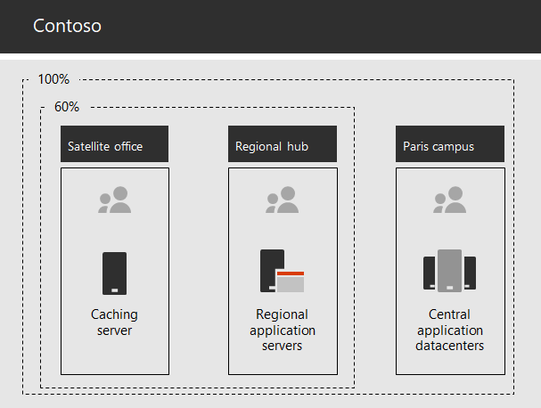

# Netwerken voor de Contoso Corporation

Om een cloud-inclusieve infrastructuur te implementeren, hebben de netwerkengineers van Contoso een fundamentele verschuiving gerealiseerd in de manier waarop netwerkverkeer naar cloudservices wordt geleid. In plaats van een intern hub-and-spoke-model waarin netwerkconnectiviteit en netwerkverkeer wordt gericht op het volgende niveau van de kantoorhiërarchie van Contoso, hebben ze gebruikerslocaties aan lokale internet-uitgangen en lokale verbindingen aan de dichtstbijzijnde Microsoft 365-netwerklocatie op het internet gekoppeld.

## Netwerkinfrastructuur van Contoso

De elementen van het netwerk van Contoso die hun kantoren op de hele wereld koppelen, zijn de volgende:

- Multiprotocol-Label Switching (MPLS) WAN-netwerk

  Een MPLS WAN-netwerk verbindt het hoofdkantoor in Parijs met regionale kantoren en regionale kantoren met satellietkantoren in een hub-and-spoke-configuratie. Zo hebben gebruikers toegang tot servers op locatie met Line of Business-toepassingen in het kantoor in Parijs. Het leidt ook al het algemene internetverkeer naar het kantoor in Parijs, waar netwerkbeveiligingsapparaten de verzoeken beoordelen. Binnen elke kantoor leiden routers het verkeer naar draadgebonden hosts of draadloze toegangspunten op subnetten, die gebruikmaken van de particuliere IP-adresruimte.

- Lokale rechtstreekse internettoegang voor Microsoft 365-verkeer

  Elk kantoor heeft een softwaregedefinieerd WAN-apparaat met een of meer lokale netwerkcircuits van de internetprovider en een eigen internetverbinding via een proxyserver. Dit wordt meestal geïmplementeerd als een WAN-koppeling naar een lokale internetprovider die ook openbare IP-adressen en een lokale DNS-server biedt.

- Internetaanwezigheid

  Contoso is de eigenaar van de openbare domeinnaam contoso.com. De openbare website van Contoso voor het bestellen van producten draait op een reeks servers in een op het internet aangesloten datacenter op de campus in Parijs. Contoso gebruikt een /24 openbaar IP-adresbereik op het internet.

Afbeelding 1 toont de netwerkinfrastructuur van Contoso en de bijbehorende verbindingen met het internet.

 
**Afbeelding 1: Het netwerk van Contoso**

## Gebruik van SD-WAN voor optimale netwerkconnectiviteit met Microsoft

Contoso heeft de [Beginselen voor Microsoft 365-netwerkconnectiviteit](microsoft-365-network-connectivity-principles.md) gevolgd om:

1. Netwerkverkeer van Microsoft 365 te identificeren en te onderscheiden
2. Lokale uitgangen van netwerkverbindingen te regelen
3. Netwerk-hairpins te vermijden
4. Dubbele netwerkbeveiligingsapparaten te omzeilen

Er zijn drie categorieën netwerkverkeer voor Microsoft 365: Optimaliseren, toestaan en standaard. Verkeer in de categorieën Optimaliseren en Toestaan is betrouwbaar netwerkverkeer dat versleuteld en beveiligd is bij de eindpunten en is bestemd voor het Microsoft 365-netwerk.

Contoso heeft besloten om:

- Directe internetuitgangen te gebruiken voor verkeer uit de categorieën Optimaliseren en Toestaan en voor het doorsturen van al het verkeer in de categorie Standaard naar de centrale internetverbinding met Parijs.

- Op elk van hun kantoorlocaties SD-WAN-apparaten te implementeren om deze principes op een eenvoudige manier toe te passen en optimale netwerkprestaties te bereiken voor de cloudservices van Microsoft 365.

  De SD-WAN-apparaten hebben een LAN-poort voor het lokale kantoornetwerk en meerdere WAN-poorten. Een WAN-poort maakt verbinding met het MPLS-netwerk en een andere WAN-poort maakt verbinding met een lokaal ISP-circuit. Het SD-WAN-apparaat leidt netwerkverkeer uit de categorieën Optimaliseren en Toestaan via de ISP-koppeling.

## De Line of Business-toepassingeninfrastructuur van Contoso

Contoso heeft haar Line of Business-toepassingen- en serverintranetinfrastructuur ingericht voor het volgende:

- Satellietkantoren gebruiken lokale cacheservers voor het opslaan van veelgebruikte documenten en interne websites.
- Regionale hubs gebruiken regionale toepassingsservers voor de regionale en satellietkantoren. Deze servers worden gesynchroniseerd met servers in het hoofdkantoor in Parijs.
- Op de campus in Parijs bevinden zich datacenters met gecentraliseerde toepassingsservers waar de hele organisatie gebruik van maakt.

Afbeelding 2 toont het percentage van netwerkverkeer bij het verkrijgen van toegang tot servers in het intranet van contoso.

 
**Afbeelding 2: De infrastructuur van Contoso voor interne toepassingen**

Voor gebruikers op satelliet- of regionale hub-kantoren kan 60% van de resources die nodig zijn voor werknemers worden bediend door satelliet- en regionale kantoorservers. De extra 40% van de resourceaanvragen moet via de WAN-koppeling naar de campus in Parijs worden geleid.

## De netwerkanalyse en-voorbereiding van Contoso voor het netwerk voor Microsoft 365 for Enterprise

De aanneming van Microsoft 365 voor Enterprise Services door de gebruikers van Contoso is afhankelijk van uiterst beschikbare en uitvoering van connectiviteit met internet, of rechtstreeks naar Microsoft-cloudservices. Contoso heeft de volgende stappen uitgevoerd voor het plannen en implementeren van geoptimaliseerde verbindingen met Microsoft 365 voor Enterprise cloudservices:

1. Een WAN-netwerkdiagram van het bedrijf gemaakt om te helpen bij de planning

   Contoso heeft de netwerkplanning gestart door een diagram te maken met de bijbehorende locaties, de bestaande netwerkconnectiviteit, de bestaande apparaten voor de netwerkperimeter en de klassen van de service die worden beheerd op het netwerk. Ze hebben deze diagram gebruikt voor elke daaropvolgende stap in de planning en tijdens de implementatie van netwerkconnectiviteit.

2. Een plan gemaakt voor Microsoft 365 voor Enterprise Network Connectivity

   Contoso heeft de [Basisprincipes voor Microsoft 365-netwerkconnectiviteit](microsoft-365-network-connectivity-principles.md) en netwerkarchitecturen ter referentie geleverd om SD-WAN vast te leggen als gewenste topologie voor Microsoft 365-connectiviteit.

3. Het verbruik van de internetverbinding en de MPLS WAN-bandbreedte op elke kantoor geanalyseerd en de bandbreedte indien nodig verhoogd

   Het huidige verbruik van elk kantoor is geanalyseerd en circuits zijn uitgebreid, zodat het verwachte verkeer in de Microsoft 365 Cloud zou worden uitgevoerd met een gemiddelde van 20% aan de niet-gebruikte capaciteit.

4. Optimale prestaties van Microsoft-netwerkservices

   Contoso heeft de set met Office 365-, Intune- en Azure-eindpunten vastgesteld en firewalls, beveiligingsapparaten en andere systemen in het internetpad geconfigureerd voor optimale prestaties. Eindpunten voor Office 365-verkeer in de categorieën Optimaliseren en Toestaan zijn in de SD-WAN-apparaten geconfigureerd voor routering via het ISP-circuit.

5. Interne DNS geconfigureerd

   DNS moet functioneel zijn en lokaal worden opgezocht voor Microsoft 365-verkeer.

6. Gevalideerd netwerkeindpunt en poortconnectiviteit

   Contoso heeft testhulpprogramma's voor netwerkverbindingen van Microsoft uitgevoerd om de connectiviteit voor Microsoft 365 te valideren voor Enterprise cloudservices.

7. Computers van werknemers geoptimaliseerd voor netwerkconnectiviteit

   Afzonderlijke computers zijn gecontroleerd om te controleren of de meest recente updates voor het besturingssysteem geïnstalleerd waren en controle van de eindpuntbeveiliging bij alle clients actief was.

## Volgende stap

[Lees hier meer](contoso-identity.md) over hoe Contoso op locatie Active Directory Domain Services (AD DS) in de Cloud gebruikt voor werknemers en federatieve verificatie voor klanten en zakenpartners.

## Zie ook

[Netwerkkaart voor Microsoft 365](networking-roadmap-microsoft-365.md)

[Overzicht van Microsoft 365 voor ondernemingen](microsoft-365-overview.md)

[Testlabrichtlijnen](m365-enterprise-test-lab-guides.md)
