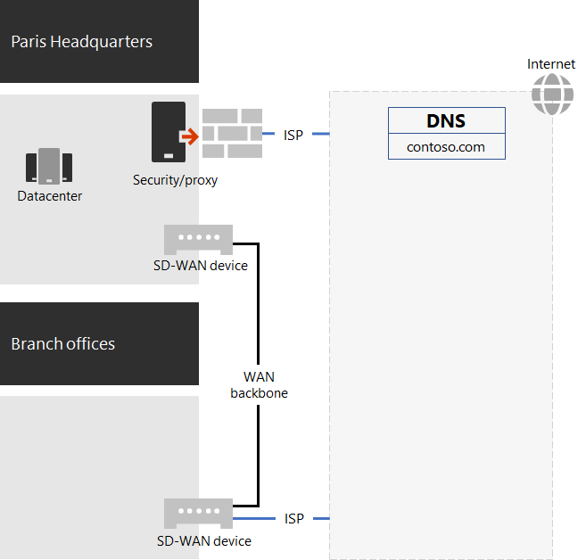

# Netwerken voor de Contoso Corporation

Als u een cloudinclusieve infrastructuur wilt gebruiken, heeft Contoso een fundamentele verschuiving in de manier waarop netwerkverkeer naar cloudservices wordt verplaatst, ontworpen. In plaats van een intern hub- en spaakmodel dat netwerkconnectiviteit en -verkeer voor het volgende niveau van de office-hiërarchie focust, hebben ze gebruikerslocaties in kaart gebracht aan lokale internetafding en lokale verbindingen met de dichtstbijzijnde Microsoft 365-netwerklocatie op internet.

## Netwerkinfrastructuur

Dit zijn de netwerkelementen die Contoso-kantoren over de hele wereld met elkaar verbinden:

- Multiprotocol-Label Switching (MPLS) WAN-netwerk

  Een MPLS WAN-netwerk verbindt het hoofdkantoor van Parijs met regionale kantoren en regionale kantoren met satellietkantoren in een spaak- en hubconfiguratie. Het netwerk stelt gebruikers in staat toegang te krijgen tot on-premises servers die line-of-businesstoepassingen maken in het hoofdkantoor van Parijs. Ook worden alle algemene internetverkeer naar het kantoor in Parijs gerouteerd, waar netwerkbeveiligingsapparaten de aanvragen opscruten. Binnen elke kantoor leiden routers het verkeer naar draadgebonden hosts of draadloze toegangspunten op subnetten, die gebruikmaken van de particuliere IP-adresruimte.

- Lokale directe internettoegang voor Microsoft 365 verkeer

  Elk kantoor heeft een door software gedefinieerd WAN-apparaat (SD-WAN) dat een of meer lokale internetnetwerkcircuits met een eigen internetverbinding heeft via een proxyserver. Dit wordt meestal geïmplementeerd als een WAN-koppeling naar een lokale internetprovider die ook openbare IP-adressen en een lokale DNS-server biedt.

- Internetaanwezigheid

  Contoso is de eigenaar van de openbare domeinnaam contoso \. com. De openbare website van Contoso voor het bestellen van producten is een set servers in een datacenter met internetverbinding op de parijse campus. Contoso gebruikt een openbaar IP-adresbereik van /24 op internet.

Afbeelding 1 toont de Contoso-netwerkinfrastructuur en de verbindingen met internet.

 
**Afbeelding 1: Het Contoso-netwerk**

## Gebruik van SD-WAN voor optimale netwerkconnectiviteit met Microsoft

Contoso heeft de [Beginselen voor Microsoft 365-netwerkconnectiviteit](microsoft-365-network-connectivity-principles.md) gevolgd om:

- Netwerkverkeer van Microsoft 365 te identificeren en te onderscheiden
- Lokale uitgangen van netwerkverbindingen te regelen
- Netwerk-hairpins te vermijden
- Dubbele netwerkbeveiligingsapparaten te omzeilen

Er zijn drie categorieën netwerkverkeer voor Microsoft 365: *Optimaliseren,* *Toestaan* en *Standaard.* Het optimaliseren en toestaan van verkeer is vertrouwd netwerkverkeer dat is versleuteld en beveiligd op de eindpunten en bestemd is voor het Microsoft 365 netwerk.

Contoso heeft besloten om:

- Gebruik direct internet egress voor Het optimaliseren en toestaan van categorieverkeer en om alle standaardcategorieverkeer door te sturen naar de centrale internetverbinding in Parijs.

- Implementeer SD-WAN-apparaten op elk kantoor als een eenvoudige manier om deze principes te volgen en optimale netwerkprestaties te bereiken voor Microsoft 365 cloudservices.

  De SD-WAN-apparaten hebben een LAN-poort voor het lokale kantoornetwerk en meerdere WAN-poorten. Eén WAN-poort maakt verbinding met het MPLS-netwerk. Een andere verbinding maakt verbinding met een lokaal isp-circuit. Het SD-WAN-apparaat leidt netwerkverkeer uit de categorieën Optimaliseren en Toestaan via de ISP-koppeling.

## De contoso-app-infrastructuur

Contoso heeft de line-of-business-toepassings- en serverintranetinfrastructuur voor het volgende ontworpen:

- Satellietkantoren gebruiken lokale cacheservers voor het opslaan van veelgebruikte documenten en interne websites.
- Regionale hubs gebruiken regionale toepassingsservers voor de regionale en satellietkantoren. Deze servers worden gesynchroniseerd met servers in het hoofdkantoor in Parijs.
- De parijse campus datacenters bevatten gecentraliseerde toepassingsservers die de hele organisatie bedienen.

Afbeelding 2 toont het percentage van de netwerkverkeerscapaciteit dat wordt gebruikt bij het openen van servers op het intranet van Contoso.

 
**Afbeelding 2: De Contoso-infrastructuur voor interne toepassingen**

Voor de satelliet- of regionale hubkantoren kan 60 procent van de benodigde resources door werknemers worden gebruikt via satelliet- en regionale hub-officeservers. De extra 40 procent van de resourceaanvragen moet via de WAN-koppeling naar de parijse campus gaan.

## Netwerkanalyse en voorbereiding voor Microsoft 365 voor ondernemingen

Succesvolle acceptatie van Microsoft 365 voor zakelijke services door Contoso-gebruikers is afhankelijk van zeer beschikbare en performante connectiviteit met internet of rechtstreeks met Microsoft-cloudservices. Contoso heeft de volgende stappen ondernomen om geoptimaliseerde connectiviteit te plannen en te implementeren Microsoft 365 voor zakelijke cloudservices:

1. Een BEDRIJFS WAN-netwerkdiagram maken om hulp te bieden bij het plannen

   Om de netwerkplanning te starten, heeft Contoso een diagram gemaakt met hun kantoorlocaties, bestaande netwerkconnectiviteit, bestaande netwerkperimeters en serviceklassen die worden beheerd in het netwerk. Ze hebben deze diagram gebruikt voor elke daaropvolgende stap in de planning en tijdens de implementatie van netwerkconnectiviteit.

2. Een plan maken voor Microsoft 365 voor zakelijke netwerkconnectiviteit

   Contoso heeft de [Microsoft 365](microsoft-365-network-connectivity-principles.md) netwerkconnectiviteitsprincipes en voorbeeldverwijzingsnetwerkarchitectuur gebruikt om SD-WAN te identificeren als hun voorkeurstopologie voor Microsoft 365 connectiviteit.

3. Analyseer het gebruik van internetverbinding en MPLS-WAN-bandbreedte op elk kantoor en verhoog de bandbreedte zo nodig

   Het huidige gebruik van elk kantoor is geanalyseerd en circuits zijn verhoogd, zodat voorspeld Microsoft 365 cloudverkeer zou werken met een gemiddelde van 20 procent ongebruikte capaciteit.

4. Prestaties optimaliseren voor Microsoft-netwerkservices

   Contoso heeft de set Office 365, Intune en Azure-eindpunten en geconfigureerde firewalls, beveiligingsapparaten en andere systemen in het internetpad bepaald voor optimale prestaties. Eindpunten voor Office 365 Categorieverkeer optimaliseren en toestaan zijn geconfigureerd op de SD-WAN-apparaten voor routering via het isp-circuit.

5. Interne DNS configureren

   DNS moet functioneel zijn en lokaal worden opgezocht voor Microsoft 365-verkeer.

6. Netwerk-eindpunt- en poortconnectiviteit valideren

   Contoso heeft testprogramma's voor Microsoft-netwerkconnectiviteit uitgevoerd om connectiviteit te valideren Microsoft 365 voor zakelijke cloudservices.

7. Werknemerscomputers optimaliseren voor netwerkconnectiviteit

   Afzonderlijke computers zijn gecontroleerd om ervoor te zorgen dat de meest recente updates van het besturingssysteem zijn geïnstalleerd en dat beveiligingscontrole van eindpunten actief was op alle clients.

## Volgende stap

Lees hoe Contoso gebruik maakt van de [on-premises Active Directory Domain Services in](contoso-identity.md) de cloud voor werknemers en verificatie voor klanten en zakenpartners federatief maakt.

## Zie ook

[Netwerkroutekaart voor Microsoft 365](networking-roadmap-microsoft-365.md)

[Overzicht van Microsoft 365 voor ondernemingen](microsoft-365-overview.md)

[Testlabrichtlijnen](m365-enterprise-test-lab-guides.md)
