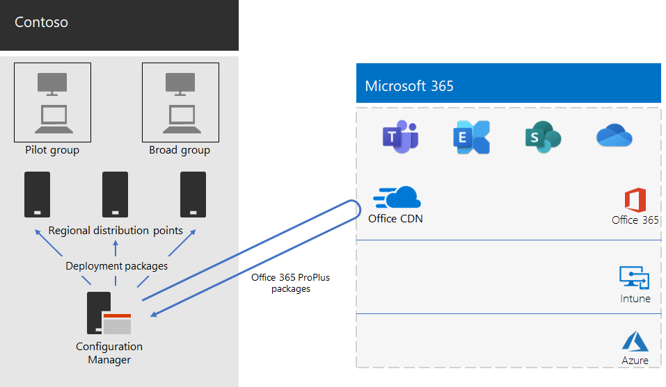

# Implementatie van Microsoft 365-apps voor ondernemingen voor Contoso

Contoso heeft hun pc's geüpgraded naar Windows 10 Enterprise en Microsoft 365-apps voor ondernemingen om effectievere samenwerking, betere beveiliging en een modernere bureaubladervaring mogelijk te maken. Na het evalueren van hun infrastructuur en bedrijfsbehoeften identificeerde Contoso deze belangrijke vereisten voor de implementatie:

- Alle pc‘s moeten uitgerust zijn met Microsoft 365-apps voor ondernemingen
- De implementatie moet indien mogelijk bestaande beheerprogramma's en infrastructuur gebruiken
- De implementatie moet ondersteuning bieden voor meerdere talen en voor bestaande architecturen op apparaten van eindgebruikers.
- Pc’s moeten up-to-date en beveiligd blijven met minimale administratieve IT-kosten en minimale overlast voor eindgebruikers

## Implementatiehulpmiddelen

Contoso koos voor de implementatie van Windows 10 Enterprise en Microsoft 365-apps voor ondernemingen met Configuration Manager (Current Branch) op basis van hun vereisten. Configuration Manager is schaalbaar voor grote omgevingen en biedt uitgebreide controle over installatie, updates en instellingen. Er zijn ook ingebouwde functies waarmee het eenvoudiger en efficiënter wordt om Office te implementeren en te beheren, waaronder:

- Peer-cache, die ondersteuning biedt bij beperkte netwerkcapaciteit tijdens de implementatie op apparaten op externe locaties
- Het clientbeheerdashboard voor Office, dat het eenvoudig maakt Office te implementeren en op updates te controleren en waarmee beheerders toegang hebben tot de recentste implementatie-en beheerfuncties
- Intelligent implementeren van het taalpakket, met inbegrip van de automatische implementatie van dezelfde taal als het besturingssysteem
- Volledig ondersteund en gebruiksvriendelijke methode voor het verwijderen van bestaande versies van Office van een client tijdens de implementatie

Naast Configuration Manager gebruikte Contoso de [Readiness Toolkit](https://docs.microsoft.com/deployoffice/readiness-toolkit-application-compatibility-microsoft-365-apps), een gratis hulpprogramma van Microsoft, voor het evalueren van compatibiliteitsproblemen met de macro's en invoegtoepassingen van Office.

## De implementatie en updates beheren

Microsoft 365-apps voor ondernemingen heeft een nieuw releasemodel: Office-als-een-service. Het servicemodel maakt het eenvoudig om up-to-date te blijven met nieuwe functies, maar vaak vergt dit een wijziging van de manier waarop de IT-afdeling nieuwe releases implementeert en test. Om compatibiliteitsproblemen te minimaliseren en ervoor te zorgen dat hun computers up-to-date werden gehouden, implementeerde Contoso Windows en Office in twee fasen: 

- In de eerste fase implementeerden ze Microsoft 365-apps voor ondernemingen op een klein aantal representatieve apparaten verspreid over de hele organisatie. Deze pilotgroep werd gebruikt voor het testen van apps, invoegtoepassingen en hardware met Microsoft 365-apps voor ondernemingen
- Vier maanden later, nadat alle kritieke problemen met apps, invoegtoepassingen en hardware in de pilotgroep waren verholpen, heeft Contoso Microsoft 365-apps voor ondernemingen toegepast op de rest van de apparaten in de organisatie (de brede groep). 

In plaats van updates voor Office met Configuration Manager te beheren, heeft Contoso automatische updates vanuit de cloud ingeschakeld. Dankzij updates op basis van de cloud kon de administratieve overhead worden gereduceerd en bleven tegelijkertijd alle apparaten up-to-date. 

Contoso heeft dezelfde twee fasen gevolgd voor functie-updates als voor de implementatie van Office: apparaten in de pilotgroep ontvingen de functie-updates van vier maanden eerder dan de apparaten in de rest van de organisatie (de brede groep). Om dit in te schakelen voor Office, heeft Contoso twee aanbevolen [updatekanalen](https://docs.microsoft.com/DeployOffice/overview-update-channels) gebruikt: 

- Halfjaarlijks Enterprise-kanaal (voorbeeld) voor updates voor de pilotgroep 
- Halfjaarlijks Enterprise-kanaal voor updates voor de brede groep. 

Omdat het Halfjaarlijkse Enterprise-kanaal (voorbeeld) een versie van Microsoft 365-apps voor ondernemingen vier maanden eerder dan het Halfjaarlijkse Enterprise-kanaal uitgeeft, heeft Contoso de tijd om de updates te valideren zonder deze te moeten beheren. 

## Implementatieproces

Contoso implementeerde het volgende proces, met de aanbevolen procedures van Microsoft om de implementatie van de Office te voltooien:

1. Vóór de implementatie gebruikten ze de Readiness Toolkit om hun apps en invoegtoepassingen van Office te testen om zo de compatibiliteit met Microsoft 365-apps voor ondernemingen te evalueren.
2. In Configuration Manager had Contoso peer-cache ingeschakeld op hun clientapparaten, wat nuttig was bij de beperkte netwerkcapaciteit tijdens de implementatie op clientapparaten op externe locaties. 
3. Ze hebben twee implementatiegroepen als verzamelingen gedefinieerd in Configuration Manager: een pilotgroep en een brede groep. De pilotgroep, die bestond uit een klein aantal representatieve apparaten verspreid in de hele organisatie, werd gebruikt voor het extra testen van apps, invoegtoepassingen en hardware met Windows 10 Enterprise en Microsoft 365-apps voor ondernemingen. 
4. Ze hebben implementatiepakketten voor Office gemaakt met het clientbeheerdashboard van Office en de installatiewizard van Office 365. Beide zijn onderdeel van de Configuration Manager-console. Zij bouwden twee pakketten van Microsoft 365-apps voor ondernemingen, één voor de pilotgroep op het Halfjaarlijkse Enterprise-kanaal (voorbeeld) en één voor de brede groep op het Halfjaarlijkse Enterprise-kanaal. 
5. Als onderdeel van elk Office-pakket hadden ze de taalpakketten Engels, Frans en Duits toegevoegd. Als een apparaat een taal vereiste die niet was opgenomen in het Office-pakket, werd deze automatisch gedownload vanuit het CDN van Office (netwerk voor contentlevering).
6. Ze gebruikten de ingebouwde functie in het Office-pakket om alle bestaande MSI-versies van Office automatisch te verwijderen voordat Microsoft 365-apps voor ondernemingen werd geïnstalleerd.
7. In Configuration Manager hebben ze de Windows-en Office-pakketten geïmplementeerd op distributiepunten verspreid over het netwerk en vervolgens hebben ze de takenreeks voor de implementatie van Configuration Manager uitgevoerd om het pakket van Microsoft 365-apps voor ondernemingen te implementeren in de pilotgroep.
8. Na het verhelpen van alle compatibiliteitsproblemen bij de pilotgroep voerde Contoso de takenreeksen uit om het algemene pakket van Microsoft 365-apps voor ondernemingen op de brede groep te implementeren.

Contoso heeft ervoor gekozen om apparaten automatisch bij te werken vanuit de cloud. Het was niet nodig om het proces in Configuration Manager te beheren. Hun apparaten worden automatisch rechtstreeks vanuit de cloud bijgewerkt op basis van het updatekanaal dat als onderdeel van de eerste implementatie werd gedefinieerd. 

Dit is de implementatie-architectuur van de installatie van Microsoft 365-apps voor ondernemingen en doorlopende updates van Contoso.

 
## Volgende stap

[Meer informatie](contoso-mdm.md) over hoe contoso gebruikmaakt van Microsoft intune in microsoft 365 for Enterprise voor het beheren van de apparaten en de apps die in de organisatie worden uitgevoerd.

## Zie ook

[Microsoft 365-apps voor ondernemingen](https://docs.microsoft.com/deployoffice/deployment-guide-microsoft-365-apps)

[Overzicht van Microsoft 365 voor ondernemingen](microsoft-365-overview.md)

[Testlabrichtlijnen](m365-enterprise-test-lab-guides.md)
