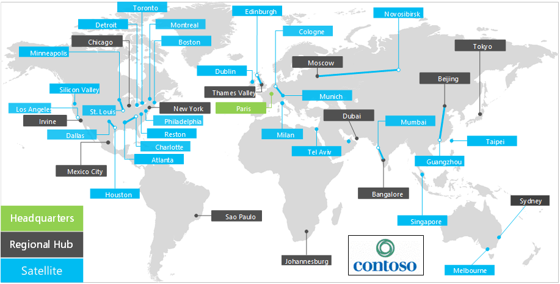

# Overzicht van Contoso B.v.Overview of Contoso Corporation

Contoso B.v. is een multinationale zaak met zijn zetel in Parijs.The Contoso Corporation is a multinational business with its headquarters in Paris. Het bedrijf is een organisatie, verkoop en ondersteunings organisatie met meer dan 100.000 producten.The company is a manufacturing, sales, and support organization with more than 100,000 products.

## Contoso wereldwijdContoso around the world

Afbeelding 1 toont het Office Headquarters kantoor in Parijs en de filiaal filialen op diverse continenten.Figure 1 shows the headquarters office in Paris and regional hub and satellite offices on various continents.

**Afbeelding 1: contoso kantoren overal ter wereld****Figure 1: Contoso offices around the world**
 
Contoso heeft drie niveaus van kantoren:Contoso has three tiers of offices:

- HoofdkantoorHeadquarters

  Contoso Headquarters is een zakelijke Universiteit over de omleiding van Parijs met tientallen gebouwen voor administratieve, technische en productiefaciliteiten.Contoso headquarters is a corporate campus on the outskirts of Paris with dozens of buildings for administrative, engineering, and manufacturing facilities. Alle contoso-datacenters en Internet aanwezigheid zijn gehuisvest in de Headquarters van Parijs.All the Contoso datacenters and its internet presence are housed in the Paris headquarters.

  Het hoofdkantoor heeft 25.000 medewerkers.The headquarters has 25,000 workers.

- Regionale hubsRegional hubs

  Hub kantoren dienen een specifiek deel van de wereld te zijn met 60-percentage verkoop-en ondersteuningsmedewerkers.Hub offices serve a specific region of the world with 60-percent sales and support staff. Elke regionale hub is verbonden met het hoofdkantoor van Parijs via een WAN-koppeling met een hoge bandbreedte.Each regional hub is connected to the Paris headquarters through a high-bandwidth WAN link.

  De Regional hub heeft een gemiddelde van 2.000-medewerkers.The regional hubs have an average of 2,000 workers.

- SatellietkantorenSatellite offices

  Satelliet kantoren bevatten 80-procent verkoop en ondersteuningspersoneel.Satellite offices contain 80-percent sales and support staff. Hij of zij een on-site aanwezigheid biedt voor klanten met Contoso in de hoofdsteden of subregios.They provide an on-site presence for Contoso customers in key cities or subregions. Elk Satellite kantoor is verbonden met een regionale hub via een WAN-verbinding met een hoge bandbreedte.Each satellite office is connected to a regional hub through a high-bandwidth WAN link.

  De satelliet kantoren hebben een gemiddelde van 250-medewerkers.The satellite offices have an average of 250 workers.

Ongeveer 25 procent van het contoso personeel is alleen mobiel.About 25 percent of the Contoso workforce is mobile-only. De regionale hubs en satelliet kantoren hebben een hoger percentage van deze werknemers.The regional hubs and satellite offices have a higher percentage of these workers. Een betere ondersteuning voor mobiele medewerkers is een belangrijk zakelijk doel voor Contoso.Providing better support for mobile-only workers is an important business goal for Contoso.

## Ontwerpoverwegingen voor Microsoft 365 for EnterpriseDesign considerations for Microsoft 365 for enterprise

De contoso IT-architecten hebben de volgende ontwerp factoren vastgesteld voor de implementatie van Microsoft 365 for Enterprise:The Contoso IT architects identified the following design-requirement factors for deploying Microsoft 365 for enterprise:

- Meerdere geografische locaties met lokale regelingen en nalevingsvereistenMultiple geographic locations with local regulations and compliance requirements
- Een centraal intranet datacenter in de hoofdkantoor en de regionale toepassingsservers waarop interne toepassingen van toepassingen hostenA central intranet datacenter in the headquarters office and regional application servers that host internal line-of-business applications
- Een bestaand Microsoft Endpoint Configuration Manager-infrastructuurAn existing Microsoft Endpoint Configuration Manager infrastructure
- Een combinatie van client computing devices waarop Windows, Mac en Linux wordt uitgevoerdA mix of client computing devices that run Windows, Mac, and Linux
- Een combinatie van persoonlijke en zakelijke mobiele apparaten, waaronder iOS (iPhone en iPad) en Android-smartphones en -tabletsA mix of personal and company-owned mobile devices, including iOS (iPhone and iPad) and Android smart phones and tablets
- Veel externe en mobiele medewerkersMany remote and mobile workers
- Veel zakenpartnersMany business partners
- Een grote hoeveelheid klant en vertrouwelijke persoonlijke persoonlijke gegevens voor beheer en beveiligingA large amount of customer and other confidential personal information to manage and secure
- Een grote hoeveelheid intellectueel eigendom van hoge waarde in de vorm van ontwerpspecificaties voor producten en productie-bedrijfsgeheimen.A large amount of high-value intellectual property in the form of design specifications for products and manufacturing trade secrets

## Volgende stapNext step

[Lees meer](contoso-infra-needs.md) over de on-premises IT-infrastructuur van Contoso Corporation en de manier waarop de bedrijfsbehoeften van het bedrijf zijn besproken in microsoft 365 for Enterprise.[Learn](contoso-infra-needs.md) about the Contoso Corporation on-premises IT infrastructure and how the company's business needs are addressed with Microsoft 365 for enterprise.

## Zie ookSee also

[Overzicht van Microsoft 365 voor ondernemingenMicrosoft 365 for enterprise overview](microsoft-365-overview.md)

[TestlabrichtlijnenTest lab guides](m365-enterprise-test-lab-guides.md)
