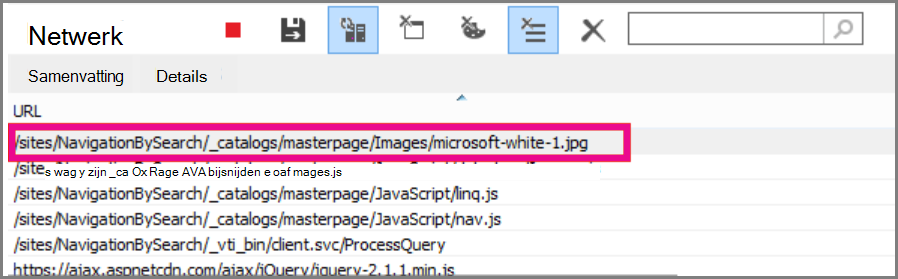

# <a name="delay-loading-images-and-javascript-in-sharepoint-online"></a>Laden van afbeeldingen en JavaScript vertragen in SharePoint Online

In dit artikel wordt beschreven hoe u de laadtijd voor SharePoint Online-pagina's kunt verkleinen met behulp van JavaScript om het laden van afbeeldingen te vertraagen, en het niet mogelijk is om niet-essentieel JavaScript te laden totdat de pagina wordt geladen.
  
Afbeeldingen kunnen een negatieve invloed hebben op de laad snelheid van pagina's in SharePoint Online. Standaardafbeeldingen van de nieuwste Internet browsers voorafgaand aan het ophalen van afbeeldingen bij het laden van een HTML-pagina. Dit kan tot gevolg hebben dat de pagina langzaam wordt geladen als de afbeeldingen niet zichtbaar zijn op het scherm totdat de gebruiker omlaag schuift. De afbeeldingen kunnen verhinderen dat de browser het zichtbare gedeelte van de pagina laadt. U kunt dit probleem omzeilen door JavaScript te gebruiken om de afbeeldingen eerst over te slaan. Daarnaast kunt u de downloads van niet-belangrijkste JavaScript ook trager downloaden op uw SharePoint-pagina's. In dit onderwerp worden enkele methoden beschreven die u kunt gebruiken om de laadtijden van pagina's te verbeteren met JavaScript in SharePoint Online.
  
## <a name="improve-page-load-times-by-delaying-image-loading-in-sharepoint-online-pages-by-using-javascript"></a>Het laden van pagina's verbeteren door het laden van afbeeldingen op SharePoint Online-pagina's te vertragen met behulp van JavaScript

U kunt JavaScript gebruiken om te voorkomen dat een webbrowser afbeeldingen vooraf ophalen. Hiermee wordt de algehele rendering van documenten versneld. Als u dit wilt doen, verwijdert u de waarde van het SRC-kenmerk van de \ tag en vervangt u deze door het pad naar een bestand in een gegevenskenmerk zoals: data-src. Bijvoorbeeld:
  
```html

```

Met deze methode kunt u de afbeeldingen niet meteen downloaden via de browser. Als de afbeelding zich al in de viewport bevindt, krijgt de browser de URL van het gegevenskenmerk en voegt u deze in als de waarde voor het kenmerk src. De afbeelding wordt alleen geladen wanneer de gebruiker in beeld schuift.
  
Om dit te doen, moet u JavaScript gebruiken.
  
Definieer in een tekstbestand de functie **functie iselementinviewport ()** om te controleren of een element zich in een deel van de browser bevindt dat zichtbaar is voor de gebruiker.
  
```javascript
function isElementInViewport(el) {
  if (!el)
    return false;
  var rect = el.getBoundingClientRect();
  return (
    rect.top >= 0 &amp;&amp;
    rect.left >= 0 &amp;&amp;
    rect.bottom <= (window.innerHeight || document.documentElement.clientHeight) &amp;&amp;
    rect.right <= (window.innerWidth || document.documentElement.clientWidth)
  );
}
```

Gebruik vervolgens **functie iselementinviewport ()** in de **loadItemsInView-functie ()** . Met de functie **loadItemsInView ()** worden alle afbeeldingen met een waarde voor het data-SRC-kenmerk geladen, indien deze deel uitmaken van de browser die zichtbaar is voor de gebruiker. Voeg de volgende functie toe aan het tekstbestand:
  
```javascript
function loadItemsInView() {
  //Select elements by the row id.
  $("#row [data-src]").each(function () {
      var isVisible = isElementInViewport(this);
      if (isVisible) {
          if ($(this).attr("src") == undefined) {
              $(this).attr("src", $(this).data("src"));
          }
      }
  });
}
```

Bel tot slot **loadItemsInView ()** vanuit **Window. onscroll ()** , zoals wordt weergegeven in het volgende voorbeeld. Dit zorgt ervoor dat alle afbeeldingen in de viewport worden geladen terwijl de gebruiker ze nodig hebben, maar niet eerder. Voeg het volgende toe aan het tekstbestand:
  
```javascript
//Example of calling loadItemsInView() from within window.onscroll()
$(window).on("scroll", function () {
    loadItemsInView();
});

```

Voor SharePoint Online dient u de volgende functie toe te voegen aan de scroll-gebeurtenis in de tag #s4-Workspace \<div\> . Dit komt doordat de venster gebeurtenissen worden overschreven om ervoor te zorgen dat het lint boven aan de pagina blijft.
  
```javascript
//Keep the ribbon at the top of the page
$('#s4-workspace').on("scroll", function () {
    loadItemsInView();
});
```

Sla het tekstbestand op als een JavaScript-bestand met de extensie. js, bijvoorbeeld delayLoadImages.js.
  
Wanneer u klaar bent met het schrijven van delayLoadImages.js, kunt u de inhoud van het bestand toevoegen aan een basispagina in SharePoint Online. U doet dit door een scriptkoppeling toe te voegen aan de koptekst op de basispagina. Wanneer de afbeelding op de basispagina staat, wordt deze op alle pagina's van de SharePoint Online-site toegepast die de basispagina-indeling gebruiken. Als u dit alleen op één pagina van uw site wilt gebruiken, gebruikt u het webonderdeel script editor om JavaScript op de pagina in te sluiten. Zie de volgende onderwerpen voor meer informatie:
  
- [Procedure: een basispagina toepassen op een site in SharePoint 2013](https://go.microsoft.com/fwlink/p/?LinkId=525627)

- [Procedure: een pagina-indeling maken in SharePoint 2013](https://go.microsoft.com/fwlink/p/?LinkId=525628)

### <a name="example-referencing-the-javascript-delayloadimagesjs-file-from-a-master-page-in-sharepoint-online"></a>Voorbeeld: verwijzen naar het JavaScript-delayLoadImages.js bestand van een basispagina in SharePoint Online
  
Om dit te kunnen werken, moet u ook verwijzen naar jQuery op de basispagina. In het volgende voorbeeld ziet u dat er op de eerste pagina wordt gelaadd, maar er is een aantal afbeeldingen geladen, maar er zijn nog meer op de pagina.
  

  
In de volgende schermafbeelding wordt de rest van de afbeeldingen weergegeven die worden gedownload wanneer ze in beeld schuiven.
  

  
Als u het laden van afbeeldingen met behulp van JavaScript vertraagt, kan de prestaties van de afbeelding toenemen. Als de methode op een openbare website wordt toegepast, kunnen de afbeeldingen niet worden verkend met behulp van zoekprogramma's, op dezelfde manier als de afbeeldingen een regelmatig opgestelde afbeelding verkennen. Dit kan van invloed zijn op de invloed op de zoekmachines, aangezien de metagegevens van de afbeelding zelf niet echt zijn totdat de pagina wordt geladen. In crawlers voor zoekmachines wordt alleen de HTML gelezen en worden de afbeeldingen daarom niet weergegeven als inhoud op de pagina. Afbeeldingen vormen een van de factoren die worden gebruikt voor het rangschikken van pagina's in zoekresultaten. Eén manier om dit te omzeilen is door in te LEIDENE tekst voor uw afbeeldingen te gebruiken.
  
## <a name="github-code-sample-injecting-javascript-to-improve-performance"></a>Voorbeeld van een GitHub-code: JavaScript invoegen om de prestaties te verbeteren

U hoeft het artikel en het codevoorbeeld niet te missen op een [JavaScript-injectie](https://go.microsoft.com/fwlink/p/?LinkId=524759) op github.
  
## <a name="see-also"></a>Zie ook

[Ondersteunde browsers in Office 2013 en Microsoft 365-apps voor Enterprise](https://support.office.com/article/57342811-0dc4-4316-b773-20082ced8a82)
  
[Procedure: een basispagina toepassen op een site in SharePoint 2013](https://go.microsoft.com/fwlink/p/?LinkId=525627)
  
[Procedure: een pagina-indeling maken in SharePoint 2013](https://go.microsoft.com/fwlink/p/?LinkId=525628)
