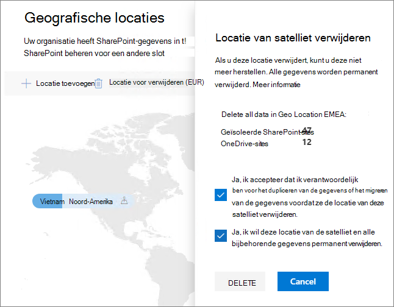

# Een satellietlocatie verwijderen in Microsoft 365 Multi-Geo

Als u geen satellietlocatie meer nodig hebt, kunt u deze uit uw tenant verwijderen uit het SharePoint beheercentrum.

> [!WARNING]
> Alle gebruikersgegevens op de satellietlocatie worden definitief verwijderd. Dit omvat alle OneDrive voor Bedrijven inhoud, SharePoint sites en Exchange postvakken, Microsoft 365 groepspostvakken. U moet gegevens migreren naar een andere satellietlocatie of de centrale locatie voordat u de satellietlocatie verwijdert. Deze actie kan niet ongedaan worden gemaakt.

Alleen globale beheerders kunnen satellietlocaties verwijderen.

Een satellietlocatie verwijderen

1. Het SharePoint-beheercentrum openen

2. Ga naar het **tabblad Geolocaties.**

3. Klik op de kaart op de geografische locatie die u wilt verwijderen.

4. Klik **op Locatie verwijderen.**

5. Bevestig het verwijderen door de selectievakjes voor bevestiging in te selecteren.

6. Klik op **Verwijderen**.
