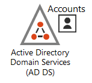
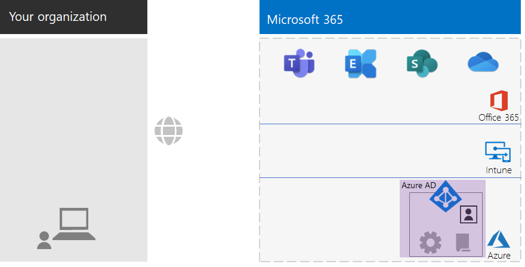
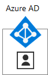
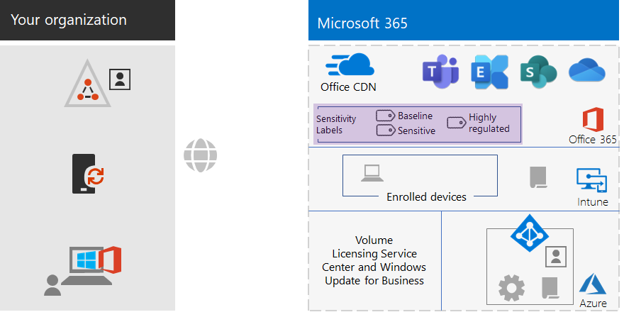
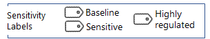
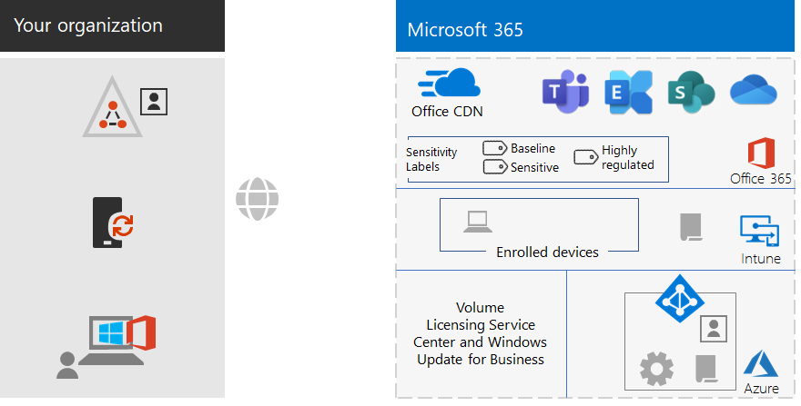

# Microsoft 365 voor bedrijven-basisinfrastructuur voor middelgrote bedrijvenMicrosoft 365 for enterprise foundation infrastructure for non-enterprises

Middelgrote bedrijven kunnen ook Microsoft 365 voor bedrijven implementeren en de bedrijfswaarde van een geïntegreerde en beveiligde infrastructuur realiseren waarmee teamwork mogelijk is en creativiteit wordt ontsloten.Non-enterprise organizations can also deploy Microsoft 365 for enterprise and realize the business value of an integrated and secure infrastructure that enables teamwork and unlocks creativity. Een middelgroot bedrijf heeft over het algemeen:A non-enterprise typically has:

- Kleinschalige on-premises IT-infrastructuur, zoals e-mail- en bestandsservers en een Active Directory Domain Services-domein (AD DS) of helemaal geen.A small amount of on-premises IT infrastructure, such as email and file servers and an Active Directory Domain Services (AD DS) domain, or none at all.
- Een klein aantal IT-medewerkers, waarvan de meeste IT-generalisten en geen specialisten in een specifieke technologie of werkbelasting zoals netwerken of e-mail.A small IT staff, most of whom are IT generalists, rather than specialists in a specific technology or workload such as networking or email.

Voor kleinere bedrijven biedt Microsoft [Microsoft 365 voor ondernemingen](https://www.microsoft.com/microsoft-365/business).For smaller, non-enterprise organizations, Microsoft offers [Microsoft 365 for business](https://www.microsoft.com/microsoft-365/business). Er zijn echter redenen waarom u Microsoft 365 voor bedrijven nodig zou kunnen hebben, zoals:However, there are reasons why you might need Microsoft 365 for enterprise, such as:

- Uw bedrijf heeft nu of in de toekomst meer dan 300 Microsoft 365-licenties (het maximum voor Microsoft 365 voor ondernemingen) nodig.Your organization needs more or will need more than 300 Microsoft 365 licenses, which is the maximum for Microsoft 365 for business.
- Uw bedrijf heeft behoefte aan de geavanceerde productiviteits-, voice-, beveiligings- en analytische mogelijkheden die niet beschikbaar zijn met Microsoft 365 voor ondernemingen.Your organization needs the advanced productivity, voice, security, and analytics capabilities that are not available with Microsoft 365 for business.

In dit artikel wordt uitgelegd hoe u de basisinfrastructuur van Microsoft 365 voor bedrijven die geschikt is voor uw middelgrote bedrijf eenvoudig kunt implementeren.This article steps you through a simplified deployment of the foundation infrastructure of Microsoft 365 for enterprise suitable for your non-enterprise.

## Eerst moet u uw abonnement instellenFirst, set up your subscription

U moet de DNS-domeinen (Domain Name System) voor uw abonnement instellen.You must set up the Domain Name System (DNS) domains for your subscription. Als u al een Microsoft 365-abonnement hebt, moet dit al zijn gedaan.If you already have a Microsoft 365 subscription, this should have been done. Zo niet, volg dan de instructies in [Een domein toevoegen aan Office 365](https://docs.microsoft.com/office365/admin/setup/add-domain?view=o365-worldwide).If not, follow the instructions in [Add a domain to Office 365](https://docs.microsoft.com/office365/admin/setup/add-domain?view=o365-worldwide).

Vervolgens moet u aanvullende beveiliging configureren voor Microsoft 365.Next, you need to configure additional security for Microsoft 365. Volg de instructies in [Verbeterde beveiliging configureren](https://docs.microsoft.com/office365/securitycompliance/tenant-wide-setup-for-increased-security).Follow the instructions in [Configure increased security](https://docs.microsoft.com/office365/securitycompliance/tenant-wide-setup-for-increased-security).

## Fase 1: NetwerkPhase 1: Networking

Middelgrote bedrijven hebben meestal lokale internetverbindingen in elk kantoor en gebruiken geen proxyservers, firewalls of pakketcontroleapparaten.Non-enterprise organizations typically have local Internet connections in each office and do not use proxy servers, firewalls, or packet inspection devices. De internetprovider (ISP) voor elk kantoor heeft een regionaal lokale DNS-server, zodat het verkeer wordt geleid naar de Microsoft 365-netwerklocatie het dichtst bij uw kantoren en hun on-premises gebruikers.The Internet service provider (ISP) serving each office has a regionally local DNS server so that traffic is directed to the Microsoft 365 network location that is closest to your offices and their on-premises users. Zie [Lokale internetverbindingen configureren voor elk kantoor](networking-dns-resolution-same-location.md).For more information, see [Configure local Internet connections for each office](networking-dns-resolution-same-location.md).

U hoeft dus alleen bij uw ISP te verifiëren dat de verbinding van elk van uw kantoorlocaties:Therefore, you only need to verify with your ISP that the connection at each of your office locations:

- gebruikmaakt van een regionaal lokale DNS-server.Uses a regionally local DNS server.
- geschikt is voor de huidige en toekomstige behoeften van uw gebruikers naarmate ze meer Microsoft 365-cloudservices gaan gebruiken.Is adequate for current and future needs as your users begin using more Microsoft 365 cloud services.

Zie [Verkeersomleidingen configureren](networking-configure-proxies-firewalls.md) voor informatie over hoe u de prestaties in Microsoft 365-services kunt optimaliseren als u proxyservers, firewalls of pakketcontroleapparaten gebruikt.If you do use proxy servers, firewalls, or packet inspection devices, see [Configure traffic bypass](networking-configure-proxies-firewalls.md) for information on how to optimize performance to Microsoft 365 services.

### Uw configuratie tot nu toeYour configuration so far

Hier ziet u een visueel overzicht met het Fase 1-element gemarkeerd.Here is a visual summary with the Phase 1 element highlighted. **Uw bedrijf** kan bestaan uit meerdere kantoren, elk met een lokale internetverbinding met een ISP die een regionaal lokale DNS-server gebruikt.**Your organization** can be multiple offices, each of which has a local Internet connection with an ISP that uses a regionally local DNS server. Gebruikers in elk kantoor kunnen via de ISP de dichtstbijzijnde Microsoft 365-netwerklocatie en de resources van uw Microsoft 365-abonnement benaderen.Through the ISP, users in each office can reach the nearest Microsoft 365 network location and the resources of your Microsoft 365 subscription.

## Fase 2 : IdentiteitPhase 2: Identity

Elke medewerker van uw bedrijf moet in staat zijn zich aan te melden. Hiervoor is een gebruikersaccount nodig in de Azure AD-tenant (Azure Active Directory) van uw Microsoft 365 voor bedrijven-abonnement.Each employee of your organization must be able to sign in, which requires a user account in the Azure Active Directory (Azure AD) tenant of your Microsoft 365 for enterprise subscription. Vervolgens worden groepen gebruikt om gebruikersaccounts en andere groepen te herbergen voor communicatie of om toegang te krijgen tot gemachtigde informatiebronnen, zoals een SharePoint Online-site of een team.Groups are then used to contain user accounts and other groups to communicate or gain access to permissioned resources, such as a SharePoint Online site or a team. 

### BeheerdersaccountsAdministrator accounts

Bescherm uw globale beheerdersaccounts door sterke wachtwoorden en meervoudige verificatie (MFA) te eisen.Protect your global administrator user accounts by requiring strong passwords and multi-factor authentication (MFA). Zie [Globale beheeerdersaccounts beveiligen](identity-create-protect-global-admins.md#protect-global-administrator-accounts) voor meer informatie.See [Protect global administrator accounts](identity-create-protect-global-admins.md#protect-global-administrator-accounts) for more information.

Gebruik Azure AD Privileged Identiteitsbeheer om beheerders per keer toegang te verlenen als uw bedrijf een hoge beveiliging vereist en u Microsoft 365 E5 hebt.If your organization requires high security and you have Microsoft 365 E5, use Azure AD Privileged Identity Management to enable just-in-time administrator access. Zie [Globale beheerders op verzoek instellen](identity-create-protect-global-admins.md#identity-pim) voor meer informatie.See [Set up on-demand global administrators](identity-create-protect-global-admins.md#identity-pim) for more information.

### Aanbevelingen voor groepenRecommendations for groups

Als u een on-premises AD DS-domein hebt, gebruik die groepen dan in Microsoft 365 voor bedrijven als groepen in Azure AD.If you have an on-premises AD DS domain, continue to use those groups in Microsoft 365 for enterprise as groups in Azure AD.

Als u geen on-premises AD DS-domein hebt, maak dan beveiligingsgroepen in Azure AD met deze beveiligingsniveaus.If you don't have an on-premises AD DS domain, create security groups in Azure AD using these levels of security.

| BeveiligingsniveauSecurity level | BeschrijvingDescription | VoorbeeldenExamples |
|:-------|:-----|:-----|
| BasislijnBaseline | Dit is een minimale en standaardnorm voor de bescherming van gegevens en de identiteiten en apparaten die toegang hebben tot uw gegevens.This is a minimum and default  standard for protecting data and the identities and devices that access your data.    Dit is meestal het grootste deel van de gegevens van uw bedrijf dat wordt beheerd door de meeste gebruikers.This is typically most of your organization's data managed by most of your users. | Groepen voor operationele medewerkers, zoals verkopers, marketing-, ondersteunings-, administratieve en productiemedewerkers.Groups for first line workers, such as sales, marketing, support, administration, and manufacturing. |
| GevoeligSensitive | Dit is aanvullende bescherming voor een subverzameling van uw gegevens die beter moeten worden beschermd dan de basisbescherming.This is additional protection for a subset of your data that must be protected beyond the baseline level. Deze groepen bevatten gebruikers die gevoelige gegevens gebruiken en maken en die specifiek zijn voor afdelingen en projecten die niet beschikbaar moeten zijn voor iedereen.These groups contain users that use and create sensitive data that is specific to departments and projects that are not meant to be available to everyone. | Product- of marketingteams die toekomstige producten ontwikkelenProduct or marketing teams that are developing future products |
| Sterk gereglementeerdHighly regulated | Dit is het hoogste beveiligingsniveau voor een geringe hoeveelheid gegevens die zeer vertrouwelijk is, zoals intellectueel eigendom of handelsgeheimen of gegevens die moeten voldoen aan veiligheidsvoorschriften.This is the highest level of protection for a typically small amount of data that is highly classified, considered intellectual property or trade secrets, or data that must adhere to security regulations. |  Ontwikkel-, juridische en financiële teams of teams die klant- of partnergegevens opslaan of gebruiken.Research, legal, and financial teams, or teams storing or using customer or partner data. |
||||

### Hybride identiteitHybrid identity

Als u een on-premises AD DS-domein hebt, moet u de gebruikersaccounts, groepen en contactpersonen van uw domein synchroniseren met de Azure AD-tenant van uw abonnement van Microsoft 365 voor bedrijven.If you have an on-premises AD DS domain, you need to synchronize the set of user accounts, groups, and contacts of your domain with the Azure AD tenant of your Microsoft 365 for enterprise subscription. Voor uw middelgroot bedrijf configureert u Azure AD Connect op een server met PHS (wachtwoord-hash-synchronisatie).For your non-enterprise, you configure Azure AD Connect on a server with password hash synchronization (PHS). Zie [Identiteiten synchroniseren](identity-add-user-accounts.md#synchronize-identities-for-hybrid-identity) voor meer informatie.See [Synchronize identities](identity-add-user-accounts.md#synchronize-identities-for-hybrid-identity) for more information.

### Beter beveiligde gebruikerstoegang met beleidsregels voor voorwaardelijke toegang.More secure user access with Conditional Access policies

In Azure Ad worden de voorwaarden van gebruikersaanmeldingen beoordeeld en kan beleid voor voorwaardelijke toegang worden gebruikt om toegang te verlenen of te weigeren en verdere acties op te leggen die moeten worden uitgevoerd om de aanmelding af te ronden.Azure AD evaluates the conditions of user sign-ins and can use Conditional Access policies to grant or deny access and impose further actions that must be taken to complete the sign-in. Als in Azure AD bijvoorbeeld wordt vastgesteld dat de aanmelding plaatsvindt onder omstandigheden met gemiddelde of hoge risico’s, kan de gebruiker MFA uit moeten voeren om de aanmelding af te ronden.For example, if Azure AD determines that the sign-in is happening under medium or high-risk conditions, it can require the user to perform MFA to complete the sign-in.

Beleidsregels voor voorwaardelijke toegang worden toegepast op gebruikersaccounts of groepen.You apply Conditional Access policies to user accounts or groups. Maak deze Azure AD-beveiligingsgroepen in uw bedrijf om eenvoudigere toewijzing van beleidsregels voor voorwaardelijke toegang mogelijk te maken:To facilitate an easier assignment of Conditional Access policies, create these Azure AD security groups in your organization:

- BASISLIJNBASELINE

  Bevat de groepen of gebruikersaccounts voor gebruikers die toegang hebben tot basislijngegevens.Contains the groups or user accounts for users with access to baseline data.

- GEVOELIGSENSITIVE

  Bevat de groepen of gebruikersaccounts voor gebruikers die toegang hebben tot gevoelige gegevens.Contains the groups or user accounts for users with access to sensitive data.

- STERK GEREGLEMENTEERDHIGHLY-REGULATED

  Bevat de groepen of gebruikersaccounts voor gebruikers die toegang hebben tot sterk gereglementeerde gegevens.Contains the groups or user accounts for users with access to highly regulated data.

- COND-ACCESS-EXCLUDECOND-ACCESS-EXCLUDE

  Een lege groep die u kunt gebruiken om tijdelijk een gebruiker uit te sluiten van beleidsregels voor voorwaardelijke toegang.An empty group that you can use to temporarily exclude a user from Conditional Access policies.

Dit is de lijst van beleidsregels voor voorwaardelijke toegang van Azure AD die u kunt inschakelen of maken.Here is the list of Azure AD Conditional Access policies to enable or create.

| Azure AD-beleid voor voorwaardelijke toegangAzure AD Conditional Access policy | Groepen waarop het van toepassing isGroups to which it applies |
|:------|:-----|
| Basislijnbeleid: vereist MFA voor beheerdersBaseline policy: Require MFA for admins | Dit beleid wordt toegepast op beheerdersrollen, er hoeven dus geen groepen te worden opgegeven.This policy applies to admin roles, so no groups need to be specified. Dit beleid hoeft alleen te worden ingeschakeld.This policy just needs to be enabled. Alle volgende beleidsregels moet worden gemaakt en ingeschakeld.All subsequent policies need to be created and enabled. |
| Cliënten blokkeren die geen moderne verificatie ondersteunenBlock clients that don't support modern authentication | Selecteer ‘Alle gebruikers’ in de beleidsinstellingen.Select "All users" in the policy settings. |
| Eis MFA als het aanmeldrisico gemiddeld of hoog is (vereist Microsoft 365 E5)Require MFA when sign-in risk is medium or high (requires Microsoft 365 E5) | BASISLIJNBASELINE |
| Eis MFA als het aanmeldrisico laag, gemiddeld of hoog is (vereist Microsoft 365 E5)Require MFA when sign-in risk is low, medium, or high (requires Microsoft 365 E5) | GEVOELIGSENSITIVE |
| Eis altijd MFAAlways require MFA | STERK GEREGLEMENTEERDHIGHLY-REGULATED |
| Eis goedgekeurde apps op iOS- en Android-apparatenRequire approved apps on iOS and Android devices | BASISLIJN, GEVOELIG, STERK GEREGLEMENTEERDBASELINE, SENSITIVE, HIGHLY-REGULATED |
| Eis conforme pc’sRequire compliant PCs | BASISLIJNBASELINE |
| Eis conforme pc’s en iOS- en Android-apparatenRequire compliant PCs and iOS and Android devices | GEVOELIG, STERK GEREGLEMENTEERDSENSITIVE, HIGHLY-REGULATED |
|||

Hier is het beleid van Azure AD Identiteitsbeveiliging (vereist Microsoft 365 E5) voor gebruikersrisico’s dat moet worden gemaakt en ingeschakeld.Here is the Azure AD Identity Protection (requires Microsoft 365 E5) user risk policy to create and enable.

| Beleid van Azure AD Identiteitsbeveiliging voor gebruikersrisico’sAzure AD Identity Protection user risk policy | Groepen waarop het van toepassing isGroups to which it applies |
|:------|:-----|
| Gebruikers met een hoog risico moeten wachtwoorden wijzigenHigh risk users must change passwords | Selecteer ‘Alle gebruikers’ in de beleidsinstellingen.Select "All users" in the policy settings. |
|||

Zie [Algemene beleidsregels voor identiteit en apparaattoegang](identity-access-policies.md) voor de instructies.See [Common identity and device access policies](identity-access-policies.md) for the instructions.

### Groepen voor eenvoudiger beheerGroups for easier management

Hier vindt u een aantal functies die groeps- en licentiebeheer eenvoudiger kunnen maken.Here are some features that can make group and licensing management easier for you.

| FunctieFeature | GebruikUse |
|:------|:-----|
| Selfservice voor groepsbeheerSelf-service group management | Sta beheer toe van Azure AD-groepen door groepseigenaren in plaats van IT-medewerkers.Allow management of Azure AD groups by group owners instead of IT staff. Zie [Selfservice voor groepsbeheer](identity-use-group-management.md#allow-users-to-create-and-manage-their-own-groups) voor meer informatie.See [Self-service group management](identity-use-group-management.md#allow-users-to-create-and-manage-their-own-groups) for more information. |
| Dynamisch groepslidmaatschapDynamic group membership | Configureer het automatisch toevoegen en verwijderen van gebruikersaccounts in Azure AD-groepen op basis van kenmerken van gebruikersaccounts, zoals afdeling of land.Configure automatic addition or removal of user accounts from Azure AD groups based on user account attributes, such as Department or Country. Zie [Dynamisch groepslidmaatschap](identity-use-group-management.md#set-up-dynamic-group-membership) voor meer informatie.See [Dynamic group membership](identity-use-group-management.md#set-up-dynamic-group-membership) for more information. |
| Licenties op groepsbasisGroup-based licensing | Gebruik het groepslidmaatschap om automatisch licenties toe te wijzen aan of te verwijderen van gebruikersaccounts.Use group membership to automatically assign or unassign licenses to user accounts. Zie [Licenties op groepsbasis](identity-use-group-management.md#set-up-automatic-licensing) voor meer informatie.See [Group-based licensing](identity-use-group-management.md#set-up-automatic-licensing) for more information. |
|  |  |

Als u licenties op groepsbasis gebruikt, maak dan een groep met de naam GELICENTIEERD die gebruikersaccountnamen bevat aan wie een Microsoft 365 voor bedrijven-licentie is toegewezen.If you are using group-based licensing, create a group named LICENSED to contain user account names that are assigned a Microsoft 365 for enterprise license.

### Gebruikerstoegang controlerenMonitor user access

Als u Microsoft 365 E5 hebt, kunt u Azure AD-identiteitsbeveiliging gebruiken om aanmeldingen van gebruikers te controleren en te analyseren voor inbreuk op referenties.If you have Microsoft 365 E5, you can use Azure AD Identity Protection to monitor and analyze user sign-ins for credential compromise. Zie [Bescherming tegen inbreuk op referenties](identity-secure-user-sign-ins.md#protect-against-credential-compromise) voor meer informatie.See [Protect against credential compromise](identity-secure-user-sign-ins.md#protect-against-credential-compromise) for more information.

### Uw configuratie tot nu toeYour configuration so far

Hier ziet u een visueel overzicht van de Identiteitsfase voor hybride identiteiten, waarin de bestaande en nieuwe elementen zijn gemarkeerd.Here is a visual summary of the Identity phase for hybrid identity, with existing and new elements highlighted.

 
De nieuwe en gemarkeerde elementen van hybride identiteiten zijn onder meer:The new and highlighted hybrid identity elements include:
 
|||
|:------:|:-----|
|  | Een on-premises AD DS-domein met gebruikersaccounts en groepen.An on-premises AD DS domain with user accounts and groups. |
|  | Een Windows-server met Azure AD Connect.A Windows-based server running Azure AD Connect. |
|  | De gesynchroniseerde verzameling van AD DS-gebruikersaccounts en -groepen in Azure AD.The synchronized set of AD DS user accounts and groups in Azure AD. |
|  | Azure AD-instellingen voor verificatie, beveiliging van globale accounts en vereenvoudiging van groeps- en licentiebeheer.Azure AD settings for authentication, securing global accounts, and making it easier to manage groups and licenses. |
|  | Azure AD-beleid voor voorwaardelijke toegang.Azure AD Conditional Access policies. |
|||

Hier ziet u een visueel overzicht van de Identiteitsfase voor cloudidentiteiten, waarin de nieuwe elementen zijn gemarkeerd.Here is a visual summary of the Identity phase for cloud-only identity, with the new elements highlighted.

 
De nieuwe en gemarkeerde elementen van cloudidentiteiten zijn onder meer:The new and highlighted cloud-only identity elements include:
 
|||
|:------:|:-----|
|  | De gebruikersaccounts en groepen in Azure AD.The user accounts and groups in Azure AD. |
|  | Azure AD-instellingen voor verificatie, beveiliging van globale accounts en vereenvoudiging van groeps- en licentiebeheer.Azure AD settings for authentication, securing global accounts, and making it easier to manage groups and licenses. |
|  | Azure AD-beleid voor voorwaardelijke toegang.Azure AD Conditional Access policies. |
|||

## Fase 3: Windows 10 EnterprisePhase 3: Windows 10 Enterprise

Hier zijn uw opties om er zeker van te zijn dat uw Windows 10 Enterprise-apparaten zijn geïntegreerd in de identiteits- en beveiligingsinfrastructuur van Microsoft 365 voor bedrijven:To ensure that your Windows 10 Enterprise devices are integrated into the identity and security infrastructure of Microsoft 365 for enterprise, here are your options:

- Hybride (u hebt een on-premises AD DS-domein)Hybrid (you have an on-premises AD DS domain)

  Koppel elk bestaand Windows 10 Enterprise-apparaat dat al is gekoppeld aan uw AD DS-domein aan de Azure AD-tenant.For each existing Windows 10 Enterprise device already joined to your AD DS domain, join them to the Azure AD tenant. Bekijk [Hybride apparaten die zijn gekoppeld aan Azure Active Directory configureren](https://go.microsoft.com/fwlink/p/?linkid=872870) voor de instructies.See [How to configure hybrid Azure Active Directory joined devices](https://go.microsoft.com/fwlink/p/?linkid=872870) for the instructions.

  Koppel elk nieuw Windows 10 Enterprise-apparaat aan uw AD DS-domein en vervolgens aan de Azure AD-tenant.For each new Windows 10 Enterprise device, join them to your AD DS domain, and then join them to the Azure AD tenant.

  Registreer elk Windows 10 Enterprise-apparaat voor beheer van mobiele apparaten.For each Windows 10 Enterprise device, enroll them for mobile device management. Zie [Windows 10-apparaat registreren met Intune met groepsbeleid](https://go.microsoft.com/fwlink/p/?linkid=872871) voor de instructies.See [Enroll a Windows 10 device with Intune by using a Group Policy](https://go.microsoft.com/fwlink/p/?linkid=872871) for the instructions.

- Cloud (u hebt geen on-premises AD DS-domein)Cloud-only (you do not have an on-premises AD DS domain)

  Koppel elk Windows 10 Enterprise-apparaat aan de Azure AD-tenant van uw abonnement.Join each Windows 10 Enterprise device to the Azure AD tenant of your subscription.

  Zie [Uw zakelijk apparaat koppelen aan uw bedrijfsnetwerk](https://docs.microsoft.com/azure/active-directory/user-help/user-help-join-device-on-network) voor meer informatie.See [Join your work device to your organization's network](https://docs.microsoft.com/azure/active-directory/user-help/user-help-join-device-on-network) for more information.

Zodra de installatie en koppeling zijn voltooid, installeert elk Windows 10 Enterprise-apparaat automatisch updates van de cloudservice Windows Update voor Bedrijven.Once installed and joined, each Windows 10 Enterprise device automatically installs updates from the Windows Update for Business cloud service. Het is over het algemeen in een middelgroot bedrijf niet nodig een infrastructuur in te stellen om Windows 10-updates te distribueren en te installeren.There is typically no need in a non-enterprise organization to set up an infrastructure to distribute and install Windows 10 updates.

### Uw configuratie tot nu toeYour configuration so far

Hier ziet u een visueel overzicht van de Windows 10 Enterprise-fase waarin de nieuwe elementen zijn gemarkeerd.Here is a visual summary of the Windows 10 Enterprise phase with the new elements highlighted.

 
De nieuwe en gemarkeerde Windows 10 Enterprise-elementen zijn onder meer:The new and highlighted Windows 10 Enterprise elements include:

|||
|:------:|:-----|
|  | Windows 10 Enterprise geïnstalleerd op Windows-apparaten met een on-premises-laptop als voorbeeld.Windows 10 Enterprise installed on Windows devices, with an on-premises laptop as an example. |
|  | Het servicecentrum voor volumelicenties dat images biedt voor nieuwe installaties van Windows 10 Enterprise en de service Windows Update voor Bedrijven die de nieuwste updates biedt.The Volume Licensing Service Center, which provides images for new installations of Windows 10 Enterprise, and the Windows Update for Business service, which provides the latest updates. |
|||

## Fase 4: Microsoft 365-apps voor ondernemingenPhase 4: Microsoft 365 Apps for enterprise

Microsoft 365 voor bedrijven omvat Microsoft 365-apps voor ondernemingen, de abonnementsversie van Microsoft Office.Microsoft 365 for enterprise includes Microsoft 365 Apps for enterprise, the subscription version of Microsoft Office. Microsoft 365-apps voor ondernemingen wordt net als Office 2016 of Office 2019 rechtstreeks geïnstalleerd op uw clientapparaten.Like Office 2016 or Office 2019, Microsoft 365 Apps for enterprise is installed directly on your client devices. Microsoft 365-apps voor ondernemingen ontvangt echter regelmatig updates met nieuwe functies.However, Microsoft 365 Apps for enterprise receives updates that include new features on a regular basis. Zie [Over Microsoft 365-apps voor ondernemingen in de onderneming](https://docs.microsoft.com/deployoffice/about-office-365-proplus-in-the-enterprise) voor meer informatie.See [About Microsoft 365 Apps for enterprise in the enterprise](https://docs.microsoft.com/deployoffice/about-office-365-proplus-in-the-enterprise) for more information.

Voor uw middelgroot bedrijf installeert u Microsoft 365-apps voor ondernemingen handmatig op apparaten, waaronder Windows-, iOS- en Android-apparaten.For your non-enterprise organization, you manually install Microsoft 365 Apps for enterprise on devices, which can include Windows, iOS, and Android devices. Dit kan worden gedaan als onderdeel van het voorbereiden van een nieuw apparaat of door de gebruiker als onderdeel van het onboardingproces.This can be done as part of preparing a new device for use, or by the user as part of their onboarding process.

De beheerder of de gebruiker meldt zich in elk geval aan bij de Office 365-portal op https://portal.office.com.In either case, the administrator or the user signs in to the Office 365 portal at https://portal.office.com. Klik in het tabblad **Microsoft Office voor thuisgebruik** op **Office installeren** en volg het installatieproces.On the **Microsoft Office Home** tab, click **Install Office** and step through the installation process.

Functie-updates voor Microsoft 365-apps voor ondernemingen worden maandelijks gedownload door elke computer waarop het is geïnstalleerd.Feature updates to Microsoft 365 Apps for enterprise are downloaded monthly by each computer on which it is installed. Het is over het algemeen in een middelgroot bedrijf niet nodig een infrastructuur in te stellen om updates voor Microsoft 365-apps voor ondernemingen te distribueren en te installeren.There is typically no need in a non-enterprise organization to set up an infrastructure to distribute Microsoft 365 Apps for enterprise updates. 

### Uw configuratie tot nu toeYour configuration so far

Hier ziet u een visueel overzicht van de Microsoft 365-apps voor ondernemingen waarin de nieuwe elementen zijn gemarkeerd.Here is a visual summary of the Microsoft 365 Apps for enterprise phase with the new elements highlighted.

 
De nieuwe en gemarkeerde elementen van Microsoft 365-apps voor ondernemingen zijn onder meer:The new and highlighted Microsoft 365 Apps for enterprise elements include:
 
|||
|:------:|:-----|
|  | Microsoft 365-apps voor ondernemingen geïnstalleerd op apparaten met een on-premises-laptop als voorbeeld.Microsoft 365 Apps for enterprise installed on devices, with an on-premises laptop as an example. |
|  | Het Office Content Delivery Network (CDN) voor Microsoft 365-apps voor ondernemingen, dat apparaten toegang geeft tot updates voor Microsoft 365-apps voor ondernemingen.The Office Content Delivery Network (CDN) for Microsoft 365 Apps for enterprise, which devices access for Microsoft 365 Apps for enterprise updates. |
|||

## Fase 5: Mobile Device ManagementPhase 5: Mobile device management

Microsoft 365 voor bedrijven omvat Microsoft Intune voor beheer van mobiele apparaten.Microsoft 365 for enterprise includes Microsoft Intune for mobile device management. Met Intune kunt u Windows-, iOS-, Android- en macOS-apparaten beheren om toegang tot de resources van uw bedrijf, inclusief uw gegevens, te beschermen.With Intune, you can manage Windows, iOS, Android, and macOS devices to protect access to your organization's resources, including your data. Intune gebruikt de gebruikers-, groeps- en computeraccounts van Azure AD.Intune uses the user, group, and computer accounts of Azure AD.

Intune biedt twee typen beheer voor mobiele apparaten:Intune provides two types of mobile device management:

- MDM (beheer voor mobiele apparaten) wordt gebruikt wanneer apparaten worden geregistreerd in Intune.Mobile device management (MDM) is when devices get enrolled in Intune. Na de registratie zijn het beheerde apparaten en kunnen ze het beleid, de regels en instellingen ontvangen die door uw bedrijf worden gebruikt.Once enrolled, they are managed devices and can receive the policies, rules, and settings used by your organization. Deze typen apparaten zijn over het algemeen eigendom van het bedrijf en worden uitgereikt aan uw medewerkers.These types of devices are typically owned by your organization and issued to your employees.

- Gebruikers met hun eigen persoonlijke apparaten willen mogelijk niet dat hun apparaat wordt geregistreerd of beheerd door Intune met uw beleid en instellingen.Users with their own personal devices may not want to enroll their devices or be managed by Intune with your policies and settings. U moet de resources en gegevens van uw bedrijf echter nog steeds beveiligen.However, you still need to protect your organization's resources and data. Voor dit scenario kunt u uw apps beveiligen met MDM (beheer voor mobiele apparaten).For this scenario, you can protect your apps with mobile application management (MAM).  

Intune-beleid kan apparaatcompatibiliteit en app-beveiliging afdwingen.Intune policies can enforce device compliance and app protection. Hier ziet u de lijst met Intune-beleidsregels die u kunt maken.Here is the list of Intune policies to create.

| Intune-beleidIntune policies | Groepen waarop het van toepassing isGroups to which it applies |
|:------|:-----|
| Nalevingsbeleid voor Windows-apparatenDevice compliance policy for Windows | BASISLIJN, GEVOELIG, STERK GEREGLEMENTEERDBASELINE, SENSITIVE, HIGHLY-REGULATED |
| Nalevingsbeleid voor iOS-apparatenDevice compliance policy for iOS | GEVOELIG, STERK GEREGLEMENTEERDSENSITIVE, HIGHLY-REGULATED |
| Nalevingsbeleid voor macOS-apparatenDevice compliance for macOS | GEVOELIG, STERK GEREGLEMENTEERDSENSITIVE, HIGHLY-REGULATED |
| Nalevingsbeleid voor Android- en Android voor bedrijven-apparatenDevice compliance policy for Android and Android Enterprise | GEVOELIG, STERK GEREGLEMENTEERDSENSITIVE, HIGHLY-REGULATED |
| App-beveiliging voor iOSApp protection policy for iOS | BASISLIJN, GEVOELIG, STERK GEREGLEMENTEERDBASELINE, SENSITIVE, HIGHLY-REGULATED |
| App-beveiliging voor macOSApp protection policy for macOS | BASISLIJN, GEVOELIG, STERK GEREGLEMENTEERDBASELINE, SENSITIVE, HIGHLY-REGULATED |
| App-beveiliging voor Android en Android voor bedrijvenApp protection policy for Android and Android Enterprise | BASISLIJN, GEVOELIG, STERK GEREGLEMENTEERDBASELINE, SENSITIVE, HIGHLY-REGULATED |
|||
    
Zie [Algemene beleidsregels voor identiteit en apparaattoegang](identity-access-policies.md) voor de instructies.See [Common identity and device access policies](identity-access-policies.md) for the instructions.

### Uw configuratie tot nu toeYour configuration so far

Hier ziet u een visueel overzicht van de MDM-fase waarin de nieuwe elementen zijn gemarkeerd.Here is a visual summary of the Mobile Device Management phase with the new elements highlighted.

 
De nieuwe en gemarkeerde MDM-elementen zijn onder meer:The new and highlighted mobile device management elements include:

|||
|:------:|:-----|
|  | Apparaten die zijn geregistreerd in Intune, met een on-premises laptop met Windows 10 Enterprise als voorbeeld.Devices that are enrolled in Intune, showing an on-premises laptop running Windows 10 Enterprise as an example. |
|  | Intune-beleid voor apparaatcompatibiliteit en app-beveiliging.Intune policies for device compliance and app protection. |
|||

## Fase 6: GegevensbeveiligingPhase 6: Information protection

Microsoft 365 voor bedrijven heeft een overvloed aan functies voor gegevensbescherming waarmee u verschillende typen gegevens op verschillende manieren kunt behandelen door verschillende niveaus van beheer, beveiliging en bescherming toe te passen.Microsoft 365 for enterprise has a host of information protection features that allow you to treat classifications of data differently by applying different levels of governance, security, and protection. 

Zo hebben bijvoorbeeld normale correspondentie tussen de meeste medewerkers en de documenten waaraan ze werken een zekere mate van bescherming nodig.For example, normal correspondence between most employees and the documents on which they work need a certain baseline level of protection. Financiële documenten, klantgegevens en uw intellectuele eigendom heeft een hoger beveiligingsniveau nodig.Financial records, customer data, and your intellectual property need a higher level of protection.

De eerste stap naar een gegevensbeveiligingsstrategie is het bepalen van de beveiligingsniveaus.The first step to an information protection strategy is to determine the levels of protection. Veel bedrijven gebruiken de volgende niveaus die al worden gebruikt voor beleid voor voorwaardelijke toegang:Many organizations use these levels, which are already being used for Conditional Access policies:

- BasislijnBaseline

  Voorbeelden hiervan zijn normale bedrijfscommunicatie (e-mail) en bestanden voor administratieve, verkoop- en ondersteuningsmedewerkers.Examples include normal business communications (email) and files for administrative, sales, and support workers.

- GevoeligSensitive

  Voorbeelden hiervan zijn financiële en juridische gegevens en gegevens van onderzoek en ontwikkeling voor nieuwe producten of diensten.Examples include financial and legal information and research and development data for new products or services.

- Sterk gereglementeerdHighly regulated

  Voorbeelden hiervan zijn persoonsgegevens van klanten en partners en de strategische plannen of het intellectuele eigendom van uw bedrijf.Examples include customer and partner personally identifiable information and your organization's strategic plans or intellectual property.

Op basis van deze gegevensbeveiligingsniveaus is de volgende stap het identificeren en implementeren:Based on these levels of data security, the next step is to identify and implement:

- Aangepaste typen van gevoelige gegevensCustom sensitive information types

  Microsoft 365 biedt een grote selectie van typen gevoelige gegevens, zoals zorgverzekerings- en creditcardnummers.Microsoft 365 supplies a wide selection of sensitive information types, such as health service and credit card numbers. Als u niet in de lijst kunt vinden wat u nodig hebt, kunt u zelf typen maken.If you do not find one that you need in the supplied list, you can create your own.

- BewaarlabelsRetention labels

  Om te voldoen aan bedrijfsbeleid en regionale regelgeving moet u mogelijk aangeven hoe lang bepaalde typen documenten of documenten met specifieke inhoud moeten worden bewaard.To comply with organization policies and regional regulations, you might have to specify how long specific types of documents or documents with specific contents should be retained. U kunt dit implementeren voor e-mail en documenten met bewaarlabels.You can implement this for email and documents using retention labels. Bewaarlabels kunnen ook worden gebruikt in combinatie met DLP-beleid (preventie van gegevensverlies) waarmee het delen van bestanden of e-mailberichten buiten uw bedrijf kan worden beperkt.Retention labels can also be used in conjunction with Data Loss Prevention (DLP) policies that can restrict the sharing of files or email outside your organization.

- GevoeligheidslabelsSensitivity labels

  U kunt e-mailberichten of documenten labelen met een gevoeligheidslabel zodat aanvullende beveiligingsniveaus kunnen worden toegepast.You can label email or documents with a named sensitivity label so that additional levels of security can be applied. Voorbeelden hiervan zijn watermerken, versleuteling en machtigingen waarin wordt opgegeven wie toegang heeft tot het e-mailbericht of document en wat ze kunnen doen.Examples are watermarks, encryption, and permissions, which specify who is allowed to access the email or document and what they are allowed to do.

Zie [Classificatietypen voor Microsoft 365](infoprotect-configure-classification.md#microsoft-365-classification-types) voor meer informatie.See [Microsoft 365 classification types](infoprotect-configure-classification.md#microsoft-365-classification-types) for more information.

Als u gevoeligheidslabels met machtigingen gebruikt, moet u mogelijk aanvullende beveiligingsgroepen maken om te bepalen wie wat mag doen met e-mailberichten en documenten waarop het gevoeligheidslabel is toegepast.If you use sensitivity labels with permissions, you might have to create additional security groups to define who is allowed to do what with email and documents that have the sensitivity label applied. 

U moet bijvoorbeeld een gevoeligheidslabel ONDERZOEK maken om de e-mailberichten en documenten van uw onderzoeksteam te beveiligen.For example, you need to create a RESEARCH sensitivity label to protect the email and documents of your research team. U bepaalt dat:You determine that:

- Onderzoekers de mogelijkheid moeten hebben om documenten te wijzigen met het gevoeligheidslabel ONDERZOEK.Researchers must have the ability to change documents marked with the RESEARCH sensitivity label.
- Andere medewerkers alleen de mogelijkheid moeten hebben om documenten te bekijken met het gevoeligheidslabel ONDERZOEK.Non-research employees only need to have the ability to view documents marked with the RESEARCH sensitivity label. 

Dit betekent dat u twee extra Microsoft 365-groepen moet maken en beheren:This means you need to create and manage two additional Microsoft 365 groups:

- ONDERZOEK-ALLESRESEARCH-ALL
- ONDERZOEK-BEKIJKENRESEARCH-VIEW

Deze groepen en hun machtigingen worden onderdeel van de configuratie van het gevoeligheidslabel ONDERZOEK.These groups and their permissions become part of the RESEARCH sensitivity label's configuration.

Voor gevoeligheidslabels die zijn geconfigureerd met groepsmachtigingen moet u het lidmaatschap van deze groepen beheren.For sensitivity labels configured with group-based permissions, you must manage the membership of these groups.

### Uw configuratie tot nu toeYour configuration so far

Hier ziet u een visueel overzicht van de Gegevensbeschermingsfase waarin de nieuwe elementen zijn gemarkeerd.Here is a visual summary of the Information Protection phase with the new elements highlighted.

 
De nieuwe en gemarkeerde gegevensbeveiligingselementen zijn onder meer:The new and highlighted information protection elements include:
 
|||
|:------:|:-----|
|  | Gevoeligheidslabels voor de drie beveiligingsniveaus die gebruikers kunnen toepassen op documenten en e-mailberichten.Sensitivity labels for the three levels of security that users can apply to documents and email. |
|||

Aangepaste gegevenstypen en bewaarlabels worden niet getoond.Custom information types and retention labels are not shown.

## OnboardingOnboarding

Met de Microsoft 365 voor bedrijven-infrastructuur kunt u uw medewerkers eenvoudig faciliteren.With your Microsoft 365 for enterprise infrastructure in place, you can easily onboard your employees.

### Een nieuw Windows 10 Enterprise-apparaatA new Windows 10 Enterprise device

Voordat u een medewerker een nieuw Windows 10 Enterprise-apparaat geeft:Before giving an employee a new Windows 10 Enterprise device:

- Voor hybride identiteitFor hybrid identity

  Koppel het apparaat aan uw AD DS-domein en uw Azure AD-tenant en registreer het apparaat vervolgens in Intune.Join the device to your AD DS domain, join the device to your Azure AD tenant, and then enroll the device in Intune.

- Voor cloudidentiteitFor cloud-only identity

  Koppel het apparaat aan uw Azure AD-tenant.Join the device to your Azure AD tenant.

### Bestaande medewerker met een AD DS-accountExisting employee with an AD DS user account

Voeg het AD DS-gebruikersaccount toe aan de volgende Azure AD-groepen als onderdeel van de initiële introductie in uw bedrijf wanneer u een hybride identiteit gebruikt:As part of the initial onboarding for your organization when using hybrid identity, add the AD DS user account to these Azure AD groups:

- GELICENTIEERDLICENSED
- De juiste AD DS- of Azure AD-beveiligingsgroepen die lid zijn van de Azure AD-groepen BASISLIJN, GEVOELIG en STERK GEREGLEMENTEERDThe appropriate AD DS or Azure AD security groups that are members of the BASELINE, SENSITIVE, and HIGHLY-REGULATED Azure AD groups
- Gevoeligheidslabelgroepen (indien nodig)Sensitivity label groups (as needed)

De bestaande medewerker zou al aan de juiste werk-, afdelings- en regionale AD DS-groepen moeten zijn toegevoegd.The existing employee should already be added to the appropriate workgroup, departmental, and regional AD DS groups.

U kunt een gebruikersaccount toevoegen aan meerdere Azure AD-groepen in het Microsoft 365-beheercentrum.You can add a user account to multiple Azure AD groups in the Microsoft 365 admin center. Klik in de eigenschappen van het gebruikersaccount op **Groepen beheren > Lidmaatschappen toevoegen**.From the properties of the user account, click **Manage groups > Add memberships**.

Bekijk deze [downloadbare Excel-werkmap](https://github.com/MicrosoftDocs/microsoft-365-docs/raw/public/microsoft-365/media/deploy-foundation-infrastructure-non-enterprises/Group-License-Mgmt-PowerShell.xlsx) als u PowerShell wilt gebruiken, waarmee de PowerShell-opdrachten worden gegenereerd op basis van een specifiek gebruikersaccount en geselecteerde groepsnamen.If you want to use PowerShell, see this [downloadable Excel workbook](https://github.com/MicrosoftDocs/microsoft-365-docs/raw/public/microsoft-365/media/deploy-foundation-infrastructure-non-enterprises/Group-License-Mgmt-PowerShell.xlsx), which generates the PowerShell commands based on a specified user account and selected group names.

### Nieuwe medewerker met cloudgebruikersaccount New employee with a cloud-only user account

Voeg het nieuwe gebruikersaccount toe aan de volgende groepen als onderdeel van de initiële introductie in uw bedrijf wanneer u een cloudidentiteit gebruikt:As part of the initial onboarding for your organization when using cloud-only identity, add the new user account to these groups:

- GELICENTIEERDLICENSED
- De juiste Azure AD-beveiligingsgroepen die lid zijn van de Azure AD-groepen BASISLIJN, GEVOELIG en STERK GEREGLEMENTEERD.The appropriate Azure AD security groups that are members of the BASELINE, SENSITIVE, and HIGHLY-REGULATED Azure AD groups
- Werk-, afdelings- en regionale groepenWorkgroup, departmental, and regional groups
- Gevoeligheidslabelgroepen (indien nodig)Sensitivity label groups (as needed)

### Initiële aanmelding bij Microsoft 365Initial sign-in to Microsoft 365

Instrueer de nieuwe medewerkers dat wanneer ze zich voor het eerst aanmelden in Microsoft 365:For the first time employees sign in to Microsoft 365, instruct them to:

1. Ze zich aanmelden bij hun apparaten met de aanmeldingsgegevens van hun gebruikersaccount.Sign into their devices with their user account credentials.
2. Een browser gebruiken om zich op https://portal.office.com aan te melden bij de Office 365-portal.Using a browser, sign in to the Office 365 portal at https://portal.office.com.
3. Vanaf het tabblad **Office 365 voor thuisgebruik** klikken op **Office installeren** om Microsoft 365-apps voor ondernemingen op hun apparaat te installeren.From the **Office 365 Home** tab, click **Install Office** to install Microsoft 365 Apps for enterprise on their device.

## EindresultatenEnd results

Hieronder ziet u de eindresultaten van de configuratie van de Microsoft 365 voor bedrijven-basisinfrastructuur voor uw middelgroot bedrijf.Here are the results of configuring the Microsoft 365 for enterprise foundation infrastructure for your non-enterprise organization.

### InfrastructuurresultatenInfrastructure results

Na de opbouw en configuratie van uw Microsoft 365 voor bedrijven-infrastructuur hebt u als het goed is:After the build-out and configuration of your Microsoft 365 for enterprise infrastructure, you should have:

- Een lokale internetverbinding voor elk van uw kantoren met voldoende bandbreedte, geleverd door een ISP die gebruikmaakt van een regionaal lokale DNS-server.A local Internet connection for each of your offices with sufficient bandwidth supplied by an ISP that uses a regionally local DNS server.
- Azure AD Connect dat wordt uitgevoerd op een server die uw on-premises AD DS-domein synchroniseert met uw Azure AD-tenant voor hybride identiteiten.For hybrid identity, Azure AD Connect running on a server that synchronizes your on-premises AD DS domain with your Azure AD tenant.
- Deze groepen:These groups:
  - GELICENTIEERDLICENSED
  - COND-ACCESS-EXCLUDECOND-ACCESS-EXCLUDE
  - De juiste AD DS- of Azure AD-beveiligingsgroepen die ook lid zijn van de Azure AD-groepen BASISLIJN, GEVOELIG en STERK GEREGLEMENTEERD.The appropriate AD DS or Azure AD security groups that are also members of the BASELINE, SENSITIVE, and HIGHLY-REGULATED Azure AD groups 
  - Werk-, afdelings- en regionale groepenWorkgroup, departmental, and regional groups
  - Microsoft 365-gevoeligheidslabelgroepen (indien nodig)Sensitivity label Microsoft 365 groups (as needed)
- Azure AD-aanmeldbeleid voor voorwaardelijke toegang die de Azure AD-groepen BASISLIJN, GEVOELIG, STERK GEREGLEMENTEERD en COND-ACCESS-EXCLUDE gebruiken.Azure AD sign-in Conditional Access policies that use the BASELINE, SENSITIVE, and HIGHLY-REGULATED, and COND-ACCESS-EXCLUDE Azure AD groups.
- Intune-toepassings- en nalevingsbeleid voor apparaten.Intune application and device compliance policies.
- Aangepaste typen gevoelige gegevens (indien nodig).Custom sensitive information types (as needed).
- Bewaarlabels (indien nodig).Retention labels (as needed).
- Gevoeligheidslabels (indien nodig).Sensitivity labels (as needed).

Hieronder ziet u een visueel overzicht van de infrastructuur wanneer uw bedrijf een hybride identiteit gebruikt met uw AD DS-domein, een Azure AD Connect-server en gesynchroniseerde AD DS-gebruikers en -groepen.Here is a visual summary of the infrastructure if your organization uses hybrid identity, which includes your AD DS domain, an Azure AD Connect server, and synchronized AD DS users and groups.

 
Hieronder ziet u een visueel overzicht van de infrastructuur wanneer uw bedrijf een cloudindentiteit gebruikt.Here is a visual summary of the infrastructure if your organization uses cloud-only identity.
 

### WerknemersresultatenEmployee results

Na de onboarding moet elke medewerker het volgende hebben:After their onboarding, each employee should have:

- Een goed presterend, on-premises netwerkpad van zijn apparaat naar de Microsoft 365-cloudservices in zijn regio.A performant, on-premises network path from their device to the Microsoft 365 cloud services in their region.
- Een gebruikersaccount met deze groepslidmaatschappen:A user account with these group memberships:
   - GELICENTIEERDLICENSED
   - De juiste AD DS- of Azure AD-beveiligingsgroepen die ook lid zijn van de Azure AD-groepen BASISLIJN, GEVOELIG en STERK GEREGLEMENTEERD voor beleid voor voorwaardelijke toegangThe appropriate AD DS or Azure AD security groups, which are also members of the BASELINE, SENSITIVE, and HIGHLY-REGULATED Azure AD groups for Conditional Access policies 
   - De juiste werk-, afdelings- en regionale groepenThe appropriate workgroup, departmental, and regional groups
   - Microsoft 365-gevoeligheidslabelgroepen (indien nodig)Sensitivity label Microsoft 365 groups (as needed)
- Een Windows 10 Enterprise-apparaat:A Windows 10 Enterprise device that:
   - dat is gekoppeld aan de Azure AD-tenant (cloud) of aan zowel de Azure AD-tenant als uw AD DS-domein (hybride).Is joined to the Azure AD tenant (cloud-only) or to both the Azure AD tenant and your AD DS domain (hybrid).
   - dat zichzelf automatisch bijwerkt met de nieuwste verbeteringen voor Windows 10 Enterprise-producten en -beveiliging. Automatically updates itself with the latest Windows 10 Enterprise product improvements and security enhancements.
   - Waarop Microsoft 365-apps voor ondernemingen is geïnstalleerd, dat zichzelf automatisch bijgewerkt met de nieuwste verbeteringen voor Office-producten en -beveiliging.Has Microsoft 365 Apps for enterprise installed, which automatically updates itself with the latest Office product improvements and security enhancements.
   - dat is geregistreerd in Intune en valt onder nalevings- en app-beveiligingsbeleid van Intune.Is enrolled in Intune and subject to Intune device compliance policies and app protection policies.

## Volgende stapNext step

Implementeer uw [werkbelastingen en scenario’s](deploy-workloads.md) om te profiteren van de functies en configuratie van uw Microsoft 365 voor bedrijven-basisinfrastructuur.Deploy your [workloads and scenarios](deploy-workloads.md) to take advantage of the features and configuration of your Microsoft 365 for enterprise foundation infrastructure.
