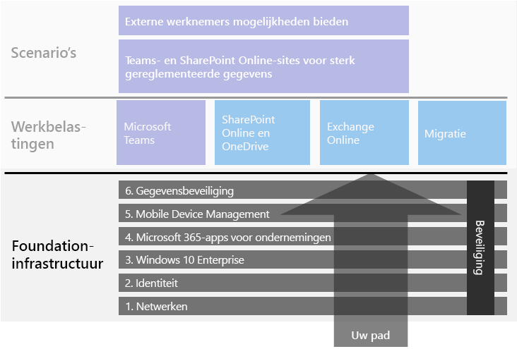

# Basisinfrastructuur voor Microsoft 365 voor ondernemingenMicrosoft 365 for enterprise foundation infrastructure

Als u zelf de end-to-end-implementatie van Microsoft 365 voor ondernemingen uitvoert, moet u eerst een stevige basis bouwen waarop met toepassingen en services creativiteit en teamwork in een veilige omgeving mogelijk worden gemaakt.If you're doing the end-to-end deployment of Microsoft 365 for enterprise yourself, you should first build a firm foundation upon which applications and services can unlock creativity and teamwork in a secure environment. Deze basis wordt soms ook wel een *kernimplementatie* genoemd.This foundation is sometimes referred to as a *core deployment*.

Voor een gedefinieerd end-to-end-pad voor implementatie kunt u deze fasen gebruiken om de basisinfrastructuur van Microsoft 365 voor ondernemingen te plannen en te implementeren:For a defined end-to-end path for deployment, you can use these phases to plan for and deploy the foundation infrastructure of Microsoft 365 for enterprise:

| | FasePhase | ResultatenResults |
|:-------|:-----|:-----|
||[Fase 1: NetwerkPhase 1: Networking](networking-infrastructure.md)| Uw netwerk wordt geoptimaliseerd voor toegang tot de cloudservices van Microsoft 365.Your network is optimized for access to Microsoft 365's cloud-based services. |
||[Fase 2: IdentiteitPhase 2: Identity](identity-infrastructure.md)| Uw beheerdersaccounts worden beveiligd, uw gebruikers en groepen worden gesynchroniseerd en uw gebruikersverificatie is sterk.Your admin accounts are protected, your users and groups are synchronized, and your user authentication is strong. |
||[Fase 3: Windows 10 EnterprisePhase 3: Windows 10 Enterprise](windows10-infrastructure.md)| Voor uw bestaande Windows-computers kan een upgrade worden uitgevoerd naar Windows 10 Enterprise en op nieuwe apparaten wordt Windows 10 Enterprise geïnstalleerd.Your existing Windows-based computers can upgrade to Windows 10 Enterprise and new devices are installed with Windows 10 Enterprise. |
||[Fase 4: Office 365 ProPlusPhase 4: Office 365 ProPlus](office365proplus-infrastructure.md)| Bestaande gebruikers van Microsoft Office kunnen een upgrade uitvoeren naar Office 365 ProPlus.Your existing users of Microsoft Office can upgrade to Office 365 ProPlus. |
||[Fase 5: Mobile Device ManagementPhase 5: Mobile device management](mobility-infrastructure.md)| Uw apparaten kunnen worden geregistreerd en beheerd.Your devices can be enrolled and managed. |
||[Fase 6: GegevensbeveiligingPhase 6: Information protection](infoprotect-infrastructure.md)| De beveiligingsfuncties van Office 365 worden ingeschakeld en uw labels en beleid zijn gereed om documenten en e-mail te beschermen.Office 365 security features are enabled and your labels and policies are ready to protect documents and email. |

De fasen beginnen met het meest essentiële (netwerken en identiteiten) en vervolgens worden er lagen met infrastructuurinstellingen en -groepen gemaakt voor het volgende:The phases start with the most foundational (networking and identity), and then create layers of infrastructure settings and groups to:

- De meest recente en veilige versie van Windows op uw apparaten installeren en deze up-to-date houden.Install the most current and secure version of Windows on your devices and keep it current.
- De meest recente versie van Microsoft Office op uw apparaten installeren en deze up-to-date houden.Install the most current version of Microsoft Office on your devices and keep it current.
- De apparaten van uw organisatie en hun toegang tot apps beheren.Manage your organization's devices and their access to apps.
- De informatie op deze apparaten en in de cloud beschermen.Protect the information on those devices and in the cloud.

U hebt echter de flexibiliteit om de fasen of stappen in de fasen zo te configureren en uit te voeren dat deze passen bij uw IT-resources en zakelijke behoeften.However, you have the flexibility of configuring and rolling out the phases or steps within phases to fit your IT resources and business needs.

- **Als u een kleinere of nieuwere organisatie bent**, volgt u de fasen die nodig zijn om de infrastructuur methodisch uit te bouwen.**If you are a smaller or newer organization**, follow the phases as needed to methodically build out your infrastructure. Klik [hier](deploy-foundation-infrastructure-non-enterprises.md) voor een vereenvoudigde implementatie voor middelgrote bedrijven.For a simplified deployment for non-enterprises, click [here](deploy-foundation-infrastructure-non-enterprises.md).

-  **Als u een grote onderneming bent**, bekijkt u de fasen als lagen IT-infrastructuur in plaats van een gedefinieerd pad en bepaalt u hoe u het beste zo te werk kunt gaan dat er wordt voldaan aan de vereisten voor elke laag in uw organisatie.**If you are an enterprise organization**, view the phases as layers of IT infrastructure, rather than a defined path, and determine how to best work toward eventual adherence to the requirements for each layer across your organization.

Aan het einde van elke fase moet u de *afsluitcriteria* bekijken. Hiermee worden de vereiste voorwaarden aangegeven waaraan moet worden voldaan en optionele voorwaarden die kunnen worden overwogen.At the end of each phase, you should examine its *exit criteria*, which include required conditions that you must meet and optional conditions to consider. Met de afsluitcriteria voor elke fase wordt gewaarborgd dat uw on-premises en cloudinfrastructuur en de resulterende end-to-end-configuratie voldoen aan de vereisten voor een Microsoft 365-implementatie voor ondernemingen.Exit criteria for each phase ensures that your on-premises and cloud infrastructure and resulting end-to-end configuration meet the requirements for a Microsoft 365 for enterprise deployment.

Bekijk deze korte video als u wilt zien hoe de inhoud is gestructureerd.To see how the content is structured, watch this short video.

> [!VIDEO https://www.microsoft.com/videoplayer/embed/RE23VRG]

Hier volgt de basisinfrastructuur in de algemene implementatiehandleiding voor Microsoft 365 voor ondernemingen:Here's the foundation infrastructure in the overall Microsoft 365 for enterprise deployment guide:

## In één oogopslagAt-a-glance

De [poster Basisinfrastructuur voor Microsoft 365 voor ondernemingen](../media/deploy-foundation-infrastructure/Microsoft365EnterpriseFoundInfra.pdf) is een centrale locatie die u voor elke fase kunt bekijken:The [Microsoft 365 for enterprise foundation infrastructure poster](../media/deploy-foundation-infrastructure/Microsoft365EnterpriseFoundInfra.pdf) is a central location for you to view, for each phase:

- De algemene doelstellingen van de fase voor beheerders en gebruikersThe overall goals of the phase for administrators and users
- De services, functies en hulpmiddelenThe services, features, and tools
- De belangrijkste ontwerpbeslissingen bij de planningThe key design decisions for planning
- De configuratieresultatenThe configuration results
- Het proces voor de onboarding van een nieuwe gebruikerThe process for onboarding a new user
- Controleren en bijwerkenHow to monitor and update

Als u een kopie van de poster wilt downloaden, klikt u [hier](https://github.com/MicrosoftDocs/microsoft-365-docs/raw/public/microsoft-365/media/deploy-foundation-infrastructure/Microsoft365EnterpriseFoundInfra.pdf).To download a copy of the poster, click [here](https://github.com/MicrosoftDocs/microsoft-365-docs/raw/public/microsoft-365/media/deploy-foundation-infrastructure/Microsoft365EnterpriseFoundInfra.pdf).

## Configuratie van infrastructuur versus gebruikersimplementatieInfrastructure configuration vs. user rollout

De basisinfrastructuur bestaat uit een set geconfigureerde software en services die samen voor een gebruiker het volledige spectrum van mogelijkheden en bescherming bieden dat met Microsoft 365 voor ondernemingen mogelijk is.The foundation infrastructure is a set of configured software and services that, when combined together for a user, allow them to take advantage of the entire spectrum of capabilities and protections that Microsoft 365 for enterprise offers. Het uiteindelijke doel van uw end-to-end-implementatietraject is om deze infrastructuur toe te passen voor al uw gebruikers en hun Windows-apparaten.The ultimate destination of your end-to-end deployment journey is to have this infrastructure apply to all of your users and their Windows-based devices. 

Het is echter belangrijk om te weten dat de basisinfrastructuur van Microsoft 365 voor ondernemingen los staat van de implementatie van software en services voor uw gebruikers.However, it is important to note that the Microsoft 365 for enterprise foundation infrastructure is independent of the rollout of software and services to your users. ***U kunt de lagen van de basisinfrastructuur configureren zonder dat u die lagen voor al uw gebruikers hoeft te implementeren.******You can configure the layers of the foundation infrastructure without having to roll out those layers to all of your users.***

Het is mogelijk om elementen van de basisinfrastructuur te configureren, te testen en uit te proberen ver voordat u deze elementen implementeert voor het merendeel van uw gebruikers in de kantoren, regio's of afdelingen van uw organisatie.It is possible to configure, test, and pilot elements of the foundation infrastructure well ahead of the rollout of those elements to the multitude of your users in the offices, regions, or divisions of your organization.

U kunt bijvoorbeeld de instellingen voor het volgende maken:For example, you create the settings for:

| FasePhase | ResultatenResults |
|:-------|:-----|
| IdentiteitIdentity | Accountsynchronisatie en groepen voor voorwaardelijke toegang op basis van een identiteit.Account synchronization and groups for identity-based conditional access policies. |
| Windows 10 EnterpriseWindows 10 Enterprise | Groepen om automatisch een upgrade uit te voeren voor computers met Windows 7 of Windows 8.1 naar Windows 10 Enterprise.Groups to automatically upgrade computers running Windows 7 or Windows 8.1 to Windows 10 Enterprise in place. |
| Office 365 ProPlusOffice 365 ProPlus | Groepen voor het automatisch implementeren van Office 365 ProPlus voor gebruikers met Office 2010, Office 2013 of Office 2016.Groups to automatically deploy Office 365 ProPlus for users with Office 2010, Office 2013, or Office 2016. |
| Mobile Device ManagementMobile device management | Groepen voor apparaatinschrijving en beleid voor voorwaardelijke toegang op basis van apparaten.Groups for device enrollment and device-based conditional access policies. |
| GegevensbeveiligingInformation protection | Groepen voor Office 365-gevoeligheidslabels.Groups for Office 365 sensitivity labels. |

Wanneer u klaar bent om elementen van deze infrastructuur te implementeren voor gebruikers, kunt u het volgende doen:When you are ready to rollout elements of this infrastructure to users, you:

| FasePhase | ImplementatieactieRollout action |
|:-------|:-----|
| IdentiteitIdentity | Gebruikersaccounts toevoegen aan de groepen voor beleid voor voorwaardelijke toegang op basis van een identiteit.Add user accounts to the groups for identity-based conditional access policies. |
| Windows 10 EnterpriseWindows 10 Enterprise | Accounts toevoegen aan de groepen om Windows 10 Enterprise automatisch te implementeren voor gebruikers met Windows 7 of Windows 8.1.Add accounts to the groups to automatically deploy Windows 10 Enterprise in place for users with Windows 7 or Windows 8.1. |
| Office 365 ProPlusOffice 365 ProPlus | Gebruikersaccounts toevoegen aan de groepen om Office 365 ProPlus automatisch te implementeren voor gebruikers met Office 2010, Office 2013 of Office 2016.Add user accounts to the groups to automatically deploy Office 365 ProPlus for users with Office 2010, Office 2013, or Office 2016. |
| Mobile Device ManagementMobile device management | Accounts toevoegen voor de groepen voor apparaatinschrijving en beleid voor voorwaardelijke toegang op basis van apparaten.Add accounts to the groups for device enrollment and device-based conditional access policies. |
| GegevensbeveiligingInformation protection | Gebruikersaccounts toevoegen aan de groepen voor gevoeligheidslabels.Add user accounts to the groups for sensitivity labels. |

Zodra fasen of elementen van de basisinfrastructuur zijn voltooid, getest en uitgeprobeerd, kunt u geïnstalleerde software, zoals Windows 10 Enterprise en Office 365 ProPlus, en cloudservices en -bescherming, zoals apparaatinschrijving en beleid voor voorwaardelijke toegang, voor uw gebruikers implementeren op de manier die het beste past bij uw bedrijfsdoelen en IT-resources.Once phases or elements of the foundation infrastructure are completed, tested, and piloted, you can roll out installed software, such as Windows 10 Enterprise and Office 365 ProPlus, and cloud-based services and protections, such as device enrollment and conditional access policies, to your users in the manner that best fits your business goals and IT resources.

## Strategieën voor implementatie en projectbeheerDeployment and project management strategies

Zie [Implementatiestrategieën](deployment-strategies-microsoft-365-enterprise.md) voor enkele ideeën voor het projectbeheer van de verschillende fasen van de basisinfrastructuur voor de eerste testgebruikers en de rest van uw organisatie.To give you some ideas on how to approach the project management of the different phases of the foundation infrastructure for pilot users and the rest of your organization, see [deployment strategies](deployment-strategies-microsoft-365-enterprise.md).

## Implementatie voor middelgrote bedrijvenDeployment for non-enterprises

Als uw organisatie kleiner is en Microsoft 365 Business niet geschikt voor u is, raadpleegt u [Implementatie voor middelgrote bedrijven](deploy-foundation-infrastructure-non-enterprises.md) voor een vereenvoudigde implementatiemethode.If your organization is smaller and Microsoft 365 Business is not suitable for you, see [deployment for non-enterprises](deploy-foundation-infrastructure-non-enterprises.md) for a simplified deployment method.

## Volgende stapNext step

| Waar ben ikWhere I am | Waar moet ik naartoeWhere I need to go |
|:-------|:-----|
| Ik heb een bestaande infrastructuur voor Office 365, Enterprise Mobility + Security (EMS) of Windows 10 EnterpriseI have existing infrastructure for Office 365, Enterprise Mobility + Security (EMS), or Windows 10 Enterprise | Begin met het [implementeren met de bestaande infrastructuur](deploy-with-existing-infrastructure.md) waarmee u de afsluitcriteria voor elke fase doorloopt.Start with [Deploy with existing infrastructure](deploy-with-existing-infrastructure.md), which steps you through the exit criteria for each phase. |
| Ik start als onderneming helemaal bij het beginI'm starting from scratch as an enterprise | Start uw end-to-end-implementatietraject met [Fase 1: Netwerk](networking-infrastructure.md).Begin your end-to-end deployment journey with [Phase 1: Networking](networking-infrastructure.md). |
| Ik start als middelgroot bedrijf helemaal bij het beginI'm starting from scratch as a non-enterprise | Start uw end-to-end-implementatietraject met [Implementatie voor middelgrote bedrijven](deploy-foundation-infrastructure-non-enterprises.md).Begin your end-to-end deployment journey with [Deployment for non-enterprises](deploy-foundation-infrastructure-non-enterprises.md). |
