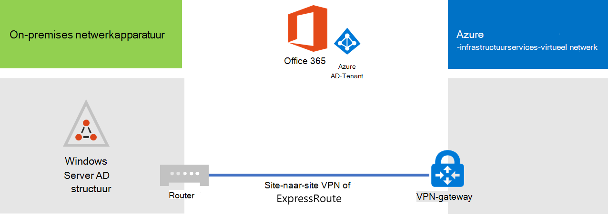
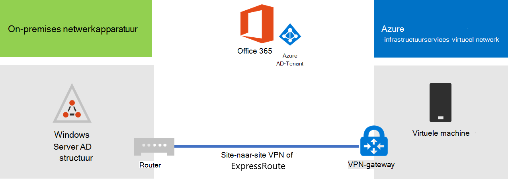
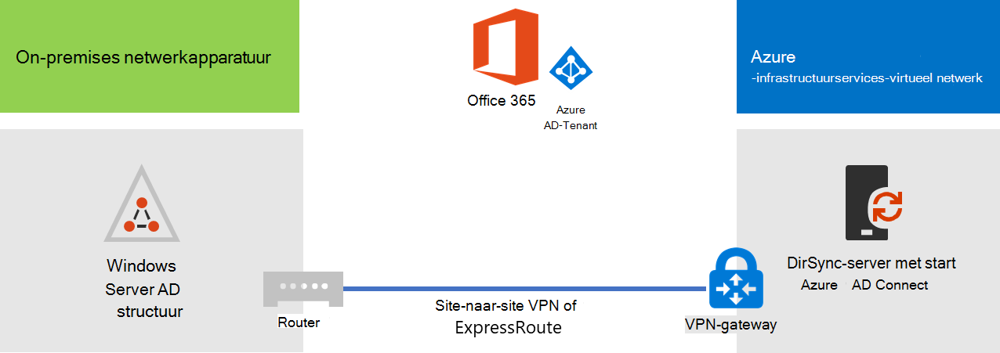

# Microsoft 365 Directory-synchronisatie implementeren in Microsoft Azure

Azure Active Directory (Azure AD) Connect (voorheen bekend als het hulpprogramma voor adreslijstsynchronisatie, het hulpprogramma Directory-synchronisatie of het hulpprogramma DirSync.exe) is een toepassing die u op een server voor domein ondersteuning installeert om uw on-premises Active Directory Domain Services (AD DS)-gebruikers te synchroniseren met de Azure AD-Tenant van uw Microsoft 365-abonnement. Microsoft 365 maakt gebruik van Azure AD voor de adreslijstservice. Uw Microsoft 365-abonnement bevat een Azure AD-Tenant. Deze Tenant kan ook worden gebruikt voor het beheer van de identiteiten van uw organisatie met andere bewerkingstaken van de Cloud, waaronder andere SaaS-toepassingen en-apps in Azure.

U kunt Azure AD Connect installeren op een on-premises server, maar u kunt dit ook op een virtuele machine in azure installeren om de volgende redenen:
  
- U kunt op de cloud gebaseerde servers sneller inrichten en configureren, zodat de services voor uw gebruikers eerder toegankelijk zijn.
- Azure biedt betere site beschikbaarheid met minder inspanning.
- U kunt het aantal on-premises servers in uw organisatie verminderen.

Voor deze oplossing is connectiviteit vereist tussen uw on-premises netwerk en uw virtuele Azure-netwerk. Zie [een on-premises netwerk verbinden met een Microsoft Azure Virtual Network](connect-an-on-premises-network-to-a-microsoft-azure-virtual-network.md)voor meer informatie. 
  
> [!NOTE]
> In dit artikel wordt het synchroniseren van één domein in één forest beschreven. Azure AD Connect synchroniseert alle AD DS-domeinen in uw Active Directory-forest met Microsoft 365. Als u meerdere Active Directory-forests kunt synchroniseren met Microsoft 365, raadpleegt u [Directory-synchronisatie met meerdere forests met eenmalige aanmelding](https://go.microsoft.com/fwlink/p/?LinkId=393091). 
  
## Overzicht van het implementeren van Microsoft 365 Directory-synchronisatie in azure

In het volgende diagram ziet u Azure AD Connect die wordt uitgevoerd op een virtuele machine in azure (de adreslijstsynchronisatie server) waarmee een on-premises AD DS-forest wordt gesynchroniseerd met een Microsoft 365-abonnement.
  

  
In het diagram zijn er twee netwerken verbonden via een VPN-verbinding of een ExpressRoute-verbinding. Er is een on-premises netwerk waar de AD DS-domeincontrollers zich bevinden, en er staat een Azure virtueel netwerk met een adreslijstsynchronisatie server, een virtuele machine met [Azure AD Connect](https://www.microsoft.com/download/details.aspx?id=47594). Er zijn twee hoofd stromen die afkomstig zijn van de adreslijstsynchronisatie server:
  
-  Azure AD Connect vraagt een domeincontroller op het on-premises netwerk om wijzigingen aan accounts en wachtwoorden.
-  Azure AD Connect verzendt de wijzigingen aan accounts en wachtwoorden naar het Azure AD-exemplaar van uw Microsoft 365-abonnement. Aangezien de adreslijstsynchronisatie server deel uitmaakt van een uitgaand gedeelte van uw on-premises netwerk, worden deze wijzigingen verzonden via de proxyserver van het on-premises netwerk.
    
> [!NOTE]
> In deze oplossing wordt het synchroniseren van één Active Directory-domein in één Active Directory-forest beschreven. Azure AD Connect synchroniseert alle Active Directory-domeinen in uw Active Directory-forest met Microsoft 365. Als u meerdere Active Directory-forests kunt synchroniseren met Microsoft 365, raadpleegt u [Directory-synchronisatie met meerdere forests met eenmalige aanmelding](https://go.microsoft.com/fwlink/p/?LinkId=393091). 
  
Wanneer u deze oplossing implementeert, zijn er twee belangrijke stappen:
  
1. Maak een virtueel Azure-netwerk en maak een VPN-verbinding met een site-naar-site met uw on-premises netwerk. Zie [een on-premises netwerk verbinden met een Microsoft Azure Virtual Network](connect-an-on-premises-network-to-a-microsoft-azure-virtual-network.md)voor meer informatie.
    
2. Installeer [Azure AD Connect](https://www.microsoft.com/download/details.aspx?id=47594) op een in azure gekoppelde virtuele machine en synchroniseer de on-PREMISES AD DS met microsoft 365. Dit omvat:
    
    Een virtuele Azure-machine maken om Azure AD Connect uit te voeren.
    
    [Azure AD Connect](https://www.microsoft.com/download/details.aspx?id=47594)installeren en configureren.
    
    Voor het configureren van Azure AD Connect zijn de referenties (gebruikersnaam en wachtwoord) van een Azure AD-beheerdersaccount en een AD DS Enterprise-beheerdersaccount vereist. Azure AD Connect wordt direct en op de continue basis uitgevoerd om het on-premises AD DS-forest te synchroniseren met Microsoft 365.
    
Voordat u deze oplossing in de productie implementeert, kunt u de instructies gebruiken in [de gesimuleerde Enterprise base-configuratie](simulated-ent-base-configuration-microsoft-365-enterprise.md) om deze configuratie in te stellen als een proefversie van het concept, voor demonstraties of voor experimentatie.
  
> [!IMPORTANT]
> Wanneer Azure AD Connect-configuratie is voltooid, wordt de referenties van de AD DS Enterprise-beheerder account niet opgeslagen. 
  
> [!NOTE]
> In deze oplossing wordt beschreven hoe u één AD DS-forest kunt synchroniseren met Microsoft 365. De in dit artikel besproken topologie beschrijft slechts één manier om deze oplossing uit te voeren. De topologie van uw organisatie kan variëren op basis van uw specifieke netwerkvereisten en beveiligingsoverwegingen. 
  
## Het hosten van een adreslijstsynchronisatie server voor Microsoft 365 in azure plannen

### Vereisten

Voordat u begint, controleert u de volgende vereisten voor deze oplossing:
  
- Controleer de inhoud van de planning van [uw virtuele Azure-netwerk](connect-an-on-premises-network-to-a-microsoft-azure-virtual-network.md#plan-your-azure-virtual-network).
    
- Zorg ervoor dat u voldoet aan de [vereisten](connect-an-on-premises-network-to-a-microsoft-azure-virtual-network.md#prerequisites) voor het configureren van het virtuele Azure-netwerk.
    
- Een Microsoft 365-abonnement met de functie Active Directory-integratie bevat. Ga naar de [pagina Microsoft 365-abonnement](https://products.office.com/compare-all-microsoft-office-products?tab=2)voor meer informatie over microsoft 365-abonnementen.
    
- Het inrichten van een virtuele Azure-computer die Azure AD Connect uitvoert om uw on-premises AD DS-forest te synchroniseren met Microsoft 365.
    
    U moet de referenties (namen en wachtwoorden) hebben voor een AD DS Enterprise-beheerdersaccount en een Azure AD-beheerdersaccount.
    
### Ontwerp hypothesen voor oplossingen van de architectuur

In de volgende lijst worden de ontwerp keuzes beschreven die u hebt gemaakt voor deze oplossing.
  
- Deze oplossing maakt gebruik van één virtueel Azure-netwerk met een VPN-verbinding tussen sites. De virtuele netwerkhost van Azure is één subnet met één server, de adreslijstsynchronisatie server waarop Azure AD Connect wordt uitgevoerd. 
    
- In het on-premises netwerk bestaan een domeincontroller en DNS-servers.
    
- Azure AD Connect zorgt voor synchronisatie van wachtwoord hash in plaats van eenmalige aanmelding. U hoeft geen Active Directory Federation Services (AD FS)-infrastructuur te implementeren. Zie voor meer informatie over de opties voor hash-synchronisatie en eenmalige aanmelding [de juiste verificatiemethode voor uw Azure Active Directory Hybrid Identity Solution](https://aka.ms/auth-options).
    
Er zijn extra ontwerpmogelijkheden die u kunt overwegen wanneer u deze oplossing implementeert in uw omgeving. Deze omvatten de volgende:
  
- Als er bestaande DNS-servers in een bestaand virtueel Azure-netwerk zijn, moet u opgeven of u de adreslijstsynchronisatie server wilt gebruiken voor de naamomzetting in plaats van de DNS-servers in het on-premises netwerk.
    
- Als er domeincontrollers in een bestaand Azure virtueel netwerk zijn, kunt u bepalen of de configuratie van Active Directory-sites en-services een betere optie is. De adreslijstsynchronisatie server kan een query uitvoeren op de domeincontrollers in het virtuele Azure-netwerk voor wijzigingen in accounts en wachtwoorden in plaats van domeincontrollers in het on-premises netwerk.
    
## Implementatie routekaart

Azure AD Connect op een virtuele machine in azure implementeren bevat drie fasen:
  
- Fase 1: het Azure Virtual Network maken en configureren
    
- Fase 2: de virtuele Azure-machine maken en configureren
    
- Fase 3: Azure AD Connect installeren en configureren
    
Na de implementatie moet u ook locaties en licenties toewijzen voor de nieuwe gebruikersaccounts in Microsoft 365.

### Fase 1: het Azure Virtual Network maken en configureren

Als u het virtuele Azure-netwerk wilt maken en configureren, [fase 1: uw on-premises netwerk voorbereiden](connect-an-on-premises-network-to-a-microsoft-azure-virtual-network.md#phase-1-prepare-your-on-premises-network) en [fase 2: Maak het cross-premises virtuele netwerk in azure](connect-an-on-premises-network-to-a-microsoft-azure-virtual-network.md#phase-2-create-the-cross-premises-virtual-network-in-azure) in de distributie routekaart voor het [verbinden van een on-premises netwerk met een Microsoft Azure Virtual-netwerk](connect-an-on-premises-network-to-a-microsoft-azure-virtual-network.md).
  
Dit is de daaruit voortvloeiende configuratie.
  

  
In deze afbeelding ziet u een on-premises netwerk dat is verbonden met een Azure Virtual Network via een VPN-of ExpressRoute-verbinding.
  
### Fase 2: de virtuele Azure-machine maken en configureren

Maak de virtuele machine in azure met behulp [van de instructies Maak uw eerste virtuele Windows-computer in de Azure-Portal](https://go.microsoft.com/fwlink/p/?LinkId=393098). Gebruik de volgende instellingen:
  
- Selecteer in het deelvenster **basis** het soort abonnement, de locatie en de resourcegroep als uw virtuele netwerk. Neem de gebruikersnaam en het wachtwoord op een veilige locatie op. U hebt deze later nodig om verbinding te maken met de virtuele machine.
    
- Kies in het deelvenster **een grootte kiezen** de **a2-standaard** grootte.
    
- Selecteer in het deelvenster **instellingen** in de sectie **opslag** het **standaard** opslagruimte type. Selecteer in de sectie **netwerk** de naam van uw virtuele netwerk en het subnet voor het hosten van de adreslijstsynchronisatie server (niet de GatewaySubnet). Zorg dat u alle overige instellingen tegen hun standaardwaarden hoeft te wijzigen.
    
Controleer of uw adreslijstsynchronisatie server op de juiste wijze DNS gebruikt door uw interne DNS te controleren om ervoor te zorgen dat er voor de virtuele machine een record (A) record is toegevoegd aan het IP-adres. 
  
Gebruik de instructies in [verbinding maken met de virtuele machine en meld](https://docs.microsoft.com/azure/virtual-machines/windows/connect-logon) u aan om verbinding te maken met de adreslijstsynchronisatie server met een verbinding met extern bureaublad. Nadat u zich hebt aangemeld, moet u lid worden van de virtuele machine en lid worden van het on-premises AD DS-domein.
  
Voor Azure AD Connect om toegang te krijgen tot Internet bronnen, moet u de adreslijstsynchronisatie server configureren voor gebruik van de proxyserver van het on-premises netwerk. Neem contact op met uw netwerkbeheerder voor meer informatie over het uitvoeren van de configuratie.
  
Dit is de daaruit voortvloeiende configuratie.
  

  
In deze afbeelding ziet u de virtuele computer van de adreslijstsynchronisatie server in het lokale Azure-netwerk.
  
### Fase 3: Azure AD Connect installeren en configureren

Voer de volgende procedure uit:
  
1. Maak verbinding met de adreslijstsynchronisatie server met een verbinding met extern bureaublad met een AD DS-domeinaccount met lokale beheerdersbevoegdheden. Zie [verbinding maken met de virtuele computer en meld u](https://docs.microsoft.com/azure/virtual-machines/windows/connect-logon)aan.
    
2. Open vanuit de adreslijstsynchronisatie server het artikel [adreslijstsynchronisatie instellen voor Microsoft 365](set-up-directory-synchronization.md) en volg de aanwijzingen voor adreslijstsynchronisatie met wachtwoord-hash-synchronisatie.
    
> [!CAUTION]
> Setup maakt het **AAD_xxxxxxxxxxxx** account in de organisatie-eenheid (OU) van lokale gebruikers. Dit account niet verplaatsen of de synchronisatie mislukt.
  
Dit is de daaruit voortvloeiende configuratie.
  

  
In deze afbeelding ziet u de adreslijstsynchronisatie server met Azure AD Connect in de cross-premises Azure virtuele netwerk.
  
### Locaties en licenties toewijzen aan gebruikers in Microsoft 365

Azure AD Connect voegt accounts toe aan uw abonnement op Microsoft 365 via de on-premises AD DS, maar als u wilt dat gebruikers zich kunnen aanmelden bij Microsoft 365 en de services kunnen gebruiken, moeten de accounts worden geconfigureerd met een locatie en licenties. Volg deze stappen om de locatie toe te voegen en licenties te activeren voor de desbetreffende gebruikersaccounts:
  
1. Meld u aan bij het [Microsoft 365-Beheercentrum](https://admin.microsoft.com)en klik op **beheerder**.
    
2. Selecteer **Gebruikers > Actieve gebruikers** op de linkernavigatiebalk.
    
3. Schakel in de lijst met gebruikersaccounts het selectievakje in naast de gebruiker die u wilt activeren.
    
4. Klik op de pagina voor de gebruiker op **bewerken** voor **product licenties**.
    
5. Selecteer op de pagina **product licenties** een locatie voor de gebruiker van de **locatie**en schakel de juiste licenties voor de gebruiker in.
    
6. Wanneer u klaar bent, klikt u op **Opslaan**en vervolgens tweemaal op **sluiten** .
    
7. Ga terug naar stap 3 voor meer gebruikers.
    
## Zie ook

[Microsoft 365-oplossingen- en -architectuurcentrum](../solutions/solution-architecture-center.md)
  
[Een on-premises netwerk verbinden met een Microsoft Azure Virtual Network](connect-an-on-premises-network-to-a-microsoft-azure-virtual-network.md)

[Azure AD Connect downloaden](https://www.microsoft.com/download/details.aspx?id=47594)
  
[Adreslijstsynchronisatie voor Microsoft 365 instellen](set-up-directory-synchronization.md)
  
