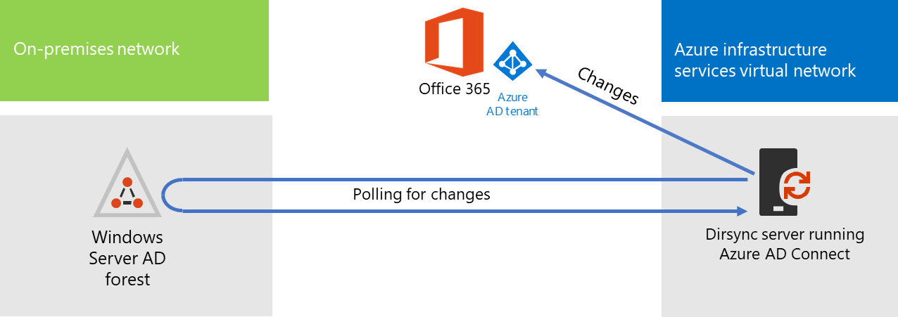

# De Microsoft 365 adreslijstsynchronisatie implementeren in Microsoft AzureDeploy Microsoft 365 Directory Synchronization in Microsoft Azure

Azure Active Directory (Azure AD) Verbinding maken (voorheen bekend als het hulpprogramma Adreslijstsynchronisatie, hulpprogramma Adreslijstsynchronisatie of het hulpprogramma DirSync.exe) is een toepassing die u installeert op een domeingevoegde server om uw on-premises Ad DS-gebruikers (Active Directory Domain Services) te synchroniseren met de Azure AD-tenant van uw Microsoft 365-abonnement.Azure Active Directory (Azure AD) Connect (formerly known as the Directory Synchronization tool, Directory Sync tool, or the DirSync.exe tool) is an application that you install on a domain-joined server to synchronize your on-premises Active Directory Domain Services (AD DS) users to the Azure AD tenant of your Microsoft 365 subscription. Microsoft 365 gebruikt Azure AD voor de adreslijstservice.Microsoft 365 uses Azure AD for its directory service. Uw Microsoft 365-abonnement bevat een Azure AD-tenant.Your Microsoft 365 subscription includes an Azure AD tenant. Deze tenant kan ook worden gebruikt voor het beheer van de identiteiten van uw organisatie met andere cloudbelastingen, waaronder andere SaaS-toepassingen en apps in Azure.This tenant can also be used for management of your organization's identities with other cloud workloads, including other SaaS applications and apps in Azure.

U kunt Azure AD-Verbinding maken installeren op een on-premises server, maar u kunt het ook installeren op een virtuele computer in Azure om deze redenen:You can install Azure AD Connect on a on-premises server, but you can also install it on a virtual machine in Azure for these reasons:
  
- U kunt servers in de cloud sneller inrichten en configureren, zodat de services sneller beschikbaar zijn voor uw gebruikers.You can provision and configure cloud-based servers faster, making the services available to your users sooner.
- Azure biedt een betere beschikbaarheid van de site met minder moeite.Azure offers better site availability with less effort.
- U kunt het aantal on-premises servers in uw organisatie verminderen.You can reduce the number of on-premises servers in your organization.

Voor deze oplossing is verbinding nodig tussen uw on-premises netwerk en uw virtuele Azure-netwerk.This solution requires connectivity between your on-premises network and your Azure virtual network. Zie een [on-premises Verbinding maken een on-premises netwerk](connect-an-on-premises-network-to-a-microsoft-azure-virtual-network.md)Microsoft Azure virtuele netwerk voor meer informatie.For more information, see [Connect an on-premises network to a Microsoft Azure virtual network](connect-an-on-premises-network-to-a-microsoft-azure-virtual-network.md). 
  
> [!NOTE]
> In dit artikel wordt de synchronisatie van één domein in één forest beschreven.This article describes synchronization of a single domain in a single forest. Met Azure AD Verbinding maken worden alle AD DS-domeinen in uw Active Directory-forest gesynchroniseerd met Microsoft 365.Azure AD Connect synchronizes all AD DS domains in your Active Directory forest with Microsoft 365. Als u meerdere Active Directory-forests wilt synchroniseren met Microsoft 365, zie [Multi-forest Directory Sync with Single Sign-On Scenario](/azure/active-directory/hybrid/whatis-hybrid-identity).If you have multiple Active Directory forests to synchronize with Microsoft 365, see [Multi-forest Directory Sync with Single Sign-On Scenario](/azure/active-directory/hybrid/whatis-hybrid-identity). 
  
## Overzicht van het implementeren Microsoft 365 adreslijstsynchronisatie in AzureOverview of deploying Microsoft 365 directory synchronization in Azure

In het volgende diagram ziet u Azure AD Verbinding maken die wordt uitgevoerd op een virtuele computer in Azure (de adreslijstsynchronisatieserver) die een on-premises AD DS-forest synchroniseert met een Microsoft 365-abonnement.The following diagram shows Azure AD Connect running on a virtual machine in Azure (the directory sync server) that synchronizes an on-premises AD DS forest to a Microsoft 365 subscription.
  

  
In het diagram zijn er twee netwerken verbonden via een site-naar-site VPN- of ExpressRoute-verbinding.In the diagram, there are two networks connected by a site-to-site VPN or ExpressRoute connection. Er is een on-premises netwerk waar AD DS-domeincontrollers zich bevinden en er is een virtueel Azure-netwerk met een adreslijstsynchronisatieserver, een virtuele machine met [Azure AD-Verbinding maken.](https://www.microsoft.com/download/details.aspx?id=47594)There is an on-premises network where AD DS domain controllers are located, and there is an Azure virtual network with a directory sync server, which is a virtual machine running [Azure AD Connect](https://www.microsoft.com/download/details.aspx?id=47594). Er zijn twee hoofdverkeersstromen die afkomstig zijn van de adreslijstsynchronisatieserver:There are two main traffic flows originating from the directory sync server:
  
-  Azure AD Verbinding maken een domeincontroller in het on-premises netwerk opvragen voor wijzigingen in accounts en wachtwoorden.Azure AD Connect queries a domain controller on the on-premises network for changes to accounts and passwords.
-  Azure AD Verbinding maken stuurt de wijzigingen naar accounts en wachtwoorden naar het Azure AD-exemplaar van uw Microsoft 365 abonnement.Azure AD Connect sends the changes to accounts and passwords to the Azure AD instance of your Microsoft 365 subscription. Omdat de adreslijstsynchronisatieserver zich in een uitgebreid deel van uw on-premises netwerk heeft, worden deze wijzigingen verzonden via de proxyserver van het on-premises netwerk.Because the directory sync server is in an extended portion of your on-premises network, these changes are sent through the on-premises network's proxy server.
    
> [!NOTE]
> Deze oplossing beschrijft de synchronisatie van één Active Directory-domein in één Active Directory-forest.This solution describes synchronization of a single Active Directory domain, in a single Active Directory forest. Met Azure AD Verbinding maken worden alle Active Directory-domeinen in uw Active Directory-forest gesynchroniseerd met Microsoft 365.Azure AD Connect synchronizes all Active Directory domains in your Active Directory forest with Microsoft 365. Als u meerdere Active Directory-forests wilt synchroniseren met Microsoft 365, zie [Multi-forest Directory Sync with Single Sign-On Scenario](/azure/active-directory/hybrid/whatis-hybrid-identity).If you have multiple Active Directory forests to synchronize with Microsoft 365, see [Multi-forest Directory Sync with Single Sign-On Scenario](/azure/active-directory/hybrid/whatis-hybrid-identity). 
  
Er zijn twee belangrijke stappen bij het implementeren van deze oplossing:There are two major steps when you deploy this solution:
  
1. Maak een virtueel Azure-netwerk en maak een SITE-to-site VPN-verbinding met uw on-premises netwerk.Create an Azure virtual network and establish a site-to-site VPN connection to your on-premises network. Zie een [on-premises Verbinding maken een on-premises netwerk](connect-an-on-premises-network-to-a-microsoft-azure-virtual-network.md)Microsoft Azure virtuele netwerk voor meer informatie.For more information, see [Connect an on-premises network to a Microsoft Azure virtual network](connect-an-on-premises-network-to-a-microsoft-azure-virtual-network.md).
    
2. Installeer [Azure AD Verbinding maken](https://www.microsoft.com/download/details.aspx?id=47594) op een virtuele machine die is verbonden met een domein in Azure en synchroniseer vervolgens de on-premises AD DS naar Microsoft 365.Install [Azure AD Connect](https://www.microsoft.com/download/details.aspx?id=47594) on a domain-joined virtual machine in Azure, and then synchronize the on-premises AD DS to Microsoft 365. Het gaat hierbij om:This involves:
    
    Een Azure Virtual Machine maken om Azure AD-Verbinding maken.Creating an Azure Virtual Machine to run Azure AD Connect.
    
    Azure [AD-Verbinding maken.](https://www.microsoft.com/download/details.aspx?id=47594)Installing and configuring [Azure AD Connect](https://www.microsoft.com/download/details.aspx?id=47594).
    
    Voor het configureren van Azure AD-Verbinding maken vereist de referenties (gebruikersnaam en wachtwoord) van een Azure AD-beheerdersaccount en een AD DS-ondernemingsbeheerderaccount.Configuring Azure AD Connect requires the credentials (user name and password) of an Azure AD administrator account and a AD DS enterprise administrator account. Azure AD Verbinding maken wordt onmiddellijk en doorlopend uitgevoerd om het on-premises AD DS-forest te synchroniseren met Microsoft 365.Azure AD Connect runs immediately and on an ongoing basis to synchronize the on-premises AD DS forest to Microsoft 365.
    
Voordat u deze oplossing in productie implementeert, kunt u de instructies [in](simulated-ent-base-configuration-microsoft-365-enterprise.md) de gesimuleerde ondernemingsbasisconfiguratie gebruiken om deze configuratie in te stellen als een proof of concept, voor demonstraties of voor experimenten.Before you deploy this solution in production, you can use the instructions in [The simulated enterprise base configuration](simulated-ent-base-configuration-microsoft-365-enterprise.md) to set this configuration up as a proof of concept, for demonstrations, or for experimentation.
  
> [!IMPORTANT]
> Wanneer Azure AD Verbinding maken is voltooid, worden de referenties van de AD DS-ondernemingsbeheerder niet opgeslagen.When Azure AD Connect configuration completes, it does not save the AD DS enterprise administrator account credentials. 
  
> [!NOTE]
> In deze oplossing wordt beschreven dat één AD DS-forest wordt gesynchroniseerd met Microsoft 365.This solution describes synchronizing a single AD DS forest to Microsoft 365. De topologie die in dit artikel wordt besproken, vertegenwoordigt slechts één manier om deze oplossing te implementeren.The topology discussed in this article represents only one way to implement this solution. De topologie van uw organisatie kan verschillen op basis van uw unieke netwerkvereisten en beveiligingsoverwegingen.Your organization's topology might differ based on your unique network requirements and security considerations. 
  
## Plannen voor het hosten van een adreslijstsynchronisatieserver voor Microsoft 365 in AzurePlan for hosting a directory sync server for Microsoft 365 in Azure

### VereistenPrerequisites

Controleer voordat u begint de volgende vereisten voor deze oplossing:Before you begin, review the following prerequisites for this solution:
  
- Bekijk de gerelateerde planningsinhoud in [Het virtuele Azure-netwerk plannen.](connect-an-on-premises-network-to-a-microsoft-azure-virtual-network.md#plan-your-azure-virtual-network)Review the related planning content in [Plan your Azure virtual network](connect-an-on-premises-network-to-a-microsoft-azure-virtual-network.md#plan-your-azure-virtual-network).
    
- Zorg ervoor dat u voldoet aan [alle vereisten voor](connect-an-on-premises-network-to-a-microsoft-azure-virtual-network.md#prerequisites) het configureren van het virtuele Azure-netwerk.Ensure that you meet all [Prerequisites](connect-an-on-premises-network-to-a-microsoft-azure-virtual-network.md#prerequisites) for configuring the Azure virtual network.
    
- Heb een Microsoft 365 abonnement met de active directory-integratiefunctie.Have a Microsoft 365 subscription that includes the Active Directory integration feature. Voor informatie over Microsoft 365 abonnementen gaat u naar [de pagina Microsoft 365 abonnement.](https://products.office.com/compare-all-microsoft-office-products?tab=2)For information about Microsoft 365 subscriptions, go to the [Microsoft 365 subscription page](https://products.office.com/compare-all-microsoft-office-products?tab=2).
    
- Een Azure Virtual Machine inrichten die Azure AD Verbinding maken om uw on-premises AD DS-forest te synchroniseren met Microsoft 365.Provision one Azure Virtual Machine that runs Azure AD Connect to synchronize your on-premises AD DS forest with Microsoft 365.
    
    U moet de referenties (namen en wachtwoorden) hebben voor een AD DS-ondernemingsbeheerderaccount en een Azure AD Administrator-account.You must have the credentials (names and passwords) for a AD DS enterprise administrator account and an Azure AD Administrator account.
    
### Ontwerp-aannames voor oplossingsarchitectuurSolution architecture design assumptions

In de volgende lijst worden de ontwerpkeuzen beschreven die voor deze oplossing zijn gemaakt.The following list describes the design choices made for this solution.
  
- Deze oplossing maakt gebruik van één virtueel Azure-netwerk met een SITE-naar-site VPN-verbinding.This solution uses a single Azure virtual network with a site-to-site VPN connection. Het virtuele Azure-netwerk host één subnet met één server, de adreslijstsynchronisatieserver met Azure AD-Verbinding maken.The Azure virtual network hosts a single subnet that has one server, the directory sync server that is running Azure AD Connect. 
    
- In het on-premises netwerk zijn een domeincontroller en DNS-servers aanwezig.On the on-premises network, a domain controller and DNS servers exist.
    
- Azure AD Verbinding maken voert wachtwoordhashsynchronisatie uit in plaats van één aanmelding.Azure AD Connect performs password hash synchronization instead of single sign-on. U hoeft geen AD FS-infrastructuur (Active Directory Federation Services) te implementeren.You do not have to deploy an Active Directory Federation Services (AD FS) infrastructure. Zie De juiste verificatiemethode kiezen voor uw Azure Active Directory [hybride identiteitsoplossing](/azure/active-directory/hybrid/choose-ad-authn)voor meer informatie over wachtwoordhashsynchronisatie en opties voor één aanmelding.To learn more about password hash synchronization and single sign-on options, see [Choosing the right authentication method for your Azure Active Directory hybrid identity solution](/azure/active-directory/hybrid/choose-ad-authn).
    
Er zijn extra ontwerpopties die u kunt overwegen wanneer u deze oplossing implementeert in uw omgeving.There are additional design choices that you might consider when you deploy this solution in your environment. Deze omvatten de volgende:These include the following:
  
- Als er bestaande DNS-servers in een bestaand virtueel Azure-netwerk zijn, bepaalt u of u de adreslijstsynchronisatieserver wilt gebruiken voor naamresolutie in plaats van DNS-servers in het on-premises netwerk.If there are existing DNS servers in an existing Azure virtual network, determine whether you want your directory sync server to use them for name resolution instead of DNS servers on the on-premises network.
    
- Als er domeincontrollers in een bestaand virtueel Azure-netwerk zijn, bepaalt u of het configureren van Active Directory-sites en -services een betere optie voor u kan zijn.If there are domain controllers in an existing Azure virtual network, determine whether configuring Active Directory Sites and Services may be a better option for you. De adreslijstsynchronisatieserver kan de domeincontrollers in het virtuele Azure-netwerk opvragen voor wijzigingen in accounts en wachtwoorden in plaats van domeincontrollers in het on-premises netwerk.The directory sync server can query the domain controllers in the Azure virtual network for changes in accounts and passwords instead of domain controllers on the on-premises network.
    
## Routekaart voor implementatieDeployment roadmap

Het implementeren van Azure AD Verbinding maken op een virtuele machine in Azure bestaat uit drie fasen:Deploying Azure AD Connect on a virtual machine in Azure consists of three phases:
  
- Fase 1: Het virtuele Azure-netwerk maken en configurerenPhase 1: Create and configure the Azure virtual network
    
- Fase 2: de virtuele Azure-machine maken en configurerenPhase 2: Create and configure the Azure virtual machine
    
- Fase 3: Azure AD-Verbinding makenPhase 3: Install and configure Azure AD Connect
    
Na de implementatie moet u ook locaties en licenties toewijzen voor de nieuwe gebruikersaccounts in Microsoft 365.After deployment, you must also assign locations and licenses for the new user accounts in Microsoft 365.

### Fase 1: Het virtuele Azure-netwerk maken en configurerenPhase 1: Create and configure the Azure virtual network

Als u het virtuele Azure-netwerk wilt maken en configureren, voltooit u Fase [1: Uw on-premises](connect-an-on-premises-network-to-a-microsoft-azure-virtual-network.md#phase-1-prepare-your-on-premises-network) netwerk voorbereiden en Fase [2: Het cross-premises](connect-an-on-premises-network-to-a-microsoft-azure-virtual-network.md#phase-2-create-the-cross-premises-virtual-network-in-azure) virtuele netwerk in Azure maken in de implementatie roadmap van [Verbinding maken een on-premises](connect-an-on-premises-network-to-a-microsoft-azure-virtual-network.md)netwerk naar een Microsoft Azure virtueel netwerk.To create and configure the Azure virtual network, complete [Phase 1: Prepare your on-premises network](connect-an-on-premises-network-to-a-microsoft-azure-virtual-network.md#phase-1-prepare-your-on-premises-network) and [Phase 2: Create the cross-premises virtual network in Azure](connect-an-on-premises-network-to-a-microsoft-azure-virtual-network.md#phase-2-create-the-cross-premises-virtual-network-in-azure) in the deployment roadmap of [Connect an on-premises network to a Microsoft Azure virtual network](connect-an-on-premises-network-to-a-microsoft-azure-virtual-network.md).
  
Dit is uw resulterende configuratie.This is your resulting configuration.
  

  
In deze afbeelding ziet u een on-premises netwerk dat is verbonden met een virtueel Azure-netwerk via een SITE-naar-site VPN- of ExpressRoute-verbinding.This figure shows an on-premises network connected to an Azure virtual network through a site-to-site VPN or ExpressRoute connection.
  
### Fase 2: de virtuele Azure-machine maken en configurerenPhase 2: Create and configure the Azure virtual machine

Maak de virtuele machine in Azure met de instructies Maak uw eerste [Windows virtuele computer in de Azure-portal.](https://go.microsoft.com/fwlink/p/?LinkId=393098)Create the virtual machine in Azure using the instructions [Create your first Windows virtual machine in the Azure portal](https://go.microsoft.com/fwlink/p/?LinkId=393098). Gebruik de volgende instellingen:Use the following settings:
  
- Selecteer in **het** deelvenster Basisbeginselen hetzelfde abonnement, dezelfde locatie en resourcegroep als uw virtuele netwerk.On the **Basics** pane, select the same subscription, location, and resource group as your virtual network. Neem de gebruikersnaam en het wachtwoord op een veilige locatie op.Record the user name and password in a secure location. U hebt deze later nodig om verbinding te maken met de virtuele machine.You will need these later to connect to the virtual machine.
    
- Kies in **het deelvenster** Kies een grootte de **standaardgrootte A2.**On the **Choose a size** pane, choose the **A2 Standard** size.
    
- Selecteer in **Instellingen** deelvenster standaardopslag in **Storage** sectie het **standaardopslagtype.**On the **Settings** pane, in the **Storage** section, select the **Standard** storage type. Selecteer in **de** sectie Netwerk de naam van uw virtuele netwerk en het subnet voor het hosten van de adreslijstsynchronisatieserver (niet het GatewaySubnet).In the **Network** section, select the name of your virtual network and the subnet for hosting the directory sync server (not the GatewaySubnet). Laat alle andere instellingen op hun standaardwaarden staan.Leave all other settings at their default values.
    
Controleer of uw adreslijstsynchronisatieserver DNS correct gebruikt door uw interne DNS te controleren om te controleren of er een adresrecord (A) is toegevoegd voor de virtuele computer met het IP-adres.Verify that your directory sync server is using DNS correctly by checking your internal DNS to make sure that an Address (A) record was added for the virtual machine with its IP address. 
  
Gebruik de instructies in [Verbinding maken virtuele computer](/azure/virtual-machines/windows/connect-logon) en meld u aan om verbinding te maken met de adreslijstsynchronisatieserver met een extern bureaubladverbinding.Use the instructions in [Connect to the virtual machine and sign on](/azure/virtual-machines/windows/connect-logon) to connect to the directory sync server with a Remote Desktop Connection. Nadat u zich hebt aanmelden, voegt u zich bij de virtuele machine bij het on-premises AD DS-domein.After signing in, join the virtual machine to the on-premises AD DS domain.
  
Als azure AD Verbinding maken toegang wilt krijgen tot internetbronnen, moet u de adreslijstsynchronisatieserver configureren om de proxyserver van het on-premises netwerk te gebruiken.For Azure AD Connect to gain access to Internet resources, you must configure the directory sync server to use the on-premises network's proxy server. Neem contact op met de netwerkbeheerder voor eventuele aanvullende configuratiestappen.You should contact your network administrator for any additional configuration steps to perform.
  
Dit is uw resulterende configuratie.This is your resulting configuration.
  

  
In deze afbeelding ziet u de virtuele computer van de adreslijstsynchronisatieserver in het cross-premises virtuele Azure-netwerk.This figure shows the directory sync server virtual machine in the cross-premises Azure virtual network.
  
### Fase 3: Azure AD-Verbinding makenPhase 3: Install and configure Azure AD Connect

Voltooi de volgende procedure:Complete the following procedure:
  
1. Verbinding maken verbinding maken met de adreslijstsynchronisatieserver met een Extern bureaublad-verbinding met een AD DS-domeinaccount met lokale beheerdersbevoegdheden.Connect to the directory sync server using a Remote Desktop Connection with an AD DS domain account that has local administrator privileges. Zie [Verbinding maken naar de virtuele computer en meld u aan.](/azure/virtual-machines/windows/connect-logon)See [Connect to the virtual machine and sign on](/azure/virtual-machines/windows/connect-logon).
    
2. Open op de adreslijstsynchronisatieserver het artikel Adreslijstsynchronisatie instellen voor [Microsoft 365](set-up-directory-synchronization.md) en volg de aanwijzingen voor adreslijstsynchronisatie met wachtwoordsynchronisatie.From the directory sync server, open the [Set up directory synchronization for Microsoft 365](set-up-directory-synchronization.md) article and follow the directions for directory synchronization with password hash synchronization.
    
> [!CAUTION]
> Met Setup wordt **AAD_xxxxxxxxxxxx** account gemaakt in de organisatie-eenheid Lokale gebruikers (OU).Setup creates the **AAD_xxxxxxxxxxxx** account in the Local Users organizational unit (OU). Verplaats of verwijder dit account niet of synchronisatie mislukt.Do not move or remove this account or synchronization will fail.
  
Dit is uw resulterende configuratie.This is your resulting configuration.
  

  
In deze afbeelding ziet u de adreslijstsynchronisatieserver met Azure AD Verbinding maken in het cross-premises virtuele Azure-netwerk.This figure shows the directory sync server with Azure AD Connect in the cross-premises Azure virtual network.
  
### Locaties en licenties toewijzen aan gebruikers in Microsoft 365Assign locations and licenses to users in Microsoft 365

Azure AD Verbinding maken voegt accounts toe aan uw Microsoft 365-abonnement vanuit de on-premises AD DS, maar als gebruikers zich kunnen aanmelden bij Microsoft 365 en de services ervan kunnen gebruiken, moeten de accounts zijn geconfigureerd met een locatie en licenties.Azure AD Connect adds accounts to your Microsoft 365 subscription from the on-premises AD DS, but in order for users to sign in to Microsoft 365 and use its services, the accounts must be configured with a location and licenses. Gebruik deze stappen om de locatie toe te voegen en licenties voor de juiste gebruikersaccounts te activeren:Use these steps to add the location and activate licenses for the appropriate user accounts:
  
1. Meld u aan bij [het Microsoft 365 beheercentrum](https://admin.microsoft.com)en klik vervolgens op **Beheerder.**Sign in to the [Microsoft 365 admin center](https://admin.microsoft.com), and then click **Admin**.
    
2. Selecteer **Gebruikers > Actieve gebruikers** op de linkernavigatiebalk.In the left navigation, click **Users > Active users**.
    
3. Schakel in de lijst met gebruikersaccounts het selectievakje in naast de gebruiker die u wilt activeren.In the list of user accounts, select the check box next to the user you want to activate.
    
4. Klik op de pagina voor de gebruiker op **Bewerken** voor **productlicenties.**On the page for the user, click **Edit** for **Product licenses**.
    
5. Selecteer op **de pagina Productlicenties** een locatie voor de gebruiker voor **Locatie** en schakel vervolgens de juiste licenties voor de gebruiker in.On the **Product licenses** page, select a location for the user for **Location**, and then enable the appropriate licenses for the user.
    
6. Wanneer u klaar is, **klikt u op** Opslaan en klikt u tweemaal **op** Sluiten.When complete, click **Save**, and then click **Close** twice.
    
7. Ga terug naar stap 3 voor extra gebruikers.Go back to step 3 for additional users.
    
## Zie ookSee also

[Microsoft 365-oplossings- en -architectuurcentrumMicrosoft 365 solution and architecture center](../solutions/index.yml)
  
[Verbinding maken een on-premises netwerk naar een Microsoft Azure virtueel netwerkConnect an on-premises network to a Microsoft Azure virtual network](connect-an-on-premises-network-to-a-microsoft-azure-virtual-network.md)

[Azure AD-Verbinding makenDownload Azure AD Connect](https://www.microsoft.com/download/details.aspx?id=47594)
  
[Adreslijstsynchronisatie instellen voor Microsoft 365Set up directory synchronization for Microsoft 365](set-up-directory-synchronization.md)
