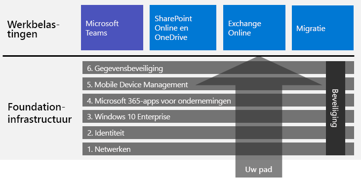

# Microsoft 365 voor ondernemingen implementerenDeploy Microsoft 365 for enterprise

Microsoft 365 voor ondernemingen is een combinatie van lokale en op de cloud gebaseerde productiviteits-apps en -services met Windows 10 Enterprise die:Microsoft 365 for enterprise is a combination of local and cloud-based productivity apps and services with Windows 10 Enterprise that:  

- Intelligente beveiliging bevat.Has intelligent security.
- Is geïntegreerd voor gebruiksgemak.Is integrated for simplicity.
- Creativiteit stimuleert.Unlocks creativity.
- Is gemaakt voor teamwerk.Is built for teamwork.

U kunt deze voordelen realiseren door de infrastructuur en productiviteitsworkloads op een geïntegreerde manier te implementeren, onder andere met geavanceerde beveiligingsservices en -functies.You can realize these benefits by deploying the infrastructure and productivity workloads in an integrated way that includes state-of-the-art security services and features.

U kunt Microsoft 365 voor ondernemingen op drie manieren implementeren:There are three main ways to deploy Microsoft 365 for enterprise:

- Met Microsoft-technici via [FastTrack voor Microsoft 365](#fasttrack-for-microsoft-365).Do it with Microsoft engineers using [FastTrack for Microsoft 365](#fasttrack-for-microsoft-365).
- Met behulp van Microsoft Consulting Services of een [Microsoft-partner](https://partner.microsoft.com/).Do it with help from Microsoft Consulting Services or a [Microsoft partner](https://partner.microsoft.com/).
- Zelf met de [Implementatiehandleiding voor Microsoft 365 voor ondernemingen](#microsoft-365-for-enterprise-deployment-guide).Do it yourself with the [Microsoft 365 for enterprise deployment guide](#microsoft-365-for-enterprise-deployment-guide).

## FastTrack voor Microsoft 365FastTrack for Microsoft 365

FastTrack is een doorlopend en herhaalbaar voordeel, *gratis beschikbaar als onderdeel van uw abonnement*, dat wordt geleverd door Microsoft-technici om u te helpen in uw eigen tempo over te stappen naar de cloud.FastTrack is an ongoing and repeatable benefit—*available for free as part of your subscription*—that is delivered by Microsoft engineers to help you move to the cloud at your own pace. FastTrack biedt ook toegang tot gekwalificeerde partners voor extra services.FastTrack also gives you access to qualified partners for additional services. Met meer dan 40.000 klanten die tot nu toe zijn geholpen, wordt met FastTrack de ROI gemaximaliseerd, de implementatie versneld en de ingebruikname binnen uw organisatie vergroot.With over 40,000 customers enabled to date, FastTrack helps maximize ROI, accelerate deployment, and increase adoption across your organization. Zie [FastTrack voor Microsoft 365](https://fasttrack.microsoft.com/microsoft365).See [FastTrack for Microsoft 365](https://fasttrack.microsoft.com/microsoft365).

Als u FastTrack wilt gebruiken voor de implementatie van Microsoft 365 voor ondernemingen, kunt u de FastTrack [Microsoft 365-implementatieadviseur](https://aka.ms/microsoft365setupguide) gebruiken voor hulp bij het implementeren en instellen van de basisinfrastructuur.If you want to take advantage of FastTrack to deploy Microsoft 365 for enterprise, you can use the FastTrack [Microsoft 365 deployment advisor](https://aka.ms/microsoft365setupguide) for guidance on how to deploy and set up your foundation infrastructure. U moet zijn aangemeld als een globale beheerder van een Office 365- of Microsoft 365-tenant om deze pagina te kunnen openen.You must be signed in as a global administrator in an Office 365 or Microsoft 365 tenant to access this page.

Ga [hier](https://fasttrack.microsoft.com/microsoft365) aan de slag met uw end-to-end-implementatietraject met FastTrack.Get started on your end-to-end deployment journey with FastTrack [here](https://fasttrack.microsoft.com/microsoft365).

## Implementatiehandleiding voor Microsoft 365 voor ondernemingenMicrosoft 365 for enterprise deployment guide

In de implementatiehandleiding voor Microsoft 365 voor ondernemingen wordt u stapsgewijs begeleid bij de juiste en vereiste configuratie van de producten en functies van Microsoft 365 voor ondernemingen.The Microsoft 365 for enterprise deployment guide steps you through the correct and required configuration of Microsoft 365 for enterprise products and features.

Als u Microsoft 365 voor ondernemingen zelf wilt implementeren, kunt u:To deploy Microsoft 365 for enterprise yourself, you can:

- De [basisinfrastructuur](deploy-foundation-infrastructure.md) implementeren voor ingebouwde beveiliging en integratie voor vereenvoudigd beheer. Hierdoor kunt u er makkelijker voor zorgen dat de clientsoftware wordt bijgewerkt met de meest recente verbeteringen in productiviteit en beveiliging.Deploy the [foundation infrastructure](deploy-foundation-infrastructure.md) for built-in security and integration for simplified management, which makes it easier to ensure your client software is updated with the latest productivity and security enhancements. 
 
  De basisinfrastructuur is ingedeeld als een reeks genummerde fasen die op elkaar voortbouwen en een omgeving vormen die de workloads van Microsoft 365 voor ondernemingen ondersteunt.The foundation infrastructure is organized as a series of numbered phases that build upon each other and towards an environment that supports Microsoft 365 for enterprise workloads. 

  **Als u een kleinere of nieuwere organisatie bent**, volgt u de fasen om de infrastructuur methodisch uit te bouwen.**If you are a smaller or newer organization**, follow the phases in order to methodically build out your infrastructure.

  U kunt echter de fasen of delen van de fasen van deze infrastructuur in elke gewenste volgorde implementeren, [een voor een of parallel](deployment-strategies-microsoft-365-enterprise.md), voor de integratie met uw huidige infrastructuur, afstemming op uw IT-plannen en -resources en om te voldoen aan uw zakelijke behoeften.However, you can deploy phases or the portions of phases of this infrastructure in any order as needed, [one after the other or in parallel](deployment-strategies-microsoft-365-enterprise.md), to integrate with your current infrastructure, fit your IT plans and resources, and meet your business needs. Klik [hier](deploy-foundation-infrastructure-non-enterprises.md) voor een vereenvoudigde implementatie voor middelgrote bedrijven.For a simplified deployment for non-enterprises, click [here](deploy-foundation-infrastructure-non-enterprises.md).

  **Als u een grote onderneming bent**, bekijkt u de fasen als lagen IT-infrastructuur in plaats van een gedefinieerd pad en bepaalt u hoe u het beste zo te werk kunt gaan dat er wordt voldaan aan de vereisten van elke laag in uw organisatie.**If you are an enterprise organization**, view the phases as layers of IT infrastructure, rather than a defined path, and determine how to best work toward eventual adherence to the requirements of each layer across your organization.

- Implementeer belangrijke [workloads](deploy-workloads.md) voor de productiviteit bovenop de infrastructuur.Deploy key productivity [workloads](deploy-workloads.md) on top of your infrastructure. Hiermee wordt creativiteit en teamwerk in uw organisatie bevorderd.These unlock creativity and teamwork in your organization.

Hier ziet u de relatie tussen de basisinfrastructuur en de workloads.Here's the relationship between the foundation infrastructure and the workloads.

Workloads worden boven op de basisinfrastructuur uitgevoerd.Workloads operate over the top of the foundation infrastructure. U hoeft echter niet alle fasen van de basisinfrastructuur te laten uitbouwen om workloads voor productiviteit en samenwerking te gaan gebruiken.However, you do not have to have all of the foundation infrastructure phases built out to begin using workloads for productivity and collaboration.

Ga [hier](deploy-foundation-infrastructure.md) zelf aan de slag met uw end-to-end-implementatietraject.Get self-started on your end-to-end deployment journey [here](deploy-foundation-infrastructure.md).

## UitproberenTake a test drive

"*Wat men moet leren doen, leert men door het te doen.*""*For the things we have to learn before we can do them, we learn by doing them.*" - Aristoteles- Aristotle

Als u nog niet bekend bent met Microsoft 365 voor ondernemingen of met een specifiek product of specifieke functie, kunt u het beste hiermee vertrouwd raken door dit zelf uit te bouwen en te zien werken.If you're new to Microsoft 365 for enterprise or to a specific product or feature, one of the best ways to gain understanding is to build it out yourself and see it working.

We hebben dit eenvoudiger gemaakt met Testlabrichtlijnen (TLG's), die u stapsgewijs begeleiden bij de configuratie van de infrastructuur of een functie in een vereenvoudigde, maar representatieve testomgeving met proefversies of betaalde abonnementen.We've made this easier with Test Lab Guides (TLGs), which step you through the configuration of infrastructure or a feature in a simplified but representative test environment using trial or paid subscriptions.

Met TLG's kunt u zelfstudies doen, demonstreren, aanpassen of een haalbaarheidsstudie maken van een complexe configuratie, workload of end-to-end-scenario.With TLGs, you can self-learn, demonstrate, customize, or build a proof of concept (PoC) of a complex configuration, workload, or end-to-end scenario.

Zie [Testlabrichtlijnen voor Microsoft 365 voor ondernemingen](m365-enterprise-test-lab-guides.md).For more information, see [Microsoft 365 for enterprise Test Lab Guides](m365-enterprise-test-lab-guides.md).

## Uw hele organisatie overzettenTransition your entire organization

Zie de poster [Uw organisatie overzetten naar Microsoft 365](../media/deploy-microsoft-365-enterprise/transition-org-to-m365.pdf) als u een beter beeld wilt krijgen van de manier waarop u uw hele organisatie kunt overzetten naar de producten en services in Microsoft 365 voor ondernemingen.To get a better picture of how to move your entire organization to the products and services in Microsoft 365 for enterprise, see the [Transition Your Organization to Microsoft 365](../media/deploy-microsoft-365-enterprise/transition-org-to-m365.pdf) poster.

Deze poster van twee pagina's is een snelle manier om de bestaande infrastructuur te inventariseren en de informatiebronnen te vinden die u kunnen helpen bij het overstappen naar het bijbehorende product of de bijbehorende service in Microsoft 365 voor ondernemingen.This two-page poster is a quick way to inventory your existing infrastructure and get to the guidance for moving to the corresponding product or service in Microsoft 365 for enterprise. De poster bevat Windows- en Office-producten en andere infrastructuur- en beveiligingselementen, zoals apparaat- en identiteitsbeheer, informatiebeveiliging en beveiliging tegen bedreigingen.It includes Windows and Office products and other infrastructure and security elements such as device management, identity, and information and threat protection.

U kunt ook [deze poster downloaden](https://github.com/MicrosoftDocs/microsoft-365-docs/raw/public/microsoft-365/media/deploy-microsoft-365-enterprise/transition-org-to-m365.pdf) en afdrukken in de indeling Letter, Legal of Tabloid (11 x 17).You can also [download the transition poster](https://github.com/MicrosoftDocs/microsoft-365-docs/raw/public/microsoft-365/media/deploy-microsoft-365-enterprise/transition-org-to-m365.pdf) and print it in letter, legal, or tabloid (11 x 17) formats.

## Hoe hebben anderen dit gedaan?How did others do it?

Gebruik deze informatiebronnen om inzicht te krijgen in de manier waarop anderen Microsoft 365 voor ondernemingen hebben geïmplementeerd en dit gebruiken.Use these resources to understand how others have deployed and are using Microsoft 365 for enterprise.

### Hoe klanten Microsoft 365 voor ondernemingen gebruikenHow customers use Microsoft 365 for enterprise

Gebruik de site Verhalen van klanten als u wilt weten hoe Microsoft-klanten Microsoft 365 voor ondernemingen gebruiken.Use the Customer Stories site to see how Microsoft customers are using Microsoft 365 for enterprise.

1. Ga naar [https://customers.microsoft.com/](https://customers.microsoft.com/) en klik op **Zoeken**.Go to [https://customers.microsoft.com/](https://customers.microsoft.com/) and click **Search**.
2. Selecteer in het linkerdeelvenster uw taal bij **Taal**.In the left pane, select your language in **Language**.
3. Selecteer de branche van uw organisatie bij **Branche**.Select your organization's industry in **Industry**.
4. Selecteer **Microsoft 365** bij **Product**.Select **Microsoft 365** in **Product**.
5. Klik op een kaart voor de casestudy van de klant.Click on a card for the customer's case study.

### Hoe Microsoft gebruikmaakt van Microsoft 365 voor ondernemingenHow Microsoft uses Microsoft 365 for enterprise

Voor elke leider die een moderne werkplek wil realiseren, is het definiëren van een digitale cultuur essentieel.Defining a digital culture is a major priority for every leader who strives to foster a modern workplace. Microsoft 365 is ontworpen om dit soort culturele verschuiving te ondersteunen, zodat iedereen in het bedrijf kan profiteren van creativiteit en samenwerking.Microsoft 365 was designed to support this kind of cultural shift helping leaders empower everyone at their companies to unleash creativity and collaboration. De totstandkoming van de basisinfrastructuur van Microsoft heeft precies dit type verschuiving van de digitale cultuur opgeleverd.Establishing Microsoft's foundational infrastructure has sparked precisely this kind of digital culture shift. Door Microsoft 365 voor ondernemingen te implementeren, hebben we samenwerkingstechnologie, zoals Microsoft Teams en Exchange Online, kunnen implementeren en gevoelige gegevens online kunnen delen via beveiligde SharePoint-intranetsites.Implementing Microsoft 365 for enterprise has allowed us to deploy collaboration technology, like Microsoft Teams and Exchange Online, and to share sensitive data online across secure SharePoint intranet sites.

Met intelligente beveiligingsfuncties en productintegratie kunt u daarbij ook nog de behoeften van het management en de totale eigendomskosten voor de IT-levensduur tot een minimum beperken.At the same time, intelligent security features and product integration helps streamline management needs and minimize the total cost of ownership across the IT lifecycle. 

Lees hoe Core Services Engineering and Operations (voorheen Microsoft IT) een [moderne werkplek heeft gebouwd met Microsoft 365](https://www.microsoft.com/nl-NL/itshowcase/microsoft-365).Learn how Core Services Engineering and Operations (formerly Microsoft IT) has [built a modern workplace with Microsoft 365](https://www.microsoft.com/nl-NL/itshowcase/microsoft-365).

> [!Note]
> Deze webpagina is alleen beschikbaar in het Engels.This web page is only available in English.

### Hoe Contoso Corporation Microsoft 365 voor ondernemingen heeft geïmplementeerdHow the Contoso Corporation deployed Microsoft 365 for enterprise

Contoso Corporation is een fictief maar representatief wereldwijd productieconglomeraat met het hoofdkantoor in Parijs, Frankrijk.The Contoso Corporation is a fictional but representative global manufacturing conglomerate with its headquarters in Paris, France. Bekijk hoe [Contoso Microsoft 365 voor ondernemingen heeft geïmplementeerd](contoso-case-study.md) en aandacht heeft besteed aan belangrijke ontwerpbeslissingen en implementatiedetails voor netwerken, identiteiten, Windows 10 Enterprise, Microsoft 365-apps voor ondernemingen, beheer van mobiele apparaten, gegevensbescherming en beveiliging.See how [Contoso deployed Microsoft 365 for enterprise](contoso-case-study.md) and addressed major design decisions and implementation details for networking, identity, Windows 10 Enterprise, Microsoft 365 Apps for enterprise, mobile device management, information protection, and security. 

## Volgende stapNext step

Als u dit wilt doen met rechtstreekse hulp van Microsoft, gebruikt u [FastTrack](https://fasttrack.microsoft.com/microsoft365).To do it with direct Microsoft assistance, use [FastTrack](https://fasttrack.microsoft.com/microsoft365).

Als u hulp wilt van een consultant, neemt u contact op met Microsoft Consulting Services of een [Microsoft-partner](https://partner.microsoft.com/).To do it with a consultant, contact Microsoft Consulting Services or a [Microsoft partner](https://partner.microsoft.com/).

Als u zelf aan de slag wilt gaan, gaat u naar de [basisinfrastructuur](deploy-foundation-infrastructure.md).To get started doing it yourself, see the [foundation infrastructure](deploy-foundation-infrastructure.md).
