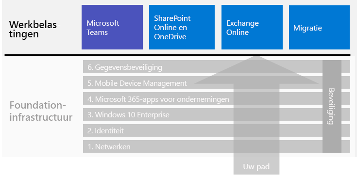

# Microsoft 365 voor bedrijfsworkloadsMicrosoft 365 for enterprise workloads

Als u wilt profiteren van de voordelen van de creativiteit en het teamwork van Microsoft 365 voor ondernemingen, kunt u de volgende workloads op uw basisinfrastructuur implementeren:To get the creativity and teamwork benefits of Microsoft 365 for enterprise, deploy these workloads over your foundation infrastructure:

- [Microsoft TeamsMicrosoft Teams](teams-workload.md)
- [Exchange OnlineExchange Online](exchangeonline-workload.md)
- [SharePoint en OneDriveSharePoint and OneDrive](sharepoint-online-onedrive-workload.md)

Zie het artikel over [migratie](migration-microsoft-365-enterprise-workload.md) voor een algemene routekaart voor het migreren van uw hele organisatie naar Microsoft 365 voor ondernemingen, inclusief Microsoft Office-clientproducten, on-premises Office Server-producten en Microsoft Windows-apparaten.See the [migration](migration-microsoft-365-enterprise-workload.md) article for a general roadmap to migrate your entire organization to Microsoft 365 for enterprise, which includes Microsoft Office client products, on-premises Office Server products, and Microsoft Windows-based devices.

Hier volgen de workloads in de algemene implementatiehandleiding voor Microsoft 365 voor ondernemingen:Here are the workloads in the overall Microsoft 365 for enterprise deployment guide:

## Vereisten voor de basisinfrastructuurFoundation infrastructure prerequisites

*Idealiter* dient u workloads te implementeren nadat u alle fasen van de [basisinfrastructuur](deploy-foundation-infrastructure.md) hebt geconfigureerd.*Ideally*, you should deploy workloads after you have configured all of the phases of the [foundation infrastructure](deploy-foundation-infrastructure.md). Dit zorgt ervoor dat alle onderliggende basislagen aanwezig zijn, zodat u uw gebruikers en hun apparaten integratie, beveiliging en de beste ervaring kunt bieden.This ensures that all of the underlying foundation layers are in place to provide integration, security, and the best experience for your users and their devices.

| FasePhase | ResultaatResult |
|:-------|:-----|
| NetwerkNetwork | Uw netwerk wordt bijgewerkt voor optimale prestaties met Microsoft 365-cloudservices.Your network is updated for optimum performance to Microsoft 365 cloud services. |
| IdentiteitIdentity | Identiteit wordt met sterke verificatie voor gebruikersaccounts en bescherming voor beheerdersaccounts gesynchroniseerd en beveiligd.Identity is synchronized and secured with strong authentication for user accounts and protection for admin accounts. |
| Windows 10 EnterpriseWindows 10 Enterprise | Voor computers met Windows 7 of Windows 8.1 kunt u een upgrade uitvoeren naar Windows 10 Enterprise en op nieuwe apparaten wordt Windows 10 Enterprise geïnstalleerd.Your computers running Windows 7 or Windows 8.1 can upgrade to Windows 10 Enterprise and new devices are installed with Windows 10 Enterprise. |
| Microsoft 365-apps voor ondernemingenMicrosoft 365 Apps for enterprise | Bestaande gebruikers van Microsoft Office kunnen een upgrade uitvoeren naar Microsoft 365-apps voor ondernemingen.Your existing users of Microsoft Office can upgrade to Microsoft 365 Apps for enterprise. |
| Mobile Device ManagementMobile device management | Uw apparaten kunnen worden geregistreerd en beheerd.Your devices can be enrolled and managed. |
| GegevensbeveiligingInformation protection | Microsoft 365-functies voor informatiebescherming worden geconfigureerd en uw gevoeligheidslabels of Azure Information Protection-labels zijn gereed om documenten en e-mail te beschermen.Microsoft 365 information protection features are configured and your sensitivity or Azure Information Protection labels are ready to protect documents and email. |

Vergeet niet dat dit het ideale geval is en dat het plannen, configureren en testen veel tijd in beslag kan nemen, met name in grote organisaties met een bestaande infrastructuur en meerdere locaties.Remember that this is ideal and can take some time to plan for, configure, test, and pilot, especially in large organizations with existing infrastructure and multiple locations. Het voltooien van alle fasen op alle locaties is niet nodig om sneller meer bedrijfswaarde uit Microsoft 365 voor ondernemingen te halen.Completing all of these phases in all locations is not necessary for you to more quickly get business value from Microsoft 365 for enterprise. 

Hier volgen enkele veelvoorkomende workloads die u onmiddellijk kunt implementeren:Here are some common workloads to deploy right away: 

- Nadat de fase **Identiteit** van de basisinfrastructuur voor de gebruikers is geïmplementeerd, worden door veel organisaties ook de volgende workloads geïmplementeerd:After the **Identity** phase of the foundation infrastructure is rolled out to users, many organizations deploy:
  - [Microsoft 365-apps voor ondernemingen](office365proplus-infrastructure.md) gecombineerd met [OneDrive](https://docs.microsoft.com/onedrive/plan-onedrive-enterprise).[Microsoft 365 Apps for enterprise](office365proplus-infrastructure.md) combined with [OneDrive](https://docs.microsoft.com/onedrive/plan-onedrive-enterprise). Microsoft 365-apps voor ondernemingen biedt de beveiliging van moderne verificatie en de gebruikerservaring van de nieuwste Microsoft Office-client.Microsoft 365 Apps for enterprise provides the security of modern authentication and the user experience of the latest Microsoft Office client. De migratie van persoonlijke bestanden van gebruikers naar OneDrive vermindert de hoeveelheid infrastructuur en de noodzaak om lokale mappen en stations te ondersteunen.The migration of user's personal files to OneDrive reduces infrastructure and the need to support home folders and drives.
  - [Exchange Online](exchangeonline-workload.md), zodat gebruikers e-mail in de cloud kunnen gebruiken.[Exchange Online](exchangeonline-workload.md) so that users can begin using cloud-based email.
- Als u sterk gereglementeerde digitale activa niet onmiddellijk in de cloud wilt opslaan, kunt u [Microsoft Teams](teams-workload.md) en [SharePoint](sharepoint-online-onedrive-workload.md) voor uw gebruikers implementeren voorafgaand aan de fase **Informatiebescherming**.If you don't have an immediate need for storing highly regulated digital assets in the cloud, deploy [Microsoft Teams](teams-workload.md) and [SharePoint](sharepoint-online-onedrive-workload.md) for your users prior to the **Information protection** phase.

U moet zelf bepalen hoe u de configuratie van vereiste fasen van de basisinfrastructuur wilt implementeren om te voldoen aan de behoeften van uw bedrijf.You must decide on how to best order and deploy the configuration of prerequisite phases of foundation infrastructure to meet your business needs.

### Aanbevolen proceduresBest practice

Het wordt ten zeerste aangeraden de fase **Identiteit** van de basisinfrastructuur te implementeren en uit te voeren voordat u uw gebruikers op workloads of scenario's gaat inwerken.We highly recommend that you deploy and roll out the **Identity** phase of the foundation infrastructure prior to onboarding your users to any workloads or scenarios.

Met de fase **Identiteit** wordt gegarandeerd dat uw cloud-identiteit, of deze nu alleen voor de cloud is of dat deze wordt gesynchroniseerd met uw on-premises Active Directory Domain Services (AD DS), de gebruikers- en computeraccounts en -groepen bevat voor het beheren van verificatie en toegang.The **Identity** phase ensures that your cloud-based identity, whether cloud-only or synchronized with your on-premises Active Directory Domain Services (AD DS), contains the user and computer accounts and groups to manage authentication and access. Voor alle gebruikers moet een sterke verificatie worden uitgevoerd met een sterke bescherming van beheerdersaccounts voordat de digitale activa van uw organisatie in de Microsoft 365-cloud worden geplaatst.Strong authentication for all your users along with strong protection of admin accounts is required before placing your organization's digital assets in the Microsoft 365 cloud.

Hoewel de implementatie van de fase **Netwerken** fundamenteel en zeer belangrijk is voor de prestaties in het algemeen, kan deze fase worden uitgevoerd terwijl uw gebruikers voor workloads worden ingewerkt, waarbij niet mag worden vergeten dat de prestaties van de workloads en services van Microsoft 365 in de loop van de tijd beter worden.Although foundational and very important to overall performance, the rollout of the **Networking** phase can be in progress while onboarding your users to workloads, with the understanding that Microsoft 365 workload and service performance will improve over time. Dit geldt met name voor ondernemingen met meerdere locaties en een combinatie van edge-apparaten en internetverbindingen.This is especially true for enterprise organizations with multiple locations and a mixture of edge devices and Internet connections.
