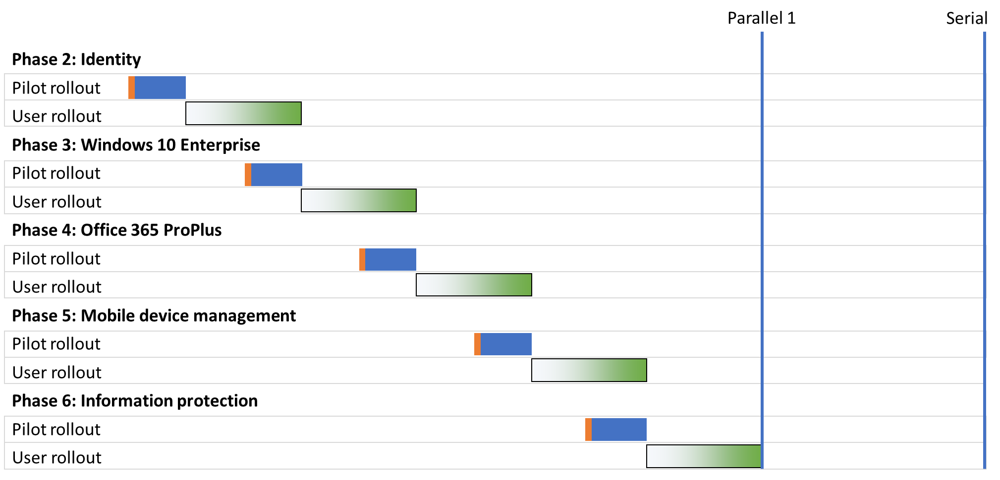
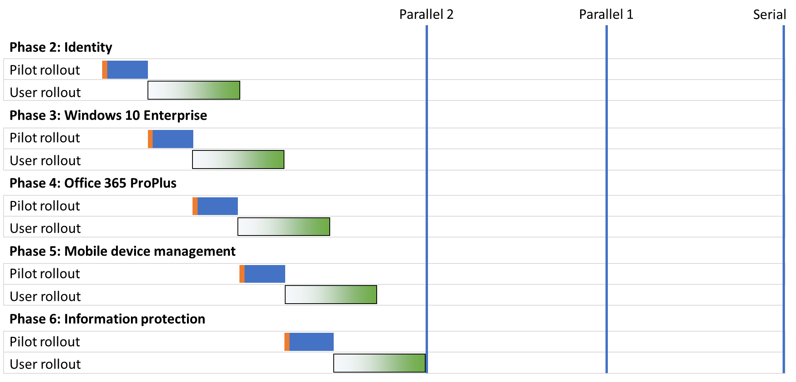
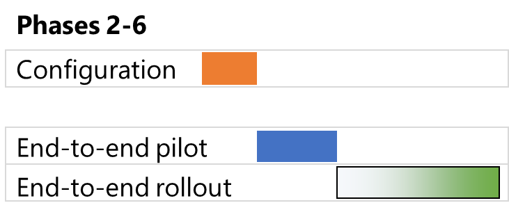

# Strategieën voor de implementatie van de basisinfrastructuur van Microsoft 365 voor EnterpriseMicrosoft 365 for enterprise foundation infrastructure deployment strategies

Er zijn veel manieren waarop u de fasen van de [basisinfrastructuur](deploy-foundation-infrastructure.md) van Microsoft 365 voor ondernemingen kunt implementeren en de mogelijkheden, software en services voor uw gebruikers kunt uitrollen.There are many ways you can deploy the phases of the [foundation infrastructure](deploy-foundation-infrastructure.md) of Microsoft 365 for enterprise and roll out its capabilities, software, and services to your users. De implementatie kan groot en complex zijn, afhankelijk van de grootte van uw organisatie en de bestaande infrastructuur. Om u op weg te helpen met het projectbeheer kunt u de volgende implementatiestrategieën overwegen:To get you started on the project management of this undertaking, which can be large and complex depending on the size of your organization and its existing infrastructure, consider the following deployment strategies:

- Seriële implementatieSerial deployment
- Parallelle implementatie met niet-overlappende implementatie van gebruikersParallel deployment with non-overlapping user rollout
- Parallelle implementatie met overlappende implementatie van gebruikersParallel deployment with overlapping user rollout
- Up-front infrastructuur en uitrol van de end-to-end configuratieUp-front infrastructure and rollout of the end-to-end configuration

Gebruik deze strategieën voor ideeën over hoe u het totale project kunt beheren en sneller de zakelijke voordelen van Microsoft 365 voor ondernemingen kunt realiseren.Use these strategies for ideas on how to manage the overall project and more quickly realize the business benefits of Microsoft 365 for enterprise.

>[!Note]
>Dit artikel bevat veronderstellingen en vereenvoudigingen zodat de implementatiestrategieën op consistente wijze kunnen worden beschreven.This article contains assumptions and simplifications for a consistent way to describe the deployment strategies. Deze implementatiestrategieën zijn algemeen van aard en zijn niet bedoeld als specifiek tijdsbestek, noch zijn ze bedoeld voor alle organisaties en situaties.These deployment strategies are generalized and are not meant to imply any specific timeframes, nor are they meant to apply to all organizations and situations.
>

## Elementen van IT-projectbeheer voor typische ondernemingenElements of IT project management for typical enterprise organizations

De IT-infrastructuur omvat zowel backend-services als de implementatie van nieuwe of verbeterde mogelijkheden, of geïnstalleerde software voor eindgebruikers.IT infrastructure includes both backend services and the rollout of new or improved capabilities or installed software to end users. IT-afdelingen implementeren meestal elementen van een IT-infrastructuur op een methodische wijze.IT departments typically deploy elements of an IT infrastructure in a methodical way. Een van de manieren waarop een element van de IT-infrastructuur succesvol kan worden geïmplementeerd, bestaat uit:One approach to the successful deployment of an element of IT infrastructure consists of:

- Een proefimplementatieA pilot rollout 

  Dit omvat initiële infrastructuurconfiguratie en uitrol naar een proefset van gebruikers, testen en daaropvolgende aanpassingen aan de infrastructuurconfiguratie.This includes initial infrastructure configuration and rollout to a pilot set of users, testing, and subsequent modifications to the infrastructure configuration.

- Een gebruikersimplementatieA user rollout

  Dit omvat de uitrol naar de rest van uw organisatie op basis van regio's, afdelingen, groepen of andere soorten systematische verspreiding van de configuratie of software.This includes the rollout to the rest of your organization based on regions, departments, groups, or other types of systematic propagation of configuration or software.

De gebruikers in de proefimplementatie zijn niet hetzelfde als die in de gebruikersimplementatie.The set of users in the pilot rollout are not the same as those in the user rollout.

In dit artikel worden de volgende afbeeldingen gebruikt om deze definities weer te geven:This article uses the following graphics to depict these definitions: 

 

De arcering van de afbeelding voor de gebruikersimplementatie geeft het percentage binnen uw organisatie aan van 0% tot 100% bij een gestructureerde of methodische aanpak, zoals groepen, afdelingen of regio's.The shading for the user rollout graphic indicates the percentage across your organization from 0% to 100% using a structured or methodical approach such as groups, departments, or regions.

## ImplementatiestrategieënDeployment strategies

Overweeg met de volgende implementatiestrategieën:Consider the following deployment strategies:

- Seriële implementatieSerial deployment
- Parallelle implementatie met niet-overlappende implementatie van gebruikersParallel deployment with non-overlapping user rollout
- Parallelle implementatie met overlappende implementatie van gebruikersParallel deployment with overlapping user rollout
- Up-front infrastructuur en uitrol van de end-to-end configuratieUp-front infrastructure and rollout of the end-to-end configuration

### Seriële implementatieSerial deployment

Met een seriële implementatie kunt u een fase volledig uitrollen, waardoor de fase 100% kan worden voltooid voor al uw gebruikers, voordat u naar de volgende stap gaat.With a serial deployment, you completely roll out a phase, allowing the phase to reach 100% completion of deployment to all of your users, before moving on to the next one. Hier zijn enkele redenen waarom u op deze manier zou kunnen implementeren:Here are some of the reasons why you might deploy this way:

- RisicobeperkingRisk mitigation
- Resourcing-beperkingenResourcing constraints
- Financieringscycli van de IT-afdelingIT department funding cycles
- Afhankelijkheden van IT-technologieIT technology dependencies
- Beheer van bedrijfsveranderingen en weerstand van eindgebruikersBusiness change management and end-user resistance

Dit Gantt-diagram toont een vereenvoudigde seriële implementatie van fasen 2-6 van de basisinfrastructuur voor Microsoft 365 voor ondernemingen.This Gantt chart shows a simplified serial deployment of phases 2-6 of the foundation infrastructure for Microsoft 365 for enterprise.

 
 
Om de discussie en het voorbeeld te vereenvoudigen, wordt aangenomen dat elke fase en implementatiesegment binnen elke fase evenveel tijd in beslag nemen.To simplify the discussion and example, each phase and deployment segment within each phase are assumed to take the same amount of time.

>[!Note]
>Fase 1: netwerken van de basisinfrastructuur voor Microsoft 365 voor ondernemingen is een fase specifiek voor IT-afdelingen.Phase 1: Networking of the Microsoft 365 for enterprise Foundation Infrastructure is an IT department-only phase. Gebruikers profiteren van de voordelen van geoptimaliseerde connectiviteit met de cloudbronnen van Microsoft, maar hen wordt niet opgelegd dit na te streven.Users reap the benefits of optimized connectivity to Microsoft’s cloud resources but are not imposed upon to achieve it.
>

Dit is een vereenvoudigde gebruikerservaring voor prototypen als voorbeeld:Here’s a simplified pilot user experience as an example:

- In december moet ik mijn smartphone voor MFA gaan gebruiken.In December, I need to use my smart phone for MFA. (Identiteit)(Identity)
- In maart wordt Windows 10 Enterprise geïnstalleerd op mijn Windows 8.1-desktop.In March, I get Windows 10 Enterprise installed on my Windows 8.1 desktop. (Windows 10 Enterprise)(Windows 10 Enterprise)
- In juni wordt Office 365 ProPlus geïnstalleerd, ter vervanging van Office 2013.In June, I get Office 365 ProPlus installed, replacing Office 2013. (Office 365 ProPlus)(Office 365 ProPlus)
- In september worden de apparaatimplementatie en het app- en apparaatbeleid toegepast.In September, I get device enrollment and app and device policies applied. (Mobile device management)(Mobile device management)
- In december wordt de Azure Information Protection-client geïnstalleerd en krijg ik training in het toepassen van labels op documenten.In December, I get the Azure Information Protection client installed and get trained on how to apply labels to documents. (Informatiebescherming)(Information protection)

Het resultaat is een frequentie van 90 dagen tussen opeenvolgende proefimplementaties.The result is a 90-day cadence between successive pilot rollouts.

Hieronder ziet u een vereenvoudigde ervaring voor de eindgebruiker als voorbeeld:Here’s a simplified end-user experience as an example:

- In januari moet ik mijn smartphone voor MFA gaan gebruiken.In January, I need to use my smart phone for MFA. (Identiteit)(Identity)
- In april wordt Windows 10 Enterprise geïnstalleerd op mijn Windows 8.1-desktop.In April, I get Windows 10 Enterprise installed on my Windows 8.1 desktop. (Windows 10 Enterprise)(Windows 10 Enterprise)
- In juli wordt Office 365 ProPlus geïnstalleerd, ter vervanging van Office 2013.In July, I get Office 365 ProPlus installed, replacing Office 2013. (Office 365 ProPlus)(Office 365 ProPlus)
- In oktober worden de apparaatimplementatie en het app- en apparaatbeleid toegepast.In October, I get device enrollment and app and device policies applied. (Mobile device management)(Mobile device management)
- In januari van het volgend jaar wordt de Azure Information Protection-client geïnstalleerd en krijg ik training in het toepassen van labels op documenten.In January of the following year, I get the Azure Information Protection client installed and get trained on how to apply labels to documents. (Informatiebescherming)(Information protection)

Het resultaat is een frequentie van 90 dagen tussen opeenvolgende gebruikersimplementaties.The result is a 90-day cadence between successive user rollouts.

Het nadeel van deze implementatiestrategie is dat het lang kan duren voordat de basisinfrastructuur van Microsoft 365 voor ondernemingen volledig is geïmplementeerd.The disadvantage to this deployment strategy is that it can take a long time to fully deploy the Microsoft 365 for enterprise foundation infrastructure.

### Parallelle implementatie met niet-overlappende implementatie van gebruikers (parallel 1)Parallel deployment with non-overlapping user rollout (Parallel 1)

Voor deze implementatiestrategie start u de proefimplementatie van de volgende fase tijdens het laatste deel van de gebruikersimplementatie van de huidige fase.For this deployment strategy, you start the pilot rollout of the next phase during the last part of the user rollout of the current phase.
Hier is de implementatie van fase 2-6 wanneer de proefimplementatie plaatsvindt terwijl de implementatie van de gebruiker van de vorige fase wordt afgerond.Here is the deployment of phases 2-6 when the pilot rollout occurs as the user rollout of the previous phase is wrapping up.

 
 
Het eindresultaat is dat de gebruikersimplementatie voor de huidige fase in uw hele organisatie is voltooid voordat de volgende begint.The end result is that user rollout for the current phase completes across your organization before the next one starts. Gebruikers die niet deelnemen aan proefimplementaties hebben niet te maken met de implementatie van meerdere fasen tegelijk, maar proefimplementaties worden parallel uitgevoerd met gebruikersimplementaties.Users that are not in pilot rollouts are not dealing with the rollouts of multiple phases at the same time, but pilot rollouts are done in parallel with user rollouts.

Dit is een vereenvoudigde gebruikerservaring voor prototypen als voorbeeld:Here’s a simplified pilot user experience as an example:

- In december moet ik mijn smartphone voor MFA gaan gebruiken.In December, I need to use my smart phone for MFA. (Identiteit)(Identity)
- In februari wordt Windows 10 Enterprise geïnstalleerd op mijn Windows 8.1-desktop.In February, I get Windows 10 Enterprise installed on my Windows 8.1 desktop. (Windows 10 Enterprise)(Windows 10 Enterprise)
- In april wordt Office 365 ProPlus geïnstalleerd, ter vervanging van Office 2013.In April, I get Office 365 ProPlus installed, replacing Office 2013. (Office 365 ProPlus)(Office 365 ProPlus)
- In juni worden de apparaatimplementatie en het app- en apparaatbeleid toegepast.In June, I get device enrollment and app and device policies applied. (Mobile device management)(Mobile device management)
- In augustus wordt de Azure Information Protection-client geïnstalleerd en krijg ik training in het toepassen van labels op documenten.In August, I get the Azure Information Protection client installed and get trained on how to apply labels to documents. (Informatiebescherming)(Information protection)

Het resultaat is een frequentie van 60 dagen tussen opeenvolgende proefimplementaties.The result is a 60-day cadence between successive pilot rollouts.

Hieronder ziet u een vereenvoudigde ervaring voor de eindgebruiker als voorbeeld:Here’s a simplified end-user experience as an example:

- In januari moet ik mijn smartphone voor MFA gaan gebruiken.In January, I need to use my smart phone for MFA. (Identiteit)(Identity)
- In maart wordt Windows 10 Enterprise geïnstalleerd op mijn Windows 8.1-desktop.In March, I get Windows 10 Enterprise installed on my Windows 8.1 desktop. (Windows 10 Enterprise)(Windows 10 Enterprise)
- In mei wordt Office 365 ProPlus geïnstalleerd, ter vervanging van Office 2013.In May, I get Office 365 ProPlus installed, replacing Office 2013. (Office 365 ProPlus)(Office 365 ProPlus)
- In juli worden de apparaatimplementatie en het app- en apparaatbeleid toegepast.In July, I get device enrollment and app and device policies applied. (Mobile device management)(Mobile device management)
- In september wordt de Azure Information Protection-client geïnstalleerd en krijg ik training in het toepassen van labels op documenten.In September, I get the Azure Information Protection client installed and get trained on how to apply labels to documents. (Informatiebescherming)(Information protection)

Het resultaat is een frequentie van 60 dagen tussen opeenvolgende gebruikersimplementaties.The result is a 60-day cadence between successive user rollouts.

Het voordeel van deze implementatiestrategie is dat het minder tijd kost om de basisinfrastructuur van Microsoft 365 voor ondernemingen volledig te implementeren, zonder dat uw IT-afdeling en gebruikers tegelijkertijd met meerdere implementaties te maken krijgen.The advantage to this deployment strategy is that it can take less time to fully deploy the Microsoft 365 for enterprise foundation infrastructure, without having your IT department and users deal with multiple rollouts the same time.

### Parallelle implementatie met overlappende implementatie van gebruikers (parallel 2)Parallel deployment with overlapping user rollout (Parallel 2)

Voor deze implementatiestrategie start u het volgende:For this deployment strategy, you start the:

- Proefimplementatie van de volgende fase tijdens het laatste deel van de gebruikersimplementatie van de huidige fase.Pilot rollout of the next phase during the last part of the user rollout of the current phase.
- De gebruikersimplementatie van de volgende fase tijdens de implementatie van de huidige fase op zodanige wijze dat er geen gebruikers zijn die meerdere fasen tegelijk doorlopen.User rollout of the next phase during the user rollout of the current phase in such a way that no user is dealing with the rollouts of multiple phases at the same time. Hierbij wordt ervan uitgegaan dat u elke fase van de Foundation-infrastructuur op dezelfde manier uitvouwt, zoals regio's, afdelingen of andere groepen.This assumes that you are rolling out each phase of the foundation infrastructure in the same way, using regions, departments, or other groupings.

Dit is een vereenvoudigde vergelijking tussen de verschillende implementatiestrategieën.Here is a simplified comparison between the different deployment strategies.

 

Het eindresultaat luidt als volgt:The end result is that:

- Proefimplementaties gaan zonder pauze van de ene fase over in de volgende.Pilot rollouts go from one phase to the next without a pause.
- De gebruikersimplementatie voor een fase begint met het voltooien van de gebruikersimplementatie in de vorige fase, maar er wordt niet meer dan één fase tegelijk uitgerold.The user rollout for a phase begins before the completion of the user rollout of the previous phase, but no individual user is rolling out more than one phase at a time.

Dit is een vereenvoudigde gebruikerservaring voor prototypen als voorbeeld:Here’s a simplified pilot user experience as an example:

- In december moet ik mijn smartphone voor MFA gaan gebruiken.In December, I need to use my smart phone for MFA. (Identiteit)(Identity)
- In januari wordt Windows 10 Enterprise geïnstalleerd op mijn Windows 8.1-desktop.In January, I get Windows 10 Enterprise installed on my Windows 8.1 desktop. (Windows 10 Enterprise)(Windows 10 Enterprise)
- In februari wordt Office 365 ProPlus geïnstalleerd, ter vervanging van Office 2013.In February, I get Office 365 ProPlus installed, replacing Office 2013. (Office 365 ProPlus)(Office 365 ProPlus)
- In maart worden de apparaatimplementatie en het app- en apparaatbeleid toegepast.In March, I get device enrollment and app and device policies applied. (Mobile device management)(Mobile device management)
- In april wordt de Azure Information Protection-client geïnstalleerd en krijg ik training in het toepassen van labels op documenten.In April, I get the Azure Information Protection client installed and get trained on how to apply labels to documents. (Informatiebescherming)(Information protection)

Het resultaat is een frequentie van 30 dagen tussen opeenvolgende proefimplementaties.The result is a 30-day cadence between successive pilot rollouts.

Hieronder ziet u een vereenvoudigde ervaring voor de eindgebruiker als voorbeeld:Here’s a simplified end-user experience as an example:

- In januari moet ik mijn smartphone voor MFA gaan gebruiken.In January, I need to use my smart phone for MFA. (Identiteit)(Identity)
- In februari wordt Windows 10 Enterprise geïnstalleerd op mijn Windows 8.1-desktop.In February, I get Windows 10 Enterprise installed on my Windows 8.1 desktop. (Windows 10 Enterprise)(Windows 10 Enterprise)
- In maart wordt Office 365 ProPlus geïnstalleerd, ter vervanging van Office 2013.In March, I get Office 365 ProPlus installed, replacing Office 2013. (Office 365 ProPlus)(Office 365 ProPlus)
- In april worden de apparaatimplementatie en het app- en apparaatbeleid toegepast.In April, I get device enrollment and app and device policies applied. (Mobile device management)(Mobile device management)
- In mei wordt de Azure Information Protection-client geïnstalleerd en krijg ik training in het toepassen van labels op documenten.In May, I get the Azure Information Protection client installed and get trained on how to apply labels to documents. (Informatiebescherming)(Information protection)

Het resultaat is een frequentie van 30 dagen tussen opeenvolgende gebruikersimplementaties.The result is a 30-day cadence between successive user rollouts.

Het voordeel van deze implementatiestrategie is dat het nog minder tijd kost om de basisinfrastructuur van Microsoft 365 voor ondernemingen volledig te implementeren, zonder dat eindgebruikers tegelijkertijd met meerdere implementaties te maken krijgen.The advantage to this deployment strategy is that it can take even less time to fully deploy the Microsoft 365 for enterprise foundation infrastructure, still without having end-users deal with multiple rollouts the same time. Gebruikers krijgen echter geen onderbreking tussen de opeenvolgende fasen.However, users don’t get a break between successive phases.

### Up-front infrastructuur en uitrol van de end-to-end configuratieUp-front infrastructure and rollout of the end-to-end configuration

Voor kleinere organisaties die de fasen 2-6 kunnen comprimeren tot één implementatiesegment, ziet de resulterende implementatie er als volgt uit:For smaller organizations with the ability to compress phases 2-6 into a single deployment segment, the resulting deployment looks like this:
 
 

De IT-afdeling configureert de infrastructuur voor fase 2-6 en rolt vervolgens uit naar de prototypegebruikers, om te controleren op end-to-end-functionaliteit.The IT department configures the infrastructure for phases 2-6, then rolls out to the pilot users to check for the end-to-end functionality. Prototypegebruikers krijgen bijvoorbeeld al deze functionaliteit tegelijkertijd:For example, pilot users get all of this functionality at the same time:

- MFA en andere identiteitsfuncties (Identiteit)MFA and other identity features (Identity)
- Windows 10 Enterprise op Windows-apparaten (Windows 10 Enterprise)Windows 10 Enterprise on Windows devices (Windows 10 Enterprise)
- Office 365 ProPlus voor de Office-suite (Office 365 ProPlus)Office 365 ProPlus for the Office suite (Office 365 ProPlus)
- App- en apparaatinstellingen (Mobile Device Management)App and device policies (Mobile device management)
- Azure Information Protection-client geïnstalleerd en training over het toepassen van labels op documenten (informatiebeveiliging)Azure Information Protection client installed and training on how to apply labels to documents (Information protection)

Zodra de proefimplementatie is voltooid, begint de implementatie van de gebruikers, waarbij elke gebruiker tegelijkertijd alle functionaliteit krijgt.Once the pilot rollout is concluded, the user rollout begins in which each user gets all the functionality the same time.

## Volgende stapNext step

Start de implementatie van Microsoft 365 voor ondernemingen met de [basisinfrastructuur](deploy-foundation-infrastructure.md).Start your deployment of Microsoft 365 for enterprise with the [foundation infrastructure](deploy-foundation-infrastructure.md).
