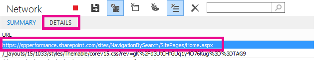

# Prestatieproblemen diagnosticeren met SharePoint Online

In dit artikel wordt beschreven hoe u veelvoorkomende problemen met uw SharePoint onlinesite kunt opsporen met behulp van hulpprogramma's voor ontwikkelaars van Internet Explorer.
  
Er zijn drie verschillende manieren waarop u kunt vaststellen dat een pagina op een SharePoint Online-site een prestatieprobleem heeft met de aanpassingen.
  
- De netwerkmonitor van de F12-werkbalk

- Vergelijking met een niet-aangepaste basislijn

- SharePoint Metrische onlinereactiekoppen

In dit onderwerp wordt beschreven hoe u elk van deze methoden kunt gebruiken om prestatieproblemen te diagnosticeren. Nadat u de oorzaak van het probleem hebt gevonden, kunt u naar een oplossing werken met behulp van de artikelen over het verbeteren van SharePoint prestaties die u kunt vinden op https://aka.ms/tune .
  
## De werkbalk F12 gebruiken om de prestaties te diagnosticeren in SharePoint Online

In dit artikel gebruiken we Internet Explorer 11. Versies van de hulpprogramma's voor F12-ontwikkelaars in andere browsers hebben vergelijkbare functies, hoewel ze er mogelijk iets anders uitzien. Zie de volgende informatie over de hulpprogramma's voor F12-ontwikkelaars:
  
- [Nieuwe functies in F12-hulpprogramma's](/previous-versions/windows/internet-explorer/ie-developer/dev-guides/bg182632(v=vs.85))

- [De hulpprogramma's voor F12-ontwikkelaars gebruiken](/previous-versions/windows/internet-explorer/ie-developer/samples/bg182326(v=vs.85))

Druk op **F12** om de hulpprogramma's voor ontwikkelaars weer te geven en klik vervolgens op Wi-Fi pictogram:
  

  
Druk op **het** tabblad Netwerk op de groene knop Afspelen om een pagina te laden. Het hulpprogramma retourneert alle bestanden die door de browser worden opgevraagd om de pagina te krijgen waar u om hebt gevraagd. In de volgende schermafbeelding ziet u een dergelijke lijst.
  

  
U kunt ook de downloadtijden van de bestanden aan de rechterkant zien, zoals wordt weergegeven in deze schermafbeelding.
  

  
Dit geeft een visuele weergave van hoe lang het bestand heeft moeten worden geladen. De groene lijn geeft aan wanneer de pagina klaar is om door de browser te worden weergegeven. Hierdoor hebt u snel een overzicht van de verschillende bestanden die mogelijk leiden tot trage paginabelastingen op uw site.
  
## Een niet-aangepaste basislijn instellen voor SharePoint Online

De beste manier om de zwakke punten van de prestaties van uw site te bepalen, is door een volledig kant-en-klaar siteverzameling in te stellen in SharePoint Online. Op deze manier kunt u alle verschillende aspecten van uw site vergelijken met wat u zou krijgen zonder aanpassing op de pagina. De OneDrive voor Bedrijven startpagina is een goed voorbeeld van een afzonderlijke siteverzameling die waarschijnlijk geen aanpassingen bevat.
  
## Informatie SharePoint antwoordkop weergeven

In SharePoint Online hebt u toegang tot de gegevens die worden teruggestuurd naar de browser in de antwoordkop voor elk bestand. De meest nuttige waarde voor het diagnosticeren van prestatieproblemen is **SPRequestDuration,** waarmee de hoeveelheid tijd wordt weergegeven die de aanvraag op de server heeft genomen om te worden verwerkt. Dit kan helpen bepalen of de aanvraag erg zwaar en resourceintensief is. Dit is het beste inzicht dat u hebt in hoeveel werk de server doet om de pagina te bedienen.

### Informatie over SharePoint koptekst weergeven
  
1. Controleer of de F12-hulpprogramma's zijn geïnstalleerd. Zie Nieuwe functies [in F12-hulpprogramma's](/previous-versions/windows/internet-explorer/ie-developer/dev-guides/bg182632(v=vs.85))voor meer informatie over het downloaden en installeren van deze hulpprogramma's.

2. Druk in de F12-hulpmiddelen op het tabblad **Netwerk** op de groene knop Afspelen om een pagina te laden.

3. Klik op een van de .aspx-bestanden die door het hulpprogramma worden geretourneerd en klik vervolgens op **DETAILS.**

    
  
4. Klik **op Antwoordkoppen**.

    
  
## Wat veroorzaakt prestatieproblemen in SharePoint Online?

In het artikel Navigatieopties voor [SharePoint Online](navigation-options-for-sharepoint-online.md) wordt een voorbeeld weergegeven van het gebruik van de waarde SPRequestDuration om te bepalen dat de ingewikkelde structurele navigatie ervoor zorgde dat de pagina lang op de server werd verwerkt. Door een waarde te nemen voor een basislijnsite (zonder aanpassing), is het mogelijk om te bepalen of het laden van een bepaald bestand lang duurt. Het voorbeeld dat wordt gebruikt in [navigatieopties voor SharePoint Online](navigation-options-for-sharepoint-online.md) is het hoofdbestand .aspx. Dat bestand bevat de meeste ASP.NET code die wordt uitgevoerd voor het laden van de pagina. Afhankelijk van de sitesjabloon die u gebruikt, kan dit start.aspx, home.aspx, default.aspx of een andere naam zijn als u de startpagina aan te passen. Als dit getal aanzienlijk hoger is dan uw basislijnsite, is dit een goede indicatie dat er iets complexs aan de hand is op uw pagina dat prestatieproblemen veroorzaakt.
  
Nadat u hebt vastgesteld dat er een specifiek probleem is voor uw site, kunt u de beste manier vinden om erachter te komen wat de slechte prestaties veroorzaakt door alle mogelijke oorzaken te verwijderen, zoals paginaaanpassingen, en deze vervolgens een voor een toe te voegen aan de site. Nadat u voldoende aanpassingen hebt verwijderd dat de pagina goed presteert, kunt u vervolgens specifieke aanpassingen een voor een toevoegen.
  
Als u bijvoorbeeld een zeer complexe navigatie hebt, kunt u de navigatie wijzigen om geen subsites weer te geven. Controleer vervolgens de hulpprogramma's voor ontwikkelaars om te zien of dit een verschil maakt. Of als u een grote hoeveelheid inhouds roll-ups hebt, probeert u deze van uw pagina te verwijderen en te kijken of dit de zaken verbetert. Als u alle mogelijke oorzaken wegwerkt en deze in één voor één toevoegt, kunt u eenvoudig bepalen welke functies het grootste probleem zijn en vervolgens naar een oplossing werken.