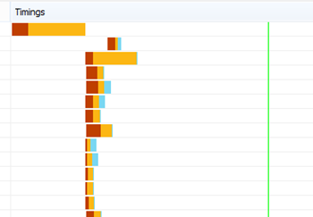

# Prestatieproblemen diagnosticeren met SharePoint OnlineDiagnosing performance issues with SharePoint Online

In dit artikel wordt beschreven hoe u veelvoorkomende problemen met uw SharePoint onlinesite kunt opsporen met behulp van hulpprogramma's voor ontwikkelaars van Internet Explorer.This article shows you how you can diagnose common issues with your SharePoint Online site using Internet Explorer developer tools.
  
Er zijn drie verschillende manieren waarop u kunt vaststellen dat een pagina op een SharePoint Online-site een prestatieprobleem heeft met de aanpassingen.There are three different ways that you can identify that a page on a SharePoint Online site has a performance problem with the customizations.
  
- De netwerkmonitor van de F12-werkbalkThe F12 tool bar network monitor

- Vergelijking met een niet-aangepaste basislijnComparison to a non-customized baseline

- SharePoint Metrische onlinereactiekoppenSharePoint Online response header metrics

In dit onderwerp wordt beschreven hoe u elk van deze methoden kunt gebruiken om prestatieproblemen te diagnosticeren.This topic describes how to use each of these methods to diagnose performance issues. Nadat u de oorzaak van het probleem hebt gevonden, kunt u naar een oplossing werken met behulp van de artikelen over het verbeteren van SharePoint prestaties die u kunt vinden op https://aka.ms/tune .Once you've figured out the cause of the problem, you can work toward a solution using the articles about improving SharePoint performance that you can find on https://aka.ms/tune.
  
## De werkbalk F12 gebruiken om de prestaties te diagnosticeren in SharePoint OnlineUsing the F12 tool bar to diagnose performance in SharePoint Online

In dit artikel gebruiken we Internet Explorer 11.In this article we use Internet Explorer 11. Versies van de hulpprogramma's voor F12-ontwikkelaars in andere browsers hebben vergelijkbare functies, hoewel ze er mogelijk iets anders uitzien.Versions of the F12 developer tools on other browsers have similar features though they may look slightly different. Zie de volgende informatie over de hulpprogramma's voor F12-ontwikkelaars:For information on the F12 developer tools, see:
  
- [Nieuwe functies in F12-hulpprogramma's](/previous-versions/windows/internet-explorer/ie-developer/dev-guides/bg182632(v=vs.85))[What's new in F12 Tools](/previous-versions/windows/internet-explorer/ie-developer/dev-guides/bg182632(v=vs.85))

- [De hulpprogramma's voor F12-ontwikkelaars gebruiken](/previous-versions/windows/internet-explorer/ie-developer/samples/bg182326(v=vs.85))[Using the F12 developer tools](/previous-versions/windows/internet-explorer/ie-developer/samples/bg182326(v=vs.85))

Druk op **F12** om de hulpprogramma's voor ontwikkelaars weer te geven en klik vervolgens op Wi-Fi pictogram:To bring up the developer tools press **F12** and then click the Wi-Fi icon:
  

  
Druk op **het** tabblad Netwerk op de groene knop Afspelen om een pagina te laden.On the **Network** tab, press the green play button to load a page. Het hulpprogramma retourneert alle bestanden die door de browser worden opgevraagd om de pagina te krijgen waar u om hebt gevraagd.The tool returns all of the files that the browser requests in order to get the page you asked for. In de volgende schermafbeelding ziet u een dergelijke lijst.The following screen shot shows one such list.
  

  
U kunt ook de downloadtijden van de bestanden aan de rechterkant zien, zoals wordt weergegeven in deze schermafbeelding.You can also see the download times of the files on the right side as shown in this screen shot.
  

  
Dit geeft een visuele weergave van hoe lang het bestand heeft moeten worden geladen.This gives you a visual representation of how long the file took to load. De groene lijn geeft aan wanneer de pagina klaar is om door de browser te worden weergegeven.The green line represents when the page is ready to be rendered by the browser. Hierdoor hebt u snel een overzicht van de verschillende bestanden die mogelijk leiden tot trage paginabelastingen op uw site.This can give you a quick view of the different files that might be causing slow page loads on your site.
  
## Een niet-aangepaste basislijn instellen voor SharePoint OnlineSetting up a non-customized baseline for SharePoint Online

De beste manier om de zwakke punten van de prestaties van uw site te bepalen, is door een volledig kant-en-klaar siteverzameling in te stellen in SharePoint Online.The best way to determine your site's performance weak points is to set up a completely out-of-the-box site collection in SharePoint Online. Op deze manier kunt u alle verschillende aspecten van uw site vergelijken met wat u zou krijgen zonder aanpassing op de pagina.This way you can compare all the various aspects of your site with what you would get with no customization on the page. De OneDrive voor Bedrijven startpagina is een goed voorbeeld van een afzonderlijke siteverzameling die waarschijnlijk geen aanpassingen bevat.The OneDrive for Business home page is a good example of a separate site collection that is unlikely to have any customizations.
  
## Informatie SharePoint antwoordkop weergevenViewing SharePoint response header information

In SharePoint Online hebt u toegang tot de gegevens die worden teruggestuurd naar de browser in de antwoordkop voor elk bestand.In SharePoint Online, you can access the information that is sent back to the browser in the response header for each file. De meest nuttige waarde voor het diagnosticeren van prestatieproblemen is **SPRequestDuration,** waarmee de hoeveelheid tijd wordt weergegeven die de aanvraag op de server heeft genomen om te worden verwerkt.The most useful value for diagnosing performance issues is **SPRequestDuration**, which displays the amount of time that the request took on the server to be processed. Dit kan helpen bepalen of de aanvraag erg zwaar en resourceintensief is.This can help determine if the request is very heavy and resource intensive. Dit is het beste inzicht dat u hebt in hoeveel werk de server doet om de pagina te bedienen.This is the best insight you have into how much work the server is doing to serve the page.

### Informatie over SharePoint koptekst weergevenTo view SharePoint response header information
  
1. Controleer of de F12-hulpprogramma's zijn geïnstalleerd.Ensure that you have the F12 tools installed. Zie Nieuwe functies [in F12-hulpprogramma's](/previous-versions/windows/internet-explorer/ie-developer/dev-guides/bg182632(v=vs.85))voor meer informatie over het downloaden en installeren van deze hulpprogramma's.For more information on downloading and installing these tools, see [What's new in F12 tools](/previous-versions/windows/internet-explorer/ie-developer/dev-guides/bg182632(v=vs.85)).

2. Druk in de F12-hulpmiddelen op het tabblad **Netwerk** op de groene knop Afspelen om een pagina te laden.In the F12 tools, on the **Network** tab, press the green play button to load a page.

3. Klik op een van de .aspx-bestanden die door het hulpprogramma worden geretourneerd en klik vervolgens op **DETAILS.**Click one of the .aspx files returned by the tool and then click **DETAILS**.

    
  
4. Klik **op Antwoordkoppen**.Click **Response headers**.

    
  
## Wat veroorzaakt prestatieproblemen in SharePoint Online?What's causing performance issues in SharePoint Online?

In het artikel Navigatieopties voor [SharePoint Online](navigation-options-for-sharepoint-online.md) wordt een voorbeeld weergegeven van het gebruik van de waarde SPRequestDuration om te bepalen dat de ingewikkelde structurele navigatie ervoor zorgde dat de pagina lang op de server werd verwerkt.The article [Navigation options for SharePoint Online](navigation-options-for-sharepoint-online.md) shows an example of using the SPRequestDuration value to determine that the complicated structural navigation was causing the page to take a long time to process on the server. Door een waarde te nemen voor een basislijnsite (zonder aanpassing), is het mogelijk om te bepalen of het laden van een bepaald bestand lang duurt.By taking a value for a baseline site (without customization), it is possible to determine if any given file is taking a long time to load. Het voorbeeld dat wordt gebruikt in [navigatieopties voor SharePoint Online](navigation-options-for-sharepoint-online.md) is het hoofdbestand .aspx.The example used in [Navigation options for SharePoint Online](navigation-options-for-sharepoint-online.md) is the main .aspx file. Dat bestand bevat de meeste ASP.NET code die wordt uitgevoerd voor het laden van de pagina.That file contains most of the ASP.NET code that runs for your page load. Afhankelijk van de sitesjabloon die u gebruikt, kan dit start.aspx, home.aspx, default.aspx of een andere naam zijn als u de startpagina aan te passen.Depending on the site template you use, this could be start.aspx, home.aspx, default.aspx, or another name if you customize the home page. Als dit getal aanzienlijk hoger is dan uw basislijnsite, is dit een goede indicatie dat er iets complexs aan de hand is op uw pagina dat prestatieproblemen veroorzaakt.If this number is considerably higher than your baseline site, then it's a good indication that there is something complex going on in your page that is causing performance issues.
  
Nadat u hebt vastgesteld dat er een specifiek probleem is voor uw site, kunt u de beste manier vinden om erachter te komen wat de slechte prestaties veroorzaakt door alle mogelijke oorzaken te verwijderen, zoals paginaaanpassingen, en deze vervolgens een voor een toe te voegen aan de site.Once you have identified that an issue specific to your site, the recommended way to figure out what is causing poor performance is to eliminate all of the possible causes, like page customizations, and then add them back to the site one by one. Nadat u voldoende aanpassingen hebt verwijderd dat de pagina goed presteert, kunt u vervolgens specifieke aanpassingen een voor een toevoegen.Once you have removed enough customizations that the page is performing well, you can then add back specific customizations one by one.
  
Als u bijvoorbeeld een zeer complexe navigatie hebt, kunt u de navigatie wijzigen om geen subsites weer te geven. Controleer vervolgens de hulpprogramma's voor ontwikkelaars om te zien of dit een verschil maakt.For example, if you have a very complex navigation try changing the navigation to not show sub-sites then check the developer tools to see if this makes a difference. Of als u een grote hoeveelheid inhouds roll-ups hebt, probeert u deze van uw pagina te verwijderen en te kijken of dit de zaken verbetert.Or if you have a large amount of content roll-ups try removing them from your page and see if this improves things. Als u alle mogelijke oorzaken wegwerkt en deze in één voor één toevoegt, kunt u eenvoudig bepalen welke functies het grootste probleem zijn en vervolgens naar een oplossing werken.If you eliminate all of the possible causes and add them back in one at a time, you can easily identify which features are the biggest problem and then work towards a solution.