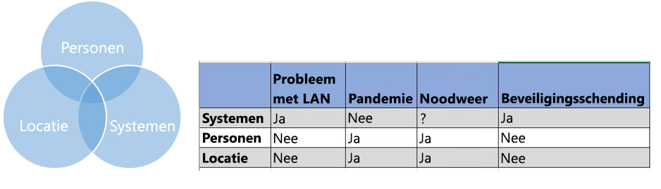

# Management van verantwoordelijkheden rondom bedrijfscontinuïteit voor klanten en cloudpartnersEnterprise business continuity management customer and cloud partner responsibilities

Het verkrijgen van Microsoft 365-cloudservices voor uw gebruikers verloopt als samenwerking tussen uw organisatie en Microsoft.Getting Microsoft 365 cloud services to your users is a partnership between your organization and Microsoft. Microsoft levert de services en u bent verantwoordelijk voor het verbinden van uw client-eindpunten, het beheren van identiteit en toegang en hoe de services worden gebruikt.Microsoft provides the services and you are responsible for connecting your client endpoints, managing identity and access and how those services are used. Er zijn gedeelde verantwoordelijkheden, zoals ook de identiteit en directory-infrastructuur.There are shared responsibilities, such as the identity and directory infrastructure as well. In dit artikel worden enkele belangrijke items beschreven waar u op moet letten om uw bedrijf te laten functioneren in het geval van een service-incident en helpt het bij het stellen van verwachtingen over wat Microsoft zal doen tijdens een service-incident.This article covers some of the critical items you need to be mindful of to keep your business functioning in the event of a service incident and it helps set expectations as to what Microsoft will do during a service incident.

## Transparantie tijdens service-incidentenTransparency during service incidents

Als betrouwbare partner bouwt Microsoft zeer veerkrachtige cloudservices en volgt het gestructureerde procedures om service-incidenten op te lossen wanneer ze zich voordoen.As a trusted partner, Microsoft  builds highly resilient cloud services and follows structured procedures to resolve service incidents when they happen. Wanneer zich een service-incident voordoet, erkent Microsoft dat **tijdige**, **gerichte** en **maximaal beschikbare** communicatie van cruciaal belang zijn voor klanten.When a service incident occurs, Microsoft recognizes that **timely**, **targeted**, and **highly available** communications are critical for customers.

## TijdsgebondenTimely
Microsoft stelt Microsoft 365-beheerders op de hoogte door het tenant-specifieke dashboard voor servicestatus (SHD) in de Microsoft 365-beheerportal bij te werken.Microsoft notifies Microsoft 365 administrators by updating the tenant-specific Service Health Dashboard (SHD) in the Microsoft 365 Admin Portal. Updates van service-incidenten worden normaal gesproken per uur uitgegeven.Service incident updates are normally provided on an hourly cadence. Als een andere cadans nodig is, houden we u op de hoogte van de wijziging in de SHD-communicatieberichten.If a different cadence is needed we'll keep you informed of the change in the SHD communication postings.

## GerichtTargeted
In de meeste gevallen, wanneer onze bewakingssystemen een probleem detecteren, kunnen we het getroffen klantenbestand identificeren, van een enkele klant tot een regio of meer, en de benodige berichten naar die klanten sturen.In most cases, when our monitoring systems detect an issue, we can identify the affected customer base, from a single customer up to region or beyond and direct the necessary communications to those customers. Zo weet u wat belangrijk is voor uw bedrijf en wordt u niet afgeleidt door ruismeldingen die niet van belang zijn.This helps you know what you need to know for your business and not be distracted by noise notifications that don't impact you. Als er bijvoorbeeld een specifieke postvakdatabase wordt getroffen, kunnen we precies identificeren welke klanten gebruikers hebben op de getroffen infrastructuur en onze communicatie op hen afstemmen.For example, if a specific mailbox database is impacted, we're able to identify exactly which customers have users on the affected infrastructure and scope our communications to them. Als de reikwijdte van de impact van het incident onduidelijk is, breiden we onze communicatie uit naar de breedste groep klanten die mogelijk worden beïnvloed.If the scope of impact of the incident is unclear, we expand our communications out to the widest group of customers who are potentially impacted.

## Maximaal beschikbaarHighly available
Microsoft onderhoudt meerdere kanalen voor communicatie over servicestatus die klanten kunnen gebruiken.Microsoft maintains multiple channels for service status communications that customers can use.

- In het geval dat het Beheercentrum of het dashboard voor de servicestatus in het Beheercentrum niet beschikbaar zijn, kunt u de status van de service controleren met behulp van de [back-upsite](https://status.office365.com/).In the event the Admin center or the Service Health Dashboard within the Admin center are unavailable, you can monitor the service status using our [backup site](https://status.office365.com/).
- We onderhouden een Twitter-account [@MSFT365Status](https://twitter.com/msft365status?lang=en), waar we reageren op meldingen en updates plaatsen over gebeurtenissen die effect hebben op het dashboard voor de servivestatus (SHD).We maintain a Twitter account [@MSFT365Status](https://twitter.com/msft365status?lang=en) where we will respond to reports of impact and post updates on SHD impacting events.
- Met de beheerders-app voor Microsoft 365-tenantbeheerders kunt u onderweg verbinding maken met de Microsoft 365-servicestatus van uw organisatie.The Admin App for Microsoft 365 tenant administrators gives you the ability to connect with your organization's Microsoft 365 service status on the go. Tenantbeheerders kunnen vanaf hun mobiele apparaten informatie over de service- en de onderhoudsstatus bekijken.Tenant administrators will have the ability to view service health information and maintenance status updates from their mobile devices. Voor meer informatie gaat u naar [Veelgestelde vragen over de beheerders-app](https://docs.microsoft.com/office365/admin/admin-overview/admin-mobile-app?view=o365-worldwide).For more information, visit the [Admin App FAQ](https://docs.microsoft.com/office365/admin/admin-overview/admin-mobile-app?view=o365-worldwide).
- Met de [Microsoft 365 Service Communications API](https://docs.microsoft.com/office365/servicedescriptions/office-365-platform-service-description/service-health-and-continuity#office-365-service-communications-api) hebt u toegang tot servicecommunicatie, zodat u uw omgeving gemakkelijker kunt bewaken.The [Microsoft 365 Service Communications API](https://docs.microsoft.com/office365/servicedescriptions/office-365-platform-service-description/service-health-and-continuity#office-365-service-communications-api) enables you to access service communications so you can more easily monitor your environment. U kunt verbinding maken met de API, realtime servicestatusgegevens ontvangen en de informatie publiceren op een intern dashboard, om zakelijke gebruikers te informeren over incidenten.You can connect to the API, receive real-time service health data, and publish the information on an internal dashboard to inform enterprise users of incidents. Het intern verspreiden van de informatie kan uw helpdesk-verkeer tijdens een storing verminderen.Distributing the information internally can decrease your helpdesk traffic during an outage.
- Voor grote incidenten publiceert Microsoft Post Incident Reviews (PIR) naar de SHD in het Beheercentrum.For major incidents, Microsoft publishes Post Incident Reviews (PIR) to the SHD within the Admin center. PIR's bevatten belangrijke incidentinformatie om u te helpen de aard van de storing te begrijpen.PIRs contain key incident information to help you understand the nature of the outage. Het bevat meestal de volgende secties:It generally contains the following sections:
    - gevolgen voor gebruikersuser impact
    - reikwijdte van de effectenscope of impact
    - begin- en einddatum en -tijd van incidentincident start-end date and time
    - hoofdoorzaakroot cause
    - acties uitgevoerdactions taken
    - volgende stappennext steps
- Meer informatie is beschikbaar in het Microsoft 365 Berichtencentrum, zoals kennisgevingen over aanstaande wijzigingen, nieuwe functies of gepland onderhoud.Ancillary communications are available in the Microsoft 365 Message Center, such as notices of upcoming changes, new features, or planned maintenance.
- Zie voor meer informatie de [Service Health and Continuity-handleiding](https://docs.microsoft.com/office365/servicedescriptions/office-365-platform-service-description/service-health-and-continuity) voor meer informatie over de verschillende communicatiekanalen en hoe u de servicestatus kunt controleren.For more information, see the [Service Health and Continuity guide](https://docs.microsoft.com/office365/servicedescriptions/office-365-platform-service-description/service-health-and-continuity) to learn more about the different communication channels and how to monitor service health.
 
Toegang tot de online services van Microsoft 365 verloopt als partnerschap tussen uw organisatie en Microsoft.Providing access to Microsoft 365 online services is a partnership between your organization and Microsoft. De volgende tabel geeft een overzicht van de verdeling van verantwoordelijkheid voor zowel Microsoft als de klant tijdens een service-incident en tijdens reguliere werkzaamheden.The following chart summarizes the balance of responsibility for both Microsoft and the customer during a service incident and during regular operations.

## Uw omgeving en continuïteit van de serviceYour environment - service continuity
Houd bij het nadenken over uw continuïteitsplan rekening met gebeurtenissen die van invloed kunnen zijn op uw organisatie en het algehele vermogen om te communiceren.When thinking about your continuity plan, be mindful of events which may impact your organization and it's overall ability to communicate. Op hoog niveau zijn er drie factoren die van belang kunnen zijn voor uw bedrijf.At a high level there are three factors that could impact your business.

### PersonenPeople
Beschouw gebeurtenissen die gevolgen zouden hebben voor uw personeel, zoals een natuurramp of een pandemie.Consider events that would cause impact to your workforce like a natural disaster or a pandemic. Dit wordt vaak over het hoofd gezien vanwege het onwaarschijnlijke karakter van een grootschalige impact als uw personeelsbestand wijd verspreid is.This is often overlooked, due to the unlikely nature of a broad-scale impact if your workforce is widely distributed. Maar als een groot percentage van het personeel offline zou zijn, zou uw bedrijf dan blijven bestaan?But, if a large percentage of the workforce were offline, would your business continue to operate? Hoe kan dit worden beperkt?How do you mitigate that?

### LocatieLocation
Veel organisaties vereisen dat werknemers zich op specifieke fysieke of netwerklocaties bevinden om verbinding te maken met bedrijfssystemen en cloudservices.Many organizations require employees to be in specific physical or network locations in order to connect to enterprise systems and cloud services.  
Microsoft publiceert [basisprincipes voor netwerkverbindingen](https://docs.microsoft.com/office365/enterprise/office-365-network-connectivity-principles) die bedrijven begeleiden via aanbevolen procedures voor het instellen van netwerkverbindingen met cloudresources.Microsoft publishes [network connectivity principles](https://docs.microsoft.com/office365/enterprise/office-365-network-connectivity-principles) that guide enterprises through best practices for setting up network connectivity to cloud resources. Voorbeelden van optimalisering zijn het implementeren van VPN's met gesplitste tunnels om verbindingen rechtstreeks vanuit het netwerk van een gebruiker toe te staan in plaats van via een VPN-tunnel.Examples of optimization include implementation of split tunnel VPNs to allow connections directly from a user’s network rather than over a VPN tunnel.  Hoewel deze verbindingsprincipes belangrijk zijn voor het onderhouden van verbindingen met een lage latentie, zijn voor een veerkrachtige service alternatieve methoden vereist om verbinding te maken met bedrijfsbronnen voor algemene samenwerking.While these connectivity principles are important for maintaining low-latency connections, service resiliency requires alternative methods of connecting to corporate resources for general collaboration.

### SystemenSystems
Veel samenwerkingsoplossingen zijn afhankelijk van systemen, zoals het bedrijfsbrede netwerk (WAN).Many collaboration solutions are dependent on systems, such as the company wide area network (WAN). Hoe zou uw organisatie reageren als die systemen niet beschikbaar zijn?When those systems are not available, how would your organization respond?
Deze afbeelding geeft problemen aan die van belang kunnen zijn voor meer dan één gebied.This graphic represents issues that may impact more than one area. De bijbehorende tabel geeft voorbeeldenThe accompanying table provides examples to consider

Bij uw continuïteitsplannen moet rekening worden gehouden met elk van deze gebieden.Your continuity plans should consider each of these areas. Bijvoorbeeld: als u wilt dat gebruikers zich op het bedrijfsnetwerk bevinden en er een sneeuwstorm is, hoe krijgen die gebruikers dan toegang tot belangrijke bronnen?For example: If you require users to be on the corporate network and there is a snowstorm, how do those users gain access to key resources? Als de sneeuw het reizen naar kantoor verhindert en servicemonteurs verbinding moeten maken met het bedrijfsnetwerk, is er dan een beleid dat zij hun zakelijke laptops thuis ter beschikking moet hebben?If the snow prevents travel into the office and service engineers are required to connect to the corporate network, is there a policy mandating they have their corporate laptops in their possession at home?
