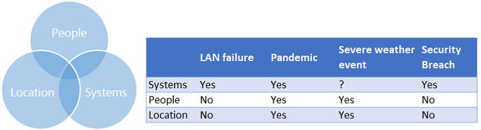

# Management van verantwoordelijkheden rondom bedrijfscontinuïteit voor klanten en cloudpartners

Het verkrijgen van Microsoft 365-cloudservices voor uw gebruikers verloopt als samenwerking tussen uw organisatie en Microsoft. Microsoft levert de services en u bent verantwoordelijk voor het verbinden van uw client-eindpunten, het beheren van identiteit en toegang en hoe de services worden gebruikt. Er zijn gedeelde verantwoordelijkheden, zoals ook de identiteit en directory-infrastructuur. In dit artikel worden enkele belangrijke items beschreven waar u op moet letten om uw bedrijf te laten functioneren in het geval van een service-incident en helpt het bij het stellen van verwachtingen over wat Microsoft zal doen tijdens een service-incident.

## Transparantie tijdens service-incidenten

Als betrouwbare partner bouwt Microsoft zeer veerkrachtige cloudservices en volgt het gestructureerde procedures om service-incidenten op te lossen wanneer ze zich voordoen. Wanneer zich een service-incident voordoet, erkent Microsoft dat **tijdige**, **gerichte** en **maximaal beschikbare** communicatie van cruciaal belang zijn voor klanten.

## Tijdsgebonden
Microsoft stelt Microsoft 365-beheerders op de hoogte door het tenant-specifieke dashboard voor servicestatus (SHD) in de Microsoft 365-beheerportal bij te werken. Updates van service-incidenten worden normaal gesproken per uur uitgegeven. Als een andere cadans nodig is, houden we u op de hoogte van de wijziging in de SHD-communicatieberichten.

## Gericht
In de meeste gevallen, wanneer onze bewakingssystemen een probleem detecteren, kunnen we het getroffen klantenbestand identificeren, van een enkele klant tot een regio of meer, en de benodige berichten naar die klanten sturen. Zo weet u wat belangrijk is voor uw bedrijf en wordt u niet afgeleidt door ruismeldingen die niet van belang zijn. Als er bijvoorbeeld een specifieke postvakdatabase wordt getroffen, kunnen we precies identificeren welke klanten gebruikers hebben op de getroffen infrastructuur en onze communicatie op hen afstemmen. Als de reikwijdte van de impact van het incident onduidelijk is, breiden we onze communicatie uit naar de breedste groep klanten die mogelijk worden beïnvloed.

## Maximaal beschikbaar
Microsoft onderhoudt meerdere kanalen voor communicatie over servicestatus die klanten kunnen gebruiken.

- In het geval dat het Beheercentrum of het dashboard voor de servicestatus in het Beheercentrum niet beschikbaar zijn, kunt u de status van de service controleren met behulp van de [back-upsite](https://status.office365.com/).
- We onderhouden een Twitter-account [@MSFT365Status](https://twitter.com/msft365status?lang=en), waar we reageren op meldingen en updates plaatsen over gebeurtenissen die effect hebben op het dashboard voor de servivestatus (SHD).
- Met de beheerders-app voor Microsoft 365-tenantbeheerders kunt u onderweg verbinding maken met de Microsoft 365-servicestatus van uw organisatie. Tenantbeheerders kunnen vanaf hun mobiele apparaten informatie over de service- en de onderhoudsstatus bekijken. Voor meer informatie gaat u naar [Veelgestelde vragen over de beheerders-app](https://docs.microsoft.com/office365/admin/admin-overview/admin-mobile-app?view=o365-worldwide).
- Met de [Microsoft 365 Service Communications API](https://docs.microsoft.com/office365/servicedescriptions/office-365-platform-service-description/service-health-and-continuity#office-365-service-communications-api) hebt u toegang tot servicecommunicatie, zodat u uw omgeving gemakkelijker kunt bewaken. U kunt verbinding maken met de API, realtime servicestatusgegevens ontvangen en de informatie publiceren op een intern dashboard, om zakelijke gebruikers te informeren over incidenten. Het intern verspreiden van de informatie kan uw helpdesk-verkeer tijdens een storing verminderen.
- Voor grote incidenten publiceert Microsoft Post Incident Reviews (PIR) naar de SHD in het Beheercentrum. PIR's bevatten belangrijke incidentinformatie om u te helpen de aard van de storing te begrijpen. Het bevat meestal de volgende secties:
    - gevolgen voor gebruikers
    - reikwijdte van de effecten
    - begin- en einddatum en -tijd van incident
    - hoofdoorzaak
    - acties uitgevoerd
    - volgende stappen
- Meer informatie is beschikbaar in het Microsoft 365 Berichtencentrum, zoals kennisgevingen over aanstaande wijzigingen, nieuwe functies of gepland onderhoud.
- Zie voor meer informatie de [Service Health and Continuity-handleiding](https://docs.microsoft.com/office365/servicedescriptions/office-365-platform-service-description/service-health-and-continuity) voor meer informatie over de verschillende communicatiekanalen en hoe u de servicestatus kunt controleren.
 
Toegang tot de online services van Microsoft 365 verloopt als partnerschap tussen uw organisatie en Microsoft. De volgende tabel geeft een overzicht van de verdeling van verantwoordelijkheid voor zowel Microsoft als de klant tijdens een service-incident en tijdens reguliere werkzaamheden.

## Uw omgeving en continuïteit van de service
Houd bij het nadenken over uw continuïteitsplan rekening met gebeurtenissen die van invloed kunnen zijn op uw organisatie en het algehele vermogen om te communiceren. Op hoog niveau zijn er drie factoren die van belang kunnen zijn voor uw bedrijf.

### Personen
Beschouw gebeurtenissen die gevolgen zouden hebben voor uw personeel, zoals een natuurramp of een pandemie. Dit wordt vaak over het hoofd gezien vanwege het onwaarschijnlijke karakter van een grootschalige impact als uw personeelsbestand wijd verspreid is. Maar als een groot percentage van het personeel offline zou zijn, zou uw bedrijf dan blijven bestaan? Hoe kan dit worden beperkt?

### Locatie
Veel organisaties vereisen dat werknemers zich op specifieke fysieke of netwerklocaties bevinden om verbinding te maken met bedrijfssystemen en cloudservices.  
Microsoft publiceert [basisprincipes voor netwerkverbindingen](https://docs.microsoft.com/office365/enterprise/office-365-network-connectivity-principles) die bedrijven begeleiden via aanbevolen procedures voor het instellen van netwerkverbindingen met cloudresources. Voorbeelden van optimalisering zijn het implementeren van VPN's met gesplitste tunnels om verbindingen rechtstreeks vanuit het netwerk van een gebruiker toe te staan in plaats van via een VPN-tunnel.  Hoewel deze verbindingsprincipes belangrijk zijn voor het onderhouden van verbindingen met een lage latentie, zijn voor een veerkrachtige service alternatieve methoden vereist om verbinding te maken met bedrijfsbronnen voor algemene samenwerking.

### Systemen
Veel samenwerkingsoplossingen zijn afhankelijk van systemen, zoals het bedrijfsbrede netwerk (WAN). Hoe zou uw organisatie reageren als die systemen niet beschikbaar zijn?
Deze afbeelding geeft problemen aan die van belang kunnen zijn voor meer dan één gebied. De bijbehorende tabel geeft voorbeelden

Bij uw continuïteitsplannen moet rekening worden gehouden met elk van deze gebieden. Bijvoorbeeld: als u wilt dat gebruikers zich op het bedrijfsnetwerk bevinden en er een sneeuwstorm is, hoe krijgen die gebruikers dan toegang tot belangrijke bronnen? Als de sneeuw het reizen naar kantoor verhindert en servicemonteurs verbinding moeten maken met het bedrijfsnetwerk, is er dan een beleid dat zij hun zakelijke laptops thuis ter beschikking moet hebben?
