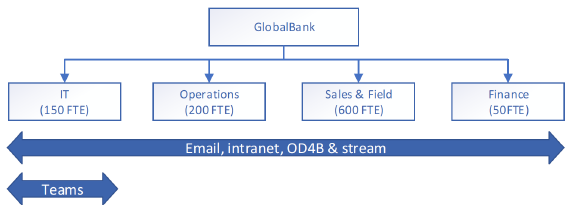

# Uw continuïteitsplan ontwikkelenDeveloping your continuity plan

In dit onderwerp vindt u richtlijnen voor het ontwikkelen van een bedrijfscontinuïteitsplan dat rekening houdt met Microsoft 365-afhankelijkheden.This topic provides guidance on developing a business continuity plan which takes Microsoft 365 dependencies into account. We raden hier methoden aan voor het analyseren van uw bedrijfsfuncties en het identificeren van de functies die afhankelijk zijn van Microsoft 365-services.Here we recommend methods for analyzing your business functions and identifying the ones which depend on Microsoft 365 services. U voert deze analyse uit met het oog op mogelijke servicefouten omdat u hierop voorbereid wilt zijn.You'll perform this analysis with the anticipation that there will be service failures and that you have to prepare for those possibilities.

Het plannen van bedrijfscontinuïteit omvat in het algemeen vier aspecten, namelijk beoordeling, planning, validatie van de mogelijkheden, en communicatie en coördinatie.Broadly speaking, business continuity planning involves four aspects, assessment, planning, capability validation, and communication and coordination.

## BeoordelingAssessment
Eerst moet u de bedrijfsfuncties van uw organisatie identificeren en nagaan door welke services en processen ze worden ondersteund.First you must identify the business functions in your org and the services and processes that support them. Dit omvat het uitvoeren van een analyse van de gevolgen voor het bedrijf, waarbij elke bedrijfsfunctie wordt gerangschikt op basis van hoe belangrijk deze is en u de processen en services identificeert waarvan de functies afhankelijk zijn.This includes completing a business impact analysis, where each business function is ranked according to how critical it is and you identify the processes and services that each one depends on. Hier ziet u een voorbeeldtabel die u kunt raadplegen om aan de slag te gaan met uw eigen beoordeling.Here's a sample table you can refer to help you get started with your own assessment.

**Voorbeeld van effectbeoordeling****Sample Business Impact Assessment (BIA)**

Dit is een effectbeoordelingsdocument voor `name of the service, system, process, or function`This is a BIA document for `name of the service, system, process, or function`

|Velden van effectbeoordelingBIA fields|BeschrijvingDescription|
|---------|---------|
|Type effectbeoordelingBIA type|`is it a business process or technology, service or system?`|
|Naam effectbeoordelingBIA name|`name of the service/system/function/process`|
|Servicebeschrijvingservice description|`give a full description of the service, process, or function`|
|Bedrijfsfunctieenterprise function|`some examples: customer services; legal; marketing; risk management, security, sales, information technology, production, manufacturing`|
|Fiscaal jaarfiscal year|`the current fiscal year, re-evaluate these on a regular basis`|
|Ernstcriticality|`develop your own classifications, but here are some examples: mission critical, important, deferrable`|
|Bedrijfseenheidbusiness unit|`name of the business unit that owns this business function`|
|Proces (service, functie)process (service, feature)|`the name of the process, service, or feature`|
|Hoofdleidinggevende bedrijfsgroepbusiness group senior leader|`the name and contact information of the senior leader of the business group that owns this business process`|
|Heeft de technologie een tot stand gebrachte **interne** SLA of OLA?Does the technology have an established **internal** SLA or OLA?|`please explain in as much detail as possible`|
|Heeft de technologie een tot stand gebrachte **externe** SLA of OLA?Does the technology have an established **external** SLA or OLA?|`please explain in as much detail as possible`|
|Heeft de technologie een bekend uitvoeringsmandaat om een specifieke proces-SLA mogelijk te maken?Does the technology have a known executive mandate driving a specific process SLA? Zo ja, beschrijf dit in detail.If yes, explain in detail.|`details here`|
|Leidt het verlies van of de inbreuk op gegevens die zijn gekoppeld aan deze services, tot een belangrijke gebeurtenis?Will the loss or compromise of the data associated with this services trigger a major event? Zo ja, beschrijf dit in detail.If yes, explain in detail.|`details here`|
|Is er een tijdelijke oplossing of alternatief voor de service voor enkele of alle belangrijke functies van de service?Does the service have a workaround or alternative in place for some or all of its key functions and features? Zo ja, beschrijf dit in detail.If yes, explain in detail.|`details here`|
|Worden er met het de service klantgegevens verwerkt, opgeslagen of verzonden, zoals bijvoorbeeld persoonsgegevens?Does the service process, store, or transmit customer data, such as personally identifiable information (PII)? Zo ja, beschrijf dit in detail.If yes, explain in detail.|`details here`|
|Status effectbeoordelingBIA status|`develop your own status classification, here are some examples: planned, started, in-progress, complete, on-hold, expired`|
|Voltooiingsdatumcompletion date|`the date this BIA was completed`|
|Facilitator effectbeoordelingBIA facilitator|`name of the person or group who is responsible for developing and maintaining this BIA`|
|Goedkeuring effectbeoordelingBIA approval|`name of the person or group who is the executive sponsor of this BIA and who has responsibility for approving it.`|
|Bijdragerscontributors|`optional list of the people who helped develop this BIA and their contact information`|
|Locatie goedkeuring effectbeoordelingBIA approval location|`indicate where the executive approval is located, or attach proof to this document`|

## PlanningPlanning

Vervolgens zoekt u in de bedrijfsprocessen waar trapsgewijze afhankelijkheidsrelaties bestaan.Next, you look across business processes to see where any cascading dependency relationships exist. Op basis van het resultaat kunt u prioriteiten stellen, en tolerantiestrategieën en ondersteunende standaardbedrijfsprocedures bedenken.Based on the outcome, you prioritize and form resiliency strategies, and standard operating procedures supporting your strategies.

U kunt [Microsoft Service Map](https://docs.microsoft.com/azure/azure-monitor/insights/service-map) gebruiken om u bij deze toewijzing te helpen.You can use [Microsoft Service Map](https://docs.microsoft.com/azure/azure-monitor/insights/service-map) to help you in with this mapping. Met Microsoft Service Map worden automatisch toepassingsonderdelen van Windows- en Linux-systemen gedetecteerd en worden alle TCP-afhankelijkheden toegewezen, worden verbindingen geïdentificeerd en wordt bepaald van welke externe systemen de app afhankelijk is.Microsoft Service Map automatically discovers application components on Windows and Linux systems and maps all TCP dependencies, identifies connections,  and remote third-party systems that the app depends on. Ook worden hiermee afhankelijkheden toegewezen aan gebieden van uw netwerk die traditioneel donker zijn, zoals Active Directory.It also maps dependencies to areas of your network that are traditionally dark, such as Active Directory.

Hier ziet u een voorbeeld van een afhankelijkheidsanalyse die u als beginpunt kunt gebruiken.Here's a sample dependency analysis (DA) you can start from. In de afhankelijkheidsanalyse identificeert en onderzoekt u de procesafhankelijkheden.In your dependency analysis (DA), you will identify and examine the process dependencies. Zorg ervoor dat u personen, leveranciers, klanten, partnerschappen en faciliteiten opneemt.Make sure you include people, suppliers, customers, partnerships and facilities. De gegevens van deze analyse worden gebruikt om hiaten te identificeren tussen de herstelvereisten van een proces en de herstelmogelijkheden voor het ondersteunen van afhankelijkheden.The data from this analysis will be used to identify gaps between the recovery requirements of a process and the recovery capabilities of supporting dependencies.

|veldfield|beschrijvingdescription|
|---------|---------|
|procestypeprocess type|         |
|facilitatorfacilitator|         |
|voltooid doorcompleted by|         |
|voltooiingsdatumcompleted date|         |
|bijdragerscontributors|         |
  
## Validatie van mogelijkhedenCapability validation

Wanneer u uw bedrijfsprocessen hebt geïnventariseerd en relaties met andere processen en technologieën in kaart hebt gebracht, moet u validatiescenario's voor alle processen maken.Once you have inventoried your business processes and mapped out relationships to other process and technologies, you need to build validation scenarios for all the processes. U gaat in feite na hoe u uw plannen voor de bedrijfscontinuïteit gaat valideren.Basically, figure out how you are going to validate your business process continuity plans. U zult waarschijnlijk merken dat sommige belangrijker zijn dan andere en dat u aan de belangrijke prioriteit wilt geven.You'll probably find that some are more important that others and you'll want to prioritize those.
Vergeet niet dat het belangrijk is regelmatig werknemers te trainen hoe ze op incidenten moeten reageren en wat de maatregelen voor het behoud van de continuïteit zijn zodra het plan is opgesteld.Don't forget that regularly training employees on incident response and continuity measures is important once the plan is established. Gebruik evaluaties van incidenten achteraf om uw tolerantiestrategieën te verbeteren met wat u van elke validatie of test hebt geleerd.Post incident reviews should be used to enhance your resiliency strategies by incorporating learnings from each validation or test.

## Coördinatie en communicatie bij incidentenIncident coordination and communication

In het geval van een service-incident kan het voorkomen dat normale communicatiekanalen worden beïnvloed of gedegradeerd. Daarom moet u vooraf alternatieven bedenken om uw organisatie verbonden te houden tijdens het incident.During a service incident, normal communications channels may be impacted or degraded, so you should pre-arrange alternatives to help your organization stay connected during an incident. Het is van essentieel belang dat de communicatiekanalen tot stand worden gebracht en worden getest op beveiliging en compliance en dat gebruikers voor hun gebruik zijn getraind voordat er storingen optreden.It is critical that the communication channels be established, vetted for security and compliance, and users trained on their use prior to a disruption. Een failover van een bekende status naar een andere bekende status heeft veruit de voorkeur voor gebruikers in plaats van midden in een crisis met ad-hoc-oplossingen te komen waarmee werknemers niet vertrouwd zijn.Failing from a known state to another known state is far preferable to users coming up with ad-hoc, unknown solutions in the middle of a crisis.

Bij Microsoft heeft elk serviceteam interne alternatieve communicatiekanalen ingesteld om ons te helpen bij het coördineren wanneer onze normale communicatiekanalen niet beschikbaar zijn.At Microsoft, each service team has established internal alternative communication channels to help us coordinate when our normal communications channels aren’t available. Dit zijn onder meer back-upoplossingen voor telefonie en audiovergaderingen, Yammer-groepen, Teams-groepen, interne servicestatusdashboards en interne software voor incidentenbeheer.These include backup telephony and audio-conferencing solutions, Yammer groups, Teams groups, internal Service Health Dashboards, and internal Incident Management software.

Bij het analyseren van de gevolgen voor het bedrijf en de afhankelijkheden wijst u kritieke processen en de technologieën of services waarvan ze afhankelijk zijn toe.During your Business Impact Analysis and Dependency Analysis, you will be mapping critical processes and the technologies or services they depend on. Let met name op de communicatie tijdens deze planningsfase en bedenk alternatieven.Pay special attention to communication during this phase of planning and think of alternatives. Dit zijn enkele voorbeelden.Here are some examples.

- Als e-mail de belangrijkste methode is om uw gebruikers en belanghebbenden op de hoogte te houden, en uw e-mailservice is verslechterd of niet beschikbaar is, kunt u een andere service, zoals Microsoft Teams, Yammer of een andere service van derden, als back-up gebruiken.If email is your primary method of keeping your users and stakeholders informed, and your email service is degraded or unavailable, you can use another service such as Microsoft Teams, Yammer, or another 3rd-party service as a backup. Het is belangrijk dat u deze vooraf instelt en uw gebruikers traint waar ze naartoe moeten gaan.The key is to establish these beforehand and train your users on where to go. Een Yammer-thread is niet handig als er niemand bekend is met het bestaan of als niemand er een bladwijzer voor heeft ingesteld.A Yammer thread isn’t going to be useful if no one knows it exists or if no one has it bookmarked.  
- Als uw interne processen voor het beheren van incidenten zijn gebaseerd op spraakcommunicatie om uw antwoorden te coördineren, moet u een alternatieve telefonieoplossing voor gebruik tijdens een crisis kiezen.If your internal Incident Management processes rely on voice communications to coordinate your responses, establish an alternative telephony solution for use during a crisis. Deze oplossing hoeft geen volledige pariteit te hebben met uw primaire service, maar moet het minimale samenwerkingsniveau bieden om uw teams voor bedrijfscontinuïteit en incidentenbeheer te coördineren.This solution doesn’t need to have full parity with your primary service but should provide the minimum level of collaboration to coordinate your Business Continuity and Incident Management teams. Verder kunt u gebruikers vragen hun mobiele telefoonnummer in uw algemene adreslijst te publiceren om een extra laag met back-upcommunicatie voor extreme situaties te maken.Additionally, asking users to publish their mobile phone numbers in your Global Address List can provide an additional layer of backup communication in extreme cases.
- Mogelijk wilt u een aangepast servicestatusdashboard, of een andere dergelijke site, maken om statusupdates tijdens een incident te leveren.You may want to create a custom service health dashboard, or other such site, which can provide status updates during an incident. Als u gebruikers vooraf traint waar ze heen moeten gaan voor informatie, zal dit onnodige vragen aan de helpdesk beperken en zullen gebruikers er vertrouwen in hebben dat de situatie snel en efficiënt wordt afgehandeld.Training users where to go for information beforehand will help reduce unnecessary calls to help desk and instill confidence in your user base that the situation is being handled quickly and efficiently. Gebruik de O365 Service Communications-API om dit te koppelen aan M365 voor een nog betere zichtbaarheid.Use the O365 Service Communications API to tie this into M365 for an even greater level of visibility.  
- Het is essentieel dat de locatie van uw bedrijfscontinuïteitsplannen en standaardbedrijfsprocedures bekend is.It is critical that the location of your Business Continuity Plans and Standard Operating Procedures is well known. U wordt aangeraden online- en offlinekopieën van kritieke documentatie te bewaren, zoals met SharePoint Online of OneDrive voor Bedrijven waarmee automatisch wordt gesynchroniseerd naar lokale apparaten.We recommend maintaining online and offline copies of critical documentation, such as with SharePoint Online or OneDrive for Business configured for automatic sync to local devices. Voor operationele centra voor services/netwerken en andere soortgelijke teams die voor herstel absoluut essentieel zijn, wilt u mogelijk ook papieren kopieën hebben die in noodgevallen kunnen worden gebruikt.For Service/Network Operations Centers and other similar teams that will be absolutely critical for recovery, you may also want to keep hard copies available to be used in the event of an emergency.

## De externe integratiepunten kennenKnow your external points of integration

Ongeacht het bedrijfsmodel heeft elk bedrijf integratiepunten met hun klanten, partners en leveranciers.Regardless of business model, every company has points of integration with their customers, partners and vendors. De toeleveringsketen voor de bedrijfswaarde is gebaseerd op integratie met externe entiteiten.The business value supply chain is built on integration with external entities. Bij het verbeteren van de bedrijfscontinuïteit bij servicestoringen moeten alle integratiepunten worden bekeken en beveiligd.Improving business continuity in the event of service disruption requires consideration – and protection – of each point of integration.  
Als u uw toeleveringsketen analyseert, moet externe communicatie op dezelfde manier als interne communicatie worden geanalyseerd.As you analyze your supply chain, external communications should be considered in the same way internal communications are analyzed. Zijn uw klanten afhankelijk van uw Exchange Online-servers als de enige manier om contact met u op te nemen?Do your customers rely on your Exchange Online servers as the only method of contacting you? Hebt u bij uptime-onderbrekingen alternatieve communicatiemethoden beschikbaar en hebt u uw leveranciers hiervan op de hoogte gesteld?Have you established and made your suppliers aware of alternative communication methods, in the event uptime is impacted? Hier ziet u een voorbeeld van een tabel waarin u kunt zien hoe u uw gedachten kunt organiseren.Here's a sample table that suggests how to organize your thinking.

|naam van externe entiteitexternal entity name|scenario gevolgen incidentimpacting incident scenario|geïntegreerde Microsoft 365-servicesMicrosoft 365 services integrated|alternatievenalternatives|
|---------|---------|---------|---------|
|`vendor name`|e-mailstroommail flow|Exchange Online is het enige communicatiemiddel met ContosoExchange Online is the only means of communication with Contoso|externe Microsoft Teams-kanalen of samenwerkingssoftware van derden instellenset up external Microsoft Teams channels or a third-party collaboration software          |
|`service supplier name`|chattenchat|Microsoft TeamsMicrosoft Teams|chatberichten van derdenthird party instant messaging|
|`partner name`|spraakvoice|Microsoft TeamsMicrosoft Teams|mobiele of openbare PSTNmobile or public pstn      |
|`supplier name`|bestandsdelingfile sharing|extern gedeelde SharePoint-sites en OneDriveexternally shared SharePoint sites and OneDrive|bestandsdeling van derdenthird party file sharing         |
