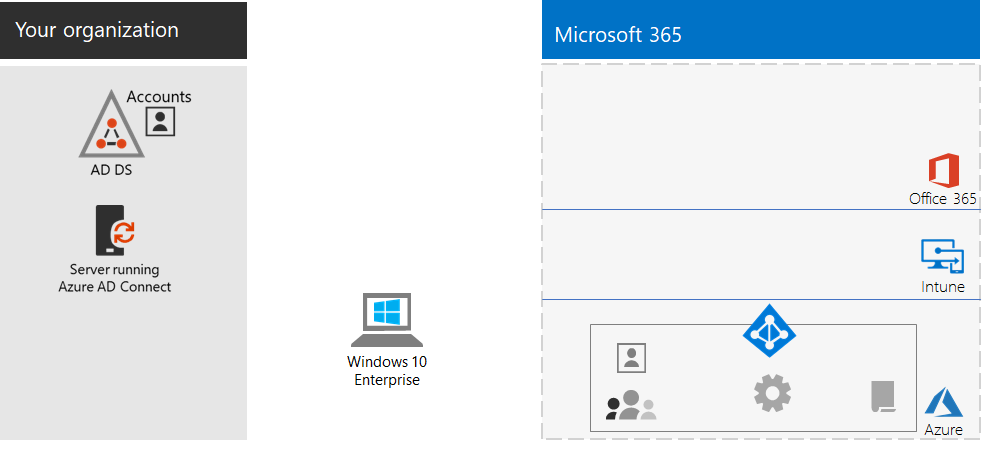
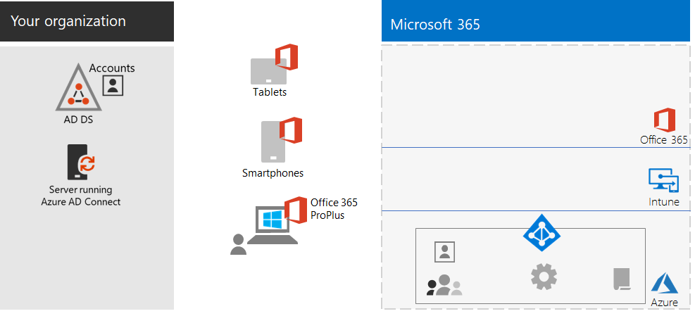
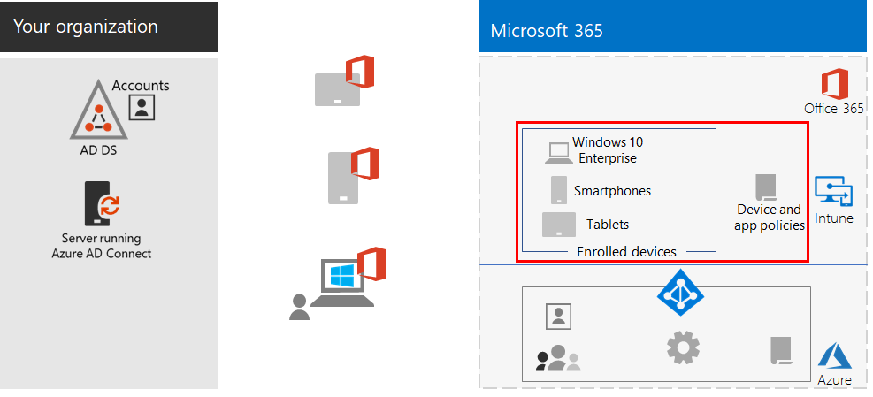
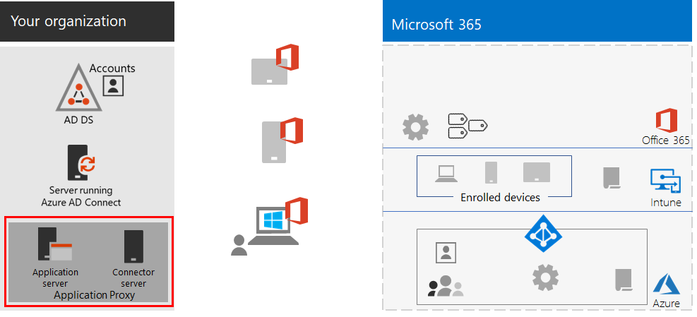
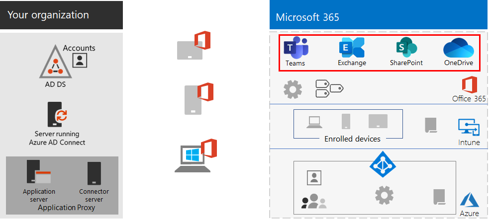
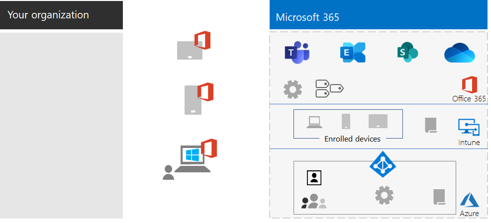

# Externe werknemers mogelijkheden bieden

*Dit scenario geldt voor zowel E3- als E5-versies van Microsoft 365 Enterprise*

Het is voor veel organisaties belangrijk dat werknemers naadloos en veilig buiten het kantoor kunnen werken om kantoorruimte te besparen, werknemers in dienst te nemen en te behouden die niet willen verhuizen en het woon-werkverkeer van werknemers te verminderen, zodat ze meer tijd hebben om productief te zijn en voor activiteiten buiten het werk die stress verlagen.

Onder extern werken, ook wel telewerken wordt genoemd, valt het volgende:

- Werknemers die af en toe niet op kantoor zijn vanwege conferenties of vergaderingen met klanten.
- Bepaalde werknemers die fulltime extern werken.
- Een volledig externe organisatie die geen kantoor heeft en waarvan alle werknemers extern werken.

Ter ondersteuning van externe medewerkers is er een combinatie van functies beschikbaar in Microsoft 365 Enterprise waarmee ze heel goed kunnen samenwerken, zoals:

- Onlinevergaderingen en chatsessies.
- Gedeelde werkruimten voor cloudopslag met wereldwijde toegankelijkheid en realtime samenwerking.
- Gedeelde taken en werkstromen om het werk te verdelen en taken uit te voeren.

Voor een krachtige beveiliging bevat Microsoft 365 Enterprise het volgende:

- Afgedwongen verificatievereisten, aanmeldingen met een hoog risico detecteren en hierop reageren en geselecteerde apps en niet-compatibele apparaten blokkeren.
- Versleutelde verbindingen en digitale hulpmiddelen in de cloud.
- Machtigingen om te definiëren wie wat mag doen met bestanden.
- Preventie van gegevensverlies (DLP) om lekkage van sterk gereglementeerde gegevens te voorkomen.

Als u aan deze criteria voor externe werknemers wilt voldoen, gebruikt u de volgende functies van Microsoft 365 Enterprise:

- Gebruikersidentiteit en aanmeldingsbeveiliging
  - Azure Active Directory-gebruikersaccounts (Azure AD) met meervoudige verificatie (MFA)
  - Beleid voor voorwaardelijke toegang om MFA te vereisen voor risicovolle aanmeldingen
- Samenwerkingsplatforms
  - Microsoft Teams, SharePoint en OneDrive, waarmee externe werknemers online videovergaderingen kunnen plannen en bijwonen en tegelijk aan dezelfde documenten kunnen werken
- Veilige toegang tot bronnen
  - Groepen en machtigingen voor Teams, SharePoint-sites en OneDrive, zodat alleen geverifieerde, gemachtigde gebruikers toegang hebben
- Bescherming voor gelekte bestanden
  - DLP-beleid
  - Gevoeligheidslabels voor versleuteling en machtigingen die met bestanden worden verzonden.
- Apparaatbeheer en -beveiliging met Microsoft Intune
  - Inschrijving voor beheerde apparaten
  - App-instellingen voor persoonlijke apparaten
  - Beleid voor apparaten en apps
- Productiviteits-apps voor apparaten
  - Microsoft 365-apps voor ondernemingenvoor samenwerking via Teams, SharePoint en OneDrive 
- Windows 10 Enterprise
  - Uitgebreide beveiligingsfuncties ter bescherming tegen cyberaanvallen en ter voorkoming van het lekken van gegevens
- Toegang tot on-premises apps
  - Organisaties met een hybride identiteit kunnen de Azure Active Directory-toepassingsproxy gebruiken in plaats van VPN-verbindingen (Virtual Private Network).

In de volgende fasen wordt u stapsgewijs begeleid bij de implementatie van de functie van Microsoft 365 Enterprise voor externe toegang, waarmee ingebruikname wordt bevorderd voor externe werknemers. Als u al elementen van deze fasen hebt geïmplementeerd, zorgt u er dan voor dat deze voldoen aan de vermelde vereisten voordat u doorgaat naar het volgende element.

 Zie de [Poster Externe werknemers mogelijkheden bieden](../media/empower-people-to-work-remotely/empower-remote-workers-scenario.pdf) voor een overzicht van één pagina van dit scenario.

U kunt deze poster ook downloaden in [PDF-](https://github.com/MicrosoftDocs/microsoft-365-docs/raw/public/microsoft-365/media/empower-people-to-work-remotely/empower-remote-workers-scenario.pdf) of [PowerPoint-](https://github.com/MicrosoftDocs/microsoft-365-docs/raw/public/microsoft-365/media/empower-people-to-work-remotely/Empower-Remote-Workers-Poster.pptx) indeling en deze afdrukken op papier met formaat Letter, Legal of Tabloid (27,9 x 43,2 cm).

## Fase 1: De functies en mogelijkheden van Microsoft 365 implementeren voor externe werknemers

Vanwege de omvang en het grote aantal van de vereiste functies en mogelijkheden voor dit scenario, wordt u stapsgewijs door de vereiste elementen van de basisinfrastructuur en werklastsecties van de [Implementatiehandleiding voor Microsoft 365 Enterprise](deploy-microsoft-365-enterprise.md) begeleid.

### Stap 1: vereisten voor de basisinfrastructuur voor externe werknemers

In deze stap gaat u naar de fasen van de [basisinfrastructuur](deploy-foundation-infrastructure.md) en worden de elementen weergegeven die nodig zijn om werknemers extern te laten werken.

Voor [Fase 2: Identiteit](identity-infrastructure.md) kunt u het volgende implementeren voor gebruikersidentiteit en aanmeldingsbeveiliging:

- Voor hybride identiteit: gebruikersaccounts en groepen die zijn gesynchroniseerd vanuit on-premises Active Directory Domain Services (AD DS).
- Voor het toewijzen van machtigingen: gesynchroniseerde groepen of Azure Active Directory-groepen met de juiste leden.
- Verificatie-instellingen, zoals het vereisen van MFA.
- Beleid voor voorwaardelijke toegang om MFA te vereisen voor risicovolle aanmeldingen en clients te blokkeren die geen moderne verificatie ondersteunen.

Hier ziet u de resulterende configuratie waarin de identiteitselementen zijn gemarkeerd.

 
Voor [Fase 3 - Windows 10 Enterprise](windows10-infrastructure.md):

- Implementeer de infrastructuur voor het implementeren van nieuwe apparaten met Windows 10 Enterprise en om uw Windows 7- of Windows 8.1-apparaten te upgraden naar Windows 10 Enterprise
- Schakel uitgebreide beveiligingsfuncties in voor identiteits-, bedreigings-en gegevensbeveiliging

Dit is de resulterende configuratie met Windows 10 Enterprise-apparaten.

 
Voor [Fase 4: Microsoft 365-apps voor ondernemingen](office365proplus-infrastructure.md) kunt u de infrastructuur implementeren om Microsoft 365-apps voor ondernemingen te installeren of de geïnstalleerde Office-suite, zoals Office 2010 of Office 2013, upgraden naar Microsoft 365-apps voor ondernemingen op apparaten binnen uw organisatie. Hiermee krijgen uw gebruikers de beste beveiligings- en samenwerkingsfunctionaliteit.

Hier ziet u de resulterende configuratie met Microsoft 365-apps voor ondernemingen geïnstalleerd op apparaten.

 
Voor [Fase 5: Mobile Device Management](mobility-infrastructure.md) implementeert u apparaat- en app-beheer van Intune voor:

- Inschrijving van uw Windows 10 Enterprise-, iOS-, Mac-, Android-en Android Enterprise-apparaten, zodat ze functies en beveiligingsinstellingen ontvangen die door uw organisatie zijn gedefinieerd.
- App-instellingen voor extra beveiliging en om apps toe te staan of te blokkeren, zelfs op persoonlijke apparaten van werknemers.
- Nalevingsbeleid met Voorwaardelijke toegang om te voorkomen dat niet-compatibele apparaten verbinding maken.

Dit is de resulterende configuratie, waarin apparaten die zijn ingeschreven bij Intune, en de beleidsregels zijn gemarkeerd.

 
Voor [Fase 6: Gegevensbeveiliging](infoprotect-infrastructure.md), ontwerpt en configureert u beveiliging voor uw digitale hulpmiddelen met:

- DLP-beleid.
- Gevoeligheidslabels in Microsoft 365 voor versleuteling en machtigingen die met bestanden worden verzonden.

Dit is de resulterende configuratie, waarin DLP-beleid en gevoeligheidslabels zijn gemarkeerd.

 
Voor toegang tot on-premises apps kunt u de [Azure Active Directory-toepassingsproxy](https://docs.microsoft.com/azure/active-directory/manage-apps/application-proxy) gebruiken, waarvoor een hybride identiteitsomgeving is vereist.

Hier ziet u de resulterende configuratie waarin de onderdelen van de toepassingsproxy zijn gemarkeerd.

 
### Stap 2: werkbelastingen voor externe werknemers

Voor [Exchange Online](exchangeonline-workload.md) implementeert u Exchange Online-postvakken voor al uw gebruikers.

Voor [Teams](teams-workload.md) implementeert u Teams voor uw gebruikers en groepen.

Voor [SharePoint en OneDrive](sharepoint-online-onedrive-workload.md) implementeert u SharePoint-teamsites -communicatiesites en OneDrive-mappen.

Hier ziet u de resulterende configuratie waarin de werkbelastingen zijn gemarkeerd.

 
### Implementatieresultaten

Na de implementatie van de basisinfrastructuur en werkbelastingen en de installatie van Windows 10 Enterprise en Microsoft 365-apps voor ondernemingen, geldt het volgende voor externe werknemers:

- Ze beschikken over sterke verificatie- en identiteitsbescherming.
- Ze hebben de nieuwste en veiligste versie van Windows op hun Windows-apparaat.
- Ze hebben de recentste en productiefste versie van de Office-suite op hun apparaten.
- Ze moeten zich houden aan nalevingsbeleid voor app-beheer en apparaten.
- Ze moeten zich houden aan DLP-beleid en -beperkingen.
- Ze kunnen gevoeligheidslabels voor versleuteling en machtigingen die met bestanden en e-mailberichten worden verzonden, toewijzen.
- Ze hebben toegang tot on-premises apps zonder een VPN-verbinding.
- Ze kunnen hun eigen werk uitvoeren en in realtime samenwerken met collega's via chats, vergaderingen en bestanden in Teams en in SharePoint en OneDrive.

Wanneer de externe werknemers offline zijn (niet verbonden met internet), kunnen ze lokale kopieën van bestanden wijzigen. Wanneer ze weer verbinding maken met internet, worden in OneDrive lokale kopieën gesynchroniseerd met de bestanden die zijn opgeslagen in uw Microsoft 365-abonnement. 

Dit is de resulterende configuratie voor externe werknemers van uw organisatie als u de hybride identiteit gebruikt.

 
 
Dit is de resulterende configuratie voor externe werknemers van uw organisatie als u alleen de cloudidentiteit gebruikt.

## Fase 2: Ingebruikname door externe werknemers bevorderen

Nu de basisinfrastructuur en de werkbelastingen zijn geïmplementeerd, gaat u ervoor zorgen dat uw externe werknemers deze kunnen gebruiken, zodat ze altijd en overal productief kunnen zijn.

### Stap 1: uw gebruikers trainen

Geef uw externe werknemers training in:

- De juiste aanmeldingsprocedures, waaronder MFA-registratie, en hoe aanmeldingen kunnen worden tegengehouden als een risico wordt gedetecteerd.
- Het gebruik van apparaten en hoe beleid kan worden gebruikt om toegang te blokkeren voor niet-compatibele apparaten.
- Het gebruik van toegestane apps en hoe app-beleid van Intune kan worden gebruikt om apps te blokkeren.
- Beveiligingsfuncties van Windows 10 Enterprise.
- Het gebruik van Outlook voor e-mail en agenda.
- Het gebruik van [Teams](https://docs.microsoft.com/microsoftteams/training-microsoft-teams-landing-page) voor chatten, videovergaderingen, het delen van documenten en gesprekslijnen.
- Het gebruik van SharePoint-teamsites of -communicatiesites en OneDrive-mappen om door bestanden in de bibliotheek van een gebruiker of een groep te bladeren.
- Het gebruik en de toepassing van gevoeligheidslabels voor bestanden met gevoelige of sterk gereglementeerde gegevens voor zowel lokale als onlineversies van bestanden.

Bij deze training horen praktijkoefeningen, zodat de gebruikers deze functies en de resultaten ervan kunnen ervaren.

### Stap 2: periodiek het gebruik bekijken en feedback van werknemers verwerken

In de weken na de training:

- Verwerk de feedback van externe werknemers snel en verfijn beleidsregels en configuraties.
- Analyseer het gebruik voor teams, SharePoint-sites en OneDrive-mappen en vergelijk dit met de gebruiksverwachtingen.
- Controleer of gevoelige of sterk gereglementeerde bestanden juist zijn gelabeld met het relevante gevoeligheidslabel.

School de gebruikers indien nodig bij.

### Resultaten van gebruikersacceptatie

Uw externe werknemers kunnen met hun Windows 10 Enterprise-apparaten of andere apparaten en Microsoft 365-apps voor ondernemingen in een beveiligde omgeving toegang krijgen tot en werken met gedeelde cloudservices en bronnen van Microsoft 365 Enterprise, waarbij ze in realtime vergaderen, creëren en samenwerken.

## Aanvullende Microsoft-functies om externe werknemers te ondersteunen

U kunt [Punt-naar-site-VPN-verbindingen van Azure](https://docs.microsoft.com/azure/vpn-gateway/point-to-site-about) gebruiken om externe werknemers te verbinden met servers in een virtueel Azure-netwerk.

U kunt [Windows Virtual Desktop](https://docs.microsoft.com/azure/virtual-desktop/overview) gebruiken voor desktop- en appvirtualisaties die worden gehost door Azure.

## Zie ook

[Werkbelastingen en scenario's](deploy-workloads.md)

[Microsoft 365 Productivity Library](https://aka.ms/productivitylibrary) (https://aka.ms/productivitylibrary)

[Implementatiehandleiding](deploy-microsoft-365-enterprise.md)
