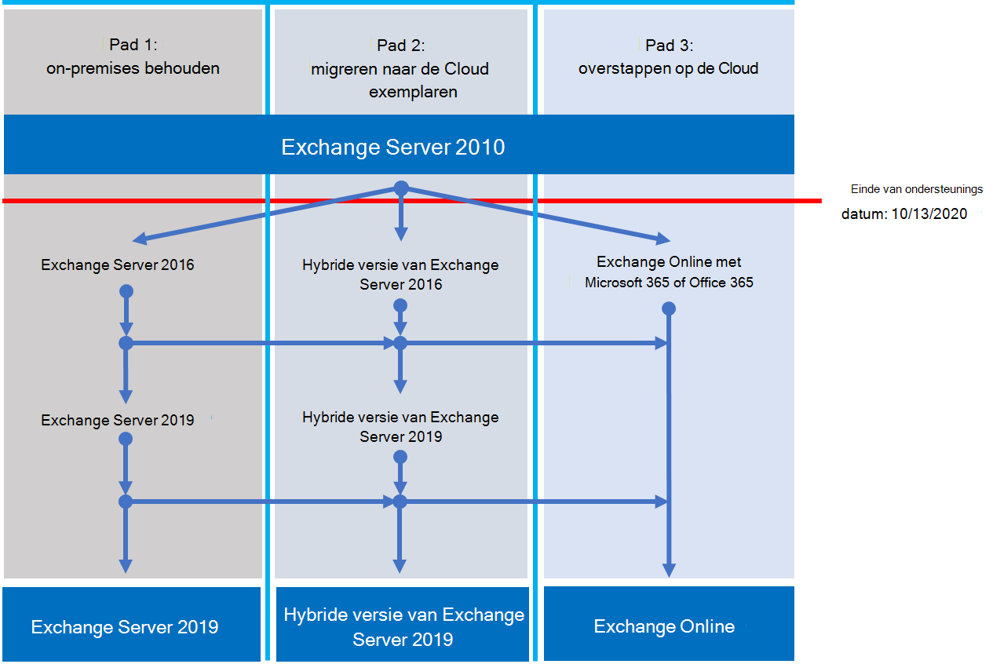

# Einde van ondersteunings schema van Exchange 2010

*Dit artikel is van toepassing op Microsoft 365 Enterprise en Office 365 Enterprise.*

Op **13 oktober 2020**zal Exchange Server 2010 de ondersteuning voor het einde van de ondersteuning bereiken. Als u de migratie van Exchange 2010 naar Microsoft 365, Office 365 of Exchange 2016 nog niet hebt gedaan, kunt u het beste eerst de planning starten.

## Wat betekent einde van ondersteuning?

De Exchange-Server, zoals bijna alle Microsoft-producten, heeft een ondersteuningscyclus waarbij nieuwe functies, foutoplossingen, beveiligingsfixes en dergelijke worden geboden. Deze levenscyclus duurt doorgaans tien jaar vanaf de datum van de eerste release van het product, en het einde van de levenscyclus bekend is als het einde van de ondersteuning van de producten. Wanneer Exchange 2010 na 13 oktober 2020 een einde van de ondersteuning bereikt, biedt Microsoft niet langer:

- Technische ondersteuning voor problemen die kunnen optreden.
- Oplossingen voor ontdekte problemen die gevolgen kunnen hebben voor de stabiliteit en bruikbaarheid van de server.
- Beveiligingscorrecties voor ontdekte beveiligingsproblemen die de server kwetsbaar kunnen maken voor beveiligingsproblemen.
- Tijdzone-updates.

De installatie van Exchange 2010 blijft na deze datum actief. Vanwege de bovenstaande wijzigingen is het echter raadzaam om te migreren vanaf Exchange 2010, zo snel mogelijk.

Zie [bronnen om u te helpen bij het upgraden van office 2010-servers en-clients](upgrade-from-office-2010-servers-and-products.md)voor meer informatie over Office 2010-servers die binnenkort niet meer worden ondersteund.

## Wat zijn mijn mogelijkheden?

Met Exchange 2010 het einde van de ondersteuning bereiken, is dit een prima moment om uw opties te verkennen en een migratieplan voor te bereiden. U kunt:

- Volledig migreren naar Microsoft 365. Postvakken migreren met behulp van cutover, minimale hybride of volledige hybride migratie en vervolgens on-premises Exchange-servers en Active Directory verwijderen.
- Migreer uw Exchange 2010-servers naar Exchange 2016 op uw on-premises servers.

> [!IMPORTANT]
> Als uw organisatie van plan is om uw postvakken te migreren naar Microsoft 365, maar u wilt dat de gebruikersaccounts van de on-premises Active Directory blijven beheren, moet u ten minste één Exchange Server on-premises bewaren. Als de laatste Exchange-Server is verwijderd, kunt u geen wijzigingen aanbrengen in Exchange-geadresseerden in Exchange Online. Dit komt doordat de bron van de autoriteit in uw on-premises Active Directory blijft staan en de wijzigingen daar moeten worden aangebracht. In dit scenario hebt u de volgende opties:

- (**Aanbevolen**) Als u uw postvakken kunt migreren naar Microsoft 365 en uw servers upgraden naar Microsoft 13 oktober 2020, kunt u Exchange 2010 gebruiken om verbinding te maken met Microsoft 365 en postvakken te migreren. Migreer daarna Exchange 2010 naar Exchange 2016 en Ontmantel alle overige Exchange 2010-servers.
- Als u de migratie van postvakken en on-premises servers niet kunt voltooien vóór 13 oktober 2020, voert u eerst een upgrade van uw on-premises Exchange 2010-servers uit naar Exchange 2016 en vervolgens gebruikt u Exchange 2016 om verbinding te maken met Microsoft 365 en postvakken te migreren.

> [!NOTE]
> U kunt ook met een beetje ingewikkelder postvakken migreren naar Microsoft 365 terwijl u uw on-premises Exchange 2010-servers migreert naar Exchange 2016.

Dit zijn de drie paden die u kunt nemen om te voorkomen dat de ondersteuning voor Exchange Server 2010 wordt beëindigd.

In de volgende secties wordt elke optie uitvoerig besproken.

## Migreren naar Microsoft 365

Het migreren van e-mail naar Microsoft 365 is de beste en eenvoudigste optie om u te helpen bij het buiten gebruik stellen van uw implementatie van Exchange 2010. Met een migratie naar Microsoft 365 kunt u één hop maken van de oude technologie naar de functies van de geavanceerde functies, zoals:

- Nalevings mogelijkheden zoals bewaarbeleid, in-place bewaring en het bewaren van in-place eDiscovery en meer.
- Microsoft Teams
- Power BI
- Postvak in met prioriteit
- MyAnalytics

Microsoft 365 krijgt ook nieuwe functies en ervaring, en u en uw gebruikers kunnen ze direct gebruiken. Naast de nieuwe functies hoeft u zich geen zorgen te maken over het volgende:

- Kopen en onderhouden van hardware.
- Betaalt voor verwarming en koeling van uw servers.
- Up-to-date houden van oplossingen voor beveiliging, producten en tijdzone
- Opslag en software onderhouden ter ondersteuning van nalevingsvereisten
- Upgraden naar een nieuwe versie van Exchange-u bevindt zich altijd in de nieuwste versie van Exchange in Microsoft 365.

### Hoe moet ik migreren naar Microsoft 365?

Afhankelijk van uw organisatie hebt u een paar opties voor de ondersteuning van Microsoft 365. Als u een migratieoptie kiest, moet u een paar dingen doen, zoals het aantal seats of postvakken dat u wilt verplaatsen, hoe lang u de migratie wilt uitvoeren en of u een naadloze integratie nodig hebt tussen uw on-premises installatie en Microsoft 365 tijdens de migratie. In deze tabel worden de migratie opties en de belangrijkste factoren weergegeven om te bepalen welke methode u wilt gebruiken.

|Migratieoptie|Organisatie formaat|Peri|
|---|---|---|
|Cutover-migratie|Minder dan 150 stoelen|Een week of minder|
|Minimale Hybrid Migration|Minder dan 150 stoelen|Een paar weken of minder|
|Volledig hybride migratie|Meer dan 150 stoelen|Een paar weken of meer|

De volgende secties bieden een overzicht van deze methoden. Kijk [op een sharepad](https://support.office.com/article/Decide-on-a-migration-path-0d4f2396-9cef-43b8-9bd6-306d01df1e27) om de details van elke methode te leren kennen.

### Cutover-migratie

Een cutover-migratie is één plaats, wanneer u bij een vooraf geselecteerde datum en tijd al uw postvakken, distributiegroepen, contactpersonen, enzovoort, migreert naar Office 365. Wanneer u klaar bent, sluit u uw on-premises Exchange-servers af en begint u Microsoft 365 uitsluitend te gebruiken.

De cutover-migratiemethode is ideaal voor kleine organisaties die niet met een groot aantal postvakken werken, willen snel naar Microsoft 365 en willen ze de complexe zaken van de andere methoden niet leren. Maar het is ook enigszins beperkt omdat het in een week of minder moet worden voltooid en omdat daarvoor gebruikers hun Outlook-profielen opnieuw moeten configureren. Hoewel een cutover-migratie kan worden uitgevoerd voor 2.000-postvakken, is het raadzaam om maximaal 150 postvakken te migreren met deze methode. Als u meer dan 150 postvakken probeert te migreren, kon u niet langer gebruikmaken van alle postvakken voor de deadline en kunnen uw IT-medewerkers u helpen om Outlook opnieuw te configureren.

Als u overweegt om een cutover-migratie uit te voeren, zijn dit een paar dingen waar u aan moet denken:

- Microsoft 365 moet verbinding maken met uw Exchange 2010-servers via Outlook Anywhere en TCP-poort 443.
- Alle on-premises postvakken worden verplaatst naar Microsoft 365.
- U hebt een on-premises Administrator-account nodig met toegangsrechten voor het lezen van de inhoud van de postvakken van uw gebruikers.
- De geaccepteerde domeinen van Exchange 2010 die u wilt gebruiken in Microsoft 365 moeten als geverifieerde domeinen worden toegevoegd aan de service.
- Tussen het moment dat u de migratie begint en wanneer u de voltooiings fase begint, worden in Microsoft 365 regelmatig de postvakken van Microsoft 365 en on-premises gesynchroniseerd. Hiermee kunt u de migratie voltooien, zonder dat u zich zorgen hoeft te maken over e-mail achter uw on-premises postvakken.
- Gebruikers krijgen nieuwe tijdelijke wachtwoorden voor hun Microsoft 365-account, die ze bij de eerste aanmelding bij hun postvak moeten wijzigen.
- Voor elk gebruikerspostvak dat u migreert, moet u een licentie voor Microsoft 365 met Exchange Online hebben.
- Gebruikers moeten een nieuw Outlook-profiel op elk van hun apparaten instellen en hun e-mail opnieuw downloaden. De hoeveelheid e-mail die in Outlook wordt gedownload, kan variëren. Zie [offline werken in Outlook](https://support.microsoft.com/office/f3a1251c-6dd5-4208-aef9-7c8c9522d633)voor meer informatie.

Ga voor meer informatie over cutover-migratie naar het volgende:

- [Wat u moet weten over een cutover-e-mail migratie](https://docs.microsoft.com/Exchange/mailbox-migration/what-to-know-about-a-cutover-migration)
- [Een cutover-migratie van e-mail naar Office 365 uitvoeren](https://docs.microsoft.com/Exchange/mailbox-migration/cutover-migration-to-office-365)

### Minimale Hybrid Migration

Een minimale hybride, of snelle, migratie is een abonnement met een klein aantal honderden postvakken die u wilt migreren naar Microsoft 365, kan de migratie binnen enkele weken voltooien en geen van de geavanceerde functies voor hybride migratie zoals gedeelde beschikbaarheidsinfo-agendagegevens nodig.

De minimale hybride migratie is ideaal voor organisaties die meer tijd nodig hebben om hun postvakken te migreren naar Microsoft 365, maar wel de voltooiing van de migratie binnen enkele weken. U profiteert van de voordelen van de meer geavanceerde volledige hybride migratie zonder veel van de ingewikkelde aspecten. U kunt bepalen hoeveel en welke postvakken op een bepaald moment worden gemigreerd. Microsoft 365-postvakken worden gemaakt met de gebruikersnaam en wachtwoorden van hun on-premises accounts. En tegen, in tegenstelling tot een cutover-migratie, hoeven uw gebruikers geen Outlook-profielen opnieuw te maken.

Als u overweegt om een minimale hybride migratie uit te voeren, zijn dit een paar dingen waar u aan moet denken:

- U moet een eenmalige synchronisatie uitvoeren tussen uw on-premises Active Directory-servers en Microsoft 365.
- Gebruikers kunnen zich aanmelden bij hun Microsoft 365-postvak met dezelfde gebruikersnaam en hetzelfde wachtwoord als ze gebruiken toen hun postvak werd gemigreerd.
- Voor elk gebruikerspostvak dat u migreert, moet u een licentie voor Microsoft 365 met Exchange Online hebben.
- Gebruikers hoeven geen nieuw Outlook-profiel in te stellen op de meeste apparaten (sommige oudere Android-telefoons hebben mogelijk een nieuw profiel nodig) en hoeven hun e-mail niet opnieuw te downloaden.

Als u meer wilt weten over een minimale hybride migratie, raadpleegt u [minimale Hybrid gebruiken om snel Exchange-postvakken te migreren naar Office 365](https://docs.microsoft.com/Exchange/mailbox-migration/use-minimal-hybrid-to-quickly-migrate).

### Volledige hybride

Een volledige hybride migratie is een functie waarbij uw organisatie veel honderden, maximaal tienduizenden duizenden, van postvakken, en u enkele of alle andere items naar Microsoft 365 wilt verplaatsen. Omdat deze migraties doorgaans langer lang zijn, kunt u het volgende doen met hybride migraties:

- On-premises gebruikers van de beschikbaarheidsinfo weergeven voor gebruikers in Microsoft 365 en omgekeerd.
- Een geïntegreerde algemene adreslijst weergeven met geadresseerden in zowel on-premises als in Microsoft 365.
- Alle eigenschappen van de geadresseerde van Outlook weergeven voor alle gebruikers, ongeacht of ze on-premises of in Microsoft 365.
- Beveilig e-mail communicatie tussen on-premises Exchange-servers en Office 365 met behulp van TLS en certificaten.
- Berichten behandelen die zijn verzonden tussen on-premises Exchange-servers en Microsoft 365 als intern, zodat ze het volgende kunnen doen:
  - U wordt op de juiste wijze geëvalueerd en verwerkt door agents en compliance-medewerkers die interne berichten richten.
  - Negeer antispam filters.

Volledige hybride migraties zijn geschikt voor organisaties die verwachten dat ze gedurende een of meer maanden een hybride configuratie blijven. U krijgt de functies die eerder in deze sectie worden vermeld, plus adreslijstsynchronisatie, betere geïntegreerde functies voor naleving en de mogelijkheid om postvakken te verplaatsen naar en naar Microsoft 365 via Online postvak wordt verplaatst. Microsoft 365 wordt een uitbreiding van uw on-premises organisatie.

Als u overweegt om een volledig hybride migratie uit te voeren, zijn dit een paar dingen waar u aan moet denken:

- Volledige hybride migraties zijn niet geschikt voor alle organisatietypen. Als gevolg van de complexiteit van de hybride migraties zijn organisaties met minder dan een paar honderd postvakken meestal voordelen die de inspanning en de kosten voor het eerst instellen. Als dit klinkt zoals uw organisatie, kunt u het beste in plaats hiervan Cutover of minimale hybride migraties overwegen.
- U moet adreslijstsynchronisatie instellen met Azure Active Directory (Azure AD) verbinding maken tussen uw on-premises Active Directory-servers en Microsoft 365.
- Gebruikers kunnen zich aanmelden bij hun Microsoft 365-postvak met dezelfde gebruikersnaam en hetzelfde wachtwoord als ze worden gebruikt wanneer ze zich aanmelden bij het lokale netwerk (vereist Azure AD Connect met Wachtwoordsynchronisatie en/of Active Directory Federation Services).
- Voor elk gebruikerspostvak dat u migreert, moet u een licentie voor Microsoft 365 met Exchange Online hebben.
- Gebruikers hoeven geen nieuw Outlook-profiel in te stellen op de meeste apparaten (sommige oudere Android-telefoons hebben mogelijk een nieuw profiel nodig) en hoeven hun e-mail niet opnieuw te downloaden.

> [!IMPORTANT]
> Als uw organisatie van plan is om uw postvakken te migreren naar Microsoft 365, maar u wilt dat de gebruikersaccounts van de on-premises Active Directory blijven beheren, moet u ten minste één Exchange Server on-premises bewaren. Als de laatste Exchange-Server is verwijderd, kunt u geen wijzigingen aanbrengen in Exchange-geadresseerden in Exchange Online. Dit komt doordat de bron van de autoriteit in uw on-premises Active Directory blijft staan en de wijzigingen daar moeten worden aangebracht.

Als u de volledige hybride migratie voor u geschikt vindt, raadpleegt u de volgende bronnen om u te helpen bij de migratie:

- [Exchange Deployment Assistant](https://aka.ms/exdeploy)
- [Hybride implementaties van Exchange Server](https://docs.microsoft.com/exchange/exchange-hybrid)
- [Wizard hybride configuratie](https://docs.microsoft.com/exchange/hybrid-configuration-wizard)
- [Veelgestelde vragen over de wizard hybride configuratie](https://docs.microsoft.com/exchange/hybrid-configuration-wizard-faqs)
- [Vereisten voor hybride implementatie](https://docs.microsoft.com/exchange/hybrid-deployment-prerequisites)

## Een upgrade uitvoeren naar een nieuwere versie van Exchange Server on-premises

Hoewel we de beste waarde en gebruikerservaring kunnen bereiken door volledig te migreren naar Microsoft 365, weten we ook dat sommige organisaties hun on-premises Exchange-servers on-premises moeten bewaren. Dit kan ten gevolge van wettelijke vereisten zijn, om te zorgen dat de gegevens in een datacenter dat zich in een ander land bevindt, niet kunnen worden opgeslagen, of dat u geen unieke instellingen of vereisten hebt die in de Cloud niet kunnen worden gebruikt, of dat u alleen Exchange moet gebruiken om Cloud postvakken te beheren, omdat u nog steeds Active Directory gebruikt. In elk geval waarvoor u de on-premises versie van Exchange wilt gebruiken, moet u ervoor zorgen dat de omgeving van Exchange 2010 wordt bijgewerkt naar ten minste Exchange 2013 of Exchange 2016 en Exchange 2010 voor het einde van de ondersteunings datum.

Voor de beste ervaring raden we u aan de resterende lokale on-premises omgeving te upgraden naar Exchange 2016. U hoeft Exchange Server 2013 niet te installeren als u rechtstreeks van Exchange Server 2010 naar Exchange Server 2016 wilt gaan.

Exchange 2016 omvat alle functies en beschikbare functies die zijn opgenomen in vorige releases van Exchange, en is het meest geschikt voor de beschikbare ervaring met Microsoft 365 (hoewel sommige functies alleen beschikbaar zijn in Microsoft 365). Bekijk slechts een paar van de dingen die u missen:

|Exchange-versie|Functies|
|---|---|
|**Exchange 2013**|Vereenvoudigde architectuur voor het verminderen van het aantal serverrollen tot drie (Postvak, client toegang en Edge-transport)|
||Beleidsregels voor preventie van gegevensverlies (DLP) om te voorkomen dat gevoelige informatie wordt lekt|
||Aanzienlijk verbeterde Outlook Web app-ervaring|
|**Exchange 2016**|*Functies van Exchange 2013 en...*|
||Uitgebreide serverfuncties uitsluitend voor postvak en Edge-transport|
||Verbeterde DLP, naast integratie met SharePoint|
||Verbeterde database tolerantie|
||Online samenwerken aan documenten|

|Aanmerking|Meer informatie|
|---|---|
|Einde van ondersteunings datums|Net als Exchange 2010, heeft elke versie van Exchange een eigen einde van de ondersteunings datum:|
||**Exchange 2013** -april 2023|
||**Exchange 2016** -oktober 2025|
||Hoe eerder het einde van de ondersteunings datum is, hoe sneller u een andere migratie moet uitvoeren. April 2023 is een heleboel dichter dan u ervan vindt!|
|Configuratiepad voor Exchange 2013 of 2016|Het metabasepad van Exchange 2010 naar een nieuwere versie is hetzelfde, ongeacht of u Exchange 2013 of Exchange 2016 kiest:|
||Installeer Exchange 2013 of 2016 in uw bestaande Exchange 2010-verplaatsings Services en andere infrastructuur naar Exchange 2013 of 2016 Verplaats postvakken en openbare mappen naar Exchange 2013 of 2016 decommissiond Exchange 2010-servers|
|Versies naast elkaar|Wanneer u migreert naar Exchange 2013 of Exchange 2016, kunt u de versie installeren in een bestaande Exchange 2010-organisatie. Hiermee kunt u een of meer Exchange 2013-of Exchange 2016-servers installeren en uw migratie uitvoeren.|
|Serverhardware|De hardwarevereisten voor de server zijn gewijzigd in Exchange 2010. U moet ervoor zorgen dat de hardware die u gaat gebruiken compatibel is. U vindt hier meer informatie over de hardwarevereisten voor elke versie:|
||[Systeemvereisten voor Exchange 2016](https://docs.microsoft.com/Exchange/plan-and-deploy/system-requirements?view=exchserver-2016)|
||[Systeemvereisten voor Exchange 2013](https://docs.microsoft.com/Exchange/exchange-2013-system-requirements-exchange-2013-help)|
||U zult merken dat de belangrijkste verbeteringen in de prestaties van Exchange, en de betere computerkracht en-opslagcapaciteit in nieuwere servers, u waarschijnlijk minder servers nodig heeft om hetzelfde aantal postvakken te ondersteunen.|
|Versie van besturingssysteem|De minimaal ondersteunde besturingssysteemversies voor elke versie zijn:|
||**Exchange 2016** Windows Server 2012|
||**Exchange 2013** Windows Server 2008 R2 SP1|
||U vindt meer informatie over de ondersteuning van besturingssystemen op de [Exchange-ondersteunings matrix](https://docs.microsoft.com/exchange/plan-and-deploy/supportability-matrix).|
|Functioneel niveau van Active Directory-forest|De minimaal ondersteunde functies voor Active Directory-forests voor elke versie zijn:|
||**Exchange 2016** Windows Server 2008 R2 SP1|
||**Exchange 2013** Windows Server 2003|
||U vindt meer informatie over de ondersteuning van het functionele niveau voor forests via de [Exchange-ondersteunings matrix](https://docs.microsoft.com/exchange/plan-and-deploy/supportability-matrix).|
|Versies van Office-clients|De minimaal ondersteunde versies van Office-clients voor elke versie zijn:|
||**Exchange 2016** Office 2010 (met de nieuwste updates)|
||**Exchange 2013** Office 2007 SP3|
||U vindt meer informatie over de ondersteuning van Office-clients op de site van [Exchange supportity](https://docs.microsoft.com/exchange/plan-and-deploy/supportability-matrix).|

U kunt de volgende bronnen gebruiken om u te helpen bij de migratie:

- [Exchange Deployment Assistant](https://aka.ms/exdeploy)
- Wijzigingen van Active Directory-schema voor Exchange [2016](https://docs.microsoft.com/exchange/plan-and-deploy/active-directory/ad-schema-changes?view=exchserver-2016), [2013](https://docs.microsoft.com/Exchange/exchange-2013-active-directory-schema-changes-exchange-2013-help)
- Systeemvereisten voor Exchange [2016](https://docs.microsoft.com/exchange/plan-and-deploy/system-requirements?view=exchserver-2016), [2013](https://docs.microsoft.com/Exchange/exchange-2013-system-requirements-exchange-2013-help)
- Vereisten voor Exchange [2016](https://docs.microsoft.com/exchange/plan-and-deploy/prerequisites?view=exchserver-2016), [2013](https://docs.microsoft.com/Exchange/exchange-2013-prerequisites-exchange-2013-help)

## Overzicht van opties voor Office 2010-client en-servers en Windows 7

Voor een visueel overzicht van de opties voor de upgrade, migratie en verplaatsen van een upgrade, migratie en migratie van Office 2010-clients en-servers en Windows 7, raadpleegt u het [einde van de ondersteunings poster](../downloads/Office2010Windows7EndOfSupport.pdf).

Deze poster van één pagina is een snelle manier om inzicht te krijgen in de verschillende paden die u kunt nemen om te voorkomen dat Office 2010-client-en Server producten en Windows 7 niet meer worden ondersteund, met voorkeurs paden en optie ondersteuning in Microsoft 365 Enterprise gemarkeerd.

U kunt deze poster ook [downloaden](https://github.com/MicrosoftDocs/microsoft-365-docs/raw/public/microsoft-365/downloads/Office2010Windows7EndOfSupport.pdf) en afdrukken in de indelingen letter, Legal en tabloid (11 x 17 inch).

## En als ik hulp nodig heb?

Als u migreert naar Microsoft 365, komt u mogelijk in aanmerking voor de service van Microsoft FastTrack. FastTrack biedt aanbevolen procedures, hulpprogramma's en informatiebronnen om de migratie naar Microsoft 365 zo eenvoudig mogelijk te maken. Het beste van alles is dat u een echte ondersteuningstechnicus hebt die u ter verkrijging van uw migratie leert, van het plannen en ontwerpen van de overstap naar het laatste postvak. Als u meer wilt weten over FastTrack, raadpleegt u [Microsoft FastTrack](https://fasttrack.microsoft.com/).

Als u problemen ondervindt tijdens de migratie naar Microsoft 365 en u geen gebruikmaakt van FastTrack of de migratie naar een nieuwere versie van Exchange Server, dan kunnen we u helpen. Hier volgen enkele bronnen die u kunt gebruiken:

- [Technische community](https://social.technet.microsoft.com/Forums/office/home?category=exchangeserver)
- [Klantondersteuning](https://support.microsoft.com/gp/support-options-for-business)

## Verwante onderwerpen

[Bronnen om u te helpen bij het upgraden van Office 2010-servers en-clients](upgrade-from-office-2010-servers-and-products.md)
