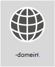

# <a name="external-domain-name-system-records-for-office-365"></a><span data-ttu-id="7f403-103">Externe DNS-records (Domain Name System) voor Office 365</span><span class="sxs-lookup"><span data-stu-id="7f403-103">External Domain Name System records for Office 365</span></span>

|||
|:-----|:-----|
||<span data-ttu-id="7f403-105">**Wilt u een aangepaste lijst met DNS-records voor uw Office 365-organisatie zien?**</span><span class="sxs-lookup"><span data-stu-id="7f403-105">**Want to see a customized list of DNS records for your Office 365 organization?**</span></span> <span data-ttu-id="7f403-106">U kunt de [informatie die u nodig hebt voor het maken van DNS-records](https://support.office.microsoft.com/article/Gather-the-information-you-need-to-create-Office-365-DNS-records-77f90d4a-dc7f-4f09-8972-c1b03ea85a67) in Office 365 voor uw domein vinden in Office 365.</span><span class="sxs-lookup"><span data-stu-id="7f403-106">You can [find the info you need to create Office 365 DNS records](https://support.office.microsoft.com/article/Gather-the-information-you-need-to-create-Office-365-DNS-records-77f90d4a-dc7f-4f09-8972-c1b03ea85a67) for your domain in Office 365.</span></span>  <br/> <span data-ttu-id="7f403-107">**Stapsgewijze instructies nodig om deze records toe te voegen aan de DNS-host van uw domein, zoals GoDaddy of eNom?**</span><span class="sxs-lookup"><span data-stu-id="7f403-107">**Need step-by-step help to add these records at your domain's DNS host, such as GoDaddy or eNom?**</span></span> <span data-ttu-id="7f403-108">[Hier vindt u koppelingen naar stapsgewijze instructies voor veel populaire DNS-hosts](https://go.microsoft.com/fwlink/?LinkId=286745).</span><span class="sxs-lookup"><span data-stu-id="7f403-108">[Find links to step-by-step instructions for many popular DNS hosts](https://go.microsoft.com/fwlink/?LinkId=286745).</span></span> <br/>  <span data-ttu-id="7f403-109">**Blijf u hier om de verwijzingenlijst voor uw eigen aangepaste implementatie te gebruiken?**</span><span class="sxs-lookup"><span data-stu-id="7f403-109">**Sticking around to use the reference list for your own custom deployment?**</span></span> <span data-ttu-id="7f403-110">Gebruik de onderstaande lijst als verwijzing voor uw aangepaste implementatie van Office 365.</span><span class="sxs-lookup"><span data-stu-id="7f403-110">The below list should be used as a reference for your custom Office 365 deployment.</span></span> <span data-ttu-id="7f403-111">U moet de records selecteren die betrekking hebben op uw organisatie en de juiste waarden invullen.</span><span class="sxs-lookup"><span data-stu-id="7f403-111">You will need to select which records apply to your organization and fill in the appropriate values.</span></span> <br/> <span data-ttu-id="7f403-112">\*\*Ga terug naar \*\*[Netwerkplanning en prestaties optimaliseren voor Office 365](https://aka.ms/tune).</span><span class="sxs-lookup"><span data-stu-id="7f403-112">**Go back to** [Network planning and performance tuning for Office 365](https://aka.ms/tune).</span></span>  <br/> |

<span data-ttu-id="7f403-113">De SPF-en MX-records zijn vaak het moeilijkst te vinden. Aan het eind van dit artikel zijn onze SPF-record richtlijnen bijgewerkt.</span><span class="sxs-lookup"><span data-stu-id="7f403-113">Often the SPF and MX records are the hardest to figure out. We've updated our SPF records guidance at the end of this article.</span></span> <span data-ttu-id="7f403-114">Het is belangrijk om te onthouden dat _u slechts één SPF-record voor uw domein hebt_.</span><span class="sxs-lookup"><span data-stu-id="7f403-114">The important thing to remember is that _you can only have a single SPF record for your domain_.</span></span> <span data-ttu-id="7f403-115">U kunt meerdere MX-records hebben, maar dat kan problemen veroorzaken bij het afleveren van e-mail.</span><span class="sxs-lookup"><span data-stu-id="7f403-115">You can have multiple MX records; however, that can cause problems for mail delivery.</span></span> <span data-ttu-id="7f403-116">Met een enkel MX-record waarmee e-mail naar een e-mailsysteem wordt omgeleid, worden veel van deze potentiële problemen weggenomen.</span><span class="sxs-lookup"><span data-stu-id="7f403-116">Having a single MX record that directs email to one mail system removes many potential problems.</span></span>
  
<span data-ttu-id="7f403-117">De volgende secties zijn ingedeeld op service in Office 365.</span><span class="sxs-lookup"><span data-stu-id="7f403-117">The sections below are organized by service in Office 365.</span></span> <span data-ttu-id="7f403-118">Wilt u een aangepaste lijst met Office 365 DNS-records voor uw domein zien? Meldt u aan bij Office 365 en [verzamel de informatie die u nodig hebt voor het maken van Office 365 DNS-records](https://support.office.com/article/77f90d4a-dc7f-4f09-8972-c1b03ea85a67).</span><span class="sxs-lookup"><span data-stu-id="7f403-118">To see a customized list of the Office 365 DNS records for your domain, sign in to Office 365 and [Gather the information you need to create Office 365 DNS records](https://support.office.com/article/77f90d4a-dc7f-4f09-8972-c1b03ea85a67).</span></span>
  
## <a name="external-dns-records-required-for-office-365-core-services"></a><span data-ttu-id="7f403-119">Externe DNS-records vereist voor Office 365 (kernservices)</span><span class="sxs-lookup"><span data-stu-id="7f403-119">External DNS records required for Office 365 (core services)</span></span>
<span data-ttu-id="7f403-120"><a name="BKMK_ReqdCore"> </a></span><span class="sxs-lookup"><span data-stu-id="7f403-120"><a name="BKMK_ReqdCore"> </a></span></span>

<span data-ttu-id="7f403-121">Elke Office 365-klant moet twee records toevoegen aan de externe DNS.</span><span class="sxs-lookup"><span data-stu-id="7f403-121">Every Office 365 customer needs to add two records to their external DNS.</span></span> <span data-ttu-id="7f403-122">De eerste CNAME-record zorgt ervoor dat Office 365 werkstations voor verificatie naar het juiste identiteitsplatform kan verwijzen.</span><span class="sxs-lookup"><span data-stu-id="7f403-122">The first CNAME record ensures that Office 365 can direct workstations to authenticate with the appropriate identity platform.</span></span> <span data-ttu-id="7f403-123">De tweede vereiste record is om te bewijzen u de eigenaar bent van de domeinnaam.</span><span class="sxs-lookup"><span data-stu-id="7f403-123">The second required record is to prove you own your domain name.</span></span>
  
||||
|:-----|:-----|:-----|
|<span data-ttu-id="7f403-124">**DNS-record**</span><span class="sxs-lookup"><span data-stu-id="7f403-124">**DNS record**</span></span> <br/> |<span data-ttu-id="7f403-125">**Doel**</span><span class="sxs-lookup"><span data-stu-id="7f403-125">**Purpose**</span></span> <br/> |<span data-ttu-id="7f403-126">**Te gebruiken waarde**</span><span class="sxs-lookup"><span data-stu-id="7f403-126">**Value to use**</span></span> <br/> |
|<span data-ttu-id="7f403-127">**CNAME**</span><span class="sxs-lookup"><span data-stu-id="7f403-127">**CNAME**</span></span> <br/> <span data-ttu-id="7f403-128">**(Suite)**</span><span class="sxs-lookup"><span data-stu-id="7f403-128">**(Suite)**</span></span> <br/> |<span data-ttu-id="7f403-129">Gebruikt door Office 365 om verificatie te verwijzen naar het juiste identiteitsplatform.</span><span class="sxs-lookup"><span data-stu-id="7f403-129">Used by Office 365 to direct authentication to the correct identity platform.</span></span> [<span data-ttu-id="7f403-130">Meer informatie</span><span class="sxs-lookup"><span data-stu-id="7f403-130">More information</span></span>](https://go.microsoft.com/fwlink/p/?LinkId=322005) <br/> <span data-ttu-id="7f403-131">**Opmerking:** Deze CNAME is alleen van toepassing op Office 365 beheerd door 21Vianet.</span><span class="sxs-lookup"><span data-stu-id="7f403-131">**Note:** This CNAME only applies to Office 365 operated by 21Vianet.</span></span> [<span data-ttu-id="7f403-132">Meer informatie</span><span class="sxs-lookup"><span data-stu-id="7f403-132">More information</span></span>](https://docs.microsoft.com/office365/servicedescriptions/office-365-platform-service-description/office-365-operated-by-21vianet)  |<span data-ttu-id="7f403-133">**Alias:** msoid</span><span class="sxs-lookup"><span data-stu-id="7f403-133">**Alias:** msoid</span></span>  <br/> <span data-ttu-id="7f403-134">**Target:** clientconfig.partner.microsoftonline-p.net.cn</span><span class="sxs-lookup"><span data-stu-id="7f403-134">**Target:** clientconfig.partner.microsoftonline-p.net.cn</span></span>  <br/> |
|<span data-ttu-id="7f403-135">**TXT**</span><span class="sxs-lookup"><span data-stu-id="7f403-135">**TXT**</span></span> <br/> <span data-ttu-id="7f403-136">**(Domeinverificatie)**</span><span class="sxs-lookup"><span data-stu-id="7f403-136">**(Domain verification)**</span></span> <br/> |<span data-ttu-id="7f403-137">Wordt gebruikt door Office 365 om alleen te verifiëren dat u de eigenaar bent van uw domein.</span><span class="sxs-lookup"><span data-stu-id="7f403-137">Used by Office 365 to verify only that you own your domain.</span></span> <span data-ttu-id="7f403-138">Het heeft verder nergens invloed op.</span><span class="sxs-lookup"><span data-stu-id="7f403-138">It doesn't affect anything else.</span></span>  <br/> |<span data-ttu-id="7f403-139">**Host:** @ (of, voor bepaalde DNS-hostingproviders, uw domeinnaam)</span><span class="sxs-lookup"><span data-stu-id="7f403-139">**Host:** @ (or, for some DNS hosting providers, your domain name)</span></span>  <br/> <span data-ttu-id="7f403-140">**TXT-waarde:** _een tekenreeks die door_ Office 365 geleverd wordt</span><span class="sxs-lookup"><span data-stu-id="7f403-140">**TXT Value:** _A text string provided by_ Office 365</span></span>  <br/> <span data-ttu-id="7f403-141">De wizard \*\* Office 365 Domeininstallatie\*\* levert de waarden die u gebruikt om deze record te maken. </span><span class="sxs-lookup"><span data-stu-id="7f403-141">The Office 365 **domain setup wizard** provides the values that you use to create this record.</span></span>  <br/> |


## <a name="external-dns-records-required-for-email-in-office-365-exchange-online"></a><span data-ttu-id="7f403-142">Externe DNS-records vereist voor e-mail in Office 365 (Exchange Online)</span><span class="sxs-lookup"><span data-stu-id="7f403-142">External DNS records required for email in Office 365 (Exchange Online)</span></span>
<span data-ttu-id="7f403-143"><a name="BKMK_ReqdCore"> </a></span><span class="sxs-lookup"><span data-stu-id="7f403-143"><a name="BKMK_ReqdCore"> </a></span></span>

<span data-ttu-id="7f403-144">E-mail in Office 365 vereist verschillende records.</span><span class="sxs-lookup"><span data-stu-id="7f403-144">Email in Office 365 requires several different records.</span></span> <span data-ttu-id="7f403-145">De drie primaire records die alle klanten moeten gebruiken, zijn de Automatisch opsporen-, MX- en SPF-records.</span><span class="sxs-lookup"><span data-stu-id="7f403-145">The three primary records that all customers should use are the Autodiscover, MX, and SPF records.</span></span>
  
- <span data-ttu-id="7f403-146">De **Automatisch opsporen-record** zorgt dat clientcomputers Exchange Online automatisch kunnen vinden en de client correct configureren.</span><span class="sxs-lookup"><span data-stu-id="7f403-146">**The Autodiscover record** allows client computers to automatically find Exchange and configure the client properly.</span></span>

- <span data-ttu-id="7f403-147">Met een **MX-record** wordt aan andere e-mailsystemen doorgegeven waar e-mail voor uw domein naartoe moet worden verzonden.</span><span class="sxs-lookup"><span data-stu-id="7f403-147">**The MX record** tells other mail systems where to send email for your domain.</span></span> <span data-ttu-id="7f403-148">**Opmerking:** Wanneer u uw e-mailadres overzet naar Office 365 door de MX-record van uw domein bij te werken, komt alle e-mail die naar dat domein wordt verzonden binnen in Office 365.</span><span class="sxs-lookup"><span data-stu-id="7f403-148">**Note:** When you change your email to Office 365, by updating your domain's MX record, ALL email sent to that domain will start coming to Office 365.</span></span>  
<span data-ttu-id="7f403-149">Wilt u slechts een paar e-mailadressen overbrengen naar Office 365?</span><span class="sxs-lookup"><span data-stu-id="7f403-149">Do you just want to switch a few email addresses to Office 365?</span></span> <span data-ttu-id="7f403-150">U kunt [Office 365 testen met een paar e-mailadressen in uw aangepaste domein](https://support.office.com/article/39cee536-6a03-40cf-b9c1-f301bb6001d7).</span><span class="sxs-lookup"><span data-stu-id="7f403-150">You can [Pilot Office 365 with a few email addresses on your custom domain](https://support.office.com/article/39cee536-6a03-40cf-b9c1-f301bb6001d7).</span></span>

- <span data-ttu-id="7f403-151">De **TXT-record voor SPF** wordt gebruikt door de ontvangende e-mailsystemen om te verifiëren dat de server die uw e-mailadres verzendt, de server is die u goedkeurt.</span><span class="sxs-lookup"><span data-stu-id="7f403-151">**The TXT record for SPF** is used by recipient email systems to validate that the server sending your email is one that you approve.</span></span> <span data-ttu-id="7f403-152">Dit helpt problemen zoals e-mailspoofing en phishing te voorkomen.</span><span class="sxs-lookup"><span data-stu-id="7f403-152">This helps prevent problems like email spoofing and phishing.</span></span> <span data-ttu-id="7f403-153">Zie de [externe DNS-records die zijn vereist voor SPF-](external-domain-name-system-records.md#BKMK_SPFrecords) in dit artikel voor meer informatie over wat u in de record moet opnemen.</span><span class="sxs-lookup"><span data-stu-id="7f403-153">See the [External DNS records required for SPF](external-domain-name-system-records.md#BKMK_SPFrecords) in this article to help you understand what to include in your record.</span></span>

<span data-ttu-id="7f403-154">E-mailklanten die van Exchange-federatie gebruikmaken, hebben ook de extra CNAME- en TXT-records nodig die onder aan de tabel worden vermeld.</span><span class="sxs-lookup"><span data-stu-id="7f403-154">Email customers who are using Exchange Federation will also need the additional CNAME and TXT record listed at the bottom of the table.</span></span>
  
||||
|:-----|:-----|:-----|
|<span data-ttu-id="7f403-155">**DNS-record**</span><span class="sxs-lookup"><span data-stu-id="7f403-155">**DNS record**</span></span> <br/> |<span data-ttu-id="7f403-156">**Doel**</span><span class="sxs-lookup"><span data-stu-id="7f403-156">**Purpose**</span></span> <br/> |<span data-ttu-id="7f403-157">**Te gebruiken waarde**</span><span class="sxs-lookup"><span data-stu-id="7f403-157">**Value to use**</span></span> <br/> |
|<span data-ttu-id="7f403-158">**CNAME**</span><span class="sxs-lookup"><span data-stu-id="7f403-158">**CNAME**</span></span> <br/> <span data-ttu-id="7f403-159">**(Exchange Online)**</span><span class="sxs-lookup"><span data-stu-id="7f403-159">**(Exchange Online)**</span></span> <br/> |<span data-ttu-id="7f403-160">Helpt Outlook-clients gemakkelijk verbinding maken met de Exchange Online-service via de Automatisch opsporen-service.</span><span class="sxs-lookup"><span data-stu-id="7f403-160">Helps Outlook clients to easily connect to the Exchange Online service by using the Autodiscover service.</span></span> <span data-ttu-id="7f403-161">Automatisch opsporen zoekt automatisch naar de juiste Exchange Server-host en configureert Outlook voor gebruikers.</span><span class="sxs-lookup"><span data-stu-id="7f403-161">Autodiscover automatically finds the correct Exchange Server host and configures Outlook for users.</span></span>  <br/> |<span data-ttu-id="7f403-162">**Alias:** Autodiscover</span><span class="sxs-lookup"><span data-stu-id="7f403-162">**Alias:** Autodiscover</span></span>  <br/> <span data-ttu-id="7f403-163">**Doel:** autodiscover.outlook.com</span><span class="sxs-lookup"><span data-stu-id="7f403-163">**Target:** autodiscover.outlook.com</span></span>  <br/> |
|<span data-ttu-id="7f403-164">**MX**</span><span class="sxs-lookup"><span data-stu-id="7f403-164">**MX**</span></span> <br/> <span data-ttu-id="7f403-165">**(Exchange Online)**</span><span class="sxs-lookup"><span data-stu-id="7f403-165">**(Exchange Online)**</span></span> <br/> |<span data-ttu-id="7f403-166">Verzendt inkomende e-mail voor uw domein naar de Exchange Online-service in Office 365.</span><span class="sxs-lookup"><span data-stu-id="7f403-166">Sends incoming mail for your domain to the Exchange Online service in Office 365.</span></span>  <br/> [!NOTE] <span data-ttu-id="7f403-167">Wanneer e-mail eenmaal naar Exchange Online gaat, verwijdert u de MX-records die naar uw oude systeem verwijzen.</span><span class="sxs-lookup"><span data-stu-id="7f403-167">Once email is flowing to Exchange Online, you should remove the MX records that are pointing to your old system.</span></span>   |<span data-ttu-id="7f403-168">**Domein:** Bijvoorbeeld contoso.com</span><span class="sxs-lookup"><span data-stu-id="7f403-168">**Domain:** For example, contoso.com</span></span>  <br/> <span data-ttu-id="7f403-169">**Target email server:**\<MX token\>.mail.protection.outlook.com</span><span class="sxs-lookup"><span data-stu-id="7f403-169">**Target email server:**\<MX token\>.mail.protection.outlook.com</span></span>  <br/> <span data-ttu-id="7f403-170">**Voorkeur/prioriteit:** lager dan de andere MX-records (dit zorgt ervoor dat e-mail wordt afgeleverd bij Exchange Online), bijvoorbeeld 1 of 'laag'</span><span class="sxs-lookup"><span data-stu-id="7f403-170">**Preference/Priority:** Lower than any other MX records (this ensures mail is delivered to Exchange Online) - for example 1 or 'low'</span></span>  <br/>  <span data-ttu-id="7f403-171">Vindt uw \<MX token\>door deze stappen uit te voeren:</span><span class="sxs-lookup"><span data-stu-id="7f403-171">Find your \<MX token\> by following these steps:</span></span>  <br/>  <span data-ttu-id="7f403-172">Meld u aan bij Office 365 en ga naar Office 365-beheerder \> domeinen.</span><span class="sxs-lookup"><span data-stu-id="7f403-172">Sign in to Office 365, go to Office 365 admin \> Domains.</span></span>  <br/>  <span data-ttu-id="7f403-173">Kies Problemen oplossen in de kolom Actie voor uw domein.</span><span class="sxs-lookup"><span data-stu-id="7f403-173">In the Action column for your domain, choose Fix issues.</span></span>  <br/>  <span data-ttu-id="7f403-174">Kies Wat kan ik oplossen? in de sectie MX-records.</span><span class="sxs-lookup"><span data-stu-id="7f403-174">In the MX records section, choose What do I fix?</span></span>  <br/>  <span data-ttu-id="7f403-175">Volg de aanwijzingen op deze pagina om uw MX-record bij te werken.</span><span class="sxs-lookup"><span data-stu-id="7f403-175">Follow the directions on this page to update your MX record.</span></span>  <br/> [<span data-ttu-id="7f403-176">Wat is MX-prioriteit?</span><span class="sxs-lookup"><span data-stu-id="7f403-176">What is MX priority?</span></span>](https://go.microsoft.com/fwlink/p/?LinkId=396471) <br/> |
|<span data-ttu-id="7f403-177">**SPF (TXT)**</span><span class="sxs-lookup"><span data-stu-id="7f403-177">**SPF (TXT)**</span></span> <br/> <span data-ttu-id="7f403-178">**(Exchange Online)**</span><span class="sxs-lookup"><span data-stu-id="7f403-178">**(Exchange Online)**</span></span>  <br/> |<span data-ttu-id="7f403-179">Helpt voorkomen dat anderen uw domein gebruiken om spam of andere schadelijke e-mail te verzenden.</span><span class="sxs-lookup"><span data-stu-id="7f403-179">Helps to prevent other people from using your domain to send spam or other malicious email.</span></span> <span data-ttu-id="7f403-180">Met SPF-records (Sender Policy Framework) worden de servers geïdentificeerd die zijn geautoriseerd om e-mail te verzenden vanaf uw domein.</span><span class="sxs-lookup"><span data-stu-id="7f403-180">Sender policy framework (SPF) records work by identifying the servers that are authorized to send email from your domain.</span></span>  <br/> |[<span data-ttu-id="7f403-181">Externe DNS-records vereist voor SPF</span><span class="sxs-lookup"><span data-stu-id="7f403-181">External DNS records required for SPF</span></span>](external-domain-name-system-records.md#BKMK_SPFrecords) <br/> |
|<span data-ttu-id="7f403-182">**TXT**</span><span class="sxs-lookup"><span data-stu-id="7f403-182">**TXT**</span></span> <br/> <span data-ttu-id="7f403-183">**(Exchange-Federatie)**</span><span class="sxs-lookup"><span data-stu-id="7f403-183">**(Exchange federation)**</span></span> <br/> |<span data-ttu-id="7f403-184">Wordt gebruikt voor Exchange-federatie voor hybride implementatie.</span><span class="sxs-lookup"><span data-stu-id="7f403-184">Used for Exchange federation for hybrid deployment.</span></span>  <br/> |<span data-ttu-id="7f403-185">**TXT-record 1:** Bijvoorbeeld contoso.com en bijbehorende, speciaal gegenereerde hash-tekst voor domeinvalidatie (bijvoorbeeld Y96nu89138789315669824)</span><span class="sxs-lookup"><span data-stu-id="7f403-185">**TXT record 1:** For example, contoso.com and associated custom-generated, domain-proof hash text (for example, Y96nu89138789315669824)</span></span>  <br/> <span data-ttu-id="7f403-186">**TXT-record 2:** Bijvoorbeeld exchangedelegation.contoso.com en bijbehorende, speciaal gegenereerde hash-tekst voor domeinvalidatie (bijvoorbeeld Y3259071352452626169)</span><span class="sxs-lookup"><span data-stu-id="7f403-186">**TXT record 2:** For example, exchangedelegation.contoso.com and associated custom-generated, domain-proof hash text (for example, Y3259071352452626169)</span></span>  <br/> |
|<span data-ttu-id="7f403-187">**CNAME**</span><span class="sxs-lookup"><span data-stu-id="7f403-187">**CNAME**</span></span> <br/> <span data-ttu-id="7f403-188">**(Exchange-Federatie)**</span><span class="sxs-lookup"><span data-stu-id="7f403-188">**(Exchange federation)**</span></span> <br/> |<span data-ttu-id="7f403-189">Helpt Outlook-clients gemakkelijk verbinding maken met de Exchange Online-service via de Automatisch opsporen-service wanneer uw bedrijf Exchange-federatie gebruikt.</span><span class="sxs-lookup"><span data-stu-id="7f403-189">Helps Outlook clients to easily connect to the Exchange Online service by using the Autodiscover service when your company is using Exchange federation.</span></span> <span data-ttu-id="7f403-190">Automatisch opsporen zoekt automatisch naar de juiste Exchange Server-host en configureert Outlook voor uw gebruikers.</span><span class="sxs-lookup"><span data-stu-id="7f403-190">Autodiscover automatically finds the correct Exchange Server host and configures Outlook for your users.</span></span>  <br/> |<span data-ttu-id="7f403-191">**Alias:** Bijvoorbeeld Autodiscover.service.contoso.com</span><span class="sxs-lookup"><span data-stu-id="7f403-191">**Alias:** For example, Autodiscover.service.contoso.com</span></span>  <br/> <span data-ttu-id="7f403-192">**Doel:** autodiscover.outlook.com</span><span class="sxs-lookup"><span data-stu-id="7f403-192">**Target:** autodiscover.outlook.com</span></span>  <br/> |


## <a name="external-dns-records-required-for-skype-for-business-online"></a><span data-ttu-id="7f403-193">Externe DNS-records vereist voor Skype voor Bedrijven Online</span><span class="sxs-lookup"><span data-stu-id="7f403-193">External DNS records required for Skype for Business Online</span></span>
<span data-ttu-id="7f403-194"><a name="BKMK_ReqdCore"> </a></span><span class="sxs-lookup"><span data-stu-id="7f403-194"><a name="BKMK_ReqdCore"> </a></span></span>

<span data-ttu-id="7f403-195">Er zijn specifieke stappen die u moet uitvoeren wanneer u [Office 365-URL's en IP-adresbereiken](https://support.office.com/article/8548a211-3fe7-47cb-abb1-355ea5aa88a2#BKMK_LYO) gebruikt om er zeker van te zijn dat uw netwerk correct is geconfigureerd.</span><span class="sxs-lookup"><span data-stu-id="7f403-195">There are specific steps to take when you use  [Office 365 URLs and IP address ranges](https://support.office.com/article/8548a211-3fe7-47cb-abb1-355ea5aa88a2#BKMK_LYO) to make sure your network is configured correctly.</span></span>

> [!NOTE]
> <span data-ttu-id="7f403-196">Deze DNS-records zijn ook van toepassing op Teams, met name in een scenario met hybride Teams en een Skype voor bedrijven-scenario waarin bepaalde Federatie-zaken zich kunnen voordoen.</span><span class="sxs-lookup"><span data-stu-id="7f403-196">These DNS records also apply to Teams, especially in a hybrid Teams and Skype for Business scenario, where certain federation issues could arise.</span></span>
  
||||
|:-----|:-----|:-----|
|<span data-ttu-id="7f403-197">**DNS-record**</span><span class="sxs-lookup"><span data-stu-id="7f403-197">**DNS record**</span></span> <br/> |<span data-ttu-id="7f403-198">**Doel**</span><span class="sxs-lookup"><span data-stu-id="7f403-198">**Purpose**</span></span> <br/> |<span data-ttu-id="7f403-199">**Te gebruiken waarde**</span><span class="sxs-lookup"><span data-stu-id="7f403-199">**Value to use**</span></span> <br/> |
|<span data-ttu-id="7f403-200">**SRV**</span><span class="sxs-lookup"><span data-stu-id="7f403-200">**SRV**</span></span> <br/> <span data-ttu-id="7f403-201">**Skype voor Bedrijven Online**</span><span class="sxs-lookup"><span data-stu-id="7f403-201">**(Skype for Business Online)**</span></span> <br/> |<span data-ttu-id="7f403-202">Zorgt dat uw Office 365-domein functionaliteit voor chatberichten (IM) met externe clients kan delen door SIP-federatie in te schakelen.</span><span class="sxs-lookup"><span data-stu-id="7f403-202">Allows your Office 365 domain to share instant messaging (IM) features with external clients by enabling SIP federation.</span></span> <span data-ttu-id="7f403-203">Zie [URL's en IP-adresbereiken voor Office 365](https://support.office.com/article/8548a211-3fe7-47cb-abb1-355ea5aa88a2#BKMK_LYO) voor meer informatie.</span><span class="sxs-lookup"><span data-stu-id="7f403-203">Read more about [Office 365 URLs and IP address ranges](https://support.office.com/article/8548a211-3fe7-47cb-abb1-355ea5aa88a2#BKMK_LYO).</span></span>  <br/> |<span data-ttu-id="7f403-204">**Service:** sipfederationtls</span><span class="sxs-lookup"><span data-stu-id="7f403-204">**Service:** sipfederationtls</span></span>  <br/> <span data-ttu-id="7f403-205">**Protocol:** TCP</span><span class="sxs-lookup"><span data-stu-id="7f403-205">**Protocol:** TCP</span></span>  <br/> <span data-ttu-id="7f403-206">**Prioriteit:** 100</span><span class="sxs-lookup"><span data-stu-id="7f403-206">**Priority:** 100</span></span>  <br/> <span data-ttu-id="7f403-207">**Gewicht:** 1</span><span class="sxs-lookup"><span data-stu-id="7f403-207">**Weight:** 1</span></span>  <br/> <span data-ttu-id="7f403-208">**Poort:** 5061</span><span class="sxs-lookup"><span data-stu-id="7f403-208">**Port:** 5061</span></span>  <br/> <span data-ttu-id="7f403-209">**Target:** sipfed.online.lync.com</span><span class="sxs-lookup"><span data-stu-id="7f403-209">**Target:** sipfed.online.lync.com</span></span>  <br/> <span data-ttu-id="7f403-210">**Opmerking:** Als SRV-opzoekacties op een externe DNS door de firewall of proxyserver worden geblokkeerd, moet u deze record aan de interne DNS-record toevoegen. </span><span class="sxs-lookup"><span data-stu-id="7f403-210">**Note:** If the firewall or proxy server blocks SRV lookups on an external DNS, you should add this record to the internal DNS record.</span></span>   |
|<span data-ttu-id="7f403-211">**SRV**</span><span class="sxs-lookup"><span data-stu-id="7f403-211">**SRV**</span></span> <br/> <span data-ttu-id="7f403-212">**Skype voor Bedrijven Online**</span><span class="sxs-lookup"><span data-stu-id="7f403-212">**(Skype for Business Online)**</span></span> <br/> |<span data-ttu-id="7f403-213">Wordt gebruikt door Skype voor Bedrijven om de informatiestroom tussen Lync-clients te coördineren.</span><span class="sxs-lookup"><span data-stu-id="7f403-213">Used by Skype for Business to coordinate the flow of information between Lync clients.</span></span>  <br/> |<span data-ttu-id="7f403-214">**Service:** sip</span><span class="sxs-lookup"><span data-stu-id="7f403-214">**Service:** sip</span></span>  <br/> <span data-ttu-id="7f403-215">**Protocol:** TLS</span><span class="sxs-lookup"><span data-stu-id="7f403-215">**Protocol:** TLS</span></span>  <br/> <span data-ttu-id="7f403-216">**Prioriteit:** 100</span><span class="sxs-lookup"><span data-stu-id="7f403-216">**Priority:** 100</span></span>  <br/> <span data-ttu-id="7f403-217">**Gewicht:** 1</span><span class="sxs-lookup"><span data-stu-id="7f403-217">**Weight:** 1</span></span>  <br/> <span data-ttu-id="7f403-218">**Poort:** 443</span><span class="sxs-lookup"><span data-stu-id="7f403-218">**Port:** 443</span></span>  <br/> <span data-ttu-id="7f403-219">**Target:** sipdir.online.lync.com</span><span class="sxs-lookup"><span data-stu-id="7f403-219">**Target:** sipdir.online.lync.com</span></span>  <br/> |
|<span data-ttu-id="7f403-220">**CNAME**</span><span class="sxs-lookup"><span data-stu-id="7f403-220">**CNAME**</span></span> <br/> <span data-ttu-id="7f403-221">**Skype voor Bedrijven Online**</span><span class="sxs-lookup"><span data-stu-id="7f403-221">**(Skype for Business Online)**</span></span> <br/> |<span data-ttu-id="7f403-222">Wordt gebruikt door de Lync-client om de Skype voor Bedrijven Online-service te helpen vinden en aan te melden.</span><span class="sxs-lookup"><span data-stu-id="7f403-222">Used by the Lync client to help find the Skype for Business Online service and sign in.</span></span>  <br/> |<span data-ttu-id="7f403-223">**Alias:** sip</span><span class="sxs-lookup"><span data-stu-id="7f403-223">**Alias:** sip</span></span>  <br/> <span data-ttu-id="7f403-224">**Target:** sipdir.online.lync.com</span><span class="sxs-lookup"><span data-stu-id="7f403-224">**Target:** sipdir.online.lync.com</span></span>  <br/> <span data-ttu-id="7f403-225">Zie [URL's en IP-adresbereiken voor Office 365](https://support.office.com/article/8548a211-3fe7-47cb-abb1-355ea5aa88a2#BKMK_LYO) voor meer informatie.</span><span class="sxs-lookup"><span data-stu-id="7f403-225">For more information, see [Office 365 URLs and IP address ranges](https://support.office.com/article/8548a211-3fe7-47cb-abb1-355ea5aa88a2#BKMK_LYO).</span></span>  <br/> |
|<span data-ttu-id="7f403-226">**CNAME**</span><span class="sxs-lookup"><span data-stu-id="7f403-226">**CNAME**</span></span> <br/> <span data-ttu-id="7f403-227">**Skype voor Bedrijven Online**</span><span class="sxs-lookup"><span data-stu-id="7f403-227">**(Skype for Business Online)**</span></span> <br/> |<span data-ttu-id="7f403-228">Wordt gebruikt door de Lync-mobile client om de Skype voor Bedrijven Online-service te helpen vinden en aan te melden.</span><span class="sxs-lookup"><span data-stu-id="7f403-228">Used by the Lync mobile client to help find the Skype for Business Online service and sign in.</span></span>  <br/> |<span data-ttu-id="7f403-229">**Alias:** lyncdiscover</span><span class="sxs-lookup"><span data-stu-id="7f403-229">**Alias:** lyncdiscover</span></span>  <br/> <span data-ttu-id="7f403-230">**Target:** webdir.online.lync.com</span><span class="sxs-lookup"><span data-stu-id="7f403-230">**Target:** webdir.online.lync.com</span></span>  <br/> |

## <a name="external-dns-records-required-for-office-365-single-sign-on"></a><span data-ttu-id="7f403-231">Externe DNS-records vereist voor Office 365 SSO (Single Sign-On)</span><span class="sxs-lookup"><span data-stu-id="7f403-231">External DNS records required for Office 365 Single Sign-On</span></span>
<span data-ttu-id="7f403-232"><a name="BKMK_ReqdCore"> </a></span><span class="sxs-lookup"><span data-stu-id="7f403-232"><a name="BKMK_ReqdCore"> </a></span></span>

||||
|:-----|:-----|:-----|
|<span data-ttu-id="7f403-233">**DNS-record**</span><span class="sxs-lookup"><span data-stu-id="7f403-233">**DNS record**</span></span> <br/> |<span data-ttu-id="7f403-234">**Doel**</span><span class="sxs-lookup"><span data-stu-id="7f403-234">**Purpose**</span></span> <br/> |<span data-ttu-id="7f403-235">**Te gebruiken waarde**</span><span class="sxs-lookup"><span data-stu-id="7f403-235">**Value to use**</span></span> <br/> |
|<span data-ttu-id="7f403-236">**Host (A)**</span><span class="sxs-lookup"><span data-stu-id="7f403-236">**Host (A)**</span></span> <br/> |<span data-ttu-id="7f403-237">Wordt gebruikt voor eenmalige aanmelding (SSO).</span><span class="sxs-lookup"><span data-stu-id="7f403-237">Used for single sign-on (SSO).</span></span> <span data-ttu-id="7f403-238">Deze fungeert als eindpunt voor uw externe gebruikers (en on-premises gebruikers, indien gewenst) om verbinding te maken met uw Active Directory Federation Services (AD FS) -federatieserverproxy's of virtuele IP (VIP) met gelijke taakverdeling.</span><span class="sxs-lookup"><span data-stu-id="7f403-238">It provides the endpoint for your off-premises users (and on-premises users, if you like) to connect to your Active Directory Federation Services (AD FS) federation server proxies or load-balanced virtual IP (VIP).</span></span>  <br/> |<span data-ttu-id="7f403-239">**Target:** Bijvoorbeeld sts.contoso.com</span><span class="sxs-lookup"><span data-stu-id="7f403-239">**Target:** For example, sts.contoso.com</span></span>  <br/> |

## <a name="external-dns-records-required-for-spf"></a><span data-ttu-id="7f403-240">Externe DNS-records vereist voor SPF</span><span class="sxs-lookup"><span data-stu-id="7f403-240">External DNS records required for SPF</span></span>
<span data-ttu-id="7f403-241"><a name="BKMK_SPFrecords"> </a></span><span class="sxs-lookup"><span data-stu-id="7f403-241"><a name="BKMK_SPFrecords"> </a></span></span>

> [!IMPORTANT]
> <span data-ttu-id="7f403-242">SPF is ontworpen om spoofing te voorkomen, maar er zijn spoofing-technieken waartegen SPF geen bescherming kan bieden.</span><span class="sxs-lookup"><span data-stu-id="7f403-242">SPF is designed to help prevent spoofing, but there are spoofing techniques that SPF cannot protect against.</span></span> <span data-ttu-id="7f403-243">Om u tegen deze technieken te beschermen, moet u, nadat u SPF hebt geconfigureerd, ook DKIM en DMARC voor Office 365 configureren.</span><span class="sxs-lookup"><span data-stu-id="7f403-243">In order to protect against these, once you have set up SPF, you should also configure DKIM and DMARC for Office 365.</span></span> <span data-ttu-id="7f403-244">Raadpleeg [DKIM gebruiken om uitgaande e-mail te valideren die wordt verzonden vanaf uw domein in Office 365](https://technet.microsoft.com/library/mt695945%28v=exchg.150%29.aspx).</span><span class="sxs-lookup"><span data-stu-id="7f403-244">To get started, see [Use DKIM to validate outbound email sent from your domain in Office 365](https://technet.microsoft.com/library/mt695945%28v=exchg.150%29.aspx).</span></span> <span data-ttu-id="7f403-245">Zie vervolgens [DMARC gebruiken om e-mail in Office 365 te valideren](https://technet.microsoft.com/library/mt734386%28v=exchg.150%29.aspx).</span><span class="sxs-lookup"><span data-stu-id="7f403-245">Next, see [Use DMARC to validate email in Office 365](https://technet.microsoft.com/library/mt734386%28v=exchg.150%29.aspx).</span></span>
  
<span data-ttu-id="7f403-246">SPF-records die helpen voorkomen dat anderen uw domein gebruiken om spam of andere schadelijke e-mail te verzenden.</span><span class="sxs-lookup"><span data-stu-id="7f403-246">SPF records are TXT records that help to prevent other people from using your domain to send spam or other malicious email.</span></span> <span data-ttu-id="7f403-247">Met SPF-records (Sender Policy Framework) worden de servers geïdentificeerd die zijn geautoriseerd om e-mail te verzenden vanaf uw domein.</span><span class="sxs-lookup"><span data-stu-id="7f403-247">Sender policy framework (SPF) records work by identifying the servers that are authorized to send email from your domain.</span></span>
  
<span data-ttu-id="7f403-248">U kunt slechts één SPF-record hebben voor uw domein (dat wil zeggen, een TXT-record die SPF definieert).</span><span class="sxs-lookup"><span data-stu-id="7f403-248">You can only have one SPF record (that is, a TXT record that defines SPF) for your domain.</span></span> <span data-ttu-id="7f403-249">Die ene record kan verschillende andere opnamen hebben, maar het totale resultaat van de DNS-zoekopdrachten kan niet meer dan 10 zijn (dit helpt Denial of Service-aanvallen voorkomen).</span><span class="sxs-lookup"><span data-stu-id="7f403-249">That single record can have a few different inclusions but the total DNS lookups that result can't be more than 10 (this helps prevent denial of service attacks).</span></span> <span data-ttu-id="7f403-250">Zie de tabel en andere voorbeelden hieronder om u te helpen de juiste SPF-recordwaarden voor uw omgeving te maken of bij te werken.</span><span class="sxs-lookup"><span data-stu-id="7f403-250">See the table and other examples below to help you create or update the right SPF record values for your environment.</span></span>
  
### <a name="structure-of-an-spf-record"></a><span data-ttu-id="7f403-251">Structuur van een SPF-record</span><span class="sxs-lookup"><span data-stu-id="7f403-251">Structure of an SPF record</span></span>

<span data-ttu-id="7f403-252">Alle SPF-records bevatten drie onderdelen: de declaratie dat het een SPF-record is, de domeinen en IP-adressen die e-mail moeten verzenden en een regel voor het afdwingen.</span><span class="sxs-lookup"><span data-stu-id="7f403-252">All SPF records contain three parts: the declaration that it is an SPF record, the domains, and IP addresses that should be sending email, and an enforcement rule.</span></span> <span data-ttu-id="7f403-253">U hebt alle drie nodig in een geldig SPF-record.</span><span class="sxs-lookup"><span data-stu-id="7f403-253">You need all three in a valid SPF record.</span></span> <span data-ttu-id="7f403-254">Hier volgt een voorbeeld van een algemene SPF-record voor Office 365 wanneer u alleen e-mail van Exchange Online gebruikt:</span><span class="sxs-lookup"><span data-stu-id="7f403-254">Here's an example of a common SPF record for Office 365 when you use only Exchange Online email:</span></span>
  
``` dns
TXT Name @
Values: v=spf1 include:spf.protection.outlook.com -all
```

<span data-ttu-id="7f403-255">Een e-mailsysteem dat een e-mailbericht vanaf uw domein ontvangt, bekijkt de SPF-record en als de e-mailserver die het bericht heeft verzonden een Office 365-server is, wordt het bericht geaccepteerd.</span><span class="sxs-lookup"><span data-stu-id="7f403-255">An email system that receives an email from your domain looks at the SPF record, and if the email server that sent the message was an Office 365 server, the message is accepted.</span></span> <span data-ttu-id="7f403-256">Als de server die het bericht heeft verzonden, het oude e-mailsysteem of een schadelijk systeem op Internet is, de SPF-controle kan bijvoorbeeld mislukken en het bericht wordt niet afgeleverd.</span><span class="sxs-lookup"><span data-stu-id="7f403-256">If the server that sent the message was your old mail system or a malicious system on the Internet, for example, the SPF check might fail and the message wouldn't be delivered.</span></span> <span data-ttu-id="7f403-257">Hiermee wordt gecontroleerd om vervalsing en phishingberichten te voorkomen.</span><span class="sxs-lookup"><span data-stu-id="7f403-257">Checks like this help to prevent spoofing and phishing messages.</span></span>
  
### <a name="choose-the-spf-record-structure-you-need"></a><span data-ttu-id="7f403-258">Kies de SPF-recordstructuur die u nodig hebt</span><span class="sxs-lookup"><span data-stu-id="7f403-258">Choose the SPF record structure you need</span></span>

<span data-ttu-id="7f403-259">Voor scenario's waarin u niet alleen werkt met Exchange Online-e-mail voor Office 365 (bijvoorbeeld wanneer u ook e-mail gebruikt die afkomstig is van SharePoint Online), gebruikt u de volgende tabel om te bepalen wat u wilt opnemen in de waarde van de record.</span><span class="sxs-lookup"><span data-stu-id="7f403-259">For scenarios where you're not just using Exchange Online email for Office 365 (for example, when you use email originating from SharePoint Online as well), use the following table to determine what to include in the value of the record.</span></span>
  
> [!NOTE]
> <span data-ttu-id="7f403-260">Als u een ingewikkeld scenario hebt met bijvoorbeeld edge-mailservers voor het beheren van e-mailverkeer door uw firewall, moet u een meer gedetailleerde SPF-record instellen.</span><span class="sxs-lookup"><span data-stu-id="7f403-260">If you have a complicated scenario that includes, for example, edge email servers for managing email traffic across your firewall, you'll have a more detailed SPF record to set up.</span></span> <span data-ttu-id="7f403-261">Leer hoe: [SPF records instellen in Office 365 om vervalsing te helpen voorkomen](https://go.microsoft.com/fwlink/?LinkId=787656).</span><span class="sxs-lookup"><span data-stu-id="7f403-261">Learn how: [Set up SPF records in Office 365 to help prevent spoofing](https://go.microsoft.com/fwlink/?LinkId=787656).</span></span> <span data-ttu-id="7f403-262">In [How Office 365 uses Sender Policy Framework (SPF) to help prevent spoofing](https://go.microsoft.com/fwlink/?LinkId=787065) (Hoe Office 365 SPF (Sender Policy Framework) gebruikt om vervalsing te helpen voorkomen) kunt u ook veel meer informatie vinden over hoe SPF met Office 365 werkt.</span><span class="sxs-lookup"><span data-stu-id="7f403-262">You can also learn much more about how SPF works with Office 365 by reading [How Office 365 uses Sender Policy Framework (SPF) to help prevent spoofing](https://go.microsoft.com/fwlink/?LinkId=787065).</span></span>
  
| <span data-ttu-id="7f403-263">Nummer</span><span class="sxs-lookup"><span data-stu-id="7f403-263">Number</span></span>|<span data-ttu-id="7f403-264">Als u werkt met...</span><span class="sxs-lookup"><span data-stu-id="7f403-264">If you're using…</span></span>  <br/> |<span data-ttu-id="7f403-265">Doel</span><span class="sxs-lookup"><span data-stu-id="7f403-265">Purpose</span></span>  <br/> |<span data-ttu-id="7f403-266">Voegt u deze opnamen (includes) toe</span><span class="sxs-lookup"><span data-stu-id="7f403-266">Add these includes</span></span>  <br/> |
|:-----|:-----|:-----|:-----|
|<span data-ttu-id="7f403-267">1</span><span class="sxs-lookup"><span data-stu-id="7f403-267">1</span></span>  <br/> |<span data-ttu-id="7f403-268">Alle e-mailsystemen (vereist)</span><span class="sxs-lookup"><span data-stu-id="7f403-268">All email systems (required)</span></span>  <br/> |<span data-ttu-id="7f403-269">Alle SPF-records beginnen met deze waarde</span><span class="sxs-lookup"><span data-stu-id="7f403-269">All SPF records start with this value</span></span>  <br/> |<span data-ttu-id="7f403-270">v=spf1</span><span class="sxs-lookup"><span data-stu-id="7f403-270">v=spf1</span></span>  <br/> |
|<span data-ttu-id="7f403-271">2</span><span class="sxs-lookup"><span data-stu-id="7f403-271">2</span></span>  <br/> |<span data-ttu-id="7f403-272">Exchange Online (common)</span><span class="sxs-lookup"><span data-stu-id="7f403-272">Exchange Online (common)</span></span>  <br/> |<span data-ttu-id="7f403-273">Gebruik alleen met Exchange Online</span><span class="sxs-lookup"><span data-stu-id="7f403-273">Use with just Exchange Online</span></span>  <br/> |<span data-ttu-id="7f403-274">include:spf.protection.outlook.com</span><span class="sxs-lookup"><span data-stu-id="7f403-274">include:spf.protection.outlook.com</span></span>  <br/> |
|<span data-ttu-id="7f403-275">3</span><span class="sxs-lookup"><span data-stu-id="7f403-275">3</span></span>  <br/> |<span data-ttu-id="7f403-276">Extern e-mailsysteem (minder algemeen)</span><span class="sxs-lookup"><span data-stu-id="7f403-276">Third-party email system (less common)</span></span>  <br/> ||<span data-ttu-id="7f403-277">inclusief:\<email system like mail.contoso.com\></span><span class="sxs-lookup"><span data-stu-id="7f403-277">include:\<email system like mail.contoso.com\></span></span>  <br/> |
|<span data-ttu-id="7f403-278">4</span><span class="sxs-lookup"><span data-stu-id="7f403-278">4</span></span>  <br/> |<span data-ttu-id="7f403-279">On-premises e-mailsysteem (minder algemeen)</span><span class="sxs-lookup"><span data-stu-id="7f403-279">On-premises mail system (less common)</span></span>  <br/> |<span data-ttu-id="7f403-280">Gebruiken als u Exchange Online Protection of Exchange Online plus een ander e-mailsysteem gebruikt</span><span class="sxs-lookup"><span data-stu-id="7f403-280">Use if you're using Exchange Online Protection or Exchange Online plus another mail system</span></span>  <br/> |<span data-ttu-id="7f403-281">ip4:\<0.0.0.0\></span><span class="sxs-lookup"><span data-stu-id="7f403-281">ip4:\<0.0.0.0\></span></span>  <br/> <span data-ttu-id="7f403-282">ip6:\< : : \></span><span class="sxs-lookup"><span data-stu-id="7f403-282">ip6:\< : : \></span></span>  <br/> <span data-ttu-id="7f403-283">inclusief:\<mail.contoso.com\></span><span class="sxs-lookup"><span data-stu-id="7f403-283">include:\<mail.contoso.com\></span></span>  <br/> <span data-ttu-id="7f403-284">De waarde tussen punthaken (\<\>) moet een ander e-mailsysteem zijn waarmee e-mail voor uw domein wordt verzonden.</span><span class="sxs-lookup"><span data-stu-id="7f403-284">The value in brackets (\<\>) should be other mail systems that will send email for your domain.</span></span>  <br/> |
|<span data-ttu-id="7f403-285">5</span><span class="sxs-lookup"><span data-stu-id="7f403-285">5</span></span>  <br/> |<span data-ttu-id="7f403-286">Alle e-mailsystemen (vereist)</span><span class="sxs-lookup"><span data-stu-id="7f403-286">All email systems (required)</span></span>  <br/> ||<span data-ttu-id="7f403-287">-all</span><span class="sxs-lookup"><span data-stu-id="7f403-287">-all</span></span>  <br/> |

### <a name="example-adding-to-an-existing-spf-record"></a><span data-ttu-id="7f403-288">Voorbeeld: Aan een bestaande SPF-record toevoegen</span><span class="sxs-lookup"><span data-stu-id="7f403-288">Example: Adding to an existing SPF record</span></span>
<span data-ttu-id="7f403-289"><a name="bkmk_addtospf"> </a></span><span class="sxs-lookup"><span data-stu-id="7f403-289"><a name="bkmk_addtospf"> </a></span></span>

<span data-ttu-id="7f403-290">Als u al een SPF-record hebt, moet u er waarden voor Office 365 aan toevoegen of updaten.</span><span class="sxs-lookup"><span data-stu-id="7f403-290">If you already have an SPF record, you'll need to add or update values for Office 365.</span></span> <span data-ttu-id="7f403-291">Stel bijvoorbeeld dat dit uw bestaande SPF-record voor contoso.com is:</span><span class="sxs-lookup"><span data-stu-id="7f403-291">For example, say your existing SPF record for contoso.com is this:</span></span>
  
``` dns
TXT Name @
Values: v=spf1 ip4:60.200.100.30 include:smtp.adatum.com -all
```

<span data-ttu-id="7f403-292">Nu werkt u de SPF-record bij voor Office 365.</span><span class="sxs-lookup"><span data-stu-id="7f403-292">Now you're updating your SPF record for Office 365.</span></span> <span data-ttu-id="7f403-293">U bewerkt de huidige record zodat u beschikt over één SPF-record waarin de waarden die u nodig hebt, zijn opgenomen.</span><span class="sxs-lookup"><span data-stu-id="7f403-293">You'll edit your current record so you have an SPF record that includes the values that you need.</span></span> <span data-ttu-id="7f403-294">For Office 365, "spf.protection.outlook.com".</span><span class="sxs-lookup"><span data-stu-id="7f403-294">For Office 365, "spf.protection.outlook.com".</span></span>
  
<span data-ttu-id="7f403-295">Juist:</span><span class="sxs-lookup"><span data-stu-id="7f403-295">Correct:</span></span>
  
``` dns
TXT Name @
Values: v=spf1 ip4:60.200.100.30 include:spf.protection.outlook.com include:smtp.adatum.com -all
```

<span data-ttu-id="7f403-296">Onjuist:</span><span class="sxs-lookup"><span data-stu-id="7f403-296">Incorrect:</span></span>
  
``` dns
Record 1:
TXT Name @
Values: v=spf1 ip4:60.200.100.30 include:smtp.adatum.com -all
Record 2:
Values: v=spf1 include:spf.protection.outlook.com -all
```

### <a name="more-examples-of-common-spf-values"></a><span data-ttu-id="7f403-297">Meer voorbeelden van SPF-waarden</span><span class="sxs-lookup"><span data-stu-id="7f403-297">More examples of common SPF values</span></span>
<span data-ttu-id="7f403-298"><a name="bkmk_addtospf"> </a></span><span class="sxs-lookup"><span data-stu-id="7f403-298"><a name="bkmk_addtospf"> </a></span></span>

<span data-ttu-id="7f403-299">Als u de volledige Office 365-suite gebruikt en MailChimp gebruikt om namens u marketingmails te verzenden, kan uw SPF-record op contoso.com er als volgt uitzien, waarin de rijen 1, 3 en 5 van de bovenstaande tabel worden gebruikt.</span><span class="sxs-lookup"><span data-stu-id="7f403-299">If you are using the full Office 365 suite and are using MailChimp to send marketing emails on your behalf, your SPF record at contoso.com might look like the following, which uses rows 1, 3, and 5 from the table above.</span></span> <span data-ttu-id="7f403-300">Let op: rij 1 en 5 zijn vereist.</span><span class="sxs-lookup"><span data-stu-id="7f403-300">Remember, rows 1 and 5 are required.</span></span>
  
``` dns
TXT Name @
Values: v=spf1 include:spf.protection.outlook.com include:servers.mcsv.net -all
```

<span data-ttu-id="7f403-301">Als u een hybride implementatie van Exchange-configuratie hebt waarbij e-mail wordt verzonden vanuit zowel Office 365 als uw on-premises e-mailsysteem, zou uw SPF-record op contoso.com er als volgt uit kunnen zien:</span><span class="sxs-lookup"><span data-stu-id="7f403-301">Alternatively, if you have an Exchange Hybrid configuration where email will be sent from both Office 365 and your on-premises mail system, your SPF record at contoso.com might look like this:</span></span>
  
``` dns
TXT Name @
Values: v=spf1 include:spf.protection.outlook.com include:mail.contoso.com -all
```

<span data-ttu-id="7f403-302">Dit zijn enkele veelvoorkomende voorbeelden die u kunnen helpen uw bestaande SPF-record aan te passen wanneer u uw domein aan Office 365 voor e-mail toevoegt.</span><span class="sxs-lookup"><span data-stu-id="7f403-302">These are some common examples that can help you adapt your existing SPF record when you add your domain to Office 365 for email.</span></span> <span data-ttu-id="7f403-303">Als u een ingewikkeld scenario hebt met bijvoorbeeld edge-mailservers voor het beheren van e-mailverkeer door uw firewall, moet u een meer gedetailleerde SPF-record instellen.</span><span class="sxs-lookup"><span data-stu-id="7f403-303">If you have a complicated scenario that includes, for example, edge email servers for managing email traffic across your firewall, you'll have a more detailed SPF record to set up.</span></span> <span data-ttu-id="7f403-304">Leer hoe: [SPF records instellen in Office 365 om vervalsing te helpen voorkomen](https://go.microsoft.com/fwlink/?LinkId=787656).</span><span class="sxs-lookup"><span data-stu-id="7f403-304">Learn how: [Set up SPF records in Office 365 to help prevent spoofing](https://go.microsoft.com/fwlink/?LinkId=787656).</span></span>
  
<span data-ttu-id="7f403-305">Met deze korte koppeling kunt u teruggaan: [https://aka.ms/o365edns](https://aka.ms/o365edns)</span><span class="sxs-lookup"><span data-stu-id="7f403-305">Here's a short link you can use to come back: [https://aka.ms/o365edns](https://aka.ms/o365edns)</span></span>
