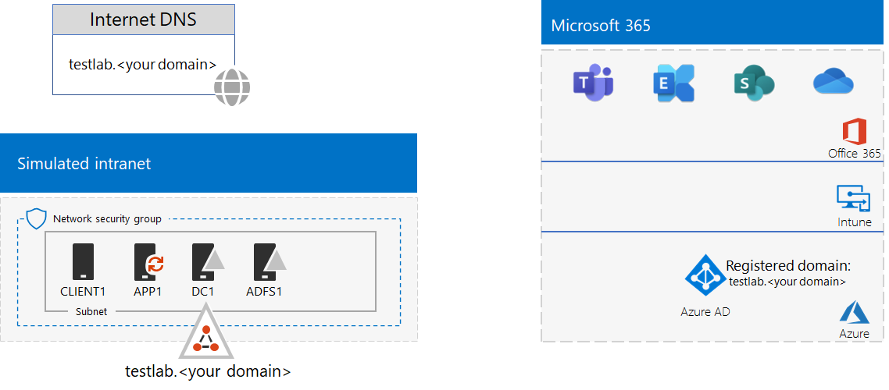

# <a name="federated-identity-for-your-microsoft-365-test-environment"></a>Federatieve identiteit voor uw Microsoft 365-testomgeving

*Deze testlaborator kan worden gebruikt voor zowel Microsoft 365 voor bedrijven als Office 365 Enterprise testomgevingen.*

Microsoft 365 ondersteunt federatieve identiteit. Dit betekent dat in plaats van de validatie van referenties zelf uit te voeren, Microsoft 365 de verbindende gebruiker verwijst naar een federatieve verificatieserver die Microsoft 365 vertrouwt. Als de inloggegevens van de gebruiker correct zijn, geeft de federatieve verificatieserver een beveiligingstoken uit dat de client vervolgens naar Microsoft 365 stuurt als bewijs van verificatie. Federatieve identiteit zorgt voor de offloading en schaalbaarheid van verificatie voor een Microsoft 365-abonnement en geavanceerde verificatie- en beveiligingsscenario's.
  
In dit artikel wordt beschreven hoe u federatief verificatie configureert voor uw Microsoft 365 testomgeving, wat resulteert in het volgende:


  
Deze configuratie bestaat uit:
  
- Een Microsoft 365 E5 proefabonnement of productieabonnement.
    
- Een vereenvoudigd organisatie-intranet dat is verbonden met internet, bestaande uit vijf virtuele machines op een subnet van een virtueel Azure-netwerk (DC1, APP1, CLIENT1, ADFS1 en PROXY1). Azure AD Verbinding maken wordt uitgevoerd op APP1 om de lijst met accounts in het domein Active Directory Domain Services te synchroniseren met Microsoft 365. PROXY1 ontvangt de binnenkomende verificatieaanvragen. ADFS1 valideert referenties met DC1 en beveiligingstokens.
    
Het instellen van deze testomgeving bestaat uit vijf fasen:
- [Fase 1: wachtwoord-hash-synchronisatie configureren voor uw Microsoft 365-testomgeving](#phase-1-configure-password-hash-synchronization-for-your-microsoft-365-test-environment)
- [Fase 2: maak de AD FS-server](#phase-2-create-the-ad-fs-server)
- [Fase 3: de webproxyserver maken](#phase-3-create-the-web-proxy-server)
- [Fase 4: maak een zelfondertekend certificaat en configureer ADFS1 en PROXY1.](#phase-4-create-a-self-signed-certificate-and-configure-adfs1-and-proxy1)
- [Fase 5: Office 365 configureren voor federatieve identiteit](#phase-5-configure-microsoft-365-for-federated-identity)
    
> [!NOTE]
> U kunt deze testomgeving niet configureren met een Azure Trial-abonnement.
  
## <a name="phase-1-configure-password-hash-synchronization-for-your-microsoft-365-test-environment"></a>Fase 1: wachtwoord-hash-synchronisatie configureren voor uw Microsoft 365-testomgeving

Volg de instructies in [wachtwoord-hash-synchronisatie voor Microsoft 365](password-hash-sync-m365-ent-test-environment.md). De resulterende configuratie ziet er als volgende uit:
  

  
Deze configuratie bestaat uit:
  
- Een Microsoft 365 E5 proefabonnement of betaalde abonnementen.
- Een vereenvoudigd intranet van de organisatie dat is verbonden met internet, bestaande uit de virtuele DC1-, APP1- en CLIENT1-machines op een subnet van een virtueel Azure-netwerk. Azure AD Verbinding maken wordt uitgevoerd op APP1 om het AD DS-domein (TESTLAB Active Directory Domain Services) regelmatig te synchroniseren met de Azure AD-tenant van uw Microsoft 365-abonnementen.

## <a name="phase-2-create-the-ad-fs-server"></a>Fase 2: maak de AD FS-server

Een AD FS-server biedt federatieve verificatie tussen Microsoft 365 en de accounts in het corp.contoso.com-domein dat wordt gehost op DC1.
  
Als u een virtuele machine van Azure wilt maken voor ADFS1, vult u de naam van uw abonnement, de bronnengroep en de Azure-locatie voor uw basisconfiguratie in en voert u deze opdrachten uit op de opdrachtprompt van de Azure PowerShell op uw lokale computer.
  
```powershell
$subscrName="<your Azure subscription name>"
$rgName="<the resource group name of your Base Configuration>"
$vnetName="TlgBaseConfig-01-VNET"
# NOTE: If you built your simulated intranet with Azure PowerShell, comment the previous line with a "#" and remove the "#" from the next line.
#$vnetName="TestLab"
Connect-AzAccount
Select-AzSubscription -SubscriptionName $subscrName
$staticIP="10.0.0.100"
$locName=(Get-AzResourceGroup -Name $rgName).Location
$vnet=Get-AzVirtualNetwork -Name $vnetName -ResourceGroupName $rgName
$pip = New-AzPublicIpAddress -Name ADFS1-PIP -ResourceGroupName $rgName -Location $locName -AllocationMethod Dynamic
$nic = New-AzNetworkInterface -Name ADFS1-NIC -ResourceGroupName $rgName -Location $locName -SubnetId $vnet.Subnets[0].Id -PublicIpAddressId $pip.Id -PrivateIpAddress $staticIP
$vm=New-AzVMConfig -VMName ADFS1 -VMSize Standard_D2_v2
$cred=Get-Credential -Message "Type the name and password of the local administrator account for ADFS1."
$vm=Set-AzVMOperatingSystem -VM $vm -Windows -ComputerName ADFS1 -Credential $cred -ProvisionVMAgent -EnableAutoUpdate
$vm=Set-AzVMSourceImage -VM $vm -PublisherName MicrosoftWindowsServer -Offer WindowsServer -Skus 2016-Datacenter -Version "latest"
$vm=Add-AzVMNetworkInterface -VM $vm -Id $nic.Id
$vm=Set-AzVMOSDisk -VM $vm -Name "ADFS-OS" -DiskSizeInGB 128 -CreateOption FromImage -StorageAccountType "Standard_LRS"
New-AzVM -ResourceGroupName $rgName -Location $locName -VM $vm
```

Gebruik vervolgens de [Azure-portal](https://portal.azure.com) om verbinding te maken met de ADFS1 virtuele machine met behulp van de ADFS1-naam en het wachtwoord van de lokale beheerdersaccount, en open vervolgens een Windows PowerShell-opdrachtprompt.
  
Als u de naamresolutie en de netwerkcommunicatie tussen ADFS1 en DC1 wilt controleren, voert u de opdracht **ping dc1.corp.contoso.com** uit en controleert u of er vier antwoorden zijn.
  
Vervolgens voegt u de virtuele machine ADFS1 toe aan het CORP-domein met deze opdrachten bij de Windows PowerShell-prompt op ADFS1.
  
```powershell
$cred=Get-Credential -UserName "CORP\User1" -Message "Type the User1 account password."
Add-Computer -DomainName corp.contoso.com -Credential $cred
Restart-Computer
```

De resulterende configuratie ziet er als volgende uit:
  

  
## <a name="phase-3-create-the-web-proxy-server"></a>Fase 3: de webproxyserver maken

PROXY1 biedt proxy van authenticatieberichten tussen gebruikers die proberen te authenticeren en ADFS1.
  
Als u een virtuele machine van Azure wilt maken voor PROXY1, vult u de naam van de resourcegroep en de Azure-locatie in en voert u deze opdrachten uit op de opdrachtprompt van de Azure PowerShell op uw lokale computer.
  
```powershell
$rgName="<the resource group name of your Base Configuration>"
$vnetName="TlgBaseConfig-01-VNET"
# NOTE: If you built your simulated intranet with Azure PowerShell, comment the previous line with a "#" and remove the "#" from the next line.
#$vnetName="TestLab"
$staticIP="10.0.0.101"
$locName=(Get-AzResourceGroup -Name $rgName).Location
$vnet=Get-AzVirtualNetwork -Name $vnetName -ResourceGroupName $rgName
$pip = New-AzPublicIpAddress -Name PROXY1-PIP -ResourceGroupName $rgName -Location $locName -AllocationMethod Static
$nic = New-AzNetworkInterface -Name PROXY1-NIC -ResourceGroupName $rgName -Location $locName -SubnetId $vnet.Subnets[0].Id -PublicIpAddressId $pip.Id -PrivateIpAddress $staticIP
$vm=New-AzVMConfig -VMName PROXY1 -VMSize Standard_D2_v2
$cred=Get-Credential -Message "Type the name and password of the local administrator account for PROXY1."
$vm=Set-AzVMOperatingSystem -VM $vm -Windows -ComputerName PROXY1 -Credential $cred -ProvisionVMAgent -EnableAutoUpdate
$vm=Set-AzVMSourceImage -VM $vm -PublisherName MicrosoftWindowsServer -Offer WindowsServer -Skus 2016-Datacenter -Version "latest"
$vm=Add-AzVMNetworkInterface -VM $vm -Id $nic.Id
$vm=Set-AzVMOSDisk -VM $vm -Name "PROXY1-OS" -DiskSizeInGB 128 -CreateOption FromImage -StorageAccountType "Standard_LRS"
New-AzVM -ResourceGroupName $rgName -Location $locName -VM $vm
```

> [!NOTE]
> PROXY1 krijgt een statisch openbaar IP-adres toegewezen, omdat u een openbaar DNS-record maakt dat ernaar verwijst en het niet mag veranderen wanneer u de virtuele machine PROXY1 opnieuw opstart.
  
Voeg vervolgens een regel toe aan de netwerkbeveiligingsgroep voor het CorpNet-subnet om ongevraagd binnenkomende verkeer van internet toe te staan aan het persoonlijke IP-adres van PROXY1 en TCP-poort 443. Voer deze opdrachten uit vanaf de opdrachtprompt van Azure PowerShell op uw lokale computer.
  
```powershell
$rgName="<the resource group name of your Base Configuration>"
Get-AzNetworkSecurityGroup -Name CorpNet -ResourceGroupName $rgName | Add-AzNetworkSecurityRuleConfig -Name "HTTPS-to-PROXY1" -Description "Allow TCP 443 to PROXY1" -Access "Allow" -Protocol "Tcp" -Direction "Inbound" -Priority 101 -SourceAddressPrefix "Internet" -SourcePortRange "*" -DestinationAddressPrefix "10.0.0.101" -DestinationPortRange "443" | Set-AzNetworkSecurityGroup
```

Gebruik vervolgens de [Azure-portal](https://portal.azure.com) om verbinding te maken met de virtuele machine PROXY1 met behulp van de PROXY1-naam en het wachtwoord van de lokale beheerdersaccount, en open vervolgens een Windows PowerShell-opdrachtprompt op PROXY1.
  
Als u de naamresolutie en de netwerkcommunicatie tussen PROXY1 en DC1 wilt controleren, voert u de opdracht **ping dc1.corp.contoso.com** uit en controleert u of er vier antwoorden zijn.
  
Vervolgens voegt u de virtuele machine PROXY1 toe aan het CORP-domein met deze opdrachten bij de Windows PowerShell-prompt op PROXY1.
  
```powershell
$cred=Get-Credential -UserName "CORP\User1" -Message "Type the User1 account password."
Add-Computer -DomainName corp.contoso.com -Credential $cred
Restart-Computer
```

Het openbare IP-adres van PROXY1 weergeven met deze Azure PowerShell opdrachten op uw lokale computer.
  
```powershell
Write-Host (Get-AzPublicIpaddress -Name "PROXY1-PIP" -ResourceGroup $rgName).IPAddress
```

Werk vervolgens met uw openbare DNS-provider om een nieuw openbaar DNS A-record aan te maken voor **fs.testlab.**\<*your DNS domain name*> dat wordt omgezet naar het IP-adres dat wordt weergegeven door de **Write-Host**. De **fs.testlab.**\<*your DNS domain name*> wordt hierna de *federatiedienst FQDN* genoemd.
  
Gebruik vervolgens de [Azure-portal](https://portal.azure.com) om verbinding te maken met de virtuele machine DC1 met behulp van de CORP\\gebruiker1-referenties en voer vervolgens de volgende opdrachten uit op een Windows PowerShell-opdrachtprompt op beheerdersniveau:
  
```powershell
Add-DnsServerPrimaryZone -Name corp.contoso.com -ZoneFile corp.contoso.com.dns
Add-DnsServerResourceRecordA -Name "fs" -ZoneName corp.contoso.com -AllowUpdateAny -IPv4Address "10.0.0.100" -TimeToLive 01:00:00
```
Met deze opdrachten wordt een interne DNS A-record gemaakt, zodat virtuele machines in het virtuele Azure-netwerk de interne federatieservice FQDN kunnen oplossen naar het persoonlijke IP-adres van ADFS1.
  
De resulterende configuratie ziet er als volgende uit:
  

  
## <a name="phase-4-create-a-self-signed-certificate-and-configure-adfs1-and-proxy1"></a>Fase 4: maak een zelfondertekend certificaat en configureer ADFS1 en PROXY1.

In deze fase maakt u een zelfondertekend digitaal certificaat voor de FQDN van de federatieservice en configureert u ADFS1 en PROXY1 als een AD FS-farm.
  
Gebruik eerst de [Azure-portal](https://portal.azure.com) om verbinding te maken met de virtuele DC1-machine met de referenties voor CORP\\gebruiker1 en open vervolgens een opdrachtprompt op beheerdersniveau in Windows PowerShell.
  
Maak vervolgens een AD FS-serviceaccount met deze opdracht bij Windows PowerShell opdrachtprompt in DC1:
  
```powershell
New-ADUser -SamAccountName ADFS-Service -AccountPassword (read-host "Set user password" -assecurestring) -name "ADFS-Service" -enabled $true -PasswordNeverExpires $true -ChangePasswordAtLogon $false
```
Met deze opdracht wordt u gevraagd het wachtwoord van het account op te geven. Kies een sterk wachtwoord en sla dit op in een beveiligde locatie. U hebt deze nodig voor deze fase en voor fase 5.
  
Gebruik de [Azure-Portal](https://portal.azure.com) om verbinding te maken met de virtuele ADFS1-computer met de accountreferenties voor CORP\\gebruiker1. Open een Windows PowerShell-opdrachtprompt op beheerdersniveau op ADFS1, vul de FQDN van de federatiedienst in en voer vervolgens deze opdrachten uit om een zelfondertekend certificaat te maken:
  
```powershell
$fedServiceFQDN="<federation service FQDN>"
New-SelfSignedCertificate -DnsName $fedServiceFQDN -CertStoreLocation "cert:\LocalMachine\My"
New-Item -path c:\Certs -type directory
New-SmbShare -name Certs -path c:\Certs -changeaccess CORP\User1
```

Gebruik vervolgens deze stappen om het nieuwe, zelfondertekend certificaat als een bestand op te slaan.
  
1. Selecteer **Start,** typ **mmc.exe** en druk vervolgens op **Enter**.
    
2. Selecteer **Bestand**  >  **toevoegen/verwijderen Vastmaken-in**.
    
3. Dubbelklik in **Vastmaken-invoeg-ins** op Certificaten **in** de lijst met beschikbare modulen, selecteer **Computeraccount** en selecteer **Volgende.**
    
4. Selecteer **in Computer** selecteren de optie **Voltooien** en selecteer **ok.**
    
5. Open in het structuurvenster **certificaten (lokale computer) > persoonlijk > certificaten**.
    
6. Selecteer en houd het certificaat ingedrukt (of klik erop met de rechtermuisknop) met uw federatieservice FQDN, selecteer **Alle** taken en selecteer **vervolgens Exporteren.**
    
7. Selecteer volgende op **de** **welkomstpagina.**
    
8. Selecteer op **de pagina Privésleutel** exporteren de optie **Ja** en selecteer vervolgens **Volgende.**
    
9. Selecteer op **de pagina Bestandsindeling** exporteren de optie **Alle uitgebreide eigenschappen exporteren** en selecteer vervolgens **Volgende.**
    
10. Selecteer wachtwoord **op de** pagina Beveiliging **en** voer een wachtwoord in **Wachtwoord** en Wachtwoord **bevestigen in.**
    
11. Selecteer bladeren **op de pagina** Bestand om te **exporteren.**
    
12. Blader naar de **map C: \\ Certs,** voer **SSL** in **Bestandsnaam** in en selecteer **Opslaan.**
    
13. Selecteer op **de pagina Bestand naar exporteren** de optie **Volgende**.
    
14. Selecteer Op **de pagina De wizard Certificaat exporteren voltooien** de optie **Voltooien.** Wanneer u daarom wordt gevraagd, **selecteert** u OK .
    
Installeer vervolgens de AD FS-service met deze opdracht met de Windows PowerShell-opdrachtprompt op ADFS1:
  
```powershell
Install-WindowsFeature ADFS-Federation -IncludeManagementTools
```

Wacht totdat de installatie is voltooid.
  
Configureer vervolgens de AD FS-service met de volgende stappen:
  
1. Selecteer **Start** en selecteer vervolgens het **pictogram Serverbeheer.**
    
2. Selecteer AD FS in het boomvenster van **Serverbeheer.**
    
3. Selecteer in de werkbalk bovenaan het oranje waarschuwingssymbool en selecteer vervolgens **De federatieservice configureren op deze server.**
    
4. Selecteer volgende op **de** welkomstpagina van de wizard Configuratie van Active Directory Federation **Services.**
    
5. Selecteer Op **de Verbinding maken naar AD DS** de optie **Volgende.**
    
6. Op de pagina **service-eigenschappen opgeven** pagina:
    
  - Voor **SSL-certificaat** selecteert u de pijl-omlaag en selecteert u het certificaat met de naam van uw federatieservice FQDN.
    
  - Voer **in Federatieserviceweergavenaam** de naam in van uw fictieve organisatie.
    
  - Selecteer **Volgende**.
    
7. Selecteer op **de pagina Serviceaccount** opgeven **de optie Selecteren** voor **accountnaam**.
    
8. Voer **in Gebruikers- of Serviceaccount selecteren** **ADFS-Service in,** selecteer **Namen controleren** en selecteer **OK.**
    
9. Voer **in Accountwachtwoord** het wachtwoord voor het ADFS-Service account in en selecteer **volgende**.
    
10. Selecteer op **de pagina Configuratiedatabase** opgeven de optie **Volgende**.
    
11. Selecteer op **de pagina Revisieopties** de optie **Volgende**.
    
12. Selecteer **configureren op de** pagina Vereiste **controles.**

13. Selecteer op **de** pagina Resultaten de optie **Sluiten.**
    
14. Selecteer **Start,** selecteer het power icon, selecteer **Opnieuw** starten en selecteer **vervolgens Doorgaan.**
    
Maak vanuit de [Azure-portal](https://portal.azure.com) verbinding met PROXY1 met de CORP\\gebruiker1-accountreferenties.
  
Voer vervolgens deze stappen uit om het zelfondertekende certificaat te installeren op **zowel PROXY1 als APP1**.
  
1. Selecteer **Start,** typ **mmc.exe** en druk vervolgens op **Enter**.
    
2. Selecteer **Bestand > Invoeg-/Vastmaken-in.**
    
3. Dubbelklik in **Vastmaken-invoeg-ins** op Certificaten **in** de lijst met beschikbare modulen, selecteer **Computeraccount** en selecteer **Volgende.**
    
4. Selecteer **in Computer** selecteren de optie **Voltooien** en selecteer **ok.**
    
5. Open in het deelvenster Structuur **certificaten (lokale computer)**  >    >  **Persoonlijke certificaten**.
    
6. Selecteer en houd persoonlijk ingedrukt (of klik erop **met** de rechtermuisknop), selecteer **Alle taken** en selecteer **vervolgens Importeren.**
    
7. Selecteer volgende op **de** **welkomstpagina.**
    
8. Voer op **de pagina** Bestand om te importeren **\\ \\ adfs1 \\ \\ certs ssl.pfx** in en selecteer **volgende**.
    
9. Voer op **de pagina Persoonlijke** sleutelbeveiliging het certificaatwachtwoord in **Wachtwoord** in en selecteer **volgende.**
    
10. Selecteer Volgende op de pagina **Certificaatopslag.** 
    
11. Selecteer op **de pagina Voltooien** de optie **Voltooien.**
    
12. Selecteer op **de pagina Certificaatopslag** de optie **Volgende**.
    
13. Wanneer u daarom wordt gevraagd, **selecteert** u OK .
    
14. Selecteer certificaten in het deelvenster **Structuur.**
    
15. Selecteer en houd het certificaat ingedrukt (of klik er met de rechtermuisknop op) en selecteer **vervolgens Kopiëren.**
    
16. Open in het deelvenster Structuur **certificaten voor vertrouwde hoofdcertificeringsinstanties.**  >  
    
17. Verplaats de muisaanwijzer onder de lijst met geïnstalleerde certificaten, selecteer en houd vast (of klik met de rechtermuisknop) en selecteer **plakken.**
    
Open een PowerShell-opdrachtprompt op beheerdersniveau en voer de volgende opdracht uit:
  
```powershell
Install-WindowsFeature Web-Application-Proxy -IncludeManagementTools
```

Wacht totdat de installatie is voltooid.
  
Gebruik de volgende stappen om de service webtoepassingsproxy zo te configureren dat ADFS1 als federatieserver wordt gebruikt:
  
1. Selecteer **Start** en selecteer **vervolgens Serverbeheer.**
    
2. Selecteer in het deelvenster Boom de optie **Externe toegang.**
    
3. Selecteer in de werkbalk bovenaan het oranje waarschuwingssymbool en selecteer vervolgens De wizard **Proxy voor webtoepassing openen.**
    
4. Selecteer volgende op **de** welkomstpagina van de wizard Proxyconfiguratie voor webtoepassing. 
    
5. Op de pagina **federatieserver**:
    
  - Voer in **het vak Federatieservicenaam** uw federatieservice FQDN in.
    
  - Voer in **het vak** Gebruikersnaam **CORP \\ User1 in.**
    
  - Voer in **het** vak Wachtwoord het wachtwoord voor het Gebruikers1-account in.
    
  - Selecteer **Volgende**.
    
6. Selecteer op **de pagina AD FS-proxycertificaat** de pijl-omlaag, selecteer het certificaat met uw federatieservice FQDN en selecteer **volgende**.
    
7. Selecteer op **de** pagina Bevestiging de optie **Configureren.**
    
8. Selecteer op **de** pagina Resultaten de optie **Sluiten.**
    
## <a name="phase-5-configure-microsoft-365-for-federated-identity"></a>Fase 5: Office 365 configureren voor federatieve identiteit

Gebruik de [Azure-Portal](https://portal.azure.com) om verbinding te maken met de virtuele APP1-computer met de accountreferenties voor CORP\\gebruiker1.
  
Volg deze stappen voor het configureren van Azure AD Connect en uw Microsoft 365-abonnement voor federatieve verificatie:
  
1. Dubbelklik op het bureaublad op **Azure AD Connect**.
    
2. Selecteer op **de pagina Welkom bij Azure AD Verbinding maken** de optie **Configureren.**
    
3. Selecteer op **de pagina** Extra taken de optie Gebruikers **aanmelden wijzigen** en selecteer vervolgens **Volgende**.
    
4. Voer op **Verbinding maken pagina Naar Azure AD** de naam en het wachtwoord van uw globale beheerdersaccount in en selecteer **Volgende**.
    
5. Selecteer federatie met **AD FS** op de **pagina** Aanmelding van gebruiker en selecteer vervolgens **Volgende**.
    
6. Selecteer op **de pagina AD FS-farm** de optie Een bestaande **AD FS-farm** gebruiken, voer **ADFS1** in het vak **Servernaam** in en selecteer **volgende**.
    
7. Wanneer u wordt gevraagd om serverreferenties, voert u de referenties van het CORP \\ User1-account in en selecteert u **OK**.
    
8. Voer op de **pagina Referenties** van domeinbeheerder  **CORP \\ Gebruiker1** in het  vak Gebruikersnaam in, voer het accountwachtwoord in het vak Wachtwoord in en selecteer **Volgende.**
    
9. Voer op de pagina AD   **FS-serviceaccount** **CORP \\ ADFS-Service** in het vak Domeinnaam in, voer het accountwachtwoord in het vak Wachtwoord van domeingebruiker in en selecteer **Volgende**.
    
10. Selecteer op **de pagina Azure AD Domain** in **Domein** de naam van het domein dat u eerder hebt gemaakt en toegevoegd aan uw abonnement in fase 1 en selecteer **vervolgens Volgende**.
    
11. Selecteer **configureren** op de pagina Gereed om te **configureren.**
    
12. Selecteer op **de pagina Installatie** voltooid de optie **Verifiëren.**
    
    U ziet berichten waarin wordt aangegeven dat zowel het intranet als de internetconfiguratie is geverifieerd.
    
13. Selecteer op **de pagina Installatie** voltooid de optie **Afsluiten.**
    
Om aan te tonen dat federatieve verificatie werkt:
  
1. Open een nieuwe privétab van uw browser op uw lokale computer en ga naar [https://admin.microsoft.com](https://admin.microsoft.com).
    
2. Voer voor de aanmeldingsreferenties **user1@.** \<*the domain created in Phase 1*>
    
    Als uw testdomein bijvoorbeeld is **testlab.contoso.com,** voert u 'user1@testlab.contoso.com' in. Druk op **de Tab-toets** of Microsoft 365 u automatisch omleiden.
    
    U zou nu een pagina moeten zien met **Uw verbinding is niet privé**. U ziet dit omdat u een zelf ondertekend certificaat hebt geïnstalleerd op ADFS1 dat niet kan worden gevalideerd op uw desktopcomputer. Bij een productie-implementatie van federatieve verificatie gebruikt u een certificaat van een vertrouwde certificeringsinstantie en zien uw gebruikers deze pagina niet.
    
3. Selecteer op **de pagina Uw verbinding is niet privé** de optie **Geavanceerd** en selecteer vervolgens **Doorgaan naar \<*your federation service FQDN*>**. 
    
4. Ga op de pagina met de naam van uw fictieve organisatie als volgt te werk:
    
  - **CORP\\gebruiker1** voor de naam
    
  - Het wachtwoord voor het gebruiker1-account
    
    U zou de pagina van **Microsoft Office voor Thuisgebruik** moeten zien.
    
Deze procedure laat zien dat uw proefabonnement is verbonden met het AD DS corp.contoso.com-domein dat wordt gehost op DC1. Hier volgen de basisbeginselen van het verificatieproces:
  
1. Wanneer u het federatieve domein gebruikt dat u in fase 1 hebt gemaakt binnen de aanmeldingsaccountnaam, leidt Microsoft 365 uw browser om naar uw federatiediensten FQDN en PROXY1.
    
2. PROXY1 stuurt uw lokale computer naar de aanmeldingspagina voor fictief bedrijf.
    
3. Wanneer u CORP\\gebruiker1 en het wachtwoord voor PROXY1 verzendt, worden ze doorgestuurd naar ADFS1.
    
4. ADFS1 valideert CORP\\gebruiker1 en het wachtwoord met DC1 en stuurt uw lokale computer een beveiligingstoken.
    
5. Uw lokale computer verzendt het beveiligingstoken naar Microsoft 365.
    
6. Microsoft 365 valideert dat het beveiligingstoken is gemaakt door ADFS1 en biedt toegang.
    
Uw proefabonnement is nu geconfigureerd met federatieve verificatie. U kunt deze ontwikkel- en testomgeving gebruiken voor geavanceerde verificatiescenario's.
  
## <a name="next-step"></a>Volgende stap

Wanneer u klaar bent om productiegeschikte, federatief hoge beschikbaarheidsverificatie voor Microsoft 365 in Azure te implementeren, zie Federatieverificatie met hoge beschikbaarheid implementeren voor Microsoft 365 [in Azure.](deploy-high-availability-federated-authentication-for-microsoft-365-in-azure.md)
  
