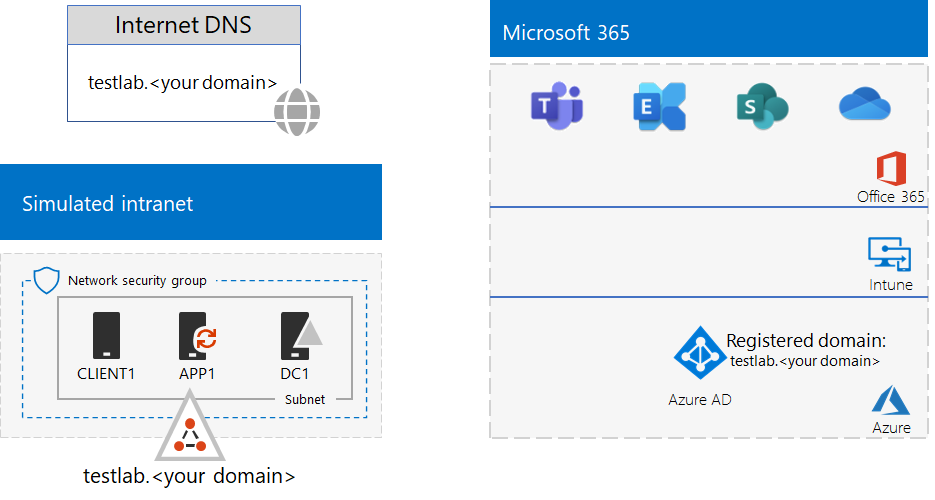

# <a name="federated-identity-for-your-microsoft-365-test-environment"></a>Federatieve identiteit voor uw Microsoft 365-testomgeving

*Deze testlabrichtlijnen kunnen worden gebruikt voor zowel Microsoft 365 Enterprise- als Office 365 Enterprise-testomgevingen.*

Microsoft 365 ondersteunt federatieve identiteit. Dit betekent dat in plaats van de validatie van referenties zelf uit te voeren, Microsoft 365 de verbindende gebruiker verwijst naar een federatieve verificatieserver die Microsoft 365 vertrouwt. Als de inloggegevens van de gebruiker correct zijn, geeft de federatieve verificatieserver een beveiligingstoken uit dat de client vervolgens naar Microsoft 365 stuurt als bewijs van verificatie. Federatieve identiteit zorgt voor de offloading en schaalbaarheid van verificatie voor een Microsoft 365-abonnement en geavanceerde verificatie- en beveiligingsscenario's.
  
In dit artikel wordt beschreven hoe u federatieve verificatie kunt configureren voor uw Microsoft 365- of Office 365-testomgeving, wat resulteert in het volgende:


  
Deze configuratie bestaat uit: 
  
- Een proef- of betaald abonnement op Microsoft 365 E5 of Office 365 E5.
    
- Een vereenvoudigde organisatie die via intranet is verbonden met internet, bestaande uit vijf virtuele machines op een subnet van een virtueel Azure-netwerk (DC1, APP1, CLIENT1, ADFS1 en PROXY1). Azure AD Connect wordt uitgevoerd op APP1 om de lijst met accounts in het Active Directory Domain Services-domein te synchroniseren met Office 365. PROXY1 ontvangt de binnenkomende verificatieaanvragen. ADFS1 valideert referenties met DC1 en beveiligingstokens.
    
Er zijn vijf fasen om deze testomgeving in te stellen:
  
1. Maak de gesimuleerde bedrijfstestomgeving met wachtwoord-hash-synchronisatie.
    
2. Maak de AD FS-server (ADFS1).
    
3. Maak de webproxyserver (PROXY1).
    
4. Maak een zelfondertekend certificaat en configureer ADFS1 en PROXY1.
    
5. Configureer Microsoft 365 voor federatieve identiteit.
    
> [!NOTE]
> U kunt deze testomgeving niet configureren met een Azure-proefabonnement. 
  
## <a name="phase-1-configure-password-hash-synchronization-for-your-microsoft-365-test-environment"></a>Fase 1: wachtwoord-hash-synchronisatie configureren voor uw Microsoft 365-testomgeving

Volg de instructies in [wachtwoord-hash-synchronisatie voor Microsoft 365](password-hash-sync-m365-ent-test-environment.md). Dit is de resulterende configuratie.
  

  
Deze configuratie bestaat uit: 
  
- Een proef- of betaald abonnement op Microsoft 365 E5 of Office 365 E5.
- Een vereenvoudigd intranet van de organisatie verbonden met internet en bestaande uit de virtuele machines DC1, APP1 en CLIENT1 op een subnet van een virtueel Azure-netwerk. Azure AD Connect wordt uitgevoerd op APP1 om het AD DS-domein TESTLAB te synchroniseren met de Azure AD-tenant van uw Microsoft 365-abonnementen.

## <a name="phase-2-create-the-ad-fs-server"></a>Fase 2: maak de AD FS-server

Een AD FS-server biedt federatieve verificatie tussen Microsoft 365 en de accounts in het corp.contoso.com-domein dat wordt gehost op DC1.
  
Als u een virtuele machine van Azure wilt maken voor ADFS1, vult u de naam van uw abonnement, de bronnengroep en de Azure-locatie voor uw basisconfiguratie in en voert u deze opdrachten uit op de opdrachtprompt van de Azure PowerShell op uw lokale computer.
  
```powershell
$subscrName="<your Azure subscription name>"
$rgName="<the resource group name of your Base Configuration>"
$vnetName="TlgBaseConfig-01-VNET"
# NOTE: If you built your simulated intranet with Azure PowerShell, comment the previous line with a "#" and remove the "#" from the next line.
#$vnetName="TestLab"
Connect-AzAccount
Select-AzSubscription -SubscriptionName $subscrName
$staticIP="10.0.0.100"
$locName=(Get-AzResourceGroup -Name $rgName).Location
$vnet=Get-AzVirtualNetwork -Name $vnetName -ResourceGroupName $rgName
$pip = New-AzPublicIpAddress -Name ADFS1-PIP -ResourceGroupName $rgName -Location $locName -AllocationMethod Dynamic
$nic = New-AzNetworkInterface -Name ADFS1-NIC -ResourceGroupName $rgName -Location $locName -SubnetId $vnet.Subnets[0].Id -PublicIpAddressId $pip.Id -PrivateIpAddress $staticIP
$vm=New-AzVMConfig -VMName ADFS1 -VMSize Standard_D2_v2
$cred=Get-Credential -Message "Type the name and password of the local administrator account for ADFS1."
$vm=Set-AzVMOperatingSystem -VM $vm -Windows -ComputerName ADFS1 -Credential $cred -ProvisionVMAgent -EnableAutoUpdate
$vm=Set-AzVMSourceImage -VM $vm -PublisherName MicrosoftWindowsServer -Offer WindowsServer -Skus 2016-Datacenter -Version "latest"
$vm=Add-AzVMNetworkInterface -VM $vm -Id $nic.Id
$vm=Set-AzVMOSDisk -VM $vm -Name "ADFS-OS" -DiskSizeInGB 128 -CreateOption FromImage -StorageAccountType "Standard_LRS"
New-AzVM -ResourceGroupName $rgName -Location $locName -VM $vm
```

Gebruik vervolgens de [Azure-portal](https://portal.azure.com) om verbinding te maken met de ADFS1 virtuele machine met behulp van de ADFS1-naam en het wachtwoord van de lokale beheerdersaccount, en open vervolgens een Windows PowerShell-opdrachtprompt.
  
Als u de naamresolutie en de netwerkcommunicatie tussen ADFS1 en DC1 wilt controleren, voert u de opdracht **ping dc1.corp.contoso.com** uit en controleert u of er vier antwoorden zijn.
  
Vervolgens voegt u de virtuele machine ADFS1 toe aan het CORP-domein met deze opdrachten bij de Windows PowerShell-prompt op ADFS1.
  
```powershell
$cred=Get-Credential -UserName "CORP\User1" -Message "Type the User1 account password."
Add-Computer -DomainName corp.contoso.com -Credential $cred
Restart-Computer
```

Dit is de resulterende configuratie.
  

  
## <a name="phase-3-create-the-web-proxy-server"></a>Fase 3: de webproxyserver maken

PROXY1 biedt proxy van authenticatieberichten tussen gebruikers die proberen te authenticeren en ADFS1.
  
Als u een virtuele machine van Azure wilt maken voor PROXY1, vult u de naam van de resourcegroep en de Azure-locatie in en voert u deze opdrachten uit op de opdrachtprompt van de Azure PowerShell op uw lokale computer.
  
```powershell
$rgName="<the resource group name of your Base Configuration>"
$vnetName="TlgBaseConfig-01-VNET"
# NOTE: If you built your simulated intranet with Azure PowerShell, comment the previous line with a "#" and remove the "#" from the next line.
#$vnetName="TestLab"
$staticIP="10.0.0.101"
$locName=(Get-AzResourceGroup -Name $rgName).Location
$vnet=Get-AzVirtualNetwork -Name $vnetName -ResourceGroupName $rgName
$pip = New-AzPublicIpAddress -Name PROXY1-PIP -ResourceGroupName $rgName -Location $locName -AllocationMethod Static
$nic = New-AzNetworkInterface -Name PROXY1-NIC -ResourceGroupName $rgName -Location $locName -SubnetId $vnet.Subnets[0].Id -PublicIpAddressId $pip.Id -PrivateIpAddress $staticIP
$vm=New-AzVMConfig -VMName PROXY1 -VMSize Standard_D2_v2
$cred=Get-Credential -Message "Type the name and password of the local administrator account for PROXY1."
$vm=Set-AzVMOperatingSystem -VM $vm -Windows -ComputerName PROXY1 -Credential $cred -ProvisionVMAgent -EnableAutoUpdate
$vm=Set-AzVMSourceImage -VM $vm -PublisherName MicrosoftWindowsServer -Offer WindowsServer -Skus 2016-Datacenter -Version "latest"
$vm=Add-AzVMNetworkInterface -VM $vm -Id $nic.Id
$vm=Set-AzVMOSDisk -VM $vm -Name "PROXY1-OS" -DiskSizeInGB 128 -CreateOption FromImage -StorageAccountType "Standard_LRS"
New-AzVM -ResourceGroupName $rgName -Location $locName -VM $vm
```

> [!NOTE]
> PROXY1 krijgt een statisch openbaar IP-adres toegewezen, omdat u een openbaar DNS-record maakt dat ernaar verwijst en het niet mag veranderen wanneer u de virtuele machine PROXY1 opnieuw opstart. 
  
Voeg vervolgens een regel toe aan de netwerkbeveiligingsgroep voor het CorpNet-subnet om ongevraagd inkomend verkeer van internet naar het privé IP-adres van PROXY1 en TCP-poort 443 toe te staan. Voer deze opdrachten uit vanaf de opdrachtprompt van Azure PowerShell op uw lokale computer.
  
```powershell
$rgName="<the resource group name of your Base Configuration>"
Get-AzNetworkSecurityGroup -Name CorpNet -ResourceGroupName $rgName | Add-AzNetworkSecurityRuleConfig -Name "HTTPS-to-PROXY1" -Description "Allow TCP 443 to PROXY1" -Access "Allow" -Protocol "Tcp" -Direction "Inbound" -Priority 101 -SourceAddressPrefix "Internet" -SourcePortRange "*" -DestinationAddressPrefix "10.0.0.101" -DestinationPortRange "443" | Set-AzNetworkSecurityGroup
```

Gebruik vervolgens de [Azure-portal](https://portal.azure.com) om verbinding te maken met de virtuele machine PROXY1 met behulp van de PROXY1-naam en het wachtwoord van de lokale beheerdersaccount, en open vervolgens een Windows PowerShell-opdrachtprompt op PROXY1.
  
Als u de naamresolutie en de netwerkcommunicatie tussen PROXY1 en DC1 wilt controleren, voert u de opdracht **ping dc1.corp.contoso.com** uit en controleert u of er vier antwoorden zijn.
  
Vervolgens voegt u de virtuele machine PROXY1 toe aan het CORP-domein met deze opdrachten bij de Windows PowerShell-prompt op PROXY1.
  
```powershell
$cred=Get-Credential -UserName "CORP\User1" -Message "Type the User1 account password."
Add-Computer -DomainName corp.contoso.com -Credential $cred
Restart-Computer
```

Geef het openbare IP-adres van PROXY1 weer met deze Azure PowerShell-opdrachten op uw lokale computer:
  
```powershell
Write-Host (Get-AzPublicIpaddress -Name "PROXY1-PIP" -ResourceGroup $rgName).IPAddress
```

Werk vervolgens met uw openbare DNS-provider om een nieuw openbaar DNS A-record aan te maken voor **fs.testlab.**\<your DNS domain name> dat wordt omgezet naar het IP-adres dat wordt weergegeven door de **Write-Host**. De **fs.testlab.**\<your DNS domain name> wordt hierna de *federatiedienst FQDN* genoemd.
  
Gebruik vervolgens de [Azure-portal](https://portal.azure.com) om verbinding te maken met de virtuele machine DC1 met behulp van de CORP\\gebruiker1-referenties en voer vervolgens de volgende opdrachten uit op een Windows PowerShell-opdrachtprompt op beheerdersniveau:
  
```powershell
Add-DnsServerPrimaryZone -Name corp.contoso.com -ZoneFile corp.contoso.com.dns
Add-DnsServerResourceRecordA -Name "fs" -ZoneName corp.contoso.com -AllowUpdateAny -IPv4Address "10.0.0.100" -TimeToLive 01:00:00
```
Met deze opdrachten maakt u een intern DNS A-record zodat virtuele machines op het virtuele Azure-netwerk de interne federatie FQDN kunnen omzetten in het privé IP-adres van ADFS1.
  
Dit is de resulterende configuratie.
  

  
## <a name="phase-4-create-a-self-signed-certificate-and-configure-adfs1-and-proxy1"></a>Fase 4: maak een zelfondertekend certificaat en configureer ADFS1 en PROXY1.

In deze fase maakt u een zelfondertekend digitaal certificaat voor de FQDN van de federatieservice en configureert u ADFS1 en PROXY1 als een AD FS-farm.
  
Gebruik eerst de [Azure-portal](https://portal.azure.com) om verbinding te maken met de virtuele DC1-machine met de referenties voor CORP\\gebruiker1 en open vervolgens een opdrachtprompt op beheerdersniveau in Windows PowerShell.
  
Maak vervolgens een AD FS-serviceaccount met deze opdracht met de Windows PowerShell-opdrachtprompt op DC1:
  
```powershell
New-ADUser -SamAccountName ADFS-Service -AccountPassword (read-host "Set user password" -assecurestring) -name "ADFS-Service" -enabled $true -PasswordNeverExpires $true -ChangePasswordAtLogon $false
```
Met deze opdracht wordt u gevraagd het wachtwoord van het account op te geven. Kies een sterk wachtwoord en sla dit op in een beveiligde locatie. U hebt het nodig voor deze fase en fase 5.
  
Gebruik de [Azure-Portal](https://portal.azure.com) om verbinding te maken met de virtuele ADFS1-computer met de accountreferenties voor CORP\\gebruiker1. Open een Windows PowerShell-opdrachtprompt op beheerdersniveau op ADFS1, vul de FQDN van de federatiedienst in en voer vervolgens deze opdrachten uit om een zelfondertekend certificaat te maken:
  
```powershell
$fedServiceFQDN="<federation service FQDN>"
New-SelfSignedCertificate -DnsName $fedServiceFQDN -CertStoreLocation "cert:\LocalMachine\My"
New-Item -path c:\Certs -type directory
New-SmbShare -name Certs -path c:\Certs -changeaccess CORP\User1
```

Gebruik vervolgens deze stappen om het nieuwe, zelfondertekend certificaat als een bestand op te slaan.
  
1. Klik op **Start**, typ **mmc.exe** en druk op **Enter**.
    
2. Klik op **Bestand > Snap-in toevoegen/verwijderen**.
    
3. Dubbelklik in **Snap-ins toevoegen of verwijderen** op **Certificaten** in de lijst met beschikbare snap-ins, klik op **Computeraccount** en klik vervolgens op **Volgende**.
    
4. Klik in **Computer selecteren** op **Voltooien** en klik vervolgens op **OK**.
    
5. Open in het structuurvenster **certificaten (lokale computer) > persoonlijk > certificaten**.
    
6. Klik met de rechtermuisknop op het certificaat met de FQDN van de federatieservice, klik op **alle taken**en klik vervolgens op **exporteren**.
    
7. Klik op **Volgende** op de **welkomstpagina**.  
    
8. Klik op de pagina **persoonlijke sleutel exporteren** op **ja**en klik vervolgens op **volgende**.
    
9. Klik op de pagina **bestandsindeling exporteren** op **alle uitgebreide eigenschappen exporteren**en klik vervolgens op **volgende**.
    
10. Klik op de pagina **beveiliging** op **wachtwoord** en typ een wachtwoord in **wachtwoord** en **wachtwoord bevestigen.**
    
11. Klik op de pagina **bestand om te exporteren** op **bladeren**.
    
12. Blader naar de map **C:\\certs**, typ **SSL** als **bestandsnaam** en klik vervolgens op **opslaan.**
    
13. Klik op de pagina **bestand om te exporteren** op **volgende**.
    
14. Klik op de pagina **wizard certificaat exporteren voltooien** op **voltooien**. Klik op **OK** wanneer u daarom wordt gevraagd.
    
Installeer vervolgens de AD FS-service met deze opdracht met de Windows PowerShell-opdrachtprompt op ADFS1:
  
```powershell
Install-WindowsFeature ADFS-Federation -IncludeManagementTools
```

Wacht totdat de installatie is voltooid.
  
Configureer vervolgens de AD FS-service met de volgende stappen:
  
1. Klik op **start**en klik vervolgens op het pictogram **serverbeheer**.
    
2. Klik in het structuurvenster van serverbeheer op **AD FS**.
    
3. Klik op de werkbalk aan de bovenkant op het oranje waarschuwingssymbool en klik vervolgens op **de federatieservice op deze server configureren**.
    
4. Klik op de **welkomstpagina** van de configuratiewizard van Active Directory Federation Services op **volgende**.
    
5. Klik op de pagina **verbinding maken met AD DS** op **volgende**.
    
6. Op de pagina **service-eigenschappen opgeven** pagina:
    
  - Voor **SSL-certificaat**klikt u op de pijl-omlaag en klikt u vervolgens op het certificaat met de naam van de FQDN van de federatieservice.
    
  - Typ in **weergavenaam van de federatieservice**de naam van uw fictieve organisatie.
    
  - Klik op **Volgende**.
    
7. Klik op de pagina **serviceaccount opgeven** op **selecteren** voor **accountnaam**.
    
8. Typ in **gebruikers- of serviceaccount selecteren****ADFS-service**, klik op **namen controleren**en klik vervolgens op **OK**.
    
9. Typ het wachtwoord voor het account van de ADFS-service in **accountwachtwoord**en klik vervolgens op **volgende**.
    
10. Klik op de pagina **configuratiedatabase opgeven** op **volgende**.
    
11. Klik op de pagina **revisieopties** op **volgende**.
    
12. Klik op de pagina **controle van de vereisten** op **configureren**.
    
13. Klik op de pagina **Resultaten** op **Voltooien**.
    
14. Klik op **start**, klik op het pictogram voor het energiebeheer, klik op **opnieuw opstarten**en klik vervolgens op **doorgaan**.
    
Maak vanuit de [Azure-portal](https://portal.azure.com) verbinding met PROXY1 met de CORP\\gebruiker1-accountreferenties.
  
Voer vervolgens deze stappen uit om het zelfondertekende certificaat te installeren op **zowel PROXY1 als APP1**.
  
1. Klik op **Start**, typ **mmc.exe** en druk op **Enter**.
    
2. Klik op **Bestand > Snap-in toevoegen/verwijderen**.
    
3. Dubbelklik in **Snap-ins toevoegen of verwijderen** op **Certificaten** in de lijst met beschikbare snap-ins, klik op **Computeraccount** en klik vervolgens op **Volgende**.
    
4. Klik in **Computer selecteren** op **Voltooien** en klik vervolgens op **OK**.
    
5. Open in het structuurvenster **certificaten (lokale computer) > persoonlijk > certificaten**.
    
6. Klik met de rechtermuisknop op **persoonlijk**, klik op **alle taken**en klik vervolgens op **importeren**.
    
7. Klik op **Volgende** op de **welkomstpagina**.  
    
8. Typ op de pagina **bestand dat u wilt importeren**, **\\\\adfs1 \\certs\\ssl.pfx** en klik op **volgende**.
    
9. Typ op de pagina **persoonlijke sleutels beveiligen** het certificaatwachtwoord in bij**wachtwoord**en klik vervolgens op **volgende.**
    
10. Klik op de pagina **certificaatarchief** op **volgende**.
    
11. Klik op de pagina **voltooien** op **voltooien**.
    
12. Klik op de pagina **certificaatarchief** op **volgende**.
    
13. Klik op **OK** wanneer u daarom wordt gevraagd.
    
14. Klik in het structuurvenster op **certificaten**.
    
15. Klik met de rechtermuisknop op het certificaat en klik vervolgens op **kopiëren**.
    
16. Open in het structuurvenster **vertrouwde basiscertificeringsinstanties > certificaten**.
    
17. Beweeg de muisaanwijzer onder de lijst met geïnstalleerde certificaten, klik er met de rechtermuisknop op en klik vervolgens op **plakken**.
    
Open een PowerShell-opdrachtprompt op beheerdersniveau en voer de volgende opdracht uit:
  
```powershell
Install-WindowsFeature Web-Application-Proxy -IncludeManagementTools
```

Wacht totdat de installatie is voltooid.
  
Gebruik de volgende stappen om de service webtoepassingsproxy zo te configureren dat ADFS1 als federatieserver wordt gebruikt:
  
1. Klik op **start**en klik vervolgens op **serverbeheer**.
    
2. Klik in het structuurvenster op **externe toegang**.
    
3. Klik op de werkbalk aan de bovenkant op het oranje waarschuwingssymbool en klik vervolgens op **de wizard webtoepassingsproxy** openen.
    
4. Klik op de **welkomstpagina** van de configuratiewizard webtoepassingsproxy op **volgende**.
    
5. Op de pagina **federatieserver**:
    
  - Typ de FQDN van de federatieservice in bij **naam van de federatieservice**.
    
  - Typ **CORP\\gebruiker1** in als **gebruikersnaam**.
    
  - Typ het wachtwoord voor het gebruiker1-account in bij **wachtwoord**.
    
  - Klik op **Volgende**.
    
6. Klik op de pagina **AD FS-proxycertificaat** op de pijl-omlaag, klik op het certificaat met de FQDN van de federatieservice en klik vervolgens op **volgende**.
    
7. Klik op de **bevestigingspagina** op **configureren**.
    
8. Klik op de pagina **Resultaten** op **Voltooien**.

    
## <a name="phase-5-configure-microsoft-365-for-federated-identity"></a>Fase 5: Office 365 configureren voor federatieve identiteit

Gebruik de [Azure-Portal](https://portal.azure.com) om verbinding te maken met de virtuele APP1-computer met de accountreferenties voor CORP\\gebruiker1.
  
Volg deze stappen voor het configureren van Azure AD Connect en uw Microsoft 365-abonnement voor federatieve verificatie:
  
1. Dubbelklik op het bureaublad op **Azure AD Connect**.
    
2. Klik op de pagina **Welkom bij Azure AD Connect** op **configureren**.
    
3. Klik op de pagina **Aanvullende taken** op **Gebruikersaanmelding wijzigen**en klik vervolgens op **Volgende**.
    
4. Typ op de pagina **verbinding maken met Azure AD** de naam en het wachtwoord van het globale beheerdersaccount en klik vervolgens op **volgende**.
    
5. Klik op de pagina **gebruikersaanmelding** op **federatie met AD FS**en klik vervolgens op **volgende**.
    
6. Klik op de pagina **AD FS-farm** op **een bestaande AD FS-farm gebruiken**, typ **ADFS1** bij **servernaam**en klik vervolgens op **volgende**.
    
7. Wanneer u wordt gevraagd om serverreferenties, voert u de referenties van het account CORP\\gebruiker1 in en klikt u op **OK**.
    
8. Typ op de referentiepagina **domeinbeheerder** de waarde **CORP\\gebruiker1** in als **gebruikersnaam** en het wachtwoord van het account bij **wachtwoord**en klik vervolgens op **volgende**.
    
9. Typ op de pagina **AD FS-serviceaccount** de waarde **CORP\\ADFS-service** als **gebruikersnaam van het domein** en het wachtwoord van het account bij **wachtwoord voor gebruikersdomein**en klik vervolgens op **volgende**.
    
10. Selecteer de naam van het domein dat u eerder hebt gemaakt en toegevoegd aan uw abonnement in fase 1 op de pagina **Azure AD-domein** bij **domein** en klik vervolgens op **volgende**.
    
11. Klik op de pagina **Gereed om te configureren** op **Configureren**.
    
12. Klik op de pagina **installeren voltooid** op **verifiëren**.
    
    U zou berichten moeten zien die aangeven dat zowel de intranet- als de internetconfiguratie is gecontroleerd.
    
13. Klik op de pagina **Installatie voltooid** op **Afsluiten**.
    
Om aan te tonen dat federatieve verificatie werkt:
  
1. Open een nieuwe privétab van uw browser op uw lokale computer en ga naar [https://admin.microsoft.com](https://admin.microsoft.com).
    
2. Typ **user1@**\<the domain created in Phase 1> voor de aanmeldingsreferenties. 
    
    Als uw testdomein bijvoorbeeld **testlab.contoso.com** is, typt u 'user1@testlab.contoso.com'. Druk op Tab of laat Microsoft 365 u automatisch omleiden.
    
    U zou nu een pagina moeten zien met **Uw verbinding is niet privé**. U ziet dit omdat u een zelfondertekend certificaat op ADFS1 heeft geïnstalleerd dat uw desktopcomputer niet kan valideren. Bij een productie-implementatie van federatieve verificatie gebruikt u een certificaat van een vertrouwde certificeringsinstantie en zien uw gebruikers deze pagina niet.
    
3. Klik op de pagina **Uw verbinding is niet privé** op **Geavanceerd** en klik vervolgens op **Doorgaan naar \<your federation service FQDN>**. 
    
4. Ga op de pagina met de naam van uw fictieve organisatie als volgt te werk:
    
  - **CORP\\gebruiker1** voor de naam
    
  - Het wachtwoord voor het gebruiker1-account
    
    U zou de pagina van **Microsoft Office voor Thuisgebruik** moeten zien.
    
Deze procedure laat zien dat uw proefabonnement is verbonden met het AD DS corp.contoso.com-domein dat wordt gehost op DC1. Hier volgen de basisbeginselen van het verificatieproces:
  
1. Wanneer u het federatieve domein gebruikt dat u in fase 1 hebt gemaakt binnen de aanmeldingsaccountnaam, leidt Microsoft 365 uw browser om naar uw federatiediensten FQDN en PROXY1.
    
2. PROXY1 stuurt uw lokale computer naar de aanmeldingspagina voor fictief bedrijf.
    
3. Wanneer u CORP\\gebruiker1 en het wachtwoord voor PROXY1 verzendt, worden ze doorgestuurd naar ADFS1.
    
4. ADFS1 valideert CORP\\gebruiker1 en het wachtwoord met DC1 en stuurt uw lokale computer een beveiligingstoken.
    
5. Uw lokale computer verzendt het beveiligingstoken naar Microsoft 365.
    
6. Microsoft 365 valideert dat het beveiligingstoken is gemaakt door ADFS1 en biedt toegang.
    
Uw proefabonnement is nu geconfigureerd met federatieve verificatie. U kunt deze ontwikkel- en testomgeving gebruiken voor geavanceerde verificatiescenario's.
  
## <a name="next-step"></a>Volgende stap

Zie [Federatieve verificatie met hoge beschikbaarheid implementeren voor Microsoft 365 in Azure](https://docs.microsoft.com/office365/enterprise/deploy-high-availability-federated-authentication-for-office-365-in-azure) wanneer u gereed bent om productieklare federatieve verificatie met hoge beschikbaarheid te implementeren voor Microsoft 365 of Office 365 in Azure.
  
