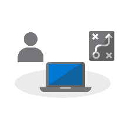

# Aan de slag - Desktopimplementatie

<table>
<thead>
<td></td>
<td>
<strong>Aan de slag: Richtlijnen voor personen, processen en technologie</strong>

Ontdek de voordelen van Windows 10 en Microsoft 365-apps voor ondernemingen, belangrijke wijzigingen en overwegingen versus vorige implementaties en aanbevolen procedures om een soepele overgang naar Windows 10 en Microsoft 365-apps voor ondernemingen te garanderen.
</td>
<td></td>
</thead>
</table>

>[!NOTE]
>In deze reeks zullen we de beste manieren uitleggen waarop bestaande hulpprogramma's kunnen worden gebruikt en krijgt u een introductie van de nieuwe technologieën, services en methoden die door de Cloud zijn ingeschakeld.  Ga naar het [Implementatiecentrum voor desktops](https://aka.ms/HowToShift) om het volledige desktop-implementatieproces te zien.
>

Welkom bij het Implementatiecentrum voor desktops, waar u meer informatie vindt over het plannen en maken van de overstap naar Windows 10 en Microsoft 365-apps voor ondernemingen. Op deze manier kunt u gebruikmaken van een veilige werkruimte, uitgerust met de nieuwste functies voor productiviteit, teamwork en samenwerking.

Als u al een tijdje geen nieuwe desktopomgeving hebt geïmplementeerd, is het goede nieuws dat het implementatieproces op veel punten is verbeterd. Uitdagingen uit het verleden, zoals de compatibiliteit van toepassingen, vormen tegenwoordig veel minder een probleem. Met de nieuwe hulpmiddelen en inzicht in de Cloud kunt u sneller en efficiënter dan ooit tevoren vol vertrouwen vooruitgang boeken.

In deze inleiding wordt uitgelegd wat er is veranderd en krijgt u een rondleiding door het implementatieproces voor desktops. U wordt door de aanbevolen stappen voor uw overstap naar Windows 10 en Microsoft 365-apps voor ondernemingen geleid en ontvangt meer informatie over het gebruik van uw bestaande hulpprogramma's en processen, terwijl u tegelijkertijd moderne beheertechnologieën en -benaderingen oppikt.

## Waarom upgraden?

De combinatie van Windows 10 en de Microsoft Intelligence Cloud geeft u de mogelijkheid om een sterke en veilige werkruimte voor uw gebruikers te creëren, terwijl u de ondersteuningsinfrastructuur vereenvoudigt.

Een van de belangrijkste eisen van moderne beheermethoden is dat apparaten altijd up-to-date moeten zijn. Dankzij deze reeks leert u alles over de nieuwe functies die nu beschikbaar zijn om u te helpen bij het overstappen naar Windows 10 en Microsoft 365-apps voor ondernemingen en blijft u op de hoogte van halfjaarlijkse releases van beide.

[Windows 10 voor IT-professionals](https://www.microsoft.com/itpro/windows-10)

[Over Microsoft 365-apps voor ondernemingen in de onderneming](https://docs.microsoft.com/deployoffice/about-office-365-proplus-in-the-enterprise)

## Wat is er veranderd?

Laten we eerst eens kijken wat er is veranderd en verbeterd sinds uw laatste desktopimplementatie. Als u uw desktopomgeving al een tijdje niet hebt gewijzigd, gebruikt u waarschijnlijk Windows 7 en Office 2010 of Office 2013. Als dat het geval is, zult u zien dat er een paar dingen zijn veranderd sinds uw laatste grote upgrade. Hieronder ziet u enkele van de belangrijkste wijzigingen:

**Identiteit en toegang:** Windows 10 en Microsoft 365-apps voor ondernemingen, met hun connectiviteit tot Cloud-productiviteit, beveiligings- en beheerservices, hebben een nieuwe service voor Identiteits- en toegangsbeheer: Azure Active Directory (Azure AD). Dit maakt eenmalige aanmelding en een beveiligde verbinding in al uw cloudservices mogelijk, wat betekent dat u Azure AD nodig zult hebben om te profiteren van de services van Microsoft 365, zoals Office 365, Intune en Windows Autopilot.

[Microsoft 365](https://www.microsoft.com/microsoft-365/default.aspx)

**Secure Pre-boot Omgeving:** 64-bits UEFI-firmware vervangt BIOS. Dit versnelt niet alleen de opstarttijden, maar is ook vereist voor een groot aantal van de moderne beveiligingsfuncties in Windows 10. Hoewel Windows 10 op BIOS kan draaien, bevelen wij UEFI ten zeerste aan. Als u nog niet bent overgestapt van BIOS naar UEFI en met 64-bits werkt, is dit het moment om dit alsnog te doen. Er zijn hulpmiddelen waarmee u tijdens of na een upgrade van Windows 10 kunt overstappen.

**Apparaatbeheer in de Cloud:** Services, zoals Microsoft Intune, helpen u bij het beheren van uw Windows 10-apparaten, net zoals andere mobiele apparaten, vanaf één locatie. Wat Microsoft Intune uniek maakt is de mogelijkheid om uw Windows 10-apparaten samen te beheren met behulp van de Microsoft Endpoint Configuration Manager. U kunt de Configuration Manager gebruiken om u te helpen bij uw overstap naar Windows 10, waarna u Microsoft Intune kunt toevoegen. Dankzij Microsoft Endpoint Configuration Manager kunt u binnen uw organisatie samenwerken via de Microsoft Intelligent Cloud, wat u een voorsprong geeft op de concurrentie. Dit geeft u de mogelijkheid om de apparaten van uw gebruikers vanaf elke locatie veilig te beheren, ongeacht of u verbonden bent met de infrastructuur van uw organisatie of de openbare cloud.

[Co/beheer voor Windows 10-apparaten](https://docs.microsoft.com/configmgr/core/clients/manage/co-management-overview)

**Implementatieservice in de Cloud:** Terwijl u nieuwe pc's aanschaft, hebben wij een nieuwe Cloud-service geïntroduceerd, genaamd Windows Autopilot-implementatieservice, om u te helpen bij de implementatie van Microsoft 365-apparaten. Autopilot is geïntegreerd met uw hardwareproviders en nieuwe pc's worden automatisch geregistreerd in Autopilot, zodat de nieuwe pc direct naar de gebruiker kan worden verzonden. Wanneer de pc voor de eerste keer wordt opgestart, wordt deze snel geconfigureerd naar de gewenste configuratie voor uw organisatie en aangepast op de specifieke behoeften van de gebruiker.

[Windows Autopilot](https://www.microsoft.com/windowsforbusiness/windows-autopilot)

**Klik-en-klaar-implementaties:** Bij het inrichten van bureaublad-apps van Office, heeft Microsoft 365-apps voor ondernemingen de voorkeur. Hiermee hebt u toegang tot de nieuwste innovaties in Office zodra ze worden ontwikkeld. U hoeft dus niet jaren te wachten voordat u gebruik kunt maken van nieuwe functionaliteiten. U gebruikt ook een nieuwe installatie met de naam Klik-en-klaar.

Klik-en-klaar is heel anders dan de op MSI-gebaseerde pakketten uit het verleden. Klik-en-klaar is sneller, lichter en ondersteunt updates op de achtergrond om te voorkomen dat uw gebruikers niet aan de slag kunnen. Het is nog steeds een lokale kopie van Office en u kunt uw bestaande implementatiehulpprogramma's, zoals Microsoft Endpoint Configuration Manager, blijven gebruiken om de apps in te richten en te configureren.

[Implementatiegids voor Microsoft 365-apps voor ondernemingen](https://docs.microsoft.com/DeployOffice/deployment-guide-for-office-365-proplus)

**Halfjaarlijkse updates:** Zodra u bent overgestapt op Windows 10 en Microsoft 365-apps voor ondernemingen, ontvangt u ieder half jaar updates met nieuwe functies. Aangezien Microsoft inzichten uit de cloud kan halen om u te helpen, kunt u deze updates snel en eenvoudig implementeren op honderden of duizenden apparaten. Net als bij een in-place upgrade, zorgt de onderdelenupdate ervoor dat apps, gegevens en configuraties uit de vorige versie worden behouden.

## Het implementatieproces

Voordat u aan de slag gaat, is het verstandig om een goed plan op te stellen en de nodigde sponsors aan boord te krijgen. Ons implementatieproces geeft een overzicht van de cruciale stappen die u moet zetten om de belangrijkste teamleden en hulpmiddelen te identificeren die beheerd moeten worden in de volgende implementatiegebieden.

**[Stap 1: Apparaat- en app-gereedheid](https://aka.ms/mdd1)** Voor een geslaagde implementatie moet u eerst weten wat u hebt. Dit houdt in dat u een inventarisatie van uw apparaten en apps moet uitvoeren en de compatibiliteit moet controleren. Om u hierbij te helpen, kunt u gebruikmaken van de hulpprogramma's die beschikbaar zijn in Desktop Analytics in de cloud. Desktop Analytics geeft u de mogelijkheid om de apps en sturingsprogramma's op uw apparaat te beoordelen met behulp van compatibiliteitsgegevens en diagnostische data van miljoenen pc‘s, om zo de gereedheid van uw desktop vast te stellen. U kunt zelfs een lijst met 'Pc's gereed voor implementatie' van Desktop Analytics naar Configuration Manager exporteren, als u dit gebruikt, zodat u op gegevens gebaseerde verzamelingen van targeted pc's kunt maken zodra deze gereed worden.

[Aan de slag met gereedheid voor upgraden](https://docs.microsoft.com/windows/deployment/upgrade/upgrade-readiness-get-started)

**[Stap 2: Gereedheid van directory en netwerk](https://aka.ms/mdd2)** Als u dat nog niet hebt gedaan, dient u vervolgens Azure Active Directory te implementeren voor identiteits- en toegangsbeheer. Het is ook een goed idee om uw netwerk voor te bereiden op het verplaatsen van systeemafbeeldingen, toepassingspakketten, gebruikersbestanden en updates. Dit betekent een grote hoeveelheid aanvullende gegevens; uw netwerk moet de capaciteit hebben voor het verwerken van deze extra belasting, zonder dat dit invloed heeft op de dagelijkse werkzaamheden van uw organisatie. Er is een groot aantal netwerkoptimalisaties beschikbaar: van bandbreedteregeling en peer-to-peer-opties tot dynamisch opruimen van bandbreedte en differentiële updates.

[BranchCache vs. Peer Cache](https://blogs.technet.microsoft.com/swisspfe/2018/01/25/branch-cache-vs-peer-cache/)

**[Stap 3: Office en Line of Business App Delivery](https://aka.ms/mdd3)** Hoewel Windows nog steeds ondersteuning biedt voor MSI-installaties, ondersteunt het nu ook nieuwere installatiemethoden, die geoptimaliseerd zijn voor geautomatiseerde implementatie en voortdurende updates. Microsoft 365-apps voor ondernemingen en Office 2019-clients gebruiken Klik-en-klaar-installatietechnologie. Mogelijk wilt u een aantal UWP-apps beschikbaar maken en maakt u steeds vaker gebruik van apps van derden en zelf ontwikkelde Line of Business Apps, die gebruikmaken van de nieuwe, op MSIX gebaseerde verpakkingsapps. Met deze stap zorgt u ervoor dat uw apps gereed zijn voor geautomatiseerde implementaties en dat u gegarandeerd succes heeft, ongeacht of uw apps worden geïmplementeerd met Klik-en-klaar, MSIX, conventionele op MSI-gebaseerde methoden, of UWP-apps, die worden geïmplementeerd vanuit een Microsoft Store vanuit Business die u instelt.

[MSIX Intro](https://blogs.msdn.microsoft.com/sgern/2018/06/15/msix-intro/)

**[Stap 4: Migratie van gebruikersbestanden en -instellingen](https://aka.ms/mdd4)** Dit is een cruciale stap bij het vervangen van een pc of een vernieuwingscyclus: u moet ervoor zorgen dat de bestanden, gegevens en instellingen van de gebruikers succesvol worden verplaatst en gedurende de migratie behouden blijven. In deze stap worden de opties beschreven die beschikbaar zijn voor handmatige of geautomatiseerde migraties, inclusief bekende en nieuwe opties.

Net als bij vorige upgrades, blijft het Hulpprogramma voor migratie van gebruikersstatus een waardevol hulpmiddel om dit proces te automatiseren. Het is een integraal onderdeel van migraties die worden uitgevoerd met behulp van Microsoft Endpoint Configuration Manager of de Microsoft Deployment Toolkit. Maar het verplaatsen van al deze gegevens bij de migratie kan een knelpunt zijn voor de vervanging van een pc, vanwege alles dat komt kijken bij het tweemaal overzetten van soms honderden gigabytes per pc - eerst vanaf de bestaande desktop, vervolgens naar de nieuwe desktop. Een nieuwe optie die mogelijk wordt gemaakt door OneDrive is Known Folder Move, dat wordt gebruikt voor het op grote schaal synchroniseren van gebruikersdocumenten, afbeeldingen en desktopbestanden in de Cloud en voorafgaand aan de implementatie.

[Bekende Windows-mappen omleiden en verplaatsen naar OneDrive](https://docs.microsoft.com/onedrive/redirect-known-folders)

**[Stap 5: Beveiliging en naleving](https://aka.ms/mdd5)** Beveiliging en naleving is een gebied met een hoop veranderingen bij het overstappen op Windows 10 en Microsoft 365-apps voor ondernemingen. Het is belangrijk dat u bekend raakt met de nieuwe ingebouwde mogelijkheden en deze vergelijkt met wat u al hebt. Nieuwe mogelijkheden in Windows 10 die gebruikmaken van op virtualisatie gebaseerde beveiliging kunnen bijvoorbeeld diefstal van referenties voorkomen en uw desktop beschermen tegen aanvallen op basis van een browser en het uitvoeren van schadelijke codes, door kernprocessen en geheimen te isoleren van het besturingssysteem. Bovendien bieden cloudservices, zoals Advanced Threat Protection, een geïntegreerd platform voor beveiligingsversterking, detectie na inbreuk, onderzoek en reactie. Advanced Threat Protection kan ook bescherming bieden tegen schadelijke e-mailbijlagen, onveilige hyperlinks en meer.

[Microsoft Security](https://www.microsoft.com/security/default.aspx)

**[Stap 6: Implementatie en functie-updates voor het besturingssysteem](https://aka.ms/mdd6)** Nu alles is voorbereid, is de volgende stap het implementeren van de installatiekopieën van het besturingssysteem. Een groot deel van het zware werk kan worden uitgevoerd met behulp van de System Center Configuration Manage-takenreeksen en -infrastructuur. De aanbevolen procedure is om in fasen te implementeren, waarbij u eerst een “early adopter group” in uw organisatie aanwijst met behulp van een representatieve set van hardware en apps. Vervolgens kunt u de gegevens van die apparaten en gebruikers gebruiken om u langzaamaan op steeds meer pc‘s te richten. 

[Inleiding tot implementatie van het besturingssysteem in Configuration Manager](https://docs.microsoft.com/configmgr/osd/understand/introduction-to-operating-system-deployment)

**[Stap 7: Windows en Office als een service](https://aka.ms/mdd7)** Dit vertegenwoordigt een enorme verschuiving in de manier waarop u de zaken op de desktops van uw gebruikers behoudt. Met deze overstap naar Windows 10 en Microsoft 365-apps voor ondernemingen kunt u doorgaan met het beheren van Windows en Office als een service. In plaats van elke paar jaar een enorme verschuiving in de technologie te implementeren, levert u nu voortdurend nieuwe functies, ervaringen en beveiligingen aan uw gebruiker. De halfjaarlijkse functie-updates bieden nieuwe mogelijkheden in de herfst en lente van elk jaar, terwijl maandelijkse cumulatieve kwaliteitsupdates oplossingen bieden voor beveiliging, betrouwbaarheid en fouten. U kunt er ook voor kiezen om de Office 2019-client te implementeren. U wordt ten zeerste aangeraden om over te stappen op Microsoft 365-apps voor ondernemingen. Dit volgt een vergelijkbaar serviceplan als Windows, zodat uw gebruikers ook regelmatig updates voor de Office-apps ontvangen.

[Overzicht van Windows als een service](https://docs.microsoft.com/windows/deployment/update/waas-overview)
[Overzicht van Office als een service](https://docs.microsoft.com/DeployOffice/overview-of-update-channels-for-office-365-proplus)

**[Stap 8: Communicatie en training voor gebruikers](https://aka.ms/mdd8)** Deze laatste stap is essentieel om het gebruik van nieuwe mogelijkheden te stimuleren en zo teamwork, communicatie, beveiliging en meer te verbeteren. Voordat een brede implementatie wordt gericht op gebruikers buiten de eerste implementatiecirkel, raden we u aan gebruikerscommunicatie en -training uit te voeren. Hiermee kunt u de gewenste wijzigingen aanbrengen in de manier waarop personen nieuwe functies gebruiken in Office, Windows of andere zakelijke apps en services. Om u hierbij te helpen, bieden we gratis online training aan via Microsoft FastTrack. Bovendien hebben we gratis voorbeelden van communicatieplannen en tijdlijnen gepubliceerd, samen met e-mail-, sociale- en intranet-sjablonen, die u kunnen helpen bij uw implementatie van Windows 10. Als een Microsoft 365-organisatie kan uw organisatie ook in aanmerking komen voor rechtstreekse ondersteuning.

## Volgende stap

Nu weet u wat er nieuw en anders is in Windows 10 en Microsoft 365-apps voor ondernemingen en heeft u meer geleerd over ons aanbevolen implementatieproces. Met deze beschikking over volledige begeleiding en hulpmiddelen die u kunt gebruiken voor de overstap naar Windows 10 en Microsoft 365-apps voor ondernemingen, is het tijd om aan de slag te gaan.

## [Stap 1: apparaat- en app-gereedheid](https://aka.ms/mdd1)

