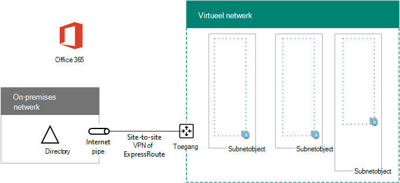

# <a name="high-availability-federated-authentication-phase-1-configure-azure"></a><span data-ttu-id="39f58-103">Federatieve authenticatiefase van hoge beschikbaarheid 1: Azure configureren</span><span class="sxs-lookup"><span data-stu-id="39f58-103">High availability federated authentication Phase 1: Configure Azure</span></span>

<span data-ttu-id="39f58-104">In deze fase maakt u de resourcegroepen, virtuele netwerk (VNet) en beschikbaarheidssets in azure waarmee de virtuele machines worden gehost in de fasen 2, 3 en 4.</span><span class="sxs-lookup"><span data-stu-id="39f58-104">In this phase, you create the resource groups, virtual network (VNet), and availability sets in Azure that will host the virtual machines in phases 2, 3, and 4.</span></span> <span data-ttu-id="39f58-105">U moet deze fase voltooien voordat u overstapt op [fase 2: domeincontrollers configureren](high-availability-federated-authentication-phase-2-configure-domain-controllers.md).</span><span class="sxs-lookup"><span data-stu-id="39f58-105">You must complete this phase before moving on to [Phase 2: Configure domain controllers](high-availability-federated-authentication-phase-2-configure-domain-controllers.md).</span></span> <span data-ttu-id="39f58-106">Zie [federatieve authenticatie van hoge beschikbaarheid implementeren voor Microsoft 365 in azure](deploy-high-availability-federated-authentication-for-microsoft-365-in-azure.md) voor alle fasen.</span><span class="sxs-lookup"><span data-stu-id="39f58-106">See [Deploy high availability federated authentication for Microsoft 365 in Azure](deploy-high-availability-federated-authentication-for-microsoft-365-in-azure.md) for all of the phases.</span></span>
  
<span data-ttu-id="39f58-107">Azure moet worden ingericht met de volgende basiscomponenten:</span><span class="sxs-lookup"><span data-stu-id="39f58-107">Azure must be provisioned with these basic components:</span></span>
  
- <span data-ttu-id="39f58-108">Resource groepen</span><span class="sxs-lookup"><span data-stu-id="39f58-108">Resource groups</span></span>
    
- <span data-ttu-id="39f58-109">Een cross-premises Azure Virtual Network (VNet) met subnetten voor het hosten van de virtuele machines van Azure</span><span class="sxs-lookup"><span data-stu-id="39f58-109">A cross-premises Azure virtual network (VNet) with subnets for hosting the Azure virtual machines</span></span>
    
- <span data-ttu-id="39f58-110">Netwerkbeveiligingsgroepen voor het uitvoeren van subnet-isolatie</span><span class="sxs-lookup"><span data-stu-id="39f58-110">Network security groups for performing subnet isolation</span></span>
    
- <span data-ttu-id="39f58-111">Beschikbaarheidssets</span><span class="sxs-lookup"><span data-stu-id="39f58-111">Availability sets</span></span>
    
## <a name="configure-azure-components"></a><span data-ttu-id="39f58-112">Azure-onderdelen configureren</span><span class="sxs-lookup"><span data-stu-id="39f58-112">Configure Azure components</span></span>

<span data-ttu-id="39f58-113">Vul de volgende tabellen in voordat u de onderdelen van Azure gaat configureren.</span><span class="sxs-lookup"><span data-stu-id="39f58-113">Before you begin configuring Azure components, fill in the following tables.</span></span> <span data-ttu-id="39f58-114">Om u te helpen bij het configureren van Azure, moet u dit gedeelte afdrukken en de benodigde informatie noteren of de benodigde informatie naar een document kopiëren en deze sectie invullen.</span><span class="sxs-lookup"><span data-stu-id="39f58-114">To assist you in the procedures for configuring Azure, print this section and write down the needed information or copy this section to a document and fill it in.</span></span> <span data-ttu-id="39f58-115">Voor de instellingen van het VNet vult u tabel V in.</span><span class="sxs-lookup"><span data-stu-id="39f58-115">For the settings of the VNet, fill in Table V.</span></span>
  
|<span data-ttu-id="39f58-116">**Item**</span><span class="sxs-lookup"><span data-stu-id="39f58-116">**Item**</span></span>|<span data-ttu-id="39f58-117">**Configuratie-instelling**</span><span class="sxs-lookup"><span data-stu-id="39f58-117">**Configuration setting**</span></span>|<span data-ttu-id="39f58-118">**Beschrijving**</span><span class="sxs-lookup"><span data-stu-id="39f58-118">**Description**</span></span>|<span data-ttu-id="39f58-119">**Value**</span><span class="sxs-lookup"><span data-stu-id="39f58-119">**Value**</span></span>|
|:-----|:-----|:-----|:-----|
|<span data-ttu-id="39f58-120">1.</span><span class="sxs-lookup"><span data-stu-id="39f58-120">1.</span></span>  <br/> |<span data-ttu-id="39f58-121">VNet-naam</span><span class="sxs-lookup"><span data-stu-id="39f58-121">VNet name</span></span>  <br/> |<span data-ttu-id="39f58-122">Een naam die moet worden toegewezen aan de VNet (bijvoorbeeld FedAuthNet).</span><span class="sxs-lookup"><span data-stu-id="39f58-122">A name to assign to the VNet (example FedAuthNet).</span></span>  <br/> |  <br/> |
|<span data-ttu-id="39f58-124">2.</span><span class="sxs-lookup"><span data-stu-id="39f58-124">2.</span></span>  <br/> |<span data-ttu-id="39f58-125">VNet-locatie</span><span class="sxs-lookup"><span data-stu-id="39f58-125">VNet location</span></span>  <br/> |<span data-ttu-id="39f58-126">Het regionale Azure-datacenter dat het virtuele netwerk omvat.</span><span class="sxs-lookup"><span data-stu-id="39f58-126">The regional Azure datacenter that will contain the virtual network.</span></span>  <br/> |  <br/> |
|<span data-ttu-id="39f58-128">3.</span><span class="sxs-lookup"><span data-stu-id="39f58-128">3.</span></span>  <br/> |<span data-ttu-id="39f58-129">IP-adres voor VPN-apparaat</span><span class="sxs-lookup"><span data-stu-id="39f58-129">VPN device IP address</span></span>  <br/> |<span data-ttu-id="39f58-130">Het openbare IPv4-adres van de interface van uw VPN-apparaat op internet.</span><span class="sxs-lookup"><span data-stu-id="39f58-130">The public IPv4 address of your VPN device's interface on the Internet.</span></span>  <br/> |  <br/> |
|<span data-ttu-id="39f58-132">4.</span><span class="sxs-lookup"><span data-stu-id="39f58-132">4.</span></span>  <br/> |<span data-ttu-id="39f58-133">VNet-adresruimte</span><span class="sxs-lookup"><span data-stu-id="39f58-133">VNet address space</span></span>  <br/> |<span data-ttu-id="39f58-134">De adresruimte voor het virtuele netwerk.</span><span class="sxs-lookup"><span data-stu-id="39f58-134">The address space for the virtual network.</span></span> <span data-ttu-id="39f58-135">Werk samen met uw IT-afdeling om deze adresruimte te bepalen.</span><span class="sxs-lookup"><span data-stu-id="39f58-135">Work with your IT department to determine this address space.</span></span>  <br/> |  <br/> |
|<span data-ttu-id="39f58-137">5.</span><span class="sxs-lookup"><span data-stu-id="39f58-137">5.</span></span>  <br/> |<span data-ttu-id="39f58-138">Gedeelde IPsec-sleutel</span><span class="sxs-lookup"><span data-stu-id="39f58-138">IPsec shared key</span></span>  <br/> |<span data-ttu-id="39f58-139">32 een willekeurige alfanumerieke tekenreeks die wordt gebruikt voor de verificatie van beide zijden van de VPN-verbinding tussen sites.</span><span class="sxs-lookup"><span data-stu-id="39f58-139">A 32-character random, alphanumeric string that will be used to authenticate both sides of the site-to-site VPN connection.</span></span> <span data-ttu-id="39f58-140">Werk samen met uw IT-of beveiligingsafdeling om deze sleutelwaarde te bepalen.</span><span class="sxs-lookup"><span data-stu-id="39f58-140">Work with your IT or security department to determine this key value.</span></span> <span data-ttu-id="39f58-141">U kunt ook [een willekeurige tekenreeks maken voor een met IPSec vooraf gedeelde sleutel](https://social.technet.microsoft.com/wiki/contents/articles/32330.create-a-random-string-for-an-ipsec-preshared-key.aspx).</span><span class="sxs-lookup"><span data-stu-id="39f58-141">Alternately, see [Create a random string for an IPsec preshared key](https://social.technet.microsoft.com/wiki/contents/articles/32330.create-a-random-string-for-an-ipsec-preshared-key.aspx).</span></span>  <br/> |  <br/> |
   
 <span data-ttu-id="39f58-143">**Tabel V: virtuele netwerkconfiguratie van cross-premises**</span><span class="sxs-lookup"><span data-stu-id="39f58-143">**Table V: Cross-premises virtual network configuration**</span></span>
  
<span data-ttu-id="39f58-144">Vul vervolgens tabel S in voor de subnetten van deze oplossing.</span><span class="sxs-lookup"><span data-stu-id="39f58-144">Next, fill in Table S for the subnets of this solution.</span></span> <span data-ttu-id="39f58-145">Alle adresruimten moeten in de bewerkings indeling van een Klasloze interdomein-indeling staan, ook wel wel netwerkvoorvoegsel-indeling genoemd.</span><span class="sxs-lookup"><span data-stu-id="39f58-145">All address spaces should be in Classless Interdomain Routing (CIDR) format, also known as network prefix format.</span></span> <span data-ttu-id="39f58-146">Een voorbeeld is 10.24.64.0/20.</span><span class="sxs-lookup"><span data-stu-id="39f58-146">An example is 10.24.64.0/20.</span></span>
  
<span data-ttu-id="39f58-147">Voor de eerste drie subnetten geeft u een naam en een enkele IP-adresruimte op op basis van de adresruimte van het virtuele netwerk.</span><span class="sxs-lookup"><span data-stu-id="39f58-147">For the first three subnets, specify a name and a single IP address space based on the virtual network address space.</span></span> <span data-ttu-id="39f58-148">Voor het gateway-subnet bepaalt u de 27-bits adresruimte (met een/27 prefixlengte) voor het Azure gateway-subnet met de volgende opties:</span><span class="sxs-lookup"><span data-stu-id="39f58-148">For the gateway subnet, determine the 27-bit address space (with a /27 prefix length) for the Azure gateway subnet with the following:</span></span>
  
1. <span data-ttu-id="39f58-149">Stel de variabele bits in de adresruimte van de VNet in op 1, tot de gebruikte bits in de gateway-subnet en stel de resterende bits in op 0.</span><span class="sxs-lookup"><span data-stu-id="39f58-149">Set the variable bits in the address space of the VNet to 1, up to the bits being used by the gateway subnet, then set the remaining bits to 0.</span></span>
    
2. <span data-ttu-id="39f58-150">Zet de resultaten van de omliggende bits om in decimalen en druk deze als een adresruimte met de lengte van het voorvoegsel in op de grootte van het gateway subnet.</span><span class="sxs-lookup"><span data-stu-id="39f58-150">Convert the resulting bits to decimal and express it as an address space with the prefix length set to the size of the gateway subnet.</span></span>
    
<span data-ttu-id="39f58-151">Zie de Adresboek tijdtoren [voor Azure gateway-subnetten](https://gallery.technet.microsoft.com/scriptcenter/Address-prefix-calculator-a94b6eed) voor een PowerShell-opdrachten blok en C#-of python-consoletoepassing waarmee deze berekening wordt uitgevoerd.</span><span class="sxs-lookup"><span data-stu-id="39f58-151">See [Address space calculator for Azure gateway subnets](https://gallery.technet.microsoft.com/scriptcenter/Address-prefix-calculator-a94b6eed) for a PowerShell command block and C# or Python console application that performs this calculation for you.</span></span>
  
<span data-ttu-id="39f58-152">Werk samen met uw IT-afdeling om te bepalen welke adresruimten de virtuele netwerklocatie van het adres heeft.</span><span class="sxs-lookup"><span data-stu-id="39f58-152">Work with your IT department to determine these address spaces from the virtual network address space.</span></span>
  
|<span data-ttu-id="39f58-153">**Item**</span><span class="sxs-lookup"><span data-stu-id="39f58-153">**Item**</span></span>|<span data-ttu-id="39f58-154">**Naam van subnet**</span><span class="sxs-lookup"><span data-stu-id="39f58-154">**Subnet name**</span></span>|<span data-ttu-id="39f58-155">**Adresruimte van subnet**</span><span class="sxs-lookup"><span data-stu-id="39f58-155">**Subnet address space**</span></span>|<span data-ttu-id="39f58-156">**Doel**</span><span class="sxs-lookup"><span data-stu-id="39f58-156">**Purpose**</span></span>|
|:-----|:-----|:-----|:-----|
|<span data-ttu-id="39f58-157">1.</span><span class="sxs-lookup"><span data-stu-id="39f58-157">1.</span></span>  <br/> |  <br/> |  <br/> |<span data-ttu-id="39f58-160">Het subnet dat wordt gebruikt door de domeincontroller voor Active Directory Domain Services (AD DS) van Active Directory Domain Services en adreslijstsynchronisatie servers (VMs).</span><span class="sxs-lookup"><span data-stu-id="39f58-160">The subnet used by the Active Directory Domain Services (AD DS) domain controller and directory synchronization server virtual machines (VMs).</span></span>  <br/> |
|<span data-ttu-id="39f58-161">2.</span><span class="sxs-lookup"><span data-stu-id="39f58-161">2.</span></span>  <br/> |  <br/> |  <br/> |<span data-ttu-id="39f58-164">Het subnet dat wordt gebruikt door de AD FS-Vm's.</span><span class="sxs-lookup"><span data-stu-id="39f58-164">The subnet used by the AD FS VMs.</span></span>  <br/> |
|<span data-ttu-id="39f58-165">3.</span><span class="sxs-lookup"><span data-stu-id="39f58-165">3.</span></span>  <br/> |  <br/> |  <br/> |<span data-ttu-id="39f58-168">Het subnet dat wordt gebruikt door de Vm's van webtoepassingsproxy.</span><span class="sxs-lookup"><span data-stu-id="39f58-168">The subnet used by the web application proxy VMs.</span></span>  <br/> |
|<span data-ttu-id="39f58-169">4.</span><span class="sxs-lookup"><span data-stu-id="39f58-169">4.</span></span>  <br/> |<span data-ttu-id="39f58-170">GatewaySubnet</span><span class="sxs-lookup"><span data-stu-id="39f58-170">GatewaySubnet</span></span>  <br/> |  <br/> |<span data-ttu-id="39f58-172">Het subnet dat wordt gebruikt door de Azure gateway-VMs.</span><span class="sxs-lookup"><span data-stu-id="39f58-172">The subnet used by the Azure gateway VMs.</span></span>  <br/> |
   
 <span data-ttu-id="39f58-173">**Tabel S: subnetten in het virtuele netwerk**</span><span class="sxs-lookup"><span data-stu-id="39f58-173">**Table S: Subnets in the virtual network**</span></span>
  
<span data-ttu-id="39f58-174">Vul vervolgens tabel I in voor de statische IP-adressen die zijn toegewezen aan virtuele machines en Load Balancer-exemplaren.</span><span class="sxs-lookup"><span data-stu-id="39f58-174">Next, fill in Table I for the static IP addresses assigned to virtual machines and load balancer instances.</span></span>
  
|<span data-ttu-id="39f58-175">**Item**</span><span class="sxs-lookup"><span data-stu-id="39f58-175">**Item**</span></span>|<span data-ttu-id="39f58-176">**Doel**</span><span class="sxs-lookup"><span data-stu-id="39f58-176">**Purpose**</span></span>|<span data-ttu-id="39f58-177">**IP-adres in het subnet**</span><span class="sxs-lookup"><span data-stu-id="39f58-177">**IP address on the subnet**</span></span>|<span data-ttu-id="39f58-178">**Value**</span><span class="sxs-lookup"><span data-stu-id="39f58-178">**Value**</span></span>|
|:-----|:-----|:-----|:-----|
|<span data-ttu-id="39f58-179">1.</span><span class="sxs-lookup"><span data-stu-id="39f58-179">1.</span></span>  <br/> |<span data-ttu-id="39f58-180">Statisch IP-adres van de eerste domeincontroller</span><span class="sxs-lookup"><span data-stu-id="39f58-180">Static IP address of the first domain controller</span></span>  <br/> |<span data-ttu-id="39f58-181">Het vierde mogelijke IP-adres voor de adresruimte van het subnet dat is gedefinieerd in item 1 van tabel S.</span><span class="sxs-lookup"><span data-stu-id="39f58-181">The fourth possible IP address for the address space of the subnet defined in Item 1 of Table S.</span></span>  <br/> |  <br/> |
|<span data-ttu-id="39f58-183">2.</span><span class="sxs-lookup"><span data-stu-id="39f58-183">2.</span></span>  <br/> |<span data-ttu-id="39f58-184">Statisch IP-adres van de tweede domeincontroller</span><span class="sxs-lookup"><span data-stu-id="39f58-184">Static IP address of the second domain controller</span></span>  <br/> |<span data-ttu-id="39f58-185">Het vijfde mogelijke IP-adres voor de adresruimte van het subnet dat is gedefinieerd in item 1 van tabel S.</span><span class="sxs-lookup"><span data-stu-id="39f58-185">The fifth possible IP address for the address space of the subnet defined in Item 1 of Table S.</span></span>  <br/> |  <br/> |
|<span data-ttu-id="39f58-187">3.</span><span class="sxs-lookup"><span data-stu-id="39f58-187">3.</span></span>  <br/> |<span data-ttu-id="39f58-188">Statisch IP-adres van de adreslijstsynchronisatie server</span><span class="sxs-lookup"><span data-stu-id="39f58-188">Static IP address of the directory synchronization server</span></span>  <br/> |<span data-ttu-id="39f58-189">Het zesde mogelijke IP-adres voor de adresruimte van het subnet dat is gedefinieerd in item 1 van tabel S.</span><span class="sxs-lookup"><span data-stu-id="39f58-189">The sixth possible IP address for the address space of the subnet defined in Item 1 of Table S.</span></span>  <br/> |  <br/> |
|<span data-ttu-id="39f58-191">4.</span><span class="sxs-lookup"><span data-stu-id="39f58-191">4.</span></span>  <br/> |<span data-ttu-id="39f58-192">Statisch IP-adres van de interne Load Balancer voor de AD FS-servers</span><span class="sxs-lookup"><span data-stu-id="39f58-192">Static IP address of the internal load balancer for the AD FS servers</span></span>  <br/> |<span data-ttu-id="39f58-193">Het vierde mogelijke IP-adres voor de adresruimte van het subnet dat is gedefinieerd in item 2 van tabel S.</span><span class="sxs-lookup"><span data-stu-id="39f58-193">The fourth possible IP address for the address space of the subnet defined in Item 2 of Table S.</span></span>  <br/> |  <br/> |
|<span data-ttu-id="39f58-195">5.</span><span class="sxs-lookup"><span data-stu-id="39f58-195">5.</span></span>  <br/> |<span data-ttu-id="39f58-196">Statisch IP-adres van de eerste AD FS-server</span><span class="sxs-lookup"><span data-stu-id="39f58-196">Static IP address of the first AD FS server</span></span>  <br/> |<span data-ttu-id="39f58-197">Het vijfde mogelijke IP-adres voor de adresruimte van het subnet dat is gedefinieerd in item 2 van tabel S.</span><span class="sxs-lookup"><span data-stu-id="39f58-197">The fifth possible IP address for the address space of the subnet defined in Item 2 of Table S.</span></span>  <br/> |  <br/> |
|<span data-ttu-id="39f58-199">zes.</span><span class="sxs-lookup"><span data-stu-id="39f58-199">6.</span></span>  <br/> |<span data-ttu-id="39f58-200">Statisch IP-adres van de tweede AD FS-server</span><span class="sxs-lookup"><span data-stu-id="39f58-200">Static IP address of the second AD FS server</span></span>  <br/> |<span data-ttu-id="39f58-201">Het zesde mogelijke IP-adres voor de adresruimte van het subnet dat is gedefinieerd in item 2 van tabel S.</span><span class="sxs-lookup"><span data-stu-id="39f58-201">The sixth possible IP address for the address space of the subnet defined in Item 2 of Table S.</span></span>  <br/> |  <br/> |
|<span data-ttu-id="39f58-203">7,5.</span><span class="sxs-lookup"><span data-stu-id="39f58-203">7.</span></span>  <br/> |<span data-ttu-id="39f58-204">Statisch IP-adres van de eerste proxyserver voor webtoepassingen</span><span class="sxs-lookup"><span data-stu-id="39f58-204">Static IP address of the first web application proxy server</span></span>  <br/> |<span data-ttu-id="39f58-205">Het vierde mogelijke IP-adres voor de adresruimte van het subnet dat is gedefinieerd in artikel 3 van tabel S.</span><span class="sxs-lookup"><span data-stu-id="39f58-205">The fourth possible IP address for the address space of the subnet defined in Item 3 of Table S.</span></span>  <br/> |  <br/> |
|<span data-ttu-id="39f58-207">8:00.</span><span class="sxs-lookup"><span data-stu-id="39f58-207">8.</span></span>  <br/> |<span data-ttu-id="39f58-208">Statisch IP-adres van de tweede server van de webtoepassingsproxy</span><span class="sxs-lookup"><span data-stu-id="39f58-208">Static IP address of the second web application proxy server</span></span>  <br/> |<span data-ttu-id="39f58-209">Het vijfde mogelijke IP-adres voor de adresruimte van het subnet dat is gedefinieerd in artikel 3 van tabel S.</span><span class="sxs-lookup"><span data-stu-id="39f58-209">The fifth possible IP address for the address space of the subnet defined in Item 3 of Table S.</span></span>  <br/> |  <br/> |
   
 <span data-ttu-id="39f58-211">**Table I: statische IP-adressen in het virtuele netwerk**</span><span class="sxs-lookup"><span data-stu-id="39f58-211">**Table I: Static IP addresses in the virtual network**</span></span>
  
<span data-ttu-id="39f58-212">Voor twee DNS-servers (Domain Name System) in het on-premises netwerk dat u wilt gebruiken bij het instellen van de domeincontrollers in uw virtuele netwerk, vult u de tabel D in en werkt u met uw IT-afdeling voor het bepalen van deze lijst.</span><span class="sxs-lookup"><span data-stu-id="39f58-212">For two Domain Name System (DNS) servers in your on-premises network that you want to use when initially setting up the domain controllers in your virtual network, fill in Table D. Work with your IT department to determine this list.</span></span>
  
|<span data-ttu-id="39f58-213">**Item**</span><span class="sxs-lookup"><span data-stu-id="39f58-213">**Item**</span></span>|<span data-ttu-id="39f58-214">**Beschrijvende naam van de DNS-server**</span><span class="sxs-lookup"><span data-stu-id="39f58-214">**DNS server friendly name**</span></span>|<span data-ttu-id="39f58-215">**IP-adres van de DNS-server**</span><span class="sxs-lookup"><span data-stu-id="39f58-215">**DNS server IP address**</span></span>|
|:-----|:-----|:-----|
|<span data-ttu-id="39f58-216">1.</span><span class="sxs-lookup"><span data-stu-id="39f58-216">1.</span></span>  <br/> |  <br/> |  <br/> |
|<span data-ttu-id="39f58-219">2.</span><span class="sxs-lookup"><span data-stu-id="39f58-219">2.</span></span>  <br/> |  <br/> |  <br/> |
   
 <span data-ttu-id="39f58-222">**Tabel D: on-premises DNS-servers**</span><span class="sxs-lookup"><span data-stu-id="39f58-222">**Table D: On-premises DNS servers**</span></span>
  
<span data-ttu-id="39f58-223">Als u pakketten van het cross-premises netwerk naar het netwerk van uw organisatie wilt routeren tussen de site-to-site VPN-verbinding, moet u het virtuele netwerk configureren met een lokaal netwerk met een lijst met de adresruimten (in CIDR-notatie) voor alle bereikbare locaties in het on-premises netwerk van uw organisatie.</span><span class="sxs-lookup"><span data-stu-id="39f58-223">To route packets from the cross-premises network to your organization network across the site-to-site VPN connection, you must configure the virtual network with a local network that has a list of the address spaces (in CIDR notation) for all of the reachable locations on your organization's on-premises network.</span></span> <span data-ttu-id="39f58-224">De lijst met adresruimten die uw lokale netwerk definiëren, moet uniek zijn en mag niet overlappen met de adresruimte die wordt gebruikt voor andere virtuele netwerken of andere lokale netwerken.</span><span class="sxs-lookup"><span data-stu-id="39f58-224">The list of address spaces that define your local network must be unique and must not overlap with the address space used for other virtual networks or other local networks.</span></span>
  
<span data-ttu-id="39f58-225">Voor de set lokale netwerkadres ruimten, vult u tabel L in. Merk op dat er wel drie lege vermeldingen worden weergegeven, maar u hebt meestal meer nodig.</span><span class="sxs-lookup"><span data-stu-id="39f58-225">For the set of local network address spaces, fill in Table L. Note that three blank entries are listed but you will typically need more.</span></span> <span data-ttu-id="39f58-226">Werk samen met uw IT-afdeling om deze lijst met adresruimten te bepalen.</span><span class="sxs-lookup"><span data-stu-id="39f58-226">Work with your IT department to determine this list of address spaces.</span></span>
  
|<span data-ttu-id="39f58-227">**Item**</span><span class="sxs-lookup"><span data-stu-id="39f58-227">**Item**</span></span>|<span data-ttu-id="39f58-228">**Lokale netwerkadres ruimte**</span><span class="sxs-lookup"><span data-stu-id="39f58-228">**Local network address space**</span></span>|
|:-----|:-----|
|<span data-ttu-id="39f58-229">1.</span><span class="sxs-lookup"><span data-stu-id="39f58-229">1.</span></span>  <br/> |  <br/> |
|<span data-ttu-id="39f58-231">2.</span><span class="sxs-lookup"><span data-stu-id="39f58-231">2.</span></span>  <br/> |  <br/> |
|<span data-ttu-id="39f58-233">3.</span><span class="sxs-lookup"><span data-stu-id="39f58-233">3.</span></span>  <br/> |  <br/> |
   
 <span data-ttu-id="39f58-235">**Tabel L: adresprefixen voor het lokale netwerk**</span><span class="sxs-lookup"><span data-stu-id="39f58-235">**Table L: Address prefixes for the local network**</span></span>
  
<span data-ttu-id="39f58-236">We gaan nu beginnen met de totstandbrenging van de Azure-infrastructuur om uw federatieve verificatie voor Microsoft 365 te hosten.</span><span class="sxs-lookup"><span data-stu-id="39f58-236">Now let's begin building the Azure infrastructure to host your federated authentication for Microsoft 365.</span></span>
  
> [!NOTE]
> <span data-ttu-id="39f58-237">Met de volgende opdrachtsets wordt de meest recente versie van Azure PowerShell gebruikt.</span><span class="sxs-lookup"><span data-stu-id="39f58-237">The following command sets use the latest version of Azure PowerShell.</span></span> <span data-ttu-id="39f58-238">Zie [aan de slag met Azure PowerShell](https://docs.microsoft.com/powershell/azure/get-started-azureps).</span><span class="sxs-lookup"><span data-stu-id="39f58-238">See [Get started with Azure PowerShell](https://docs.microsoft.com/powershell/azure/get-started-azureps).</span></span> 
  
<span data-ttu-id="39f58-239">Start eerst een Azure PowerShell-prompt en meld u aan bij uw account.</span><span class="sxs-lookup"><span data-stu-id="39f58-239">First, start an Azure PowerShell prompt and login to your account.</span></span>
  
```powershell
Connect-AzAccount
```

> [!TIP]
> <span data-ttu-id="39f58-240">Als u kant-en-klare PowerShell-opdrachten blokken wilt genereren op basis van uw aangepaste instellingen, gebruikt u deze [Microsoft Excel-configuratie werkmap](https://github.com/MicrosoftDocs/OfficeDocs-Enterprise/raw/live/Enterprise/downloads/O365FedAuthInAzure_Config.xlsx).</span><span class="sxs-lookup"><span data-stu-id="39f58-240">To generate ready-to-run PowerShell command blocks based on your custom settings, use this [Microsoft Excel configuration workbook](https://github.com/MicrosoftDocs/OfficeDocs-Enterprise/raw/live/Enterprise/downloads/O365FedAuthInAzure_Config.xlsx).</span></span> 

<span data-ttu-id="39f58-241">Haal de naam van uw abonnement op met de volgende opdracht.</span><span class="sxs-lookup"><span data-stu-id="39f58-241">Get your subscription name using the following command.</span></span>
  
```powershell
Get-AzSubscription | Sort Name | Select Name
```

<span data-ttu-id="39f58-242">Voor oudere versies van Azure PowerShell gebruikt u deze opdracht.</span><span class="sxs-lookup"><span data-stu-id="39f58-242">For older versions of Azure PowerShell, use this command instead.</span></span>
  
```powershell
Get-AzSubscription | Sort Name | Select SubscriptionName
```

<span data-ttu-id="39f58-243">Stel uw Azure-abonnement in.</span><span class="sxs-lookup"><span data-stu-id="39f58-243">Set your Azure subscription.</span></span> <span data-ttu-id="39f58-244">Vervang alles binnen de aanhalingstekens, inclusief de \< and >-tekens, met de juiste naam.</span><span class="sxs-lookup"><span data-stu-id="39f58-244">Replace everything within the quotes, including the \< and > characters, with the correct name.</span></span>
  
```powershell
$subscrName="<subscription name>"
Select-AzSubscription -SubscriptionName $subscrName
```

<span data-ttu-id="39f58-245">Vervolgens maakt u de nieuwe resourcegroepen.</span><span class="sxs-lookup"><span data-stu-id="39f58-245">Next, create the new resource groups.</span></span> <span data-ttu-id="39f58-246">Als u een unieke reeksnamen voor de resourcegroepen wilt bepalen, gebruikt u deze opdracht om een lijst met de bestaande resourcegroepen weer te geven.</span><span class="sxs-lookup"><span data-stu-id="39f58-246">To determine a unique set of resource group names, use this command to list your existing resource groups.</span></span>
  
```powershell
Get-AzResourceGroup | Sort ResourceGroupName | Select ResourceGroupName
```

<span data-ttu-id="39f58-247">Vul de volgende tabel in voor de namen van de afzonderlijke resourcegroepen.</span><span class="sxs-lookup"><span data-stu-id="39f58-247">Fill in the following table for the set of unique resource group names.</span></span>
  
|<span data-ttu-id="39f58-248">**Item**</span><span class="sxs-lookup"><span data-stu-id="39f58-248">**Item**</span></span>|<span data-ttu-id="39f58-249">**Naam van resource groep**</span><span class="sxs-lookup"><span data-stu-id="39f58-249">**Resource group name**</span></span>|<span data-ttu-id="39f58-250">**Doel**</span><span class="sxs-lookup"><span data-stu-id="39f58-250">**Purpose**</span></span>|
|:-----|:-----|:-----|
|<span data-ttu-id="39f58-251">1.</span><span class="sxs-lookup"><span data-stu-id="39f58-251">1.</span></span>  <br/> |  <br/> |<span data-ttu-id="39f58-253">Domeincontrollers</span><span class="sxs-lookup"><span data-stu-id="39f58-253">Domain controllers</span></span>  <br/> |
|<span data-ttu-id="39f58-254">2.</span><span class="sxs-lookup"><span data-stu-id="39f58-254">2.</span></span>  <br/> |  <br/> |<span data-ttu-id="39f58-256">AD FS-servers</span><span class="sxs-lookup"><span data-stu-id="39f58-256">AD FS servers</span></span>  <br/> |
|<span data-ttu-id="39f58-257">3.</span><span class="sxs-lookup"><span data-stu-id="39f58-257">3.</span></span>  <br/> |  <br/> |<span data-ttu-id="39f58-259">Webtoepassingsproxy-servers</span><span class="sxs-lookup"><span data-stu-id="39f58-259">Web application proxy servers</span></span>  <br/> |
|<span data-ttu-id="39f58-260">4.</span><span class="sxs-lookup"><span data-stu-id="39f58-260">4.</span></span>  <br/> |  <br/> |<span data-ttu-id="39f58-262">Infrastructuur elementen</span><span class="sxs-lookup"><span data-stu-id="39f58-262">Infrastructure elements</span></span>  <br/> |
   
 <span data-ttu-id="39f58-263">**Tabel R: resource groepen**</span><span class="sxs-lookup"><span data-stu-id="39f58-263">**Table R: Resource groups**</span></span>
  
<span data-ttu-id="39f58-264">Maak uw nieuwe resourcegroepen met deze opdrachten.</span><span class="sxs-lookup"><span data-stu-id="39f58-264">Create your new resource groups with these commands.</span></span>
  
```powershell
$locName="<an Azure location, such as West US>"
$rgName="<Table R - Item 1 - Name column>"
New-AzResourceGroup -Name $rgName -Location $locName
$rgName="<Table R - Item 2 - Name column>"
New-AzResourceGroup -Name $rgName -Location $locName
$rgName="<Table R - Item 3 - Name column>"
New-AzResourceGroup -Name $rgName -Location $locName
$rgName="<Table R - Item 4 - Name column>"
New-AzResourceGroup -Name $rgName -Location $locName
```

<span data-ttu-id="39f58-265">Vervolgens maakt u het virtuele virtuele netwerk van Azure en de subnetten hiervan.</span><span class="sxs-lookup"><span data-stu-id="39f58-265">Next, you create the Azure virtual network and its subnets.</span></span>
  
```powershell
$rgName="<Table R - Item 4 - Resource group name column>"
$locName="<your Azure location>"
$vnetName="<Table V - Item 1 - Value column>"
$vnetAddrPrefix="<Table V - Item 4 - Value column>"
$dnsServers=@( "<Table D - Item 1 - DNS server IP address column>", "<Table D - Item 2 - DNS server IP address column>" )
# Get the shortened version of the location
$locShortName=(Get-AzResourceGroup -Name $rgName).Location

# Create the subnets
$subnet1Name="<Table S - Item 1 - Subnet name column>"
$subnet1Prefix="<Table S - Item 1 - Subnet address space column>"
$subnet1=New-AzVirtualNetworkSubnetConfig -Name $subnet1Name -AddressPrefix $subnet1Prefix
$subnet2Name="<Table S - Item 2 - Subnet name column>"
$subnet2Prefix="<Table S - Item 2 - Subnet address space column>"
$subnet2=New-AzVirtualNetworkSubnetConfig -Name $subnet2Name -AddressPrefix $subnet2Prefix
$subnet3Name="<Table S - Item 3 - Subnet name column>"
$subnet3Prefix="<Table S - Item 3 - Subnet address space column>"
$subnet3=New-AzVirtualNetworkSubnetConfig -Name $subnet3Name -AddressPrefix $subnet3Prefix
$gwSubnet4Prefix="<Table S - Item 4 - Subnet address space column>"
$gwSubnet=New-AzVirtualNetworkSubnetConfig -Name "GatewaySubnet" -AddressPrefix $gwSubnet4Prefix

# Create the virtual network
New-AzVirtualNetwork -Name $vnetName -ResourceGroupName $rgName -Location $locName -AddressPrefix $vnetAddrPrefix -Subnet $gwSubnet,$subnet1,$subnet2,$subnet3 -DNSServer $dnsServers

```

<span data-ttu-id="39f58-266">Vervolgens maakt u netwerkbeveiligingsgroepen voor elk subnet met virtuele machines.</span><span class="sxs-lookup"><span data-stu-id="39f58-266">Next, you create network security groups for each subnet that has virtual machines.</span></span> <span data-ttu-id="39f58-267">Als u de isolatie van subnet wilt uitvoeren, kunt u regels toevoegen voor de specifieke typen verkeer die zijn toegestaan of geweigerd voor de netwerkbeveiligingsgroep van een subnet.</span><span class="sxs-lookup"><span data-stu-id="39f58-267">To perform subnet isolation, you can add rules for the specific types of traffic allowed or denied to the network security group of a subnet.</span></span>
  
```powershell
# Create network security groups
$vnet=Get-AzVirtualNetwork -ResourceGroupName $rgName -Name $vnetName

New-AzNetworkSecurityGroup -Name $subnet1Name -ResourceGroupName $rgName -Location $locShortName
$nsg=Get-AzNetworkSecurityGroup -Name $subnet1Name -ResourceGroupName $rgName
Set-AzVirtualNetworkSubnetConfig -VirtualNetwork $vnet -Name $subnet1Name -AddressPrefix $subnet1Prefix -NetworkSecurityGroup $nsg

New-AzNetworkSecurityGroup -Name $subnet2Name -ResourceGroupName $rgName -Location $locShortName
$nsg=Get-AzNetworkSecurityGroup -Name $subnet2Name -ResourceGroupName $rgName
Set-AzVirtualNetworkSubnetConfig -VirtualNetwork $vnet -Name $subnet2Name -AddressPrefix $subnet2Prefix -NetworkSecurityGroup $nsg

New-AzNetworkSecurityGroup -Name $subnet3Name -ResourceGroupName $rgName -Location $locShortName
$nsg=Get-AzNetworkSecurityGroup -Name $subnet3Name -ResourceGroupName $rgName
Set-AzVirtualNetworkSubnetConfig -VirtualNetwork $vnet -Name $subnet3Name -AddressPrefix $subnet3Prefix -NetworkSecurityGroup $nsg
$vnet | Set-AzVirtualNetwork
```

<span data-ttu-id="39f58-268">Vervolgens kunt u deze opdrachten gebruiken om de gateways voor de site-to-site VPN-verbinding te maken.</span><span class="sxs-lookup"><span data-stu-id="39f58-268">Next, use these commands to create the gateways for the site-to-site VPN connection.</span></span>
  
```powershell
$rgName="<Table R - Item 4 - Resource group name column>"
$locName="<Azure location>"
$vnetName="<Table V - Item 1 - Value column>"
$vnet=Get-AzVirtualNetwork -Name $vnetName -ResourceGroupName $rgName
$subnet=Get-AzVirtualNetworkSubnetConfig -VirtualNetwork $vnet -Name "GatewaySubnet"

# Attach a virtual network gateway to a public IP address and the gateway subnet
$publicGatewayVipName="PublicIPAddress"
$vnetGatewayIpConfigName="PublicIPConfig"
New-AzPublicIpAddress -Name $vnetGatewayIpConfigName -ResourceGroupName $rgName -Location $locName -AllocationMethod Dynamic
$publicGatewayVip=Get-AzPublicIpAddress -Name $vnetGatewayIpConfigName -ResourceGroupName $rgName
$vnetGatewayIpConfig=New-AzVirtualNetworkGatewayIpConfig -Name $vnetGatewayIpConfigName -PublicIpAddressId $publicGatewayVip.Id -Subnet $subnet

# Create the Azure gateway
$vnetGatewayName="AzureGateway"
$vnetGateway=New-AzVirtualNetworkGateway -Name $vnetGatewayName -ResourceGroupName $rgName -Location $locName -GatewayType Vpn -VpnType RouteBased -IpConfigurations $vnetGatewayIpConfig

# Create the gateway for the local network
$localGatewayName="LocalNetGateway"
$localGatewayIP="<Table V - Item 3 - Value column>"
$localNetworkPrefix=@( <comma-separated, double-quote enclosed list of the local network address prefixes from Table L, example: "10.1.0.0/24", "10.2.0.0/24"> )
$localGateway=New-AzLocalNetworkGateway -Name $localGatewayName -ResourceGroupName $rgName -Location $locName -GatewayIpAddress $localGatewayIP -AddressPrefix $localNetworkPrefix

# Define the Azure virtual network VPN connection
$vnetConnectionName="S2SConnection"
$vnetConnectionKey="<Table V - Item 5 - Value column>"
$vnetConnection=New-AzVirtualNetworkGatewayConnection -Name $vnetConnectionName -ResourceGroupName $rgName -Location $locName -ConnectionType IPsec -SharedKey $vnetConnectionKey -VirtualNetworkGateway1 $vnetGateway -LocalNetworkGateway2 $localGateway

```

> [!NOTE]
> <span data-ttu-id="39f58-269">Federatieve verificatie van afzonderlijke gebruikers is niet afhankelijk van lokale on-premises resources.</span><span class="sxs-lookup"><span data-stu-id="39f58-269">Federated authentication of individual users does not rely on any on-premises resources.</span></span> <span data-ttu-id="39f58-270">Als deze site-naar-site-VPN-verbinding echter niet beschikbaar is, ontvangen de domeincontrollers in de VNet geen updates voor gebruikersaccounts en groepen die zijn gemaakt in de on-premises Active Directory Domain Services.</span><span class="sxs-lookup"><span data-stu-id="39f58-270">However, if this site-to-site VPN connection becomes unavailable, the domain controllers in the VNet will not receive updates to user accounts and groups made in the on-premises Active Directory Domain Services.</span></span> <span data-ttu-id="39f58-271">U kunt dit voorkomen door de hoge beschikbaarheid van uw site-tot-site VPN-verbinding te configureren.</span><span class="sxs-lookup"><span data-stu-id="39f58-271">To ensure this does not happen, you can configure high availability for your site-to-site VPN connection.</span></span> <span data-ttu-id="39f58-272">Zie [uiterst beschikbare cross-premises en vnet-to-VNet-verbinding](https://docs.microsoft.com/azure/vpn-gateway/vpn-gateway-highlyavailable) voor meer informatie.</span><span class="sxs-lookup"><span data-stu-id="39f58-272">For more information, see [Highly Available Cross-Premises and VNet-to-VNet Connectivity](https://docs.microsoft.com/azure/vpn-gateway/vpn-gateway-highlyavailable)</span></span>
  
<span data-ttu-id="39f58-273">Neem vervolgens de openbare IPv4-adressen van de Azure VPN-gateway voor uw virtuele netwerk op bij de weergave van deze opdracht:</span><span class="sxs-lookup"><span data-stu-id="39f58-273">Next, record the public IPv4 address of the Azure VPN gateway for your virtual network from the display of this command:</span></span>
  
```powershell
Get-AzPublicIpAddress -Name $publicGatewayVipName -ResourceGroupName $rgName
```

<span data-ttu-id="39f58-274">Configureer vervolgens uw on-premises VPN-apparaat om verbinding te maken met de Azure VPN-gateway.</span><span class="sxs-lookup"><span data-stu-id="39f58-274">Next, configure your on-premises VPN device to connect to the Azure VPN gateway.</span></span> <span data-ttu-id="39f58-275">Zie [uw VPN-apparaat configureren](https://docs.microsoft.com/azure/vpn-gateway/vpn-gateway-about-vpn-devices)voor meer informatie.</span><span class="sxs-lookup"><span data-stu-id="39f58-275">For more information, see [Configure your VPN device](https://docs.microsoft.com/azure/vpn-gateway/vpn-gateway-about-vpn-devices).</span></span>
  
<span data-ttu-id="39f58-276">Als u uw on-premises VPN-apparaat wilt configureren, hebt u het volgende nodig:</span><span class="sxs-lookup"><span data-stu-id="39f58-276">To configure your on-premises VPN device, you will need the following:</span></span>
  
- <span data-ttu-id="39f58-277">Het openbare IPv4-adres van de Azure VPN-gateway.</span><span class="sxs-lookup"><span data-stu-id="39f58-277">The public IPv4 address of the Azure VPN gateway.</span></span>
    
- <span data-ttu-id="39f58-278">De vooraf gedeelde sleutel van IPsec voor de site-to-site VPN-verbinding (tabel V-artikel met een waarde van 5 kolommen).</span><span class="sxs-lookup"><span data-stu-id="39f58-278">The IPsec pre-shared key for the site-to-site VPN connection (Table V - Item 5 - Value column).</span></span>
    
<span data-ttu-id="39f58-279">Zorg er vervolgens voor dat de adresruimte van het virtuele netwerk bereikbaar is vanaf uw on-premises netwerk.</span><span class="sxs-lookup"><span data-stu-id="39f58-279">Next, ensure that the address space of the virtual network is reachable from your on-premises network.</span></span> <span data-ttu-id="39f58-280">Dit gebeurt meestal door een route die correspondeert met de adresruimte van het virtuele netwerk, toe te voegen aan uw VPN-apparaat en vervolgens aan te kondigen dat routering naar de rest van de routeringsinfrastructuur van het netwerk van uw organisatie.</span><span class="sxs-lookup"><span data-stu-id="39f58-280">This is usually done by adding a route corresponding to the virtual network address space to your VPN device and then advertising that route to the rest of the routing infrastructure of your organization network.</span></span> <span data-ttu-id="39f58-281">Werk samen met uw IT-afdeling om te bepalen hoe u dit moet doen.</span><span class="sxs-lookup"><span data-stu-id="39f58-281">Work with your IT department to determine how to do this.</span></span>
  
<span data-ttu-id="39f58-282">Vervolgens definieert u de namen van drie beschikbare sets.</span><span class="sxs-lookup"><span data-stu-id="39f58-282">Next, define the names of three availability sets.</span></span> <span data-ttu-id="39f58-283">Vul tabel A in.</span><span class="sxs-lookup"><span data-stu-id="39f58-283">Fill out Table A.</span></span> 
  
|<span data-ttu-id="39f58-284">**Item**</span><span class="sxs-lookup"><span data-stu-id="39f58-284">**Item**</span></span>|<span data-ttu-id="39f58-285">**Doel**</span><span class="sxs-lookup"><span data-stu-id="39f58-285">**Purpose**</span></span>|<span data-ttu-id="39f58-286">**Naam van beschikbaarheidsset**</span><span class="sxs-lookup"><span data-stu-id="39f58-286">**Availability set name**</span></span>|
|:-----|:-----|:-----|
|<span data-ttu-id="39f58-287">1.</span><span class="sxs-lookup"><span data-stu-id="39f58-287">1.</span></span>  <br/> |<span data-ttu-id="39f58-288">Domeincontrollers</span><span class="sxs-lookup"><span data-stu-id="39f58-288">Domain controllers</span></span>  <br/> |  <br/> |
|<span data-ttu-id="39f58-290">2.</span><span class="sxs-lookup"><span data-stu-id="39f58-290">2.</span></span>  <br/> |<span data-ttu-id="39f58-291">AD FS-servers</span><span class="sxs-lookup"><span data-stu-id="39f58-291">AD FS servers</span></span>  <br/> |  <br/> |
|<span data-ttu-id="39f58-293">3.</span><span class="sxs-lookup"><span data-stu-id="39f58-293">3.</span></span>  <br/> |<span data-ttu-id="39f58-294">Webtoepassingsproxy-servers</span><span class="sxs-lookup"><span data-stu-id="39f58-294">Web application proxy servers</span></span>  <br/> |  <br/> |
   
 <span data-ttu-id="39f58-296">**Tabel A: beschikbaarheidssets**</span><span class="sxs-lookup"><span data-stu-id="39f58-296">**Table A: Availability sets**</span></span>
  
<span data-ttu-id="39f58-297">U hebt deze namen nodig wanneer u de virtuele machines maakt in de fasen 2, 3 en 4.</span><span class="sxs-lookup"><span data-stu-id="39f58-297">You will need these names when you create the virtual machines in phases 2, 3, and 4.</span></span>
  
<span data-ttu-id="39f58-298">Maak de nieuwe beschikbaarheidssets met deze opdrachten van Azure PowerShell.</span><span class="sxs-lookup"><span data-stu-id="39f58-298">Create the new availability sets with these Azure PowerShell commands.</span></span>
  
```powershell
$locName="<the Azure location for your new resource group>"
$rgName="<Table R - Item 1 - Resource group name column>"
$avName="<Table A - Item 1 - Availability set name column>"
New-AzAvailabilitySet -ResourceGroupName $rgName -Name $avName -Location $locName -Sku Aligned  -PlatformUpdateDomainCount 5 -PlatformFaultDomainCount 2
$rgName="<Table R - Item 2 - Resource group name column>"
$avName="<Table A - Item 2 - Availability set name column>"
New-AzAvailabilitySet -ResourceGroupName $rgName -Name $avName -Location $locName -Sku Aligned  -PlatformUpdateDomainCount 5 -PlatformFaultDomainCount 2
$rgName="<Table R - Item 3 - Resource group name column>"
$avName="<Table A - Item 3 - Availability set name column>"
New-AzAvailabilitySet -ResourceGroupName $rgName -Name $avName -Location $locName -Sku Aligned  -PlatformUpdateDomainCount 5 -PlatformFaultDomainCount 2
```

<span data-ttu-id="39f58-299">Dit is de configuratie die het resultaat is van de succesvolle voltooiing van deze fase.</span><span class="sxs-lookup"><span data-stu-id="39f58-299">This is the configuration resulting from the successful completion of this phase.</span></span>
  
<span data-ttu-id="39f58-300">**Fase 1: de Azure-infrastructuur voor federatieve authenticatie van hoge beschikbaarheid voor Microsoft 365**</span><span class="sxs-lookup"><span data-stu-id="39f58-300">**Phase 1: The Azure infrastructure for high availability federated authentication for Microsoft 365**</span></span>


  
## <a name="next-step"></a><span data-ttu-id="39f58-302">Volgende stap</span><span class="sxs-lookup"><span data-stu-id="39f58-302">Next step</span></span>

<span data-ttu-id="39f58-303">Gebruik [fase 2: configureer domeincontrollers](high-availability-federated-authentication-phase-2-configure-domain-controllers.md) om door te gaan met de configuratie van deze werkbelasting.</span><span class="sxs-lookup"><span data-stu-id="39f58-303">Use [Phase 2: Configure domain controllers](high-availability-federated-authentication-phase-2-configure-domain-controllers.md) to continue with the configuration of this workload.</span></span>
  
## <a name="see-also"></a><span data-ttu-id="39f58-304">Zie ook</span><span class="sxs-lookup"><span data-stu-id="39f58-304">See Also</span></span>

[<span data-ttu-id="39f58-305">Federatieve authenticatie van hoge beschikbaarheid implementeren voor Microsoft 365 in azure</span><span class="sxs-lookup"><span data-stu-id="39f58-305">Deploy high availability federated authentication for Microsoft 365 in Azure</span></span>](deploy-high-availability-federated-authentication-for-microsoft-365-in-azure.md)
  
[<span data-ttu-id="39f58-306">Federatieve identiteit voor uw Microsoft 365 dev/testomgeving</span><span class="sxs-lookup"><span data-stu-id="39f58-306">Federated identity for your Microsoft 365 dev/test environment</span></span>](federated-identity-for-your-microsoft-365-dev-test-environment.md)
  
[<span data-ttu-id="39f58-307">Microsoft 365-oplossingen- en -architectuurcentrum</span><span class="sxs-lookup"><span data-stu-id="39f58-307">Microsoft 365 solution and architecture center</span></span>](../solutions/solution-architecture-center.md)

[<span data-ttu-id="39f58-308">Informatie over Microsoft 365 identiteit en Azure Active Directory</span><span class="sxs-lookup"><span data-stu-id="39f58-308">Understanding Microsoft 365 identity and Azure Active Directory</span></span>](about-microsoft-365-identity.md)


