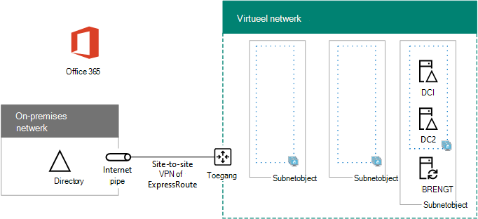

# <a name="high-availability-federated-authentication-phase-2-configure-domain-controllers"></a>Federatief hoge beschikbaarheid fase 2: domeincontrollers configureren

In deze fase van het implementeren van hoge beschikbaarheid voor Federatieverificatie van Microsoft 365 in Azure-infrastructuurservices configureert u twee domeincontrollers en de adreslijstsynchronisatieserver in het virtuele Azure-netwerk. Clientwebaanvragen voor verificatie kunnen vervolgens worden geverifieerd in het virtuele Azure-netwerk, in plaats van dat verificatieverkeer via de SITE-naar-site VPN-verbinding naar uw on-premises netwerk te verzenden.
  
> [!NOTE]
> Active Directory Federation Services (AD FS) kan Azure Active Directory (Azure AD) niet gebruiken als vervanging voor AD DS-domeincontrollers (Active Directory Domain Services). 
  
U moet deze fase voltooien voordat u verder gaat [met fase 3: AD FS-servers configureren.](high-availability-federated-authentication-phase-3-configure-ad-fs-servers.md) Zie [Federatieverificatie met hoge beschikbaarheid implementeren voor Microsoft 365 in Azure](deploy-high-availability-federated-authentication-for-microsoft-365-in-azure.md) voor alle fasen.
  
## <a name="create-the-domain-controller-virtual-machines-in-azure"></a>Virtuele machines voor domeincontrollers maken in Azure

Eerst moet u de kolom Virtuele **machinenaam** van tabel M invullen en de grootte van virtuele machines zo nodig wijzigen in de **kolom Minimumgrootte.**
  
|**Item**|**Naam virtuele machine**|**Galerieafbeelding**|**Opslagtype**|**Minimumgrootte**|
|:-----|:-----|:-----|:-----|:-----|
|1.  <br/> | (eerste domeincontroller, voorbeeld DC1)  <br/> |Windows Server 2016 Datacenter  <br/> |Standard_LRS  <br/> |Standard_D2  <br/> |
|2.  <br/> | (tweede domeincontroller, voorbeeld DC2)  <br/> |Windows Server 2016 Datacenter  <br/> |Standard_LRS  <br/> |Standard_D2  <br/> |
|3.  <br/> | (adreslijstsynchronisatieserver, bijvoorbeeld DS1)  <br/> |Windows Server 2016 Datacenter  <br/> |Standard_LRS  <br/> |Standard_D2  <br/> |
|4.  <br/> | (eerste AD FS-server, bijvoorbeeld ADFS1)  <br/> |Windows Server 2016 Datacenter  <br/> |Standard_LRS  <br/> |Standard_D2  <br/> |
|5.  <br/> | (tweede AD FS-server, bijvoorbeeld ADFS2)  <br/> |Windows Server 2016 Datacenter  <br/> |Standard_LRS  <br/> |Standard_D2  <br/> |
|6.  <br/> | (first web application proxy server, example WEB1)  <br/> |Windows Server 2016 Datacenter  <br/> |Standard_LRS  <br/> |Standard_D2  <br/> |
|7.  <br/> | (tweede webtoepassingsproxyserver, voorbeeld WEB2)  <br/> |Windows Server 2016 Datacenter  <br/> |Standard_LRS  <br/> |Standard_D2  <br/> |
   
 **Tabel M - Virtuele machines voor federatief hoge beschikbaarheid voor Microsoft 365 in Azure**
  
Zie Groottes voor virtuele machines voor de volledige lijst met virtuele [machineformaten.](/azure/virtual-machines/virtual-machines-windows-sizes)
  
Met het volgende Azure PowerShell-opdrachtblok worden de virtuele machines voor de twee domeincontrollers gemaakt. Geef de waarden op voor de variabelen en verwijder de \< and > tekens. In dit opdrachtblok van Azure PowerShell worden waarden uit de volgende tabellen gebruikt:
  
- Tabel M, voor uw virtuele machines
    
- Tabel R, voor uw resourcegroepen
    
- Tabel V, voor uw virtuele netwerkinstellingen
    
- Tabel S, voor uw subnetten
    
- Tabel I, voor uw statische IP-adressen
    
- Tabel A, voor uw beschikbaarheidssets
    
U hebt tabellen R, V, S, I en A gedefinieerd in [fase 1: Azure configureren.](high-availability-federated-authentication-phase-1-configure-azure.md)
  
> [!NOTE]
> Met de volgende opdrachtsets wordt de meest recente versie van Azure PowerShell gebruikt. Zie [Aan de slag met Azure PowerShell](/powershell/azure/get-started-azureps). 
  
Wanneer u alle juiste waarden hebt opgegeven, moet u het resulterende blok uitvoeren op de Azure PowerShell-prompt of in de Ise (Integrated Script Environment) van PowerShell op uw lokale computer.
  
> [!TIP]
> Als u kant-en-klaar PowerShell-opdrachtblokken wilt genereren op basis van uw aangepaste instellingen, gebruikt u deze [Configuratiewerkboek van Microsoft Excel.](https://github.com/MicrosoftDocs/OfficeDocs-Enterprise/raw/live/Enterprise/downloads/O365FedAuthInAzure_Config.xlsx) 

```powershell
# Set up variables common to both virtual machines
$locName="<your Azure location>"
$vnetName="<Table V - Item 1 - Value column>"
$subnetName="<Table S - Item 1 - Value column>"
$avName="<Table A - Item 1 - Availability set name column>"
$rgNameTier="<Table R - Item 1 - Resource group name column>"
$rgNameInfra="<Table R - Item 4 - Resource group name column>"

$rgName=$rgNameInfra
$vnet=Get-AzVirtualNetwork -Name $vnetName -ResourceGroupName $rgName
$subnet=Get-AzVirtualNetworkSubnetConfig -VirtualNetwork $vnet -Name $subnetName

$rgName=$rgNameTier
$avSet=Get-AzAvailabilitySet -Name $avName -ResourceGroupName $rgName 

# Create the first domain controller
$vmName="<Table M - Item 1 - Virtual machine name column>"
$vmSize="<Table M - Item 1 - Minimum size column>"
$staticIP="<Table I - Item 1 - Value column>"
$diskStorageType="<Table M - Item 1 - Storage type column>"
$diskSize=<size of the extra disk for Active Directory Domain Services (AD DS) data in GB>

$nic=New-AzNetworkInterface -Name ($vmName +"-NIC") -ResourceGroupName $rgName -Location $locName -Subnet $subnet -PrivateIpAddress $staticIP
$vm=New-AzVMConfig -VMName $vmName -VMSize $vmSize -AvailabilitySetId $avset.Id
$vm=Set-AzVMOSDisk -VM $vm -Name ($vmName +"-OS") -DiskSizeInGB 128 -CreateOption FromImage -StorageAccountType $diskStorageType
$diskConfig=New-AzDiskConfig -AccountType $diskStorageType -Location $locName -CreateOption Empty -DiskSizeGB $diskSize
$dataDisk1=New-AzDisk -DiskName ($vmName + "-DataDisk1") -Disk $diskConfig -ResourceGroupName $rgName
$vm=Add-AzVMDataDisk -VM $vm -Name ($vmName + "-DataDisk1") -CreateOption Attach -ManagedDiskId $dataDisk1.Id -Lun 1
$cred=Get-Credential -Message "Type the name and password of the local administrator account for the first domain controller." 
$vm=Set-AzVMOperatingSystem -VM $vm -Windows -ComputerName $vmName -Credential $cred -ProvisionVMAgent -EnableAutoUpdate
$vm=Set-AzVMSourceImage -VM $vm -PublisherName MicrosoftWindowsServer -Offer WindowsServer -Skus 2016-Datacenter -Version "latest"
$vm=Add-AzVMNetworkInterface -VM $vm -Id $nic.Id
New-AzVM -ResourceGroupName $rgName -Location $locName -VM $vm

# Create the second domain controller
$vmName="<Table M - Item 2 - Virtual machine name column>"
$vmSize="<Table M - Item 2 - Minimum size column>"
$staticIP="<Table I - Item 2 - Value column>"
$diskStorageType="<Table M - Item 2 - Storage type column>"
$diskSize=<size of the extra disk for AD DS data in GB>

$nic=New-AzNetworkInterface -Name ($vmName +"-NIC") -ResourceGroupName $rgName -Location $locName -Subnet $subnet -PrivateIpAddress $staticIP
$vm=New-AzVMConfig -VMName $vmName -VMSize $vmSize -AvailabilitySetId $avset.Id
$vm=Set-AzVMOSDisk -VM $vm -Name ($vmName +"-OS") -DiskSizeInGB 128 -CreateOption FromImage -StorageAccountType $diskStorageType
$diskConfig=New-AzDiskConfig -AccountType $diskStorageType -Location $locName -CreateOption Empty -DiskSizeGB $diskSize
$dataDisk1=New-AzDisk -DiskName ($vmName + "-DataDisk1") -Disk $diskConfig -ResourceGroupName $rgName
$vm=Add-AzVMDataDisk -VM $vm -Name ($vmName + "-DataDisk1") -CreateOption Attach -ManagedDiskId $dataDisk1.Id -Lun 1
$cred=Get-Credential -Message "Type the name and password of the local administrator account for the second domain controller." 
$vm=Set-AzVMOperatingSystem -VM $vm -Windows -ComputerName $vmName -Credential $cred -ProvisionVMAgent -EnableAutoUpdate
$vm=Set-AzVMSourceImage -VM $vm -PublisherName MicrosoftWindowsServer -Offer WindowsServer -Skus 2016-Datacenter -Version "latest"
$vm=Add-AzVMNetworkInterface -VM $vm -Id $nic.Id
New-AzVM -ResourceGroupName $rgName -Location $locName -VM $vm

# Create the directory synchronization server
$vmName="<Table M - Item 3 - Virtual machine name column>"
$vmSize="<Table M - Item 3 - Minimum size column>"
$staticIP="<Table I - Item 3 - Value column>"
$diskStorageType="<Table M - Item 3 - Storage type column>"

$nic=New-AzNetworkInterface -Name ($vmName +"-NIC") -ResourceGroupName $rgName -Location $locName -Subnet $subnet -PrivateIpAddress $staticIP
$vm=New-AzVMConfig -VMName $vmName -VMSize $vmSize

$cred=Get-Credential -Message "Type the name and password of the local administrator account for the directory synchronization server." 
$vm=Set-AzVMOperatingSystem -VM $vm -Windows -ComputerName $vmName -Credential $cred -ProvisionVMAgent -EnableAutoUpdate
$vm=Set-AzVMSourceImage -VM $vm -PublisherName MicrosoftWindowsServer -Offer WindowsServer -Skus 2016-Datacenter -Version "latest"
$vm=Add-AzVMNetworkInterface -VM $vm -Id $nic.Id
$vm=Set-AzVMOSDisk -VM $vm -Name ($vmName +"-OS") -DiskSizeInGB 128 -CreateOption FromImage -StorageAccountType $diskStorageType
New-AzVM -ResourceGroupName $rgName -Location $locName -VM $vm
```

> [!NOTE]
> Omdat deze virtuele machines voor een intranettoepassing zijn, krijgen ze geen openbaar IP-adres of een DNS-domeinnaamlabel toegewezen en worden ze blootgesteld aan internet. Dit betekent echter ook dat u geen verbinding met ze kunt maken vanuit de Azure-portal. De **optie** Verbinding maken is niet beschikbaar wanneer u de eigenschappen van de virtuele computer bekijkt. Gebruik het accessoire Extern bureaublad-verbinding of een ander hulpprogramma voor extern bureaublad om verbinding te maken met de virtuele computer met de dns-naam van het privé-IP-adres of intranet.
  
## <a name="configure-the-first-domain-controller"></a>De eerste domeincontroller configureren

Gebruik de externe bureaubladclient van uw keuze en maak een externe bureaubladverbinding met de eerste virtuele domeincontroller. Gebruik de intranet DNS- of computernaam en de referenties van het lokale beheerdersaccount.
  
Voeg vervolgens de extra gegevensschijf toe aan de eerste domeincontroller met deze opdracht vanuit een Windows PowerShell-opdrachtprompt op de eerste virtuele **domeincontroller:**
  
```powershell
Get-Disk | Where PartitionStyle -eq "RAW" | Initialize-Disk -PartitionStyle MBR -PassThru | New-Partition -AssignDriveLetter -UseMaximumSize | Format-Volume -FileSystem NTFS -NewFileSystemLabel "WSAD Data"
```

Test vervolgens de connectiviteit van de eerste domeincontroller met locaties in uw organisatienetwerk door de **pingopdracht** te gebruiken om namen en IP-adressen van resources in uw organisatienetwerk te pingen.
  
Deze procedure zorgt ervoor dat de DNS-naamresolutie correct werkt (dat de virtuele machine correct is geconfigureerd met on-premises DNS-servers) en dat pakketten van en naar het cross-premises virtuele netwerk kunnen worden verzonden. Als deze basistest mislukt, neem dan contact op met uw IT-afdeling om de problemen met dns-naamoplossing en pakketbezorging op te lossen.
  
Voer vervolgens vanuit de opdrachtprompt van Windows PowerShell op de eerste domeincontroller de volgende opdrachten uit:
  
```powershell
$domname="<DNS domain name of the domain for which this computer will be a domain controller, such as corp.contoso.com>"
$cred = Get-Credential -Message "Enter credentials of an account with permission to join a new domain controller to the domain"
Install-WindowsFeature AD-Domain-Services -IncludeManagementTools
Install-ADDSDomainController -InstallDns -DomainName $domname  -DatabasePath "F:\NTDS" -SysvolPath "F:\SYSVOL" -LogPath "F:\Logs" -Credential $cred
```

U wordt gevraagd de referenties van een domeinbeheerderaccount op te leveren. De computer wordt opnieuw gestart.
  
## <a name="configure-the-second-domain-controller"></a>De tweede domeincontroller configureren

Gebruik de externe bureaubladclient van uw keuze en maak een externe bureaubladverbinding met de virtuele machine van de tweede domeincontroller. Gebruik de intranet DNS- of computernaam en de referenties van het lokale beheerdersaccount.
  
Vervolgens moet u de extra gegevensschijf toevoegen aan de tweede domeincontroller met deze opdracht vanuit een Windows PowerShell-opdrachtprompt op de virtuele machine van de tweede **domeincontroller:**
  
```powershell
Get-Disk | Where PartitionStyle -eq "RAW" | Initialize-Disk -PartitionStyle MBR -PassThru | New-Partition -AssignDriveLetter -UseMaximumSize | Format-Volume -FileSystem NTFS -NewFileSystemLabel "WSAD Data"
```

Voer vervolgens de volgende opdrachten uit:
  
```powershell
$domname="<DNS domain name of the domain for which this computer will be a domain controller, such as corp.contoso.com>"
$cred = Get-Credential -Message "Enter credentials of an account with permission to join a new domain controller to the domain"
Install-WindowsFeature AD-Domain-Services -IncludeManagementTools
Install-ADDSDomainController -InstallDns -DomainName $domname  -DatabasePath "F:\NTDS" -SysvolPath "F:\SYSVOL" -LogPath "F:\Logs" -Credential $cred

```

U wordt gevraagd de referenties van een domeinbeheerderaccount op te leveren. De computer wordt opnieuw gestart.
  
Vervolgens moet u de DNS-servers voor uw virtuele netwerk bijwerken, zodat Azure virtuele machines de IP-adressen van de twee nieuwe domeincontrollers toewijst om te gebruiken als hun DNS-servers. Vul de variabelen in en voer deze opdrachten uit vanuit een Windows PowerShell-opdrachtprompt op uw lokale computer:
  
```powershell
$rgName="<Table R - Item 4 - Resource group name column>"
$adrgName="<Table R - Item 1 - Resource group name column>"
$locName="<your Azure location>"
$vnetName="<Table V - Item 1 - Value column>"
$onpremDNSIP1="<Table D - Item 1 - DNS server IP address column>"
$onpremDNSIP2="<Table D - Item 2 - DNS server IP address column>"
$staticIP1="<Table I - Item 1 - Value column>"
$staticIP2="<Table I - Item 2 - Value column>"
$firstDCName="<Table M - Item 1 - Virtual machine name column>"
$secondDCName="<Table M - Item 2 - Virtual machine name column>"

$vnet=Get-AzVirtualNetwork -ResourceGroupName $rgName -Name $vnetName
$vnet.DhcpOptions.DnsServers.Add($staticIP1)
$vnet.DhcpOptions.DnsServers.Add($staticIP2) 
$vnet.DhcpOptions.DnsServers.Remove($onpremDNSIP1)
$vnet.DhcpOptions.DnsServers.Remove($onpremDNSIP2) 
Set-AzVirtualNetwork -VirtualNetwork $vnet
Restart-AzVM -ResourceGroupName $adrgName -Name $firstDCName
Restart-AzVM -ResourceGroupName $adrgName -Name $secondDCName
```

Houd er rekening mee dat we de twee domeincontrollers opnieuw starten, zodat ze niet zijn geconfigureerd met de on-premises DNS-servers als DNS-servers. Omdat ze beide DNS-servers zelf zijn, zijn ze automatisch geconfigureerd met de on-premises DNS-servers als DNS-doorsturende servers toen ze werden gepromoveerd naar domeincontrollers.
  
Vervolgens moeten we een Active Directory-replicatiesite maken om ervoor te zorgen dat servers in het virtuele Azure-netwerk gebruikmaken van de lokale domeincontrollers. Maak verbinding met een domeincontroller met een domeinbeheerderaccount en voer de volgende opdrachten uit vanuit een Windows PowerShell-prompt op beheerdersniveau:
  
```powershell
$vnet="<Table V - Item 1 - Value column>"
$vnetSpace="<Table V - Item 4 - Value column>"
New-ADReplicationSite -Name $vnet 
New-ADReplicationSubnet -Name $vnetSpace -Site $vnet
```

## <a name="configure-the-directory-synchronization-server"></a>De adreslijstsynchronisatieserver configureren

Gebruik de externe bureaubladclient van uw keuze en maak een externe bureaubladverbinding met de virtuele computer van de adreslijstsynchronisatieserver. Gebruik de intranet DNS- of computernaam en de referenties van het lokale beheerdersaccount.
  
Sluit u vervolgens aan bij het juiste AD DS-domein met deze opdrachten op de Windows PowerShell-prompt.
  
```powershell
$domName="<AD DS domain name to join, such as corp.contoso.com>"
$cred=Get-Credential -Message "Type the name and password of a domain acccount."
Add-Computer -DomainName $domName -Credential $cred
Restart-Computer
```

Hier is de configuratie die het resultaat is van de succesvolle voltooiing van deze fase, met computernamen van tijdelijke aanduidingen.
  
**Fase 2: De domeincontrollers en adreslijstsynchronisatieserver voor uw federatief verificatie-infrastructuur met hoge beschikbaarheid in Azure**


  
## <a name="next-step"></a>Volgende stap

Fase [3: AD FS-servers configureren om](high-availability-federated-authentication-phase-3-configure-ad-fs-servers.md) deze werkbelasting te blijven configureren.
  
## <a name="see-also"></a>Zie ook

[Federatieverificatie met hoge beschikbaarheid implementeren voor Microsoft 365 in Azure](deploy-high-availability-federated-authentication-for-microsoft-365-in-azure.md)
  
[Federatief identiteit voor uw Microsoft 365-dev/testomgeving](federated-identity-for-your-microsoft-365-dev-test-environment.md)
  
[Microsoft 365-oplossings- en -architectuurcentrum](../solutions/index.yml)