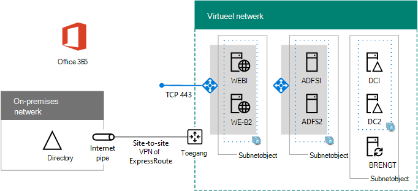

# <a name="high-availability-federated-authentication-phase-4-configure-web-application-proxies"></a>Federatief hoge beschikbaarheid fase 4: Webtoepassingsproxies configureren

In deze fase van het implementeren van hoge beschikbaarheid voor Microsoft 365 federatieve verificatie in Azure-infrastructuurservices, maakt u een interne load balancer en twee AD FS-servers.
  
U moet deze fase voltooien voordat u verder gaat [met fase 5: Federatief verificatie configureren voor Microsoft 365.](high-availability-federated-authentication-phase-5-configure-federated-authentic.md) Zie [Federatieverificatie met hoge](deploy-high-availability-federated-authentication-for-microsoft-365-in-azure.md) beschikbaarheid implementeren voor Microsoft 365 in Azure voor alle fasen.
  
## <a name="create-the-internet-facing-load-balancer-in-azure"></a>De op internet gerichte laadsaldor maken in Azure

U moet een op internet gerichte load balancer maken, zodat Azure het inkomende clientverificatieverkeer van internet gelijkmatig distribueert over de twee proxyservers van de webtoepassing.
  
> [!NOTE]
> Met de volgende opdrachtsets wordt de meest recente versie van Azure PowerShell gebruikt. Zie [Aan de slag met Azure PowerShell.](/powershell/azure/get-started-azureps) 
  
Wanneer u waarden voor locatie en resourcegroep hebt opgegeven, moet u het resulterende blok uitvoeren op de opdrachtprompt Azure PowerShell powershell of in de PowerShell-ise.
  
> [!TIP]
> Als u kant-en-klaar PowerShell-opdrachtblokken wilt genereren op basis van uw aangepaste instellingen, gebruikt u [deze Microsoft Excel configuratiewerkboek.](https://github.com/MicrosoftDocs/OfficeDocs-Enterprise/raw/live/Enterprise/downloads/O365FedAuthInAzure_Config.xlsx) 

```powershell
# Set up key variables
$locName="<your Azure location>"
$rgName="<Table R - Item 4 - Resource group name column>"

$publicIP=New-AzPublicIpAddress -ResourceGroupName $rgName -Name "WebProxyPublicIP" -Location $LocName -AllocationMethod "Static"
$frontendIP=New-AzLoadBalancerFrontendIpConfig -Name "WebAppProxyServers-LBFE" -PublicIpAddress $publicIP
$beAddressPool=New-AzLoadBalancerBackendAddressPoolConfig -Name "WebAppProxyServers-LBBE"
$healthProbe=New-AzLoadBalancerProbeConfig -Name "WebServersProbe" -Protocol "TCP" -Port 443 -IntervalInSeconds 15 -ProbeCount 2
$lbrule=New-AzLoadBalancerRuleConfig -Name "WebTraffic" -FrontendIpConfiguration $frontendIP -BackendAddressPool $beAddressPool -Probe $healthProbe -Protocol "TCP" -FrontendPort 443 -BackendPort 443
New-AzLoadBalancer -ResourceGroupName $rgName -Name "WebAppProxyServers" -Location $locName -LoadBalancingRule $lbrule -BackendAddressPool $beAddressPool -Probe $healthProbe -FrontendIpConfiguration $frontendIP
```

Als u het openbare IP-adres wilt weergeven dat is toegewezen aan uw laadsaldor op internet, voert u deze opdrachten uit op de opdrachtprompt Azure PowerShell uw lokale computer:
  
```powershell
Write-Host (Get-AzPublicIpaddress -Name "WebProxyPublicIP" -ResourceGroup $rgName).IPAddress
```

## <a name="determine-your-federation-service-fqdn-and-create-dns-records"></a>Uw federatieservice FQDN bepalen en DNS-records maken

U moet de DNS-naam bepalen om de naam van uw federatieservice op internet te identificeren. Azure AD Verbinding maken configureert Microsoft 365 met deze naam in fase 5, die deel gaat uitmaken van de URL die Microsoft 365 verzendt naar verbindings clients om een beveiligings-token te krijgen. Een voorbeeld is fs.contoso.com (fs staat voor federatieservice).
  
Wanneer u uw federatieservice FDQN hebt, maakt u een openbaar DNS-domein A-record voor de federatieservice FDQN die wordt opgelost naar het openbare IP-adres van de azure internet-facing load balancer.
  
|**Naam**|**Type**|**TTL**|**Waarde**|
|:-----|:-----|:-----|:-----|
|federatieservice FDQN  <br/> |A  <br/> |3600  <br/> |openbaar IP-adres van de Azure Internet-facing load balancer (weergegeven door de **opdracht Write-Host** in de vorige sectie) <br/> |
   
Hier is een voorbeeld:
  
|**Naam**|**Type**|**TTL**|**Waarde**|
|:-----|:-----|:-----|:-----|
|fs.contoso.com  <br/> |A  <br/> |3600  <br/> |131.107.249.117  <br/> |
   
Voeg vervolgens een DNS-adresrecord toe aan de persoonlijke DNS-naamruimte van uw organisatie die uw federatieservice FQDN opsleurt aan het persoonlijke IP-adres dat is toegewezen aan de interne laadbalans voor de AD FS-servers (tabel I, item 4, kolom Waarde).
  
## <a name="create-the-web-application-proxy-server-virtual-machines-in-azure"></a>Virtuele machines voor webtoepassingsproxyserver maken in Azure

Gebruik het volgende blok met Azure PowerShell om de virtuele machines voor de twee proxyservers voor webtoepassing te maken. 
  
In de volgende Azure PowerShell opdrachtenets worden waarden uit de volgende tabellen gebruikt:
  
- Tabel M, voor uw virtuele machines
    
- Tabel R, voor uw resourcegroepen
    
- Tabel V, voor uw virtuele netwerkinstellingen
    
- Tabel S, voor uw subnetten
    
- Tabel I, voor uw statische IP-adressen
    
- Tabel A, voor uw beschikbaarheidssets
    
U hebt tabel M gedefinieerd in [fase 2: Domeincontrollers](high-availability-federated-authentication-phase-2-configure-domain-controllers.md) en tabellen R, V, S, I en A configureren in [fase 1: Azure configureren.](high-availability-federated-authentication-phase-1-configure-azure.md)
  
Wanneer u alle juiste waarden hebt opgegeven, kunt u het resulterende blok uitvoeren bij de opdrachtprompt Azure PowerShell powershell of in de PowerShell-ise.
  
```powershell
# Set up variables common to both virtual machines
$locName="<your Azure location>"
$vnetName="<Table V - Item 1 - Value column>"
$subnetName="<Table R - Item 3 - Subnet name column>"
$avName="<Table A - Item 3 - Availability set name column>"
$rgNameTier="<Table R - Item 3 - Resource group name column>"
$rgNameInfra="<Table R - Item 4 - Resource group name column>"

$rgName=$rgNameInfra
$vnet=Get-AzVirtualNetwork -Name $vnetName -ResourceGroupName $rgName
$subnet=Get-AzVirtualNetworkSubnetConfig -VirtualNetwork $vnet -Name $subnetName
$backendSubnet=Get-AzVirtualNetworkSubnetConfig -Name $subnetName -VirtualNetwork $vnet
$webLB=Get-AzLoadBalancer -ResourceGroupName $rgName -Name "WebAppProxyServers"

$rgName=$rgNameTier
$avSet=Get-AzAvailabilitySet -Name $avName -ResourceGroupName $rgName

# Create the first web application proxy server virtual machine
$vmName="<Table M - Item 6 - Virtual machine name column>"
$vmSize="<Table M - Item 6 - Minimum size column>"
$staticIP="<Table I - Item 7 - Value column>"
$diskStorageType="<Table M - Item 6 - Storage type column>"

$nic=New-AzNetworkInterface -Name ($vmName +"-NIC") -ResourceGroupName $rgName -Location $locName -Subnet $backendSubnet -LoadBalancerBackendAddressPool $webLB.BackendAddressPools[0] -PrivateIpAddress $staticIP
$vm=New-AzVMConfig -VMName $vmName -VMSize $vmSize -AvailabilitySetId $avset.Id

$cred=Get-Credential -Message "Type the name and password of the local administrator account for the first web application proxy server." 
$vm=Set-AzVMOperatingSystem -VM $vm -Windows -ComputerName $vmName -Credential $cred -ProvisionVMAgent -EnableAutoUpdate
$vm=Set-AzVMSourceImage -VM $vm -PublisherName MicrosoftWindowsServer -Offer WindowsServer -Skus 2016-Datacenter -Version "latest"
$vm=Add-AzVMNetworkInterface -VM $vm -Id $nic.Id
$vm=Set-AzVMOSDisk -VM $vm -Name ($vmName +"-OS") -DiskSizeInGB 128 -CreateOption FromImage -StorageAccountType $diskStorageType
New-AzVM -ResourceGroupName $rgName -Location $locName -VM $vm

# Create the second web application proxy virtual machine
$vmName="<Table M - Item 7 - Virtual machine name column>"
$vmSize="<Table M - Item 7 - Minimum size column>"
$staticIP="<Table I - Item 8 - Value column>"
$diskStorageType="<Table M - Item 7 - Storage type column>"

$nic=New-AzNetworkInterface -Name ($vmName +"-NIC") -ResourceGroupName $rgName -Location $locName  -Subnet $backendSubnet -LoadBalancerBackendAddressPool $webLB.BackendAddressPools[0] -PrivateIpAddress $staticIP
$vm=New-AzVMConfig -VMName $vmName -VMSize $vmSize -AvailabilitySetId $avset.Id

$cred=Get-Credential -Message "Type the name and password of the local administrator account for the second web application proxy server." 
$vm=Set-AzVMOperatingSystem -VM $vm -Windows -ComputerName $vmName -Credential $cred -ProvisionVMAgent -EnableAutoUpdate
$vm=Set-AzVMSourceImage -VM $vm -PublisherName MicrosoftWindowsServer -Offer WindowsServer -Skus 2016-Datacenter -Version "latest"
$vm=Add-AzVMNetworkInterface -VM $vm -Id $nic.Id
$vm=Set-AzVMOSDisk -VM $vm -Name ($vmName +"-OS") -DiskSizeInGB 128 -CreateOption FromImage -StorageAccountType $diskStorageType
New-AzVM -ResourceGroupName $rgName -Location $locName -VM $vm
```

> [!NOTE]
> Omdat deze virtuele machines voor een intranettoepassing zijn, krijgen ze geen openbaar IP-adres of een DNS-domeinnaamlabel toegewezen en worden ze blootgesteld aan internet. Dit betekent echter ook dat u geen verbinding met ze kunt maken vanuit de Azure-portal. De **Verbinding maken** optie is niet beschikbaar wanneer u de eigenschappen van de virtuele computer bekijkt. Gebruik het accessoire Extern bureaublad-verbinding of een ander hulpprogramma voor extern bureaublad om verbinding te maken met de virtuele computer met de persoonlijke DNS-naam van het IP-adres of intranet en de referenties van het lokale beheerdersaccount.
  
Hier is de configuratie die het resultaat is van de succesvolle voltooiing van deze fase, met computernamen van tijdelijke aanduidingen.
  
**Fase 4: De op internet gerichte load balancer en proxyservers voor webtoepassing voor uw federatieve verificatieinfrastructuur met hoge beschikbaarheid in Azure**


  
## <a name="next-step"></a>Volgende stap

Fase [5 gebruiken: Federatief verificatie](high-availability-federated-authentication-phase-5-configure-federated-authentic.md) configureren voor Microsoft 365 om deze werkbelasting te blijven configureren.
  
## <a name="see-also"></a>Zie ook

[Federatieverificatie met hoge beschikbaarheid implementeren voor Microsoft 365 in Azure](deploy-high-availability-federated-authentication-for-microsoft-365-in-azure.md)
  
[Federatief identiteit voor uw Microsoft 365 v/testomgeving](federated-identity-for-your-microsoft-365-dev-test-environment.md)
  
[Microsoft 365-oplossings- en -architectuurcentrum](../solutions/index.yml)