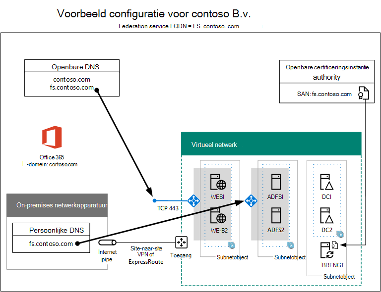

# Federatief hoge beschikbaarheid fase 5: Federatief verificatie configureren voor Microsoft 365

In deze laatste fase van het implementeren van federatieverificatie met hoge beschikbaarheid voor Microsoft 365 in Azure-infrastructuurservices, krijgt en installeert u een certificaat dat is uitgegeven door een openbare certificeringsinstantie, controleert u de configuratie en installeert en vervolgens Azure AD Connect op de adreslijstsynchronisatieserver installeert en uit. Azure AD Connect configureert uw Microsoft 365-abonnement en uw Active Directory Federation Services (AD FS) en proxyservers voor webtoepassing voor federatief verificatie.
  
Zie [Federatieverificatie met hoge beschikbaarheid implementeren voor Microsoft 365 in Azure](deploy-high-availability-federated-authentication-for-microsoft-365-in-azure.md) voor alle fasen.
  
## Een openbaar certificaat downloaden en kopiëren naar de adreslijstsynchronisatieserver

Ontvang een digitaal certificaat van een openbare certificeringsinstantie met de volgende eigenschappen:
  
- Een X.509-certificaat dat geschikt is voor het maken van SSL-verbindingen.
    
- De eigenschap Subject Alternative Name (SAN) is ingesteld op uw federatieservice FQDN (bijvoorbeeld: fs.contoso.com).
    
- Het certificaat moet de persoonlijke sleutel hebben en worden opgeslagen in DE PFX-indeling.
    
Bovendien moeten computers en apparaten van uw organisatie vertrouwen op de openbare certificeringsinstantie die het digitale certificaat uitvaardigt. Deze vertrouwensrelatie wordt tot stand gebracht door een hoofdcertificaat van de openbare certificeringsinstantie te laten installeren in de vertrouwde hoofdcertificeringsinstanties op uw computers en apparaten. Computers waarop Microsoft Windows wordt uitgevoerd, hebben meestal een set van deze typen certificaten geïnstalleerd van veelgebruikte certificeringsinstanties. Als het hoofdcertificaat van uw openbare certificeringsinstantie nog niet is geïnstalleerd, moet u dit implementeren op de computers en apparaten van uw organisatie.
  
Zie Vereisten voor federatie-installatie [en configuratie](/azure/active-directory/connect/active-directory-aadconnect-prerequisites#prerequisites-for-federation-installation-and-configuration)voor meer informatie over certificaatvereisten voor federatieverificatie.
  
Wanneer u het certificaat ontvangt, kopieert u het naar een map op het station C: van de adreslijstsynchronisatieserver. Noem bijvoorbeeld het bestand SSL.pfx en sla het op in de map C: \\ Certs op de adreslijstsynchronisatieserver.
  
## Uw configuratie verifiëren

U moet nu klaar zijn om Azure AD Connect en federatief verificatie voor Microsoft 365 te configureren. Om ervoor te zorgen dat u dat bent, is hier een controlelijst:
  
- Het openbare domein van uw organisatie wordt toegevoegd aan uw Microsoft 365-abonnement.
    
- De Microsoft 365-gebruikersaccounts van uw organisatie zijn geconfigureerd op de openbare domeinnaam van uw organisatie en kunnen zich met succes aanmelden.
    
- U hebt een federatieservice FQDN bepaald op basis van uw openbare domeinnaam.
    
- Een openbare DNS A-record voor uw federatieservice FQDN wijst naar het openbare IP-adres van de op internet gerichte Azure Load Balancer voor de proxyservers van de webtoepassing.
    
- Een persoonlijke DNS A-record voor uw federatieservice FQDN wijst naar het persoonlijke IP-adres van de interne Azure Load Balancer voor de AD FS-servers.
    
- Een digitaal certificaat van de openbare certificeringsinstantie dat geschikt is voor SSL-verbindingen met de SAN-set voor uw federatieservice FQDN, is een PFX-bestand dat is opgeslagen op uw adreslijstsynchronisatieserver.
    
- Het hoofdcertificaat voor de openbare certificeringsinstantie is geïnstalleerd in de Store vertrouwde hoofdcertificeringsinstanties op uw computers en apparaten.
    
Hier is een voorbeeld voor de Contoso-organisatie:
  
**Een voorbeeldconfiguratie voor een federatief verificatie-infrastructuur met hoge beschikbaarheid in Azure**

  
## Azure AD Connect uitvoeren om federatief verificatie te configureren

Met het hulpprogramma Azure AD Connect worden de AD FS-servers, de proxyservers van de webtoepassing en Microsoft 365 geconfigureerd voor federatief verificatie met de volgende stappen:
  
1. Maak een externe bureaubladverbinding met uw adreslijstsynchronisatieserver met een domeinaccount met lokale beheerdersbevoegdheden.
    
2. Open Internet Explorer op het bureaublad van de adreslijstsynchronisatieserver en ga naar [https://aka.ms/aadconnect](https://aka.ms/aadconnect) .
    
3. Klik op **de pagina Microsoft Azure Active Directory Connect** op **Downloaden** en klik vervolgens op **Uitvoeren.**
    
4. Klik op **de pagina Welkom bij Azure AD Connect** op **Ik** ga akkoord en klik vervolgens op **Doorgaan.**
    
5. Klik op **de pagina Express-instellingen** op **Aanpassen.**
    
6. Klik op **de pagina Vereiste onderdelen installeren** op **Installeren.**
    
7. Klik op de pagina **gebruikersaanmelding** op **federatie met AD FS** en klik vervolgens op **volgende**.
    
8. Typ op **de pagina Verbinding** maken met Azure AD de naam en het wachtwoord van een globale beheerdersaccount voor uw Microsoft 365-abonnement en klik vervolgens op **Volgende**.
    
9. Controleer  op de pagina Uw mappen verbinden of uw on-premises AD DS-forest (Active Directory Domain Services) is geselecteerd in **Forest,** typ de naam en het wachtwoord van een domeinbeheerderaccount, klik op **Adreslijst** toevoegen en klik vervolgens op **Volgende**.
    
10. Klik op **de configuratiepagina voor** aanmelding van Azure AD op **Volgende.**
    
11. Klik op **de filterpagina Domein** en OE op **Volgende.**
    
12. Klik op **de pagina Unieke identificatie van uw gebruikers** op **Volgende.**
    
13. Klik op **de pagina Gebruikers en apparaten filteren** op **Volgende.**
    
14. Klik op **de pagina** Optionele functies op **Volgende.**
    
15. Klik op **de pagina AD FS-farm** op **Een nieuwe AD FS-farm configureren.**
    
16. Klik **op Bladeren** en geef de locatie en naam van het SSL-certificaat van de openbare certificeringsinstantie op.
    
17. Wanneer u daarom wordt gevraagd, typt u het certificaatwachtwoord en klikt u op **OK.**
    
18. Controleer of **de naam van de** onderwerpnaam en **federatieservice** zijn ingesteld op uw federatieservice FQDN en klik vervolgens op **Volgende.**
    
19. Typ op **de pagina AD FS-servers** de naam van de eerste AD FS-server (Tabel M - Item 4 - kolom virtuele machinenaam) en klik vervolgens op **Toevoegen.**
    
20. Typ de naam van de tweede AD FS-server (tabel M - item 5 - kolom virtuele machinenaam), klik op Toevoegen **en** klik vervolgens op **Volgende.**
    
21. Typ op **de pagina Proxyservers** voor webtoepassing de naam van de eerste webtoepassingsproxyserver (Tabel M - Item 6 - kolom virtuele computernaam) en klik vervolgens op **Toevoegen.**
    
22. Typ de naam van de tweede webtoepassingsproxyserver (tabel M - item 7 - kolom virtuele computernaam), klik op Toevoegen **en** klik vervolgens op **Volgende.**
    
23. Typ op **de pagina Referenties van domeinbeheerder** de gebruikersnaam en het wachtwoord van een domeinbeheerderaccount en klik vervolgens op **Volgende**.
    
24. Typ op **de pagina AD FS-serviceaccount** de gebruikersnaam en het wachtwoord van een bedrijfsbeheerderaccount en klik vervolgens op **Volgende**.
    
25. Selecteer op **de pagina Azure AD Domain** in **Domain** de DNS-domeinnaam van uw organisatie en klik vervolgens op **Volgende**.
    
26. Klik op de pagina **Gereed voor configureren** op **Installeren**.
    
27. Klik op de pagina **installeren voltooid** op **verifiëren**. U ziet twee berichten die aangeven dat zowel het intranet als de internetconfiguratie is geverifieerd.
    
  - In het intranetbericht moet het persoonlijke IP-adres van uw interne Azure-laadsaldor voor uw AD FS-servers worden vermeld.
    
  - In het internetbericht moet het openbare IP-adres van uw Azure Internet-laadsaldor voor proxyservers voor webtoepassing worden vermeld.
    
28. Klik op de pagina **Installatie voltooid** op **Afsluiten**.
    
Hier is de definitieve configuratie, met namen van tijdelijke aanduidingen voor de servers.
  
**Fase 5: De uiteindelijke configuratie van een federatief verificatie-infrastructuur met hoge beschikbaarheid in Azure**

  
Uw federatief verificatie-infrastructuur met hoge beschikbaarheid voor Microsoft 365 in Azure is voltooid.
  
## Zie ook

[Federatieverificatie met hoge beschikbaarheid implementeren voor Microsoft 365 in Azure](deploy-high-availability-federated-authentication-for-microsoft-365-in-azure.md)
  
[Federatief identiteit voor uw Microsoft 365-dev/testomgeving](federated-identity-for-your-microsoft-365-dev-test-environment.md)
  
[Microsoft 365-oplossings- en -architectuurcentrum](../solutions/index.yml)

[Federatief identiteit voor Microsoft 365](https://support.office.com/article/Understanding-Office-365-identity-and-Azure-Active-Directory-06a189e7-5ec6-4af2-94bf-a22ea225a7a9#bk_federated)