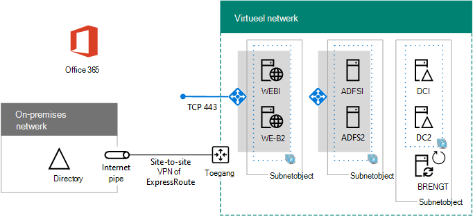

# Federatieve authenticatiefase van hoge beschikbaarheid 5: federatieve verificatie voor Microsoft 365 configurerenHigh availability federated authentication Phase 5: Configure federated authentication for Microsoft 365

In deze laatste fase van de implementatie van federatieve authenticatie van hoge beschikbaarheid voor Microsoft 365 in azure-infrastructuurservices, installeert en installeert u een certificaat dat is uitgegeven door een openbare certificeringsinstantie, controleert u de configuratie en voert u Azure AD Connect op de adreslijstsynchronisatie server uit.In this final phase of deploying high availability federated authentication for Microsoft 365 in Azure infrastructure services, you get and install a certificate issued by a public certification authority, verify your configuration, and then install and run Azure AD Connect on the directory synchronization server. Met Azure AD Connect worden uw Microsoft 365-abonnement en de proxyservers voor Active Directory Federation Services (AD FS) en webtoepassingsproxy (Active Directory Federation Services) en webtoepassingsproxy-servers geconfigureerd voor Federatie verificatie.Azure AD Connect configures your Microsoft 365 subscription and your Active Directory Federation Services (AD FS) and web application proxy servers for federated authentication.
  
Zie [federatieve authenticatie van hoge beschikbaarheid implementeren voor Microsoft 365 in azure](deploy-high-availability-federated-authentication-for-microsoft-365-in-azure.md) voor alle fasen.See [Deploy high availability federated authentication for Microsoft 365 in Azure](deploy-high-availability-federated-authentication-for-microsoft-365-in-azure.md) for all of the phases.
  
## Een openbaar certificaat aanvragen en kopiëren naar de adreslijstsynchronisatie serverGet a public certificate and copy it to the directory synchronization server

U ontvangt een digitaal certificaat van een openbare certificeringsinstantie met de volgende eigenschappen:Get a digital certificate from a public certification authority with the following properties:
  
- Een X. 509-certificaat geschikt voor het maken van SSL-verbindingen.An X.509 certificate suitable for creating SSL connections.
    
- De uitgebreide eigenschap Subject name (SAN) wordt ingesteld op de naam van uw Federation-service (voorbeeld: fs.contoso.com).The Subject Alternative Name (SAN) extended property is set to your federation service FQDN (example: fs.contoso.com).
    
- Het certificaat moet de persoonlijke sleutel hebben en zijn opgeslagen in de PFX-indeling.The certificate must have the private key and be stored in PFX format.
    
Daarnaast moeten uw computers en apparaten van uw organisatie de openbare certificeringsinstantie die het digitaal certificaat uitgeeft, vertrouwen.Additionally, your organization computers and devices must trust the public certification authority that is issuing the digital certificate. Deze vertrouw baarheid wordt bepaald door een basiscertificaat te gebruiken van de openbare certificeringsinstantie die in het archief met vertrouwde basiscertificeringsinstanties op uw computers en apparaten is geïnstalleerd.This trust is established by having a root certificate from the public certification authority installed in the trusted root certification authorities store on your computers and devices. Voor computers waarop Microsoft Windows wordt uitgevoerd is meestal een reeks van deze typen certificaten geïnstalleerd van veelgebruikte certificeringsinstanties.Computers running Microsoft Windows typically have a set of these types of certificates installed from commonly-used certification authorities. Als het basiscertificaat van uw openbare certificeringsinstantie nog niet is geïnstalleerd, moet u dit implementeren op de computers en apparaten van uw organisatie.If the root certificate from your public certification authority is not already installed, you must deploy this to the computers and devices of your organization.
  
Zie vereisten [voor Federatie installeren en configureren](https://docs.microsoft.com/azure/active-directory/connect/active-directory-aadconnect-prerequisites#prerequisites-for-federation-installation-and-configuration)voor meer informatie over de certificaatvereisten voor federatieve verificatie.For more information about certificate requirements for federated authentication, see [Prerequisites for federation installation and configuration](https://docs.microsoft.com/azure/active-directory/connect/active-directory-aadconnect-prerequisites#prerequisites-for-federation-installation-and-configuration).
  
Wanneer u het certificaat ontvangt, kopieert u het naar een map op C: station van de adreslijstsynchronisatie server.When you receive the certificate, copy it to a folder on the C: drive of the directory synchronization server. Geef bijvoorbeeld het bestand SSL. pfx op en sla dit op in de map C: \\ certs op de adreslijstsynchronisatie server.For example, name the file SSL.pfx and store it in the C:\\Certs folder on the directory synchronization server.
  
## De configuratie verifiërenVerify your configuration

Nu moet u Azure AD Connect en federatieve verificatie voor Microsoft 365 configureren.You should now be ready to configure Azure AD Connect and federated authentication for Microsoft 365. U kunt er ook voor zorgen dat u het volgende ziet:To ensure that you are, here is a checklist:
  
- Het openbare domein van uw organisatie wordt toegevoegd aan uw abonnement op Microsoft 365.Your organization's public domain is added to your Microsoft 365 subscription.
    
- De Microsoft 365-gebruikersaccounts van uw organisatie zijn geconfigureerd voor de openbare domeinnaam van uw organisatie en kan zich nu aanmelden.Your organization's Microsoft 365 user accounts are configured to your organization's public domain name and can successfully sign in.
    
- U hebt een Federatie service-FQDN vastgesteld op basis van uw openbare domeinnaam.You have determined a federation service FQDN based your public domain name.
    
- Een openbare DNS-record voor de FQDN van de Federation service verwijst naar het openbare IP-adres van de Azure-Load Balancer op internet voor de webtoepassingsproxy-servers.A public DNS A record for your federation service FQDN points to the public IP address of the Internet-facing Azure load balancer for the web application proxy servers.
    
- Een persoonlijke DNS-record voor de FQDN van de Federation service verwijst naar het persoonlijke IP-adres van de interne Azure Load Balancer voor de AD FS-servers.A private DNS A record for your federation service FQDN points to the private IP address of the internal Azure load balancer for the AD FS servers.
    
- Een openbare certificeringsinstantie-digitaal certificaat voor isssued dat geschikt is voor SSL-verbindingen met de SAN-set met de Federatie service FQDN is een PFX-bestand dat is opgeslagen op de adreslijstsynchronisatie server.A public certification authority-isssued digital certificate suitable for SSL connections with the SAN set to your federation service FQDN is a PFX file stored on your directory synchronization server.
    
- Het basiscertificaat voor de openbare certificeringsinstantie wordt in de lijst met vertrouwde basiscertificeringsinstanties geïnstalleerd op uw computer en apparaten.The root certificate for the public certification authority is installed in the Trusted Root Certification Authorities store on your computers and devices.
    
Hier ziet u een voorbeeld van de contoso-organisatie:Here is an example for the Contoso organization:
  
**Een voorbeeld configuratie voor een federatieve verificatie-infrastructuur met hoge beschikbaarheid in azure****An example configuration for a high availability federated authentication infrastructure in Azure**

  
## Azure AD Connect uitvoeren om federatieve verificatie te configurerenRun Azure AD Connect to configure federated authentication

Met het hulpprogramma Azure AD Connect worden de AD FS-servers, de webtoepassingsproxy en Microsoft 365 voor federatieve verificatie met de volgende stappen geconfigureerd:The Azure AD Connect tool configures the AD FS servers, the web application proxy servers, and Microsoft 365 for federated authentication with these steps:
  
1. Maak een verbinding met extern bureaublad met de adreslijstsynchronisatie server met een domeinaccount met lokale beheerdersbevoegdheden.Create a remote desktop connection to your directory synchronization server with a domain account that has local administrator privileges.
    
2. Open op de computer van de adreslijstsynchronisatie server Internet Explorer en ga naar [https://aka.ms/aadconnect](https://aka.ms/aadconnect) .From the desktop of the directory synchronization server, open Internet Explorer and go to [https://aka.ms/aadconnect](https://aka.ms/aadconnect).
    
3. Klik op de pagina **Microsoft Azure Active Directory Connect** op **downloaden**en klik vervolgens op **uitvoeren**.On the **Microsoft Azure Active Directory Connect** page, click **Download**, and then click **Run**.
    
4. Klik op de pagina **Welkom bij Azure AD Connect** op **Ik ga akkoord**en klik vervolgens op **Doorgaan.**On the **Welcome to Azure AD Connect** page, click **I agree**, and then click **Continue.**
    
5. Klik op de pagina **Express Settings** op **Customize**.On the **Express Settings** page, click **Customize**.
    
6. Klik op de pagina **vereiste onderdelen installeren** op **installeren**.On the **Install required components** page, click **Install**.
    
7. Klik op de pagina **gebruikersaanmelding** op **federatie met AD FS**en klik vervolgens op **volgende**.On the **User sign-in** page, click **Federation with AD FS**, and then click **Next**.
    
8. Typ op de pagina **verbinding maken met Azure AD** de naam en het wachtwoord voor het globale beheerdersaccount voor uw abonnement op microsoft 365 en klik op **volgende**.On the **Connect to Azure AD** page, type the name and password of a global administrator account for your Microsoft 365 subscription, and then click **Next**.
    
9. Zorg ervoor dat op de pagina **verbinding maken met uw** telefoonnummers het domein Active Directory Domain Services (AD DS) is geselecteerd in **het forest**, typ de naam en het wachtwoord van een domeinbeheerdersaccount en **Klik op** **volgende**.On the **Connect your directories** page, ensure that your on-premises Active Directory Domain Services (AD DS) forest is selected in **Forest**, type the name and password of a domain administrator account, click **Add Directory**, and then click **Next**.
    
10. Klik op de pagina met **aanmeld configuraties van Azure AD** op **volgende**.On the **Azure AD sign-in configuration** page, click **Next**.
    
11. Klik op de pagina **domein en ou filtering** op **volgende**.On the **Domain and OU filtering** page, click **Next**.
    
12. Op de pagina **unieke identificatie van uw gebruikers klikt u** op **volgende**.On the **Uniquely identifying your users** page, click **Next**.
    
13. Klik op de pagina **gebruikers en apparaten filteren** op **volgende**.On the **Filter users and devices** page, click **Next**.
    
14. Klik op de pagina **optionele functies** op **volgende**.On the **Optional features** page, click **Next**.
    
15. Klik op de **AD FS-Farm** pagina op **een nieuwe AD FS-farm configureren**.On the **AD FS farm** page, click **Configure a new AD FS farm**.
    
16. Klik op **Bladeren** en geef de locatie en de naam op van het SSL-certificaat van de openbare certificeringsinstantie.Click **Browse** and specify the location and name of the SSL certificate from the public certification authority.
    
17. Wanneer u hierom wordt gevraagd, typt u het certificaatwachtwoord en klikt u vervolgens op **OK**.When prompted, type the certificate password, and then click **OK**.
    
18. Controleer of de naam van het **onderwerp** en de naam van de **Federation service** zijn ingesteld op de FQDN van de Federation service en klik op **volgende**.Verify that the **Subject Name** and **Federation Service Name** are set to your federation service FQDN, and then click **Next**.
    
19. Op de pagina **AD FS servers** typt u de naam van de eerste AD FS-server (tabel M-item 4-kolomnaam van virtuele machine) en klikt u vervolgens op **toevoegen**.On the **AD FS servers** page, type your first AD FS server's name (Table M - Item 4 - Virtual machine name column), and then click **Add**.
    
20. Typ de naam van de tweede AD FS-server (tabel M-item 5-kolom met virtuele machinenaam), klik op **toevoegen**en klik op **volgende**.Type your second AD FS server's name (Table M - Item 5 - Virtual machine name column), click **Add**, and then click **Next**.
    
21. Typ op de pagina **Webtoepassings proxyservers** de naam van de eerste server van de webtoepassing (tabel M-item 6-kolomnaam van virtuele machine) en klik op **toevoegen**.On the **Web Application Proxy servers** page, type your first web application proxy server's name (Table M - Item 6 - Virtual machine name column), and then click **Add**.
    
22. Typ de naam van de tweede server van de webtoepassingsproxy (tabel M-item 7: kolomnaam van virtuele machine), klik op **toevoegen**en klik op **volgende**.Type your second web application proxy server's name (Table M - Item 7 - Virtual machine name column), click **Add**, and then click **Next**.
    
23. Typ op de pagina **referenties van domeinbeheerder** de gebruikersnaam en het wachtwoord van een domeinbeheerdersaccount en klik op **volgende**.On the **Domain Administrator credentials** page, type the user name and password of a domain administrator account, and then click **Next**.
    
24. Typ op de pagina **AD FS service-account** de gebruikersnaam en het wachtwoord van een beheerder account van een beheerder en klik op **volgende**.On the **AD FS service account** page, type the user name and password of an enterprise administrator account, and then click **Next**.
    
25. Selecteer op de pagina **Azure AD domain** in **Domain**de naam van de DNS-domeinnaam van uw organisatie en klik op **volgende**.On the **Azure AD Domain** page, in **Domain**, select your organization's DNS domain name, and then click **Next**.
    
26. Klik op de pagina **Gereed voor configureren** op **Installeren**.On the **Ready to configure** page, click **Install**.
    
27. Klik op de pagina **installeren voltooid** op **verifiëren**.On the **Installation complete** page, click **Verify**. U ziet twee berichten om aan te geven dat zowel het intranet als de Internet configuratie zijn geverifieerd.You should see two messages indicating that both the intranet and Internet configuration was successfully verified.
    
  - In het intranet bericht moet het persoonlijke IP-adres van uw Azure Internal Load Balancer voor uw AD FS-servers worden vermeld.The intranet message should list the private IP address of your Azure internal load balancer for your AD FS servers.
    
  - Het Internet bericht moet worden vermeld in het openbare IP-adres van uw Azure Internet Facing Load Balancer voor de proxyservers van uw webtoepassing.The Internet message should list the public IP address of your Azure Internet-facing load balancer for your web application proxy servers.
    
28. Klik op de pagina **Installatie voltooid** op **Afsluiten**.On the **Installation complete** page, click **Exit**.
    
Dit is de laatste configuratie, met de namen van de tijdelijke aanduidingen voor de servers.Here is the final configuration, with placeholder names for the servers.
  
**Fase 5: de laatste configuratie van een federatieve verificatie-infrastructuur met hoge beschikbaarheid in azure****Phase 5: The final configuration of a high availability federated authentication infrastructure in Azure**

  
Uw federatieve verificatie-infrastructuur van hoge beschikbaarheid voor Microsoft 365 in Azure is voltooid.Your high availability federated authentication infrastructure for Microsoft 365 in Azure is complete.
  
## Zie ookSee Also

[Federatieve authenticatie van hoge beschikbaarheid implementeren voor Microsoft 365 in azureDeploy high availability federated authentication for Microsoft 365 in Azure](deploy-high-availability-federated-authentication-for-microsoft-365-in-azure.md)
  
[Federatieve identiteit voor uw Microsoft 365 dev/testomgevingFederated identity for your Microsoft 365 dev/test environment](federated-identity-for-your-microsoft-365-dev-test-environment.md)
  
[Microsoft 365-oplossingen- en -architectuurcentrumMicrosoft 365 solution and architecture center](../solutions/solution-architecture-center.md)

[Federatieve identiteit voor Microsoft 365Federated identity for Microsoft 365](https://support.office.com/article/Understanding-Office-365-identity-and-Azure-Active-Directory-06a189e7-5ec6-4af2-94bf-a22ea225a7a9#bk_federated)

