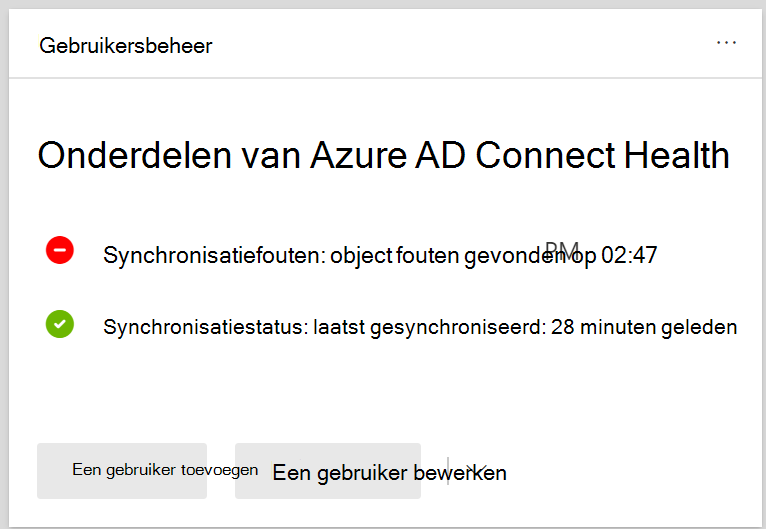
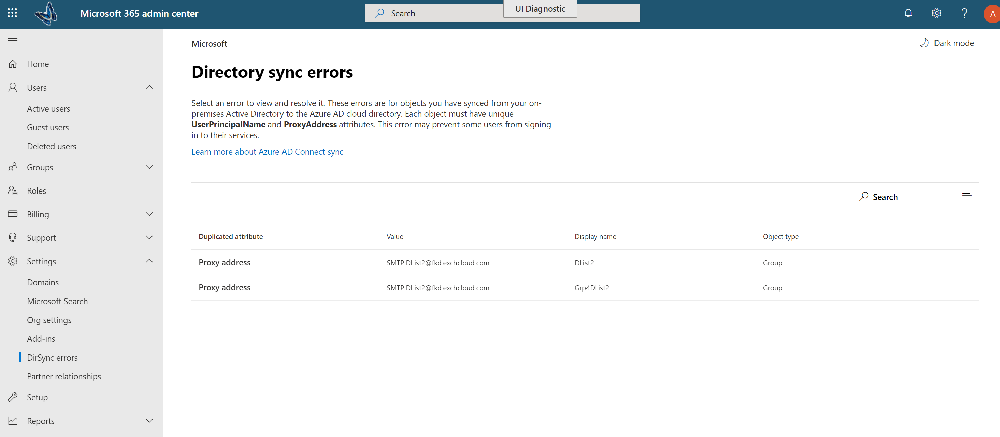

# Adreslijstsynchronisatiefouten weergeven in Microsoft 365View directory synchronization errors in Microsoft 365

U kunt adreslijstsynchronisatiefouten weergeven in het Microsoft 365 beheercentrum.You can view directory synchronization errors in the Microsoft 365 admin center. Alleen de objectfouten van de gebruiker worden weergegeven.Only the User object errors are displayed. Zie Objecten identificeren met [DirSyncProvisioningErrors](/azure/active-directory/hybrid/how-to-connect-syncservice-duplicate-attribute-resiliency)als u fouten met PowerShell wilt weergeven.To view errors with PowerShell, see [Identify objects with DirSyncProvisioningErrors](/azure/active-directory/hybrid/how-to-connect-syncservice-duplicate-attribute-resiliency).

## Adreslijstsynchronisatiefouten weergeven in het Microsoft 365 beheercentrumView directory synchronization errors in the Microsoft 365 admin center

Fouten weergeven in het Microsoft 365 beheercentrum:To view any errors in the Microsoft 365 admin center:
  
1. Meld u aan bij [het Microsoft 365 beheercentrum](https://admin.microsoft.com) met een globale beheerdersaccount.Sign in to the [Microsoft 365 admin center](https://admin.microsoft.com) with a global administrator account. 
    
2. Op de **startpagina** ziet u de **gebruikersbeheerkaart.**On the **Home** page, you'll see the **User management** card. 
    
    
  
3. Kies op de kaart **Synchronisatiefouten** onder **Azure AD Verbinding maken** om de fouten op de pagina **Adreslijstsynchronisatiefouten weer te** geven.On the card, choose **Sync errors** under **Azure AD Connect** to see the errors on the **Directory sync errors** page.   
    
    

4. Kies een van de fouten om het detailvenster weer te geven met informatie over de fout en tips voor het oplossen ervan.Choose any of the errors to display the details pane with information about the error and tips on how to fix it.

   
  
Zie na het weergeven [problemen met adreslijstsynchronisatie](fix-problems-with-directory-synchronization.md) oplossen om Microsoft 365 geïdentificeerde problemen te corrigeren.After viewing, see [fixing problems with directory synchronization for Microsoft 365](fix-problems-with-directory-synchronization.md) to correct any identified issues.