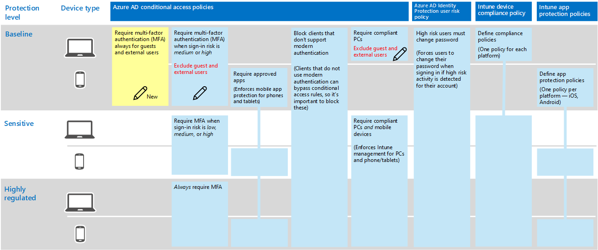

# Beleid voor het toestaan van gast- en externe B2B-toegangPolicies for allowing guest and external B2B access
In dit artikel wordt beschreven hoe u het aanbevolen algemene beleid voor identiteits- en apparaattoegangsaan aanpassen om B2B-accounttoegang (gast- en externe gebruikers) toe te staan.This article describes how to adjust the recommended common identity and device access policies to allow B2B account access (guest and external users). Deze richtlijnen zijn voortgebouwd op het [beleid voor algemene identiteits- en apparaattoegangsbeleid](identity-access-policies.md).This guidance builds on the [Common identity and device access policies](identity-access-policies.md).

Deze aanbevelingen zijn ontworpen om te worden toegepast op de **basislaag** van bescherming.These recommendations are designed to apply to the **baseline** tier of protection. U de aanbevelingen echter aanpassen op basis van de granulariteit van uw behoeften aan **gevoelige** en **sterk gereguleerde** bescherming.However, you can adjust the recommendations based on the granularity of your needs for **sensitive** and **highly regulated** protection. 

Als u B2B-gebruikers een pad biedt om te verifiëren met uw Azure AD-tenant, hebben deze gebruikers geen toegang tot uw hele omgeving.Providing a path for B2B users to authenticate with your Azure AD tenant doesn't give these users access to your entire environment. B2B-gebruikers hebben alleen toegang tot bronnen die met hen worden gedeeld (zoals bestanden) binnen de services die worden verleend in het beleid voor voorwaardelijke toegang.B2B users only have access to resources that are shared with them (such as files) within the services granted in the conditional access policies.

## Het gemeenschappelijke beleid bijwerken om gast- en externe toegang toe te staan en te beschermenUpdating the common policies to allow and protect guest and external access 

In het volgende diagram wordt het algemene beleid voor identiteits- en apparaattoegangs weergegeven en wordt (met een potloodpictogram) aangegeven welk beleid moet worden toegevoegd of bijgewerkt om gast- en externe toegang te beschermen.The following diagram illustrates the common identity and device access policies and indicates (with a pencil icon) which policies to add or update to protect guest and external access. 

In de volgende tabel worden de beleidsregels weergegeven die u moet bijwerken of nieuwe opties moet maken.The following table lists the policies you either need to update or create new. De algemene beleidsregels zijn gekoppeld aan de bijbehorende configuratie-instructies in het artikel [Algemene identiteits- en apparaattoegangsbeleidsregels.](identity-access-policies.md)The common policies link to the associated configuration instructions in the [Common identity and device access policies](identity-access-policies.md) article.

|BeschermingsniveauProtection level|BeleidPolicies|Meer informatieMore information|
|:---------------|:-------|:----------------|
|**Basislijn****Baseline**|[MFA altijd vereisen voor gast- en externe gebruikersRequire MFA always for guest and external users](identity-access-policies.md#require-mfa-based-on-sign-in-risk)|Maak deze nieuwe regel en pas deze alleen toe op gasten en externe gebruikers.Create this new rule and apply it only to guests and external users. Onder aanmeldingsrisico laat u alle opties ongecontroleerd om MFA altijd af te dwingen.Under sign-in risk, leave all options unchecked to always enforce MFA.|
|        |[MFA vereisen wanneer het aanmeldingsrisico *gemiddeld* of *hoog* isRequire MFA when sign-in risk is *medium* or *high*](identity-access-policies.md#require-mfa-based-on-sign-in-risk)|Wijzig deze regel om gast- en externe gebruikers uit te sluiten.Modify this rule to exclude guest and external users.|
|        |[Compatibele pc's vereisenRequire compliant PCs](identity-access-policies.md#require-compliant-pcs-but-not-compliant-phones-and-tablets)|Wijzig deze regel om gast- en externe gebruikers uit te sluiten.Modify this rule to exclude guest and external users.|

Als u gasten en externe gebruikers wilt opnemen of uitsluiten in regels voor voorwaardelijke toegang, klikt u op het tabblad Opnemen of uitsluiten en controleert **u Alle gasten en externe gebruikers.**To include or exclude guests and external users in conditional access rules, click the include or exclude tab and check **All guests and external users**.

## Meer informatieMore information

### Gasten versus externe gebruikersGuests vs. external users
In Azure AD zijn gast- en externe gebruikers hetzelfde.In Azure AD, guest and external users are the same. Het gebruikerstype voor beide is Gast.The user type for both of these is Guest. Gastgebruikers zijn B2B-gebruikers.Guest users are B2B users.

Microsoft Teams maakt onderscheid tussen gastgebruikers en externe gebruikers in de app, maar dit zijn beide B2B-gebruikers bij het verifiëren.Microsoft Teams differentiates between guest users and external users within the app, but these are both B2B users when authenticating. Zie [Gast- en externe toegang inschakelen voor Teams voor](teams-access-policies.md#enabling-guest-and-external-access-for-teams)meer informatie over gast- en externe gebruikers van Teams.For more information about Teams guest and external users, see [Enabling guest and external access for Teams](teams-access-policies.md#enabling-guest-and-external-access-for-teams).

### MFA altijd vereisen voor gast- en externe gebruikersRequire MFA always for guest and external users
Deze regel vraagt gasten zich te registreren voor MFA in uw tenant, ongeacht of ze zijn geregistreerd voor MFA in hun woninghuurder.This rule prompts guests to register for MFA in your tenant, regardless of whether they're registered for MFA in their home tenant. Wanneer u toegang krijgt tot bronnen in uw tenant, moeten gasten en externe gebruikers MFA voor elk verzoek gebruiken.When accessing resources in your tenant, guests and external users are required to use MFA for every request. 

### Gasten en externe gebruikers uitsluiten van op risico's gebaseerde MFAExcluding guest and external users from risk-based MFA
Hoewel organisaties op risico's gebaseerd beleid kunnen afdwingen voor B2B-gebruikers met behulp van Identiteitsbescherming, zijn er beperkingen in de implementatie van gebruikers van Identiteitsbescherming voor B2B-samenwerkingsgebruikers in een bronmap vanwege hun identiteit die in hun huis bestaat Directory.While organizations can enforce risk-based policies for B2B users using Identity Protection, there are limitations in the implementation of Identity Protection for B2B collaboration users in a resource directory due to their identity existing in their home directory. Vanwege deze beperkingen raadt Microsoft u aan gastgebruikers uit te sluiten van een op risico gebaseerd MFA-beleid en deze gebruikers te verplichten mfa altijd te gebruiken.Due to these limitations, Microsoft recommends you exclude guest users from risk-based MFA policies and require these users to always use MFA. 

Zie [Beperkingen van identiteitsbescherming voor Gebruikers van B2B-samenwerkingsverbanden voor](https://docs.microsoft.com/azure/active-directory/identity-protection/concept-identity-protection-b2b#limitations-of-identity-protection-for-b2b-collaboration-users)meer informatie.For more information, see [Limitations of Identity Protection for B2B collaboration users](https://docs.microsoft.com/azure/active-directory/identity-protection/concept-identity-protection-b2b#limitations-of-identity-protection-for-b2b-collaboration-users). 

### Gasten en externe gebruikers uitsluiten van apparaatbeheerExcluding guest and external users from device management 
Slechts één organisatie kan een apparaat beheren.Only one organization can manage a device. Als u gast- en externe gebruikers niet uitsluit van beleid waarvoor apparaatnaleving vereist is, worden deze gebruikers met dit beleid geblokkeerd.If you don't exclude guest and external users from policies that require device compliance, these policies will block these users. 

## Volgende stappenNext steps

[Meer informatie over het inschakelen van voorwaardelijke toegang voor TeamsLearn how to enable Teams conditional access](teams-access-policies.md)

