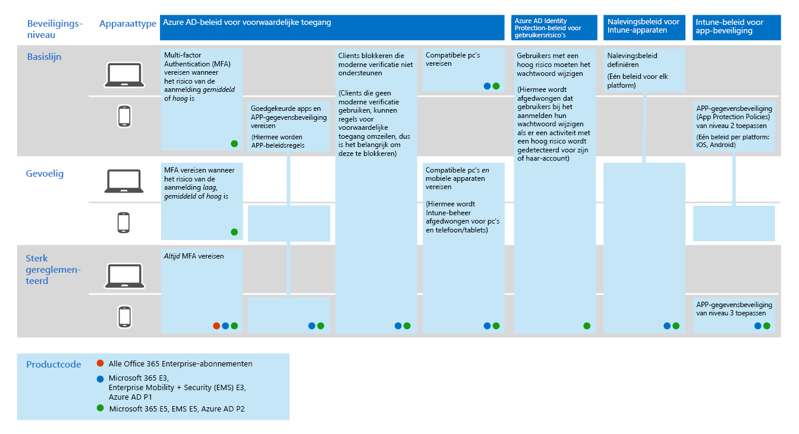

# Gemeenschappelijk beleid voor identiteits- en apparaattoegangsCommon identity and device access policies
In dit artikel worden de algemene aanbevolen beleidsregels beschreven voor het beveiligen van toegang tot cloudservices, waaronder on-premises toepassingen die zijn gepubliceerd met Azure AD Application Proxy.This article describes the common recommended policies for securing access to cloud services, including on-premises applications published with Azure AD Application Proxy. 

In deze leidraad wordt besproken hoe u het aanbevolen beleid in een nieuw ingerichte omgeving implementeert.This guidance discusses how to deploy the recommended policies in a newly-provisioned environment. Als u dit beleid in een afzonderlijke labomgeving instelt, u het aanbevolen beleid begrijpen en evalueren voordat de implementatie naar uw preproductie- en productieomgevingen wordt georganiseerd.Setting up these policies in a separate lab environment allows you to understand and evaluate the recommended policies before staging the rollout to your preproduction and production environments. Uw nieuw ingerichte omgeving kan alleen in de cloud of hybride zijn.Your newly provisioned environment may be cloud-only or hybrid.  

## BeleidssetPolicy set 

In het volgende diagram wordt de aanbevolen set beleidsregels weergegeven.The following diagram illustrates the recommended set of policies. Hierin wordt weergegeven op welke beschermingslaag elk beleid van toepassing is en of het beleid van toepassing is op pc's of telefoons en tablets, of op beide categorieën apparaten.It shows which tier of protections each policy applies to and whether the policies apply to PCs or phones and tablets, or both categories of devices. Het geeft ook aan waar deze beleidsregels zijn geconfigureerd.It also indicates where these policies are configured.

[Zie een grotere versie van deze afbeelding](https://github.com/MicrosoftDocs/microsoft-365-docs/raw/public/microsoft-365/media/Identity_device_access_policies_byplan.png)
[See a larger version of this image](https://github.com/MicrosoftDocs/microsoft-365-docs/raw/public/microsoft-365/media/Identity_device_access_policies_byplan.png)

In de rest van dit artikel wordt beschreven hoe u dit beleid configureren.The rest of this article describes how to configure these policies. 

Het gebruik van multi-factor authenticatie wordt aanbevolen voordat u apparaten inschrijft bij Intune om te garanderen dat het apparaat in het bezit is van de beoogde gebruiker.Using multi-factor authentication is recommended before enrolling devices into Intune for assurance that the device is in the possession of the intended user. U moet apparaten ook inschrijven bij Intune voordat u het nalevingsbeleid van apparaten afdwingt.You must also enroll devices into Intune before enforcing device compliance policies.

Als u tijd wilt geven om deze taken uit te voeren, raden we u aan het basislijnbeleid in de volgorde in deze tabel te implementeren.To give you time to accomplish these tasks, we recommend implementing the baseline policies in the order listed in this table. Het MFA-beleid voor gevoelige en sterk gereguleerde bescherming kan echter op elk moment worden uitgevoerd.However, the MFA policies for sensitive and highly regulated protection can be implemented at any time.

|BeschermingsniveauProtection level|BeleidPolicies|Meer informatieMore information|
|:---------------|:-------|:----------------|
|**Basislijn****Baseline**|[MFA vereisen wanneer het aanmeldingsrisico *gemiddeld* of *hoog* isRequire MFA when sign-in risk is *medium* or *high*](#require-mfa-based-on-sign-in-risk)| |
|        |[Cliënten blokkeren die geen moderne verificatie ondersteunenBlock clients that don't support modern authentication](#block-clients-that-dont-support-modern-authentication)|Clients die geen moderne authenticatie gebruiken, kunnen regels voor voorwaardelijke toegang omzeilen, dus het is belangrijk om deze te blokkerenClients that do not use modern authentication can bypass conditional access rules, so it's important to block these|
|        |[Gebruikers met een hoog risico moeten het wachtwoord wijzigenHigh risk users must change password](#high-risk-users-must-change-password)|Dwingt gebruikers om hun wachtwoord te wijzigen wanneer ze zich aanmelden als activiteit met een hoog risico wordt gedetecteerd voor hun accountForces users to change their password when signing in if high-risk activity is detected for their account|
|        |[App-beleid voor gegevensbescherming toepassenApply APP data protection policies](#apply-app-data-protection-policies)|Eén beleid per platform (iOS, Android, Windows).One policy per platform (iOS, Android, Windows). Intune App Protection Policies (APP) zijn vooraf gedefinieerde sets van bescherming, van niveau 1 tot niveau 3.Intune App Protection Policies (APP) are predefined sets of protection, from Level 1 to Level 3.|
|        |[Goedgekeurde apps en APP-beveiliging vereisenRequire approved apps and APP protection](#require-approved-apps-and-app-protection)|Dwingt mobiele app-beveiliging voor telefoons en tablets afEnforces mobile app protection for phones and tablets|
|        |[Nalevingsbeleid voor apparaten definiërenDefine device compliance policies](#define-device-compliance-policies)|Eén beleid voor elk platformOne policy for each platform|
|        |[Eis conforme pc’sRequire compliant PCs](#require-compliant-pcs-but-not-compliant-phones-and-tablets)|Dwingt Intune-beheer van pc's afEnforces Intune management of PCs|
|**Gevoelig****Sensitive**|[MFA vereisen wanneer het aanmeldingsrisico *laag,* *gemiddeld* of *hoog* isRequire MFA when sign-in risk is *low*, *medium* or *high*](#require-mfa-based-on-sign-in-risk)| |
|         |[Compatibele pc's *en* mobiele apparaten vereisenRequire compliant PCs *and* mobile devices](#require-compliant-pcs-and-mobile-devices)|Dwingt Intune-beheer af voor pc's en telefoon/tabletsEnforces Intune management for PCs and phone/tablets|
|**Sterk gereglementeerd****Highly regulated**|[*Altijd* mfa nodig*Always* require MFA](#require-mfa-based-on-sign-in-risk)|
| | |

## Beleid toewijzen aan gebruikersAssigning policies to users
Voordat u beleid configureert, identificeert u de Azure AD-groepen die u voor elke beveiligingslaag gebruikt.Before configuring policies, identify the Azure AD groups you are using for each tier of protection. Doorgaans is basislijnbeveiliging van toepassing op iedereen in de organisatie.Typically, baseline protection applies to everybody in the organization. Een gebruiker die is opgenomen voor zowel basislijn als gevoelige bescherming, heeft alle basislijnbeleidsregels toegepast plus het gevoelige beleid.A user who is included for both baseline and sensitive protection will have all the baseline policies applied plus the sensitive policies. Bescherming is cumulatief en het meest restrictieve beleid wordt afgedwongen.Protection is cumulative and the most restrictive policy is enforced. 

Een aanbevolen praktijk is het maken van een Azure AD-groep voor uitsluiting van voorwaardelijke toegang.A recommended practice is to create an Azure AD group for conditional access exclusion. Voeg deze groep toe aan al uw regels voor voorwaardelijke toegang onder 'Uitsluiten'.Add this group to all of your conditional access rules under "Exclude". Dit geeft u een methode om toegang te bieden aan een gebruiker terwijl u toegangsproblemen oplost.This gives you a method to provide access to a user while you troubleshoot access issues. Dit wordt alleen aanbevolen als tijdelijke oplossing.This is recommended as a temporary solution only. Controleer deze groep op wijzigingen en zorg ervoor dat de uitsluitingsgroep alleen wordt gebruikt zoals bedoeld.Monitor this group for changes and be sure the exclusion group is being used only as intended. 

In het volgende diagram vindt u een voorbeeld van gebruikerstoewijzing en uitsluitingen.The following diagram provides an example of user assignment and exclusions.

In de illustratie krijgt het 'Top secret project X-team' een voorwaardelijk toegangsbeleid dat MFA *altijd*vereist.In the illustration the "Top secret project X team" is assigned a conditional access policy that requires MFA *always*. Wees verstandig bij het toepassen van hogere niveaus van bescherming voor gebruikers.Be judicious when applying higher levels of protection to users. Leden van dit projectteam moeten elke keer dat ze zich aanmelden twee vormen van verificatie verstrekken, zelfs als ze niet sterk gereguleerde inhoud bekijken.Members of this project team will be required to provide two forms of authentication every time they log on, even if they are not viewing highly-regulated content.  

Alle Azure AD-groepen die als onderdeel van deze aanbevelingen zijn gemaakt, moeten worden gemaakt als Office 365-groepen.All Azure AD groups created as part of these recommendations must be created as Office 365 groups. Dit is specifiek belangrijk voor de implementatie van Azure Information Protection (AIP) bij het beveiligen van documenten in SharePoint Online.This is specifically important for the deployment of Azure Information Protection (AIP) when securing documents in SharePoint Online.

## MFA vereisen op basis van aanmeldingsrisicoRequire MFA based on sign-in risk
Voordat u MFA vereist, gebruikt u eerst een MFA-registratiebeleid voor identiteitsbescherming om gebruikers voor MFA te registreren.Before requiring MFA, first use an Identity Protection MFA registration policy to register users for MFA. Nadat gebruikers zijn geregistreerd, u MFA afdwingen voor aanmelding.After users are registered you can enforce MFA for sign-in. Het [vereiste werk](identity-access-prerequisites.md) omvat het registreren van alle gebruikers met MFA.The [prerequisite work](identity-access-prerequisites.md) includes registering all users with MFA.

Ga als lid van het volgende over een nieuw beleid voor voorwaardelijke toegang:To create a new conditional access policy: 

1. Ga naar de [Azure-portal](https://portal.azure.com)en meld u aan met uw referenties.Go to the [Azure portal](https://portal.azure.com), and sign in with your credentials. Nadat u zich hebt aangemeld, ziet u het Azure-dashboard.After you've successfully signed in, you see the Azure dashboard.

2. Kies **Azure Active Directory** in het linkermenu.Choose **Azure Active Directory** from the left menu.

3. Kies voorwaardelijke **toegang**onder de sectie **Beveiliging** .Under the **Security** section, choose **Conditional access**.

4. Kies **Nieuw beleid**.Choose **New policy**.

 In de volgende tabellen worden de beleidsinstellingen voor voorwaardelijke toegang beschreven die voor dit beleid moeten worden geïmplementeerd.The following tables describes the conditional access policy settings to implement for this policy.

**Toewijzingen****Assignments**

|TypeType|EigenschappenProperties|WaardenValues|NotitiesNotes|
|:---|:---------|:-----|:----|
|Gebruikers en groepenUsers and groups|OpnemenInclude|Gebruikers en groepen selecteren – Selecteer specifieke beveiligingsgroep met gerichte gebruikersSelect users and groups – Select specific security group containing targeted users|Begin met beveiligingsgroep inclusief pilotgebruikersStart with security group including pilot users|
||UitsluitenExclude|Uitzonderingsbeveiligingsgroep; serviceaccounts (app-identiteiten)Exception security group; service accounts (app identities)|Lidmaatschap gewijzigd op een indien nodig tijdelijke basisMembership modified on an as-needed temporary basis|
|Cloud-appsCloud apps|OpnemenInclude|Selecteer de apps waarop u deze regel wilt toepassen.Select the apps you want this rule to apply to. Selecteer bijvoorbeeld Office 365 Exchange OnlineFor example, select Office 365 Exchange Online||
|VoorwaardenConditions|GeconfigureerdConfigured|JaYes|Configureren specifiek voor uw omgeving en behoeftenConfigure specific to your environment and needs|
|AanmeldingsrisicoSign-in risk|RisiconiveauRisk level||Zie de richtlijnen in de volgende tabelSee the guidance in the following table|

**Aanmeldingsrisico****Sign-in risk**

Pas de instellingen toe op basis van het beveiligingsniveau dat u target.Apply the settings based on the protection level you are targeting.

|EigenschapProperty|BeschermingsniveauLevel of protection|WaardenValues|NotitiesNotes|
|:---|:---------|:-----|:----|
|RisiconiveauRisk level|BasislijnBaseline|Hoog, gemiddeldHigh, medium|Controleer beideCheck both|
| |GevoeligSensitive|Hoog, gemiddeld, laagHigh, medium, low|Controleer alle drieCheck all three|
| |Sterk gereglementeerdHighly regulated| |Laat alle opties onaangevinkt om MFA altijd af te dwingenLeave all options unchecked to always enforce MFA|

**Toegangsbesturingselementen****Access controls**

|TypeType|EigenschappenProperties|WaardenValues|NotitiesNotes|
|:---|:---------|:-----|:----|
|VerlenenGrant|Toegang verlenenGrant access|WaarTrue|GeselecteerdeSelected|
||MFA vereisenRequire MFA|WaarTrue|ChequeCheck|
||Apparaat vereisen dat het als compatibel is gemarkeerdRequire device to be marked as compliant|ValseFalse||
||Hybride Azure-apparaat vereisen dat is aangesloten bij ADRequire hybrid Azure AD-joined device|ValseFalse||
||Goedgekeurde client-app vereisenRequire approved client app|ValseFalse||
||Alle geselecteerde besturingselementen vereisenRequire all the selected controls|WaarTrue|GeselecteerdeSelected|

> [!NOTE]
> Zorg ervoor dat u dit beleid inschakelt door **Op**te kiezen .Be sure to enable this policy, by choosing **On**. Overweeg ook het gebruik van de [Tool Wat als](https://docs.microsoft.com/azure/active-directory/active-directory-conditional-access-whatif) om het beleid te testen.Also consider using the [What if](https://docs.microsoft.com/azure/active-directory/active-directory-conditional-access-whatif) tool to test the policy.

## Cliënten blokkeren die geen moderne verificatie ondersteunenBlock clients that don't support modern authentication
1. Ga naar de [Azure-portal](https://portal.azure.com)en meld u aan met uw referenties.Go to the [Azure portal](https://portal.azure.com), and sign in with your credentials. Nadat u zich hebt aangemeld, ziet u het Azure-dashboard.After you've successfully signed in, you see the Azure dashboard.

2. Kies **Azure Active Directory** in het linkermenu.Choose **Azure Active Directory** from the left menu.

3. Kies voorwaardelijke **toegang**onder de sectie **Beveiliging** .Under the **Security** section, choose **Conditional access**.

4. Kies **Nieuw beleid**.Choose **New policy**.

In de volgende tabellen worden de beleidsinstellingen voor voorwaardelijke toegang beschreven die voor dit beleid moeten worden geïmplementeerd.The following tables describes the conditional access policy settings to implement for this policy.

**Toewijzingen****Assignments**

|TypeType|EigenschappenProperties|WaardenValues|NotitiesNotes|
|:---|:---------|:-----|:----|
|Gebruikers en groepenUsers and groups|OpnemenInclude|Gebruikers en groepen selecteren – Selecteer specifieke beveiligingsgroep met gerichte gebruikersSelect users and groups – Select specific security group containing targeted users|Begin met beveiligingsgroep inclusief pilotgebruikersStart with security group including pilot users|
||UitsluitenExclude|Uitzonderingsbeveiligingsgroep; serviceaccounts (app-identiteiten)Exception security group; service accounts (app identities)|Lidmaatschap gewijzigd op tijdelijke basisMembership modified on an as needed temporary basis|
|Cloud-appsCloud apps|OpnemenInclude|Selecteer de apps waarop u deze regel wilt toepassen.Select the apps you want this rule to apply to. Selecteer bijvoorbeeld Office 365 Exchange OnlineFor example, select Office 365 Exchange Online||
|VoorwaardenConditions|GeconfigureerdConfigured|JaYes|Client-apps configurerenConfigure Client apps|
|Client-appsClient apps|GeconfigureerdConfigured|JaYes|Mobiele apps en desktopclients, Andere clients (selecteer beide)Mobile apps and desktop clients, Other clients (select both)|

**Toegangsbesturingselementen****Access controls**

|TypeType|EigenschappenProperties|WaardenValues|NotitiesNotes|
|:---|:---------|:-----|:----|
|VerlenenGrant|Toegang blokkerenBlock access|WaarTrue|GeselecteerdeSelected|
||MFA vereisenRequire MFA|ValseFalse||
||Apparaat vereisen dat het als compatibel is gemarkeerdRequire device to be marked as compliant|ValseFalse||
||Hybride Azure-apparaat vereisen dat is aangesloten bij ADRequire hybrid Azure AD-joined device|ValseFalse||
||Goedgekeurde client-app vereisenRequire approved client app|ValseFalse||
||Alle geselecteerde besturingselementen vereisenRequire all the selected controls|WaarTrue|GeselecteerdeSelected|

> [!NOTE]
> Zorg ervoor dat u dit beleid inschakelt door **Op**te kiezen .Be sure to enable this policy, by choosing **On**. Overweeg ook het gebruik van de [Tool Wat als](https://docs.microsoft.com/azure/active-directory/active-directory-conditional-access-whatif) om het beleid te testen.Also consider using the [What if](https://docs.microsoft.com/azure/active-directory/active-directory-conditional-access-whatif) tool to test the policy.

## Gebruikers met een hoog risico moeten het wachtwoord wijzigenHigh risk users must change password
Om ervoor te zorgen dat de gecompromitteerde accounts van gebruikers met een hoog risico worden gedwongen om een wachtwoordwijziging uit te voeren bij het aanmelden, moet u het volgende beleid toepassen.To ensure that all high-risk users' compromised accounts are forced to perform a password change when signing-in, you must apply the following policy.

Meld u aan bij de [Microsoft Azure-portal (methttps://portal.azure.com) ](https://portal.azure.com/) uw beheerdersreferenties) en navigeer vervolgens naar Azure **AD-identiteitsbeveiliging > gebruikersrisicobeleid**.Log in to the [Microsoft Azure portal (https://portal.azure.com)](https://portal.azure.com/) with your administrator credentials, and then navigate to **Azure AD Identity Protection > User Risk Policy**.

**Toewijzingen****Assignments**

|TypeType|EigenschappenProperties|WaardenValues|NotitiesNotes|
|:---|:---------|:-----|:----|
|GebruikersUsers|OpnemenInclude|Alle gebruikersAll users|GeselecteerdeSelected|
||UitsluitenExclude|GeenNone||
|VoorwaardenConditions|GebruikersrisicoUser risk|HighHigh|GeselecteerdeSelected|

**Besturingselementen****Controls**

| TypeType | EigenschappenProperties | WaardenValues                  | NotitiesNotes |
|:-----|:-----------|:------------------------|:------|
|      | AccessAccess     | Toegang toestaanAllow access            | WaarTrue  |
|      | AccessAccess     | Wachtwoordwijziging vereisenRequire password change | WaarTrue  |

**Beoordeling:** niet van toepassing**Review:** not applicable

> [!NOTE]
> Zorg ervoor dat u dit beleid inschakelt door **Op**te kiezen .Be sure to enable this policy, by choosing **On**. Overweeg ook het gebruik van de [tool Wat als](https://docs.microsoft.com/azure/active-directory/active-directory-conditional-access-whatif) om het beleid te testenAlso consider using the [What if](https://docs.microsoft.com/azure/active-directory/active-directory-conditional-access-whatif) tool to test the policy

## App-beleid voor gegevensbescherming toepassenApply APP data protection policies
App-beveiligingsbeleid (APP) bepaalt welke apps zijn toegestaan en welke acties ze kunnen uitvoeren met de gegevens van uw organisatie.App Protection Policies (APP) define which apps are allowed and the actions they can take with your organization's data. De keuzes die beschikbaar zijn in APP stellen organisaties in staat om de bescherming af te stemmen op hun specifieke behoeften.The choices available in APP enable organizations to tailor the protection to their specific needs. Voor sommigen is het mogelijk niet duidelijk welke beleidsinstellingen nodig zijn om een volledig scenario te implementeren.For some, it may not be obvious which policy settings are required to implement a complete scenario. Om organisaties te helpen prioriteit te geven aan het verharden van het eindpunt van mobiele klanten, heeft Microsoft taxonomie geïntroduceerd voor het APP-beheer voor gegevensbescherming voor iOS- en Android-mobiele apps.To help organizations prioritize mobile client endpoint hardening, Microsoft has introduced taxonomy for its APP data protection framework for iOS and Android mobile app management. 

Het APP-kader voor gegevensbescherming is ingedeeld in drie verschillende configuratieniveaus, waarbij elk niveau het vorige niveau afbouwt:The APP data protection framework is organized into three distinct configuration levels, with each level building off the previous level: 

- **Enterprise Basic Data Protection** (Level 1) zorgt ervoor dat apps worden beveiligd met een pincode en versleuteld en selectieve veegbewerkingen uitvoeren.**Enterprise basic data protection** (Level 1) ensures that apps are protected with a PIN and encrypted and performs selective wipe operations. Voor Android-apparaten valideert dit niveau de attest van Android-apparaten.For Android devices, this level validates Android device attestation. Dit is een instapconfiguratie die vergelijkbare gegevensbeschermingscontrole biedt in het postvakbeleid van Exchange Online en IT en de gebruikerspopulatie introduceert in APP.This is an entry level configuration that provides similar data protection control in Exchange Online mailbox policies and introduces IT and the user population to APP. 
- **Enterprise enhanced data protection** (Level 2) introduceert APP data lekpreventie mechanismen en minimale OS-vereisten.**Enterprise enhanced data protection** (Level 2) introduces APP data leakage prevention mechanisms and minimum OS requirements. Dit is de configuratie die van toepassing is op de meeste mobiele gebruikers die toegang hebben tot werk- of schoolgegevens.This is the configuration that is applicable to most mobile users accessing work or school data. 
- **Enterprise high data protection** (Level 3) introduceert geavanceerde mechanismen voor gegevensbescherming, verbeterde pincodeconfiguratie en APP Mobile Threat Defense.**Enterprise high data protection** (Level 3) introduces advanced data protection mechanisms, enhanced PIN configuration, and APP Mobile Threat Defense. Deze configuratie is wenselijk voor gebruikers die toegang hebben tot gegevens met een hoog risico.This configuration is desirable for users that are accessing high risk data. 

Als u de specifieke aanbevelingen voor elk configuratieniveau en de minimale apps wilt bekijken die moeten worden beschermd, controleert u [het kader voor gegevensbescherming met behulp van app-beveiligingsbeleid](https://docs.microsoft.com/mem/intune/apps/app-protection-framework).To see the specific recommendations for each configuration level and the minimum apps that must be protected, review [Data protection framework using app protection policies](https://docs.microsoft.com/mem/intune/apps/app-protection-framework). 

Met behulp van de principes die worden beschreven in [de configuraties voor identiteits- en apparaattoegang,](microsoft-365-policies-configurations.md)worden de niveaus basislijn en gevoelige beveiliging nauwkeurig afgestemd op de instellingen voor gegevensbescherming van niveau 2.Using the principles outlined in [Identity and device access configurations](microsoft-365-policies-configurations.md), the Baseline and Sensitive protection tiers map closely with the Level 2 enterprise enhanced data protection settings. De sterk gereguleerde beveiligingslaag wordt nauwkeurig toegewezen aan de instellingen voor hoge gegevensbescherming van niveau 3.The Highly regulated protection tier maps closely to the Level 3 enterprise high data protection settings.

|BeschermingsniveauProtection level |Beleid voor app-beveiligingApp Protection Policy  |Meer informatieMore information  |
|---------|---------|---------|
|BasislijnBaseline     | [Niveau 2 verbeterde gegevensbeschermingLevel 2 enhanced data protection](https://docs.microsoft.com/mem/intune/apps/app-protection-framework#level-2-enterprise-enhanced-data-protection)        | De beleidsinstellingen die in niveau 2 worden afgedwongen, bevatten alle beleidsinstellingen die worden aanbevolen voor niveau 1 en worden alleen toegevoegd aan of worden bijgewerkt met de onderstaande beleidsinstellingen om meer besturingselementen en een meer geavanceerde configuratie dan niveau 1 te implementeren.The policy settings enforced in level 2 include all the policy settings recommended for level 1 and only adds to or updates the below policy settings to implement more controls and a more sophisticated configuration than level 1.         |
|GevoeligSensitive     | [Niveau 2 verbeterde gegevensbeschermingLevel 2 enhanced data protection](https://docs.microsoft.com/mem/intune/apps/app-protection-framework#level-2-enterprise-enhanced-data-protection)        | De beleidsinstellingen die in niveau 2 worden afgedwongen, bevatten alle beleidsinstellingen die worden aanbevolen voor niveau 1 en worden alleen toegevoegd aan of worden bijgewerkt met de onderstaande beleidsinstellingen om meer besturingselementen en een meer geavanceerde configuratie dan niveau 1 te implementeren.The policy settings enforced in level 2 include all the policy settings recommended for level 1 and only adds to or updates the below policy settings to implement more controls and a more sophisticated configuration than level 1.        |
|Sterk gereguleerdHighly Regulated     | [Niveau 3 onderneming hoge gegevensbeschermingLevel 3 enterprise high data protection](https://docs.microsoft.com/mem/intune/apps/app-protection-framework#level-3-enterprise-high-data-protection)        | De beleidsinstellingen die in niveau 3 worden afgedwongen, bevatten alle beleidsinstellingen die worden aanbevolen voor niveau 1 en 2 en worden alleen toegevoegd aan of worden bijgewerkt met de onderstaande beleidsinstellingen om meer besturingselementen en een meer geavanceerde configuratie dan niveau 2 te implementeren.The policy settings enforced in level 3 include all the policy settings recommended for level 1 and 2 and only adds to or updates the below policy settings to implement more controls and a more sophisticated configuration than level 2.        |

Als u een nieuw beleid voor app-beveiliging wilt maken voor elk platform (iOS en Android) binnen Microsoft Endpoint Manager met behulp van de instellingen voor het kader voor gegevensbescherming, kunnen beheerders:To create a new app protection policy for each platform (iOS and Android) within Microsoft Endpoint Manager using the data protection framework settings, administrators can:
1. Maak het beleid handmatig door de stappen te volgen in [Het beveiligingsbeleid voor apps maken en implementeren met Microsoft Intune](https://docs.microsoft.com/mem/intune/apps/app-protection-policies).Manually create the policies by following the steps in [How to create and deploy app protection policies with Microsoft Intune](https://docs.microsoft.com/mem/intune/apps/app-protection-policies). 
2. Importeer het voorbeeld [Van het Intune App Protection Policy Configuration Framework JSON-sjablonen](https://github.com/microsoft/Intune-Config-Frameworks/tree/master/AppProtectionPolicies) met [de PowerShell-scripts van Intune.](https://github.com/microsoftgraph/powershell-intune-samples)Import the sample [Intune App Protection Policy Configuration Framework JSON templates](https://github.com/microsoft/Intune-Config-Frameworks/tree/master/AppProtectionPolicies) with [Intune's PowerShell scripts](https://github.com/microsoftgraph/powershell-intune-samples).

## Goedgekeurde apps en APP-beveiliging vereisenRequire approved apps and APP protection
Als u het app-beveiligingsbeleid wilt afdwingen dat u in Intune hebt toegepast, moet u een regel voor voorwaardelijke toegang maken om goedgekeurde client-apps en de voorwaarden in het app-beveiligingsbeleid te vereisen.To enforce the APP protection policies you applied in Intune, you must create a conditional access rule to require approved client apps and the conditions set in the APP protection policies. 

Voor het afdwingen van app-beveiligingsbeleid is een reeks beleidsregels vereist die zijn beschreven in [Het beleid voor app-beveiliging vereisen voor toegang tot cloud-apps met voorwaardelijke toegang](https://docs.microsoft.com/azure/active-directory/conditional-access/app-protection-based-conditional-access).Enforcing APP protection policies requires a set of policies described in in [Require app protection policy for cloud app access with Conditional Access](https://docs.microsoft.com/azure/active-directory/conditional-access/app-protection-based-conditional-access). Deze beleidsregels zijn elk opgenomen in deze aanbevolen set identiteits- en toegangsconfiguratiebeleid.These policies are each included in this recommended set of identity and access configuration policies.

Als u de regel voor voorwaardelijke toegang wilt maken waarvoor goedgekeurde apps en app-beveiliging vereist zijn, volgt u 'Stap 1: Configureer een Azure AD Conditional Access-beleid voor Office 365' in [Scenario 1: Voor Office 365-apps zijn goedgekeurde apps met een app-beveiligingsbeleid vereist,](https://docs.microsoft.com/azure/active-directory/conditional-access/app-protection-based-conditional-access#scenario-1-office-365-apps-require-approved-apps-with-app-protection-policies)waarmee Outlook voor iOS en Android is toegestaan, maar blokkeert UAuth-compatibele Exchange ActiveSync-clients om verbinding te maken met Exchange Online.To create the conditional access rule that requires approved apps and APP protection, follow "Step 1: Configure an Azure AD Conditional Access policy for Office 365" in [Scenario 1: Office 365 apps require approved apps with app protection policies](https://docs.microsoft.com/azure/active-directory/conditional-access/app-protection-based-conditional-access#scenario-1-office-365-apps-require-approved-apps-with-app-protection-policies), which allows Outlook for iOS and Android, but blocks OAuth capable Exchange ActiveSync clients from connecting to Exchange Online.

   > [!NOTE]
   > Dit beleid zorgt ervoor dat mobiele gebruikers toegang hebben tot alle Office-eindpunten met behulp van de toepasselijke apps.This policy ensures mobile users can access all Office endpoints using the applicable apps.

Als u mobiele toegang tot Exchange Online inschakelt, implementeert u [Block ActiveSync-clients](secure-email-recommended-policies.md#block-activesync-clients), waardoor Exchange ActiveSync-clients geen verbinding kunnen maken met Exchange Online.If you are enabling mobile access to Exchange Online, implement [Block ActiveSync clients](secure-email-recommended-policies.md#block-activesync-clients), which prevents Exchange ActiveSync clients leveraging basic authentication from connecting to Exchange Online. Dit beleid is niet afgebeeld in de afbeelding bovenaan dit artikel.This policy is not pictured in the illustration at the top of this article. Het wordt beschreven en afgebeeld in [beleidsaanbevelingen voor het beveiligen van e-mail.](secure-email-recommended-policies.md)It is described and pictured in [Policy recommendations for securing email](secure-email-recommended-policies.md).

 Met dit beleid wordt gebruikgemaakt van de subsidiebesturingselementen [Vereist goedgekeurde client-app](https://docs.microsoft.com/azure/active-directory/conditional-access/concept-conditional-access-grant#require-approved-client-app) en [Vereist app-beveiligingsbeleid](https://docs.microsoft.com/azure/active-directory/conditional-access/concept-conditional-access-grant#require-app-protection-policy).These policies leverage the grant controls [Require approved client app](https://docs.microsoft.com/azure/active-directory/conditional-access/concept-conditional-access-grant#require-approved-client-app) and [Require app protection policy](https://docs.microsoft.com/azure/active-directory/conditional-access/concept-conditional-access-grant#require-app-protection-policy).

Ten slotte zorgt het blokkeren van oudere verificatie voor andere client-apps op iOS- en Android-apparaten ervoor dat deze clients voorwaardelijke toegangsregels niet kunnen omzeilen.Finally, blocking legacy authentication for other client apps on iOS and Android devices ensures that these clients cannot bypass conditional access rules. Als u de richtlijnen in dit artikel volgt, hebt u Blokclients die [geen moderne verificatie ondersteunen,](#block-clients-that-dont-support-modern-authentication)al geconfigureerd.If you're following the guidance in this article, you've already configured [Block clients that don't support modern authentication](#block-clients-that-dont-support-modern-authentication).

<!---
With Conditional Access, organizations can restrict access to approved (modern authentication capable) iOS and Android client apps with Intune app protection policies applied to them. Several conditional access policies are required, with each policy targeting all potential users. Details on creating these policies can be found in [Require app protection policy for cloud app access with Conditional Access](https://docs.microsoft.com/azure/active-directory/conditional-access/app-protection-based-conditional-access).

1. Follow "Step 1: Configure an Azure AD Conditional Access policy for Office 365" in [Scenario 1: Office 365 apps require approved apps with app protection policies](https://docs.microsoft.com/azure/active-directory/conditional-access/app-protection-based-conditional-access#scenario-1-office-365-apps-require-approved-apps-with-app-protection-policies), which allows Outlook for iOS and Android, but blocks OAuth capable Exchange ActiveSync clients from connecting to Exchange Online.

   > [!NOTE]
   > This policy ensures mobile users can access all Office endpoints using the applicable apps.

2. If enabling mobile access to Exchange Online, implement [Block ActiveSync clients](secure-email-recommended-policies.md#block-activesync-clients), which prevents Exchange ActiveSync clients leveraging basic authentication from connecting to Exchange Online.

   The above policies leverage the grant controls [Require approved client app](https://docs.microsoft.com/azure/active-directory/conditional-access/concept-conditional-access-grant#require-approved-client-app) and [Require app protection policy](https://docs.microsoft.com/azure/active-directory/conditional-access/concept-conditional-access-grant#require-app-protection-policy).

3. Disable legacy authentication for other client apps on iOS and Android devices. For more information, see [Block clients that don't support modern authentication](#block-clients-that-dont-support-modern-authentication).
-->

## Beleid voor naleving van apparaten definiërenDefine device-compliance policies

In het beleid voor naleving van apparaten worden de vereisten gedefinieerd waaraan apparaten moeten voldoen om als compatibel te worden gemarkeerd.Device-compliance policies define the requirements that devices must adhere to in order to be marked as compliant. Maak intune-beleid voor apparaatnaleving vanuit het Microsoft Endpoint Manager-beheercentrum.Create Intune device compliance policies from within the Microsoft Endpoint Manager admin center.

Maak een beleid voor elk platform:Create a policy for each platform:
- Beheerder van Android-apparatenAndroid device administrator
- Android EnterpriseAndroid Enterprise
- iOS/iPadOSiOS/iPadOS
- MacosmacOS
- Windows Phone 8.1Windows Phone 8.1
- Windows 8.1 en hogerWindows 8.1 and later
- Windows 10 en hogerWindows 10 and later

Als u beleid voor naleving van apparaten wilt maken, meldt u zich aan bij het [Microsoft Endpoint Manager-beheercentrum](https://go.microsoft.com/fwlink/?linkid=2109431) met uw beheerreferenties en navigeert u vervolgens naar**het beleid\*\*\*\*voor** > naleving **van apparaten** > .To create device compliance policies, log in to the [Microsoft Endpoint Manager Admin Center](https://go.microsoft.com/fwlink/?linkid=2109431) with your administer credentials, and then navigate to **Devices** > **Compliance policies** > **Policies**. Selecteer **Beleid maken**.Select **Create Policy**.

Als u het nalevingsbeleid van apparaten wilt implementeren, moeten deze worden toegewezen aan gebruikersgroepen.For device compliance policies to be deployed, they must be assigned to user groups. U wijst een beleid toe nadat u het hebt gemaakt en opgeslagen.You assign a policy after you create and save it. Selecteer in het beheercentrum het beleid en selecteer **Toewijzingen**.In the admin center, select the policy and then select **Assignments**. Nadat u de groepen hebt geselecteerd die u het beleid wilt ontvangen, selecteert u **Opslaan** om die groepstoewijzing op te slaan en het beleid te implementeren.After selecting the groups that you want to receive the policy, select **Save** to save that group assignment and deploy the policy.

Zie [Een nalevingsbeleid maken in Microsoft Intune](https://docs.microsoft.com/mem/intune/protect/create-compliance-policy) in de Intune-documentatie voor stapsgewijze richtlijnen voor het maken van nalevingsbeleid in Intune.For step-by-step guidance on creating compliance policies in Intune, see [Create a compliance policy in Microsoft Intune](https://docs.microsoft.com/mem/intune/protect/create-compliance-policy) in the Intune documentation.

De volgende instellingen worden aanbevolen voor Windows 10.The following settings are recommended for Windows 10.

**Apparaatstatus: evaluatieregels voor windows health attestation service****Device health: Windows Health Attestation Service evaluation rules**

|EigenschappenProperties|WaardenValues|NotitiesNotes|
|:---------|:-----|:----|
|BitLocker vereisenRequire BitLocker|VereisenRequire||
|Secure Boot moeten worden ingeschakeld op het apparaatRequire Secure Boot to be enabled on the device|VereisenRequire||
|Code-integriteit vereisenRequire code integrity|VereisenRequire||

**Eigenschappen van het apparaat****Device properties**

|TypeType|EigenschappenProperties|WaardenValues|NotitiesNotes|
|:---|:---------|:-----|:----|
|Versie van het besturingssysteemOperating system version|AlleAll|Niet geconfigureerdNot configured||

**Systeembeveiliging****System security**

|TypeType|EigenschappenProperties|WaardenValues|NotitiesNotes|
|:---|:---------|:-----|:----|
|WachtwoordPassword|Een wachtwoord vereisen om mobiele apparaten te ontgrendelenRequire a password to unlock mobile devices|VereisenRequire||
||Eenvoudige wachtwoordenSimple passwords|BlokBlock||
||WachtwoordtypePassword type|Standaard apparaatDevice default||
||Minimale wachtwoordlengteMinimum password length|66||
||Maximale minuten van inactiviteit voordat wachtwoord vereist isMaximum minutes of inactivity before password is required|1515|Deze instelling wordt ondersteund voor Android-versies 4.0 en hoger of KNOX 4.0 en hoger.This setting is supported for Android versions 4.0 and above or KNOX 4.0 and above. Voor iOS-apparaten wordt het ondersteund voor iOS 8.0 en hogerFor iOS devices, it's supported for iOS 8.0 and above|
||Wachtwoord vervaldatum (dagen)Password expiration (days)|4141||
||Aantal eerdere wachtwoorden om hergebruik te voorkomenNumber of previous passwords to prevent reuse|55||
||Wachtwoord vereisen wanneer apparaat terugkeert van niet-actieve status (mobiel en holografisch)Require password when device returns from idle state (Mobile and Holographic)|VereisenRequire|Beschikbaar voor Windows 10 en hogerAvailable for Windows 10 and later|
|CoderingEncryption|Versleuteling van gegevensopslag op het apparaatEncryption of data storage on device|VereisenRequire||
|ApparaatbeveiligingDevice Security|FirewallFirewall|VereisenRequire||
||AntivirusAntivirus|VereisenRequire||
||AntispywareAntispyware|VereisenRequire|Deze instelling vereist een anti-spyware-oplossing die is geregistreerd bij Windows Security CenterThis setting requires an Anti-Spyware solution registered with Windows Security Center|
|VerdedigerDefender|Microsoft Defender AntimalwareMicrosoft Defender Antimalware|VereisenRequire||
||Microsoft Defender Antimalware minimumversieMicrosoft Defender Antimalware minimum version||Alleen ondersteund voor Windows 10-bureaublad.Only supported for Windows 10 desktop. Microsoft raadt versies niet meer dan vijf achter van de meest recente versieMicrosoft recommends versions no more than five behind from the most recent version|
||Microsoft Defender Antimalware-handtekening up-to-dateMicrosoft Defender Antimalware signature up to date|VereisenRequire||
||Real-time beschermingReal-time protection|VereisenRequire|Alleen ondersteund voor Windows 10-bureaubladOnly supported for Windows 10 desktop|

**Microsoft Defender ATP****Microsoft Defender ATP**

|TypeType|EigenschappenProperties|WaardenValues|NotitiesNotes|
|:---|:---------|:-----|:----|
|Microsoft Defender Advanced Threat Protection-regelsMicrosoft Defender Advanced Threat Protection rules|Het apparaat moeten op of onder de machine-risicoscore bevindenRequire the device to be at or under the machine-risk score|MediumMedium||

## Compatibele pc's vereisen (maar niet voldoen aan telefoons en tablets)Require compliant PCs (but not compliant phones and tablets)
Voordat u een beleid toevoegt dat compatibele pc's vereist, moet u apparaten inschrijven voor beheer in Intune.Before adding a policy to require compliant PCs, be sure to enroll devices for management into Intune. Het gebruik van multi-factor authenticatie wordt aanbevolen voordat u apparaten inschrijft bij Intune om te garanderen dat het apparaat in het bezit is van de beoogde gebruiker.Using multi-factor authentication is recommended before enrolling devices into Intune for assurance that the device is in the possession of the intended user. 

Ga als nodig:To require compliant PCs:

1. Ga naar de [Azure-portal](https://portal.azure.com)en meld u aan met uw referenties.Go to the [Azure portal](https://portal.azure.com), and sign in with your credentials. Nadat u zich hebt aangemeld, ziet u het Azure-dashboard.After you've successfully signed in, you see the Azure dashboard.

2. Kies **Azure Active Directory** in het linkermenu.Choose **Azure Active Directory** from the left menu.

3. Kies voorwaardelijke **toegang**onder de sectie **Beveiliging** .Under the **Security** section, choose **Conditional access**.

4. Kies **Nieuw beleid**.Choose **New policy**.

5. Voer een beleidsnaam in en kies vervolgens de **gebruikers en groepen** waarvoor u het beleid wilt toepassen.Enter a policy name, then choose the **Users and groups** you want to apply the policy for.

6. Kies **Cloud-apps**.Choose **Cloud apps**.

7. Kies **Apps selecteren**, selecteer de gewenste apps in de lijst Met **Cloud-apps.**Choose **Select apps**, select the desired apps from the **Cloud apps** list. Selecteer bijvoorbeeld Office 365 Exchange Online.For example, select Office 365 Exchange Online. Kies **Selecteren** en **gereed**.Choose **Select** and **Done**.

8. Als u compatibele pc's nodig hebt, maar niet voldoen aan telefoons en tablets, kiest u **Voorwaarden** en **apparaatplatforms.**To require compliant PCs, but not compliant phones and tablets, choose **Conditions** and **Device platforms**. Kies **Apparaatplatforms selecteren** en selecteer **Windows** en **macOS**.Choose **Select device platforms** and select **Windows** and **macOS**.

9. Kies **Verlenen** in de sectie **Toegangsbesturingselementen.**Choose **Grant** from the **Access controls** section.

10. Kies **Toegang verlenen**, selecteer Apparaat vereisen dat als compatibel moet zijn **gemarkeerd**.Choose **Grant access**, select **Require device to be marked as compliant**. Selecteer Voor meerdere besturingselementen **Alle geselecteerde besturingselementen vereisen**en kies selecteer **Selecteren**.For multiple controls, select **Require all the selected controls**, then choose **Select**. 

11. Kies **Create**.Choose **Create**.

Als het uw doel is om compatibele pc's *en* mobiele apparaten te vereisen, selecteert u geen platforms.If your objective is to require compliant PCs *and* mobile devices, do not select platforms. Dit dwingt naleving voor alle apparaten af.This enforces compliance for all devices. 

## Compatibele pc's *en* mobiele apparaten vereisenRequire compliant PCs *and* mobile devices

Naleving voor alle apparaten vereisen:To require compliance for all devices:

1. Ga naar de [Azure-portal](https://portal.azure.com)en meld u aan met uw referenties.Go to the [Azure portal](https://portal.azure.com), and sign in with your credentials. Nadat u zich hebt aangemeld, ziet u het Azure-dashboard.After you've successfully signed in, you see the Azure dashboard.

2. Kies **Azure Active Directory** in het linkermenu.Choose **Azure Active Directory** from the left menu.

3. Kies voorwaardelijke **toegang**onder de sectie **Beveiliging** .Under the **Security** section, choose **Conditional access**.

4. Kies **Nieuw beleid**.Choose **New policy**.

5. Voer een beleidsnaam in en kies vervolgens de **gebruikers en groepen** waarvoor u het beleid wilt toepassen.Enter a policy name, then choose the **Users and groups** you want to apply the policy for.

6. Kies **Cloud-apps**.Choose **Cloud apps**.

7. Kies **Apps selecteren**, selecteer de gewenste apps in de lijst Met **Cloud-apps.**Choose **Select apps**, select the desired apps from the **Cloud apps** list. Selecteer bijvoorbeeld Office 365 Exchange Online.For example, select Office 365 Exchange Online. Kies **Selecteren** en **gereed**.Choose **Select** and **Done**.

8. Kies **Verlenen** in de sectie **Toegangsbesturingselementen.**Choose **Grant** from the **Access controls** section.

9. Kies **Toegang verlenen**, selecteer Apparaat vereisen dat als compatibel moet zijn **gemarkeerd**.Choose **Grant access**, select **Require device to be marked as compliant**. Selecteer Voor meerdere besturingselementen **Alle geselecteerde besturingselementen vereisen**en kies selecteer **Selecteren**.For multiple controls, select **Require all the selected controls**, then choose **Select**. 

10. Kies **Create**.Choose **Create**.

Selecteer bij het maken van dit beleid geen platforms.When creating this policy, do not select platforms. Dit dwingt compatibele apparaten af.This enforces compliant devices.

## Volgende stappenNext steps

[Meer informatie over beleidsaanbevelingen voor het beveiligen van e-mailLearn about policy recommendations for securing email](secure-email-recommended-policies.md)
