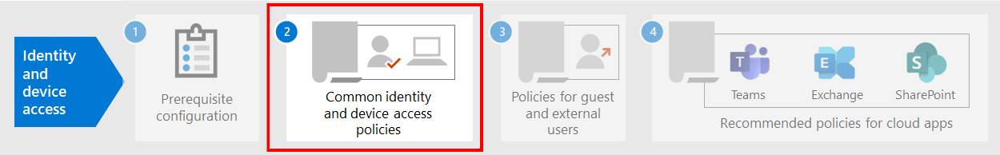

# Vereisten voor het implementeren van identiteits-en Apparaattoegang

In dit artikel worden de vereisten beschreven die moeten worden geïmplementeerd voordat u de aanbevolen identiteit en het toegangsbeleid voor apparaten kunt implementeren. In dit artikel worden ook de aanbevolen standaardplatform configuraties besproken waarmee u uw gebruikers de beste functionaliteit voor eenmalige aanmelding (SSO) kunt bieden en ook de technische vereisten voor voorwaardelijke toegang.

## Vereisten

Voordat u de aanbevolen beleidsregels implementeert en een beleid voor het openen van een apparaat implementeert, gelden er enkele vereisten die uw organisatie moet voldoen aan deze identiteit en verificatie modellen voor Microsoft 365 en Office 365:

- Alleen in de cloud
- Hybride met wachtwoord hash synchronisatie (PHS)-authenticatie
- Hybride met Pass-Through-verificatie (PTA)
- Verbonden

In de volgende tabel vindt u een overzicht van de vereisten en de configuratie van de functies die van toepassing zijn op alle identiteits modellen, tenzij anders vermeld. 

| Configuratie | Ring |
| :------------- | :-----------: |
|  [CONFIGUREER PHS](https://docs.microsoft.com/azure/active-directory/hybrid/how-to-connect-password-hash-synchronization).  Dit moet worden ingeschakeld voor het detecteren van gelekte referenties en om hierop te reageren voor voorwaardelijke toegang op basis van risico. **Opmerking:** Dit is vereist, ongeacht of uw organisatie gebruikmaakt van federatieve verificatie. | Alleen in de cloud |
| [Naadloze eenmalige aanmelding inschakelen](https://docs.microsoft.com/azure/active-directory/connect/active-directory-aadconnect-sso) om gebruikers automatisch aan te melden wanneer ze zich bevinden op hun organisatie-apparaten die zijn verbonden met het netwerk van uw organisatie. | Alleen Cloud en federatief  |
| [Netwerken met een naam configureren](https://docs.microsoft.com/azure/active-directory/active-directory-known-networks-azure-portal). Azure AD-identiteitsbeveiliging verzamelt en veranalyseert alle beschikbare sessiegegevens voor het genereren van een risicoscore. U wordt aangeraden de openbare IP-bereiken van uw organisatie voor uw netwerk op te geven in de configuratie van Azure AD named Network. Verkeer van deze bereiken krijgt een beperkte risicoscore, en verkeer van buiten de organisatie omgeving krijgt een hogere risicoscore. | |
|[Registreer alle gebruikers voor selfservice voor wachtwoordherstel (SSPR) en multi-factor Authentication (MFA)](https://docs.microsoft.com/azure/active-directory/authentication/concept-registration-mfa-sspr-converged). U wordt aangeraden gebruikers te registreren voor Azure multi-factor Authentication voor de periode. Azure AD-identiteitsbeveiliging biedt ondersteuning voor het uitvoeren van extra beveiligingsverificatie via Azure multi-factor Authentication. Voor de beste aanmeld ervaring raden wij u aan gebruikers de [Microsoft Authenticator-app](https://docs.microsoft.com/azure/active-directory/user-help/microsoft-authenticator-app-how-to) en de Microsoft Company Portal-app op hun apparaten te installeren. Deze kunnen worden geïnstalleerd vanuit de App Store voor elk platform. | |
| [Automatische apparaatregistratie inschakelen voor Windows-computers die lid zijn van een domein](https://docs.microsoft.com/azure/active-directory/active-directory-conditional-access-automatic-device-registration-setup). Met voorwaardelijke toegang zorgt u ervoor dat apparaten die verbinding maken met apps, aan een domein zijn toegevoegd of compatibel zijn. Als u dit op Windows-computers wilt ondersteunen, moet het apparaat zijn geregistreerd bij Azure AD.  In dit artikel wordt beschreven hoe u automatische apparaatregistratie configureert. | Alleen in de cloud |
| **Uw ondersteuningsteam voorbereiden**. Een plan hebben voor gebruikers die MFA niet kunnen voltooien. U kunt deze toevoegen aan een groep beleidsuitsluiting of nieuwe MFA-gegevens voor de groep registreren. Voordat u een van deze beveiligingsgevoelige wijzigingen aanbrengt, moet u ervoor zorgen dat de daadwerkelijke gebruikers de aanvraag doen. Wanneer de managers van de gebruikers u kunnen helpen bij de goedkeuring, vormt dit een effectieve stap. | |  
| [Configureer het terugschrijven van wachtwoorden naar on-premises advertenties](https://docs.microsoft.com/azure/active-directory/active-directory-passwords-getting-started). Voor wachtwoord terugschrijfing is Azure AD vereist dat gebruikers hun on-premises wachtwoorden kunnen wijzigen wanneer er een account voor hoog risico wordt gedetecteerd. U kunt deze functie inschakelen met behulp van Azure AD Connect via een van de volgende twee manieren: Schakel het selectievakje **wachtwoord terugschrijven** in het scherm optionele functies van de wizard Azure AD Connect installeren in of schakel het in via Windows PowerShell. | Alleen in de cloud |
| [Azure AD-wachtwoordbeveiliging configureren](https://docs.microsoft.com/azure/active-directory/authentication/concept-password-ban-bad). Azure AD-wachtwoordbeveiliging detecteert en blokkeert bekende zwakke wachtwoorden en hun varianten, en kan ook extra zwakke termen blokkeren die specifiek zijn voor uw organisatie. Standaardlijsten met globaal geblokkeerde wachtwoorden worden automatisch toegepast op alle gebruikers in een Azure AD-Tenant. U kunt aanvullende vermeldingen definiëren in een aangepaste lijst met geblokkeerde wachtwoorden. Wanneer gebruikers hun wachtwoord wijzigen of opnieuw instellen, zijn de geblokkeerde wachtwoorden lijsten ingeschakeld om het gebruik van sterke wachtwoorden af te dwingen. |  |
| [Azure Active Directory-identiteits bescherming inschakelen](https://docs.microsoft.com/azure/active-directory/identity-protection/overview-identity-protection). Met Azure AD-identiteitsbeveiliging kunt u potentiële beveiligingsproblemen detecteren die van invloed zijn op de identiteiten van uw organisatie en een automatisch herstelbeleid configureren voor slecht, gemiddeld en sterk aanmelding Risico's en gebruikers risico.  | |
| **Schakel moderne verificatie in** voor [Exchange Online](https://docs.microsoft.com/Exchange/clients-and-mobile-in-exchange-online/enable-or-disable-modern-authentication-in-exchange-online) en voor [Skype voor bedrijven online](https://social.technet.microsoft.com/wiki/contents/articles/34339.skype-for-business-online-enable-your-tenant-for-modern-authentication.aspx). Moderne verificatie is een vereiste voor het gebruik van MFA. Moderne verificatie is standaard ingeschakeld voor Office 2016-en 2019-clients, SharePoint en OneDrive voor bedrijven. |  |
|||

## Aanbevolen clientconfiguraties
In deze sectie vindt u een beschrijving van de standaardplatform-clientconfiguraties die u kunt gebruiken om de beste SSO-ervaring te bieden aan uw gebruikers en de technische vereisten voor voorwaardelijke toegang.

### Windows-apparaten
U wordt aangeraden Windows 10 (versie 2004 of hoger) te installeren, omdat Azure is ontworpen om de soepele SSO-ervaring te bieden voor zowel on-premises als Azure AD. Apparaten op basis van werk of school moeten worden geconfigureerd om rechtstreeks lid te worden van Azure AD of als de organisatie on-premises AD-Domeindeelname gebruikt, worden deze apparaten [zodanig geconfigureerd dat ze automatisch en zonder meldingen worden geregistreerd met Azure AD](https://docs.microsoft.com/azure/active-directory/active-directory-conditional-access-automatic-device-registration-setup).

Voor BYOD Windows-apparaten kunnen gebruikers **werk-of schoolaccount toevoegen**gebruiken. Houd er rekening mee dat gebruikers van de Google Chrome-browser op Windows 10-apparaten [een uitbreiding moeten installeren om een](https://chrome.google.com/webstore/detail/windows-10-accounts/ppnbnpeolgkicgegkbkbjmhlideopiji?utm_source=chrome-app-launcher-info-dialog) goede aanmeld ervaring op te doen als gebruikers van Microsoft Edge. Daarnaast kunt u Microsoft Workplace join installeren voor niet-Windows 10-computers als uw organisatie Windows 8 of 8,1-apparaten heeft die lid zijn van een domein. [Download het pakket om apparaten te registreren](https://www.microsoft.com/download/details.aspx?id=53554) met Azure AD.

### iOS-apparaten
U wordt aangeraden om de [Microsoft Authenticator-app](https://docs.microsoft.com/azure/multi-factor-authentication/end-user/microsoft-authenticator-app-how-to) te installeren op gebruikers apparaten voordat u beleidsregels voor voorwaardelijke toegang of MFA implementeert. De app moet minimaal worden geïnstalleerd wanneer gebruikers wordt gevraagd hun apparaat te registreren met Azure AD door een werk-of schoolaccount toe te voegen of wanneer ze de app intune Company Portal installeren om hun apparaat in te delen in Management. Dit is afhankelijk van het geconfigureerde voorwaardelijke toegangsbeleid.

### Android-apparaten
U wordt aangeraden gebruikers de [app intune Company Portal](https://play.google.com/store/apps/details?id=com.microsoft.windowsintune.companyportal&hl=en) en [Microsoft Authenticator](https://docs.microsoft.com/azure/multi-factor-authentication/end-user/microsoft-authenticator-app-how-to) te installeren voordat beleidsregels voor voorwaardelijke toegang worden geïmplementeerd of wanneer u tijdens een bepaalde verificatie wordt gevraagd. Na de installatie van de app wordt u mogelijk gevraagd om u aan te melden bij Azure AD of hun apparaat te registreren met intune. Dit is afhankelijk van het geconfigureerde voorwaardelijke toegangsbeleid.

We raden u ook aan de eigen apparatuur van de organisatie te gebruiken voor Oem's en versies die Android voor werk of Samsung Knox ondersteunen, zodat e-mailaccounts kunnen worden beheerd en beschermd door intune MDM-beleid.

### Aanbevolen e-mailclients
De volgende e-mailclients ondersteunen moderne verificatie en voorwaardelijke toegang. 

|Platform|Client|Versie/notities|
|:-------|:-----|:------------|
|**Windows**|Outlook|2019, 2016, 2013   [Moderne verificatie inschakelen](https://docs.microsoft.com/microsoft-365/admin/security-and-compliance/enable-modern-authentication), [vereiste updates](https://support.office.com/article/Outlook-Updates-472c2322-23a4-4014-8f02-bbc09ad62213)|
|**Apparaten**|Outlook voor iOS|[Snufje](https://itunes.apple.com/us/app/microsoft-outlook-email-and-calendar/id951937596?mt=8)|
|**Android**|Outlook voor Android|[Snufje](https://play.google.com/store/apps/details?id=com.microsoft.office.outlook&hl=en)|
|**macOS**|Outlook|2019 en 2016|
|**Spreek**|Niet ondersteund||
|||

### Aanbevolen clientplatforms bij het beveiligen van documenten

U wordt aangeraden de volgende clients te bezorgen wanneer een beleid voor beveiligd document is toegepast.

|Platform|Word/Excel/PowerPoint|OneNote|OneDrive-app|SharePoint-app|[OneDrive-synchronisatieclient](https://docs.microsoft.com/onedrive/enable-conditional-access)|
|:-------|:-----|:------------|:-------|:-------------|:-----|
|Windows 8.1|Ondersteund|Ondersteund|N.v.t.|N.v.t.|Ondersteund|
|Windows 10|Ondersteund|Ondersteund|N.v.t.|N.v.t.|Ondersteund|
|Android|Ondersteund|Ondersteund|Ondersteund|Ondersteund|N.v.t.|
|Apparaten|Ondersteund|Ondersteund|Ondersteund|Ondersteund|N.v.t.|
|macOS|Ondersteund|Ondersteund|N.v.t.|N.v.t.|Niet ondersteund|
|Spreek|Niet ondersteund|Niet ondersteund|Niet ondersteund|Niet ondersteund|Niet ondersteund|

### Ondersteuning voor Microsoft 365-clients

Zie de volgende artikelen voor meer informatie over clientondersteuning in Microsoft 365:

- [Ondersteuning voor Microsoft 365 client app-voorwaardelijke toegang](microsoft-365-client-support-conditional-access.md)
- [Ondersteuning voor Microsoft 365 client app-moderne verificatie](microsoft-365-client-support-modern-authentication.md)

## Beheerdersaccounts beveiligen

Voor Microsoft 365 E3 of E5 of met een aparte licentie voor Azure AD Premium P1 of P2, kunt u MFA vereisen voor beheerdersaccounts met een handmatig aangemaakt beleid voor voorwaardelijke toegang. Zie [voorwaardelijke toegang: MFA vereisen voor beheerders](https://docs.microsoft.com/azure/active-directory/conditional-access/howto-conditional-access-policy-admin-mfa) voor de details.

Voor edities van Microsoft 365 of Office 365 waarvoor geen ondersteuning wordt geboden voor voorwaardelijke toegang, kunt u [instellen dat beveiligingsinstellingen](https://docs.microsoft.com/azure/active-directory/fundamentals/concept-fundamentals-security-defaults) voor alle accounts MFA vereisen.

Hier volgen enkele aanvullende aanbevelingen:

- U kunt het aantal permanente beheeraccounts beperken met behulp van [Azure AD geprivilegieerde Identity Management](https://docs.microsoft.com/azure/active-directory/privileged-identity-management/pim-getting-started) . 
- [Gebruik geprivilegieerd toegangsbeheer](../compliance/privileged-access-management-overview.md) om uw organisatie te beschermen tegenstrijdige beheerdersaccounts die bestaande beheerdersaccounts met toegang hebben tot gevoelige gegevens of toegang tot belangrijke configuratie-instellingen. 
- Afzonderlijke accounts maken en gebruiken die uitsluitend aan [Microsoft 365-beheerdersrollen](https://docs.microsoft.com/microsoft-365/admin/add-users/about-admin-roles) zijn toegewezen *voor beheer*. Beheerders moeten hun eigen gebruikersaccount hebben voor regelmatig niet-beheerders gebruik en alleen een beheeraccount gebruiken om een taak te voltooien die is gekoppeld aan een functie of functie. 
- Volg [Aanbevolen procedures](https://docs.microsoft.com/azure/active-directory/admin-roles-best-practices) voor het beveiligen van geprivilegieerde accounts in azure AD.

## Volgende stap

[De veelgebruikte beleidsregels voor identiteit en toegang tot apparaten configureren](identity-access-policies.md)
