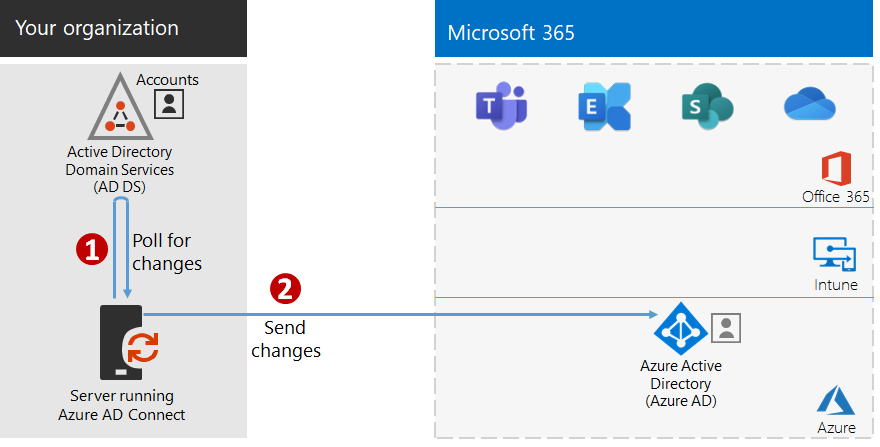
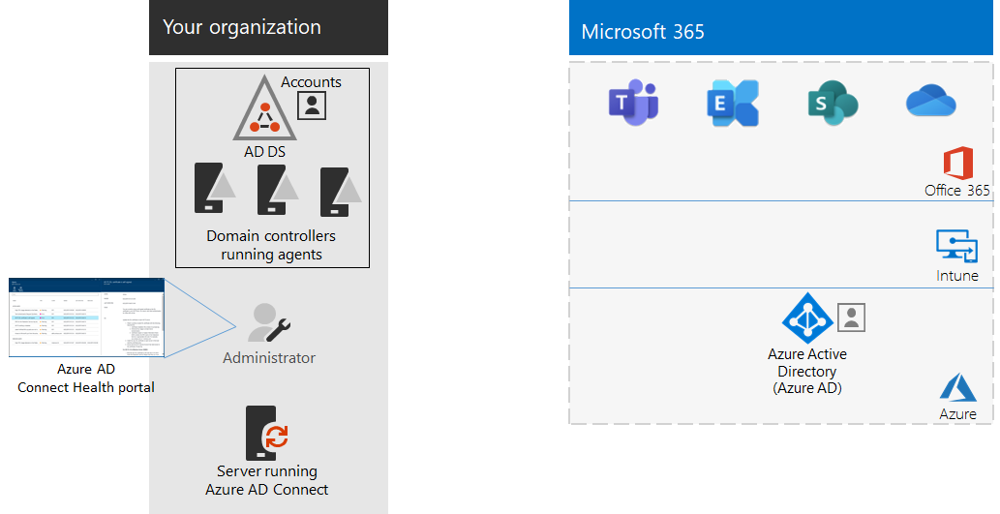

# Stap 4: uw gebruikersaccounts toevoegenStep 4: Add your user accounts

## De gebruikersaccounts maken voor de Cloud-identiteitCreate your user accounts for cloud-only identity

Voor Cloud-identiteit maakt u uw gebruikers en groepen in Azure Active Directory (Azure AD).For cloud-only identity, create your users and groups in Azure Active Directory (Azure AD). U kunt het volgende gebruiken:You can use:

- Het Microsoft 365-beheercentrumThe Microsoft 365 admin center
- De Azure-portalThe Azure portal
- Azure PowerShellAzure PowerShell

## Identiteiten voor hybride identiteit synchroniserenSynchronize identities for hybrid identity

*Deze stap is vereist voor hybride omgevingen en geldt voor zowel E3- als E5-versies van Microsoft 365 Enterprise**This is required for hybrid environments and applies to both the E3 and E5 versions of Microsoft 365 Enterprise*

In deze sectie synchroniseert u uw on-premises Active Directory Domain Services (AD DS) met de Azure AD-tenant die wordt gebruikt door Office 365, Microsoft Intune en andere Cloud-services die zijn opgenomen in Microsoft 365 Enterprise.In this section, you'll synchronize your on-premises Active Directory Domain Services (AD DS) with the Azure AD tenant used by Office 365, Microsoft Intune, and other cloud-based services included with Microsoft 365 Enterprise.

Azure AD Connect is het ondersteunde Microsoft-hulpprogramma dat u helpt bij het synchroniseren van alleen de identiteiten die u echt nodig hebt, van AD DS-omgevingen met één of meerdere forests tot uw Azure AD-tenant.Azure AD Connect is the supported Microsoft tool that guides you through synchronizing only the identities you really need from single or multi-forest AD DS environments to your Azure AD tenant. In de volgende afbeelding ziet u het basisproces voor Azure AD Connect-synchronisatie.The following figure shows the basic process for Azure AD Connect synchronization.

1. Met Azure AD Connect dat op een server wordt uitgevoerd, wordt AD DS gecontroleerd op wijzigingen in accounts, groepen en contactpersonen.Azure AD Connect running on a server polls AD DS for changes in accounts, groups, and contacts.
2. Azure AD Connect stuurt die wijzigingen naar de Azure AD-tenant van uw Microsoft 365-abonnement.Azure AD Connect sends those changes to the Azure AD tenant of your Microsoft 365 subscription.

De eerste beslissing in uw hybride identiteitsoplossing is uw verificatievereiste.The first decision in your hybrid identity solution is your authentication requirement. De volgende opties zijn beschikbaar:The following options are options:

- Met **beheerde verificatie**wordt het verificatieproces voor gebruikersaanmelding door Azure AD afgehandeld.With **managed authentication**, Azure AD handles the authentication process for user sign-in. Beheerde verificatie bestaat uit twee methoden:There are two methods for managed authentication: 
    - **Wachtwoord-hash-synchronisatie (PHS)** [aanbevolen en vereist voor enkele Premium-functies].**Password Hash Sync (PHS)** [Recommended and required for some premium features]. Dit is de eenvoudigste manier om verificatie in te schakelen voor on-premises adreslijstobjecten in Azure Active Directory.This is the simplest way to enable authentication for on-premises directory objects in Azure AD. Azure AD Connect haalt het gehashte wachtwoord uit AD DS, voert extra beveiligingsverwerking uit op de wachtwoordhash en synchroniseert het met Azure AD.Azure AD Connect extracts the hashed password from AD DS, does extra security processing on the password hash, and synchronizes it to Azure AD. Zie voor meer informatie [wachtwoord hash-synchronisatie implementeren met Azure AD Connect-synchronisatie](https://docs.microsoft.com/azure/active-directory/hybrid/how-to-connect-password-hash-synchronization).For more information, see [Implement password hash synchronization with Azure AD Connect sync](https://docs.microsoft.com/azure/active-directory/hybrid/how-to-connect-password-hash-synchronization).
    - **Pass Through-verificatie (PTA)** biedt een eenvoudige oplossing voor wachtwoordvalidatie voor Azure AD-services.**Pass-through Authentication (PTA)** provides a simple password validation solution for Azure AD-based services. PTA gebruikt een agent die op een of meer on-premises servers wordt uitgevoerd om de gebruikersverificaties rechtstreeks met uw lokale AD DS te valideren.PTA uses an agent running on one or more on-premises servers to validate the user authentications directly with your on-premises AD DS. Voor meer informatie raadpleegt u [aanmelden als gebruiker met Azure Active Directory Pass Through-verificatie](https://docs.microsoft.com/azure/active-directory/connect/active-directory-aadconnect-pass-through-authentication).For more information, see [User sign-in with Azure Active Directory Pass-through Authentication](https://docs.microsoft.com/azure/active-directory/connect/active-directory-aadconnect-pass-through-authentication).
- Met **federatieve verificatie**wordt het verificatieproces omgeleid naar een andere identiteitsprovider via een identiteitsfederatieserver, zoals Active Directory Federation Services (AD FS), voor aanmelding van een gebruiker.With **federated authentication**, the authentication process is redirected to another identity provider through an identity federation server, such as Active Directory Federation Services (AD FS), for a user’s sign-in. De identiteitsprovider kan aanvullende verificatiemethoden bieden, zoals op smartcards gebaseerde verificatie.The identity provider can provide additional authentication methods, such as smartcard-based authentication. Zie voor meer informatie [het kiezen van de juiste verificatiemethode voor uw Azure Active Directory hybride identiteitsoplossing](https://docs.microsoft.com/azure/active-directory/hybrid/choose-ad-authn).For more information, see [Choosing the right authentication method for your Azure Active Directory hybrid identity solution](https://docs.microsoft.com/azure/active-directory/hybrid/choose-ad-authn).

Bekijk deze video voor een overzicht van identiteitsmodellen en verificatie voor Microsoft 365 Enterprise.Watch this video for an overview of identity models and authentication for Microsoft 365 Enterprise.

 

 

> [!VIDEO https://www.microsoft.com/videoplayer/embed/RE2Pjwu]

Nadat u de hybride-identiteitsoplossing hebt vastgesteld, downloadt en voert u het [hulpprogramma voor het oplossen van fouten met IdFix Directory-synchronisatie](https://www.microsoft.com/download/details.aspx?id=36832) uit om uw AD DS te analyseren op problemen.After you've determined your hybrid identity solution, download and run the [IdFix Directory Synchronization Error Remediation Tool](https://www.microsoft.com/download/details.aspx?id=36832) to analyze your AD DS for issues.

Wanneer u alle problemen hebt opgelost die met het hulpprogramma IdFix zijn geïdentificeerd, raadpleegt u [wachtwoord hash-synchronisatie implementeren](https://docs.microsoft.com/azure/active-directory/connect/active-directory-aadconnectsync-implement-password-hash-synchronization) voor hulp bij het installeren van de Azure AD Connect-hulpmiddelen en het configureren van adreslijstsynchronisatie tussen uw on-premises AD DS en de Azure AD-tenant voor uw Microsoft 365-abonnement.After resolving all of the issues identified by the IdFix tool, see [Implement password hash synchronization](https://docs.microsoft.com/azure/active-directory/connect/active-directory-aadconnectsync-implement-password-hash-synchronization) for guidance on installing the Azure AD Connect tool and configuring directory synchronization between your on-premises AD DS and the Azure AD tenant for your Microsoft 365 subscription. Nadat de synchronisatie is gestart, houdt u uw gebruikersaccounts en -groepen bij met uw on-premises-identiteitsprovider, zoals AD DS.After synchronization starts, you'll maintain your user accounts and groups with your on-premises identity provider, such as AD DS.

Microsoft biedt een aantal aanbevelingen voor [identiteits- en apparaattoegang](microsoft-365-policies-configurations.md) om te zorgen dat uw personeel veilig en productief blijft.Microsoft provides a set of recommendations for [identity and device access](microsoft-365-policies-configurations.md) to ensure a secure and productive workforce. 

- Zie voor meer informatie over de aanbevolen vereisten voor hybride omgevingen de kolom **Active Directory met hash-synchronisatie** onder [vereisten](identity-access-prerequisites.md#prerequisites).For recommended requirements for hybrid environments, see the **Active Directory with password hash sync** column in [prerequisites](identity-access-prerequisites.md#prerequisites). 

- Zie de kolom **alleen Cloud** onder [vereisten](identity-access-prerequisites.md#prerequisites)voor aanbevolen vereisten voor alleen Cloud omgevingen.For recommended requirements for cloud only environments, see the **Cloud only** column in [prerequisites](identity-access-prerequisites.md#prerequisites).

Wanneer uw on-premises gebruikers en groepen in Azure AD aanwezig zijn, kunt u beginnen met het toewijzen van licenties en het gebruik van productiviteitslasten zoals OneDrive voor Bedrijven en Exchange Online.Once your on-premises users and groups are present in Azure AD, you can start assigning licenses and using productivity workloads such as OneDrive for Business and Exchange Online.

|||
|:-------|:-----|
|| [Testlabrichtlijn: wachtwoord-hash-synchronisatieTest Lab Guide: Password hash synchronization](password-hash-sync-m365-ent-test-environment.md)  [Testlabrichtlijn: pass-through-verificatieTest Lab Guide: Pass-through authentication](pass-through-auth-m365-ent-test-environment.md) |
|||

Als tussentijds controlepunt kunt u de [afsluitcriteria](identity-exit-criteria.md#crit-identity-sync) voor deze sectie bekijken.As an interim checkpoint, you can see the [exit criteria](identity-exit-criteria.md#crit-identity-sync) corresponding to this section.

## Synchronisatiestatus bewakenMonitor synchronization health

*Deze stap is optioneel en geldt voor zowel E3- als E5-versies van Microsoft 365**This is optional and applies to both the E3 and E5 versions of Microsoft 365*

In deze sectie installeert u een Azure AD Connect Health-agent op elk van uw on-premises AD DS-domeincontrollers om uw identiteitsinfrastructuur en de synchronisatieservices van Azure AD Connect te bewaken.In this section, you'll install an Azure AD Connect Health agent on each of your on-premises AD DS domain controllers to monitor your identity infrastructure and the synchronization services provided by Azure AD Connect. De bewakingsinformatie wordt beschikbaar gesteld in een Azure AD Connect Health-portal waar u waarschuwingen, prestatiebewaking, gebruiksanalyses en andere informatie kunt bekijken.The monitoring information is made available in an Azure AD Connect Health portal, where you can view alerts, performance monitoring, usage analytics, and other information.

De belangrijkste ontwerpbeslissing over hoe u Azure AD Connect Health gaat gebruiken, is gebaseerd op hoe u Azure AD Connect gebruikt:The key design decision of how to use Azure AD Connect Health is based on how you are using Azure AD Connect:

- Als u de optie **beheerde verificatie** gebruikt, begint u met [Azure AD Connect Health gebruiken met synchronisatie](https://docs.microsoft.com/azure/active-directory/connect-health/active-directory-aadconnect-health-sync), om Azure AD Connect Health te begrijpen en te configureren.If you’re using the **managed authentication** option, start with [Using Azure AD Connect Health with sync](https://docs.microsoft.com/azure/active-directory/connect-health/active-directory-aadconnect-health-sync) to understand and configure Azure AD Connect Health.
- Als u alleen de namen synchroniseert van de accounts en groepen met **federatieve verificatie** met Active Directory Federation Services (AD FS), begint u met [Azure AD Connect Health gebruiken met AD FS](https://docs.microsoft.com/azure/active-directory/connect-health/active-directory-aadconnect-health-adfs) om Azure AD Connect Health te begrijpen en te configureren.If you're synchronizing just the names of the accounts and groups using **federated authentication** with Active Directory Federation Services (AD FS), start with [Using Azure AD Connect Health with AD FS](https://docs.microsoft.com/azure/active-directory/connect-health/active-directory-aadconnect-health-adfs) to understand and configure Azure AD Connect Health.

Wanneer u deze stap hebt voltooid, hebt u:When you complete this section, you’ll have:

- De Azure AD Connect Health-agent die is geïnstalleerd op uw on-premises servers van de identiteitsprovider.The Azure AD Connect Health agent installed on your on-premises identity provider servers.
- De Azure AD Connect Health-portal met de huidige status van uw on-premises infrastructuur en synchronisatieactiviteiten met de Azure AD-tenant voor uw Microsoft 365- en EMS-abonnementen.The Azure AD Connect Health portal displaying the current state of your on-premises infrastructure and synchronization activities with the Azure AD tenant for your Microsoft 365 subscription.

Als tussentijds controlepunt kunt u de [afsluitcriteria](identity-exit-criteria.md#crit-identity-sync-health) voor deze stap bekijken.As an interim checkpoint, you can see the [exit criteria](identity-exit-criteria.md#crit-identity-sync-health) for this section.

## Wachtwoordupdates vereenvoudigenSimplify password updates

*Deze stap is optioneel voor hybride omgevingen en geldt voor zowel E3- als E5-versies van Microsoft 365 Enterprise**This is optional for hybrid environments and applies to both the E3 and E5 versions of Microsoft 365 Enterprise*

In deze sectie staat u gebruikers toe hun wachtwoorden opnieuw in te stellen via Azure Active Directory (Azure AD), die vervolgens wordt gerepliceerd naar uw lokale Active Directory Domain Services (AD DS).In this section, you'll allow users to reset their passwords through Azure Active Directory (Azure AD), which is then replicated to your local Active Directory Domain Services (AD DS). Dit proces wordt het terugschrijven van wachtwoorden genoemd.This process is known as password writeback. Met het terugschrijven van wachtwoorden hoeven gebruikers hun wachtwoorden niet bij te werken via de on-premises AD DS waar de gebruikersaccounts en de bijbehorende kenmerken zijn opgeslagen.With password writeback, users don’t need to update their passwords through the on-premises AD DS where user accounts and their attributes are stored. Dit is handig bij roaming en gebruikers die extern werken die geen RAS-verbinding met het on-premises netwerk hebben.This is valuable to roaming or remote users who do not have a remote access connection to the on-premises network.

Wachtwoord terugschrijven is vereist om volledig gebruik te kunnen maken van de mogelijkheden van Identity Protection-functies, zoals vereisen dat gebruikers hun on-premises wachtwoorden wijzigen wanneer er een hoog risico op inbreuk van accounts is gedetecteerd.Password writeback is required to fully utilize Azure AD Identity Protection capabilities, such as requiring users to change their on-premises passwords when there has been a high risk of account compromise detected.

Zie [Azure AD SSPR met wachtwoord terugschrijven](https://docs.microsoft.com/azure/active-directory/active-directory-passwords-writeback) voor meer informatie en configuratie-instructies.For additional information and configuration instructions, see [Azure AD SSPR with password writeback](https://docs.microsoft.com/azure/active-directory/active-directory-passwords-writeback).

>[!Note]
>Voer een upgrade uit naar de nieuwste versie van Azure AD Connect om te zorgen voor een optimale ervaring en nieuwe functies zodra deze beschikbaar komen.Upgrade to the latest version of Azure AD Connect to ensure the best possible experience and new features as they are released. Zie [Aangepaste installatie van Azure AD Connect](https://docs.microsoft.com/azure/active-directory/connect/active-directory-aadconnect-get-started-custom) voor meer informatie.For more information, see [Custom installation of Azure AD Connect](https://docs.microsoft.com/azure/active-directory/connect/active-directory-aadconnect-get-started-custom).
>

|||
|:-------|:-----|
|| [Testlabrichtlijn: wachtwoord terugschrijvenTest Lab Guide: Password writeback](password-writeback-m365-ent-test-environment.md) |
|||

Als tussentijds controlepunt kunt u de [afsluitcriteria](identity-exit-criteria.md#crit-identity-pw-writeback) voor deze stap bekijken.As an interim checkpoint, you can see the [exit criteria](identity-exit-criteria.md#crit-identity-pw-writeback) for this section.

|||
|:-------|:-----|
|| [Groepen gebruiken voor beheerUse groups for management](identity-use-group-management.md) |
