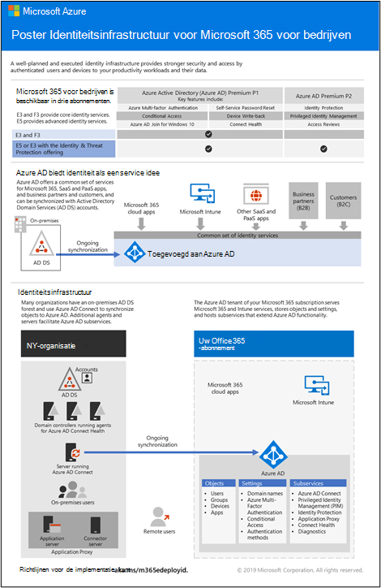

# Identiteitskaart voor Microsoft 365

In Microsoft 365 voor Enterprise is een goed geplande en uitgevoerde identificatie structuur Paves de manier voor een sterkere beveiliging, zoals het beperken van toegang tot uw productiviteits belastingen en hun gegevens aan geverifieerde gebruikers en apparaten.

Bekijk deze video voor een overzicht van identiteits modellen en verificatie voor Microsoft 365 for Enterprise:

 

> [!VIDEO https://www.microsoft.com/videoplayer/embed/RE2Pjwu]

Voor informatie over de identiteits functies van elk Microsoft 365 for Enterprise-abonnement, de rol van Azure Active Directory, de on-premises en Cloud onderdelen en de meest gebruikte verificatie configuraties, raadpleegt u de [poster voor identiteits infrastructuur](../downloads/m365e-identity-infra.pdf).

Bekijk deze tweepaginas poster om snel te beoordeelen over identiteits concepten en configuraties voor Microsoft 365 for Enterprise.

U kunt [deze poster ook downloaden](https://github.com/MicrosoftDocs/microsoft-365-docs/raw/public/microsoft-365/downloads/m365e-identity-infra.pdf). U kunt de indeling letter, Legal of tabloid (11 x 17) afdrukken.

## Abonnement

Voor het plannen van uw identiteits implementatie:

- [Meer informatie over de verschillende identiteits modellen](about-microsoft-365-identity.md)
- [Hybrid Identity-en Directory synchronisatie plannen](plan-for-directory-synchronization.md)

## Implementeren

Uw identiteits implementatie implementeren:

- [Uw globale-beheerdersaccounts beveiligen](protect-your-global-administrator-accounts.md)
- [Alleen Cloud identiteiten configureren en gebruiken](cloud-only-identities.md)
- [Hybrid Identities configureren en gebruiken](prepare-for-directory-synchronization.md)
- [Adreslijstsynchronisatie instellen](set-up-directory-synchronization.md)
- [Scenario's voor hybride identiteiten](hybrid-solutions.md) , indien nodig, implementeren

### Aanbevelingen voor identiteiten en apparaattoegang

Microsoft biedt een set aanbevelingen voor de [toegang van identiteiten en apparaten](microsoft-365-policies-configurations.md)om een veilig en productief personeel te helpen. Gebruik voor Identity de aanbevelingen en instellingen in deze artikelen:

- [Vereisten](identity-access-prerequisites.md)
- [Algemeen beleid voor identiteiten en apparaattoegang](identity-access-policies.md)

## Beheren

Uw identiteits implementatie beheren:

- [Licenties toewijzen en gebruikersaccounts beheren](assign-licenses-to-user-accounts.md)
- [Directory synchronisatie controleren](view-directory-synchronization-status.md)

## Hoe Microsoft de identiteit voor Microsoft 365 biedt

Lees hoe IT-experts bij Microsoft [identiteiten en beveiligde toegang beheren](https://www.microsoft.com/en-us/itshowcase/managing-user-identities-and-secure-access-at-microsoft).

>[!Note]
>Deze informatiebron is alleen beschikbaar in het Engels.
>

## De werking van Contoso voor Microsoft 365

Voor een voorbeeld van de manier waarop een fictieve maar representatieve multinationale organisatie een hybride identiteits infrastructuur voor Microsoft 365-cloudservices implementeert, raadpleegt u [de identiteit voor de Contoso Corporation](contoso-identity.md).

## Volgende stap

Begin met het plannen van uw identiteit met [identiteits modellen](about-microsoft-365-identity.md).
