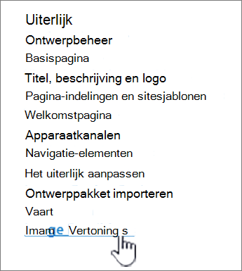
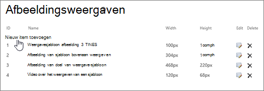
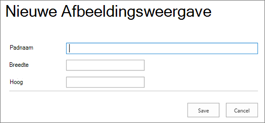

# Afbeeldingsoptimalisatie voor klassieke publicatiesites van SharePoint Online

De laadsnelheid van een webpagina is afhankelijk van de gecombineerde grootte van alle onderdelen die nodig zijn om de pagina weer te geven, inclusief afbeeldingen, HTML, JavaScript en CSS. Afbeeldingen zijn een geweldige manier om uw site aantrekkelijker te maken, maar de grootte kan van invloed zijn op de prestaties. Door uw afbeeldingen te optimaliseren met compressie en formaat en sprites te gebruiken, kunt u de effecten van zeer grote afbeeldingen compenseren. Met SharePoint-afbeeldingsweergaven kunt u één grote afbeelding uploaden en secties van de afbeelding weergeven, zodat deze opnieuw kan worden gebruikt in plaats van opnieuw te worden geladen.

>[!NOTE]
>Dit onderwerp is van toepassing op klassieke publicatiesites van SharePoint Online, niet op moderne portalsites. Zie Afbeeldingen optimaliseren in moderne portalpagina's van SharePoint Online voor informatie over afbeeldingsoptimalisatie in moderne portalsites [van SharePoint Online.](modern-image-optimization.md)
  
## Sprites gebruiken om het laden van afbeeldingen te versnellen

|||
|:-----|:-----|
| Een afbeeldingsspite bevat veel kleinere afbeeldingen. Met CSS selecteert u een deel van de samengestelde afbeelding dat u wilt weergeven op een bepaald deel van de pagina met absolute plaatsing. In feite verplaatst u één afbeelding over de pagina in plaats van meerdere afbeeldingen te laden en maakt u een klein deel van die afbeelding zichtbaar via een klein venster waarin het vereiste deel van de sprite-afbeelding wordt weergegeven aan de eindgebruiker. SharePoint Online gebruikt sprites om de verschillende pictogrammen weer te geven in de sprite spcommon.png.     Wat hier wordt bestreken:     Afbeeldingscompressie     Afbeeldingsoptimalisatie     Weergaven van SharePoint-afbeeldingen    ||
   
Dit kan de prestaties verhogen omdat u slechts één afbeelding downloadt in plaats van meerdere afbeeldingen en vervolgens de cache opneemt en deze afbeelding opnieuw gebruikt. Zelfs als de afbeelding niet in de cache blijft, door één afbeelding te hebben in plaats van meerdere afbeeldingen, wordt met deze methode het totale aantal HTTP-aanvragen naar de server beperkt, waardoor de laadtijden van pagina's worden beperkt. Dit is echt een vorm van afbeeldingsbundeling. Dit is een zeer handige techniek als de afbeeldingen niet erg vaak veranderen, bijvoorbeeld pictogrammen, zoals wordt weergegeven in het bovenstaande SharePoint-voorbeeld. U kunt Web [Essentials](https://vswebessentials.com/), een open-source, community-gebaseerd project van derden gebruiken om dit eenvoudig te bereiken in Microsoft Visual Studio. Zie [Minification en bundeling in SharePoint Online](./minification-and-bundling-in-sharepoint-online.md)voor meer informatie.
  
## Afbeeldingscompressie en -optimalisatie gebruiken om het laden van pagina's te versnellen

Afbeeldingscompressie en -optimalisatie gaat over het verkleinen van de bestandsgrootte van de afbeeldingen die u op uw site gebruikt. Vaak is het de beste methode om de grootte van een afbeelding te verkleinen door het formaat van de afbeelding te verkleinen tot de maximale afmetingen die op de site worden bekeken. Het heeft geen zin om een afbeelding te hebben die groter is dan ooit wordt bekeken. Als u ervoor zorgt dat afbeeldingen de juiste afmetingen hebben met behulp van een afbeeldingseditor, kunt u de pagina snel en eenvoudig verkleinen.
  
Wanneer afbeeldingen de juiste grootte hebben, is de volgende stap het optimaliseren van de compressie van deze afbeeldingen. Er zijn verschillende hulpprogramma's beschikbaar voor compressie en optimalisatie, waaronder Fotogalerie en hulpprogramma's van derden. De sleutel tot compressie is om de bestandsgrootte zo veel mogelijk te beperken zonder dat de waarneembare kwaliteit voor eindgebruikers verloren gaat. Controleer of u uw gecomprimeerde bestanden op een hd-scherm test om ervoor te zorgen dat ze er nog steeds goed uitzien.
  
## Paginadownloads versnellen met SharePoint-afbeeldingsweergaven

Afbeeldingsweergaven zijn een functie in SharePoint Online waarmee u verschillende versies van afbeeldingen kunt gebruiken op basis van vooraf gedefinieerde afbeeldingsafmetingen. Dit is vooral belangrijk als er door de gebruiker gegenereerde afbeeldingsinhoud is of als de afmetingen van de afbeelding, zoals breedte en hoogte, worden opgelost door de CSS op de site. Zelfs als een afbeelding is opgelost met CSS, wordt de afbeelding met volledige resolutie nog steeds geladen. In dit geval kan de bestandsgrootte worden verkleind met afbeeldingsweergaven.
  
> [!NOTE]
> Weergaven zijn alleen beschikbaar voor SharePoint wanneer publiceren is ingeschakeld. U kunt publiceren inschakelen onder Instellingen \> Site-instellingen \> Sitefuncties beheren \> SharePoint Server Publishing. De optie wordt anders niet weergegeven.
  
Het formaat van de afbeeldingsweergave werkt door de kleinste dimensie te nemen die u definieert, breedte of hoogte, en vervolgens het formaat van de afbeelding te wijzigen, zodat de andere dimensie automatisch wordt gedimensioneerd op basis van de vergrendelde hoogte-breedteverhouding. Standaard wordt de afbeelding vanuit het midden bijgesneden door de resterende afmetingen. Als u bijvoorbeeld een weergave van 100px breed en 50px hoog definieert en de oorspronkelijke afbeelding 1000px breed en 800px hoog is, wordt de grootte ervan zo bijgesneden dat de dimensie 800px nu 50px is en de dimensie 1000px (nu 62,5px) wordt bijgesneden vanuit het midden van de afbeelding.
  
De stappen zijn relatief eenvoudig, maar voor afbeeldingen die de weergaven gebruiken, moeten de weergaven op de SharePoint-site staan voordat u de afbeeldingen toevoegt. Daarnaast moet u ook de functies Publicatie-infrastructuur voor SharePoint Server (siteverzamelingsniveau) en SharePoint Server Publishing (siteniveau) hebben ingeschakeld.
  
### Een afbeeldingsweergave toevoegen om het laden van pagina's te versnellen
  
1. Controleer of het gebruikersaccount dat deze procedure voert, minimaal ontwerpmachtigingen heeft voor de site op het hoogste niveau van de siteverzameling en of de site wordt gepubliceerd naar een webpagina.

2. Ga in een webbrowser naar de site op het hoogste niveau van de publicatiesiteverzameling.

3. Kies het **pictogram** Instellingen.

4. Op de **pagina Site-instellingen** in de sectie **Uiterlijk** ziet u de ingebouwde afbeeldingsweergaven.

    U kunt de out-of-the-box-weergaven gebruiken of **Afbeeldingsweergaven** kiezen om een nieuwe te maken.

    
  
5. Kies op **de pagina Afbeeldingsweergaven** de optie **Nieuw item toevoegen.**

    
  
6. Voer op **de pagina Nieuwe afbeeldingsweergave** in het vak **Naam** een naam in voor de weergave.

7. Voer in **de** **tekstvakken** Breedte en Hoogte de breedte en hoogte in, in pixels, van de weergave en kies **opslaan.**

    
  
## Aangepast bijsnijden met afbeeldingsweergaven

Standaard wordt een afbeeldingsweergave gegenereerd vanuit het midden van de afbeelding. U kunt de afbeeldingsweergave voor afzonderlijke afbeeldingen aanpassen door het gedeelte van de afbeelding bij tesnijden dat u wilt gebruiken. U kunt de afbeeldingen op individuele basis bijsnijden, per weergave. Bijsnijden van de afbeeldingen versnelt het laden van pagina's door de blobcache van SharePoint te gebruiken om voor elke weergave een versie van de afbeelding te maken. Op deze manier wordt de belasting van de server verminderd omdat de afbeelding slechts één keer wordt verkleind en vervolgens meerdere keren klaar is om te worden gebruikt voor eindgebruikers. Zie Een afbeeldingsweergave bijsnijden voor meer informatie over het bijsnijden van een [afbeeldingsweergave.](/sharepoint/dev/general-development/sharepoint-design-manager-device-channels)
