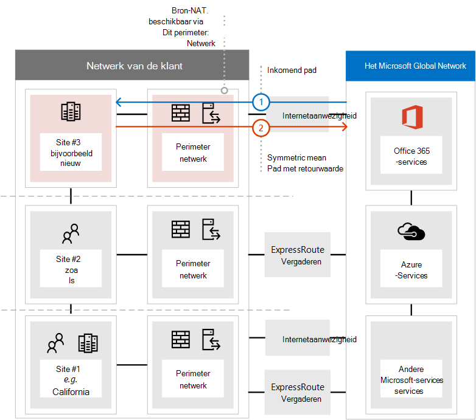
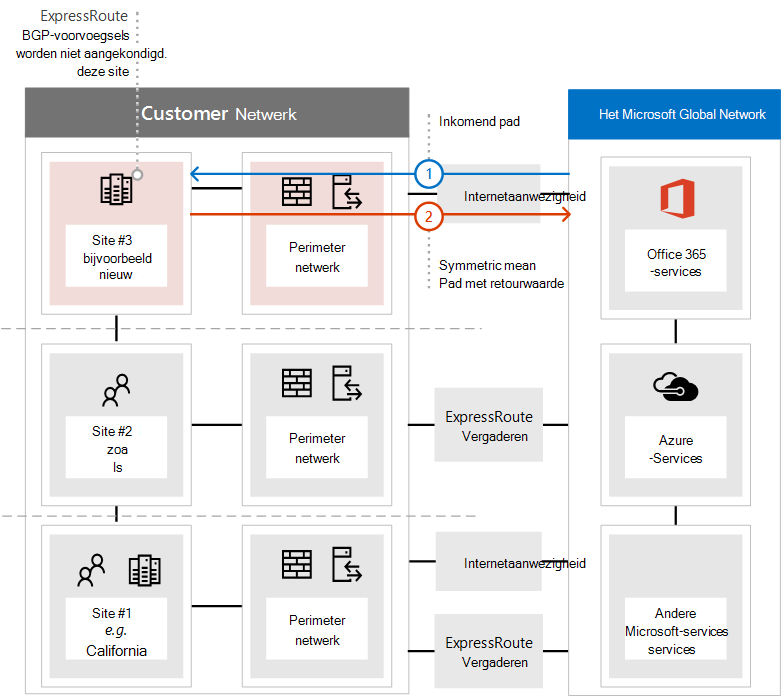
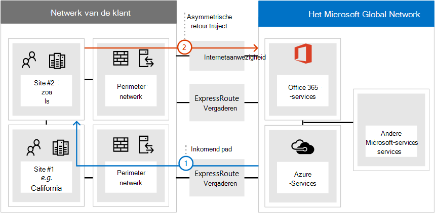

# <a name="implementing-expressroute-for-office-365"></a>ExpressRoute implementeren voor Office 365

*Dit artikel is van toepassing op Microsoft 365 Enterprise en Office 365 Enterprise.*

ExpressRoute voor Office 365 biedt een alternatief routeringspad naar veel office 365-services met internet. De architectuur van ExpressRoute voor Office 365 is gebaseerd op het adverteren van openbare IP-voorvoegsels van Office 365-services die al via internet toegankelijk zijn in uw ingerichte ExpressRoute-circuits voor verdere herverdeling van deze IP-voorvoegsels in uw netwerk. Met ExpressRoute kunt u effectief verschillende routeringspaden inschakelen, via internet en via ExpressRoute, voor veel Office 365-services. Deze routeringstoestand op uw netwerk kan een belangrijke wijziging zijn in de manier waarop uw interne netwerktopologie is ontworpen.
  
 **Status:** Complete Guide v2
  
U moet uw ExpressRoute voor Office 365-implementatie zorgvuldig plannen om rekening te houden met de netwerkcomplexiteit van routering die beschikbaar is via zowel een speciaal circuit met routes die zijn ingespoten in uw kernnetwerk als via internet. Als u en uw team de gedetailleerde planning en tests niet uitvoeren in deze handleiding, bestaat er een hoog risico dat u met tussenpozen of een totaal verlies van connectiviteit met Office 365-services te maken krijgt wanneer het ExpressRoute-circuit is ingeschakeld.
  
Als u een succesvolle implementatie wilt uitvoeren, moet u uw infrastructuurvereisten analyseren, gedetailleerde netwerkbeoordelingen en -ontwerpen uitvoeren, de implementatie zorgvuldig plannen op een gefaseerd en gecontroleerd manier en een gedetailleerd validatie- en testplan maken. Voor een grote, gedistribueerde omgeving is het niet ongebruikelijk dat implementaties enkele maanden duren. Deze handleiding is ontworpen om u vooruit te helpen plannen.
  
Grote succesvolle implementaties kunnen zes maanden in de planning duren en omvatten vaak teamleden uit vele gebieden in de organisatie, waaronder netwerkbeheerders, firewall- en proxyserverbeheerders, Office 365-beheerders, beveiliging, ondersteuning van eindgebruikers, projectmanagement en executive sponsoring. Uw investering in het planningsproces verkleint de kans dat implementatiefouten optreden, wat resulteert in downtime of complexe en dure probleemoplossing.
  
We verwachten dat de volgende vereisten moeten worden voltooid voordat deze implementatiehandleiding wordt gestart.
  
1. U hebt een netwerkbeoordeling voltooid om te bepalen of ExpressRoute wordt aanbevolen en goedgekeurd.

2. U hebt een ExpressRoute-netwerkserviceprovider geselecteerd. Meer informatie over de [ExpressRoute-partners en peeringlocaties.](/azure/expressroute/expressroute-locations)

3. U hebt de [ExpressRoute-documentatie](https://azure.microsoft.com/documentation/services/expressroute/) al gelezen en begrepen en uw interne netwerk kan aan de vereisten van ExpressRoute voldoen.

4. Uw team heeft alle openbare richtlijnen en documentatie op gelezen en de Azure ExpressRoute voor [https://aka.ms/expressrouteoffice365](./azure-expressroute.md) [https://aka.ms/ert](https://aka.ms/ert) Office [365-trainingsreeks](https://channel9.msdn.com/series/aer) op Kanaal 9 bekeken om inzicht te krijgen in belangrijke technische details, zoals:

      - De internetafhankelijkheden van SaaS-services.

      - Asymmetrische routes vermijden en complexe routering verwerken.

      - Besturingselementen voor perimeterbeveiliging, beschikbaarheid en toepassingsniveau opnemen.

## <a name="begin-by-gathering-requirements"></a>Begin met het verzamelen van vereisten
<a name="requirements"> </a>

Begin door te bepalen welke functies en services u wilt gebruiken binnen uw organisatie. U moet bepalen welke functies van de verschillende Office 365-services worden gebruikt en welke locaties in uw netwerk personen hosten die deze functies gebruiken. Met de catalogus met scenario's moet u de netwerkkenmerken toevoegen die voor elk van deze scenario's nodig zijn. zoals binnenkomende en uitgaande netwerkverkeersstromen en als de Office 365-eindpunten al dan niet beschikbaar zijn via ExpressRoute.
  
De vereisten van uw organisatie verzamelen:
  
- Catalogiseer het binnenkomende en uitgaande netwerkverkeer voor de Office 365-services die uw organisatie gebruikt. Raadpleeg de pagina Office 365-URL's en IP-adresbereiken voor de beschrijving van stromen die verschillende Office 365-scenario's vereisen.

- Verzamel documentatie van bestaande netwerktopologie met details van uw interne WAN-backbone en -topologie, connectiviteit van satellietsites, last mile user connectivity, routing to network perimeter egress points, and proxy services.

  - Identificeer inkomende service-eindpunten in de netwerkdiagrammen waarop Office 365 en andere Microsoft-services verbinding zullen maken, met zowel internet- als voorgestelde ExpressRoute-verbindingspaden.

  - Identificeer alle geografische gebruikerslocaties en WAN-connectiviteit tussen locaties, samen met welke locaties momenteel een uitje naar internet hebben en welke locaties worden voorgesteld om uit te gaan naar een ExpressRoute-peeringlocatie.

  - Identificeer alle edge-apparaten, zoals proxies, firewalls, en catalogiseer hun relatie met stromen via internet en ExpressRoute.

  - Document of eindgebruikers toegang hebben tot Office 365-services via directe routering of indirecte toepassingsproxy voor zowel internet- als ExpressRoute-stromen.

- Voeg de locatie van uw tenant- en meet-me-locaties toe aan uw netwerkdiagram.

- Schat de verwachte en waargenomen netwerkprestaties en latentiekenmerken van belangrijke gebruikerslocaties naar Office 365. Houd er rekening mee dat Office 365 een globale en gedistribueerde set services is en dat gebruikers verbinding maken met locaties die mogelijk verschillen van de locatie van hun tenant. Daarom is het raadzaam om de latentie tussen de gebruiker en de dichtstbijzijnde rand van het wereldwijde Microsoft-netwerk te meten en te optimaliseren via ExpressRoute- en internetverbindingen. U kunt uw bevindingen uit de netwerkbeoordeling gebruiken om deze taak te helpen.

- Vermeld bedrijfsnetwerkbeveiliging en hoge beschikbaarheidsvereisten die moeten worden voldaan met de nieuwe ExpressRoute-verbinding. Hoe krijgen gebruikers bijvoorbeeld nog steeds toegang tot Office 365 in het geval van een internetstoring of expressroute-circuitfout.

- Documenteren welke binnenkomende en uitgaande Office 365-netwerkstromen gebruikmaken van het internetpad en welke ExpressRoute gebruiken. Voor de specifieke geografische locaties van uw gebruikers en de details van uw on-premises netwerktopologie moet het plan mogelijk verschillen van de ene gebruikerslocatie naar de andere.

### <a name="catalog-your-outbound-and-inbound-network-traffic"></a>Uw uitgaande en binnenkomende netwerkverkeer catalogiseren
<a name="trafficCatalog"> </a>

Als u routering en andere netwerkcomplexiteiten wilt minimaliseren, raden we u aan om Alleen ExpressRoute voor Office 365 te gebruiken voor de netwerkverkeersstromen die nodig zijn om over een speciale verbinding te gaan vanwege wettelijke vereisten of als gevolg van de netwerkbeoordeling. Daarnaast wordt u aangeraden het bereik van ExpressRoute-routering te plannen en uitgaande en binnenkomende netwerkverkeersstromen te benaderen als verschillende en afzonderlijke stadia van het implementatieproject. Als u ExpressRoute voor Office 365 implementeert voor alleen door de gebruiker geïnitieerde uitgaande netwerkverkeersstromen en binnenkomende netwerkverkeersstromen via internet laat, kan dit helpen om de toename van de topologische complexiteit en de risico's van het introduceren van extra asymmetrische routeringsmogelijkheden te beheersen.
  
Uw netwerkverkeerscatalogus moet een overzicht bevatten van alle binnenkomende en uitgaande netwerkverbindingen tussen uw on-premises netwerk en Microsoft.
  
- Uitgaande netwerkverkeersstromen zijn scenario's waarin een verbinding wordt gestart vanuit uw on-premises omgeving, zoals van interne clients of servers, met een bestemming van de Microsoft-services. Deze verbindingen kunnen rechtstreeks naar Office 365 of indirect zijn, bijvoorbeeld wanneer de verbinding via proxyservers, firewalls of andere netwerkapparaten verloopt op het pad naar Office 365.

- Binnenkomende netwerkverkeersstromen zijn scenario's waarin een verbinding wordt gestart vanuit de Microsoft-cloud naar een on-premises host. Deze verbindingen moeten meestal via een firewall en andere beveiligingsinfrastructuur worden gebruikt die door het beveiligingsbeleid van klanten is vereist voor extern afkomstige stromen.

Lees  de sectie Routesymmetrie waarborgen van het artikel Routeren met ExpressRoute voor [Office 365](https://support.office.com/article/Routing-with-ExpressRoute-for-Office-365-e1da26c6-2d39-4379-af6f-4da213218408) om te bepalen welke services binnenkomende verkeer verzenden en zoek naar de kolom met ExpressRoute voor **Office 365** in het office [365-eindpuntenverwijzingsartikel](https://support.office.com/article/Office-365-URLs-and-IP-address-ranges-8548a211-3fe7-47cb-abb1-355ea5aa88a2) om de rest van de verbindingsgegevens te bepalen.
  
Voor elke service die een uitgaande verbinding vereist, wilt u de geplande connectiviteit voor de service beschrijven, inclusief netwerkroutering, proxyconfiguratie, pakketcontrole en bandbreedtebehoeften.
  
Voor elke service die een inkomende verbinding vereist, hebt u aanvullende informatie nodig. Servers in de Microsoft-cloud maken verbinding met uw on-premises netwerk. Om ervoor te zorgen dat de verbindingen correct zijn gemaakt, wilt u alle aspecten van deze connectiviteit beschrijven, inclusief; de openbare DNS-vermeldingen voor de services die deze binnenkomende verbindingen accepteren, de IPv4-IP-adressen met CIDR-indeling, de apparatuur voor internetproviders die betrokken zijn en de manier waarop nat- of bron nat-inkomende verbindingen worden verwerkt voor deze verbindingen.
  
Binnenkomende verbindingen moeten worden gecontroleerd, ongeacht of ze verbinding maken via internet of ExpressRoute om ervoor te zorgen dat asymmetrische routering niet is geïntroduceerd. In sommige gevallen moeten on-premises eindpunten waar Office 365-services inkomende verbindingen mee starten, mogelijk ook worden gebruikt door andere Microsoft- en niet-Microsoft-services. Het is van het grootste belang dat het inschakelen van ExpressRoute-routering naar deze services voor Office 365-doeleinden andere scenario's niet doorbreekt. In veel gevallen moeten klanten mogelijk specifieke wijzigingen doorvoeren in hun interne netwerk, zoals nat op basis van bron, om ervoor te zorgen dat binnenkomende stromen van Microsoft symmetrisch blijven nadat ExpressRoute is ingeschakeld.
  
Hier is een voorbeeld van het vereiste detailniveau. In dit geval wordt Exchange Hybrid via ExpressRoute doorgestuurd naar het on-premises systeem.

|**Verbindings-eigenschap**|**Value**|
|:-----|:-----|
|**Netwerkverkeersrichting** <br/> |Binnenkomende  <br/> |
|**Service** <br/> |Hybride versie van Exchange  <br/> |
|**Openbaar Office 365-eindpunt (bron)** <br/> |Exchange Online (IP-adressen)  <br/> |
|**Openbaar on-premises eindpunt (doel)** <br/> |5.5.5.5  <br/> |
|**Openbare DNS-invoer (internet)** <br/> |Autodiscover.contoso.com  <br/> |
|**Wordt dit on-premises eindpunt gebruikt voor andere (niet-Office 365) Microsoft-services** <br/> |Nee  <br/> |
|**Wordt dit on-premises eindpunt gebruikt door gebruikers/systemen op internet** <br/> |Ja  <br/> |
|**Interne systemen gepubliceerd via openbare eindpunten** <br/> |Exchange Server-clienttoegangsrol (on-premises) 192.168.101, 192.168.102, 192.168.103  <br/> |
|**IP-advertentie van het openbare eindpunt** <br/> |**Naar internet**: 5.5.0.0/16  <br/> **Naar ExpressRoute**: 5.5.5.0/24  <br/> |
|**Beveiligings-/perimeterbesturingselementen** <br/> |**Internetpad:** DeviceID_002  <br/> **ExpressRoute-pad**: DeviceID_003  <br/> |
|**Hoge beschikbaarheid** <br/> |Actief/actief in 2 geo-redundante  <br/> ExpressRoute-circuits - Chicago en Dallas  <br/> |
|**Besturingselement padsymmetrie** <br/> |**Methode**: Bron NAT  <br/> **Internetpad:** Bron NAT-inkomende verbindingen naar 192.168.5.5  <br/> |**ExpressRoute-pad:** Bron NAT-verbindingen naar 192.168.1.0 (Chicago) en 192.168.2.0 (Dallas)  <br/> |

Hier is een voorbeeld van een service die alleen uitgaand is:

|**Verbindings-eigenschap**|**Value**|
|:-----|:-----|
|**Netwerkverkeersrichting** <br/> |Uitgaande  <br/> |
|**Service** <br/> |SharePoint Online  <br/> |
|**On-premises eindpunt (bron)** <br/> |Gebruikerswerkstation  <br/> |
|**Openbaar Office 365-eindpunt (doel)** <br/> |SharePoint Online (IP-adressen)  <br/> |
|**Openbare DNS-invoer (internet)** <br/> |\*.sharepoint.com (en extra FQDN's)  <br/> |
|**CDN-verwijzingen** <br/> |cdn.sharepointonline.com (en extra FQDN's) - IP-adressen die worden onderhouden door CDN-providers)  <br/> |
|**IP-advertentie en NAT in gebruik** <br/> |**Internetpad/Bron NAT**: 1.1.1.0/24  <br/> **ExpressRoute path/Source NAT**: 1.1.2.0/24 (Chicago) en 1.1.3.0/24 (Dallas)  <br/> |
|**Connectiviteitsmethode** <br/> |**Internet:** via laag 7-proxy (.pac-bestand)  <br/> **ExpressRoute:** directe routering (geen proxy)  <br/> |
|**Beveiligings-/perimeterbesturingselementen** <br/> |**Internetpad:** DeviceID_002  <br/> **ExpressRoute-pad**: DeviceID_003  <br/> |
|**Hoge beschikbaarheid** <br/> |**Internetpad:** Redundant internet-egressie  <br/> **ExpressRoute-pad:** Active/Active 'hot potato' routing across 2 geo-redundant ExpressRoute circuits - Chicago and Dallas  <br/> |
|**Besturingselement padsymmetrie** <br/> |**Methode**: Bron NAT voor alle verbindingen  <br/> |

### <a name="your-network-topology-design-with-regional-connectivity"></a>Uw netwerktopologieontwerp met regionale connectiviteit
<a name="topology"> </a>

Zodra u de services en de bijbehorende netwerkverkeersstromen begrijpt, kunt u een netwerkdiagram maken dat deze nieuwe connectiviteitsvereisten bevat en de wijzigingen illustreert die u zult aanbrengen om ExpressRoute voor Office 365 te gebruiken. Het diagram moet het volgende bevatten:
  
1. Alle gebruikerslocaties waar Office 365 en andere services worden gebruikt.

2. Alle internet- en ExpressRoute-uitgangspunten.

3. Alle uitgaande en binnenkomende apparaten die de connectiviteit binnen en buiten het netwerk beheren, inclusief routers, firewalls, toepassingsproxyservers en detectie/preventie van inbraken.

4. Interne bestemmingen voor alle binnenkomende verkeer, zoals interne ADFS-servers die verbindingen accepteren vanaf de proxyservers van de ADFS-webtoepassing.

5. Catalogus van alle IP-subnetten die worden aangekondigd

6. Identificeer elke locatie waar personen Toegang hebben tot Office 365 en vermeld de meet-me-locaties die worden gebruikt voor ExpressRoute.

7. Locaties en gedeelten van uw interne netwerktopologie, waar Microsoft IP-voorvoegsels die zijn geleerd van ExpressRoute, worden geaccepteerd, gefilterd en doorgestuurd naar.

8. De netwerktopologie moet de geografische locatie van elk netwerksegment illustreren en hoe deze verbinding maakt met het Microsoft-netwerk via ExpressRoute en/of internet.

In het onderstaande diagram ziet u elke locatie waar personen Office 365 gebruiken, samen met de inkomende en uitgaande routeringsadvertenties naar Office 365.
  

  
Voor uitgaand verkeer hebben de personen op drie manieren toegang tot Office 365:
  
1. Via een meet-me-locatie in Noord-Amerika voor de mensen in Californië.

2. Via een meet-me-locatie in Hongkong voor de mensen in Hongkong.

3. Via internet in Bangladesh, waar minder mensen zijn en er geen ExpressRoute-circuit is ingericht.


  
Op dezelfde manier retourneert het binnenkomende netwerkverkeer van Office 365 op een van de drie manieren:
  
1. Via een meet-me-locatie in Noord-Amerika voor de mensen in Californië.

2. Via een meet-me-locatie in Hongkong voor de mensen in Hongkong.

3. Via internet in Bangladesh, waar minder mensen zijn en er geen ExpressRoute-circuit is ingericht.


  
### <a name="determine-the-appropriate-meet-me-location"></a>De juiste meet-me-locatie bepalen

De selectie van meet-me-locaties, de fysieke locatie waar uw ExpressRoute-circuit uw netwerk verbindt met het Microsoft-netwerk, wordt beïnvloed door de locaties waar personen Toegang hebben tot Office 365. Als SaaS-aanbieding werkt Office 365 niet op dezelfde manier als Azure onder het regionale IaaS- of PaaS-model. In plaats daarvan is Office 365 een gedistribueerde set samenwerkingsservices, waar gebruikers mogelijk verbinding moeten maken met eindpunten in meerdere datacenters en regio's, die mogelijk niet noodzakelijk op dezelfde locatie of regio staan waar de tenant van de gebruiker wordt gehost.
  
Dit betekent dat de belangrijkste overweging die u moet maken bij het selecteren van meet-me-locaties voor ExpressRoute voor Office 365 de locatie is waar de personen in uw organisatie verbinding mee maken. De algemene aanbeveling voor optimale Office 365-connectiviteit is het implementeren van routering, zodat gebruikersaanvragen naar Office 365-services via het kortste netwerkpad worden ingeleverd in het Microsoft-netwerk. Dit wordt ook wel 'hot potato'-routering genoemd. Als de meeste Office 365-gebruikers zich bijvoorbeeld op een of twee locaties bevinden, wordt het optimale ontwerp gemaakt door meet-me-locaties te selecteren die zich het dichtst bij de locatie van die gebruikers bevinden. Als uw bedrijf grote gebruikerspopulaties heeft in veel verschillende regio's, kunt u overwegen meerdere ExpressRoute-circuits en meet-me-locaties te hebben. Voor sommige gebruikerslocaties is het kortste/meest optimale pad naar Microsoft-netwerk en Office 365 mogelijk niet via uw interne WAN- en ExpressRoute-meet-me-punten, maar via internet.
  
Vaak zijn er meerdere meet-me-locaties die kunnen worden geselecteerd in een regio met de relatieve nabijheid van uw gebruikers. Vul de volgende tabel in om uw beslissingen te begeleiden.

|**Geplande ExpressRoute-meet-me-locaties in Californië en New York**||
|:-----|:-----|
|Locatie  <br/> |Aantal personen  <br/> |Verwachte latentie voor Microsoft-netwerk via internet-egressie  <br/> |Verwachte latentie naar Microsoft-netwerk via ExpressRoute  <br/> |
|Los Angeles  <br/> |10,000  <br/> |~15 ms  <br/> |~10 ms (via Silicon Valley)  <br/> |
|Washington DC  <br/> |15,000  <br/> |~20 ms  <br/> |~10 ms (via New York)  <br/> |
|Dallas  <br/> |5,000  <br/> |~15 ms  <br/> |~40 ms (via New York)  <br/> |

Wanneer de globale netwerkarchitectuur met de Office 365-regio, de meet-me-locaties van de ExpressRoute-netwerkprovider en de hoeveelheid personen per locatie is ontwikkeld, kan deze worden gebruikt om te bepalen of optimalisaties kunnen worden aangebracht. Het kan ook globale haarspeldnetwerkverbindingen laten zien waar verkeersroutes naar een verre locatie worden gebruikt om de meet-me-locatie te krijgen. Als een hairpin op het globale netwerk wordt gevonden, moet deze worden gesaneerd voordat u verdergaat. Zoek een andere meet-me-locatie of gebruik selectieve uitbraken via internet om de haarspeld te voorkomen.
  
In het eerste diagram ziet u een voorbeeld van een klant met twee fysieke locaties in Noord-Amerika. U kunt de informatie over kantoorlocaties, Office 365-tenantlocaties en verschillende opties voor ExpressRoute-meet-me-locaties zien. In dit voorbeeld heeft de klant de meet-me-locatie geselecteerd op basis van twee principes, in volgorde:
  
1. De dichtstbijzijnde nabijheid van de personen in hun organisatie.

2. Het dichtst in de buurt van een Microsoft-datacenter waar Office 365 wordt gehost.


  
Als u dit concept iets verder uitbreidt, wordt in het tweede diagram een voorbeeld van een multinationale klant weergegeven die te maken heeft met vergelijkbare informatie en besluitvorming. Deze klant heeft een klein kantoor in Bangladesh met slechts een klein team van tien personen dat is gericht op het vergroten van hun voetafdruk in de regio. Er is een meet-me-locatie in Chennai en een Microsoft-datacenter met Office 365 dat wordt gehost in Chennai, zodat een meet-me-locatie zinvol is. Voor tien personen zijn de kosten van het extra circuit echter belastend. Terwijl u naar uw netwerk kijkt, moet u bepalen of de latentie die betrokken is bij het verzenden van uw netwerkverkeer via uw netwerk effectiever is dan het uitgeven van het kapitaal om een ander ExpressRoute-circuit te verkrijgen.
  
De tien personen in Bangladesh kunnen ook betere prestaties ervaren met hun netwerkverkeer dat via internet naar het Microsoft-netwerk wordt verzonden dan dat ze routeren op hun interne netwerk, zoals we in de inleidende diagrammen hebben getoond en hieronder hebben gereproduceerd.
  

  
## <a name="create-your-expressroute-for-office-365-implementation-plan"></a>Uw ExpressRoute voor Office 365-implementatieplan maken
<a name="implementation"> </a>

Uw implementatieplan moet zowel de technische details van het configureren van ExpressRoute omvatten als de details van het configureren van alle andere infrastructuur in uw netwerk, zoals de volgende.
  
- Plan welke services worden gesplitst tussen ExpressRoute en Internet.

- Plan bandbreedte, beveiliging, hoge beschikbaarheid en failover.

- Binnenkomende en uitgaande routering ontwerpen, inclusief de juiste routeringspadoptimalisaties voor verschillende locaties

- Bepaal hoe ver ExpressRoute-routes worden aangekondigd in uw netwerk en wat is het mechanisme voor clients om internet- of ExpressRoute-pad te selecteren; bijvoorbeeld directe routering of toepassingsproxy.

- Dns-recordwijzigingen plannen, inclusief [afzenderbeleidskadergegevens.](../security/defender-365-security/set-up-spf-in-office-365-to-help-prevent-spoofing.md)

- Plan NAT-strategie, inclusief uitgaande en inkomende bron NAT.

### <a name="plan-your-routing-with-both-internet-and-expressroute-network-paths"></a>Uw routering plannen met zowel internet- als ExpressRoute-netwerkpaden
<a name="paths"> </a>

- Voor de eerste implementatie worden alle binnenkomende services, zoals inkomende e-mail of hybride connectiviteit, aangeraden om internet te gebruiken.

- Plan LAN-routering voor eindgebruikersclient, zoals het configureren van [een PAC/WPAD-bestand,](./managing-office-365-endpoints.md)standaardroute, proxyservers en BGP-routeadvertenties.

- Plan perimeterroutering, inclusief proxyservers, firewalls en cloudproxy's.

### <a name="plan-your-bandwidth-security-high-availability-and-failover"></a>Uw bandbreedte, beveiliging, hoge beschikbaarheid en failover plannen
<a name="availability"> </a>

Maak een plan voor bandbreedte die vereist is voor elke grote Office 365-werkbelasting. U kunt de bandbreedtevereisten voor Exchange Online, SharePoint Online en Skype voor Bedrijven Online afzonderlijk schatten. U kunt de schattingsberekeningen die we hebben opgegeven voor Exchange Online en Skype voor Bedrijven gebruiken als uitgangspunt. Een test met een representatief voorbeeld van de gebruikersprofielen en locaties is echter vereist om volledig inzicht te krijgen in de bandbreedtebehoeften van uw organisatie.
  
Voeg toe hoe de beveiliging op elke internet- en ExpressRoute-uitgangslocatie wordt verwerkt aan uw abonnement, onthoud dat alle ExpressRoute-verbindingen met Office 365 openbare peering gebruiken en nog steeds moeten worden beveiligd in overeenstemming met het beveiligingsbeleid van uw bedrijf om verbinding te maken met externe netwerken.
  
Voeg details toe aan uw plan over welke personen worden beïnvloed door welk type uitval en hoe deze personen hun werk op volle capaciteit op de eenvoudigste manier kunnen uitvoeren.
  
#### <a name="plan-bandwidth-requirements-including-skype-for-business-requirements-on-jitter-latency-congestion-and-headroom"></a>Bandbreedtevereisten plannen, inclusief Skype voor Bedrijven-vereisten voor Jitter, Latentie, Congestie en Hoofdruimte
  
Skype voor Bedrijven Online heeft ook specifieke aanvullende netwerkvereisten die worden beschreven in het artikel Mediakwaliteit en Prestaties van netwerkconnectiviteit [in Skype voor Bedrijven Online.](https://support.office.com/article/Media-Quality-and-Network-Connectivity-Performance-in-Skype-for-Business-Online-5fe3e01b-34cf-44e0-b897-b0b2a83f0917)
  
Lees de sectie **Bandbreedteplanning voor Azure ExpressRoute** in [Netwerkplanning met ExpressRoute voor Office 365](https://support.office.com/article/Network-planning-with-ExpressRoute-for-Office-365-103208f1-e788-4601-aa45-504f896511cd).
  
Wanneer u een bandbreedtebeoordeling met uw testgebruikers voert, kunt u onze handleiding gebruiken. [Office 365 performance tuning using baselines and performance history](https://support.office.com/article/Office-365-performance-tuning-using-baselines-and-performance-history-1492cb94-bd62-43e6-b8d0-2a61ed88ebae).
  
#### <a name="plan-for-high-availability-requirements"></a>Hoge beschikbaarheidsvereisten plannen
  
Maak een plan voor hoge beschikbaarheid om aan uw behoeften te voldoen en neem dit op in uw bijgewerkte netwerktopologiediagram. Lees de sectie **Hoge beschikbaarheid en failover met Azure ExpressRoute** in [Netwerkplanning met ExpressRoute voor Office 365](https://support.office.com/article/Network-planning-with-ExpressRoute-for-Office-365-103208f1-e788-4601-aa45-504f896511cd).
  
#### <a name="plan-for-network-security-requirements"></a>Netwerkbeveiligingsvereisten plannen
  
Maak een plan om te voldoen aan uw netwerkbeveiligingsvereisten en neem dit op in uw bijgewerkte netwerktopologiediagram. Lees de sectie **Beveiligingsbesturingselementen toepassen op Azure ExpressRoute voor Office 365-scenario's** in [Netwerkplanning met ExpressRoute voor Office 365.](https://support.office.com/article/Network-planning-with-ExpressRoute-for-Office-365-103208f1-e788-4601-aa45-504f896511cd)
  
### <a name="design-outbound-service-connectivity"></a>Uitgaande serviceconnectiviteit ontwerpen
<a name="outbound"> </a>

ExpressRoute voor Office 365 heeft  *uitgaande*  netwerkvereisten die mogelijk onbekend zijn. De IP-adressen die uw gebruikers en netwerken vertegenwoordigen voor Office 365 en die fungeren als bron-eindpunten voor uitgaande netwerkverbindingen met Microsoft, moeten voldoen aan specifieke vereisten die hieronder worden beschreven.
  
1. De eindpunten moeten openbare IP-adressen zijn die zijn geregistreerd bij uw bedrijf of bij de provider die ExpressRoute-connectiviteit met u levert.

2. De eindpunten moeten worden aangekondigd bij Microsoft en worden gevalideerd/geaccepteerd door ExpressRoute.

3. De eindpunten mogen niet worden aangekondigd op internet met dezelfde of meer voorkeursrouteringsmetrische gegevens.

4. De eindpunten mogen niet worden gebruikt voor connectiviteit met Microsoft-services die niet zijn geconfigureerd via ExpressRoute.

Als uw netwerkontwerp niet aan deze vereisten voldoet, is het risico groot dat uw gebruikers te maken krijgen met verbindingsproblemen met Office 365 en andere Microsoft-services vanwege routezwarte holing of asymmetrische routering. Dit gebeurt wanneer aanvragen naar Microsoft-services worden gerouteerd via ExpressRoute, maar antwoorden worden teruggeleid via internet, of omgekeerd, en de antwoorden worden gedropt door stateful netwerkapparaten, zoals firewalls.
  
De meest voorkomende methode die u kunt gebruiken om aan de bovenstaande vereisten te voldoen, is het gebruik van bron-NAT, geïmplementeerd als onderdeel van uw netwerk of geleverd door uw ExpressRoute-provider. Met Source NAT kunt u de details en persoonlijke IP-adressering van uw internetnetwerk abstract maken vanuit ExpressRoute en; gekoppeld aan de juiste IP-routeadvertenties, bieden een eenvoudig mechanisme om padsymmetrie te waarborgen. Als u stateful netwerkapparaten gebruikt die specifiek zijn voor ExpressRoute-peeringlocaties, moet u afzonderlijke NAT-pools implementeren voor elke ExpressRoute-peering om padsymmetrie te garanderen.
  
Lees meer over de [ExpressRoute NAT-vereisten.](/azure/expressroute/expressroute-nat)
  
Voeg de wijzigingen voor de uitgaande connectiviteit toe aan het netwerktopologiediagram.
  
### <a name="design-inbound-service-connectivity"></a>Binnenkomende serviceconnectiviteit ontwerpen
<a name="inbound"> </a>

De meeste zakelijke Office 365-implementaties gaan uit van een vorm van binnenkomende connectiviteit van Office 365 naar on-premises services, zoals voor hybride scenario's voor Exchange, SharePoint en Skype voor Bedrijven, postvakmigraties en verificatie met ADFS-infrastructuur. Wanneer ExpressRoute u een extra routeringspad inschakelen tussen uw on-premises netwerk en Microsoft voor uitgaande verbindingen, kunnen deze binnenkomende verbindingen per ongeluk worden beïnvloed door asymmetrische routering, zelfs als u van plan bent dat deze stromen internet blijven gebruiken. Enkele voorzorgsmaatregelen die hieronder worden beschreven, worden aanbevolen om ervoor te zorgen dat binnenkomende stromen van Office 365 naar on-premises systemen geen gevolgen hebben voor inkomende stromen op internet.
  
Als u de risico's van asymmetrische routering voor binnenkomende netwerkverkeersstromen wilt minimaliseren, moeten alle binnenkomende verbindingen bron NAT gebruiken voordat ze worden gerouteerd naar segmenten van uw netwerk die routeringszicht hebben naar ExpressRoute. Als de inkomende verbindingen zijn toegestaan naar een netwerksegment met routeringszichtbaarheid naar ExpressRoute zonder bron-NAT, worden aanvragen afkomstig van Office 365 via internet binnengekomen, maar het antwoord dat terug gaat naar Office 365 geeft de voorkeur aan het ExpressRoute-netwerkpad terug naar het Microsoft-netwerk, waardoor asymmetrische routering wordt veroorzaakt.
  
U kunt een van de volgende implementatiepatronen overwegen om aan deze vereiste te voldoen:
  
1. Voer bron-NAT uit voordat aanvragen naar uw interne netwerk worden gerouteerd met behulp van netwerkapparatuur zoals firewalls of load balancers op het pad van internet naar uw on-premises systemen.

2. Zorg ervoor dat ExpressRoute-routes niet worden doorgegeven aan de netwerksegmenten waar inkomende services, zoals front-endservers of reverse proxysystemen, het verwerken van internetverbindingen zich bevinden.

Als u expliciet rekening houdt met deze scenario's in uw netwerk en alle binnenkomende netwerkverkeersstromen via internet houdt, wordt de implementatie en het operationele risico op asymmetrische routering geminimaliseerd.
  
Mogelijk kunt u ervoor kiezen om bepaalde inkomende stromen via ExpressRoute-verbindingen te sturen. Voor deze scenario's moet u rekening houden met de volgende aanvullende overwegingen.
  
1. Office 365 kan alleen on-premises eindpunten targeten die openbare IP's gebruiken. Dit betekent dat zelfs als het on-premises inkomende eindpunt alleen wordt blootgesteld aan Office 365 via ExpressRoute, het nog steeds een openbaar IP-adres moet hebben.

2. Alle DNS-naamresolutie die Office 365-services uitvoeren om on-premises eindpunten op te lossen, gebeurt met openbare DNS. Dit betekent dat u de FQDN van inkomende service-eindpunten moet registreren bij IP-toewijzingen op internet.

3. Als u binnenkomende netwerkverbindingen via ExpressRoute wilt ontvangen, moeten de openbare IP-subnetten voor deze eindpunten via ExpressRoute worden aangekondigd bij Microsoft.

4. Evalueer zorgvuldig deze binnenkomende netwerkverkeersstromen om ervoor te zorgen dat de juiste beveiligings- en netwerkbesturingselementen op deze gegevens worden toegepast in overeenstemming met het beveiligings- en netwerkbeleid van uw bedrijf.

5. Zodra uw on-premises inkomende eindpunten via ExpressRoute worden aangekondigd bij Microsoft, wordt ExpressRoute in werkelijkheid het voorkeursroutepad naar deze eindpunten voor alle Microsoft-services, inclusief Office 365. Dit betekent dat deze eindpuntsubnetten alleen mogen worden gebruikt voor communicatie met Office 365-services en geen andere services op het Microsoft-netwerk. Anders veroorzaakt uw ontwerp asymmetrische routering waarbij binnenkomende verbindingen van andere Microsoft-services de voorkeur geven aan binnenkomende verbindingen via ExpressRoute, terwijl het retourpad internet gebruikt.

6. Als een ExpressRoute-circuit of meet-me-locatie niet beschikbaar is, moet u ervoor zorgen dat de on-premises inkomende eindpunten nog steeds beschikbaar zijn om aanvragen via een afzonderlijk netwerkpad te accepteren. Dit kan betekenen dat er reclamesubnetten voor deze eindpunten worden gebruikt via meerdere ExpressRoute-circuits.

7. Het is raadzaam bron-NAT toe te passen voor alle binnenkomende netwerkverkeersstromen die uw netwerk binnenkomen via ExpressRoute, met name wanneer deze stromen over stateful netwerkapparaten zoals firewalls gaan.

8. Sommige on-premises services, zoals ADFS-proxy of Exchange autodiscover, kunnen binnenkomende aanvragen ontvangen van zowel Office 365-services als gebruikers van internet. Voor deze aanvragen heeft Office 365 dezelfde FQDN als gebruikersverzoeken via internet. Het toestaan van inkomende gebruikersverbindingen van internet naar die on-premises eindpunten, terwijl Office 365-verbindingen worden gedwongen Om ExpressRoute te gebruiken, vertegenwoordigt een aanzienlijke routeringscomplexiteit. Voor de overgrote meerderheid van de klanten wordt het implementeren van dergelijke complexe scenario's via ExpressRoute afgeraden vanwege operationele overwegingen. Deze extra overhead omvat het beheren van risico's van asymmetrische routering en u moet routeringsadvertenties en beleidsregels zorgvuldig beheren in meerdere dimensies.

### <a name="update-your-network-topology-plan-to-show-how-you-would-avoid-asymmetric-routes"></a>Uw netwerktopologieplan bijwerken om aan te geven hoe u asymmetrische routes vermijdt
<a name="asymmetric"> </a>

U wilt asymmetrische routering voorkomen om ervoor te zorgen dat personen in uw organisatie naadloos office 365 en andere belangrijke services op internet kunnen gebruiken. Er zijn twee veelgebruikte configuraties die asymmetrische routering veroorzaken. Dit is een goed moment om de netwerkconfiguratie te bekijken die u wilt gebruiken en te controleren of er een van deze asymmetrische routeringsscenario's kan bestaan.
  
Om te beginnen bekijken we een aantal verschillende situaties die zijn gekoppeld aan het volgende netwerkdiagram. In dit diagram zijn alle servers die binnenkomende aanvragen ontvangen, zoals ADFS of on-premises hybride servers, in het datacenter van New Jersey en worden ze aangekondigd op internet.
  
1. Hoewel het perimeternetwerk veilig is, is er geen bron-NAT beschikbaar voor binnenkomende aanvragen.

2. De servers in het datacenter van New Jersey kunnen zowel internet- als ExpressRoute-routes zien.


  
We hebben ook suggesties voor het oplossen van deze oplossingen.
  
#### <a name="problem-1-cloud-to-on-premises-connection-over-the-internet"></a>Probleem 1: Cloud naar on-premises verbinding via internet
  
In het volgende diagram ziet u het asymmetrische netwerkpad dat is gemaakt wanneer uw netwerkconfiguratie geen NAT biedt voor binnenkomende aanvragen vanuit de Microsoft-cloud via internet.
  
1. Met de inkomende aanvraag van Office 365 wordt het IP-adres van het on-premises eindpunt opgehaald vanuit openbare DNS en wordt de aanvraag naar uw perimeternetwerk verzonden.

2. In deze foutconfiguratie is er geen bron-NAT geconfigureerd of beschikbaar in het perimeternetwerk waar het verkeer wordt verzonden, wat resulteert in het werkelijke bron-IP-adres dat wordt gebruikt als retourdoel.

  - De server in uw netwerk routeert het retourverkeer naar Office 365 via een beschikbare ExpressRoute-netwerkverbinding.

  - Het resultaat is een asymmetrisch pad voor die stroom naar Office 365, wat resulteert in een verbroken verbinding.


  
##### <a name="solution-1a-source-nat"></a>Oplossing 1a: Bron NAT
  
Als u een bron-NAT toevoegt aan de inkomende aanvraag, wordt dit verkeerd geconfigureerde netwerk opgelost. In dit diagram:
  
1. De binnenkomende aanvraag blijft binnenkomen via het perimeternetwerk van het datacenter van New Jersey. Deze keer is Source NAT beschikbaar.

2. Het antwoord van de server wordt terug gerouteerd naar het IP-adres dat is gekoppeld aan de Bron NAT in plaats van het oorspronkelijke IP-adres, waardoor het antwoord terugkomt op hetzelfde netwerkpad.


  
##### <a name="solution-1b-route-scoping"></a>Oplossing 1b: Route-Scoping
  
U kunt er ook voor kiezen om niet toe te staan dat de ExpressRoute BGP-voorvoegsels worden aangekondigd, waardoor het alternatieve netwerkpad voor deze computers wordt verwijderd. In dit diagram:
  
1. De binnenkomende aanvraag blijft binnenkomen via het perimeternetwerk van het datacenter van New Jersey. Deze keer zijn de voorvoegsels die door Microsoft via het ExpressRoute-circuit worden aangekondigd, niet beschikbaar voor het datacenter van New Jersey.

2. Het antwoord van de server wordt teruggeleid naar het IP-adres dat is gekoppeld aan het oorspronkelijke IP-adres via de enige route die beschikbaar is, waardoor het antwoord terugkomt op hetzelfde netwerkpad.


  
#### <a name="problem-2-cloud-to-on-premises-connection-over-expressroute"></a>Probleem 2: Cloud naar on-premises verbinding via ExpressRoute
  
In het volgende diagram ziet u het asymmetrische netwerkpad dat is gemaakt wanneer uw netwerkconfiguratie geen NAT biedt voor binnenkomende aanvragen vanuit de Microsoft-cloud via ExpressRoute.
  
1. Met de inkomende aanvraag van Office 365 wordt het IP-adres opgehaald van DNS en wordt de aanvraag naar uw perimeternetwerk verzonden.

2. In deze foutconfiguratie is er geen bron-NAT geconfigureerd of beschikbaar in het perimeternetwerk waar het verkeer wordt verzonden, wat resulteert in het werkelijke bron-IP-adres dat wordt gebruikt als retourdoel.

  - De computer in uw netwerk routeert het retourverkeer naar Office 365 via een beschikbare ExpressRoute-netwerkverbinding.

  - Het resultaat is een asymmetrische verbinding met Office 365.


  
##### <a name="solution-2-source-nat"></a>Oplossing 2: Bron NAT
  
Als u een bron-NAT toevoegt aan de inkomende aanvraag, wordt dit verkeerd geconfigureerde netwerk opgelost. In dit diagram:
  
1. De binnenkomende aanvraag blijft binnenkomen via het perimeternetwerk van het datacenter in New York. Deze keer is Source NAT beschikbaar.

2. Het antwoord van de server wordt terug gerouteerd naar het IP-adres dat is gekoppeld aan de Bron NAT in plaats van het oorspronkelijke IP-adres, waardoor het antwoord terugkomt op hetzelfde netwerkpad.


  
### <a name="paper-verify-that-the-network-design-has-path-symmetry"></a>Papier controleren of het netwerkontwerp padsymmetrie heeft

Op dit moment moet u op papier controleren of uw implementatieplan routesymmetrie biedt voor de verschillende scenario's waarin u Office 365 gebruikt. U identificeert de specifieke netwerkroute die naar verwachting wordt genomen wanneer een persoon verschillende functies van de service gebruikt. Van de on-premises netwerk- en WAN-routering, naar de perimeterapparaten, naar het verbindingspad; ExpressRoute of internet en op de verbinding met het online-eindpunt.
  
U moet dit doen voor alle Office 365-netwerkservices die eerder zijn geïdentificeerd als services die door uw organisatie worden gebruikt.
  
Het helpt om dit papier door routes te lopen met een tweede persoon. Leg uit waar elke netwerkhop de volgende route vandaan moet halen en zorg ervoor dat u bekend bent met de routeringspaden. ExpressRoute biedt altijd een route met een groter bereik naar IP-adressen van Microsoft-server, waardoor de routekosten lager zijn dan een standaardroute voor internet.
  
### <a name="design-client-connectivity-configuration"></a>Configuratie van ontwerpclientconnectiviteit
<a name="asymmetric"> </a>


  
Als u een proxyserver gebruikt voor internetverkeer, moet u pac- of clientconfiguratiebestanden aanpassen om ervoor te zorgen dat clientcomputers in uw netwerk correct zijn geconfigureerd om het ExpressRoute-verkeer dat u wenst naar Office 365 te verzenden zonder de proxyserver door te sturen, en het resterende verkeer, inclusief een deel van het Office 365-verkeer, wordt naar de relevante proxy verzonden. Lees onze handleiding over [het beheren van Office 365-eindpunten,](./managing-office-365-endpoints.md) bijvoorbeeld PAC-bestanden.
  
> [!NOTE]
> De eindpunten veranderen regelmatig, net zo vaak als wekelijks. U moet alleen wijzigingen aanbrengen op basis van de services en functies die uw organisatie heeft aangenomen om het aantal wijzigingen te beperken dat u moet aanbrengen om op de hoogte te blijven. Let goed op de effectieve datum **in** de RSS-feed waarin de wijzigingen worden aangekondigd en een record wordt bijgehouden van alle wijzigingen in het verleden, IP-adressen die worden aangekondigd, mogelijk niet worden aangekondigd of uit de reclame worden verwijderd totdat de effectieve datum is bereikt.
  
## <a name="build-your-deployment-and-testing-procedures"></a>Uw implementatie- en testprocedures maken
<a name="testing"> </a>

Uw implementatieplan moet zowel het testen als de terugdraaiende planning bevatten. Als de implementatie niet werkt zoals verwacht, moet het plan zodanig zijn ontworpen dat het minste aantal personen van invloed is voordat er problemen worden ontdekt. Hieronder volgen enkele principes op hoog niveau die in uw plan moeten worden bespiegeld.
  
1. Faseer het netwerksegment en de onboarding van gebruikersservice om onderbrekingen te minimaliseren.

2. Plan voor het testen van routes met traceroute en TCP-verbinding vanaf een afzonderlijke host met internetverbinding.

3. Bij voorkeur moet het testen van binnenkomende en uitgaande services worden uitgevoerd op een geïsoleerd testnetwerk met een test-Office 365-tenant.

      - U kunt ook testen op een productienetwerk uitvoeren als de klant nog geen Office 365 gebruikt of in pilotfase is.

      - U kunt ook testen uitvoeren tijdens een productie-uitval die alleen is gereserveerd voor testen en controleren.

      - U kunt ook testen door routes te controleren voor elke service op elk router node van laag 3. Deze terugval mag alleen worden gebruikt als er geen andere tests mogelijk zijn, omdat een gebrek aan fysieke tests risico's met zich brengt.

### <a name="build-your-deployment-procedures"></a>Uw implementatieprocedures maken

Uw implementatieprocedures moeten in fasen worden geïmplementeerd voor kleine groepen personen, zodat ze kunnen worden getest voordat ze worden geïmplementeerd voor grotere groepen personen. De volgende manieren zijn verschillende manieren om de implementatie van ExpressRoute te fasen.
  
1. Stel ExpressRoute in met Microsoft-peering en laat de routeadvertenties alleen doorsturen naar één host voor gefaseerd testdoeleinden.

2. Adverteer eerst routes naar het ExpressRoute-netwerk naar één netwerksegment en vouw routeadvertenties per netwerksegment of regio uit.

3. Als u Office 365 voor het eerst implementeert, gebruikt u de ExpressRoute-netwerkimplementatie als pilot voor een klein aantal personen.

4. Als u proxyservers gebruikt, kunt u ook een test PAC-bestand configureren om een klein aantal personen naar ExpressRoute te leiden met testen en feedback voordat u meer toevoegt.

In uw implementatieplan moeten alle implementatieprocedures worden vermeld die moeten worden uitgevoerd of opdrachten die moeten worden gebruikt om de netwerkconfiguratie te implementeren. Wanneer de netwerkstoringstijd binnenkomt, moeten alle wijzigingen die worden aangebracht, afkomstig zijn van het geschreven implementatieplan dat vooraf is geschreven en peer-reviewed. Zie onze richtlijnen voor de technische configuratie van ExpressRoute.
  
- Uw SPF TXT-records bijwerken als u IP-adressen hebt gewijzigd voor on-premises servers die e-mail blijven verzenden.

- Het bijwerken van DNS-vermeldingen voor on-premises servers als u IP-adressen hebt gewijzigd voor een nieuwe NAT-configuratie.

- Zorg ervoor dat u zich hebt geabonneerd op de RSS-feed voor Office 365-eindpuntmeldingen om routerings- of proxyconfiguraties te behouden.

Nadat de ExpressRoute-implementatie is voltooid, moeten de procedures in het testplan worden uitgevoerd. De resultaten voor elke procedure moeten worden vastgelegd. U moet procedures opnemen voor het terugrollen naar de oorspronkelijke productieomgeving als de resultaten van het testplan aangeven dat de implementatie niet is gelukt.
  
### <a name="build-your-test-procedures"></a>Uw testprocedures maken

Uw testprocedures moeten tests bevatten voor elke uitgaande en binnenkomende netwerkservice voor Office 365, zowel die ExpressRoute gebruiken als die niet. De procedures moeten tests bevatten vanaf elke unieke netwerklocatie, inclusief gebruikers die niet on-premises zijn in het bedrijfs-LAN.
  
Enkele voorbeelden van testactiviteiten zijn de volgende.
  
1. Ping van uw on-premises router naar uw netwerkproviderrouter.

2. Valideer de 500+ IP-adresadvertenties van Office 365 en CRM Online die worden ontvangen door uw on-premises router.

3. Valideer uw binnenkomende en uitgaande NAT-verbinding tussen ExpressRoute en het interne netwerk.

4. Controleer of routes naar uw NAT worden aangekondigd vanaf uw router.

5. Controleer of ExpressRoute uw aangekondigde voorvoegsels heeft geaccepteerd.

      - Gebruik de volgende cmdlet om peering-advertenties te verifiëren:

      ```PowerShell
      Get-AzureRmExpressRouteCircuitRouteTable -DevicePath Primary -ExpressRouteCircuitName TestER -ResourceGroupName RG -PeeringType MicrosoftPeering
      ```

6. Valideren van uw openbare NAT IP-bereik wordt niet aangekondigd bij Microsoft via een ander ExpressRoute- of openbare internetnetwerkcircuit, tenzij het een specifieke subset van een groter bereik is, zoals in het vorige voorbeeld.

7. ExpressRoute-circuits worden gekoppeld en valideren dat beide BGP-sessies worden uitgevoerd.

8. Stel één host in de binnenkant van uw NAT in en gebruik ping, tracert en tcpping om de connectiviteit in het nieuwe circuit met de host-outlook.office365.com. U kunt ook een hulpprogramma zoals Wireshark of Microsoft Network Monitor 3.4 gebruiken op een gespiegelde poort naar de MSEE om te valideren dat u verbinding kunt maken met het IP-adres dat is gekoppeld aan outlook.office365.com.

9. Test de functionaliteit op toepassingsniveau voor Exchange Online.

  - Test Outlook kan verbinding maken met Exchange Online en e-mail verzenden/ontvangen.

  - Test Outlook kan de onlinemodus gebruiken.

  - Test smartphoneconnectiviteit en verzend-/ontvangstmogelijkheden.

10. Functionaliteit op toepassingsniveau testen voor SharePoint Online

  - Test de synchronisatieclient van OneDrive voor Bedrijven.

  - Test SharePoint Online-webtoegang.

11. Test de functionaliteit op toepassingsniveau voor gespreksscenario's voor Skype voor Bedrijven:

  - Deelnemen aan een telefonische vergadering als geverifieerde gebruiker [uitnodiging gestart door eindgebruiker].

  - Gebruiker uitnodigen voor een telefonische vergadering [uitnodiging verzonden vanuit MCU].

  - Deelnemen aan een vergadering als anonieme gebruiker met de skype voor bedrijven-webtoepassing.

  - Neem deel aan een gesprek vanaf uw bekabelde pc-verbinding, IP-telefoon en mobiele apparaat.

  - Bellen naar federatieve gebruiker o Bellen naar PSTN-validatie: gesprek is voltooid, gesprekskwaliteit is acceptabel, verbindingstijd is acceptabel.

  - Controleer of aanwezigheidsstatus voor contactpersonen is bijgewerkt voor zowel leden van de tenant als federatief gebruikers.

### <a name="common-problems"></a>Veelvoorkomende problemen

Asymmetrische routering is het meest voorkomende implementatieprobleem. Hier zijn enkele veelgebruikte bronnen om naar te zoeken:
  
- Een open of platte netwerkrouteringstopologie gebruiken zonder bron NAT.

- Gebruik SNAT niet om naar binnenkomende services te routen via zowel internet- als ExpressRoute-verbindingen.

- Niet het testen van binnenkomende services op ExpressRoute op een testnetwerk voorafgaand aan de implementatie in grote lijnen.

## <a name="deploying-expressroute-connectivity-through-your-network"></a>ExpressRoute-connectiviteit implementeren via uw netwerk
<a name="testing"> </a>

Faseer de implementatie naar één segment van het netwerk tegelijk en rol de connectiviteit geleidelijk uit naar verschillende delen van het netwerk met een plan om terug te rollen voor elk nieuw netwerksegment. Als uw implementatie is uitgelijnd met een Office 365-implementatie, implementeert u eerst uw Office 365-testgebruikers en breidt u zich daar uit.
  
Eerst voor de test en vervolgens voor de productie:
  
- Voer de implementatiestappen uit om ExpressRoute in te stellen.

- Test het zien van de netwerkroutes zoals verwacht.

- Voer tests uit op elke binnenkomende en uitgaande service.

- Terugdraaien als u problemen ontdekt.

### <a name="set-up-a-test-connection-to-expressroute-with-a-test-network-segment"></a>Een testverbinding met ExpressRoute instellen met een testnetwerksegment

Nu u het voltooide plan op papier hebt, is het tijd om op kleine schaal te testen. In deze test maakt u één ExpressRoute-verbinding met Microsoft Peering met een testsubnet op uw on-premises netwerk. U kunt een [proefversie van Office 365-tenant](https://go.microsoft.com/fwlink/p/?LinkID=403802) configureren met connectiviteit van en naar het testsubnet en alle uitgaande en binnenkomende services opnemen die u in productie gaat gebruiken in het testsubnet. Dns instellen voor het testnetwerksegment en alle binnenkomende en uitgaande services instellen. Voer uw testplan uit en zorg ervoor dat u bekend bent met de routering voor elke service en de doorverdiensting van de route.
  
### <a name="execute-the-deployment-and-test-plans"></a>De implementatie- en testplannen uitvoeren

Als u de hierboven beschreven items voltooit, controleert u de gebieden die u hebt voltooid en zorgt u ervoor dat u en uw team deze hebben bekeken voordat u uw implementatie- en testplannen uitvoert.
  
- Lijst met uitgaande en binnenkomende services die betrokken zijn bij de netwerkwijziging.

- Globale netwerkarchitectuurdiagram met zowel internet-uitgangs- als ExpressRoute-meet-me-locaties.

- Netwerkrouteringsdiagram met de verschillende netwerkpaden die voor elke geïmplementeerde service worden gebruikt.

- Een implementatieplan met stappen om de wijzigingen te implementeren en indien nodig terug te draaien.

- Een testplan voor het testen van elke Office 365- en netwerkservice.

- Voltooide papieren validatie van productieroutes voor binnenkomende en uitgaande services.

- Een voltooide test in een testnetwerksegment, inclusief beschikbaarheidstests.

Kies een stroomstoringsvenster dat lang genoeg is om het hele implementatieplan en het testplan uit te voeren. Er is enige tijd beschikbaar voor het oplossen van problemen en tijd voor het terugrollen indien nodig.
  
> [!CAUTION]
> Vanwege het complexe karakter van routering via internet en ExpressRoute wordt aangeraden om extra buffertijd aan dit venster toe te voegen om het oplossen van complexe routering op te lossen.
  
### <a name="configure-qos-for-skype-for-business-online"></a>QoS configureren voor Skype voor Bedrijven Online

QoS is nodig om spraak- en vergadervoordelen te verkrijgen voor Skype voor Bedrijven Online. U kunt QoS configureren nadat u ervoor hebt gezorgd dat de ExpressRoute-netwerkverbinding geen van uw andere Office 365-servicetoegang blokkeert. Configuratie voor QoS wordt beschreven in het artikel [ExpressRoute en QoS in Skype voor Bedrijven Online.](https://support.office.com/article/ExpressRoute-and-QoS-in-Skype-for-Business-Online-20c654da-30ee-4e4f-a764-8b7d8844431d)
  
## <a name="troubleshooting-your-implementation"></a>Problemen met de implementatie oplossen
<a name="troubleshooting"> </a>

De eerste plaats om te kijken is de stappen in deze implementatiehandleiding, zijn er gemist in uw implementatieplan? Ga terug en voer indien mogelijk verdere kleine netwerktests uit om de fout te repliceren en de fout daar te debuggen.
  
Bepaal welke binnenkomende of uitgaande services tijdens het testen zijn mislukt. Ontvang specifiek de IP-adressen en subnetten voor elk van de services die zijn mislukt. Ga door het netwerktopologiediagram op papier en valideer de routering. Valideer specifiek waar de ExpressRoute-routering wordt aangekondigd, Test die routering tijdens de uitval indien mogelijk met traces.
  
Voer PSPing uit met een netwerkspoor naar elk klant-eindpunt en evalueer bron- en doel-IP-adressen om te valideren dat ze zijn zoals verwacht. Voer telnet uit naar een e-mailhost die u op poort 25 hebt ontmaskerd en controleer of SNAT het oorspronkelijke BRON-IP-adres verbergt als dit wordt verwacht.
  
Houd er rekening mee dat u tijdens de implementatie van Office 365 met een ExpressRoute-verbinding ervoor moet zorgen dat zowel de netwerkconfiguratie voor ExpressRoute optimaal is ontworpen als dat u ook de andere onderdelen in uw netwerk hebt geoptimaliseerd, zoals clientcomputers. Naast het gebruik van deze planningshandleiding voor het oplossen van de stappen die u mogelijk hebt gemist, hebben we ook een plan voor prestatieproblemen voor [Office 365 geschreven.](https://support.office.com/article/Performance-troubleshooting-plan-for-Office-365-e241e5d9-b1d8-4f1d-a5c8-4106b7325f8c)
  
Met deze korte koppeling kunt u teruggaan: [https://aka.ms/implementexpressroute365]()
  
## <a name="related-topics"></a>Verwante onderwerpen

[Office 365-netwerkverbinding beoordelen](assessing-network-connectivity.md)
  
[Azure ExpressRoute voor Office 365](azure-expressroute.md)
  
[ExpressRoute voor Office 365-connectiviteit beheren](managing-expressroute-for-connectivity.md)
  
[Routeren met ExpressRoute voor Office 365](routing-with-expressroute.md)
  
[Netwerkplanning met ExpressRoute voor Office 365](network-planning-with-expressroute.md)
  
[BGP-community's gebruiken in ExpressRoute voor Office 365-scenario's](bgp-communities-in-expressroute.md)
  
[Mediakwaliteit en prestaties van de netwerkverbinding in Skype voor Bedrijven Online](https://support.office.com/article/5fe3e01b-34cf-44e0-b897-b0b2a83f0917)
  
[Uw netwerk instellen voor Skype voor Bedrijven Online](https://support.office.com/article/b363bdca-b00d-4150-96c3-ec7eab5a8a43)
  
[ExpressRoute en QoS in Skype voor Bedrijven Online](https://support.office.com/article/20c654da-30ee-4e4f-a764-8b7d8844431d)
  
[Oproepstroom met ExpressRoute](https://support.office.com/article/413acb29-ad83-4393-9402-51d88e7561ab)
  
[Office 365-prestatieafstemming met behulp van basislijnen en prestatiegeschiedenis](performance-tuning-using-baselines-and-history.md)
  
[Prestatieproblemen met Office 365 oplossen: planning](performance-troubleshooting-plan.md)
  
[URL's en IP-adresbereiken voor Office 365](https://support.office.com/article/8548a211-3fe7-47cb-abb1-355ea5aa88a2)
  
[Aanpassing van Office 365-netwerk en -prestaties](network-planning-and-performance.md)