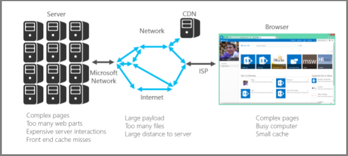

# Inleiding tot prestatieafstemming voor SharePoint OnlineIntroduction to performance tuning for SharePoint Online

In dit artikel wordt uitgelegd welke specifieke aspecten u moet overwegen bij het ontwerpen van pagina's voor de beste prestaties in SharePoint Online.This article explains what specific aspects you need to consider when designing pages for best performance in SharePoint Online.
     
## SharePoint OnlinegegevensSharePoint Online metrics

De volgende algemene statistieken voor SharePoint Online bieden gegevens over prestaties in de echte wereld:The following broad metrics for SharePoint Online provide real world data about performance:
  
- Hoe snel pagina's worden geladenHow fast pages load
    
- Hoeveel retourreizen per pagina zijn vereistHow many round trips required per page
    
- Problemen met de serviceIssues with the service
    
- Andere dingen die prestatiedegradatie veroorzakenOther things that cause performance degradation
    
### Conclusies die zijn bereikt vanwege de gegevensConclusions reached because of the data

De gegevens vertellen ons:The data tells us:
  
- De meeste pagina's presteren goed op SharePoint Online.Most of the pages perform well on SharePoint Online.
    
- Niet-aangepaste pagina's worden zeer snel geladen.Non-customized pages load very quickly.
    
- OneDrive voor Bedrijven, teamsites en systeempagina's, zoals _layouts, zijn allemaal snel te laden.OneDrive for Business, team sites and system pages, such as _layouts, etc., are all quick to load.
    
- De traagste 1% van SharePoint onlinepagina's duurt meer dan 5.000 milliseconden om te laden.The slowest 1% of SharePoint Online pages take more than 5,000 milliseconds to load.
    
Een eenvoudige benchmarktest die u kunt gebruiken, is het meten van de prestaties door de laadtijd van uw eigen portal te vergelijken met de laadtijd van de startpagina van OneDrive voor Bedrijven omdat er weinig aangepaste functies worden gebruikt.One simple benchmark test you can use would be to measure performance by comparing the load time of your own portal against the load time of the OneDrive for Business home page as it uses few customized features. Dit is vaak de eerste stap Die ondersteuning vraagt u om in te vullen bij het oplossen van problemen met netwerkprestaties.This will often be the first step Support will ask you to complete when troubleshooting network performance issues.
  
## Een standaardgebruikersaccount gebruiken bij het controleren van de prestatiesUse a standard user account when checking performance

Een beheerder van de siteverzameling, site-eigenaar, editor of inzender behoren tot extra beveiligingsgroepen, hebben extra machtigingen en hebben daarom extra elementen die SharePoint op een pagina worden geladen.A Site Collection Administrator, Site Owner, Editor, or Contributor belong to additional security groups, have additional permissions, and therefore have additional elements that SharePoint loads on a page.
  
Dit is van toepassing op SharePoint on-premises en SharePoint Online, maar in een on-premises scenario worden de verschillen niet zo gemakkelijk opgemerkt als in SharePoint Online.This is applicable to SharePoint on-premises and SharePoint Online but in an on-premises scenario the differences will not be as easily noticed as in SharePoint Online.
  
Als u de prestaties van een pagina voor gebruikers correct wilt evalueren, moet u een standaardgebruikersaccount gebruiken om te voorkomen dat de ontwerpbesturingselementen en extra verkeer met betrekking tot beveiligingsgroepen worden geladen.In order to correctly evaluate how a page will perform for users, you should use a standard user account to avoid loading the authoring controls and additional traffic related to security groups.
  
## Verbindingscategorieën voor prestatieafstemmingConnection categories for performance tuning

U kunt de verbindingen tussen de server en de gebruiker categoriseren in drie hoofdonderdelen.You can categorize the connections between the server and the user into three main components. Houd hier rekening mee bij het ontwerpen SharePoint onlinepagina's voor inzicht in laadtijden.Consider these when designing SharePoint Online pages for insight into load times.
  
- **Server** De servers die microsoft host in datacenters.**Server** The servers that Microsoft hosts in datacenters.
    
- **Netwerk** Het Microsoft-netwerk, internet en uw on-premises netwerk tussen het datacenter en uw gebruikers.**Network** The Microsoft network, the Internet, and your on-premises network between the datacenter and your users.
    
- **Browser** Waar de pagina is geladen.**Browser** Where the page is loaded.
    
Binnen deze drie verbindingen zijn er meestal vijf redenen die 95% van de trage pagina's veroorzaken.Within these three connections there are typically five reasons that cause 95% of slow pages. Elk van deze redenen wordt besproken in dit artikel:Each of these reasons is discussed in this article:
  
- NavigatieproblemenNavigation issues
    
- Inhouds roll-upContent roll up
    
- Grote bestandenLarge files
    
- Veel aanvragen voor de serverMany requests to the server
    
- WebonderdeelverwerkingWeb Part processing
    
### SerververbindingServer connection

Veel van de problemen die van invloed zijn op de prestaties SharePoint on-premises, zijn ook van toepassing op SharePoint Online.Many of the issues that affect performance with SharePoint on-premises also apply to SharePoint Online.
  
Zoals u zou verwachten, hebt u veel meer controle over hoe servers presteren met on-premises SharePoint.As you would expect, you have far more control over how servers perform with on-premises SharePoint. Met SharePoint Online zijn dingen iets anders.With SharePoint Online things are a little different. Hoe meer werk een server moet doen, hoe langer het duurt om een pagina weer te geven.The more work you make a server do, the longer it takes to render a page. Met SharePoint zijn complexe pagina's met meerdere webonderdelen de grootste boosdoener in dit opzicht.With SharePoint, the biggest culprit in this respect are complex pages with multiple web parts.
  
SharePoint Server on-premisesSharePoint Server on-premises
  

  
SharePoint OnlineSharePoint Online
  

  
Met SharePoint Online kunnen bepaalde paginaaanvragen uiteindelijk meerdere servers bellen.With SharePoint Online, certain page requests may actually end up calling multiple servers. U kunt eindigen met een matrix met aanvragen tussen servers voor een afzonderlijke aanvraag.You could end up with a matrix of requests between servers for an individual request. Deze interacties zijn duur vanuit het laadperspectief van een pagina en zorgen ervoor dat de dingen traag worden.These interactions are expensive from a page load perspective and will make things slow.
  
Voorbeelden van deze server- en serverinteracties zijn:Examples of these server to server interactions are:
  
- Web to SQL ServersWeb to SQL Servers
    
- Web-to-application serversWeb to application servers
    
Het andere wat serverinteracties kan vertragen, is cache-missers.The other thing that can slow down server interactions is cache misses. In tegenstelling tot on-premises SharePoint, is de kans zeer klein dat u dezelfde server gebruikt voor een pagina die u eerder hebt bezocht. Dit maakt object caching verouderd.Unlike on-premises SharePoint, there is a very slim chance that you will hit the same server for a page that you have visited previously; this makes object caching obsolete.
  
### NetwerkverbindingNetwork connection

Met on-premises SharePoint die geen gebruik maken van een WAN, kunt u een snelle verbinding tussen datacenter en eindgebruikers gebruiken.With on-premises SharePoint that doesn't make use of a WAN, you may use a high-speed connection between datacenter and end-users. Over het algemeen zijn de zaken eenvoudig te beheren vanuit een netwerkperspectief.Generally, things are easy to manage from a network perspective.
  
Met SharePoint Online zijn er nog een paar factoren waar u rekening mee moet houden. bijvoorbeeld:With SharePoint Online, there are a few more factors to consider; for example:
  
- Het Microsoft-netwerkThe Microsoft network
    
- The InternetThe Internet
    
- De ispThe ISP
    
Ongeacht welke versie van SharePoint (en welk netwerk) u gebruikt, zijn de volgende zaken waardoor het netwerk meestal bezet is:Regardless of which version of SharePoint (and which network) you are using, things that will typically cause the network to be busy include:
  
- Grote laadvermogenLarge payload
    
- Veel bestandenMany files
    
- Grote fysieke afstand tot de serverLarge physical distance to the server
    
Een functie die u kunt gebruiken in SharePoint Online is de Microsoft-CDN (Content Delivery Network).One feature that you can leverage in SharePoint Online is the Microsoft CDN (Content Delivery Network). Een CDN is in feite een gedistribueerde verzameling servers die is geïmplementeerd in meerdere datacenters.A CDN is basically a distributed collection of servers deployed across multiple datacenters. Met een CDN kunnen inhoud op pagina's worden gehost op een server dicht bij de client, zelfs als de client ver weg is van de oorspronkelijke SharePoint Server.With a CDN, content on pages can be hosted on a server close to the client even if the client is far away from the originating SharePoint Server. Microsoft gebruikt dit in de toekomst meer om lokale exemplaren op te slaan van pagina's die niet kunnen worden aangepast, bijvoorbeeld de startpagina SharePoint onlinebeheerder.Microsoft will be using this more in the future to store local instances of pages which cannot be customized, for example the SharePoint Online admin home page. Zie Inhoudsleveringsnetwerken voor meer informatie over [CDN's.](content-delivery-networks.md)For more information about CDNs, see [Content delivery networks](content-delivery-networks.md).
  
Iets waar u rekening mee moet houden, maar waar u mogelijk niet veel aan kunt doen, is de verbindingssnelheid van uw internetprovider.Something that you need to be aware of but may not be able to do much about is the connection speed of your ISP. Met een eenvoudig snelheidstestprogramma ziet u de verbindingssnelheid.A simple speed test tool will tell you the connection speed.
  
### BrowserverbindingBrowser connection

Er zijn een paar factoren waar u rekening mee moet houden met webbrowsers vanuit prestatieperspectief.There are a few factors to consider with web browsers from a performance perspective.
  
Het bezoeken van complexe pagina's is van invloed op de prestaties.Visiting complex pages will affect performance. De meeste browsers hebben slechts een kleine cache (ongeveer 90 MB), terwijl de gemiddelde webpagina meestal rond de 1,6 MB ligt.Most browsers only have a small cache (around 90MB), while the average web page is typically around 1.6MB. Dit duurt niet lang om te wennen.This doesn't take long to get used up.
  
Bandbreedte kan ook een probleem zijn.Bandwidth may also be an issue. Als een gebruiker bijvoorbeeld video's bekijkt in een andere sessie, is dit van invloed op de prestaties van uw SharePoint pagina.For example, if a user is watching videos in another session, this will affect the performance of your SharePoint page. Hoewel u niet kunt voorkomen dat gebruikers media streamen, kunt u bepalen hoe een pagina wordt geladen voor gebruikers.While you can't prevent users from streaming media, you can control the way a page will load for users.
  
Bekijk de volgende artikelen voor verschillende SharePoint online paginaaanpassingstechnieken en andere best practices om u te helpen optimale prestaties te bereiken.Check out the following articles for different SharePoint Online page customization techniques and other best practices to help you achieve optimal performance.
  
- [Navigatieopties voor SharePoint OnlineNavigation options for SharePoint Online](navigation-options-for-sharepoint-online.md)
    
- [Het hulpprogramma Paginadiagnose gebruiken voor SharePoint OnlineUse the Page Diagnostics tool for SharePoint Online](page-diagnostics-for-spo.md)
    
- [Afbeeldingsoptimalisatie voor SharePoint OnlineImage optimization for SharePoint Online](image-optimization-for-sharepoint-online.md)
    
- [Vertraging bij het laden van afbeeldingen en JavaScript in SharePoint OnlineDelay loading images and JavaScript in SharePoint Online](delay-loading-images-and-javascript-in-sharepoint-online.md)
    
- [Minificatie en bundeling in SharePoint OnlineMinification and bundling in SharePoint Online](minification-and-bundling-in-sharepoint-online.md)
    
- [De Office 365 Content Delivery Network (CDN) gebruiken met SharePoint OnlineUse the Office 365 Content Delivery Network (CDN) with SharePoint Online](use-microsoft-365-cdn-with-spo.md)
    
- [Webonderdeel Inhoud zoeken gebruiken in plaats van webonderdeel Inhoudsquery om de prestaties in SharePoint OnlineUsing Content Search Web Part instead of Content Query Web Part to improve performance in SharePoint Online](using-content-search-web-part-instead-of-content-query-web-part-to-improve-perfo.md)
    
- [Capaciteitsplanning en belastingtest van SharePoint OnlineCapacity planning and load testing SharePoint Online](capacity-planning-and-load-testing-sharepoint-online.md)
    
- [Prestatieproblemen diagnosticeren met SharePoint OnlineDiagnosing performance issues with SharePoint Online](diagnosing-performance-issues-with-sharepoint-online.md)
    
- [De objectcache gebruiken met SharePoint OnlineUsing the object cache with SharePoint Online](using-the-object-cache-with-sharepoint-online.md)
    
- [How to: Voorkomen dat u wordt beperkt of geblokkeerd in SharePoint OnlineHow to: Avoid getting throttled or blocked in SharePoint Online](/sharepoint/dev/general-development/how-to-avoid-getting-throttled-or-blocked-in-sharepoint-online)
