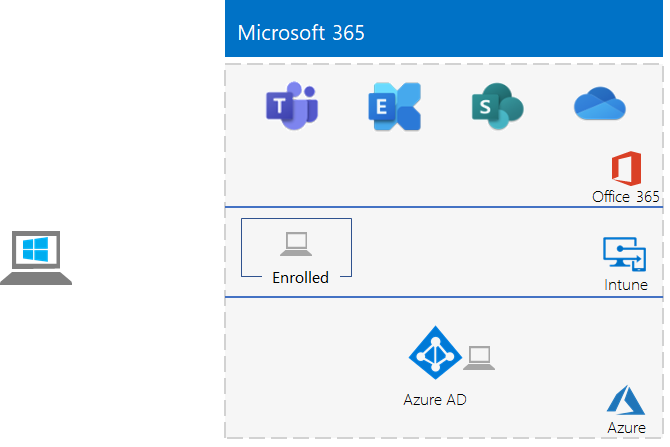

# <a name="the-lightweight-base-configuration"></a>De lichtgewicht basisconfiguratie

*U kunt deze test lab-handleiding gebruiken voor zowel Microsoft 365 voor Enterprise als Office 365 Enterprise test omgevingen.*

In dit artikel vindt u stapsgewijze instructies voor het maken van een vereenvoudigde omgeving met een Microsoft 365 E5-abonnement en een computer die loopt op Windows 10 Enterprise. 



U kunt de functies en functionaliteit van [Microsoft 365 for Enterprise](https://www.microsoft.com/microsoft-365/enterprise)testen met behulp van de geresulteerde omgeving.


  
> [!TIP]
> Klik op [Microsoft 365 voor Enterprise test lab-handleiding](../media/m365-enterprise-test-lab-guides/Microsoft365EnterpriseTLGStack.pdf) voor een visuele kaart voor alle artikelen in de stack met microsoft 365 voor Enterprise test lab Guide.

## <a name="phase-1-create-your-microsoft-365-e5-subscription"></a>Fase 1: uw abonnement op Microsoft 365 E5 maken

We beginnen met een proefabonnement voor Microsoft 365 E5 en vervolgens het Microsoft 365 E5-abonnement hieraan toevoegen.

Als u uw Microsoft 365 E5-proefabonnement wilt starten, hebt u eerst een fictieve bedrijfsnaam en een nieuw Microsoft-account nodig.
  
1. Het is raadzaam dat u een variant op de bedrijfsnaam Contoso gebruikt voor uw bedrijfsnaam. Dit is een fictief bedrijf dat wordt gebruikt in de voorbeeldinhoud van Microsoft, maar dit is niet vereist. Noteer hier uw fictieve bedrijfsnaam: 
    
2. Als u zich wilt registreren voor een nieuw Microsoft-account, gaat u naar [https://outlook.com](https://outlook.com) en maakt u een account aan met een nieuw e-mailaccount en adres. U gebruikt dit account om u aan te melden bij Office 365.
    
  - Noteer hier de voor- en achternaam van uw nieuwe account: 
    
  - Noteer hier het adres van het nieuwe e-mailaccount: @outlook.com
    
### <a name="sign-up-for-an-office-365-e5-trial-subscription"></a>Registreer u voor een proefabonnement op Office 365 E5

1. Open de internetbrowser op uw computer en ga naar [https://aka.ms/e5trial](https://aka.ms/e5trial).
    
2. Op de **Bedankt dat u Office 365 E5 hebt gekozen**-pagina, geeft u het nieuwe e-mailaccount adres op uit stap 1.
3. In stap 2 van het proces van het proefabonnement typt u de gevraagde informatie en voert u de verificatie uit.
4. In stap 3 typt u de naam van de organisatie en vervolgens de naam van het account dat de globale beheerder voor het abonnement wordt. 
5. In stap 4, leg hier de aanmeldingspagina vast (selecteren en kopiëren):  
6. Noteer hier de gebruikers-ID: . onmicrosoft.com  
   Noteer het wachtwoord dat u hebt getypt op een veilige locatie.
   Deze waarde wordt beschouwd als de **naam van de globale beheerder**.
8. Klik op **Ga naar Setup**.
9. In Office 365 E5 Setup klikt u op **Blijven gebruiken *uw organisatie*. onmicrosoft.com voor e-mail en bij het aanmelden **, en klik vervolgens op **Afsluiten en later doorgaan**.

Nu ziet u het Microsoft 365-beheercentrum.
  
U hebt een proefabonnement van Office 365 gemaakt, zodat uw testomgeving een afzonderlijke Azure Active Directory-tenant heeft van alle betaalde abonnementen. Met deze splitsing kunt u gebruikers en groepen toevoegen en verwijderen uit de test-tenant, zonder dat dit invloed heeft op uw productie-abonnementen.
    
## <a name="phase-2-configure-your-office-365-trial-subscription"></a>Fase 2: uw proefabonnement voor Office 365 configureren

In deze fase configureert u uw abonnement met aanvullende gebruikers en wijst u Office 365 E5-licenties aan ze toe.
  
Volg de instructies in [verbinding maken met Microsoft 365 met PowerShell](connect-to-microsoft-365-powershell.md#connect-with-the-azure-active-directory-powershell-for-graph-module) om verbinding te maken met uw abonnement met de Azure Active Directory PowerShell voor Graph module van uw computer.
    
Typ in het dialoogvenster **Referentieaanvraag voor Windows PowerShell** de gebruikersnaam en het wachtwoord voor het account van de globale beheerder (bijvoorbeeld: jan@contosotoycompany.onmicrosoft.com).
  
Vul de naam van uw organisatie (bijvoorbeeld: contosotoycompany), de landcode van twee tekens voor uw locatie, een algemeen wachtwoord voor het account in en voer de volgende opdrachten uit vanaf de PowerShell-prompt:

```powershell
$orgName="<organization name>"
$loc="<two-character country code, such as US>"
$commonPW="<common user account password>"
$PasswordProfile=New-Object -TypeName Microsoft.Open.AzureAD.Model.PasswordProfile
$PasswordProfile.Password=$commonPW

$userUPN= "user2@" + $orgName + ".onmicrosoft.com"
New-AzureADUser -DisplayName "User 2" -GivenName User -SurName 2 -UserPrincipalName $userUPN -UsageLocation $loc -AccountEnabled $true -PasswordProfile $PasswordProfile -MailNickName "user2"
$License = New-Object -TypeName Microsoft.Open.AzureAD.Model.AssignedLicense
$License.SkuId = (Get-AzureADSubscribedSku | Where-Object -Property SkuPartNumber -Value "ENTERPRISEPREMIUM" -EQ).SkuID
$LicensesToAssign = New-Object -TypeName Microsoft.Open.AzureAD.Model.AssignedLicenses
$LicensesToAssign.AddLicenses = $License
Set-AzureADUserLicense -ObjectId $userUPN -AssignedLicenses $LicensesToAssign

$userUPN= "user3@" + $orgName + ".onmicrosoft.com"
New-AzureADUser -DisplayName "User 3" -GivenName User -SurName 3 -UserPrincipalName $userUPN -UsageLocation $loc -AccountEnabled $true -PasswordProfile $PasswordProfile -MailNickName "user3"
$License = New-Object -TypeName Microsoft.Open.AzureAD.Model.AssignedLicense
$License.SkuId = (Get-AzureADSubscribedSku | Where-Object -Property SkuPartNumber -Value "ENTERPRISEPREMIUM" -EQ).SkuID
$LicensesToAssign = New-Object -TypeName Microsoft.Open.AzureAD.Model.AssignedLicenses
$LicensesToAssign.AddLicenses = $License
Set-AzureADUserLicense -ObjectId $userUPN -AssignedLicenses $LicensesToAssign

$userUPN= "user4@" + $orgName + ".onmicrosoft.com"
New-AzureADUser -DisplayName "User 4" -GivenName User -SurName 4 -UserPrincipalName $userUPN -UsageLocation $loc -AccountEnabled $true -PasswordProfile $PasswordProfile -MailNickName "user4"
$License = New-Object -TypeName Microsoft.Open.AzureAD.Model.AssignedLicense
$License.SkuId = (Get-AzureADSubscribedSku | Where-Object -Property SkuPartNumber -Value "ENTERPRISEPREMIUM" -EQ).SkuID
$LicensesToAssign = New-Object -TypeName Microsoft.Open.AzureAD.Model.AssignedLicenses
$LicensesToAssign.AddLicenses = $License
Set-AzureADUserLicense -ObjectId $userUPN -AssignedLicenses $LicensesToAssign
```
> [!NOTE]
> U gebruikt hier een algemeen wachtwoord voor automatisering en configuratiegemak in een testomgeving. Uiteraard wordt dit sterk afgeraden voor productieabonnementen. 

### <a name="record-key-information-for-future-reference"></a>Noteer belangrijke informatie voor toekomstig gebruik

Mogelijk wilt u dit artikel afdrukken voor het vastleggen van de specifieke informatie die u nodig hebt voor deze omgeving gedurende de 30 dagen van het proefabonnement voor Office 365. U kunt het proefabonnement eenvoudig verlengen met nog eens 30 dagen. Voor een permanente testomgeving kunt u een nieuw betaald abonnement maken met een afzonderlijke Azure Active Directory-tenant en een klein aantal licenties.

Noteer de volgende waarden:
  
- naam van de globale beheerder: .onmicrosoft.com (uit stap 6 van fase 1)
    
    Noteer ook het wachtwoord voor dit account op een veilige locatie.
    
- De naam van de organisatie voor uw proefabonnement:  (uit stap 4 van fase 1)
    
- Voer de volgende opdracht uit vanuit de Windows Azure Active Directory-module voor Windows PowerShell-prompt om de accounts weer te geven voor gebruiker 2, gebruiker 3, gebruiker 4 en gebruiker 5:
    
  ```powershell
  Get-AzureADUser | Sort UserPrincipalName | Select UserPrincipalName
  ```

    Noteer hier de accountnamen:
    
  - Naam van gebruiker 2-account: gebruiker2@.onmicrosoft.com
    
  - Naam van gebruiker 3-account: gebruiker3@.onmicrosoft.com
    
  - Naam van gebruiker 4-account: gebruiker4@.onmicrosoft.com
    
  - Naam van gebruiker 5-account: gebruiker5@.onmicrosoft.com
    
    Noteer ook het algemene wachtwoord voor dit account op een veilige locatie.
   

### <a name="using-an-office-365-test-environment"></a>Een Office 365 E5-testomgeving gebruiken

Als u alleen een Office 365-testomgeving nodig hebt, kunt u hier stoppen. 

Zie [Microsoft 365 voor Enterprise test lab-handleidingen](m365-enterprise-test-lab-guides.md) voor extra test lab-handleidingen die van toepassing zijn op Office 365 en microsoft 365.
  
## <a name="phase-3-add-a-microsoft-365-e5-trial-subscription"></a>Fase 3: een Microsoft 365 E5-proefabonnement toevoegen

In deze fase meld u zich aan voor het Microsoft 365 E5-proefabonnement en voegt het toe aan dezelfde organisatie als uw Office 365 E5-proefabonnement.
  
Voeg eerst het Microsoft 365 E5-proefabonnement toe en wijs de nieuwe Microsoft 365-licentie toe aan uw globale-beheerdersaccount.
  
1. Meld u aan met een privé-exemplaar van een internetbrowser bij het Microsoft 365-beheercentrum op [https://admin.microsoft.com](https://admin.microsoft.com) met de referenties van uw globale beheerdersaccount.
    
2. Klik op de pagina van het **Microsoft 365-beheercentrum** in de linkernavigatiebalk op **Facturering > Service aanschaffen**.
    
3. Klik op de pagina **Services aanschaffen** op **Microsoft 365 E5**en klik vervolgens op **Gratis proefabonnement**.

4. Kies op de pagina **Microsoft 365 E5-proefabonnement** de optie om een tekst of een oproep te ontvangen, voer uw telefoonnummer in en klik op **SMS me** of **Bel me**. Voer de verificatie uit.

5. Kies op de pagina **Uw bestelling bevestigen** de optie **Nu proberen**.

6. Klik op de pagina **Ontvangst bestelling** op **Doorgaan**.

7. In het Microsoft 365-beheercentrum selecteert u **Gebruikers > Actieve gebruikers**.

8. Klik in **Actieve gebruikers**op uw beheerdersaccount.

9. Klik op **Licenties en apps**.

10. Schakel de licentie voor Office 365 Enterprise E5 uit en activeer de licentie voor Microsoft 365 E5.

11. Klik op **Wijzigingen opslaan** en sluit vervolgens het gegevensvenster van het gebruikersaccount.

Herhaal vervolgens stap 8 tot en met 11 van de vorige procedure voor al uw andere accounts (gebruiker 2, gebruiker 3, gebruiker 4 en gebruiker 5).
  
> [!NOTE]
> Een Microsoft 365 E5-proefabonnement duurt 30 dagen. Voor een permanente testomgeving kunt u het omzetten naar een betaald abonnement met een klein aantal licenties. 
  
Uw testomgeving heeft nu:
  
- Een Microsoft 365 E5-proefabonnement.
- Al uw toepasselijke gebruikersaccounts (alleen de globale beheerder of alle vijf gebruikersaccounts) zijn geschikt voor het gebruik van Microsoft 365 E5.
    
Dit is de daaruit voortvloeiende configuratie, waarmee u Microsoft 365 E5 toevoegt.
  

  
## <a name="phase-4-create-a-windows-10-enterprise-computer"></a>Fase 4: een Windows 10 Enterprise-computer maken

In deze fase maakt u een zelfstandige computer met Windows 10 Enterprise als een fysieke computer, een virtuele machine of een virtuele machine van Azure.
  
### <a name="physical-computer"></a>Fysieke computer

U kunt een pc aanschaffen en Windows 10 Enterprise erop installeren. U kunt de proefversie voor Windows 10 Enterprise [hier](https://www.microsoft.com/evalcenter/evaluate-windows-10-enterprise)downloaden.
  
### <a name="virtual-machine"></a>Virtuele machine

U kunt een virtuele machine maken met de hypervisor van uw keuze en Windows 10 Enterprise erop installeren. U kunt de proefversie voor Windows 10 Enterprise [hier](https://www.microsoft.com/evalcenter/evaluate-windows-10-enterprise)downloaden.
  
### <a name="virtual-machine-in-azure"></a>Virtuele machine in Azure

Als u een virtuele Windows 10-machine in Microsoft Azure wilt maken, ***heeft u een abonnement nodig dat is gebaseerd op Visual Studio***, dat toegang biedt tot de afbeelding voor Windows 10 Enterprise. Andere typen Azure-abonnementen, zoals proefabonnementen en betaalde abonnementen, hebben geen toegang tot deze afbeelding. Zie [Windows-client in Azure gebruiken voor dev/test-scenario's](https://docs.microsoft.com/azure/virtual-machines/windows/client-images)voor de meest recente informatie.
  
> [!NOTE]
> De volgende opdrachtsets gebruiken de nieuwste versie van Azure PowerShell. Zie [Aan de slag met Azure PowerShell-cmdlets](https://docs.microsoft.com/powershell/azureps-cmdlets-docs/). Met deze opdracht bouwt u een virtuele machine voor Windows 10 Enterprise genaamd WIN10 en alle benodigde infrastructuur, inclusief een resourcegroep, een opslagaccount en een virtueel netwerk. Als u al bekend bent met Azure-infrastructuurservices, kunt u deze instructies aanpassen aan uw huidige geïmplementeerde infrastructuur. 
  
Start eerst een Microsoft PowerShell-prompt.
  
Meld u aan bij uw Azure-account met de volgende opdracht.
  
```powershell
Connect-AzAccount
```

Haal de naam van uw abonnement op met de volgende opdracht.
  
```powershell
Get-AzSubscription | Sort Name | Select Name
```

Stel uw Azure-abonnement in. Vervang alles binnen de aanhalingstekens, inclusief de \< and >-tekens, met de juiste naam.
  
```powershell
$subscr="<subscription name>"
Get-AzSubscription -SubscriptionName $subscr | Select-AzSubscription
```

Vervolgens maakt u een nieuwe resourcegroep aan. Als u de naam van een unieke resourcegroep wilt bepalen, gebruikt u deze opdracht om uw bestaande resourcegroepen weer te geven.
  
```powershell
Get-AzResourceGroup | Sort ResourceGroupName | Select ResourceGroupName
```

Maak uw nieuwe resourcegroep aan met deze opdrachten. Vervang alles binnen de aanhalingstekens, inclusief de \< and >-tekens, met de juiste namen.
  
```powershell
$rgName="<resource group name>"
$locName="<location name, such as West US>"
New-AzResourceGroup -Name $rgName -Location $locName
```

Vervolgens maakt u een nieuw virtueel netwerk en de virtuele machine WIN10 met deze opdrachten. Geef desgevraagd de naam en het wachtwoord op van het lokale beheerdersaccount voor WIN10 en bewaar deze op een veilige locatie.
  
```powershell
$corpnetSubnet=New-AzVirtualNetworkSubnetConfig -Name Corpnet -AddressPrefix 10.0.0.0/24
New-AzVirtualNetwork -Name "M365Ent-TestLab" -ResourceGroupName $rgName -Location $locName -AddressPrefix 10.0.0.0/8 -Subnet $corpnetSubnet
$rule1=New-AzNetworkSecurityRuleConfig -Name "RDPTraffic" -Description "Allow RDP to all VMs on the subnet" -Access Allow -Protocol Tcp -Direction Inbound -Priority 100 -SourceAddressPrefix Internet -SourcePortRange * -DestinationAddressPrefix * -DestinationPortRange 3389
New-AzNetworkSecurityGroup -Name Corpnet -ResourceGroupName $rgName -Location $locName -SecurityRules $rule1
$vnet=Get-AzVirtualNetwork -ResourceGroupName $rgName -Name "M365Ent-TestLab"
$nsg=Get-AzNetworkSecurityGroup -Name Corpnet -ResourceGroupName $rgName
Set-AzVirtualNetworkSubnetConfig -VirtualNetwork $vnet -Name Corpnet -AddressPrefix "10.0.0.0/24" -NetworkSecurityGroup $nsg
$vnet | Set-AzVirtualNetwork
$pip=New-AzPublicIpAddress -Name WIN10-PIP -ResourceGroupName $rgName -Location $locName -AllocationMethod Dynamic
$nic=New-AzNetworkInterface -Name WIN10-NIC -ResourceGroupName $rgName -Location $locName -SubnetId $vnet.Subnets[0].Id -PublicIpAddressId $pip.Id
$vm=New-AzVMConfig -VMName WIN10 -VMSize Standard_A2_V2
$cred=Get-Credential -Message "Type the name and password of the local administrator account for WIN10."
$vm=Set-AzVMOperatingSystem -VM $vm -Windows -ComputerName WIN10 -Credential $cred -ProvisionVMAgent -EnableAutoUpdate
$vm=Set-AzVMSourceImage -VM $vm -PublisherName MicrosoftWindowsDesktop -Offer Windows-10 -Skus RS3-Pro -Version "latest"
$vm=Add-AzVMNetworkInterface -VM $vm -Id $nic.Id
$vm=Set-AzVMOSDisk -VM $vm -Name WIN10-TestLab-OSDisk -DiskSizeInGB 128 -CreateOption FromImage
New-AzVM -ResourceGroupName $rgName -Location $locName -VM $vm
```

## <a name="phase-5-join-your-windows-10-computer-to-azure-ad"></a>Fase 5: uw Windows 10-computer verbinden met Azure Active Directory

Zodra de fysieke of virtuele computer met Windows 10 Enterprise is gemaakt, meldt u zich aan met een lokaal beheerdersaccount.
  
> [!NOTE]
> Als u een virtuele machine in Azure gebruikt, kunt u er verbinding mee maken met behulp van [deze instructies](https://docs.microsoft.com/azure/virtual-machines/windows/connect-logon).
  
Vervolgens verbindt u de WIN10-computer met de Azure Active Directory-tenant van uw Microsoft 365 E5-abonnement.
  
1. Klik op het bureaublad van de WIN10-computer op **Start > Instellingen > Accounts > Toegang tot werk of school > Verbinding maken**.
    
2. Klik in het dialoogvenster **Een werk- of schoolaccount instellen**, **Dit apparaat verbinden met Azure Active Directory**.
    
3. In **Werk- of schoolaccount**, typt u de naam van het globale beheerdersaccount van uw Microsoft 365 E5-abonnement en klikt u vervolgens op **Volgende**.
    
4. Bij **Wachtwoord invoeren** typt u het wachtwoord van uw globale beheerdersaccount en klikt u vervolgens op **Aanmelden**.
    
5. Wanneer u wordt gevraagd of dit uw organisatie is, klikt u op **Deelnemen** en klikt u vervolgens op **Gereed**.
    
6. Sluit het Instellingenvenster.
    
Installeer vervolgens Microsoft 365-apps voor ondernemingen op de WIN10-computer.
  
1. Open de Microsoft Edge-browser en meld u aan bij het [Microsoft 365-Beheercentrum](https://admin.microsoft.com) met de referenties van uw globale beheerdersaccount.
    
2. Klik op het tabblad **Microsoft Office Home** op **Office installeren**.
    
3. Wanneer u wordt gevraagd om dit te doen, klikt u op **Uitvoeren**en klikt u vervolgens op **Ja** voor **Gebruikersaccountbeheer**.
    
4. Wacht totdat de installatie van Office is voltooid. Wanneer u **U bent klaar** ziet, klikt u twee keer op **Afsluiten**.
    
Dit is de resulterende omgeving.


Dit geldt ook voor de WIN10-computer die:

- Verbonden is met de Azure Active Directory-tenant van uw Microsoft 365 E5-abonnement.
- Geregistreerd is als een Azure Active Directory-apparaat in Microsoft Intune (EMS).
- Beschikt over Microsoft 365-apps voor ondernemingen.
  
U bent nu klaar om te experimenteren met de extra functies van [Microsoft 365 for Enterprise](https://www.microsoft.com/microsoft-365/enterprise).
  
## <a name="next-steps"></a>Volgende stappen

Verken de volgende extra sets testlabrichtlijnen:
  
- [Identiteit](m365-enterprise-test-lab-guides.md#identity)
- [Mobile Device Management](m365-enterprise-test-lab-guides.md#mobile-device-management)
- [Gegevensbeveiliging](m365-enterprise-test-lab-guides.md#information-protection)
   

## <a name="see-also"></a>Zie ook

[Microsoft 365 Enterprise-testlabrichtlijnen](m365-enterprise-test-lab-guides.md)

[Overzicht van Microsoft 365 voor ondernemingen](microsoft-365-overview.md)

[Documentatie voor Microsoft 365 for Enterprise](https://docs.microsoft.com/microsoft-365-enterprise/)
