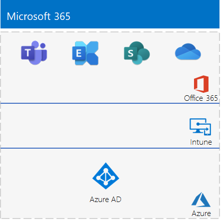

# <a name="the-lightweight-base-configuration"></a><span data-ttu-id="f724b-103">De lichtgewicht basisconfiguratie</span><span class="sxs-lookup"><span data-stu-id="f724b-103">The lightweight base configuration</span></span>

<span data-ttu-id="f724b-104">*Deze testlabrichtlijnen kunnen worden gebruikt voor zowel Microsoft 365 Enterprise- als Office 365 Enterprise-testomgevingen.*</span><span class="sxs-lookup"><span data-stu-id="f724b-104">*This Test Lab Guide can be used for both Microsoft 365 Enterprise and Office 365 Enterprise test environments.*</span></span>

<span data-ttu-id="f724b-105">In dit artikel vindt u stapsgewijze instructies voor het maken van een vereenvoudigde omgeving met een Microsoft 365 E5-abonnement en een computer die loopt op Windows 10 Enterprise.</span><span class="sxs-lookup"><span data-stu-id="f724b-105">This article provides you with step-by-step instructions to create a simplified environment with a Microsoft 365 E5 subscription and a computer running Windows 10 Enterprise.</span></span> 


<span data-ttu-id="f724b-107">U kunt de resulterende omgeving gebruiken om de functies en functionaliteit van [Microsoft 365 Enterprise](https://www.microsoft.com/microsoft-365/enterprise) te testen.</span><span class="sxs-lookup"><span data-stu-id="f724b-107">Use the resulting environment to test the features and functionality of [Microsoft 365 Enterprise](https://www.microsoft.com/microsoft-365/enterprise).</span></span>


  
> [!TIP]
> <span data-ttu-id="f724b-109">Klik [hier](../media/m365-enterprise-test-lab-guides/Microsoft365EnterpriseTLGStack.pdf) voor een visuele kaart met alle artikelen in de stack met Microsoft 365 Enterprise-testlabrichtlijnen.</span><span class="sxs-lookup"><span data-stu-id="f724b-109">Click [here](../media/m365-enterprise-test-lab-guides/Microsoft365EnterpriseTLGStack.pdf) for a visual map to all the articles in the Microsoft 365 Enterprise Test Lab Guide stack.</span></span>

## <a name="phase-1-create-your-office-365-e5-subscription"></a><span data-ttu-id="f724b-110">Fase 1: Maak uw Office 365 E5-abonnement</span><span class="sxs-lookup"><span data-stu-id="f724b-110">Phase 1: Create your Office 365 E5 subscription</span></span>

<span data-ttu-id="f724b-111">We beginnen met een proefabonnement op Office 365 E5 en voegen vervolgens het Microsoft 365 E5-abonnement toe.</span><span class="sxs-lookup"><span data-stu-id="f724b-111">We start with an Office 365 E5 trial subscription and then add the Microsoft 365 E5 subscription to it.</span></span>

<span data-ttu-id="f724b-112">Als u uw proefabonnement op Office 365 E5 wilt starten, moet u eerst een fictieve bedrijfsnaam en een nieuw Microsoft-account hebben.</span><span class="sxs-lookup"><span data-stu-id="f724b-112">To start your Office 365 E5 trial subscription, you first need a fictitious company name and a new Microsoft account.</span></span>
  
1. <span data-ttu-id="f724b-113">Het is raadzaam dat u een variant op de bedrijfsnaam Contoso gebruikt voor uw bedrijfsnaam. Dit is een fictief bedrijf dat wordt gebruikt in de voorbeeldinhoud van Microsoft, maar dit is niet vereist.</span><span class="sxs-lookup"><span data-stu-id="f724b-113">We recommend that you use a variant of the company name Contoso for your company name, which is a fictitious company used in Microsoft sample content, but it isn't required.</span></span> <span data-ttu-id="f724b-114">Noteer hier uw fictieve bedrijfsnaam:</span><span class="sxs-lookup"><span data-stu-id="f724b-114">Record your fictitious company name here:</span></span> 
    
2. <span data-ttu-id="f724b-116">Als u zich wilt registreren voor een nieuw Microsoft-account, gaat u naar [https://outlook.com](https://outlook.com) en maakt u een account aan met een nieuw e-mailaccount en adres.</span><span class="sxs-lookup"><span data-stu-id="f724b-116">To sign up for a new Microsoft account, go to [https://outlook.com](https://outlook.com) and create an account with a new email account and address.</span></span> <span data-ttu-id="f724b-117">U gebruikt dit account om u aan te melden bij Office 365.</span><span class="sxs-lookup"><span data-stu-id="f724b-117">You will use this account to sign up for Office 365.</span></span>
    
  - <span data-ttu-id="f724b-118">Noteer hier de voor- en achternaam van uw nieuwe account:</span><span class="sxs-lookup"><span data-stu-id="f724b-118">Record the first and last name of your new account here:</span></span> 
    
  - <span data-ttu-id="f724b-120">Noteer hier het adres van het nieuwe e-mailaccount:</span><span class="sxs-lookup"><span data-stu-id="f724b-120">Record the new email account address here:</span></span> <span data-ttu-id="f724b-122">@outlook.com</span><span class="sxs-lookup"><span data-stu-id="f724b-122">@outlook.com</span></span>
    
### <a name="sign-up-for-an-office-365-e5-trial-subscription"></a><span data-ttu-id="f724b-123">Registreer u voor een proefabonnement op Office 365 E5</span><span class="sxs-lookup"><span data-stu-id="f724b-123">Sign up for an Office 365 E5 trial subscription</span></span>

1. <span data-ttu-id="f724b-124">Open de internetbrowser op uw computer en ga naar [https://aka.ms/e5trial](https://aka.ms/e5trial).</span><span class="sxs-lookup"><span data-stu-id="f724b-124">Open the Internet browser on your computer and go to [https://aka.ms/e5trial](https://aka.ms/e5trial).</span></span>
    
2. <span data-ttu-id="f724b-125">Op de **Bedankt dat u Office 365 E5 hebt gekozen**-pagina, geeft u het nieuwe e-mailaccount adres op uit stap 1.</span><span class="sxs-lookup"><span data-stu-id="f724b-125">On the **Thank you for choosing Office 365 E5** page, specify, your new email account address in step 1.</span></span>
3. <span data-ttu-id="f724b-126">In stap 2 van het proces van het proefabonnement typt u de gevraagde informatie en voert u de verificatie uit.</span><span class="sxs-lookup"><span data-stu-id="f724b-126">In step 2 of the trail subscription process, type the requested information, and then perform the verification.</span></span>
4. <span data-ttu-id="f724b-127">In stap 3 typt u de naam van de organisatie en vervolgens de naam van het account dat de globale beheerder voor het abonnement wordt.</span><span class="sxs-lookup"><span data-stu-id="f724b-127">In step 3, type an organization name and then an account name that will be the global admin for the subscription.</span></span> 
5. <span data-ttu-id="f724b-128">In stap 4, leg hier de aanmeldingspagina vast (selecteren en kopiëren):</span><span class="sxs-lookup"><span data-stu-id="f724b-128">For step 4, record the sign-in page here (select and copy):</span></span>  
6. <span data-ttu-id="f724b-130">Noteer hier de gebruikers-ID: . onmicrosoft.com</span><span class="sxs-lookup"><span data-stu-id="f724b-130">Record the user ID here: .onmicrosoft.com</span></span>  
   <span data-ttu-id="f724b-131">Noteer het wachtwoord dat u hebt getypt op een veilige locatie.</span><span class="sxs-lookup"><span data-stu-id="f724b-131">Record the password that you typed in a secure location.</span></span>
   <span data-ttu-id="f724b-132">Deze waarde wordt beschouwd als de **naam van de globale beheerder**.</span><span class="sxs-lookup"><span data-stu-id="f724b-132">This value will be referred to as the **global administrator name**.</span></span>
8. <span data-ttu-id="f724b-133">Klik op **Ga naar Setup**.</span><span class="sxs-lookup"><span data-stu-id="f724b-133">Click **Go to Setup**.</span></span>
9. <span data-ttu-id="f724b-134">In Office 365 E5 Setup klikt u op \*\*Blijven gebruiken *uw organisatie*. onmicrosoft.com voor e-mail en bij het aanmelden \*\*, en klik vervolgens op **Afsluiten en later doorgaan**.</span><span class="sxs-lookup"><span data-stu-id="f724b-134">In Office 365 E5 Setup, click **Continue using *your organization*.onmicrosoft.com for email and signing in**, and then click **Exit and continue later**.</span></span>

<span data-ttu-id="f724b-135">Nu ziet u het Microsoft 365-beheercentrum.</span><span class="sxs-lookup"><span data-stu-id="f724b-135">You should see the Microsoft 365 admin center.</span></span>
  
<span data-ttu-id="f724b-136">U hebt een proefabonnement van Office 365 gemaakt, zodat uw testomgeving een afzonderlijke Azure Active Directory-tenant heeft van alle betaalde abonnementen.</span><span class="sxs-lookup"><span data-stu-id="f724b-136">We have you create a trial subscription of Office 365 so that your test environment has a separate Azure AD tenant from any paid subscriptions you currently have.</span></span> <span data-ttu-id="f724b-137">Met deze splitsing kunt u gebruikers en groepen toevoegen en verwijderen uit de test-tenant, zonder dat dit invloed heeft op uw productie-abonnementen.</span><span class="sxs-lookup"><span data-stu-id="f724b-137">This separation means you can add and remove users and groups in the test tenant without affecting your production subscriptions.</span></span>
    
## <a name="phase-2-configure-your-office-365-trial-subscription"></a><span data-ttu-id="f724b-138">Fase 2: uw proefabonnement voor Office 365 configureren</span><span class="sxs-lookup"><span data-stu-id="f724b-138">Phase 2: Configure your Office 365 trial subscription</span></span>

<span data-ttu-id="f724b-139">In deze fase configureert u uw abonnement met aanvullende gebruikers en wijst u Office 365 E5-licenties aan ze toe.</span><span class="sxs-lookup"><span data-stu-id="f724b-139">In this phase, you configure your subscription with additional users and assign them Office 365 E5 licenses.</span></span>
  
<span data-ttu-id="f724b-140">Gebruik de instructies in [Verbinding maken met Office 365 PowerShell](https://docs.microsoft.com/office365/enterprise/powershell/connect-to-office-365-powershell#connect-with-the-azure-active-directory-powershell-for-graph-module) om verbinding te maken met uw abonnement via de Azure Active Directory PowerShell voor Graph-module op uw computer.</span><span class="sxs-lookup"><span data-stu-id="f724b-140">Use the instructions in [Connect to Office 365 PowerShell](https://docs.microsoft.com/office365/enterprise/powershell/connect-to-office-365-powershell#connect-with-the-azure-active-directory-powershell-for-graph-module) to connect to your subscription with the Azure Active Directory PowerShell for Graph module from your computer.</span></span>
    
<span data-ttu-id="f724b-141">Typ in het dialoogvenster **Referentieaanvraag voor Windows PowerShell** de gebruikersnaam en het wachtwoord voor het account van de globale beheerder (bijvoorbeeld: jan@contosotoycompany.onmicrosoft.com).</span><span class="sxs-lookup"><span data-stu-id="f724b-141">In the **Windows PowerShell Credential Request** dialog box, type the global administrator name (example: jdoe@contosotoycompany.onmicrosoft.com) and password.</span></span>
  
<span data-ttu-id="f724b-142">Vul de naam van uw organisatie (bijvoorbeeld: contosotoycompany), de landcode van twee tekens voor uw locatie, een algemeen wachtwoord voor het account in en voer de volgende opdrachten uit vanaf de PowerShell-prompt:</span><span class="sxs-lookup"><span data-stu-id="f724b-142">Fill in your organization name (example: contosotoycompany), the two-character country code for your location, a common account password, and then run the following commands from the PowerShell prompt:</span></span>

```powershell
$orgName="<organization name>"
$loc="<two-character country code, such as US>"
$commonPW="<common user account password>"
$PasswordProfile=New-Object -TypeName Microsoft.Open.AzureAD.Model.PasswordProfile
$PasswordProfile.Password=$commonPW

$userUPN= "user2@" + $orgName + ".onmicrosoft.com"
New-AzureADUser -DisplayName "User 2" -GivenName User -SurName 2 -UserPrincipalName $userUPN -UsageLocation $loc -AccountEnabled $true -PasswordProfile $PasswordProfile -MailNickName "user2"
$License = New-Object -TypeName Microsoft.Open.AzureAD.Model.AssignedLicense
$License.SkuId = (Get-AzureADSubscribedSku | Where-Object -Property SkuPartNumber -Value "ENTERPRISEPREMIUM" -EQ).SkuID
$LicensesToAssign = New-Object -TypeName Microsoft.Open.AzureAD.Model.AssignedLicenses
$LicensesToAssign.AddLicenses = $License
Set-AzureADUserLicense -ObjectId $userUPN -AssignedLicenses $LicensesToAssign

$userUPN= "user3@" + $orgName + ".onmicrosoft.com"
New-AzureADUser -DisplayName "User 3" -GivenName User -SurName 3 -UserPrincipalName $userUPN -UsageLocation $loc -AccountEnabled $true -PasswordProfile $PasswordProfile -MailNickName "user3"
$License = New-Object -TypeName Microsoft.Open.AzureAD.Model.AssignedLicense
$License.SkuId = (Get-AzureADSubscribedSku | Where-Object -Property SkuPartNumber -Value "ENTERPRISEPREMIUM" -EQ).SkuID
$LicensesToAssign = New-Object -TypeName Microsoft.Open.AzureAD.Model.AssignedLicenses
$LicensesToAssign.AddLicenses = $License
Set-AzureADUserLicense -ObjectId $userUPN -AssignedLicenses $LicensesToAssign

$userUPN= "user4@" + $orgName + ".onmicrosoft.com"
New-AzureADUser -DisplayName "User 4" -GivenName User -SurName 4 -UserPrincipalName $userUPN -UsageLocation $loc -AccountEnabled $true -PasswordProfile $PasswordProfile -MailNickName "user4"
$License = New-Object -TypeName Microsoft.Open.AzureAD.Model.AssignedLicense
$License.SkuId = (Get-AzureADSubscribedSku | Where-Object -Property SkuPartNumber -Value "ENTERPRISEPREMIUM" -EQ).SkuID
$LicensesToAssign = New-Object -TypeName Microsoft.Open.AzureAD.Model.AssignedLicenses
$LicensesToAssign.AddLicenses = $License
Set-AzureADUserLicense -ObjectId $userUPN -AssignedLicenses $LicensesToAssign
```
> [!NOTE]
> <span data-ttu-id="f724b-143">U gebruikt hier een algemeen wachtwoord voor automatisering en configuratiegemak in een testomgeving.</span><span class="sxs-lookup"><span data-stu-id="f724b-143">The use of a common password here is for automation and ease of configuration for a test environment.</span></span> <span data-ttu-id="f724b-144">Uiteraard wordt dit sterk afgeraden voor productieabonnementen.</span><span class="sxs-lookup"><span data-stu-id="f724b-144">Obviously, this is highly discouraged for production subscriptions.</span></span> 

### <a name="record-key-information-for-future-reference"></a><span data-ttu-id="f724b-145">Noteer belangrijke informatie voor toekomstig gebruik</span><span class="sxs-lookup"><span data-stu-id="f724b-145">Record key information for future reference</span></span>

<span data-ttu-id="f724b-146">Mogelijk wilt u dit artikel afdrukken voor het vastleggen van de specifieke informatie die u nodig hebt voor deze omgeving gedurende de 30 dagen van het proefabonnement voor Office 365.</span><span class="sxs-lookup"><span data-stu-id="f724b-146">You might want to print this article to record the specific information that you will need for this environment over the 30 days of the Office 365 trial subscription.</span></span> <span data-ttu-id="f724b-147">U kunt het proefabonnement eenvoudig verlengen met nog eens 30 dagen.</span><span class="sxs-lookup"><span data-stu-id="f724b-147">You can easily extend the trail subscription for another 30 days.</span></span> <span data-ttu-id="f724b-148">Voor een permanente testomgeving kunt u een nieuw betaald abonnement maken met een afzonderlijke Azure Active Directory-tenant en een klein aantal licenties.</span><span class="sxs-lookup"><span data-stu-id="f724b-148">For a permanent test environment, create a new paid subscription with a separate Azure AD tenant and a small number of licenses.</span></span>

<span data-ttu-id="f724b-149">Noteer de volgende waarden:</span><span class="sxs-lookup"><span data-stu-id="f724b-149">Record these values:</span></span>
  
- <span data-ttu-id="f724b-150">naam van de globale beheerder:</span><span class="sxs-lookup"><span data-stu-id="f724b-150">global administrator name:</span></span> <span data-ttu-id="f724b-152">.onmicrosoft.com (uit stap 6 van fase 1)</span><span class="sxs-lookup"><span data-stu-id="f724b-152">.onmicrosoft.com (from step 6 of Phase 1)</span></span>
    
    <span data-ttu-id="f724b-153">Noteer ook het wachtwoord voor dit account op een veilige locatie.</span><span class="sxs-lookup"><span data-stu-id="f724b-153">Also record the password for this account in a secure location.</span></span>
    
- <span data-ttu-id="f724b-154">De naam van de organisatie voor uw proefabonnement:</span><span class="sxs-lookup"><span data-stu-id="f724b-154">Your trial subscription organization name:</span></span>  <span data-ttu-id="f724b-156">(uit stap 4 van fase 1)</span><span class="sxs-lookup"><span data-stu-id="f724b-156">(from step 4 of Phase 1)</span></span>
    
- <span data-ttu-id="f724b-157">Voer de volgende opdracht uit vanuit de Windows Azure Active Directory-module voor Windows PowerShell-prompt om de accounts weer te geven voor gebruiker 2, gebruiker 3, gebruiker 4 en gebruiker 5:</span><span class="sxs-lookup"><span data-stu-id="f724b-157">To list the accounts for User 2, User 3, User 4, and User 5, run the following command from the Windows Azure Active Directory Module for Windows PowerShell prompt:</span></span>
    
  ```powershell
  Get-AzureADUser | Sort UserPrincipalName | Select UserPrincipalName
  ```

    <span data-ttu-id="f724b-158">Noteer hier de accountnamen:</span><span class="sxs-lookup"><span data-stu-id="f724b-158">Record the account names here:</span></span>
    
  - <span data-ttu-id="f724b-159">Naam van gebruiker 2-account: gebruiker2@</span><span class="sxs-lookup"><span data-stu-id="f724b-159">User 2 account name: user2@</span></span><span data-ttu-id="f724b-161">.onmicrosoft.com</span><span class="sxs-lookup"><span data-stu-id="f724b-161">.onmicrosoft.com</span></span>
    
  - <span data-ttu-id="f724b-162">Naam van gebruiker 3-account: gebruiker3@</span><span class="sxs-lookup"><span data-stu-id="f724b-162">User 3 account name: user3@</span></span><span data-ttu-id="f724b-164">.onmicrosoft.com</span><span class="sxs-lookup"><span data-stu-id="f724b-164">.onmicrosoft.com</span></span>
    
  - <span data-ttu-id="f724b-165">Naam van gebruiker 4-account: gebruiker4@</span><span class="sxs-lookup"><span data-stu-id="f724b-165">User 4 account name: user4@</span></span><span data-ttu-id="f724b-167">.onmicrosoft.com</span><span class="sxs-lookup"><span data-stu-id="f724b-167">.onmicrosoft.com</span></span>
    
  - <span data-ttu-id="f724b-168">Naam van gebruiker 5-account: gebruiker5@</span><span class="sxs-lookup"><span data-stu-id="f724b-168">User 5 account name: user5@</span></span><span data-ttu-id="f724b-170">.onmicrosoft.com</span><span class="sxs-lookup"><span data-stu-id="f724b-170">.onmicrosoft.com</span></span>
    
    <span data-ttu-id="f724b-171">Noteer ook het algemene wachtwoord voor dit account op een veilige locatie.</span><span class="sxs-lookup"><span data-stu-id="f724b-171">Also record the common password for these accounts in a secure location.</span></span>
   

### <a name="using-an-office-365-test-environment"></a><span data-ttu-id="f724b-172">Een Office 365 E5-testomgeving gebruiken</span><span class="sxs-lookup"><span data-stu-id="f724b-172">Using an Office 365 test environment</span></span>

<span data-ttu-id="f724b-173">Als u alleen een Office 365-testomgeving nodig hebt, kunt u hier stoppen.</span><span class="sxs-lookup"><span data-stu-id="f724b-173">If all you need is an Office 365 test environment, you can stop here.</span></span> 

<span data-ttu-id="f724b-174">Zie [Microsoft 365 Enterprise-testlabrichtlijnen](m365-enterprise-test-lab-guides.md) voor extra testlabrichtlijnen die van toepassing zijn op Office 365 en Microsoft 365.</span><span class="sxs-lookup"><span data-stu-id="f724b-174">See [Microsoft 365 Enterprise Test Lab Guides](m365-enterprise-test-lab-guides.md) for additional Test Lab Guides that apply to both Office 365 and Microsoft 365.</span></span>
  
## <a name="phase-3-add-a-microsoft-365-e5-trial-subscription"></a><span data-ttu-id="f724b-175">Fase 3: een Microsoft 365 E5-proefabonnement toevoegen</span><span class="sxs-lookup"><span data-stu-id="f724b-175">Phase 3: Add a Microsoft 365 E5 trial subscription</span></span>

<span data-ttu-id="f724b-176">In deze fase meld u zich aan voor het Microsoft 365 E5-proefabonnement en voegt het toe aan dezelfde organisatie als uw Office 365 E5-proefabonnement.</span><span class="sxs-lookup"><span data-stu-id="f724b-176">In this phase, you sign up for the Microsoft 365 E5 trial subscription and add it to the same organization as your Office 365 E5 trial subscription.</span></span>
  
<span data-ttu-id="f724b-177">Voeg eerst het Microsoft 365 E5-proefabonnement toe en wijs de nieuwe Microsoft 365-licentie toe aan uw globale-beheerdersaccount.</span><span class="sxs-lookup"><span data-stu-id="f724b-177">First, add the Microsoft 365 E5 trial subscription and assign the new Microsoft 365 license to your global administrator account.</span></span>
  
1. <span data-ttu-id="f724b-178">Meld u aan met een privé-exemplaar van een internetbrowser bij het Microsoft 365-beheercentrum op [https://admin.microsoft.com](https://admin.microsoft.com) met de referenties van uw globale beheerdersaccount.</span><span class="sxs-lookup"><span data-stu-id="f724b-178">With a private instance of an Internet browser, sign in to the Microsoft 365 admin center at [https://admin.microsoft.com](https://admin.microsoft.com) with your global administrator account credentials.</span></span>
    
2. <span data-ttu-id="f724b-179">Klik op de pagina van het **Microsoft 365-beheercentrum** in de linkernavigatiebalk op **Facturering > Service aanschaffen**.</span><span class="sxs-lookup"><span data-stu-id="f724b-179">On the **Microsoft 365 admin center** page, in the left navigation, click **Billing > Purchase services**.</span></span>
    
3. <span data-ttu-id="f724b-180">Klik op de pagina **Services aanschaffen** op **Microsoft 365 E5**en klik vervolgens op **Gratis proefabonnement**.</span><span class="sxs-lookup"><span data-stu-id="f724b-180">On the **Purchase services** page, click **Microsoft 365 E5**, and then click **Get free trial**.</span></span>

4. <span data-ttu-id="f724b-181">Kies op de pagina **Microsoft 365 E5-proefabonnement** de optie om een tekst of een oproep te ontvangen, voer uw telefoonnummer in en klik op **SMS me** of **Bel me**.</span><span class="sxs-lookup"><span data-stu-id="f724b-181">On the **Microsoft 365 E5 Trial** page, choose to receive a text or a call, enter your phone number, then click **Text me** or **Call me**.</span></span> <span data-ttu-id="f724b-182">Voer de verificatie uit.</span><span class="sxs-lookup"><span data-stu-id="f724b-182">Perform the verification.</span></span>

5. <span data-ttu-id="f724b-183">Kies op de pagina **Uw bestelling bevestigen** de optie **Nu proberen**.</span><span class="sxs-lookup"><span data-stu-id="f724b-183">On the **Confirm your order** page, click **Try now**.</span></span>

6. <span data-ttu-id="f724b-184">Klik op de pagina **Ontvangst bestelling** op **Doorgaan**.</span><span class="sxs-lookup"><span data-stu-id="f724b-184">On the **Order receipt** page, click **Continue**.</span></span>

7. <span data-ttu-id="f724b-185">In het Microsoft 365-beheercentrum selecteert u **Gebruikers > Actieve gebruikers**.</span><span class="sxs-lookup"><span data-stu-id="f724b-185">In the Microsoft 365 admin center, click **Users > Active users**.</span></span>

8. <span data-ttu-id="f724b-186">Klik in **Actieve gebruikers**op uw beheerdersaccount.</span><span class="sxs-lookup"><span data-stu-id="f724b-186">In **Active users**, click your administrator account.</span></span>

9. <span data-ttu-id="f724b-187">Klik op **Licenties en apps**.</span><span class="sxs-lookup"><span data-stu-id="f724b-187">Click **Licenses and apps**.</span></span>

10. <span data-ttu-id="f724b-188">Schakel de licentie voor Office 365 Enterprise E5 uit en activeer de licentie voor Microsoft 365 E5.</span><span class="sxs-lookup"><span data-stu-id="f724b-188">Disable the license for Office 365 Enterprise E5 and enable the license for Microsoft 365 E5.</span></span>

11. <span data-ttu-id="f724b-189">Klik op **Wijzigingen opslaan** en sluit vervolgens het gegevensvenster van het gebruikersaccount.</span><span class="sxs-lookup"><span data-stu-id="f724b-189">Click **Save changes** and then close the user account information pane.</span></span>

<span data-ttu-id="f724b-190">Herhaal vervolgens stap 8 tot en met 11 van de vorige procedure voor al uw andere accounts (gebruiker 2, gebruiker 3, gebruiker 4 en gebruiker 5).</span><span class="sxs-lookup"><span data-stu-id="f724b-190">Next, repeat steps 8 through 11 of the previous procedure for all of your other accounts (User 2, User 3, User 4, and User 5).</span></span>
  
> [!NOTE]
> <span data-ttu-id="f724b-191">Een Microsoft 365 E5-proefabonnement duurt 30 dagen.</span><span class="sxs-lookup"><span data-stu-id="f724b-191">The Microsoft 365 E5 trial subscription is 30 days.</span></span> <span data-ttu-id="f724b-192">Voor een permanente testomgeving kunt u het omzetten naar een betaald abonnement met een klein aantal licenties.</span><span class="sxs-lookup"><span data-stu-id="f724b-192">For a permanent test environment, convert this trial subscription into a paid subscription with a small number of licenses.</span></span> 
  
<span data-ttu-id="f724b-193">Uw testomgeving heeft nu:</span><span class="sxs-lookup"><span data-stu-id="f724b-193">Your test environment now has:</span></span>
  
- <span data-ttu-id="f724b-194">Een Microsoft 365 E5-proefabonnement.</span><span class="sxs-lookup"><span data-stu-id="f724b-194">A Microsoft 365 E5 trial subscription.</span></span>
- <span data-ttu-id="f724b-195">Al uw toepasselijke gebruikersaccounts (alleen de globale beheerder of alle vijf gebruikersaccounts) zijn geschikt voor het gebruik van Microsoft 365 E5.</span><span class="sxs-lookup"><span data-stu-id="f724b-195">All your appropriate user accounts (either just the global administrator or all five user accounts) are enabled to use Microsoft 365 E5.</span></span>
    
<span data-ttu-id="f724b-196">Hier vindt u de configuratie waarmee Microsoft 365 E5 wordt toegevoegd en waarin zowel Office 365 als Enterprise Security + Management (EMS) zijn opgenomen.</span><span class="sxs-lookup"><span data-stu-id="f724b-196">Here is your resulting configuration, which adds Microsoft 365 E5, which includes both Office 365 and Enterprise Security + Management (EMS).</span></span>
  

  
## <a name="phase-4-create-a-windows-10-enterprise-computer"></a><span data-ttu-id="f724b-198">Fase 4: een Windows 10 Enterprise-computer maken</span><span class="sxs-lookup"><span data-stu-id="f724b-198">Phase 4: Create a Windows 10 Enterprise computer</span></span>

<span data-ttu-id="f724b-199">In deze fase maakt u een zelfstandige computer met Windows 10 Enterprise als een fysieke computer, een virtuele machine of een virtuele machine van Azure.</span><span class="sxs-lookup"><span data-stu-id="f724b-199">In this phase, you create a standalone computer running Windows 10 Enterprise as either a physical computer, a virtual machine, or an Azure virtual machine.</span></span>
  
### <a name="physical-computer"></a><span data-ttu-id="f724b-200">Fysieke computer</span><span class="sxs-lookup"><span data-stu-id="f724b-200">Physical computer</span></span>

<span data-ttu-id="f724b-201">U kunt een pc aanschaffen en Windows 10 Enterprise erop installeren.</span><span class="sxs-lookup"><span data-stu-id="f724b-201">Obtain a personal computer and install Windows 10 Enterprise on it.</span></span> <span data-ttu-id="f724b-202">U kunt de proefversie voor Windows 10 Enterprise [hier](https://www.microsoft.com/evalcenter/evaluate-windows-10-enterprise)downloaden.</span><span class="sxs-lookup"><span data-stu-id="f724b-202">You can download the Windows 10 Enterprise trial [here](https://www.microsoft.com/evalcenter/evaluate-windows-10-enterprise).</span></span>
  
### <a name="virtual-machine"></a><span data-ttu-id="f724b-203">Virtuele machine</span><span class="sxs-lookup"><span data-stu-id="f724b-203">Virtual machine</span></span>

<span data-ttu-id="f724b-204">U kunt een virtuele machine maken met de hypervisor van uw keuze en Windows 10 Enterprise erop installeren.</span><span class="sxs-lookup"><span data-stu-id="f724b-204">Create a virtual machine using the hypervisor of your choice and install Windows 10 Enterprise on it.</span></span> <span data-ttu-id="f724b-205">U kunt de proefversie voor Windows 10 Enterprise [hier](https://www.microsoft.com/evalcenter/evaluate-windows-10-enterprise)downloaden.</span><span class="sxs-lookup"><span data-stu-id="f724b-205">You can download the Windows 10 Enterprise trial [here](https://www.microsoft.com/evalcenter/evaluate-windows-10-enterprise).</span></span>
  
### <a name="virtual-machine-in-azure"></a><span data-ttu-id="f724b-206">Virtuele machine in Azure</span><span class="sxs-lookup"><span data-stu-id="f724b-206">Virtual machine in Azure</span></span>

<span data-ttu-id="f724b-207">Als u een virtuele Windows 10-machine in Microsoft Azure wilt maken, ***heeft u een abonnement nodig dat is gebaseerd op Visual Studio***, dat toegang biedt tot de afbeelding voor Windows 10 Enterprise.</span><span class="sxs-lookup"><span data-stu-id="f724b-207">To create a Windows 10 virtual machine in Microsoft Azure, ***you must have a Visual Studio-based subscription***, which has access to the image for Windows 10 Enterprise.</span></span> <span data-ttu-id="f724b-208">Andere typen Azure-abonnementen, zoals proefabonnementen en betaalde abonnementen, hebben geen toegang tot deze afbeelding.</span><span class="sxs-lookup"><span data-stu-id="f724b-208">Other types of Azure subscriptions, such as trial and paid subscriptions, do not have access to this image.</span></span> <span data-ttu-id="f724b-209">Zie [Windows-client in Azure gebruiken voor dev/test-scenario's](https://docs.microsoft.com/azure/virtual-machines/windows/client-images)voor de meest recente informatie.</span><span class="sxs-lookup"><span data-stu-id="f724b-209">For the latest information, see [Use Windows client in Azure for dev/test scenarios](https://docs.microsoft.com/azure/virtual-machines/windows/client-images).</span></span>
  
> [!NOTE]
> <span data-ttu-id="f724b-210">De volgende opdrachtsets gebruiken de nieuwste versie van Azure PowerShell.</span><span class="sxs-lookup"><span data-stu-id="f724b-210">The following command sets use the latest version of Azure PowerShell.</span></span> <span data-ttu-id="f724b-211">Zie [Aan de slag met Azure PowerShell-cmdlets](https://docs.microsoft.com/powershell/azureps-cmdlets-docs/).</span><span class="sxs-lookup"><span data-stu-id="f724b-211">See [Get started with Azure PowerShell cmdlets](https://docs.microsoft.com/powershell/azureps-cmdlets-docs/).</span></span> <span data-ttu-id="f724b-212">Met deze opdracht bouwt u een virtuele machine voor Windows 10 Enterprise genaamd WIN10 en alle benodigde infrastructuur, inclusief een resourcegroep, een opslagaccount en een virtueel netwerk.</span><span class="sxs-lookup"><span data-stu-id="f724b-212">These command sets build a Windows 10 Enterprise virtual machine named WIN10 and all of its required infrastructure, including a resource group, a storage account, and a virtual network.</span></span> <span data-ttu-id="f724b-213">Als u al bekend bent met Azure-infrastructuurservices, kunt u deze instructies aanpassen aan uw huidige geïmplementeerde infrastructuur.</span><span class="sxs-lookup"><span data-stu-id="f724b-213">If you are already familiar with Azure infrastructure services, please adapt these instructions to suit your currently deployed infrastructure.</span></span> 
  
<span data-ttu-id="f724b-214">Start eerst een Microsoft PowerShell-prompt.</span><span class="sxs-lookup"><span data-stu-id="f724b-214">First, start a Microsoft PowerShell prompt.</span></span>
  
<span data-ttu-id="f724b-215">Meld u aan bij uw Azure-account met de volgende opdracht.</span><span class="sxs-lookup"><span data-stu-id="f724b-215">Sign in to your Azure account with the following command.</span></span>
  
```powershell
Connect-AzAccount
```

<span data-ttu-id="f724b-216">Haal de naam van uw abonnement op met de volgende opdracht.</span><span class="sxs-lookup"><span data-stu-id="f724b-216">Get your subscription name using the following command.</span></span>
  
```powershell
Get-AzSubscription | Sort Name | Select Name
```

<span data-ttu-id="f724b-217">Stel uw Azure-abonnement in.</span><span class="sxs-lookup"><span data-stu-id="f724b-217">Set your Azure subscription.</span></span> <span data-ttu-id="f724b-218">Vervang alles binnen de aanhalingstekens, inclusief de \< en >-tekens, met de juiste naam.</span><span class="sxs-lookup"><span data-stu-id="f724b-218">Replace everything within the quotes, including the \< and > characters, with the correct name.</span></span>
  
```powershell
$subscr="<subscription name>"
Get-AzSubscription -SubscriptionName $subscr | Select-AzSubscription
```

<span data-ttu-id="f724b-219">Vervolgens maakt u een nieuwe resourcegroep aan.</span><span class="sxs-lookup"><span data-stu-id="f724b-219">Next, create a new resource group.</span></span> <span data-ttu-id="f724b-220">Als u de naam van een unieke resourcegroep wilt bepalen, gebruikt u deze opdracht om uw bestaande resourcegroepen weer te geven.</span><span class="sxs-lookup"><span data-stu-id="f724b-220">To determine a unique resource group name, use this command to list your existing resource groups.</span></span>
  
```powershell
Get-AzResourceGroup | Sort ResourceGroupName | Select ResourceGroupName
```

<span data-ttu-id="f724b-221">Maak uw nieuwe resourcegroep aan met deze opdrachten.</span><span class="sxs-lookup"><span data-stu-id="f724b-221">Create your new resource group with these commands.</span></span> <span data-ttu-id="f724b-222">Vervang alles binnen de aanhalingstekens, inclusief de \< en >-tekens, met de juiste namen.</span><span class="sxs-lookup"><span data-stu-id="f724b-222">Replace everything within the quotes, including the \< and > characters, with the correct names.</span></span>
  
```powershell
$rgName="<resource group name>"
$locName="<location name, such as West US>"
New-AzResourceGroup -Name $rgName -Location $locName
```

<span data-ttu-id="f724b-223">Vervolgens maakt u een nieuw virtueel netwerk en de virtuele machine WIN10 met deze opdrachten.</span><span class="sxs-lookup"><span data-stu-id="f724b-223">Next, you create a new virtual network and the WIN10 virtual machine with these commands.</span></span> <span data-ttu-id="f724b-224">Geef desgevraagd de naam en het wachtwoord op van het lokale beheerdersaccount voor WIN10 en bewaar deze op een veilige locatie.</span><span class="sxs-lookup"><span data-stu-id="f724b-224">When prompted, provide the name and password of the local administrator account for WIN10 and store these in a secure location.</span></span>
  
```powershell
$corpnetSubnet=New-AzVirtualNetworkSubnetConfig -Name Corpnet -AddressPrefix 10.0.0.0/24
New-AzVirtualNetwork -Name "M365Ent-TestLab" -ResourceGroupName $rgName -Location $locName -AddressPrefix 10.0.0.0/8 -Subnet $corpnetSubnet
$rule1=New-AzNetworkSecurityRuleConfig -Name "RDPTraffic" -Description "Allow RDP to all VMs on the subnet" -Access Allow -Protocol Tcp -Direction Inbound -Priority 100 -SourceAddressPrefix Internet -SourcePortRange * -DestinationAddressPrefix * -DestinationPortRange 3389
New-AzNetworkSecurityGroup -Name Corpnet -ResourceGroupName $rgName -Location $locName -SecurityRules $rule1
$vnet=Get-AzVirtualNetwork -ResourceGroupName $rgName -Name "M365Ent-TestLab"
$nsg=Get-AzNetworkSecurityGroup -Name Corpnet -ResourceGroupName $rgName
Set-AzVirtualNetworkSubnetConfig -VirtualNetwork $vnet -Name Corpnet -AddressPrefix "10.0.0.0/24" -NetworkSecurityGroup $nsg
$vnet | Set-AzVirtualNetwork
$pip=New-AzPublicIpAddress -Name WIN10-PIP -ResourceGroupName $rgName -Location $locName -AllocationMethod Dynamic
$nic=New-AzNetworkInterface -Name WIN10-NIC -ResourceGroupName $rgName -Location $locName -SubnetId $vnet.Subnets[0].Id -PublicIpAddressId $pip.Id
$vm=New-AzVMConfig -VMName WIN10 -VMSize Standard_A2_V2
$cred=Get-Credential -Message "Type the name and password of the local administrator account for WIN10."
$vm=Set-AzVMOperatingSystem -VM $vm -Windows -ComputerName WIN10 -Credential $cred -ProvisionVMAgent -EnableAutoUpdate
$vm=Set-AzVMSourceImage -VM $vm -PublisherName MicrosoftWindowsDesktop -Offer Windows-10 -Skus RS3-Pro -Version "latest"
$vm=Add-AzVMNetworkInterface -VM $vm -Id $nic.Id
$vm=Set-AzVMOSDisk -VM $vm -Name WIN10-TestLab-OSDisk -DiskSizeInGB 128 -CreateOption FromImage
New-AzVM -ResourceGroupName $rgName -Location $locName -VM $vm
```

## <a name="phase-5-join-your-windows-10-computer-to-azure-ad"></a><span data-ttu-id="f724b-225">Fase 5: uw Windows 10-computer verbinden met Azure Active Directory</span><span class="sxs-lookup"><span data-stu-id="f724b-225">Phase 5: Join your Windows 10 computer to Azure AD</span></span>

<span data-ttu-id="f724b-226">Zodra de fysieke of virtuele computer met Windows 10 Enterprise is gemaakt, meldt u zich aan met een lokaal beheerdersaccount.</span><span class="sxs-lookup"><span data-stu-id="f724b-226">After the physical or virtual machine with Windows 10 Enterprise is created, sign in with a local administrator account.</span></span>
  
> [!NOTE]
> <span data-ttu-id="f724b-227">Als u een virtuele machine in Azure gebruikt, kunt u er verbinding mee maken met behulp van [deze instructies](https://docs.microsoft.com/azure/virtual-machines/windows/connect-logon).</span><span class="sxs-lookup"><span data-stu-id="f724b-227">For a virtual machine in Azure, connect to it using [these instructions](https://docs.microsoft.com/azure/virtual-machines/windows/connect-logon).</span></span>
  
<span data-ttu-id="f724b-228">Vervolgens verbindt u de WIN10-computer met de Azure Active Directory-tenant van uw Microsoft 365 E5-abonnement.</span><span class="sxs-lookup"><span data-stu-id="f724b-228">Next, join the WIN10 computer to the Azure AD tenant of your Microsoft 365 E5 subscription.</span></span>
  
1. <span data-ttu-id="f724b-229">Klik op het bureaublad van de WIN10-computer op **Start > Instellingen > Accounts > Toegang tot werk of school > Verbinding maken**.</span><span class="sxs-lookup"><span data-stu-id="f724b-229">At the desktop of the WIN10 computer, click **Start > Settings > Accounts > Access work or school > Connect**.</span></span>
    
2. <span data-ttu-id="f724b-230">Klik in het dialoogvenster **Een werk- of schoolaccount instellen**, **Dit apparaat verbinden met Azure Active Directory**.</span><span class="sxs-lookup"><span data-stu-id="f724b-230">In the **Set up a work or school account** dialog box, click **Join this device to Azure Active Directory**.</span></span>
    
3. <span data-ttu-id="f724b-231">In **Werk- of schoolaccount**, typt u de naam van het globale beheerdersaccount van uw Microsoft 365 E5-abonnement en klikt u vervolgens op **Volgende**.</span><span class="sxs-lookup"><span data-stu-id="f724b-231">In **Work or school account**, type the global administrator account name of your Microsoft 365 E5 subscription, and then click **Next**.</span></span>
    
4. <span data-ttu-id="f724b-232">Bij **Wachtwoord invoeren** typt u het wachtwoord van uw globale beheerdersaccount en klikt u vervolgens op **Aanmelden**.</span><span class="sxs-lookup"><span data-stu-id="f724b-232">In **Enter password**, type the password for your global administrator account, and then click **Sign in**.</span></span>
    
5. <span data-ttu-id="f724b-233">Wanneer u wordt gevraagd of dit uw organisatie is, klikt u op **Deelnemen** en klikt u vervolgens op **Gereed**.</span><span class="sxs-lookup"><span data-stu-id="f724b-233">When prompted to make sure this is your organization, click **Join**, and then click **Done**.</span></span>
    
6. <span data-ttu-id="f724b-234">Sluit het Instellingenvenster.</span><span class="sxs-lookup"><span data-stu-id="f724b-234">Close the settings window.</span></span>
    
<span data-ttu-id="f724b-235">Installeer vervolgens Microsoft 365-apps voor ondernemingen op de WIN10-computer.</span><span class="sxs-lookup"><span data-stu-id="f724b-235">Next, install Microsoft 365 Apps for enterprise on the WIN10 computer.</span></span>
  
1. <span data-ttu-id="f724b-236">Open de Microsoft Edge-browser en meld u aan bij de Office-Portal met de referenties van uw globale beheerdersaccount.</span><span class="sxs-lookup"><span data-stu-id="f724b-236">Open the Microsoft Edge browser and sign in to the Office portal with your global administrator account credentials.</span></span> <span data-ttu-id="f724b-237">Zie [Waar kan ik me aanmelden in Office 365?](https://support.office.com/Article/Where-to-sign-in-to-Office-365-e9eb7d51-5430-4929-91ab-6157c5a050b4) voor hulp.</span><span class="sxs-lookup"><span data-stu-id="f724b-237">For help, see [Where to sign in to Office 365](https://support.office.com/Article/Where-to-sign-in-to-Office-365-e9eb7d51-5430-4929-91ab-6157c5a050b4).</span></span>
    
2. <span data-ttu-id="f724b-238">Klik op het tabblad **Microsoft Office Home** op **Office installeren**.</span><span class="sxs-lookup"><span data-stu-id="f724b-238">On the **Microsoft Office Home** tab, click **Install Office**.</span></span>
    
3. <span data-ttu-id="f724b-239">Wanneer u wordt gevraagd om dit te doen, klikt u op **Uitvoeren**en klikt u vervolgens op **Ja** voor **Gebruikersaccountbeheer**.</span><span class="sxs-lookup"><span data-stu-id="f724b-239">When prompted with what to do, click **Run**, and then click **Yes** for **User Account Control**.</span></span>
    
4. <span data-ttu-id="f724b-240">Wacht totdat de installatie van Office is voltooid.</span><span class="sxs-lookup"><span data-stu-id="f724b-240">Wait for Office to complete its installation.</span></span> <span data-ttu-id="f724b-241">Wanneer u **U bent klaar** ziet, klikt u twee keer op **Afsluiten**.</span><span class="sxs-lookup"><span data-stu-id="f724b-241">When you see **You're all set!**, click **Close** twice.</span></span>
    
<span data-ttu-id="f724b-242">Dit is de resulterende omgeving.</span><span class="sxs-lookup"><span data-stu-id="f724b-242">Here is your resulting environment.</span></span>


<span data-ttu-id="f724b-244">Dit geldt ook voor de WIN10-computer die:</span><span class="sxs-lookup"><span data-stu-id="f724b-244">This includes the WIN10 computer that has:</span></span>

- <span data-ttu-id="f724b-245">Verbonden is met de Azure Active Directory-tenant van uw Microsoft 365 E5-abonnement.</span><span class="sxs-lookup"><span data-stu-id="f724b-245">Joined the Azure AD tenant of your Microsoft 365 E5 subscription.</span></span>
- <span data-ttu-id="f724b-246">Geregistreerd is als een Azure Active Directory-apparaat in Microsoft Intune (EMS).</span><span class="sxs-lookup"><span data-stu-id="f724b-246">Enrolled as an Azure AD device in Microsoft Intune (EMS).</span></span>
- <span data-ttu-id="f724b-247">Beschikt over Microsoft 365-apps voor ondernemingen.</span><span class="sxs-lookup"><span data-stu-id="f724b-247">Has Microsoft 365 Apps for enterprise installed.</span></span>
  
<span data-ttu-id="f724b-248">U bent nu gereed om te experimenteren met de extra functies van [Microsoft 365 Enterprise](https://www.microsoft.com/microsoft-365/enterprise).</span><span class="sxs-lookup"><span data-stu-id="f724b-248">You are now ready to experiment with additional features of [Microsoft 365 Enterprise](https://www.microsoft.com/microsoft-365/enterprise).</span></span>
  
## <a name="next-steps"></a><span data-ttu-id="f724b-249">Volgende stappen</span><span class="sxs-lookup"><span data-stu-id="f724b-249">Next steps</span></span>

<span data-ttu-id="f724b-250">Verken de volgende extra sets testlabrichtlijnen:</span><span class="sxs-lookup"><span data-stu-id="f724b-250">Explore these additional sets of Test Lab Guides:</span></span>
  
- [<span data-ttu-id="f724b-251">Identiteit</span><span class="sxs-lookup"><span data-stu-id="f724b-251">Identity</span></span>](m365-enterprise-test-lab-guides.md#identity)
- [<span data-ttu-id="f724b-252">Mobile Device Management</span><span class="sxs-lookup"><span data-stu-id="f724b-252">Mobile device management</span></span>](m365-enterprise-test-lab-guides.md#mobile-device-management)
- [<span data-ttu-id="f724b-253">Gegevensbeveiliging</span><span class="sxs-lookup"><span data-stu-id="f724b-253">Information protection</span></span>](m365-enterprise-test-lab-guides.md#information-protection)
   

## <a name="see-also"></a><span data-ttu-id="f724b-254">Zie ook</span><span class="sxs-lookup"><span data-stu-id="f724b-254">See also</span></span>

[<span data-ttu-id="f724b-255">Microsoft 365 Enterprise-testlabrichtlijnen</span><span class="sxs-lookup"><span data-stu-id="f724b-255">Microsoft 365 Enterprise Test Lab Guides</span></span>](m365-enterprise-test-lab-guides.md)

[<span data-ttu-id="f724b-256">Microsoft 365 Enterprise implementeren</span><span class="sxs-lookup"><span data-stu-id="f724b-256">Deploy Microsoft 365 Enterprise</span></span>](deploy-microsoft-365-enterprise.md)

[<span data-ttu-id="f724b-257">Microsoft 365 Enterprise-documentatie</span><span class="sxs-lookup"><span data-stu-id="f724b-257">Microsoft 365 Enterprise documentation</span></span>](https://docs.microsoft.com/microsoft-365-enterprise/)
