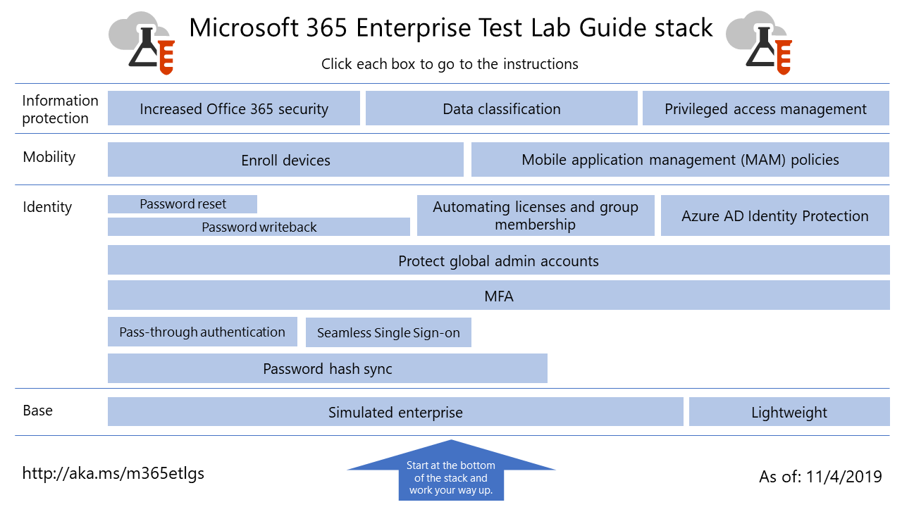

# Microsoft 365 Enterprise-testlabrichtlijnen

*Dit is van toepassing op Microsoft 365 Enterprise en Office 365 Enterprise.*

Met testlabrichtlijnen (TLG's) kunt u snel meer informatie krijgen over Microsoft-producten. Zij bieden instructies voor het configureren van vereenvoudigde maar representatieve testomgevingen. U kunt deze omgevingen gebruiken voor demonstratie, aanpassing of het maken van complexe testconcepten voor de duur van een proefabonnement of een betaald abonnement. 

TLG's zijn modulair ontworpen. Ze zijn op elkaar gebaseerd voor het maken van meerdere configuraties die beter aansluiten bij de behoeften van uw leer- en testconfiguratie. De 'Ik heb het zelf gebouwd en het werkt'-praktijkervaring helpt u om inzicht te krijgen in de implementatievereisten van een nieuw product of scenario. Hiermee kunt u zich beter voorbereiden voor het hosten in productie.

U kunt TLG's ook gebruiken om representatieve omgevingen te maken voor het ontwikkelen en testen van toepassingen, ook wel bekend als ontwikkel-/testomgevingen.
  

Klik op [Hier](../media/m365-enterprise-test-lab-guides/Microsoft365EnterpriseTLGStack.pdf) voor een visuele kaart voor alle artikelen in de stack van Microsoft 365 voor Enterprise-testlabrichtlijnen.

## Basisconfiguratie

Eerst maakt u een testomgeving voor [Microsoft 365 Enterprise](https://docs.microsoft.com/microsoft-365-enterprise/) waarin Office 365 Enterprise E5, Enterprise Mobility + Security (EMS) E5 en Windows 10 Enterprise zijn opgenomen. U kunt twee soorten basisconfiguraties maken:

- Gebruik de [lichtgewicht basisconfiguratie](lightweight-base-configuration-microsoft-365-enterprise.md) als u Microsoft 365 wilt configureren en demonstreren voor Enterprise-functies en-functionaliteit in een cloudomgeving die geen on-premises onderdelen bevat.

- Gebruik de [gesimuleerde Enterprise basisconfiguratie](simulated-ent-base-configuration-microsoft-365-enterprise.md) als u Microsoft 365 wilt configureren en demonstreren voor Enterprise-functies en-functionaliteit in een hybride cloudomgeving, die gebruikmaakt van on-premises onderdelen, zoals een Active Directory Domain Services-domein (AD DS).

U kunt ook testomgevingen voor Office 365 E5 maken door niet de Microsoft 365 E5-licentie toe te voegen aan uw proefabonnement of productietestomgeving.
    
## Identiteit

Zie voor meer informatie over identiteiten en functionaliteit:

- [Wachtwoord-hash-synchronisatie](password-hash-sync-m365-ent-test-environment.md)
  
   Wachtwoord-hash-synchronisatie inschakelen en testen vanuit een AD DS-domeincontroller.

- [Pass-through-verificatie](pass-through-auth-m365-ent-test-environment.md)
  
   Pass-through-verificatie inschakelen en testen vanuit een AD DS-domeincontroller.

- [Federatieve verificatie](federated-identity-for-your-office-365-dev-test-environment.md)
  
   Federatieve verificatie inschakelen en testen vanuit een AD DS-domeincontroller.

- [Microsoft Azure Active Directory naadloze SSO](single-sign-on-m365-ent-test-environment.md)
  
   Microsoft Azure Active Directory naadloze SSO inschakelen en testen vanuit een AD DS-domeincontroller.

- [Meervoudige verificatie](multi-factor-authentication-microsoft-365-test-environment.md)
  
   Meervoudige verificatie op een smartphone inschakelen en testen voor een specifieke gebruikersaccount.

- [Wereldwijde beheerdersaccounts beveiligen](protect-global-administrator-accounts-microsoft-365-test-environment.md)
 
   Vergrendel uw wereldwijde beheerdersaccounts met voorwaardelijke toegangsbeleid.

- [Wachtwoord write-back](password-writeback-m365-ent-test-environment.md)

   Wachtwoord write-back gebruiken om het wachtwoord van uw AD DS-gebruikersaccount in Microsoft Azure Active Directory te wijzigen.

- [Wachtwoordherstel](password-reset-m365-ent-test-environment.md)

   Selfservice wachtwoordherstel (SSPR) gebruiken voor het herstellen van uw wachtwoord.

- [Automatische licentie en groepslidmaatschap](automate-licenses-group-membership-microsoft-365-test-environment.md)

   Het beheren van nieuwe accounts is eenvoudiger dan ooit dankzij automatische licentieverlening en dynamisch groepslidmaatschap.

- [Azure AD Identity Protection](azure-ad-identity-protection-microsoft-365-test-environment.md)

   Uw huidige gebruikersaccounts scannen op beveiligingsproblemen.

- [Identiteit en apparaattoegang](identity-device-access-m365-test-environment.md)

   Een omgeving maken voor het testen van aanbevolen identiteits- en toegangsconfiguraties en regels voor voorwaardelijke toegang.

## Mobile Device Management

Zie voor meer informatie over de functies en functionaliteiten van Mobile Device Management:

- [Nalevingsbeleid voor apparaten](mam-policies-for-your-microsoft-365-enterprise-dev-test-environment.md)
    
   Een gebruikersgroep en nalevingsbeleid voor Windows 10-apparaten maken.
    
- [IOS- en Android-apparaten registreren](enroll-ios-and-android-devices-in-your-microsoft-enterprise-365-dev-test-environ.md)
   
   IOS- of Android-apparaten inschrijven en deze extern beheren.

## Gegevensbeveiliging

Zie voor meer informatie over beveiligingsfuncties en -functionaliteiten:

- [Verbeterde Office 365-beveiliging](increased-o365-security-microsoft-365-enterprise-dev-test-environment.md)
    
   Instellingen configureren voor verbeterde Office 365-beveiliging en ingebouwde beveiligingshulpprogramma's onderzoeken.
  
- [Gegevensclassificatie](data-classification-microsoft-365-enterprise-dev-test-environment.md)
    
   Office 365-labels op een document op een SharePoint Online-team site configureren en toepassen.
    
- [Privileged Access Management](privileged-access-microsoft-365-enterprise-dev-test-environment.md)
    
   Privileged Access Management configureren voor just-in-time-toegang tot verhoogde en bevoegde taken in uw Office 365-organisatie.

