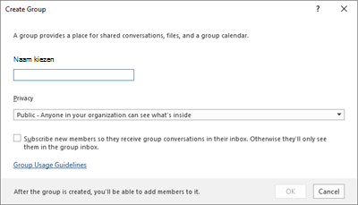
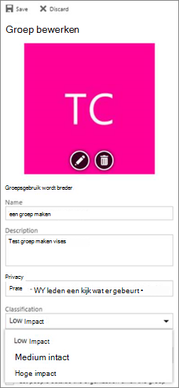

# <a name="manage-microsoft-365-groups-with-powershell"></a>Microsoft 365-groepen beheren met PowerShell

*Dit artikel is van toepassing op Microsoft 365 Enterprise en Office 365 Enterprise.*

In dit artikel vindt u de stappen voor het uitvoeren van veelvoorkomende beheertaken voor groepen in Microsoft PowerShell. De PowerShell-cmdlets voor groepen worden ook weergegeven. Zie [SharePoint Online-sites beheren met PowerShell](https://docs.microsoft.com/sharepoint/manage-team-and-communication-sites-in-powershell)voor informatie over het beheren van SharePoint-sites.

## <a name="link-to-your-microsoft-365-groups-usage-guidelines"></a>Koppeling naar richtlijnen voor het gebruik van Microsoft 365 groepen
<a name="BK_LinkToGuideLines"> </a>

Wanneer gebruikers [een groep in Outlook maken of bewerken](https://support.office.com/article/04d0c9cf-6864-423c-a380-4fa858f27102.aspx), kunt u een koppeling naar de gebruiks richtlijnen van uw organisatie weergeven. Als u bijvoorbeeld een specifiek voorvoegsel of achtervoegsel wilt toevoegen aan de naam van een groep.

Gebruik de PowerShell van Azure Active Directory (Azure AD) om uw gebruikers te laten verwijzen naar de richtlijnen voor het gebruik van uw organisatie voor Microsoft 365 groepen. Ga naar [Azure Active Directory-cmdlets voor het configureren van de groepsinstellingen](https://go.microsoft.com/fwlink/?LinkID=827484) en volg de stappen in het venster **instellingen maken op het niveau** van de gebruikers richtlijn. Wanneer u de AAD-cmdlet uitvoert, ziet gebruikers de koppeling naar uw richtlijnen wanneer ze een groep in Outlook maken of bewerken.




## <a name="allow-users-to-send-as-the-microsoft-365-group"></a>Gebruikers toestaan te verzenden als de Microsoft 365-groep
<a name="BK_LinkToGuideLines"> </a>

Als u uw Microsoft 365-groepen wilt inschakelen voor ' verzenden als ', gebruikt u de cmdlets [add-RecipientPermission](https://docs.microsoft.com/powershell/module/exchange/add-recipientpermission) en [Get-RecipientPermission](https://docs.microsoft.com/powershell/module/exchange/get-recipientpermission) om dit te configureren. Als u deze instelling inschakelt, kunnen gebruikers van Microsoft 365-groepen de webversie van Outlook of de webversie van Outlook gebruiken om e-mail te verzenden en te beantwoorden als de groep Microsoft 365. Gebruikers kunnen naar de groep gaan, een nieuw e-mailbericht maken en het veld ' verzenden als ' wijzigen in het e-mailadres van de groep.

([U kunt dit ook doen in het Exchange-Beheercentrum](https://docs.microsoft.com/office365/admin/create-groups/allow-members-to-send-as-or-send-on-behalf-of-group).)

Gebruik het volgende script, vervangen *\<GroupAlias\>* door de alias van de groep die u wilt bijwerken en *\<UserAlias\>* met de alias van de gebruiker aan wie u machtigingen wilt toekennen. [Maak verbinding met Exchange Online PowerShell](https://docs.microsoft.com/powershell/exchange/connect-to-exchange-online-powershell) om dit script uit te voeren.

```PowerShell
$groupAlias = "<GroupAlias>"
$userAlias = "<UserAlias>"
$groupsRecipientDetails = Get-Recipient -RecipientTypeDetails groupmailbox -Identity $groupAlias

Add-RecipientPermission -Identity $groupsRecipientDetails.Name -Trustee $userAlias -AccessRights SendAs
```

Nadat de cmdlet is uitgevoerd, kunnen gebruikers naar Outlook of de webversie van Outlook gaan om als groep e-mail te verzenden door het e-mailadres van de groep toe te voegen aan het veld **van** .

## <a name="create-classifications-for-microsoft-365-groups-in-your-organization"></a>Classificaties maken voor Microsoft 365-groepen in uw organisatie

U kunt met de gebruikers in uw organisatie tekstlabels labels maken die door gebruikers in uw organisatie worden ingesteld wanneer ze een Microsoft 365-groep maken. Als u groepen wilt classificeren, raden we u aan om beschikbare palletlabels te gebruiken in plaats van de eerdere classificatiefunctie voor groepen. Zie voor meer informatie over het gebruik van tekstlabels labels [gebruiken om de inhoud in Microsoft teams, Microsoft 365-groepen en SharePoint-sites te beveiligen](https://docs.microsoft.com/microsoft-365/compliance/sensitivity-labels-teams-groups-sites).

> [!IMPORTANT]
> Als u momenteel classificatie labels gebruikt, zijn deze niet langer beschikbaar voor gebruikers die groepen maken wanneer de functie gevoelige labels zijn ingeschakeld.

U kunt nog steeds de eerdere classificatiefunctie voor groepen gebruiken. U kunt classificaties maken die gebruikers in uw organisatie kunnen instellen wanneer ze een Microsoft 365-groep maken. U kunt bijvoorbeeld instellen dat gebruikers ' standaard ', ' Secret ' en ' beste geheim ' kunnen instellen voor groepen die ze maken. Groeps classificaties worden niet standaard ingesteld en u moet deze maken om de gebruikers in te stellen. Gebruik Azure Active Directory PowerShell om uw gebruikers te laten verwijzen naar de gebruiks richtlijnen van uw organisatie voor Microsoft 365 groepen.

Ga naar [Azure Active Directory-cmdlets voor het configureren van de groepsinstellingen](https://docs.microsoft.com/azure/active-directory/users-groups-roles/groups-settings-cmdlets) en volg de stappen in het venster **instellingen voor maken** om de classificatie voor Microsoft 365-groepen te definiëren.

```powershell
$setting["ClassificationList"] = "Low Impact, Medium Impact, High Impact"
```

Als u een beschrijving aan elke classificatie wilt koppelen, kunt u het kenmerk  *ClassificationDescriptions* van de instellingen gebruiken om te definiëren.

```powershell
$setting["ClassificationDescriptions"] ="Classification:Description,Classification:Description"
```

waarbij classificatie overeenkomt met de tekenreeksen in de ClassificationList.

Voorbeeld:

```powershell
$setting["ClassificationDescriptions"] = "Low Impact: General communication, Medium Impact: Company internal data , High Impact: Data that has regulatory requirements"
```

Nadat u de bovenstaande Azure Active Directory-cmdlet hebt uitgevoerd om uw classificatie in te stellen, voert u de cmdlet [set-UnifiedGroup](https://docs.microsoft.com/powershell/module/exchange/Set-UnifiedGroup) uit als u de classificatie voor een bepaalde groep wilt instellen.

```powershell
Set-UnifiedGroup <LowImpactGroup@constoso.com> -Classification <LowImpact>
```

U maakt een nieuwe groep met een classificatie.

```powershell
New-UnifiedGroup <HighImpactGroup@constoso.com> -Classification <HighImpact> -AccessType <Public>
```

Zie [Using PowerShell with Exchange Online](https://docs.microsoft.com/powershell/exchange/exchange-online-powershell) (PowerShell gebruiken met Exchange Online) en [Connect to Exchange Online PowerShell](https://docs.microsoft.com/powershell/exchange/connect-to-exchange-online-powershell) (Verbinding maken met Exchange Online PowerShell) voor meer informatie over het gebruik van Exchange Online PowerShell.

Nadat deze instellingen zijn ingeschakeld, kunnen de groepseigenaar een classificatie kiezen in de vervolgkeuzelijst in de webversie van Outlook en Outlook, en deze opslaan via de paginagroep **bewerken** .



## <a name="hide-microsoft-365-groups-from-the-global-address-list"></a>Microsoft 365 groepen verbergen in de algemene adreslijst.
<a name="BKMK_CreateClassification"> </a>

U kunt opgeven of een Microsoft 365-groep moet worden weergegeven in de algemene adreslijst (GAL) en in de andere lijsten van uw organisatie. Als u bijvoorbeeld een juridische afdeling hebt die u niet wilt weergeven in de adreslijst, kunt u ervoor zorgen dat de groep niet meer wordt weergegeven in de algemene adreslijst. Voer de cmdlet Set-Unified Group uit om de groep te verbergen in de adreslijst, zoals hier:

```powershell
Set-UnifiedGroup -Identity "Legal Department" -HiddenFromAddressListsEnabled $true
```

## <a name="allow-only-internal-users-to-send-message-to-microsoft-365-groups"></a>Instellen dat alleen interne gebruikers berichten mogen verzenden naar Microsoft 365-groepen
<a name="BKMK_CreateClassification"> </a>

Als u niet wilt dat gebruikers van andere organisaties een e-mailbericht verzenden naar een Microsoft 365-groep, kunt u de instellingen voor die groep wijzigen. Met deze optie kunnen alleen interne gebruikers een e-mailbericht sturen naar uw groep. Als een externe gebruiker een bericht naar die groep probeert te sturen, wordt dit genegeerd.

Voer de cmdlet Set-UnifiedGroup uit om deze instelling bij te werken, zoals hier:

```powershell
Set-UnifiedGroup -Identity "Internal senders only" -RequireSenderAuthenticationEnabled $true
```

## <a name="add-mailtips-to-microsoft-365-groups"></a>MailTips toevoegen aan Microsoft 365-groepen
<a name="BKMK_CreateClassification"> </a>

Wanneer een afzender een e-mailbericht naar een Microsoft 365-groep wil verzenden, kan er een MailTip worden weergegeven.

Voer de cmdlet Set-Unified Group uit om een mailTip aan de groep toe te voegen:

```powershell
Set-UnifiedGroup -Identity "MailTip Group" -MailTip "This group has a MailTip"
```

Met MailTip kunt u ook MailTipTranslations instellen, wat extra talen voor de MailTip opgeven. Stel dat u de Spaanse vertaling wilt gebruiken, en voer de volgende opdracht uit:

```powershell
Set-UnifiedGroup -Identity "MailaTip Group" -MailTip "This group has a MailTip" -MailTipTranslations "@{Add="ES:Esta caja no se supervisa."
```

## <a name="change-the-display-name-of-the-microsoft-365-group"></a>De weergavenaam van de Microsoft 365-groep wijzigen

De weergavenaam geeft de naam van de Microsoft 365-groep aan. U kunt deze naam zien in uw Exchange Admin Center of het Microsoft 365-Beheercentrum. U kunt de weergavenaam van de groep wijzigen of een weergavenaam toewijzen aan een bestaande groep Microsoft 365 door de opdracht set-UnifiedGroup uit te voeren:

```powershell
Set-UnifiedGroup -Identity "mygroup@contoso.com" -DisplayName "My new group"
```

## <a name="change-the-default-setting-of-microsoft-365-groups-for-outlook-to-public-or-private"></a>De standaardinstelling voor Microsoft 365 groepen voor Outlook wijzigen van openbaar naar persoonlijk
<a name="BKMK_CreateClassification"> </a>

Microsoft 365-groepen in Outlook worden standaard als privé gemaakt. Als uw organisatie Microsoft 365-groepen wil maken als standaard publiek (of terug naar privé), gebruikt u deze syntaxis voor de PowerShell-cmdlet:

 `Set-OrganizationConfig -DefaultGroupAccessType Public`

Als privé-instelling:

 `Set-OrganizationConfig -DefaultGroupAccessType Private`

Ga als volgt te werk om de instelling te controleren:

 `Get-OrganizationConfig | ft DefaultGroupAccessType`

Zie [set-OrganizationConfig](https://docs.microsoft.com/powershell/module/exchange/set-organizationconfig) en [Get-OrganizationConfig](https://docs.microsoft.com/powershell/module/exchange/get-organizationconfig)voor meer informatie.

## <a name="microsoft-365-groups-cmdlets"></a>Cmdlets voor Microsoft 365-groepen

De volgende cmdlets kunnen worden gebruikt met Microsoft 365 groepen.

|**Naam van cmdlet**|**Beschrijving**|
|:-----|:-----|
|[Get-UnifiedGroup](https://go.microsoft.com/fwlink/p/?LinkId=616182) <br/> |Gebruik deze cmdlet om bestaande Microsoft 365-groepen te zoeken en om eigenschappen van het groepsobject te bekijken.  <br/> |
|[Set-UnifiedGroup](https://go.microsoft.com/fwlink/p/?LinkId=616189) <br/> |De eigenschappen van een bepaalde Microsoft 365-groep bijwerken  <br/> |
|[New-UnifiedGroup](https://go.microsoft.com/fwlink/p/?LinkId=616183) <br/> |Maak een nieuwe groep Microsoft 365. Deze cmdlet biedt een minimale set parameters. Voor het instellen van waarden voor uitgebreide eigenschappen gebruikt u set-UnifiedGroup nadat u de nieuwe groep hebt gemaakt.  <br/> |
|[Remove-UnifiedGroup](https://go.microsoft.com/fwlink/p/?LinkId=616186) <br/> |Een bestaande Microsoft 365-groep verwijderen  <br/> |
|[Get-UnifiedGroupLinks](https://go.microsoft.com/fwlink/p/?LinkId=616194) <br/> |Gegevens voor lidmaatschap en eigenaar ophalen voor een Microsoft 365-groep  <br/> |
|[Add-UnifiedGroupLinks](https://go.microsoft.com/fwlink/p/?LinkId=616191) <br/> |Honderden of duizenden gebruikers, of nieuwe eigenaren, toevoegen aan een bestaande Microsoft 365-groep  <br/> |
|[Remove-UnifiedGroupLinks](https://go.microsoft.com/fwlink/p/?LinkId=616195) <br/> |Leden en eigenaren verwijderen uit een bestaande Microsoft 365-groep  <br/> |
|[Get-UserPhoto](https://go.microsoft.com/fwlink/p/?LinkId=536510) <br/> |Wordt gebruikt om informatie weer te geven over de foto van een gebruiker die is gekoppeld aan een account. Foto's van gebruikers worden opgeslagen in Active Directory  <br/> |
|[Set-UserPhoto](https://go.microsoft.com/fwlink/p/?LinkId=536511) <br/> |Wordt gebruikt om een gebruikers foto aan een account te koppelen. Foto's van gebruikers worden opgeslagen in Active Directory  <br/> |
|[Remove-UserPhoto](https://go.microsoft.com/fwlink/p/?LinkId=536512) <br/> |De foto voor een Microsoft 365-groep verwijderen  <br/> |

## <a name="related-topics"></a>Verwante onderwerpen

[Distributielijsten upgraden naar Microsoft 365-groepen](https://docs.microsoft.com/office365/admin/manage/upgrade-distribution-lists)

[Beheren wie Microsoft 365-groepen kunnen maken](https://docs.microsoft.com/office365/admin/create-groups/manage-creation-of-groups)

[Gasttoegang tot Microsoft 365-groepen beheren](https://support.office.com/article/bfc7a840-868f-4fd6-a390-f347bf51aff6)

[Dynamisch groepslidmaatschap wijzigen in](https://docs.microsoft.com/azure/active-directory/users-groups-roles/groups-change-type)
